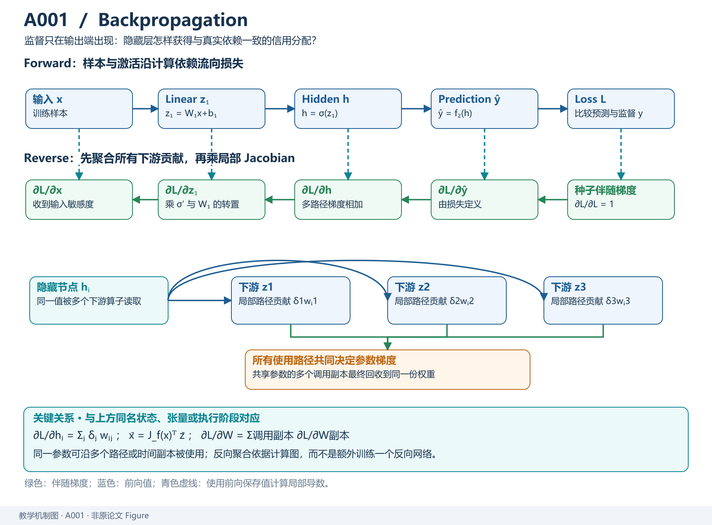
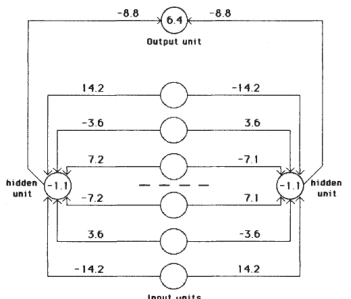
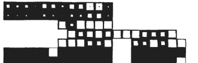
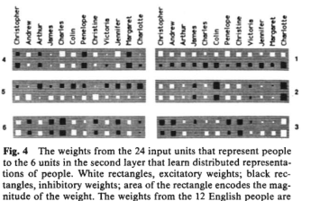
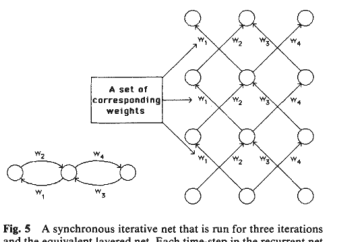
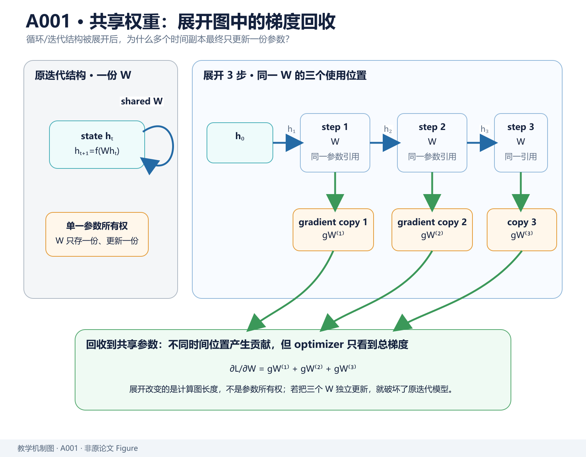
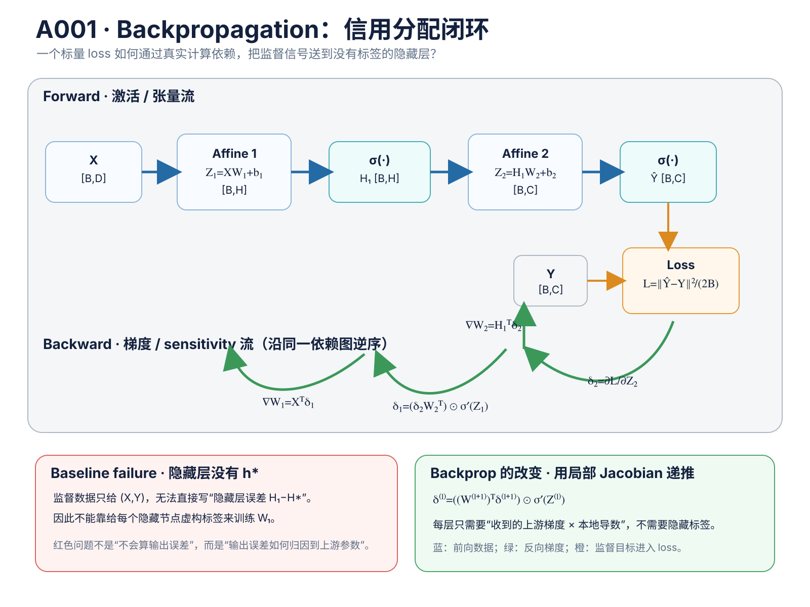

> **重制版 A001 / 原文段落精读 + 原始图像**：本篇已将原文 Fig.1–Fig.5 裁切入库，并在第七章按原文段落顺序分析论证链、用词和相邻段落衔接；技术推导与代码保留。公式必须使用 Markdown LaTeX，不将数学对象写成代码。

> **原文**：Rumelhart, Hinton & Williams, *Learning representations by back-propagating errors*, Nature 323, 533–536 (1986)。[出版页](https://doi.org/10.1038/323533a0) · [作者存档扫描 PDF（4 页）](https://www.cs.toronto.edu/~hinton/absps/naturebp.pdf)。本文对应 Paperlist A/01 第 1 篇。本文的批量张量、PyTorch 实现及复杂度分析属于现代教学扩展，不应误认为 1986 年原文已有这些接口。

# 模型定位与谱系

## 论文类型与问题边界

**主要类型：A 原始方法论文；次要属性：可微分计算的训练算法基础。** 判据是论文提出并示范一种针对多层、可学习隐藏表示的网络计算所有连接权重梯度的通用学习程序，并非推出一个带固定规模的「模型」，也不是优化 GPU 调度的系统工作。原文直接将与目标输出的差异写成平方误差，用前向计算和逐层向后传播的偏导数调整连接权重。[原文 pp. 533–535](https://www.cs.toronto.edu/~hinton/absps/naturebp.pdf)

**历史限定：** 链式法则不是这篇论文发明的，误差反传思想也有更早和同期的工作（原文提及 LeCun、David Parker 等）。这篇 1986 年 Nature 论文的重要贡献是清楚展示：借助反传，隐藏层的输入连接也可以按最终任务误差共同训练，从而**自动学习内部表示**。不要写成「神经网络直到 1986 年才第一次能求导」。

技术谱系应当沿解决问题的链路阅读：

~~~text
固定人工特征 → 单层感知机 / 输出层学习
                      │
                      ├─ 能学输出连接
                      └─ 隐藏特征的输入连接无法靠输出标签直接监督
                                     ↓
                     可微多层网络 + 链式法则
                                     ↓
                  误差从输出层反传至可学习隐藏层
                                     ↓
        端到端表示学习 → CNN / RNN / Transformer 等现代模型的训练基础
~~~

为什么需要它？若输入 $x$ 可以经可学习映射 $h=f_\phi(x)$ 产生特征，再由 $\hat y=g_\psi(h)$ 输出，训练集只有 `(x,y)`，没有「隐藏层正确答案」$h^\star$。只训练 $\psi$ 相当于固定特征；要调整 $\phi$，必须知道「隐藏单元的一点变化会通过后续层使最终损失改变多少」。反向传播计算的正是这个量。

## 在技术树中的位置

~~~text
机器学习
└── 神经网络训练
    ├── 计算图求导
    │   └── Reverse-mode Automatic Differentiation
    │       └── 链式法则实现的反向传播（本文）
    └── 参数更新（不同层次）
        ├── SGD / Momentum
        └── Adam / AdamW（后续两篇）
~~~

「反向传播」负责求 $\nabla_\theta L$，「SGD/Adam」负责利用梯度更新 $\theta$；不能把优化器与求导算法混为一谈。模型的前向架构也不同于训练算法：Transformer 的 Attention 并不是「反向传播的一种」。

*教学解释图｜从前向计算到误差反传，再到共享参数的梯度汇总，固定反向传播真正传递的对象。*

# 输入、输出与任务

## 从论文的逐样本网络转为现代张量记号

原文以单个输入—目标配对 `(x,d)` 解释层状网络，每个神经元接收低层输出的加权和，并通过可微非线性函数（论文示例为 sigmoid）产生输出。为了接到现代工程实现，定义批大小 $B$、输入维 $D$、隐藏宽度 $H$、输出维 $C$：

| 对象 | 定义 | Shape | 训练与推理 |
|---|---|---|---|
| 输入 | $X$ | `[B,D]` | 两者都有 |
| 第一层权重和偏置 | $W_1,b_1$ | `[D,H],[H]` | 两者都有 |
| 隐藏层前激活 | $Z_1=XW_1+b_1$ | `[B,H]` | 两者都有 |
| 隐藏表示 | $H_1=\sigma(Z_1)$ | `[B,H]` | 两者都有 |
| 第二层权重和偏置 | $W_2,b_2$ | `[H,C],[C]` | 两者都有 |
| 输出 | $\hat Y=\sigma(H_1W_2+b_2)$ | `[B,C]` | 两者都有 |
| 监督目标 | $Y$ | `[B,C]` | 仅训练 |
| 样本均方平方误差 | $L=\frac{1}{2B}\|\hat Y-Y\|_F^2$ | 标量 | 仅训练 |
| 梯度 | $\nabla_{W_1}L,\nabla_{W_2}L$ | 与各自参数同形 | 仅训练 |

这里的 $\sigma(z)=1/(1+e^{-z})$ 是原文的具体示例，不意味着所有现代网络都必须用 sigmoid。论文的损失对「所有输出单元及样本」求和；以上除以 $B$ 属于现代 minibatch 平均约定，改变的是总梯度比例，可用学习率吸收。

**优化对象**是训练样本上的输出误差；不是隐层单元值本身，更不是今天 LLM 的 token 交叉熵。推理只执行前向映射 $X\mapsto \hat Y$，不需要目标 $Y$、梯度或参数更新。

# 骨干架构与信息交互

## 原文五幅图：不是插图装饰，而是对应五种证据角色

以下 SVG 中内嵌的灰度位图是从作者公开存档的 **1986 年 Nature 论文扫描 PDF** 对原始 Fig.1–Fig.5 定位裁切的摘图，均已存入本项目 `figures/A001/`，没有使用现代重新绘制的图冒充原图。裁切只包含原图主体；图题、训练细节和图号解释见下方。版权归原出版方，供对照原文学习；[源 PDF pp.534–535](https://www.cs.toronto.edu/~hinton/absps/naturebp.pdf#page=2)。

### Fig.1：对称检测的内部权重——为什么它证明的是「特征发现」

**怎么读图：** 左右隐藏单元各接收八个输入单元；一对关于中心镜像的连接常出现大小相同、符号相反的权重。把一对输入都置为 1，则输入到隐藏单元的加权和可以接近零；仅激活其中一侧时，它不再被抵消。两个隐藏单元的非对称响应最终抑制输出，输出单元则在镜像条件下保留其正偏置响应。原图标在弧线上的数值是**训练后连接权重**，不是输入像素、注意力概率或可复现的现代标准差。

**作者为什么把它放在 Fig.1？** 因为这张图回答摘要里的「隐藏单元学到了什么」。假设只展示 64 种输入全做对，就不能区分网络是真利用了镜像结构还是机械记忆表；图中连接模式提供了可检查的机制解释。原文的单次训练需要 1,425 次数据集遍历；这一训练难度和如今模型推理的 1,425 次调用没有关系。

### Fig.2：两棵同构家谱——先让读者看见任务结构，才能谈表征泛化

**怎么读图：** 上面英语名字、下面意大利名字的家谱结构对应，而节点名称不同。训练输入用两个人物与关系描述构造三元组，要求网络补全第三项。可计算的“正确性”是预测合适人物或关系；作者关心隐藏层是否能在两个表面词形不同的数据子域之间重用相近结构。若没有 Fig.2，下一张激活热图读者无法判断为什么不同名字会形成相似活动模式。

### Fig.3：隐藏单元活动——从外部答案走到内部证据

**怎么读图：** 小方块灰度和面积编码网络单元激活，一部分输入位置表示人名，另一部分表示关系；中间各隐藏层与输出层继续组合这些激活。不同活动矩阵反映逐层表示重组，不能当作现代注意力热图。原文用一个关系样本展示内部活动路径；其作用是承接 Fig.2 中“任务的结构”，转向一个输入究竟如何流经多层网络。

### Fig.4：隐藏连接的特征分工——结构相同的名字怎样聚到一起

**怎么读图：** 横向排列的矩形按个体对应，白色/黑色表示不同符号的连接权重，矩形大小反映权重绝对值。部分隐藏单元更关注“出自英语家谱还是意大利家谱”，另一些更关注“所属世代或家族分支”。图示的概念不是所有人的向量完全一致，而是分布式表征把两棵家谱中的**同构关系**编码到共享的特征方向。作者把 Fig.4 与有限的 holdout 预测联系起来，为“内部结构能泛化”提供更丰富但仍有限的证据。

### Fig.5：展开迭代网络——从「层」转到「时间」必须保留共享权重

*教学解释图｜Shared Weight Unroll。*

**怎么读图：** 左侧是循环重复使用的同一组权重；右侧把三次迭代展开成等价的层状有向图，同名权重在多层**重复出现，但共享同一参数**。反向过程中每个展开时间位置产生一份梯度贡献，最后按照参数共享关系合并，而不是给原来同一条连接训练三套独立权重。原文将此图放在对称与家谱实验之后，承担的是“方法还可以推广到哪一类计算图”的角色；它不是前两个实验的另一个可视化结果。

## 整个计算图

~~~mermaid
flowchart TD
    X["X [B,D]"] --> Aff1["Z₁=XW₁+b₁"]
    Aff1 --> Sig1["H₁=sigmoid(Z₁) [B,H]"]
    Sig1 --> Aff2["Z₂=H₁W₂+b₂"]
    Aff2 --> Sig2["Ŷ=sigmoid(Z₂) [B,C]"]
    Sig2 --> Loss["L=||Ŷ-Y||²/(2B)"]
    Y["Y [B,C]"] --> Loss
    Loss -. "δ₂=∂L/∂Z₂" .-> Aff2
    Aff2 -. "δ₁=(δ₂W₂ᵀ)⊙σ'(Z₁)" .-> Aff1
~~~

逐模块理解：

1. **第一层仿射映射：** $X$ 乘 $W_1$，使第 $j$ 个隐藏单元综合所有输入坐标；若删掉这一层，不能学习输入特征组合。
2. **非线性激活：** $H_1=\sigma(Z_1)$；若完全去掉中间层的非线性，$(XW_1)W_2=X(W_1W_2)$，多个线性层仍相当于一个线性层，不能表达原文的非线性关系任务。
3. **输出层：** $H_1$ 进一步映射到目标输出 $\hat Y$，其形状要与 $Y$ 可比较。
4. **损失：** 把原本「哪个单元应该怎样变」的不确定性压缩成一个标量误差。
5. **反向路径：** 沿输出的依赖关系逆序计算各中间变量的偏导数；这是利用已存在的前向边，不是增加一个反向预测网络。

为什么不是给每个隐藏层也标注监督目标？因为这些特征通常是任务依赖的、没有已知标签；论文的要点正是让任务误差决定隐藏层应该学什么。

# 关键技术

## 1. 从单层梯度出发：输出层为什么容易学

对单个样本与第 $j$ 个输出神经元，定义

$$
z_j=\sum_i h_i w_{ij}+b_j,\qquad
\hat y_j=\sigma(z_j),\qquad
E=\frac12\sum_j(\hat y_j-y_j)^2.
$$

**符号说明：** $h_i$ 是上一层第 $i$ 个单元的输出，$w_{ij}$ 是从 $i$ 指向 $j$ 的权重，$b_j$ 是偏置；$y_j$ 是监督目标。目标是计算 $\partial E/\partial w_{ij}$。从损失到权重只有三条局部依赖：

$$
\underbrace{\frac{\partial E}{\partial w_{ij}}}_{\text{需要的梯度}}
=
\underbrace{\frac{\partial E}{\partial\hat y_j}}_{\hat y_j-y_j}
\underbrace{\frac{\partial\hat y_j}{\partial z_j}}_{\sigma(z_j)(1-\sigma(z_j))}
\underbrace{\frac{\partial z_j}{\partial w_{ij}}}_{h_i}.
$$

由链式法则得到

$$
\frac{\partial E}{\partial w_{ij}}
=(\hat y_j-y_j)\hat y_j(1-\hat y_j)h_i.
$$

把重复出现的「对前激活的导数」命名为

$$
\delta_j\equiv\frac{\partial E}{\partial z_j}
=(\hat y_j-y_j)\sigma'(z_j),
\qquad
\frac{\partial E}{\partial w_{ij}}=h_i\delta_j.
$$

$\delta$ 是**损失对某节点前激活的敏感度**，不是「预测误差」$\hat y-y$ 本身；二者之间差着激活函数导数。这也解释了饱和 sigmoid 的问题：当 $\sigma'(z)\approx0$，即使预测误差不小，局部梯度仍会衰减。

## 2. 隐藏层没有标签，却能准确获得梯度

最自然但有问题的想法：从最终输出误差直接减去一个隐藏层目标。问题是训练数据并未给出 $h^\star$，无法计算 $h-h^\star$。反向传播不需要虚构这个目标，它把后层的梯度沿真实计算依赖传回来。

*教学解释图｜Credit Assignment Flow。*

对隐藏单元 $i$，先问「它的输出 $h_i$ 增加一点，会影响哪些后层前激活？」因为

$$
z_j=\sum_i h_iw_{ij}+b_j,
\qquad
\frac{\partial z_j}{\partial h_i}=w_{ij},
$$

而 $h_i$ 通常同时连接多个下游单元 $j$，多路径链式法则给出：

$$
\frac{\partial E}{\partial h_i}
=\sum_j
\underbrace{\frac{\partial E}{\partial z_j}}_{\delta_j}
\underbrace{\frac{\partial z_j}{\partial h_i}}_{w_{ij}}
=\sum_j \delta_j w_{ij}.
$$

再通过当前层非线性：

$$
\delta_i=\frac{\partial E}{\partial z_i}
=\frac{\partial E}{\partial h_i}\frac{\partial h_i}{\partial z_i}
=\sigma'(z_i)\sum_j w_{ij}\delta_j.
$$

最后用前一层输出 $a_k$ 更新输入连接：

$$
\boxed{\frac{\partial E}{\partial w_{ki}}=a_k\delta_i}.
$$

这三行分别对应原文的「求输出单元敏感度 → 沿连接累加回传 → 更新隐藏连接」，见 [原文 p.534 公式 (4)–(6)、p.535 公式 (7)–(8)](https://www.cs.toronto.edu/~hinton/absps/naturebp.pdf)。重要的是**相加所有下游路径**：一个隐藏特征若被多个输出共同使用，反向信号是这些使用路径的综合作用。

对任意深度，令 $a^{(\ell)}=\sigma(z^{(\ell)})$、$z^{(\ell)}=W^{(\ell)}a^{(\ell-1)}+b^{(\ell)}$（此处采用列向量单样本记号），递推为

$$
\delta^{(L)}=(a^{(L)}-y)\odot\sigma'(z^{(L)}),
$$
$$
\delta^{(\ell)}
=\bigl((W^{(\ell+1)})^\top\delta^{(\ell+1)}\bigr)
 \odot\sigma'(z^{(\ell)}),
$$
$$
\nabla_{W^{(\ell)}}E
=\delta^{(\ell)}(a^{(\ell-1)})^\top,
\qquad
\nabla_{b^{(\ell)}}E=\delta^{(\ell)}.
$$

留意上一节批量写作 $XW$，此处为了对应传统教科书与原文单神经元表达改用列向量 $Wx$；两者互为转置，不能把两套矩阵方向混用。

## 3. 手算一次：一条输入路径如何收到最终输出误差

最小两层网络取 $x=2$、$w_1=0.5$、$b_1=0$、$w_2=1$、$b_2=0$、$y=1$：

*教学解释图｜Multipath VJP。*

$$
z_1=2(0.5)=1,\quad
h=\sigma(1)\approx0.73106,
$$
$$
z_2=1\cdot h\approx0.73106,\quad
\hat y=\sigma(z_2)\approx0.6750.
$$

平方损失 $E=\tfrac12(\hat y-1)^2\approx0.0528$。反传到输出前激活：

$$
\delta_2=(0.6750-1)\times0.6750(1-0.6750)\approx-0.0713.
$$

输出权重收到梯度 $\partial E/\partial w_2=\delta_2h\approx-0.0521$；隐藏前激活收到梯度

$$
\delta_1=w_2\delta_2\,h(1-h)
\approx1(-0.0713)(0.1966)\approx-0.0140.
$$

因此 $\partial E/\partial w_1=\delta_1x\approx-0.0280$。若学习率 $\eta=0.1$，梯度下降把 $w_1$ 从 `0.5` 调至约 `0.5028`。这个增加有解释：网络当前输出 `0.675` 小于目标 `1`，增加正的上游权重会增加隐藏激活，继而提高输出。**这里没有人告诉隐藏层目标是 0.8 还是 0.9；方向完全由最终损失传回。**

## 4. 原文的参数更新、表示学习与现代自动微分的差异

原文 p.535 公式 (8) 在所有案例上累积导数后做 $\Delta w=-\varepsilon\,\partial E/\partial w$，也介绍逐案例更新；公式 (9) 还展示把前一步的参数变化加入更新的加速方式，即早期动量思想。注意「误差梯度」与「更新规则」仍是两个环节。

将所有可微算子记录为有向无环计算图时，每个算子只需要提供一个 **vector–Jacobian product（VJP）**：

$$
\bar x=\left(\frac{\partial z}{\partial x}\right)^\top\bar z,\qquad
\bar z=\nabla_z E.
$$

这里 $\bar x$ 是损失对该算子输入的伴随梯度，$\bar z$ 是收到的输出伴随梯度。矩阵乘、加法、激活等算子各自完成局部 VJP；PyTorch `autograd` 的基本组织方式正是这一思想。原文具体描述的是层状网络及权重，**并没有提出 PyTorch 或现代通用计算图 API**。

## 5. 最小可执行 PyTorch：手写反传与 autograd 对照

下面明确设置双精度，手算两个线性层的 VJP，再与框架自动微分核对；复制到一个已安装 PyTorch 的环境即可运行：

~~~python
import torch

torch.manual_seed(7)
X = torch.randn(3, 2, dtype=torch.float64)           # [B=3, D=2]
Y = torch.rand(3, 1, dtype=torch.float64)            # [B=3, C=1]
W1 = torch.randn(2, 4, dtype=torch.float64, requires_grad=True)
b1 = torch.zeros(4, dtype=torch.float64, requires_grad=True)
W2 = torch.randn(4, 1, dtype=torch.float64, requires_grad=True)
b2 = torch.zeros(1, dtype=torch.float64, requires_grad=True)

Z1 = X @ W1 + b1                                    # [3,4]
H1 = torch.sigmoid(Z1)                              # [3,4]
Z2 = H1 @ W2 + b2                                   # [3,1]
P = torch.sigmoid(Z2)                               # [3,1]
loss = 0.5 * ((P - Y) ** 2).sum() / len(X)           # scalar

delta2 = ((P - Y) / len(X)) * P * (1 - P)           # [3,1]
gW2 = H1.T @ delta2                                 # [4,1]
gb2 = delta2.sum(0)                                 # [1]
delta1 = (delta2 @ W2.T) * H1 * (1 - H1)            # [3,4]
gW1 = X.T @ delta1                                  # [2,4]
gb1 = delta1.sum(0)                                 # [4]

loss.backward()
for manual, automatic in [(gW1, W1.grad), (gb1, b1.grad),
                          (gW2, W2.grad), (gb2, b2.grad)]:
    torch.testing.assert_close(manual, automatic)
print("all four gradients match autograd")
~~~

逐行对应：`X,Y` 是监督数据；$W_1,b_1,W_2,b_2$ 分别是可学习连接和偏置；$Z_1,H_1,Z_2,P$ 就是前向图中的四个张量；$loss$ 实现 $\frac{1}{2B}\sum(\hat y-y)^2$；`delta2` 把损失对预测值的导数乘上输出 sigmoid 导数；`H1.T @ delta2` 对 batch 累计每条 $h_i\delta_j$；`delta2.sum(0)` 对偏置求和；`delta1` 先乘 $W_2^\top$ 汇总下游路径，再乘隐藏层激活导数；`X.T @ delta1` 求输入连接梯度；$gb1$ 汇总隐藏偏置梯度；最后的 `backward` 与四组 $assert_close$ 核实方向、Shape 与缩放。若改用 `loss.mean()`，须检查是否改变了输出维 $C$ 的缩放约定。

## 6. 原文实验到底证明了什么

| 原文实验 | 被检验的问题 | 观察与证据边界 |
|---|---|---|
| Fig.1：镜像对称识别；64 种输入、1,425 次遍历 | 隐层是否能学出手工未标注的「输入两端是否对称」组合特征？ | 学到两组对称相关的隐藏连接并抑制非对称输入。是可解释表示的案例，不是大规模图像泛化实验。 |
| Fig.2–4：两棵结构同构的英/意家谱，100/104 个可能关系三元组训练 | 隐层能否利用任务共享结构，对未训练的组合做推断？ | 原文报告剩余四个三元组的正确泛化，并显示隐藏单元的分布式编码；不意味着对任意新家谱或任意结构都能零样本推理。 |
| Fig.5：把迭代网络展开为分层网络 | 同一组权重在时间重复使用时，如何传播误差？ | 图示循环展开后需对同一权重的不同时间副本累积梯度；它是后续 BPTT 思路的结构关系，不是现代 RNN 性能对比。 |

[以上实验与图示：原文 pp.534–535](https://www.cs.toronto.edu/~hinton/absps/naturebp.pdf)。原文无现代随机种子复现实验、多个大型数据集的统计显著性检验或与 Transformer 的消融，不能把后来的深度学习结果追认成本文实验。

**代价与局限：** 前向图必须可微或有合适的梯度替代；需要保留或重算供反传使用的激活；梯度可能消失或爆炸；非凸优化无全局最优保证。原文明确承认当时的程序不构成生物大脑学习的可信模型——算法正确性与生物合理性是两件事。

# 预训练与后训练

**本论文不提出预训练、SFT、偏好学习或 RLHF。** 这些是如何构造训练数据与目标函数的阶段；反向传播是给定一个可微目标后求参数梯度的底层机制。

对于现代语言模型，可把它放在如下位置：

~~~text
原始 Token / 图文 / 机器人数据
           ↓
选择训练阶段和损失：LM CE / SFT CE / Preference / RL ...
           ↓
前向：模型将输入映射到预测及损失
           ↓
反向传播：损失 → 每个可微模块的梯度  ← 本文对应的位置
           ↓
优化器：SGD / Adam / AdamW
           ↓
更新后的模型
~~~

反传是否适用于 PPO？**只对采样后构造的可微 surrogate loss 求导**；环境奖励、采样出来的离散 action 不能简单当作可微路径穿过去，Policy Gradient 需要先推导其估计器。这进一步说明「反向传播」不等于一种特定训练目标。

# 推理与部署

推理仅使用前向图：例如上面的两层网络，主要矩阵计算量约为 $O(BDH+BHC)$；不保存梯度，也不执行 `delta1/delta2`。对于训练，线性层的前向、反传输入梯度和权重梯度在数量级上都涉及对应矩阵乘法，因此总计算量仍为相同阶数、但常数明显增加；需保存/重算激活（此例 `[B,H]` 与各前激活），参数本身不因反传改变 Shape。

**Prefill、Decode、KV Cache、连续批处理、分布式推理调度不属于 1986 年论文研究对象。** 当今 Transformer 的 Prefill/Decode 推理不需保留整张训练计算图，而训练时为了反传需要激活及梯度存储；是否采用 activation checkpointing 是现代系统权衡，不是本文提出的技术。训练激活占用与模型参数、优化器状态要分别统计，不能把「反传额外显存」全算成 KV Cache。

## 技术 → 模型（带关系的知识索引）

- `Backpropagation → 本文`：`PROPOSES` 面向可学习隐藏表示的分层误差反传程序（非声称首次发现链式法则）。
- `Backpropagation → Transformer`：`ADOPTS`，训练其 Attention / FFN 参数时沿计算图反传；模型的前向架构出自 [Attention Is All You Need](https://arxiv.org/abs/1706.03762)，不是本文所提出。
- `Backpropagation → LoRA 适配的 Transformer`：`ADOPTS`，仅允许被指定的低秩矩阵接收/应用参数梯度；参见 [LoRA](https://arxiv.org/abs/2106.09685)。这是现代工程关系，并非 1986 年论文提出 LoRA。

## 模型 → 技术（反向索引）

- `1986 层状网络`：`PROPOSES` 有监督误差反传；`IMPLEMENTS` 可微 sigmoid、平方误差、按层梯度下降。
- `Transformer`：`ADOPTS` 链式求导反传作为训练手段；`IMPLEMENTS` Attention/FFN/残差的复杂计算图。不要把 `ADOPTS` 误写成 `PROPOSES`。
- `LoRA-adapted Transformer`：`ADOPTS` 反传与低秩参数化；`EXTENDS` 可训练参数的选择策略（由 LoRA 提出，而非本文）。

**本篇的工程验收问题：** 不调用 `loss.backward()`，你能否写出 $dW_1$ 并解释为什么必须先计算 `delta2 @ W2.T`？能够区分「向后累计导数」和「用优化器更新」才算真正理解本篇。

# 论文细读

## 从摘要到结论：逐段追踪论证与措辞

> **阅读范围**：Nature 323, 533–536，作者的文章在 p.533 下半页开始，p.536 左栏末尾结束；同一期相邻的氨基酸和小猫视觉论文**不是本文**。下面按作者实际叙述次序切分论证段，而非按现代教程章节重新排列。每个单元说明它承担的修辞任务、解决读者哪项疑问、以及为什么下一段必须紧接着出现。段意用中文重新表述，不大段复制英文原文。[扫描原文](https://www.cs.toronto.edu/~hinton/absps/naturebp.pdf#page=1)

### p.533 摘要：先交代可观察的训练行为，再上升到表示学习

**段落 A0：摘要前半——“调整连接权重，使实际输出接近目标输出”。** 这句话把学习过程转化为一个能计算、能反复执行的程序：必须存在实际输出、期望输出及可量化的距离。它没有一上来宣称网络会“理解知识”，避免把尚未证明的表示能力当作技术起点。这里的关键词不是网络规模，而是 *repeatedly adjusts*：学习需要多次通过样本和逐步减少误差；后文公式 (3)、(8) 正好兑现这两个动词。

**段落 A1：摘要后半——“隐藏单元最终编码任务特征”。** 从上一句的输出误差降到任务领域结构，这是一次关键的论证跳跃：作者真正想证明的不止是输入到输出拟合，而是没有直接监督的内部单元可以自动形成有用特征。读者自然会追问：既然训练集没有给隐藏单元标签，它们为什么会朝正确方向变化？正文第一段立即接过这个疑问。与感知机对比的落点也在这里：旧方法对输出层的连接权重有学习规则，却通常把中间特征当成人工固定的输入变换。

### p.533 正文第一段：把历史工作的共同愿望写成一个明确缺口

**段落 B1：自组织网络的目标与学习任务的数据形态。** 作者先把研究背景限定为：想让任意连接网络从有监督输入–输出样本中自行构造内部结构。若输出单元直接连接输入单元，逐步改变连接权重相对容易；一旦加入隐藏单元，任务没有指定它们应当处于何种状态。写作安排很讲究：先用简单情形确立“输出误差提供了什么监督”，再指出隐藏层丢失了哪类监督，因此读者知道方法必须补上什么，而不只是记住一个算法名称。

**段落 B2：感知机中的特征分析器并非真正“学习到的隐藏表示”。** 作者进一步澄清概念：某些旧网络虽然也有输入与输出之间的特征提取器，但其输入连接是手工确定的，不能随任务误差训练。因而“网络中出现中间节点”不足以构成本文的贡献；决定性条件是这些节点所依赖的参数也能从终端误差获得更新信号。这一步为“反向传播”的必要性立下标准。

**段落 B3：提出通用学习程序，并以最简单的分层前馈网络为解释对象。** 到这里作者才定义网络：输入层、任意多的中间层、输出层；允许层间跨越某些层，禁止本层连接和从高层回低层的循环。为什么限制结构？因为要先让正向状态求值与反向求导拥有清晰的有向顺序。论文不是声称循环网络不能训练；到 Fig.5 又专门把重复使用权重的迭代网络展开为层状计算图，说明更复杂结构如何纳入同一思想。

**段落 B4：方程 (1)，单元输入是下层输出的加权和。** 这行很朴素，却为后文反向传播提供了局部导数：一个连接权重微变时，当前单元前激活的改变量与上游激活成比例。作者同时讲偏置可以建模为一个永远输出 1 的额外输入节点；这个写法把偏置导数与普通权重导数统一起来。叙事上先固定仿射层的可导结构，下一段才能对输出应用非线性。

**段落 B5：方程 (2)，使用 sigmoid 产生实际单元输出。** 引入连续可微非线性不是装饰：作者需要一个既能表达非线性组合、又能计算 $\partial y/\partial x$ 的函数。若全网只是线性映射，叠加更多层也未必带来本文所强调的特征组合能力；若激活是不可微硬阈值，后文常规链式法则又不能直接照搬。作者选 sigmoid 是为了当时的可微示范，而非宣布它永远优于后来的 ReLU/GELU。

### p.534 左栏：在讲算法前，先告诉读者要压低什么误差

**段落 C1：其他可微非线性也可使用；线性求和加非线性使推导简洁。** 这是对前一段的限定，防止读者把贡献误解为专门设计 sigmoid。作者真正依赖的数学前提是局部映射可导、层间依赖可追踪，而不是某个特殊激活名字。

**段落 C2：方程 (3)，对所有样本与所有输出单元构造平方误差。** 前文只规定网络怎么从输入得到输出；现在必须把“学习得好不好”变成标量。平方损失对实际输出求导可以得到一个很简单的残差，后面公式 (4) 直接调用它。作者在此交代两个求和下标（案例和输出单元），是为下一段解释“总梯度等于逐案例梯度求和”埋伏笔；不应提前把它改写成现代 token cross-entropy 再倒推原文。

**段落 C3：指出求导可以拆成正向、反向两遍。** 正向计算每一层节点状态，这些状态决定输出损失；反向从最后一层开始，把“误差对节点状态敏感度”逐层传回。修辞作用是先给读者算法框架，避免接下来四个导数公式看起来只是孤立代数。对中间变量求导并缓存，重复使用结果，比对每个权重分别从头展开整张链式法则更有效。

### p.534 右栏 → p.535 右栏：从输出层梯度到隐藏层梯度，一步也不能跳

**段落 D1：方程 (4)，输出单元误差对其实际输出的导数。** 它只使用平方误差，不依赖网络深度；因此是整条反向链的边界条件。这里先对输出 $y_j$ 求导，而不是直接对早期权重求导，体现作者有意识地选择中间“接口变量”。

**段落 D2：方程 (5)，通过 sigmoid 导数把梯度从单元输出移到单元总输入。** 网络权重线性作用于前激活 $x_j$，故下一步若要求权重梯度，就必须知道 $\partial E/\partial x_j$。文章明确写链式法则再代入 sigmoid 的导数，使每一项都有物理/计算上的对应位置。这就是现代自动微分的局部 VJP 思路，尽管 1986 年文章本身没有现代框架术语。

**段落 D3：方程 (6)，某条连接权重的梯度等于上游激活乘下游敏感度。** 此时读者可以验证输出层权重终于可训练了；但若在这里停笔，本文只重述单层可微网络的学习规则。作者顺势提出还需要知道一个隐藏输出如何影响多个下游单元，为下一页的多路径求和公式搭桥。

**段落 D4：p.535 方程 (7)，把同一隐藏单元所有下游连接的贡献相加。** 单个隐藏节点通常扇出到许多单元。它的输出改变量可能使某些输出误差增大、使另一些减小，因此不能只沿一条边向回传播。方程 (7) 的求和符号是整篇文章的概念核心：局部导数被有效地复用，并将来自**所有路径**的任务压力汇合成隐藏层更新方向。随后再次使用方程 (5)、(6) 的局部规则，就能逐层递归地处理任意深度网络。

**段落 D5：方程 (8)，累计所有样本梯度后使用梯度下降。** 作者终于从“可以求导”走到“可以学习”。前面推导的 $\partial E/\partial w$ 是当前参数应该朝哪个方向变化的估计；乘以负学习率才成为具体权重更新。把这两个逻辑步骤分开，是为了让后续替换优化器仍能保留同一反传程序。

**段落 D6：方程 (9)，加入上一轮更新的指数衰减项。** 它不是求导公式的一部分，而是对迭代优化速度的工程改良。作者指出基本梯度下降易实现、可并行，但不一定比利用二阶信息的方案收敛快；在此插入动量思想，回应“反传可算，但训练效率呢”的自然质疑。今天对它可联系 momentum，但不能把 1986 年的符号与现代 Adam 一阶矩机械混为一谈。

### p.535 实验与讨论：为什么作者先选极小的对称任务，再选结构性泛化任务？

**段落 E1：承认已有独立或同期研究，继而提出对称性检测。** 作者没有把链式法则的思想归功于一个孤立发明；紧接着选择极小的镜像判别，原因是“隐藏表示到底学会了什么”在该问题上可以直接检查连接权重的正负和对称关系。仅证明训练误差变小并不足以兑现摘要对表示学习的承诺。

**段落 E2：Fig.1 的结果先解释两组反对称权重，后解释为什么它们能检测镜像。** 对称输入在某个隐藏单元里可能让大小相同、符号相反的左右连接贡献相互抵消；非对称输入无法抵消，隐藏状态因而变化。此处的图是**机制证据**：它展示隐藏层自己构造了一种任务相关的内部比较器，避免只靠准确率主张“模型学到表示”。

**段落 E3：将问题升级为两棵同构家谱中的关系补全。** 镜像检测可能让读者怀疑只学到简单代数模式；家谱任务让同一关系结构用两套不同名字呈现，迫使网络学习“相似结构”而不是记住具体人物字符串。Fig.2 首先可视化任务中的同构关系，随后 Fig.3、Fig.4 展示隐藏层的实际活动与连接权重，这是从数据关系到内部机制的证据链。

**段落 E4：交代泛化测试、权重衰减与防止平凡输出的训练判据。** 作者只留了少量未训练关系用于测试，同时用衰减等训练设置约束模型；如果省略这些细节，读者就会把训练集上的拟合当成结构推理的独立证据。文章把 Fig.4 的内部表征与测试正确性放在同一段，意在把“隐藏单元聚合了家谱结构”与“模型能补全没见过的关系”连接起来。但只测少量 holdout 不等于已证明现代统计意义上的稳健 OOD 泛化。

**段落 E5：Fig.5 把迭代网络展开为有对应权重的层状网络。** 这段从结果展示回到适用范围：如果每个迭代时间步都可看作一个展开层，就可以沿展开图反传，并对各时间副本共享的权重梯度求和。两个额外条件不可漏掉：前向必须保存足够状态供反向使用；共享权重不能分别独立更新而破坏迭代网络的参数一致性。它是后续 BPTT 思想的重要形式关系，但本文没有今天完整的 RNN 框架。

**段落 E6：讨论非凸局部极小值，以及算法与生物学习机理的距离。** 作者在证明案例有效之后，明确缩小结论适用范围：误差曲面可能存在局部极小值；本方法也不构成可信的真实大脑学习模型。为什么最后补这一段？因为论文正文刻意采用类似神经元的术语，读者容易误读为生物机制主张；作者用局限段把数学上可操作、实验上有效、神经科学上可信三种证据等级切开。

### 连起来重读全文：一条完整的作者论证链

`目标输出可监督 → 隐藏单元没有直接监督 → 选择可微分层结构 → 定义可量化误差 → 输出层链式法则 → 沿全部下游路径给隐藏层分配梯度 → 更新权重 → 可视化隐藏特征 → 检查结构泛化 → 推广到展开的迭代网络 → 陈述局限`。

注意这里所谓「为什么这样写」，是从作者的段落衔接与技术依赖关系进行**文本分析**，不是声称知道作者未公开的心理意图。如果删除任意桥接环节，读者都会遇到一个悬而未决的问题：没定义可微映射就不能推导梯度，没引入多路径求和就不能训练隐藏层，只有训练损失下降则不足以支撑“学到内部表示”的命题。
