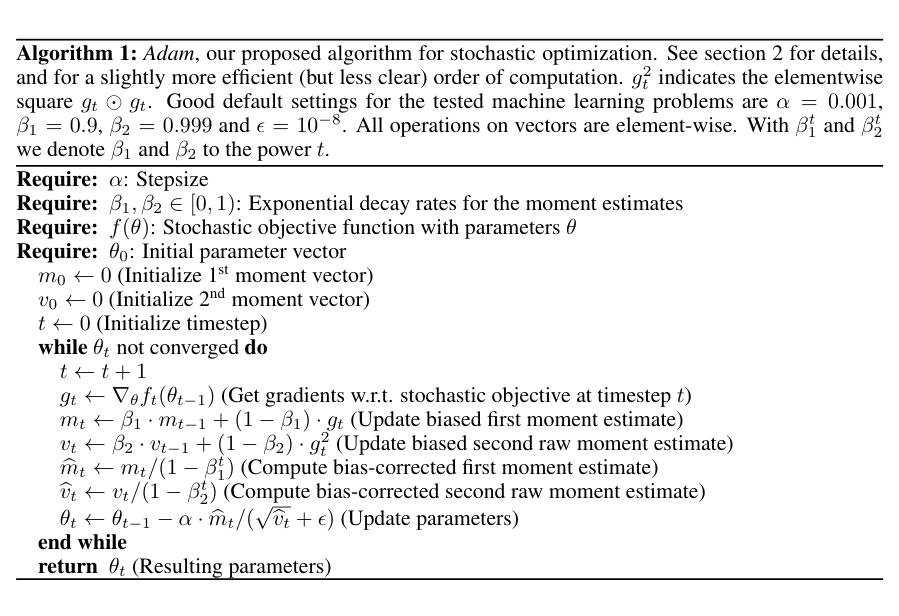
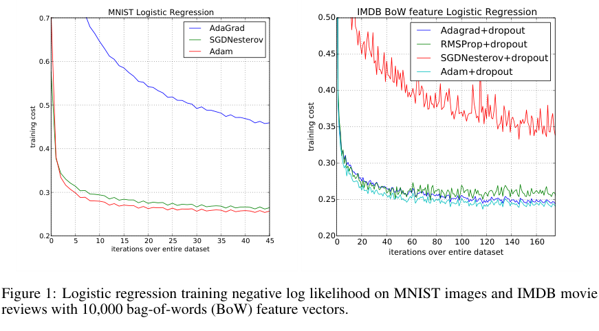
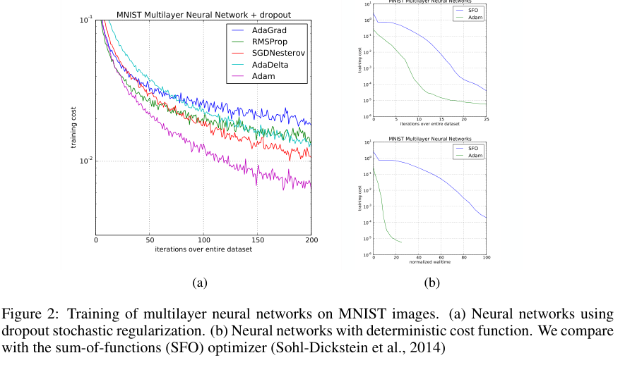
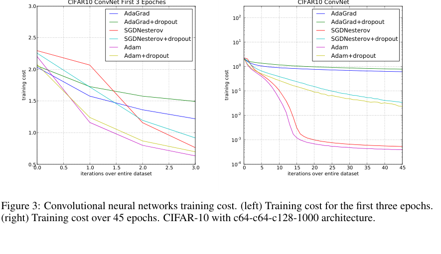
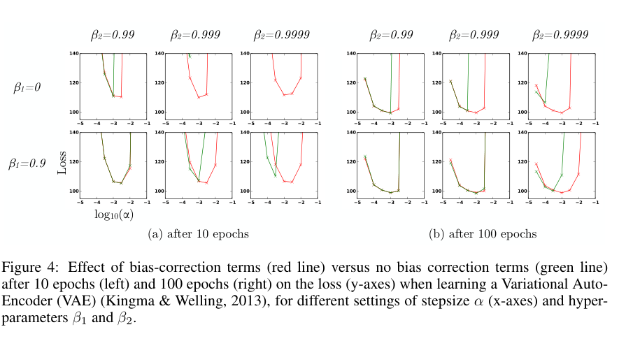

> **V2 重写 · A002 / Paperlist 第 2 篇**。原论文：Diederik P. Kingma、Jimmy Ba，[*Adam: A Method for Stochastic Optimization*](https://arxiv.org/abs/1412.6980)，ICLR 2015；本文逐页以 [arXiv v9，2017-01-30](https://arxiv.org/pdf/1412.6980) 为准，原件保存于 `sources/A002-adam-v9.pdf`（15 页）。主文 pp.1–9；附录 pp.10–15。本篇采用原作者 Algorithm 1 和 Fig.1–4 的局部裁图；裁图坐标及来源见 `figure_manifests/A002.json`。图像版权属于相应权利人，图示仅供本项目研究批注，公开发布前须复核许可。
>
> **重要限定**：本篇第七章逐段分析主文 Abstract–§6 与结论的关键论证自然段、关键算法和图注；未将附录每一个证明自然段冒充已细读。论文声称的收敛上界须结合 2018 年 Reddi 等人的反例阅读，不把历史论文的证明视为今天无条件成立的结论。公式均为标准 Markdown 数学，反引号仅用于源代码、文件路径与真实 API 名称。

# 模型定位与谱系

## 不是新网络，而是「拿到梯度以后怎样走下一步」

假设已经通过反向传播得到了当前 minibatch 对参数的随机梯度。学习率应该只由一个全局标量控制，还是应该按**各参数坐标近期收到的梯度信息**分别调整？这是 Adam 解决的问题。它不改变神经网络的层、Attention 的注意力概率或者预测目标；它是在训练的参数更新环节，把一阶矩与二阶**原始矩**的指数滑动平均组合起来，并修正两组平均值从零初始化造成的缩放偏差。

在技术树中，本文的主定位是 **A 原始方法论文：随机一阶优化 → 自适应坐标步长 → Adam**。其两条直接来源不是「反向传播的不同版本」，而是先前的自适应优化技术：

- AdaGrad：累计历史梯度平方，针对很少出现的坐标保留相对较大的有效学习率；代价是历史统计不遗忘，可能随训练推进不断压低步长。
- RMSProp：用指数平均代替累加，能在非平稳梯度环境中逐渐淡忘很久以前的统计；但其未修正零初始化造成的早期尺度失真。Momentum 则提供一阶方向平滑，但与先缩放梯度再动量的 RMSProp 变体有运算次序差别。

本文将两组统计分开追踪：

\[
m_t=\beta_1m_{t-1}+(1-\beta_1)g_t,\qquad
v_t=\beta_2v_{t-1}+(1-\beta_2)g_t^{\odot 2}.
\]

这里前者估计梯度均值、后者估计梯度平方的原始二阶矩，而**不是 Hessian 或中心化方差**。作者的「adaptive moment estimation」命名由此产生。后来的 AdamW 针对权重衰减在自适应优化器中的位置提出解耦；AMSGrad 则针对 Adam 原始收敛分析的具体问题修改二阶历史量。它们是时间上不同的后续工作，不能回写成本文的贡献。

本篇阅读有两条并行主线：第一条是**算法数学主线**，看零初始化、逐坐标更新与复杂度；第二条是**论文论证主线**，看作者怎样从摘要里的多个优点，逐段过渡到 Algorithm 1、偏差修正证明，再用四组不同实验分别支持部分主张。

## 总结架构图

> **教学总结图**：Adam 用一阶矩追踪方向、二阶矩追踪尺度，并通过偏差校正形成自适应步长。

# 输入、输出与任务

## 精确定义一轮优化的接口

令 \(\theta_{t-1}\in\mathbb R^P\) 为更新前参数，\(P\) 为可训练参数总数；\(f_t(\theta)\) 是训练第 \(t\) 步抽到的数据子集或其他随机性对应的损失实现，真实目标是降低 \(\mathbb E[f_t(\theta)]\)。参数梯度为

\[
g_t=\nabla_\theta f_t(\theta_{t-1})\in\mathbb R^P.
\]

算法的持久状态不是一组隐藏层特征，而是与参数同形的两个张量：

| 对象 | 定义 | Shape 或作用 |
|---|---|---|
| 待训练模型参数 | \(\theta_{t-1}\) | 每个真实参数张量保留原形状；拼成 \([P]\) 只为推导 |
| 当前随机梯度 | \(g_t\) | \([P]\)，由前向损失和反传提供 |
| 一阶平均 | \(m_t\) | \([P]\)；沿**优化步**而非网络层递推 |
| 二阶原始矩平均 | \(v_t\) | \([P]\)，每个坐标独立追踪 \(g_{t,i}^{2}\) |
| 偏差修正项 | \(\hat m_t,\hat v_t\) | 各 \([P]\)；仅需当前 \(t\) 与相应 \(\beta\) |
| 输出参数 | \(\theta_t\) | 与 \(\theta_{t-1}\) 同形；供下一 minibatch 前向使用 |

**参数形状与统计量形状一一对应。** 例如若权重为 \([4096,4096]\)，Adam 的 \(m,v\) 也各为 \([4096,4096]\)，不是给整层计算一个统一均值。真实训练框架通常按参数张量分别维护状态；数学上写成 \(\mathbb R^P\) 只是为了便于描述。

## 用作者的 Algorithm 1 读输入条件

*原文 Algorithm 1，PDF 第 2 页。截图来自上述 arXiv v9 PDF；这里应先看伪代码的顺序，而不是把它误读成神经网络层结构。*

第一块 `Require` 把模型损失 \(f\)、初始化 \(\theta_0\)、步长 \(\alpha\)、两个衰减系数 \(\beta_1,\beta_2\) 分开列出来：优化器根本不接收原始图片/文本 token，必须依赖上游损失提供梯度。第二块把 \(m_0,v_0\) 初始化为零、\(t=0\)；第三块循环计算 \(g_t\) 并分别更新 \(m_t,v_t\)；第四块除以 \(1-\beta_1^t\)、\(1-\beta_2^t\) 后才更新参数。注意底部的 \(g_t^2\) 在图注中明确是 **element-wise square**，不能写成整层梯度向量的范数平方。

这张图能证明**作者规定怎样运行 Adam**，不能单靠一张算法框证明收敛性，也不能证明它在所有任务上胜过 SGD。收敛论证与经验评价分别位于后文 §4 与 §6。

# 骨干架构与信息交互

## 按训练时间而非 Transformer 层画数据流

~~~mermaid
flowchart TD
  D["第 t 个 minibatch"] --> F["冻结架构但训练权重的模型前向"]
  F --> L["随机损失 f_t(theta_{t-1})"]
  L --> B["反向传播得到 g_t"]
  B --> M["一阶 EMA m_t"]
  B --> V["二阶原始矩 EMA v_t"]
  M --> MC["除以 1-beta_1^t"]
  V --> VC["除以 1-beta_2^t"]
  MC --> UP["逐坐标参数更新"]
  VC --> UP
  UP --> NEXT["theta_t 用于下一步前向"]
~~~

这张示意图是**本文教学重绘**，不是论文原图。它把 Adam 明确放在「反向传播之后」，避免把优化器误解成网络的一层。训练停止以后只需保留适当的模型权重用于推理；通常不需要把 \(m_t,v_t\) 加进线上模型。

标准更新式由 Algorithm 1 逐行组合：

\[
\begin{aligned}
m_t&=\beta_1m_{t-1}+(1-\beta_1)g_t,\\
v_t&=\beta_2v_{t-1}+(1-\beta_2)g_t^{\odot2},\\
\hat m_t&=\frac{m_t}{1-\beta_1^t},\\
\hat v_t&=\frac{v_t}{1-\beta_2^t},\\
\theta_t&=\theta_{t-1}-
\alpha\frac{\hat m_t}{\sqrt{\hat v_t}+\epsilon}.
\end{aligned}
\]

上述除法、平方根、乘法均为逐坐标运算。超参数 \(\alpha\) 是名义步长；\(\epsilon\) 在分母上增加稳定常数，接近零梯度区域时还会影响尺度不变性。论文 Algorithm 1 在其所测试的问题中给出 \(\alpha=0.001,\beta_1=0.9,\beta_2=0.999,\epsilon=10^{-8}\) 作为经验默认值，不能把「经验默认」视为任何模型的理论最优解。

## 两种尺度为何须同时存在？

只存一阶 EMA，能平滑梯度方向，却不能单独适应各坐标梯度的典型大小；只存二阶 EMA，能够估计典型梯度量级，却丢失了历史方向平均。两者组合时，\(\hat m_{t,i}/\sqrt{\hat v_{t,i}}\) 才同时表示方向与尺度的相对关系。这也解释论文 §2.1 为何在给出算法之后单独讨论 update rule：伪代码告诉读者「怎样算」，下一节才解释「为什么这样的步长可能合理」。

# 关键技术

## 1. 推导 EMA 的偏差修正：为什么偏偏是 \(1-\beta^t\)？

先研究一个坐标的二阶平均，令 \(v_0=0\)：

\[
v_t=\beta_2v_{t-1}+(1-\beta_2)g_t^2.
\]

将递推式展开，不跳过代数步骤：

\[
\begin{aligned}
v_1&=(1-\beta_2)g_1^2,\\
v_2&=\beta_2(1-\beta_2)g_1^2+(1-\beta_2)g_2^2,\\
v_3&=\beta_2^2(1-\beta_2)g_1^2
     +\beta_2(1-\beta_2)g_2^2
     +(1-\beta_2)g_3^2,\\
v_t&=(1-\beta_2)\sum_{i=1}^{t}
             \beta_2^{t-i}g_i^2.
\end{aligned}
\]

这正是原论文 §3 的 Eq.(1)。设短时间内各次平方梯度具有相同的期望 \(\mu_2=\mathbb E[g_i^2]\)；**这里要求的是同一个二阶期望，不需要样本独立才能对求和取期望**。于是

\[
\begin{aligned}
\mathbb E[v_t]
&=(1-\beta_2)\sum_{i=1}^{t}\beta_2^{t-i}\mathbb E[g_i^2]\\
&=(1-\beta_2)\mu_2\sum_{j=0}^{t-1}\beta_2^j\\
&=(1-\beta_2)\mu_2
  \frac{1-\beta_2^t}{1-\beta_2}\\
&=\mu_2(1-\beta_2^t).
\end{aligned}
\]

因此

\[
\boxed{\hat v_t=\frac{v_t}{1-\beta_2^t}},
\qquad
\mathbb E[\hat v_t]=\mu_2
\quad\text{（在上述稳定二阶矩条件下）。}
\]

原文 Eq.(2)–(4) 还保留了非平稳分布引入的误差项 \(\zeta\)，即

\[
\mathbb E[v_t]
=\mathbb E[g_t^2](1-\beta_2^t)+\zeta.
\]

所以除以 \(1-\beta_2^t\) **只能消除由零初始化造成的权重和不足**，不能一般性消除梯度分布变化带来的全部偏差。对一阶 \(m_t\) 做完全相同的递推，只需把 \(g_i^2,\beta_2,\mu_2\) 换成 \(g_i,\beta_1,\mu_1\)，便得到 \(\hat m_t=m_t/(1-\beta_1^t)\)。[原论文 §3，Eq.(1)–(4)](https://arxiv.org/pdf/1412.6980#page=3)

**容易忽略的原文措辞问题：** 原文 §3 末尾把稀疏梯度需要较慢衰减的场景与 \(\beta_2\) 大小并列叙述，其中有与 §3 前段和 §6.4 「\(\beta_2\) 接近 1 → 初始化偏差更严重」不一致的字面表达。本文以算法递推、§6.4 变量范围及图 4 为准：\(\beta_2\to1\) 时初期 \(1-\beta_2^t\) 更小，必须留意修正，而不是照搬存在歧义的口头描述。

## 2. 一个必须手算的两步例子

设一个标量参数 \(\theta_0=0\)，人为给定两步随机梯度 \(g_1=2,g_2=4\)，取 \(\beta_1=0.9,\beta_2=0.99,\alpha=0.001,\epsilon\approx0\)；这些是**教学设定**，不是论文原始实验数据。

第一步：

\[
\begin{aligned}
m_1&=0.9(0)+0.1(2)=0.2,\\
v_1&=0.99(0)+0.01(2^2)=0.04,\\
\hat m_1&=\frac{0.2}{0.1}=2,\\
\hat v_1&=\frac{0.04}{0.01}=4,\\
\theta_1&=0-0.001\frac{2}{\sqrt4}=-0.001.
\end{aligned}
\]

第二步：

\[
\begin{aligned}
m_2&=0.9(0.2)+0.1(4)=0.58,\\
v_2&=0.99(0.04)+0.01(4^2)=0.1996,\\
\hat m_2&=\frac{0.58}{1-0.9^2}=3.05263158\ldots,\\
\hat v_2&=\frac{0.1996}{1-0.99^2}=10.03015075\ldots,\\
\Delta\theta_2&=-0.001
     \frac{3.05263158}{\sqrt{10.03015075}}
     \approx-0.0009639,\\
\theta_2&\approx-0.0019639.
\end{aligned}
\]

尽管 \(g_2\) 是 \(g_1\) 的两倍，参数位移没有随之翻倍，因为一阶方向统计与二阶尺度统计同时变化。作者在 §2.1 使用「近似受 \(\alpha\) 约束」描述步长时有明确条件，不意味着**每个**时间步都满足 \(|\Delta\theta_i|\le\alpha\)。

## 3. 梯度缩放的边界和 \(\epsilon\) 的实际作用

对某坐标的**全部历史梯度**同时乘一个正数 \(c>0\)，递推的线性性使 \(\hat m'_t=c\hat m_t\)、\(\hat v'_t=c^2\hat v_t\)。当 \(\epsilon=0\)：

\[
\frac{\hat m'_t}{\sqrt{\hat v'_t}}
=\frac{c\hat m_t}{\sqrt{c^2\hat v_t}}
=\frac{\hat m_t}{\sqrt{\hat v_t}}.
\]

当 \(\epsilon>0\)：

\[
\frac{c\hat m_t}{c\sqrt{\hat v_t}+\epsilon}
=\frac{\hat m_t}{\sqrt{\hat v_t}+\epsilon/c}.
\]

右端通常不等于原比率；因此论文摘要的梯度对角尺度不变性应在具体数学假设下理解。也不要把这种性质误解成「改变神经网络参数坐标系后的训练轨迹仍相同」；那是更强、一般不成立的重参数化不变性。

## 4. 收敛讨论真正分析的是什么

原文 §4 分析的是在线凸优化中相对于**最佳固定参数**的遗憾：

\[
R(T)=\sum_{t=1}^{T}
\bigl[f_t(\theta_t)-f_t(\theta^\star)\bigr],
\qquad
\theta^\star=\operatorname*{arg\,min}_{\theta\in\mathcal X}
\sum_{t=1}^{T}f_t(\theta).
\]

该框架假定某些梯度范数有界、参数域直径有界，并为理论分析采用随 \(t^{-1/2}\) 衰减的步长和随时间衰减的 \(\beta_{1,t}\)，与日常固定 \(\beta_1\)、固定初始 \(\alpha\) 的深度学习工程配置不能自动画等号。原文 Theorem 4.1 声称一个 \(O(\sqrt T)\) 型遗憾上界、Corollary 4.2 声称平均遗憾 \(R(T)/T\to0\)。**但这是历史文献中的理论声称，而非今天应无条件接受的保证。** Reddi 等人的 [*On the Convergence of Adam and Beyond*](https://openreview.net/pdf?id=ryQu7f-RZ) 指出原版分析缺陷并构造反例；重做原文时应区分「作者如何论证」「其证明有什么限制」「后来的纠错在哪里」。

不要把 \(\mathbb E[g^2]\) 偷换成 Hessian：它有时能作为 Fisher 对角的近似线索，但 Adam 实际更新没有显式求逆 Hessian 的非对角项。按坐标追踪两组矩所需状态是 \(O(P)\)，而非 \(O(P^2)\)。

## 5. 代码：按原文 Algorithm 1 实现，验证教学算例

~~~python
import torch

alpha, beta1, beta2, eps = 1e-3, 0.9, 0.99, 1e-8
theta = torch.tensor([0.0], dtype=torch.float64)
reference = torch.nn.Parameter(theta.clone())
optimizer = torch.optim.Adam(
    [reference], lr=alpha, betas=(beta1, beta2),
    eps=eps, weight_decay=0, amsgrad=False,
)
m = torch.zeros_like(theta)
v = torch.zeros_like(theta)

for t, gradient in enumerate([2.0, 4.0], start=1):
    g = torch.tensor([gradient], dtype=torch.float64)   # [P], P=1
    m = beta1 * m + (1.0 - beta1) * g                    # [P]
    v = beta2 * v + (1.0 - beta2) * g.square()           # [P]
    m_hat = m / (1.0 - beta1**t)                         # [P]
    v_hat = v / (1.0 - beta2**t)                         # [P]
    theta = theta - alpha * m_hat / (v_hat.sqrt() + eps)
    reference.grad = g.clone()
    optimizer.step()
    optimizer.zero_grad(set_to_none=True)
    torch.testing.assert_close(theta, reference.detach())
    print(t, theta.item())

# 这里固定给定两个梯度；并不假称复现原论文的 MNIST/IMDB 实验。
~~~

每个 `[P]` 张量都对应同一组参数坐标；`torch.nn.Parameter` 交给 PyTorch 内置优化器，`theta` 保留手算路径；`gradient` 来自事先给定的数值，只用于检验更新公式；`square()` 必须是逐元素平方，而不是先把所有梯度加起来再平方。已知当前连接的 Windows 默认 Python 没有 PyTorch，因此**只有代码语法和数学手算可核对，不宣称本地执行了此 PyTorch 示例**。

## 6. 四幅实验图：每张图都回答不同的问题

### Fig.1：凸任务与稀疏输入，不要把两幅子图混读

*原文 Fig.1，PDF 第 6 页；左图 MNIST 784 维稠密像素，右图 IMDB 10,000 维稀疏 BoW，两个任务的横轴范围和纵轴数值不同。*

**左侧 MNIST**：作者用多类逻辑回归的凸目标做初步比较，模型更简单，避免深层非凸局部最优等机制混入优化器解释。横轴是遍历完整训练集的等价次数，纵轴是训练目标，线条分别对应 AdaGrad、Nesterov SGD、Adam。重点看图例、训练目标和横轴刻度，不要把纵轴当成测试准确率。

**右侧 IMDB**：输入变成 10,000 维 BoW，绝大部分词在单条评论里没出现，因此梯度稀疏；图例中的 dropout 也是明确实验条件。作者此处并非重复一次 MNIST，而是特意构造原始动机中**稀疏特征**的检验场景。文中指出 Adam 与 AdaGrad 在该任务取得接近的训练收敛表现。图不能单独证明在所有稀疏比例下 Adam 都优于 Momentum SGD，因为两个任务同时改变了数据、模型输入维度、正则化与最优超参数。

### Fig.2：MLP 下，非凸目标与 dropout 的干扰如何控制？

*原文 Fig.2，PDF 第 7 页；正文 §6.2。作者使用两层各 1000 个 ReLU 单元，batch size 128；图注区分 dropout 随机正则化与确定性目标两组实验。*

读图的顺序应是先分辨两个子图的训练条件，再看各算法曲线，而不是从两张纵轴不同的图上直接比较数值。作者从上一节凸逻辑回归过渡到**非凸多层网络**，正是为了展示 §4 的凸理论不能直接覆盖、但实践应用必须面对的情形。原文还把 SFO 这种二阶近似优化器的每迭代成本列入讨论，因此严格的效率比较还必须区分「迭代次数」与「墙钟耗时」。

### Fig.3：前几轮快，不代表最终收敛快

*原文 Fig.3，PDF 第 7 页；左图只关注前 3 epochs，右图覆盖 45 epochs。模型是作者所用的 CIFAR-10 ConvNet，而非当代大规模 Transformer。*

左图专门展示**早期优化速度**，右图检查**更长训练阶段**。作者明确观察到 Adam 与 AdaGrad 起初都能快速降低目标，但延长训练后 Adam 和 SGD 的表现可超越 AdaGrad。这就是两种时间窗口必须并排出现的原因：单凭初期几条下降曲线就宣称优化器「收敛更快」会误导。作者还指出部分后期阶段二阶统计 \(\hat v_t\) 缩小，以至 \(\epsilon\) 对分母产生实质影响，因而需要同时考虑自适应项在训练后期是否仍有信息量。

### Fig.4：把偏差校正从数学推导带回实验

*原文 Fig.4，PDF 第 8 页；红色标记有偏差校正、绿色无偏差校正；左图训练 10 epochs、右图 100 epochs。注意不同小面板的 \(\beta_1,\beta_2\) 条件。*

作者并没有在这张图里再次比较 AdaGrad 和 SGD，而是**控制 Adam 算法内部是否开启偏差修正**，再扫描步长与 EMA 衰减参数，训练 VAE。逐格阅读时要先看 \(\log_{10}\alpha\) 横轴、Loss 纵轴、两种颜色以及上方 \(\beta\) 条件；关注 \(\beta_2\) 很接近 1 的格子中，无校正版本在训练早期出现不稳定。实验支持「修正项在这个设置下重要」而非「修正项无条件使每条训练曲线更低」。它与 Eq.(1)–(4) 建立了本文最清晰的一条**公式—实验**证据链。

# 预训练与后训练

**不涉及新的模型预训练配方、SFT 数据构造、偏好模型或 RLHF。** 原文用逻辑回归、MLP、CNN、VAE 在现有训练目标下评估不同优化器；Adam 只是更新参数的方法。实际迁移到 LLM 训练时，可以使用 token 级交叉熵作为 \(f_t\)，但这属于后来通用应用，不能写成本文直接实验。

若目标为

\[
\mathcal L(\theta)
=-\frac{1}{\sum_b T_b}
\sum_b\sum_{t=1}^{T_b}
\log p_\theta(y_{b,t}\mid x_b,y_{b,<t}),
\]

反向传播给出 \(g=\nabla_\theta\mathcal L\)，Adam 才利用梯度更新 \(\theta\)。对 LoRA 等只训练部分参数的情况，Adam 通常只为可训练部分分配优化器状态；是否另设 FP32 master weight、梯度累积或状态分片属于部署/训练框架选择，与原版 Algorithm 1 无关。

# 推理与部署

Adam 的设计目标是训练计算，不是生成式推理优化。它不提供 Prefill/Decode 机制，也不会生成 KV Cache；部署推理通常只保留模型最终权重，而不必加载历史一阶/二阶矩。

对 \(P\) 个**可训练**参数，如果 \(m,v\) 各用 FP32，二者合计约 \(8P\) 字节；例如 \(P=7\times10^9\) 时是 56 GB（十进制），**这仅是两份矩状态**，并不是 7B 模型完整训练显存。模型参数、梯度、前反向激活、临时缓冲与 FP32 master 权重均另计。单次矩更新是 \(O(P)\) 逐元素操作；真实大型训练中的 HBM 带宽、内核融合、状态分片与 Offload 是后续系统研究问题，不能倒写成原始 Adam 的贡献。

## 技术 → 模型

- Adam → 本论文：`PROPOSES` 双 EMA + 零初始化偏差修正的完整更新算法。
- AdaGrad / RMSProp / Momentum → Adam：`DERIVED_FROM` 相关方向与尺度思想；并非直接继承完全相同的更新顺序。
- Adam → Transformer：`ADOPTS`，后来的《Attention Is All You Need》训练配置采用 Adam；该架构没有发明 Adam。
- Adam → AdamW：`EXTENDS` 后续在更新机制上解耦权重衰减。
- Adam → AMSGrad：`EXTENDS` 后续针对特定收敛反例修改历史统计。

## 模型 → 技术

- 本文 Adam：`PROPOSES` 基于梯度一阶和二阶原始矩的逐坐标自适应更新；`IMPLEMENTS` Algorithm 1 的偏差校正。
- 本文实验的 Logistic Regression / MLP / CNN / VAE：`ADOPTS` Adam 作为训练算法；不因此改变各自模型架构。
- Transformer：`ADOPTS` Adam；`IMPLEMENTS` 独立的注意力与编码–解码架构。
- AdamW：`DERIVED_FROM` Adam；`EXTENDS` 权重衰减语义。它是下一篇，而不是本篇伪代码中自动包含的选项。

# 论文细读

> **细读范围与方法**：按原 PDF 的阅读次序梳理 Abstract、§1–§6 的关键自然段与 Fig.1–4 图注，以及主文收束处对适用性的判断。每组均写清原文位置、自己的中文意译、在前后文中的作用、用词与证据边界。原文的附录证明按关键数学假设引用，**未**逐自然段覆盖；这里不复制整段英文或未经授权的全文逐字翻译。下述 “P1/P2” 是**PDF 页码**，非论文的章节编号。

## 阅读地图：作者怎样把六种主张排成一条证据链

~~~text
摘要提出应用需求和六类特性
 → §1 把问题限制到高维、随机目标和一阶方法
 → §2 算法框提出可执行答案，§2.1 解释步长性质
 → §3 证明零初始化为什么必须修正
 → §4 声称在线凸优化的理论界
 → §5 用同类方法建立技术定位
 → §6 分别用凸任务、非凸任务、稀疏特征、偏差校正实验证实部分主张
 → 结论回到“大规模随机优化”的实用定位
~~~

### Abstract（PDF 第 1 页）：作者怎样在一个段落里安排不同强度的证据

摘要开头先定义研究对象为「基于一阶梯度、估计低阶矩的随机优化算法」，**不是**先抛出「比谁快几倍」的实验证词。随后作者依次列出实现简单、计算和内存要求低、梯度尺度不变、适合大数据/大参数空间、能处理非平稳与噪声或稀疏梯度等主张。这里读者应标出三类性质：算法可直接检查的结构性性质（状态 \(O(P)\)）、需写清数学前提的性质（尺度不变性、步长上界）、需要特定实验支持的实践声称（收敛快、超参好调）。作者把 regret 分析和实证结果放在摘要末尾，是为前面的优点提供两条不同证据路径；不能把一句「empirical results」误译为数学保证。摘要最后提 AdaMax，告诉读者本文还有无穷范数变体，但它不是后文主要算法框 Adam 的同义词。

### §1 第一自然段（PDF 第 1 页）：先合法化随机梯度问题

作者从跨科学与工程的标量目标优化切入，接着解释「一个大目标通常由许多数据子项构成」，因此可在不同子样本上算梯度。这里的叙事顺序是：**一般可微优化 → 全数据求梯度的成本 → 随机子目标可减轻计算 → dropout 等带来额外噪声 → 高维条件下偏向一阶方法**。作者不是说二阶方法在数学上不好，而是把论文适用范围限定为高维下计算/存储受限的一阶方法。最后这项**研究范围的收缩**为下一段提出 Adam 提供合理场景，翻译时不能丢掉「focus」这类限定词。

### §1 第二自然段（PDF 第 1 页）：从背景收束到新方法

上一段留下两个缺口：随机梯度噪声大、高维坐标梯度规模不均。作者紧接着解释 Adam 从各坐标的一阶与二阶矩构造自适应学习率，再介绍 AdaGrad 与 RMSProp 分别擅长稀疏梯度、在线/非平稳场景。把方法名称放在问题与技术来源**之后**，读者才知道 Adam 为什么需要两种矩统计。段末提到更新尺度不变和近似受 \(\alpha\) 限制，是向 §2.1 预告接下来要证明的性质；这里若意译成「Adam 的每一步严格小于 \(\alpha\)」会悄悄强化原文的断言，必须保留「approximately」的限制。

### Algorithm 1 图注 + §2 第一自然段（PDF 第 2 页）：先定义可复现接口

图注列出可尝试的经验默认超参数，再用图内 `Require` 把步长、两个衰减系数、损失与初始参数分开。§2 第一段没有马上重新证明公式，而是把 \(f_t\) 定义为随机目标在时间步 \(t\) 的一次具体实现，明确随机性可以来自 minibatch 或目标本身。这项定义解决了上一页尚未说清的问题：**什么时候一条梯度等于正在优化的整体目标梯度？** 一般并不等于。把这个语义建立起来后，论文才能在下一段谈沿时间的矩估计。

### §2 第二自然段（PDF 第 2 页）：刻意把两个 EMA 和初始偏差摆在一起

作者先给出梯度与梯度平方的 EMA；马上指出「初始化为全 0」导致估计在前几步向 0 偏移，且 \(\beta\) 越接近 1 该问题越严重。这里「however」承担的功能是转折：EMA 本来被提出用于平滑噪声，却引入了新的**初始化尺度错误**；紧接着「good news」用轻松措辞引入修正手段。§2 此处只交代方案，不展开证明，因为 §3 将针对这个问题给出 Eq.(1)–(4)。如果把两段合并成「Adam 用了 bias correction」一句，会失去**选择 EMA 导致问题 → 修正是必要步骤**这条作者特意建立的因果链。

### §2 第三自然段（PDF 第 2 页）：工程等价变形为何放在主算法之后

作者提供一个更高效但可读性较差的计算顺序：把两项偏差校正吸收进时间相关步长。当 \(\epsilon=0\) 时，可以用

\[
\alpha_t=\alpha\frac{\sqrt{1-\beta_2^t}}{1-\beta_1^t},
\qquad
\theta_t=\theta_{t-1}-\alpha_t\frac{m_t}{\sqrt{v_t}}.
\]

若 \(\epsilon\neq0\)，必须相应变换它的尺度才能保持严格等价，不能只替换学习率后继续照搬原 \(\epsilon\)。这一段的逻辑角色是告诉工程读者：Algorithm 1 优先服务于**概念清晰**，实现时可以重排运算，但重排后的参数语义不能任意改变；为后来的框架实现留出了空间。

### §2.1（PDF 第 2–3 页）：为什么先谈步幅，再谈所谓 SNR

本节先把 \(\epsilon=0\) 的更新写成有效步幅，再分析历史梯度组合导致的界；**并非**凭经验说所有步幅都有全局统一上界。随后作者将 \(\hat m_t/\sqrt{\hat v_t}\) 类比信噪比，借这个直觉解释接近最优点时方向抵消、步幅可能缩小。这里作者自己使用了「slight abuse of terminology」提示：它不等同于严格统计学定义的信噪比，不能教科书式写成精确 SNR。接着给出梯度缩放不变性来支持算法命名中的「adaptive」。后文 §3 将追问一个更底层的问题：如果两种矩都从 0 开始，为什么 §2.1 的有效步幅在初期仍可信？

### §3 第一自然段（PDF 第 3 页）：从定义上定位错误来源

作者不直接给读者偏差修正公式，而是先说明选择二阶矩做演示，一阶矩的处理完全类似；然后设 \(v_0=0\)，把递推改写为历史梯度平方的加权和 Eq.(1)。这一步语言上的「first note」意味着**先建立恒等式，再谈统计期望**。若读者尚未掌握递推展开，就无法理解 \(1-\beta_2^t\) 为什么是权重和，而不是经验调参常数。对应上文「关键技术」第一节第一个数学式组。

### §3 第二至三自然段 + Eq.(2)–(4)（PDF 第 3 页）：从精确等式区分稳定与非稳定分布

作者对递推取期望，随后将历史平方梯度的期望近似到当前二阶矩，并保留非平稳修正 \(\zeta\)；接着用几何级数把系数化为 \(1-\beta_2^t\)。段落衔接的关键是：**Eq.(1) 给代数事实，Eq.(2) 引入期望，Eq.(3) 明示非平稳误差，Eq.(4) 提取需要修复的初始化因子**。只有在矩近似稳定时，直接除因子才有无偏估计的含义。把这一段简化成「偏差修正使 Adam 的矩无偏」会遗漏条件。

### §3 末段（PDF 第 3 页）：把推导结果回扣稀疏梯度

这一段从一般公式返回论文最初的应用动机：稀疏梯度要用较长记忆窗口估计尺度，而长窗口在早期尤其受零初始化影响，所以稀疏环境反而更需要修正。仔细对照会发现原 PDF 末段对 \(\beta_2\) 大小的文字与前文递推及 §6.4 说法不完全一致；读者必须让 Eq.(1)–(4) 和实际参数条件制约阅读，不能因为段落出现在正式论文里就跳过内部一致性检查。

### §4 第一自然段（PDF 第 4 页）：为何转换为在线凸优化语言

前面三节是一个可实现算法及其局部统计解释，但这些性质不等于优化序列一定接近最优。作者因此引入 \(f_1,\ldots,f_T\) 的未知凸损失序列及 regret \(R(T)\)，把「模型能否收敛」改写为一个**明确定义、可分析的比较基准**：与知道完整序列之后的最佳固定参数相比，累积多付了多少损失。这里的限定词“convex”“fixed”都不可省略；若把这一节直接译成「Adam 保证深度网络全局最优」，就越过了假设。

### §4 定理与推论（PDF 第 4 页）：把作者结论与后来的纠错分开

Theorem 4.1 要求梯度与可行域大小有界，并使用时间衰减的 \(\alpha_t,\beta_{1,t}\) 等具体条件；Corollary 4.2 从所声称的累积上界推到平均 regret 消失。前后顺序是「设范围→陈述累积界→除以 \(T\)→讨论长期平均」。**学术核查备注**：Reddi 等人在 2018 年指出原 Adam 分析并非一般有效，因此这里应当忠实呈现其历史声称和证明条件，同时给出纠错来源；不能把声称悄悄删掉，也不能把它当成无条件已证真结论。

### §5 导言与 RMSProp 对照段（PDF 第 4–5 页）：不是列参考文献，而是澄清「看起来一样」的误会

在读者刚读完 Adam 双 EMA 之后，最自然的疑问是「不就是 RMSProp + Momentum 吗？」作者于此解释：某些 RMSProp 变体在**已缩放梯度上做动量**，Adam 则分别追踪梯度的一阶/二阶统计并组合比率；而偏差修正尤其对接近 1 的二阶 EMA 衰减参数重要。把这些区别放在相关工作中，不是对前面算法的补叙重复，而是防止读者在重现实验时错误地拿另一种 RMSProp 实现当 Adam。

### §5 AdaGrad 对照段（PDF 第 5 页）：以极限关系定义谱系

作者让 \(\beta_2\to1^{-}\)，并配合 \(\beta_1=0\) 与恰当的 \(t^{-1/2}\) 学习率调度，在此极限下把二阶 EMA 与 AdaGrad 的累加平方梯度联系起来。此处重点不在某一句“inspired by”，而是**参数极限 + 学习率缩放**同时存在；删掉后者就无法得到相同更新式。该段最后再次强调没有偏差修正的极限不同，用来回扣 §3 的必要性。

### §6 总起段（PDF 第 5 页）：实验证据的可比性先于曲线高低

作者说明要覆盖逻辑回归、MLP、CNN 多类模型，同时写出跨优化器采用一致初始化、对学习率及动量等超参做较密集网格搜索，再报告经调优后的表现。这个段落的论证功能不是「保证所有对照完全公平」，而是告诉读者**比较标准如何构成**。跨论文复现时必须保留这条前提；不知调参预算的曲线差异并不能直接归因为算法自身。

### §6.1 MNIST → IMDB 两组自然段（PDF 第 5–6 页）：由凸、稠密到稀疏、带噪声

作者先在 784 维 MNIST 逻辑回归下观察常规稠密输入的训练目标，再切到 10,000 维 BoW 的 IMDB。两组段落间的推理桥梁是：单看一个凸目标，即使 Adam 表现不错，也不能检验论文开篇强调的稀疏梯度优势；因此第二个任务要改变特征出现频率，并讨论 dropout 对随机性的影响。Fig.1 双子图并排不是为了将两条 y 轴合并比较，而是为两种统计结构安排**互补实验**。原文对 MNIST 与 IMDB 的描述并不都是「Adam 全面领先」；意译时要分别陈述各自观察。

### §6.2 MLP 相关自然段（PDF 第 6–7 页）：从理论覆盖之外的非凸场景寻找实际证据

这一节先明言 §4 理论不覆盖非凸问题，再选两层各 1000 ReLU 的 MLP。把这句话放在节首非常关键：作者主动承认**理论与实际深度学习之间存在鸿沟**，接下来是经验探索，不是已有定理在新架构中的推论。Fig.2 对应不同 dropout 条件；讨论 SFO 时再把训练时间纳入比较，说明「更少步数」与「更少运行时间」在工程价值上不是同一事实。

### §6.3 CNN 与 Fig.3（PDF 第 7 页）：从早期下降速度修正读者的第一印象

两个时间窗口先后呈现：前三轮中 Adam、AdaGrad 均下降快，拉长到 45 轮后它们的相对关系变化。作者在叙事上故意把「很快」拆成训练早期的速度与更长时间范围的收敛轨迹，随后提出二阶统计变小使 \(\epsilon\) 开始支配分母的机制解释。前者是图上的观测，后者是作者提出的解释；并列阅读不等于证明因果机制已经被完全隔离。

### §6.4 偏差修正 + Fig.4（PDF 第 8 页）：把理论弱点单独做成消融实验

最后一组实验不是再换一个任务跑常规排行榜，而是把 §3 的数学问题单独变成开关：有 bias correction 和无 bias correction 两种版本。作者使用 VAE，扫描 \(\beta_1,\beta_2,\alpha\)，在 10 与 100 epochs 两个时间点记录损失。这样的设计在论证上完成一个回环：**§2 指出零初始化问题 → §3 推出修正公式 → §6.4 检验移除修正项的后果**。图中不能据此推断修正对任何损失、任何 \(\beta\) 都必然更好；原文自己的结论主要针对 \(\beta_2\) 接近 1 时的训练稳定性。

### 主文结尾与 AdaMax（PDF 第 8–9 页）：收束贡献，而不是暗示通用最优

论文在实验证据之后回到优化器的适用范围，还提出以无穷范数思想构造的 AdaMax 变体。阅读时应分开：Adam 是 Algorithm 1 的主方案，AdaMax 是原文另一分支；二者共享某些动机，但更新方式并不相同。作者在结尾使用广泛适用性的措辞，应与四幅图覆盖的具体任务、理论依赖的凸条件、以及后来公开的收敛反例一起解释，而不是用今天 Adam 在 LLM 中常见这一事实反向证明当年的每项推断。

**本篇细读小结**：这篇论文最值得学习的不只是五行优化公式，而是一条清晰的技术写作路径：先用真实的工程瓶颈定义方法范围；给可复现算法；为其中最反直觉的修正项提供递推证明；再将理论和经验分开组织证据。要真正掌握 Adam，应该能从这条论证链上指出每一个结论由算法定义、代数推导、实验证据还是作者的解释支持。
