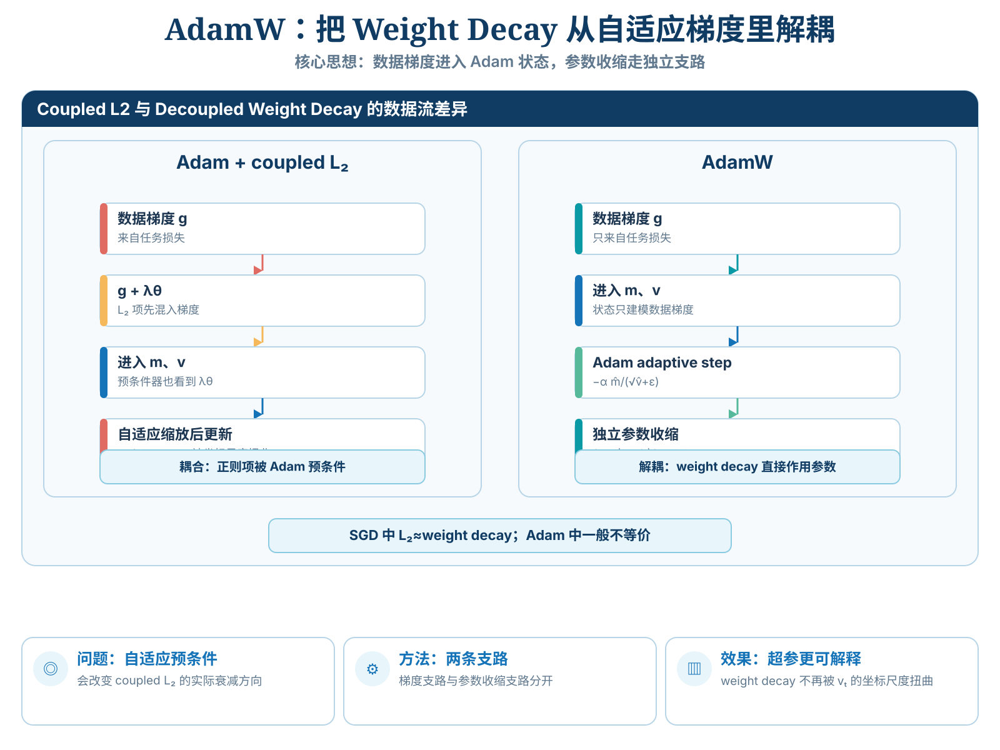
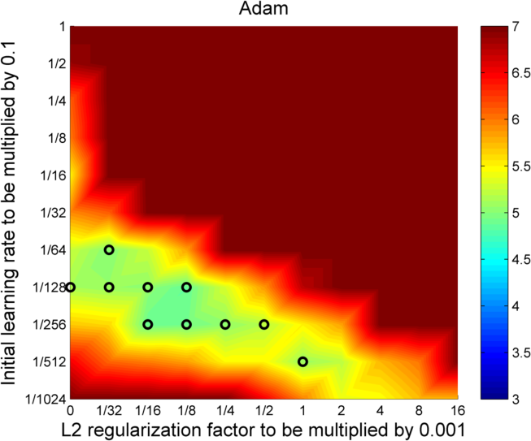
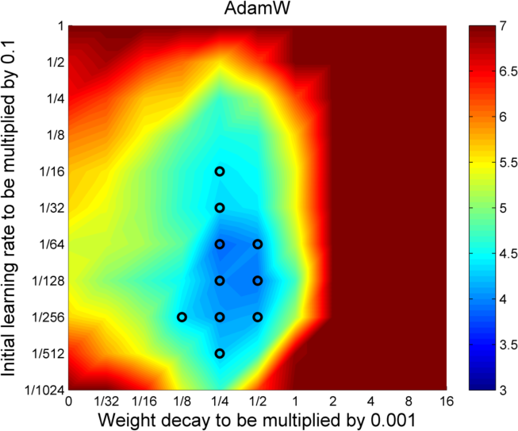
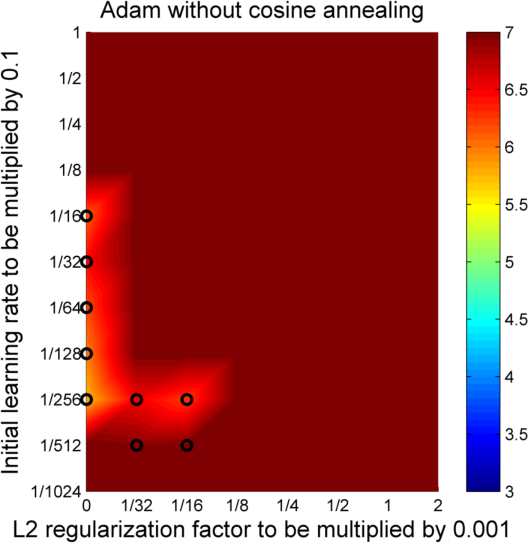
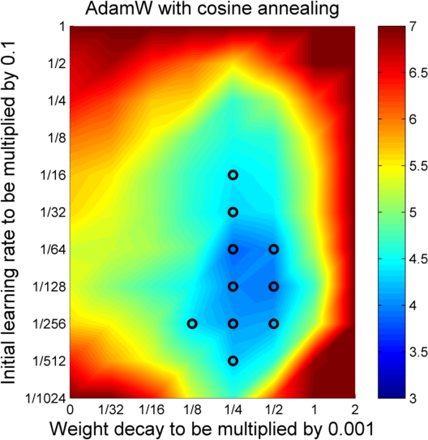

> **V2 重写 · A003 / Paperlist 第 3 篇**  
> Ilya Loshchilov & Frank Hutter, [*Decoupled Weight Decay Regularization*](https://arxiv.org/abs/1711.05101)，ICLR 2019。本文以 [arXiv v3 PDF](https://arxiv.org/pdf/1711.05101) 为原文基线，并对照作者公开的 [AdamW/SGDW 实验代码](https://github.com/loshchil/AdamW-and-SGDW)。本文使用的 Figure 1/2 局部图来自 arXiv 原始图形资产；本地 SVG 仅封装 ar5iv 从对应论文源图导出的 raster panel，没有重绘数据。来源映射见 [figure_manifests/A003.json](../../../figure_manifests/A003.json)。
>
> **阅读边界**：本文核心不是“Adam 比 SGD 好”，而是一个更窄、更精确的问题：**把 $L_2$ 正则梯度直接塞进自适应优化器，是否真的等价于传统 weight decay？** 原文证明一般不等价，并提出将衰减从 adaptive-gradient 路径中解耦。本文的 PyTorch 接口说明、Transformer 参数示例属于现代教学扩展，不应倒推为 2019 原文的实验对象。

# 模型定位与谱系

## 1. 先把问题放对层级：AdamW 改的是参数更新接口

AdamW 常被口语化为“Adam 加了 weight decay”。这句话不算完全错误，但会掩盖论文真正的矛盾。

假设模型已经完成前向传播和反向传播，当前 minibatch 的数据损失为

$$
f_t(\theta),
$$

数据梯度为

$$
g_t=\nabla_\theta f_t(\theta).
$$

到这里，模型架构、损失函数和 backpropagation 都已经做完自己的工作。AdamW 发生在下一层：

> 已经拿到了 $g_t$，现在怎样更新 $\theta$？

因此本文的技术位置是

~~~text
可微模型
  ↓
数据损失 f_t(θ)
  ↓ backward
数据梯度 g_t
  ↓
优化器
  ├── SGD
  │    └── L2 梯度与直接 weight decay 可经系数换算等价
  │
  └── Adam / 自适应优化器
       ├── 若把 λθ 混进 g_t
       │    └── 正则项也会经过逐坐标预条件器
       │
       └── AdamW
            ├── g_t → Adam 的 m/v 自适应路径
            └── θ   → 独立的 weight-decay 路径
~~~

**主要类型：A 原始方法论文。** 可复用贡献是 *decoupled weight decay*，并具体得到 SGDW 与 AdamW。它不是新网络骨干，也不是训练系统论文。

## 2. 为什么这篇必须接在 Adam 后面读？

上一篇 Adam 可以抽象成

$$
\theta_{t+1}
=
\theta_t-\alpha M_t g_t,
$$

其中 $M_t$ 是由历史一阶、二阶矩得到的逐坐标预条件器。对 Adam 来说，

$$
M_t
=
\operatorname{diag}
\left(
\frac{1}{\sqrt{\hat v_t}+\epsilon}
\right),
$$

通常并不是 $kI$。

现在加入 $L_2$ 正则：

$$
f_t^{\mathrm{reg}}(\theta)
=
f_t(\theta)
+
\frac{\lambda'}{2}
\|\theta\|_2^2.
$$

梯度变成

$$
\nabla f_t^{\mathrm{reg}}(\theta)
=
g_t+\lambda'\theta.
$$

把它放入自适应优化器：

$$
M_t(g_t+\lambda'\theta)
=
M_tg_t+\lambda'M_t\theta.
$$

原本只想让参数按统一比例向零收缩，现在收缩量也被 $M_t$ 逐坐标重标定。**这就是 AdamW 出现的第一性原理动机。**

## 3. 前代、本文、后续要严格分开

论文没有发明：

- $L_2$ regularization；
- 传统 weight decay；
- Adam；
- cosine annealing；
- warm restart；
- ResNet。

论文真正提出的是：

1. 明确指出在自适应梯度算法中，$L_2$ regularization 与 weight decay 一般不等价；
2. 用一般预条件矩阵给出等价失效的数学条件；
3. 将 weight decay 从梯度的 adaptive rescaling 中解耦；
4. 用 CIFAR-10、ImageNet32×32 等实验研究泛化和超参数可分离性。

技术谱系应写成：

~~~text
SGD ──传统 weight decay / L2 的特殊等价──→ 历史惯例
Adam ──逐坐标预条件────────────────────→ 等价关系破坏
                                  ↓
                    Decoupled Weight Decay
                       ├── SGDW
                       └── AdamW
                            ↓
                     后续大模型训练广泛采用
~~~

这里“后续广泛采用”是历史影响，不是本文实验本身。

## 总结架构图

> **教学总结图**：对比 coupled L2 与 AdamW：后者把 weight decay 从 Adam 的 m/v 状态中解耦出来。

# 输入、输出与任务

## 1. 一步 AdamW 的精确接口

令全部可训练参数在数学上展平为

$$
\theta_{t-1}\in\mathbb R^P.
$$

真实实现中，Embedding、卷积核、Attention 权重仍保持原 Shape；写成长度 $P$ 的向量只是为了统一推导。

| 对象 | 数学含义 | Shape | 来源 |
|---|---|---:|---|
| $\theta_{t-1}$ | 更新前参数 | $[P]$ | 模型状态 |
| $g_t=\nabla f_t(\theta_{t-1})$ | **纯数据损失**梯度 | $[P]$ | backward |
| $m_t$ | 梯度一阶 EMA | $[P]$ | 优化器状态 |
| $v_t$ | 平方梯度二阶原始矩 EMA | $[P]$ | 优化器状态 |
| $\hat m_t,\hat v_t$ | 偏差修正后的矩 | $[P]$ | 本步中间量 |
| $\alpha_t$ | 学习率 | scalar | scheduler / hyperparameter |
| $\lambda_w$ | 工程式 decay 系数 | scalar | hyperparameter |
| $\theta_t$ | 更新后参数 | $[P]$ | 下一步前向 |

AdamW 的关键输入约束是

$$
\boxed{
g_t=\nabla f_t(\theta_{t-1})
}
$$

而不是

$$
g_t=\nabla f_t(\theta_{t-1})
+\lambda\theta_{t-1}.
$$

后一式会让正则项进入 $m_t,v_t$，那是 coupled $L_2$。

## 2. 原论文的 $\lambda$ 与现代框架的 `weight_decay` 口径

论文 Eq.(1) 写传统 weight decay：

$$
\theta_{t+1}
=
(1-\lambda_{\mathrm{paper}})\theta_t
-
\alpha\nabla f_t(\theta_t).
$$

这里 $\lambda_{\mathrm{paper}}$ 已经是**每步实际收缩率**。

常见现代 AdamW 接口则更接近

$$
\theta_{t+1}
=
(1-\alpha_t\lambda_w)\theta_t
-
\alpha_t d_t,
$$

其中 $d_t$ 是 Adam 的自适应任务方向。

因此在固定学习率下，要让两种写法产生相同的一步 decay，必须满足

$$
\boxed{
\lambda_{\mathrm{paper}}
=
\alpha_t\lambda_w
}.
$$

所以只比较两个库中写着 `weight_decay=0.01` 的数字没有意义，必须先看更新式。

## 3. 参数 Shape 并没有因为 AdamW 改变

若某个 Transformer 矩阵为

$$
W_Q\in\mathbb R^{4096\times4096},
$$

AdamW 对应的状态同形：

$$
m_t,v_t\in\mathbb R^{4096\times4096}.
$$

任务分支做逐坐标自适应更新；decay 分支则直接计算

$$
-\alpha_t\lambda_wW_Q.
$$

两条支路 Shape 一样，但统计意义完全不同：

- $m_t,v_t$ 来自数据梯度历史；
- decay 只读取参数本身；
- decay 不应该反过来污染“数据梯度典型尺度”的估计。

# 骨干架构与信息交互

## 1. Algorithm 2 的关键不是“多一项”，而是它接在哪条边上

~~~mermaid
flowchart TD
    D["minibatch"] --> F["任务损失 f_t(theta)"]
    F --> G["g_t = grad f_t"]
    G --> M["m_t: 一阶 EMA"]
    G --> V["v_t: 平方梯度 EMA"]
    M --> MH["m_hat"]
    V --> VH["v_hat"]
    MH --> A["Adam task step"]
    VH --> A

    T["旧参数 theta_(t-1)"] --> W["weight-decay step"]
    T --> ADD["参数合成"]
    W --> ADD
    A --> ADD
    ADD --> N["theta_t"]
~~~

数据梯度位移：

$$
\Delta_{\mathrm{task},t}
=
-\alpha_t
\frac{\hat m_t}
{\sqrt{\hat v_t}+\epsilon}.
$$

衰减位移：

$$
\Delta_{\mathrm{decay},t}
=
-\alpha_t\lambda_w\theta_{t-1}.
$$

最后才组合：

$$
\theta_t
=
\theta_{t-1}
+
\Delta_{\mathrm{task},t}
+
\Delta_{\mathrm{decay},t}.
$$

“decoupled” 的对象就是**计算路径**：weight decay 不再经过 $M_t$。

## 2. 原论文 Figure 2：把“耦合”画成超参数地形

### Adam + coupled $L_2$

*原论文 Figure 2 的 Adam 面板；图形资产来自 arXiv 源文件 `fig2_ADAM.pdf`。横轴是正则强度，纵轴是初始学习率，颜色表示 CIFAR-10 Top-1 test error。*

读这张图不要先找“最蓝的点”，先看**低误差区域的走向**。Adam + $L_2$ 的优良区域呈明显倾斜：改变 learning rate 时，合适的 regularization strength 也跟着移动。

这恰好对应上一节的数学：

$$
\lambda'\theta
\quad\text{先进入}\quad
M_t,
$$

而 $M_t$ 与优化轨迹、学习率共同变化，因此两个超参数不是简单独立旋钮。

### AdamW

*原论文 Figure 2 的 AdamW 面板；源文件 `mADAM_widefig.pdf`。*

AdamW 的较优区域更接近“沿横轴和纵轴可分别寻找”的形状。原文称这种现象体现了更好的 *hyperparameter separability*。

这里必须保留证据边界：

> 图支持的是“在这些模型、数据和搜索区间里更容易分开调”，不是证明 $\alpha$ 与 $\lambda$ 在所有任务上统计独立。

## 3. Figure 1：为什么论文还要先研究 learning-rate schedule？

*两图来自原论文 Figure 1 对应源文件。它们用于说明全局 learning-rate schedule 与逐坐标自适应不是同一自由度。*

§4.1 先比较 fixed、step-drop 和 cosine annealing，是为了检验一个很自然的猜想：

> Adam 已经为每个参数自适应步长，是否就不再需要全局 learning-rate schedule？

实验答案是否定的。作者因此把两件事拆开：

- Adam/AdamW：**参数坐标之间**怎样缩放；
- schedule：**训练时间轴上**全局尺度怎样变化。

如果把“cosine 带来的收益”全部算在 AdamW 头上，就破坏了论文自己的实验逻辑。

# 关键技术

## 1. 从零推导：为什么标准 SGD 中 $L_2$ 与 weight decay 可以等价？

数据损失是

$$
f_t(\theta).
$$

加入 $L_2$：

$$
F_t(\theta)
=
f_t(\theta)
+
\frac{\lambda'}{2}
\|\theta\|_2^2.
$$

因为

$$
\nabla_\theta
\frac12\|\theta\|_2^2
=
\theta,
$$

所以

$$
\nabla F_t(\theta)
=
\nabla f_t(\theta)
+
\lambda'\theta.
$$

标准 SGD：

$$
\begin{aligned}
\theta_{t+1}
&=
\theta_t
-
\alpha
\left(
\nabla f_t(\theta_t)
+
\lambda'\theta_t
\right)\\
&=
(1-\alpha\lambda')\theta_t
-
\alpha\nabla f_t(\theta_t).
\end{aligned}
$$

传统 weight decay：

$$
\theta_{t+1}
=
(1-\lambda)\theta_t
-
\alpha\nabla f_t(\theta_t).
$$

要逐步完全相同，只需

$$
\boxed{
\lambda'
=
\frac{\lambda}{\alpha}
}.
$$

这就是原文 Proposition 1 的核心。

### 这个等价有哪些前提？

至少包括：

1. 标准 SGD 使用统一标量 learning rate；
2. decay 对所比较参数使用统一标量；
3. 梯度外没有非标量逐坐标预条件器；
4. 两种写法的 $\lambda$ 已正确换算。

所以“$L_2$ 就是 weight decay”从来不是无条件代数恒等式。

## 2. Proposition 2：自适应预条件器为什么必然破坏一般等价？

把一般自适应优化器写成

$$
\theta_{t+1}
=
\theta_t
-
\alpha M_t
\nabla f_t(\theta_t).
$$

耦合 $L_2$：

$$
\begin{aligned}
\theta_{t+1}^{L_2}
&=
\theta_t
-
\alpha M_t
\left(
\nabla f_t(\theta_t)
+
\lambda'\theta_t
\right)\\
&=
\theta_t
-
\alpha M_t\nabla f_t(\theta_t)
-
\alpha\lambda'M_t\theta_t.
\end{aligned}
$$

直接 weight decay：

$$
\theta_{t+1}^{WD}
=
\theta_t
-
\alpha M_t\nabla f_t(\theta_t)
-
\lambda\theta_t.
$$

若要求两者对任意 $\theta_t$ 都相同，就必须有

$$
\alpha\lambda'M_t\theta_t
=
\lambda\theta_t
\qquad
\forall\theta_t.
$$

因此

$$
\alpha\lambda'M_t
=
\lambda I,
$$

也就是

$$
M_t
=
\frac{\lambda}{\alpha\lambda'}I.
$$

所以只有当预条件器是**标量乘单位矩阵**时，一个统一 $L_2$ 系数才可能和统一 weight decay 等价。

Adam 的 $M_t$ 一般不是这种形式，于是

$$
\boxed{
L_2 \not\equiv \text{weight decay}
\quad\text{for general adaptive preconditioning}.
}
$$

这是整篇论文最硬的数学证据。

## 3. 二维数字例子：让“不等价”看得见

设

$$
M
=
\begin{bmatrix}
1/2 & 0\\
0 & 1/20
\end{bmatrix},
\qquad
\theta
=
\begin{bmatrix}
1\\
1
\end{bmatrix},
$$

当前数据梯度为零：

$$
g=0.
$$

取

$$
\alpha=0.01,
\qquad
\lambda'=0.1.
$$

耦合 $L_2$ 的位移：

$$
\begin{aligned}
\Delta_{L_2}
&=
-\alpha\lambda'M\theta\\
&=
-0.001
\begin{bmatrix}
1/2\\
1/20
\end{bmatrix}\\
&=
\begin{bmatrix}
-0.0005\\
-0.00005
\end{bmatrix}.
\end{aligned}
$$

两个原本一样大的参数，收缩强度差了 10 倍。

若工程式 AdamW 取

$$
\lambda_w=0.1,
$$

则

$$
\begin{aligned}
\Delta_{\mathrm{decay}}
&=
-\alpha\lambda_w\theta\\
&=
\begin{bmatrix}
-0.001\\
-0.001
\end{bmatrix}.
\end{aligned}
$$

这才是统一相对比例的参数收缩。

## 4. 真实 Adam 的耦合甚至更深：$v_t$ 也被污染

上面的固定 $M$ 已足以证明不等价。真实 Adam 还会把 coupled $L_2$ 混入 moment statistics。

若

$$
\tilde g_t
=
g_t+\lambda'\theta_t,
$$

则二阶矩使用

$$
\tilde g_t^{\odot2}
=
(g_t+\lambda'\theta_t)^{\odot2}.
$$

展开：

$$
\boxed{
\tilde g_t^{\odot2}
=
g_t^{\odot2}
+
2\lambda'
(g_t\odot\theta_t)
+
{\lambda'}^2
\theta_t^{\odot2}
}.
$$

因此原本只想表达“参数应该往零缩”的项，现在还会改变 Adam 对**数据梯度历史尺度**的判断。

AdamW 把这层耦合也去掉。

## 5. 完整 AdamW 更新

只让任务梯度进入 moment：

$$
m_t
=
\beta_1m_{t-1}
+
(1-\beta_1)g_t,
$$

$$
v_t
=
\beta_2v_{t-1}
+
(1-\beta_2)g_t^{\odot2}.
$$

偏差修正：

$$
\hat m_t
=
\frac{m_t}{1-\beta_1^t},
\qquad
\hat v_t
=
\frac{v_t}{1-\beta_2^t}.
$$

任务位移：

$$
\Delta_{\mathrm{task},t}
=
-\alpha_t
\frac{\hat m_t}
{\sqrt{\hat v_t}+\epsilon}.
$$

decay 位移：

$$
\Delta_{\mathrm{decay},t}
=
-\alpha_t\lambda_w\theta_{t-1}.
$$

于是

$$
\boxed{
\theta_t
=
(1-\alpha_t\lambda_w)\theta_{t-1}
-
\alpha_t
\frac{\hat m_t}
{\sqrt{\hat v_t}+\epsilon}
}.
$$

### 为什么两条支路都应该读旧参数？

若先执行 Adam：

$$
\theta'
=
\theta_{t-1}
-
\alpha_td_t,
$$

再对 $\theta'$ 整体乘 decay：

$$
\theta_t
=
(1-\alpha_t\lambda_w)\theta',
$$

则

$$
\theta_t
=
(1-\alpha_t\lambda_w)\theta_{t-1}
-
(1-\alpha_t\lambda_w)\alpha_td_t.
$$

任务位移也被额外缩小了一次，严格说已经是另一种算法。

## 6. “用了 weight decay，权重每一步一定变小”吗？

不一定。

设

$$
\theta=(2,-1),
$$

本步 Adam 任务位移为

$$
\Delta_{\mathrm{task}}
=
(-0.005,+0.020),
$$

decay 为

$$
\Delta_{\mathrm{decay}}
=
(-0.002,+0.001).
$$

于是

$$
\theta'
=
(1.993,-0.979).
$$

这里只能说 decay 分量本身朝零。总位移还叠加任务梯度，因此某个参数的绝对值完全可能在本步增大。

## 7. 最小 PyTorch 实现：只让数据梯度进入 $m,v$

~~~python
import torch

dtype = torch.float64
lr = 0.1
weight_decay = 0.1
beta1, beta2 = 0.9, 0.99
eps = 1e-8

manual = torch.tensor([1.0, -2.0], dtype=dtype)
reference = torch.nn.Parameter(manual.clone())

optimizer = torch.optim.AdamW(
    [reference],
    lr=lr,
    betas=(beta1, beta2),
    eps=eps,
    weight_decay=weight_decay,
    amsgrad=False,
)

m = torch.zeros_like(manual)
v = torch.zeros_like(manual)

for step, gradient in enumerate(([0.2, 2.0], [-0.4, 0.5]), start=1):
    g = torch.tensor(gradient, dtype=dtype)

    # 只有数据损失梯度进入 moment statistics
    m = beta1 * m + (1.0 - beta1) * g
    v = beta2 * v + (1.0 - beta2) * g.square()

    m_hat = m / (1.0 - beta1 ** step)
    v_hat = v / (1.0 - beta2 ** step)

    old = manual.clone()
    task_step = -lr * m_hat / (v_hat.sqrt() + eps)
    decay_step = -lr * weight_decay * old

    manual = old + task_step + decay_step

    reference.grad = g.clone()
    optimizer.step()
    optimizer.zero_grad(set_to_none=True)

    torch.testing.assert_close(
        manual,
        reference.detach(),
        rtol=1e-12,
        atol=1e-12,
    )

    print(step, manual.tolist())
~~~

这段代码最关键的是：

~~~python
m = beta1 * m + (1.0 - beta1) * g
v = beta2 * v + (1.0 - beta2) * g.square()
~~~

这里的 `g` 不含 `weight_decay * old`。如果先执行

~~~python
g = g + weight_decay * old
~~~

那么就又回到了 coupled $L_2$。

当前工作区默认 Python 没有安装 PyTorch，因此本篇只完成了公式、Shape 与代码语义审查；**不宣称此代码已在当前 MCP 环境实际运行通过。**

## 8. 实验：Figure 1 和 Figure 2 不是在回答同一个问题

Figure 1 问：

> decoupling 的效果是否依赖某一种 learning-rate schedule？

作者比较 fixed、step-drop、cosine。

Figure 2 问：

> decoupling 是否让 learning rate 与 regularization/decay 更容易分别搜索？

所以实验解读必须拆开。

### Figure 1 的因果边界

若 AdamW + cosine 最好，不能写：

> “全部提升都来自 AdamW。”

因为 schedule 同时改变了。

更严谨的控制方式是：

1. 在相同 schedule 内比较 Adam 和 AdamW；
2. 再跨 schedule 讨论全局 schedule 本身的作用。

### Figure 2 的因果边界

AdamW 的低误差区域更规则，支持 “more separable” 的工程结论；但它是特定 Shake-Shake ResNet、CIFAR-10、训练预算和网格上的实证。

不能从图直接推出

$$
\alpha\perp\lambda
$$

这种普适统计独立性结论。

# 预训练与后训练

AdamW **不是训练阶段名称**。

它可以用于：

- pretraining；
- continued pretraining；
- SFT；
- PEFT；
- reward model；
- PPO / GRPO 等可微更新阶段。

阶段之间真正不同的是：

- 数据从哪里来；
- 目标函数是什么；
- 哪些参数可训练；
- 是否需要采样/奖励模型。

AdamW 只负责在得到梯度之后更新参数。

例如语言模型 token CE：

$$
\mathcal L(\theta)
=
-\frac{1}{\sum_bT_b}
\sum_b\sum_t
\log
p_\theta
(y_{b,t}\mid x_b,y_{b,<t}).
$$

先通过反向传播得到

$$
g_t
=
\nabla_\theta\mathcal L(\theta),
$$

然后才交给 AdamW。

## 参数组为什么常把 bias / Norm 排除出 decay？

现代 Transformer 训练常见：

~~~python
decay_params = [...]
no_decay_params = [...]  # bias / norm parameters
~~~

这是一种工程和经验策略，不是 AdamW 理论强制规定。

AdamW 解决的是：

> 如果某参数要接受 weight decay，怎样避免 decay 被 adaptive gradient 重缩放？

它没有证明：

> 所有参数都应该接受相同 decay。

因此 LoRA、Adapter、Embedding、Norm scale 等参数是否衰减，要在对应训练配置中单独说明。

# 推理与部署

AdamW 几乎只存在于**训练路径**。

若有 $P$ 个 trainable parameters，标准 AdamW 典型需要：

- 模型参数；
- 梯度；
- 一阶矩 $m$；
- 二阶矩 $v$；
- 混合精度场景可能另有 FP32 master weights。

若 $m,v$ 均为 FP32，仅 moment states 就占

$$
2\times4P
=
8P
$$

字节。

若

$$
P=10^9,
$$

则仅两组 moment 约 8 GB（十进制），还未计梯度、主参数、激活或临时 buffer。

decoupled decay 从 FLOPs 看只是逐元素乘加，但大规模训练不能只数运算符：

- 需要额外读写参数；
- optimizer step 常受 HBM bandwidth 影响；
- kernel fusion 会改变 wall-clock；
- ZeRO / optimizer sharding 会改变每卡状态驻留。

这些属于后续训练系统问题，并不是 AdamW 论文贡献。

**Prefill、Decode、KV Cache 与 AdamW 原文无关。** 推理服务通常只加载训练结束后的模型权重，不带 Adam 的 $m,v$。

## 技术 → 模型

- **Decoupled Weight Decay → AdamW**：`PROPOSES`
- **Decoupled Weight Decay → SGDW**：`PROPOSES`
- **Adam → AdamW**：`DERIVED_FROM`
- **传统 Weight Decay → AdamW**：`ADOPTS`
- **Cosine Annealing / Warm Restart → AdamWR**：`ADOPTS / EXTENDS`
- **AdamW → 后续 Transformer 训练**：通常是 `ADOPTS`；具体模型须按各自技术报告核对

## 模型 → 技术

- **AdamW**：`DERIVED_FROM` Adam 的一阶/二阶矩和偏差修正；`PROPOSES` decoupled decay
- **SGDW**：`DERIVED_FROM` momentum SGD；`IMPLEMENTS` 独立 decay
- **论文实验中的 Shake-Shake ResNet**：`ADOPTS` ResNet/Shake-Shake；`IMPLEMENTS` Adam、AdamW、SGD、SGDW 作为比较训练方案
- **AdamWR**：`EXTENDS` AdamW，并 `ADOPTS` cosine annealing / warm restart

# 论文细读

## 1. Abstract：先制造“两个概念一直被当成同一件事”的冲突

**定位：PDF p.1，Abstract。**

摘要没有先说“我们提出 AdamW”，而是先把读者已有的默认认知拆掉：

- 在标准 SGD 中，$L_2$ regularization 与 weight decay 经系数换算可以等价；
- 很多实现由此把两者当成同义词；
- 但在 Adam 这类 adaptive gradient 方法中，这个等价失效。

这是一种很强的论文开场方式。若作者只说“我们提出一个新的 Adam 变体”，贡献看起来像又一个 optimizer trick；先指出**旧接口在新优化器里悄悄换了数学含义**，后面的 decoupling 就变成有必然动机的修复。

### 措辞强度

摘要中关于“不等价”使用的是接近 “we demonstrate” 的确定表达，对应后文 Proposition 2 的数学论证；而关于泛化提升则来自有限实验。两者证据级别不同。

翻成中文时不能统一写成“论文证明 AdamW 泛化更好”。更准确是：

- 不等价：数学证明；
- 泛化改善：作者实验观察。

## 2. Introduction 开头：先承认 Adam 很成功，再用转折提出异常

**定位：§1 前部，PDF pp.1–2。**

作者先承认 AdaGrad、RMSProp、Adam 等 adaptive methods 的流行与实用性，然后用转折引出：

> 在若干主流图像分类 benchmark 上，SGD with momentum 往往仍有更好的 generalization。

这段不是背景流水账，而是在建立全文张力：

~~~text
Adam 很流行、调起来很方便
        ↓
但视觉任务上常常 SGD 泛化更好
        ↓
为什么？
~~~

随后作者回顾 sharp minima、adaptive method 本身等已有解释，再把自己的问题缩窄为：

> 会不会我们其实没有以“真正的 weight decay”训练 Adam？

注意作者不是说其他解释全错，而是选出一个**可以直接数学拆解和实验干预**的因素。

## 3. Introduction 的 observation 列表：其实是全文证据目录

作者随后列出几项 observation，大意包括：

1. $L_2$ 与 weight decay 对 adaptive methods 不等价；
2. $L_2$ 在 Adam 中并不是合适的传统衰减替代；
3. decoupled decay 可以改善 Adam/SGD 的训练行为；
4. 最优 decay 与训练预算有关；
5. Adam 仍然受益于 global learning-rate schedule。

这些不是摘要重复，而是在给读者一张**论证地图**：

- §2：处理数学等价；
- Figure 1：处理 schedule；
- Figure 2：处理超参数耦合；
- Figure 3 及长训练：处理泛化；
- Appendix / AdamWR：处理训练预算和 restart。

细读时可以拿这几条当 checklist：作者后面是否真的为每条提供了证据？

## 4. §2 为什么先证明一个“大家都知道”的 SGD 结论？

**定位：§2 开头，Eq.(1)、Proposition 1。**

作者先写传统 weight decay：

$$
\theta_{t+1}
=
(1-\lambda)\theta_t
-
\alpha\nabla f_t(\theta_t),
$$

然后正式证明标准 SGD 中它与 $L_2$ 经

$$
\lambda'=\frac{\lambda}{\alpha}
$$

换算后等价。

为什么要花篇幅证明一个旧结论？

因为这一步在建立**对照组**。

如果作者直接说“Adam 中不等价”，读者会问：

> 那为什么过去大家长期把它们当成同一种 regularization？

Proposition 1 回答：

> 因为在标准 SGD 里，这种混用确实不会改变参数轨迹，只要系数换对。

于是后文的“Adam 打破等价”才是有边界的技术命题，而不是术语洁癖。

## 5. 从 Proposition 1 到 Proposition 2：只改变一个条件

作者接下来提醒：

$$
\lambda'
=
\frac{\lambda}{\alpha}.
$$

即使在 SGD 里，$L_2$ 系数也和 learning rate 存在换算关系。

随后论证转向 adaptive gradient algorithms。

这段的逻辑非常干净：

~~~text
SGD：
L2 ≡ WD（经 lr 换算）
        ↓
把更新外面加入非标量 M_t
        ↓
regularizer 也会被 M_t 重缩放
        ↓
一般不再等价
~~~

作者没有一次性引入很多新概念，而是只改变**一个条件**。这是这篇论文最值得学习的论证写法之一。

## 6. Proposition 2：全文的“硬证据核心”

Proposition 2 的证明很短，但力量很强。

如果两种方法对任意 $\theta$ 等价，就必须满足

$$
\lambda\theta
=
\alpha\lambda'M_t\theta
\qquad
\forall\theta.
$$

因此

$$
M_t=kI.
$$

但 adaptive gradient 的本质就是不同坐标通常拥有不同 scale：

$$
M_t\neq kI.
$$

所以一般不等价。

这里作者没有依赖“看起来 Adam 泛化差”这种经验叙述，而是把问题压缩成一个线性代数结构条件。

**语言层面**，这也是为什么前文可以使用较强确定语气：这一部分确实是可证明的。

## 7. Proposition 3：从“否定等价”转向“解释 coupled $L_2$ 到底做了什么”

Proposition 2 告诉我们：

> 它们不一样。

读者自然会追问：

> 那 coupled $L_2$ 在自适应预条件下究竟相当于什么？

所以作者又考虑固定的 diagonal preconditioner，给出 scale-adjusted regularization 的解释。

这一段不是再证明一次“不等价”，而是把抽象差异变成**每个坐标受到不同有效正则强度**的直觉。

必须保留原文限制：固定 $M$ 并不是动态 Adam 的完整现实。真实 Adam 中 $M_t$ 会随历史梯度变化，因此这一结果应理解为解释性特例，而不是完整动态等价定理。

## 8. §3 Bayesian filtering：为什么应该后读？

这一节从 Bayesian filtering/state transition 的角度解释 weight decay，并明确给相关思想来源以 credit。

它的作用是：

> 为已经得到的 decoupled design 提供另一种理论解释。

它不是 Proposition 2 成立的前提，也不是实现 AdamW 必须先学会的数学。

因此学习顺序更合理的是：

1. Proposition 1；
2. Proposition 2；
3. Algorithm 2；
4. Figure 1/2；
5. 最后再读 Bayesian filtering 解释。

否则一个很简单的“预条件器是否应该作用于 regularizer”问题会被过早抽象化。

## 9. §4.1：为什么先清理 learning-rate schedule 这个混杂因素？

作者没有马上报最终 test error，而是先比较 fixed、step-drop、cosine annealing。

因为一个自然反驳是：

> Adam 已经 adaptive 了，global schedule 可能多余。

实验显示不是这样。

这段的写作作用是先告诉读者：

> **decoupling 与 scheduler 是两种独立设计变量。**

后面的结果因此不能简单归因为“AdamW 一个改动”。

## 10. §4.2 + Figure 2：公式中的耦合怎样变成图上的斜盆地？

这是全文最漂亮的“公式—图像互证”。

数学前文已经说：

$$
L_2
\rightarrow
M_t(\lambda\theta)
\rightarrow
\text{effective regularization depends on adaptive scaling}.
$$

Figure 2 不只给一个最佳点，而是把 learning rate × regularization strength 的**整个二维误差面**画出来。

作者由此能讨论一个比“最好成绩是多少”更结构化的问题：

> 两个超参数是不是容易分别搜索？

原文用接近 “more separable”“suggests” 的措辞。这种词很关键：它表达的是实验支持的趋势，不是普遍统计独立定理。

## 11. §4.3：为什么还要比较相似 training loss 下的 test error？

如果 AdamW 只是把 training loss 降得更低，那么更好的 test error 可能只是“拟合更充分”的副产品。

所以作者进一步问：

> 在 training loss 相近时，test error 是否仍不同？

这一步是在区分

~~~text
更好的 test result
  ├── 来自更好的 optimization？
  └── 还是同等拟合下 generalization 也不同？
~~~

作者实验支持后者在这些设置中存在，但仍然是经验现象，不能升级为关于所有模型泛化的定理。

## 12. Conclusion：作者自己给结论踩了刹车

结论里非常值得保留的不是“AdamW 更好”，而是作者明确指出这些观察还需要在**更广泛任务**上验证。

紧接着对于其他 adaptive methods，作者使用接近 “we believe” 的语气。

这类词在论文细读中不能被中文翻译抹平：

- “prove/demonstrate” 对应强证据；
- “results show” 对应实验观察；
- “suggest” 对应有限支持；
- “we believe” 是作者判断或未来假设。

因此，本篇真正应该带走的不是“AdamW 永远优于 Adam”，而是：

> **不要因为两个方法在 SGD 下恰好等价，就把这种等价无条件搬进带非标量预条件器的优化器。**

## 本篇最小闭环

读完后应能独立回答：

1. 为什么标准 SGD 中 $L_2$ 和 weight decay 能通过 $\lambda'=\lambda/\alpha$ 等价？
2. 为什么 $M_t\neq kI$ 后这种等价一般必然破坏？
3. 为什么 AdamW 的 decay 不应进入 $m_t,v_t$？
4. Figure 2 的“更可分离”究竟是数学定理，还是与理论相呼应的经验现象？

能把四个问题自己推出来，才算真正读懂 AdamW，而不只是会调用 `torch.optim.AdamW`。
