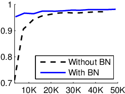
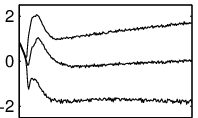
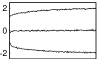
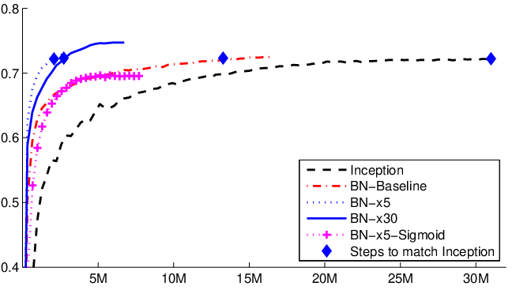

> **V2 重写 · A004 / Paperlist 第 4 篇**  
> Sergey Ioffe & Christian Szegedy, [*Batch Normalization: Accelerating Deep Network Training by Reducing Internal Covariate Shift*](https://arxiv.org/abs/1502.03167)，ICML 2015。本文以 [原论文 PDF](https://arxiv.org/pdf/1502.03167) 为主线，并将 arXiv 源文档中的 Figure 1/2 原始图形资产整理进 `figures/A004/`；来源映射见 [figure_manifests/A004.json](../../../figure_manifests/A004.json)。
>
> **机制解释边界**：原作者把 BN 的主要动机描述为缓解 *internal covariate shift*（ICS）。这是理解 2015 论文行文必须保留的历史语境，但不应把它写成已经被后续研究唯一确认的因果机制。Santurkar 等 2018 的 [后续研究](https://arxiv.org/abs/1805.11604) 对“稳定中间激活分布就是主要原因”的解释提出了挑战，并把注意力转向损失/梯度的平滑性。本文因此严格分开：**BN 算法做了什么**、**原作者当时怎样解释它**、**后续证据怎样修正解释**。

# 模型定位与谱系

## 1. BatchNorm 不是优化器，而是进入前向函数的一层运算

Adam/AdamW 是：

> 已经得到梯度以后，怎样更新参数？

Batch Normalization 是：

> 在网络前向传播中，怎样重新参数化一层中间激活？

这两个层级必须分开。

对一个标量特征 $x$，BN 在训练时通过 minibatch 统计量构造

$$
\hat x
=
\frac{x-\mu_{\mathcal B}}
{\sqrt{\sigma_{\mathcal B}^2+\epsilon}},
$$

再用可训练仿射参数恢复表示自由度：

$$
y
=
\gamma\hat x+\beta.
$$

所以 BN 会同时改变：

- forward 的数值；
- backward 的 Jacobian；
- 同一 minibatch 样本之间的依赖；
- train / inference 的计算语义。

它不是一个在 `optimizer.step()` 中才出现的技巧。

## 2. 原论文的问题链条

2015 年作者面对的训练直觉可以沿这条链读：

~~~text
深层网络逐层训练
     ↓
前面层的参数不断变化
     ↓
后面层所接收的输入分布也不断变化
     ↓
后面层不断追逐“移动的输入统计”
     ↓
作者称之为 Internal Covariate Shift
     ↓
朴素方案：把中间激活做标准化 / 白化
     ↓
但全协方差白化昂贵，且若脱离计算图还会被网络抵消
     ↓
Batch Normalization
     ├── 每个特征独立标准化
     ├── 用 minibatch 估计统计量
     ├── 统计计算保留在计算图里
     └── 用 gamma / beta 恢复可学习尺度与中心
~~~

**主要类型：A 原始方法论文。** 它提出一种可嵌入多类网络的标准化层，而不是一份固定参数量模型报告。

## 3. 从全白化退到逐特征归一化，不是“少做一点”这么简单

完整白化对随机向量 $x\in\mathbb R^D$ 可写成

$$
\tilde x
=
\Sigma^{-1/2}(x-\mu),
$$

其中

$$
\Sigma
=
\mathbb E
\left[
(x-\mu)(x-\mu)^\top
\right]
\in\mathbb R^{D\times D}.
$$

它需要估计所有特征之间的协方差，再求矩阵逆平方根。若 $D$ 很大而 minibatch 很小：

- 协方差估计噪声大；
- 矩阵可能奇异或病态；
- 前向要做矩阵分解/变换；
- 反向还要穿过这套矩阵运算。

BN 的关键简化是：**不试图消掉不同 feature 之间的协方差，只控制每个 feature 自己的一阶和二阶标量统计。**

这牺牲了完整白化，但得到可扩展、可微、容易插入深层网络的模块。

## 4. 技术树定位

~~~text
神经网络训练
├── 参数更新
│    └── SGD / Adam / AdamW
│
└── 网络内部数值变换
     └── Normalization
          ├── BatchNorm：统计跨 batch（卷积时还跨空间）
          ├── LayerNorm：统计单样本内部特征
          ├── GroupNorm：统计通道组
          └── RMSNorm：不减均值，仅按 RMS 缩放
~~~

BN 与 LayerNorm/RMSNorm 不能只说成“公式差不多”。最关键的分歧首先是**统计轴和样本间耦合**。

# 输入、输出与任务

## 1. 全连接场景：对哪个轴统计？

设一层输出

$$
X
\in
\mathbb R^{B\times D}.
$$

对第 $d$ 个特征，

$$
x_{1d},x_{2d},\ldots,x_{Bd}
$$

共享同一组 batch mean / variance：

$$
\mu_d
=
\frac1B
\sum_{b=1}^{B}x_{bd},
$$

$$
\sigma_d^2
=
\frac1B
\sum_{b=1}^{B}
(x_{bd}-\mu_d)^2.
$$

因此：

- 统计向量 $\mu,\sigma^2\in\mathbb R^D$；
- 可训练 $\gamma,\beta\in\mathbb R^D$；
- 输出仍是 $Y\in\mathbb R^{B\times D}$。

BN 不改变特征维度。

## 2. 卷积场景：为什么不是只对 $B$ 个数求均值？

若卷积输出

$$
X
\in
\mathbb R^{B\times C\times H\times W},
$$

原论文卷积 BN 对每个 feature map / channel 的所有位置共同统计。因此对固定通道 $c$，有效统计样本数是

$$
m=BHW.
$$

均值：

$$
\mu_c
=
\frac{1}{BHW}
\sum_{b,h,w}
X_{bchw}.
$$

方差：

$$
\sigma_c^2
=
\frac{1}{BHW}
\sum_{b,h,w}
(X_{bchw}-\mu_c)^2.
$$

然后

$$
\hat X_{bchw}
=
\frac{X_{bchw}-\mu_c}
{\sqrt{\sigma_c^2+\epsilon}},
$$

$$
Y_{bchw}
=
\gamma_c\hat X_{bchw}
+
\beta_c.
$$

所以 $\gamma,\beta$ 的 Shape 是

$$
[C],
$$

不是 $[B,C,H,W]$。

## 3. 训练与推理不是同一个统计过程

| 内容 | Training | Inference |
|---|---|---|
| 均值/方差 | 当前 minibatch 统计 | 固定的总体估计 / running statistics |
| 样本是否相互影响 | 是 | 固定统计下通常否 |
| $\gamma,\beta$ | 参与前向并可学习 | 使用训练后的固定参数 |
| 是否需要 backward | 是 | 通常否 |
| 是否可直接与前一线性层融合 | 不能一般融合 | 固定统计后可以 |

训练时，同一批中的其他样本改变，会改变本样本的 $\mu_{\mathcal B},\sigma_{\mathcal B}^2$，所以输出也会改变。这种**跨样本依赖**是 BN 的结构性质，不是实现 bug。

## 4. 为什么 $\gamma,\beta$ 必须存在？

如果永远强制

$$
\hat x
=
\frac{x-\mu}{\sigma}
$$

且不允许后续恢复尺度和中心，那么某些表示可能被不必要限制。

加入

$$
y=\gamma\hat x+\beta
$$

后，网络可以学习：

- 放大/缩小归一化特征；
- 平移激活工作区间；
- 在合适统计条件下近似恢复归一化前的尺度。

因此 BN 的目标不是把所有层永远钉死在“均值 0、方差 1”的最终表示，而是提供一个**更容易优化的参数化接口**。

# 骨干架构与信息交互

## 1. 原论文 Algorithm 1 的真实数据流

对一个 minibatch

$$
\mathcal B
=
\{x_1,\ldots,x_m\},
$$

Algorithm 1 按以下顺序执行：

$$
\mu_{\mathcal B}
=
\frac1m\sum_{i=1}^{m}x_i,
$$

$$
\sigma_{\mathcal B}^2
=
\frac1m
\sum_{i=1}^{m}
(x_i-\mu_{\mathcal B})^2,
$$

$$
\hat x_i
=
\frac{x_i-\mu_{\mathcal B}}
{\sqrt{\sigma_{\mathcal B}^2+\epsilon}},
$$

$$
y_i
=
\gamma\hat x_i+\beta.
$$

把它放进网络：

~~~mermaid
flowchart TD
    U["上一层激活 U"] --> L["Linear / Conv"]
    L --> X["中间激活 X"]
    X --> MU["batch mean"]
    X --> VAR["batch variance"]
    MU --> N["normalize"]
    VAR --> N
    X --> N
    N --> A["gamma * x_hat + beta"]
    A --> PHI["nonlinearity"]
    PHI --> NEXT["后续网络"]
~~~

原论文通常把 BN 放在线性/卷积变换之后、非线性之前。现代架构可能改变 normalization 的位置，但不能回写成本文原始配置。

## 2. Figure 1(a)：先看训练速度，不要把横轴误读成 epoch

*原论文 Figure 1(a)，原始图形资产 `mnist.eps` / ar5iv 对应图片。纵轴是验证集 accuracy，横轴是 training steps。*

作者先展示 BN 网络更快达到较高验证准确率。这个图支持：

> 在论文给定的深层 sigmoid 网络和训练配置中，BN 明显改善优化速度。

但它单独不能回答：

> 为什么会更快？

所以作者紧接着放 Figure 1(b)/(c)，转向**内部激活统计**。

## 3. Figure 1(b)：没有 BN，sigmoid 输入的分位数不断漂移

*原论文 Figure 1(b)，源资产 `evo.eps`。曲线追踪一个选定激活在不同训练步的 15%、50%、85% 分位数。*

这不是 loss curve，也不是梯度范数。

作者选择分位数而不是只画均值/方差，是为了让读者直观看到：

> 这个中间单元接收到的整个数值区间在训练中不断移动。

这与论文定义的 ICS 叙事形成视觉对应。

## 4. Figure 1(c)：有 BN，分位数更稳定

*原论文 Figure 1(c)，源资产 `evo-bn.eps`。*

把 (b) 与 (c) 放在一起，作者要建立的证据链是：

~~~text
无 BN：
中间输入统计显著变化
        ↓
有 BN：
统计变化减小
        ↓
同时 Figure 1(a) 显示训练更快
        ↓
作者据此支持“减少 ICS 有助优化”的解释
~~~

这里最重要的批判性阅读是：

> “两个现象同时发生”不等于已经隔离出唯一因果机制。

后续研究正是从这里继续追问。

## 5. Figure 2：BN-Baseline 与 BN-x5 不是同一种消融

*原论文 Figure 2，源资产 `inception-compare.eps`。*

这张图经常被二手资料简化成：

> “BN 让训练快 14 倍。”

这会混淆两层实验。

原论文表格中：

- **Inception**：达到 72.2% validation accuracy 约需 $31.0\times10^6$ steps；
- **BN-Baseline**：只把 BN 加入同类基础设置，约需 $13.3\times10^6$ steps；
- **BN-x5**：不仅有 BN，还进一步提高 learning rate、调整 regularization / schedule 等，约需 $2.1\times10^6$ steps。

所以约 14 倍对应的是

$$
31.0/2.1\approx14.8,
$$

它是**BN + 更激进训练 recipe** 的整体结果。

如果想讨论“仅插 BN”的独立效果，更合理对照是 Inception vs BN-Baseline，而不是直接拿 BN-x5。

# 关键技术

## 1. 为什么不能把 normalization 当成训练前一次性 preprocessing？

对原始输入图片做标准化，统计量固定，当然可以在训练前完成。

但隐藏层输入

$$
x
=
W u
$$

本身会随 $W$ 训练而变化。

若你在某一步估计出一个 normalization 变换，却把它当作**计算图外的固定数据处理**，下一步 $W$ 完全可能学出新的尺度/偏置把这套变换抵消。

原论文 §2 的重要观点是：

> normalization 本身必须成为可微模型的一部分，让梯度知道均值/方差也依赖当前 activations。

这就是为什么 BN 的 backward 不能只写成

$$
\frac{\partial y_i}{\partial x_i}
=
\frac{\gamma}{\sqrt{\sigma^2+\epsilon}}.
$$

因为 $\mu$ 和 $\sigma^2$ 也依赖所有 $x_j$。

## 2. 从全白化到标量 BN 的两步简化

原论文 §3 明确做两次近似。

### 简化 1：不做完整 covariance whitening

对每个标量 feature 单独归一化：

$$
x^{(k)}
\mapsto
\frac{x^{(k)}-\mu_k}
{\sqrt{\sigma_k^2+\epsilon}}.
$$

这样不处理不同 feature 之间的 covariance，但复杂度从矩阵操作降为逐特征归约。

### 简化 2：不用完整数据集统计，改用 minibatch

如果每一步都要遍历全训练集计算 $\mu,\sigma^2$，就无法进行高效 SGD。

于是用 minibatch 估计：

$$
\mu_{\mathcal B},
\qquad
\sigma_{\mathcal B}^2.
$$

这让算法可训练，但引入了随机性和 batch coupling。

BN 的设计不是“完美标准化”，而是**在可训练性、计算成本和统计精度之间做工程折中**。

## 3. 为什么 $\epsilon$ 不只是“防止除零”？

归一化分母：

$$
s
=
\sqrt{v+\epsilon}.
$$

当 $v\gg\epsilon$，$\epsilon$ 影响很小。

当 $v$ 极小时：

$$
s\approx\sqrt{\epsilon}.
$$

此时 $\epsilon$ 会限制归一化增益，不让

$$
1/\sqrt v
$$

无限增大。

所以它既是数值稳定项，也会在低方差通道中改变实际缩放。

## 4. 从链式法则完整推导 BN 的输入梯度

对单个 feature 的 $m$ 个值，定义

$$
\mu
=
\frac1m\sum_{i=1}^{m}x_i,
$$

$$
q_i
=
x_i-\mu,
$$

$$
v
=
\frac1m\sum_{i=1}^{m}q_i^2,
$$

$$
s
=
\sqrt{v+\epsilon},
$$

$$
\hat x_i
=
\frac{q_i}{s},
$$

$$
y_i
=
\gamma\hat x_i+\beta.
$$

令上游梯度

$$
d_i
=
\frac{\partial L}{\partial y_i}.
$$

先过最后仿射：

$$
\frac{\partial L}{\partial\hat x_i}
=
\gamma d_i.
$$

记

$$
a_i
=
\gamma d_i.
$$

同时

$$
\frac{\partial L}{\partial\gamma}
=
\sum_i d_i\hat x_i,
$$

$$
\frac{\partial L}{\partial\beta}
=
\sum_i d_i.
$$

### 对方差求导

因为

$$
\hat x_i
=
q_i(v+\epsilon)^{-1/2},
$$

所以

$$
\frac{\partial \hat x_i}{\partial v}
=
-\frac12
q_i
(v+\epsilon)^{-3/2}.
$$

于是

$$
\frac{\partial L}{\partial v}
=
-\frac12
(v+\epsilon)^{-3/2}
\sum_i a_iq_i.
$$

### 对均值求导

$q_i=x_i-\mu$，因此直接项给出

$$
\sum_i
a_i
\frac{\partial(q_i/s)}{\partial\mu}
=
-\frac1s
\sum_i a_i.
$$

还要考虑 $v$ 对 $\mu$ 的依赖：

$$
v
=
\frac1m
\sum_i
(x_i-\mu)^2.
$$

求导：

$$
\frac{\partial v}{\partial\mu}
=
-\frac2m
\sum_i(x_i-\mu).
$$

而根据均值定义：

$$
\sum_i(x_i-\mu)=0.
$$

所以

$$
\frac{\partial v}{\partial\mu}=0.
$$

因此

$$
\boxed{
\frac{\partial L}{\partial\mu}
=
-\frac1s\sum_i a_i
}.
$$

### 对某个 $x_j$ 求导

首先

$$
\frac{\partial \mu}{\partial x_j}
=
\frac1m.
$$

其次可得

$$
\frac{\partial v}{\partial x_j}
=
\frac{2q_j}{m}.
$$

于是

$$
\frac{\partial L}{\partial x_j}
=
\frac{a_j}{s}
+
\frac{\partial L}{\partial\mu}
\frac1m
+
\frac{\partial L}{\partial v}
\frac{2q_j}{m}.
$$

代入前面两式，并利用

$$
q_j=s\hat x_j,
$$

得到

$$
\boxed{
\frac{\partial L}{\partial x_j}
=
\frac{\gamma}{ms}
\left[
m d_j
-
\sum_i d_i
-
\hat x_j
\sum_i
(d_i\hat x_i)
\right]
}.
$$

这三个部分分别表示：

1. 本样本直接传回的梯度；
2. 由于共享 batch mean 带来的全批次修正；
3. 由于共享 batch variance 带来的尺度方向修正。

所以 BN 的 backward 天生是**跨样本耦合的**。

## 5. 一个可以手算的前向例子

取单 feature 的 minibatch：

$$
x=(1,3,5).
$$

忽略 $\epsilon$。

均值：

$$
\mu
=
\frac{1+3+5}{3}
=
3.
$$

方差：

$$
v
=
\frac{(1-3)^2+(3-3)^2+(5-3)^2}{3}
=
\frac83.
$$

标准差：

$$
s
=
\sqrt{\frac83}
\approx1.633.
$$

因此

$$
\hat x
\approx
(-1.2247,0,1.2247).
$$

若

$$
\gamma=2,
\qquad
\beta=-1,
$$

则

$$
y
=
2\hat x-1
\approx
(-3.449,-1,1.449).
$$

这说明 BN 不是“标准化后就结束”。可学习 $\gamma,\beta$ 会立即把标准化坐标重新映射到任务需要的工作区间。

## 6. 为什么极小 effective batch 可能退化？

如果单 feature 只有两个有效值，忽略 $\epsilon$，归一化结果常被强约束到近似

$$
(-1,+1)
$$

的模式。

这意味着输入幅度的连续变化在归一化后可能被强烈压缩。

卷积 BN 的有效样本数通常是

$$
m=BHW,
$$

所以即使 batch size $B$ 不大，早期大空间 feature map 仍可能有较多统计点；而在其他结构或很小空间尺寸下，统计噪声会更显著。

因此“batch size 越小 BN 一定怎样”不能只看 $B$，还要看**真实归约轴和有效样本数**。

## 7. 最小 PyTorch：手写 BN2d 并核对公式语义

~~~python
import torch
import torch.nn.functional as F

torch.manual_seed(11)
dtype = torch.float64

X = torch.randn(
    4, 3, 2, 2,
    dtype=dtype,
    requires_grad=True,
)  # [B,C,H,W]

gamma = torch.randn(3, dtype=dtype, requires_grad=True)
beta = torch.randn(3, dtype=dtype, requires_grad=True)
upstream = torch.randn_like(X)

eps = 1e-5
axes = (0, 2, 3)  # 对每个 C，沿 B,H,W 统计

mu = X.mean(dim=axes, keepdim=True)
var = ((X - mu) ** 2).mean(dim=axes, keepdim=True)
scale = torch.sqrt(var + eps)

x_hat = (X - mu) / scale

Y = (
    gamma[None, :, None, None] * x_hat
    + beta[None, :, None, None]
)

Y_ref = F.batch_norm(
    X,
    running_mean=None,
    running_var=None,
    weight=gamma,
    bias=beta,
    training=True,
    eps=eps,
)

torch.testing.assert_close(Y, Y_ref)

dx_manual = (
    gamma[None, :, None, None] / scale
) * (
    upstream
    - upstream.mean(dim=axes, keepdim=True)
    - x_hat * (upstream * x_hat).mean(dim=axes, keepdim=True)
)

dgamma_manual = (upstream * x_hat).sum(dim=axes)
dbeta_manual = upstream.sum(dim=axes)

(Y * upstream).sum().backward()

torch.testing.assert_close(X.grad, dx_manual)
torch.testing.assert_close(gamma.grad, dgamma_manual)
torch.testing.assert_close(beta.grad, dbeta_manual)
~~~

Shape 对应：

- `X`：$[B,C,H,W]=[4,3,2,2]$；
- `mu,var`：$[1,C,1,1]$；
- `gamma,beta`：$[C]$；
- `x_hat,Y`：仍为 $[B,C,H,W]$。

当前 MCP 默认 Python 没有安装 PyTorch，因此这段代码完成了公式、Shape 与 API 语义审查，但**不能声称在当前环境运行通过**。

## 8. 原论文 ImageNet 实验：必须拆开哪些变量同时改变了

| 设置 | 关键变化 | 达到 72.2% validation accuracy 所需 steps | 最大 validation accuracy | 解读 |
|---|---|---:|---:|---|
| Inception | 原基础训练 | $31.0\times10^6$ | 72.2% | baseline |
| BN-Baseline | 主要加入 BN | $13.3\times10^6$ | 72.7% | 更接近“BN 本身”的消融 |
| BN-x5 | BN + 更大学习率 + recipe 调整 | $2.1\times10^6$ | 73.0% | 组合效果 |
| BN-x30 | 更激进训练 | $2.7\times10^6$ | 74.8% | 又一不同 recipe |
| BN-x5-Sigmoid | BN 配 sigmoid | — | 69.8% | 说明 BN 能让饱和非线性更可训练，但结果仍弱于最佳 ReLU 设置 |

所以“14×”的严谨表述是：

> BN 使作者能够采用更激进的训练设置，完整 BN-x5 recipe 在达到指定 accuracy 阈值时使用了约十四分之一的 steps。

不能缩写成：

> “只插一个 BN 层，就严格让任何模型训练快 14 倍。”

# 预训练与后训练

本文没有现代意义上的 LLM pretraining / SFT / RLHF 流水线。

原论文实验主要是：

- MNIST 有监督分类；
- ImageNet 有监督分类；
- 深层 sigmoid / Inception 系列网络训练。

损失仍然来自任务本身，例如分类交叉熵。BN 只是进入

$$
z=f_\theta(x)
$$

的网络映射内部。

## $\gamma,\beta$ 与 running statistics 是两类完全不同的状态

$\gamma,\beta$：

- 是可训练参数；
- 接收梯度；
- 由 optimizer 更新。

running mean / variance：

- 是统计缓冲；
- 通常按训练 batch 更新；
- 不依赖 `requires_grad=True` 才会变化。

这在 fine-tuning 中极容易踩坑。

即使你把 BN 的所有参数都设成

~~~python
requires_grad = False
~~~

只要模块仍处于

~~~python
train()
~~~

模式，running statistics 仍可能继续变化。

所以“冻结 BN 参数”和“冻结 BN 行为”不是同一个操作。

## 为什么大语言模型后来更常用 LayerNorm / RMSNorm？

不能简单说“BN 不适合 Transformer，所以失效”。

更精确的结构差异是：

- BN 跨样本统计；
- 自回归推理常是 batch 动态、序列长度变化、单请求增量 decode；
- 让一个 token 的归一化依赖同 batch 其他样本，会让训练/服务语义复杂；
- LayerNorm / RMSNorm 在单样本内部按 hidden features 统计，不要求跨请求同步。

所以这是**统计轴与服务语义匹配**的问题，而不是某种归一化绝对更“先进”。

# 推理与部署

## 1. 推理时为什么 Conv + BN 可以融合？

推理统计固定后：

$$
\mathrm{BN}(x)
=
\gamma
\frac{x-\mu}
{\sqrt{\sigma^2+\epsilon}}
+
\beta.
$$

定义

$$
a
=
\frac{\gamma}
{\sqrt{\sigma^2+\epsilon}}.
$$

则

$$
\mathrm{BN}(x)
=
ax-a\mu+\beta.
$$

若

$$
x=Wu+b,
$$

代入：

$$
\begin{aligned}
\mathrm{BN}(Wu+b)
&=
a(Wu+b)-a\mu+\beta\\
&=
(aW)u
+
a(b-\mu)
+
\beta.
\end{aligned}
$$

所以可以定义融合后的

$$
\boxed{
W_{\mathrm{fused}}
=
aW
}
$$

和

$$
\boxed{
b_{\mathrm{fused}}
=
a(b-\mu)+\beta
}.
$$

对于 Conv2d，$a_c$ 分别乘对应 output channel 的卷积核。

如果原 Conv 没 bias，就令

$$
b=0.
$$

## 2. 为什么训练时不能提前这样融合？

因为训练时

$$
\mu_{\mathcal B},
\quad
\sigma_{\mathcal B}^2
$$

会随当前 batch 改变。

而且 backward 需要知道：

> 当前 $x_i$ 还影响了共享 mean / variance。

所以训练 BN 不是固定 affine transform，不能在训练开始前就永久折进 Conv。

## 3. FLOPs 不是全部成本

BN 的逐元素 FLOPs 相对大卷积通常不高，但它包含：

- 统计归约；
- 激活读写；
- backward 的额外 reduction；
- SyncBatchNorm 中跨设备统计同步。

在多 GPU 训练中，若要得到全局 batch 的通道统计，就需要通信；这与 AdamW 的 optimizer-state 通信又是不同层级。

推理端若成功 fuse：

- 独立 BN kernel 可消失；
- 中间激活的额外写回可能减少；
- 最终 wall-clock 改善仍取决于编译器、kernel fusion 和硬件。

**Prefill / Decode / KV Cache 与原论文 BN 无直接对应关系。**

## 技术 → 模型

- **Batch Normalization → 本文**：`PROPOSES`
- **BatchNorm → BN-Inception**：`IMPLEMENTS`
- **BatchNorm → ResNet v1**：`ADOPTS`
- **BatchNorm → LayerNorm / GroupNorm / RMSNorm 研究脉络**：后者属于 `DERIVED_FROM / EXTENDS` 更广归一化问题，但统计规则并不相同
- **Internal Covariate Shift explanation → 2015 BN paper**：作者 `PROPOSES` 的机制解释；后续工作对其充分性提出修正

## 模型 → 技术

- **BN-Inception**：`DERIVED_FROM` Inception；`ADOPTS` BN；进一步 recipe 版本还 `IMPLEMENTS` 更大学习率和其他训练调整
- **ResNet v1**：`ADOPTS` BN；核心 `PROPOSES` 是下一篇的 residual learning
- **典型 Decoder-only Transformer**：通常不 `ADOPTS` BatchNorm，而 `IMPLEMENTS` LayerNorm/RMSNorm 等单样本归一化

# 论文细读

## 1. Abstract：先给“训练深网很难”，再立刻给一个机制名字

**定位：PDF p.1，Abstract。**

摘要的第一层结构是：

~~~text
SGD 已经很成熟
    ↓
但训练深网络仍会被参数变化导致的层输入分布变化拖慢
    ↓
作者把这种现象命名为 internal covariate shift
    ↓
提出 Batch Normalization
~~~

这里“命名”很重要。

一旦作者给现象一个术语 **internal covariate shift**，后文所有设计都可以围绕：

> 怎样减少这个 shift？

展开。

这是一种非常典型的研究写法：先把模糊训练困难压缩成一个可讨论的中间机制。

但细读必须保留证据层次：**术语定义不是因果证明。**

## 2. Abstract 后半：为什么作者一次列出高 learning rate、少初始化敏感、regularization？

摘要没有只说“更快”。

作者还列：

- 可以使用更高 learning rate；
- 对初始化不那么敏感；
- 有一定 regularization effect；
- 甚至让 sigmoid 更容易训练；
- ImageNet 上取得明显加速和准确率提升。

这些并不是五个互不相关的宣传点。

它们共同服务于一个更强的叙事：

> BN 不只是把一次前向的数值范围压整齐，而是在改变整个 optimization geometry / training behavior。

不过 2015 论文会把这些结果主要挂到 ICS 上；后续机制研究说明，这种解释可能过于单一。

## 3. Introduction 第一个关键转折：为什么从“参数更新”谈到“数据分布变化”？

作者先描述 mini-batch SGD：

- 每个 batch 估计梯度；
- 参数更新后网络函数改变；
- 下一层接收到的输入也随之改变。

然后做类比：

> 机器学习模型一般希望输入分布相对稳定；但深网内部每层都在面对前层参数变化产生的非平稳输入。

这里的写作技巧是把“深层神经网络内部优化”重新叙述成一个读者熟悉的**distribution shift** 问题。

这就是 “covariate shift” 一词的来源。

需要注意：它是类比和机制假说，不是说隐藏层输入真的满足经典 covariate-shift 文献中的所有统计假设。

## 4. 为什么 Introduction 特别拿 sigmoid 饱和做例子？

sigmoid：

$$
\sigma(z)
=
\frac{1}{1+e^{-z}}.
$$

当 $|z|$ 很大时，

$$
\sigma'(z)
=
\sigma(z)(1-\sigma(z))
$$

很小。

所以若前一层参数不断把 $z$ 的分布推向饱和区，当前层会不断改变自己的有效工作区间。

作者用 sigmoid 不是偶然的：它给 ICS 叙事提供一个**可感知的局部机制**。

接下来引出 normalization 就顺理成章：

> 如果我们控制进入非线性的数值尺度，是否能减少这种追逐？

这也是 Figure 1(b)/(c) 为什么观察 sigmoid 输入分位数。

## 5. §2：为什么作者先批评“训练后再 normalize 一下”的朴素方案？

这部分很容易被跳过，但它决定了 BN 为什么必须进入计算图。

假设某一层有参数

$$
u=W x+b.
$$

如果你在优化器外部根据当前参数计算一个 normalization，然后把 normalize 后的结果当成固定输入，下一次 $W,b$ 更新完全可能重新改变尺度，让 normalization 很快失效。

作者进一步指出，如果 normalization 依赖参数却不把这种依赖包含在梯度里，优化器会得到**错误的局部敏感度**。

因此关键结论是：

> normalization 不是数据清洗，而应该是 differentiable transformation。

这一段是后面 Algorithm 1 的逻辑前提。

## 6. §3 开头：为什么作者先说 full whitening 太贵，再给两次简化？

这是一种很标准的工程论文论证：

~~~text
理想目标：
whitening
    ↓
现实问题：
完整 covariance 和 Jacobian 太贵
    ↓
简化 A：
feature-wise normalization
    ↓
简化 B：
minibatch statistics
~~~

这样写的优势是，每一个“看起来经验化”的设计都有上位目标。

如果只记 Algorithm 1 的四行公式，很容易错过：

> BN 是从“完整白化”逐步让步得到的可训练近似，而不是凭空猜出一个 normalize 公式。

## 7. $\gamma,\beta$ 为什么紧跟 normalization 出现？

作者在提出标准化后立刻讨论：

> 强制某个 hidden unit 永远具有固定均值方差，可能改变网络可以表示的函数。

所以马上加入

$$
y=\gamma\hat x+\beta.
$$

这两个参数的论证职能不是“多两个可训练参数能更强”，而是**防止 normalization 自己成为表达能力瓶颈**。

这是文章语言组织里一个很漂亮的“提出方法 → 立即回答反例”结构：

~~~text
我们要 normalize
    ↓
读者反问：
会不会把网络限制死？
    ↓
γ,β：
允许网络重新选择尺度和中心
~~~

## 8. “BN transform does not independently process each example” 为什么重要？

原文明确强调，训练时一个样本的归一化值依赖同 batch 的其他样本。

这句话不是实现细节。

它直接意味着：

- 网络训练函数带 batch stochasticity；
- 同一样本放在不同 batch 可得到不同中间值；
- backward 必须出现跨样本项；
- BN 自带一定噪声/regularization 效果；
- inference 必须换成固定 population statistics。

后文 train/inference 差异其实都从这一句话生出来。

## 9. 反向传播公式放在方法章的意义

作者不仅给 forward Algorithm 1，还明确给 $\partial L/\partial x_i$、$\partial L/\partial\gamma$、$\partial L/\partial\beta$ 的链式关系。

这在论证上是在强调：

> BN 不是一个不可微的统计预处理器，而是一个完整可训练 layer。

如果论文只给 forward 而不给 backward，读者仍可能把它理解成“每个 batch 先 normalize 数据”。

公式把这种误读彻底排除了。

## 10. 卷积 BN 段落：为什么统计还要跨空间位置？

卷积核在不同 spatial location 共享参数，因此同一个 feature map 的不同位置被作者视为同类 feature 的样本。

所以统计集合从普通全连接的 $B$ 个值扩展成：

$$
BHW.
$$

这不是 PyTorch 后来的随意约定，而是和**卷积权重共享语义**一致的设计。

段落顺序也合理：

1. 先定义一般 BN；
2. 再说明如何适配 convolution；
3. 然后才进入具体视觉实验。

## 11. §3.2 / inference：为什么训练结束后必须换统计量？

训练时 batch mean / variance 是随机的。

如果部署时一个请求也用当前小 batch 重新统计：

- 单样本可能根本无法得到可靠统计；
- 同一输入会因为和谁拼 batch 而改变输出；
- 服务行为不稳定。

因此 inference 采用总体统计估计。

此时 BN 变成固定 affine transformation，所以后来的 Conv-BN fusion 才成立。

这段是从**训练算法**自然过渡到**部署语义**的关键桥梁。

## 12. §3.3 中关于 gradient propagation 的措辞为什么要谨慎？

作者进一步讨论 BN 可能怎样改变 Jacobian 和梯度尺度。

这类段落容易被二手资料改写成：

> “BN 数学证明了不会梯度消失。”

原文实际上更谨慎。它给出直觉和局部分析，但并没有提供一个覆盖所有深层网络优化轨迹的全局定理。

读这一段时要区分：

- 算法定义：确定；
- 局部导数公式：可严格推导；
- “因此训练会更容易”的全局解释：机制推断。

## 13. §3.4：为什么作者把 batch 随机性也看成 regularizer？

同一个训练样本在不同 minibatch 中会使用不同的

$$
\mu_{\mathcal B},
\quad
\sigma_{\mathcal B}^2.
$$

因此它的中间表示带随机扰动。

作者由此观察到 BN 具有类似 regularization 的效果，并在 ImageNet recipe 中减少/移除某些其他 regularizer。

这里的语言应保留“可能、有类似作用”的强度，不能升级成：

> BN 等价于 Dropout。

两者的噪声结构和数学机制完全不同。

## 14. §4.1 + Figure 1：作者怎样把“机制”与“结果”连起来？

Figure 1(a) 给结果：

> BN 网络 accuracy 上升更快。

Figure 1(b)/(c) 给机制相关现象：

> 加入 BN 后，被观察 sigmoid 输入分布的几个分位数更稳定。

作者由此把两者连接到 ICS 叙事。

但从今天的因果阅读看，这个实验仍有缺口：

> 它没有构造“ICS 一样稳定但不使用 BN”的严格控制组。

所以它是**与机制一致的 evidence**，不是“ICS 是唯一原因”的决定性证明。

## 15. §4.2：最容易被误读的“14× faster”

作者先构造 **BN-Baseline**，再说：

> simply adding BN does not take full advantage of the method.

然后才逐项：

- 增大学习率；
- 移除 Dropout；
- 减弱 $L_2$；
- 调整 learning-rate schedule；
- 改变数据增强等。

于是出现 BN-x5、BN-x30。

这段文字的逻辑非常重要：

> BN 的价值不只在“同 recipe 插一层”，还在于它**允许训练 recipe 进入原先不稳定的区域**。

所以 14× 是“BN 解锁更激进 recipe 后”的系统结果。

二手总结若删掉这段，就会把一个组合干预伪装成单变量消融。

## 16. Conclusion 与后续机制研究：哪些东西今天应保留，哪些应修正？

应保留的确定事实：

- BN 的 forward / backward 定义；
- minibatch coupling；
- train/inference statistics 区别；
- 原论文实验中显著加速和精度改善；
- $\gamma,\beta$ 的可学习仿射自由度。

需要历史化处理的解释：

> “BN 成功主要是因为减少 internal covariate shift。”

2018 年 Santurkar 等的研究显示，即使某些“分布变化”仍存在，BN 仍能改善优化，并强调 loss landscape / gradient smoothness 等作用。

所以最成熟的读法不是：

> 2015 论文错了。

而是：

> **算法贡献经受住了大量实践，但最初给出的单一机制解释后来被更精细地修正。**

这也是阅读经典论文时非常重要的一类能力：**方法可以长期有效，而第一版解释未必是最终理论。**

## 本篇最小闭环

读完应该能独立回答：

1. 为什么训练 BN 的 $\partial L/\partial x_j$ 会包含其他 batch 样本的求和项？
2. 为什么 BN 要有 $\gamma,\beta$？
3. 为什么卷积 BN 的有效统计量是 $BHW$，不是只看 $B$？
4. 为什么 BN-Baseline 的实验和 BN-x5 的“14×”不能当成同一个单变量结论？
5. 为什么 inference 时可以 fuse Conv+BN，而 training 时一般不能永久 fuse？

能从这五个问题一路推回 Algorithm 1、Figure 1、Figure 2，才算把 BN 从“背公式”读到了“理解论文”。
