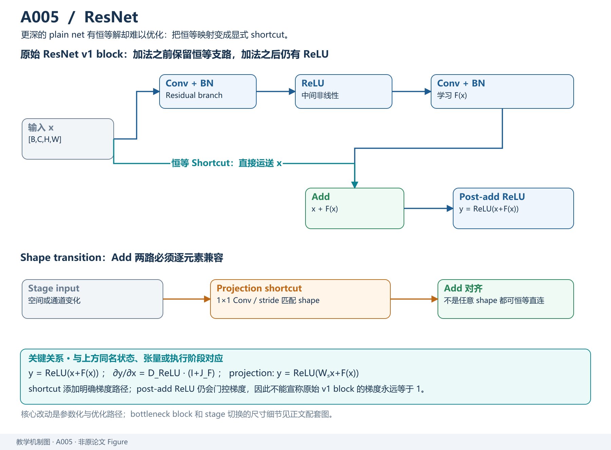
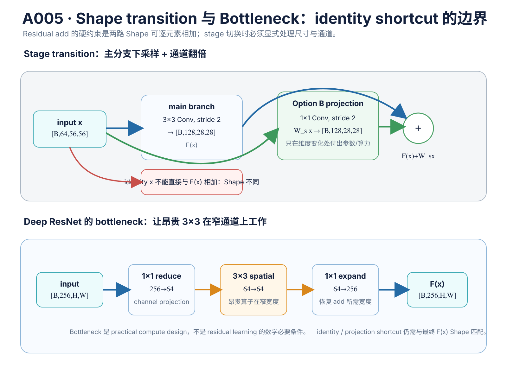
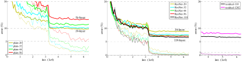
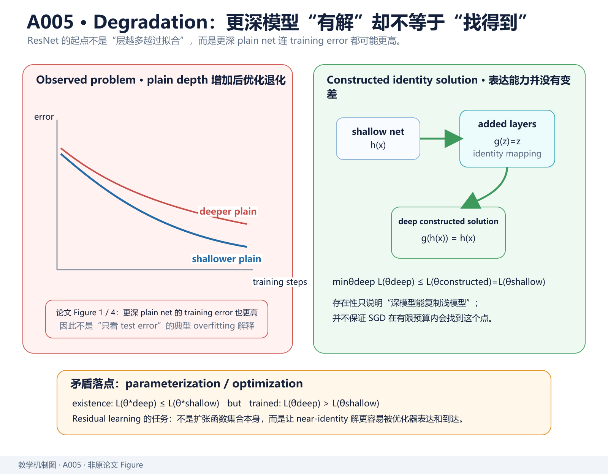
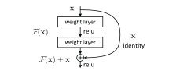
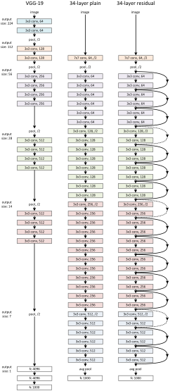
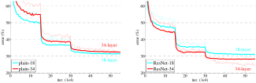
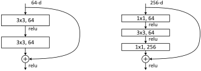
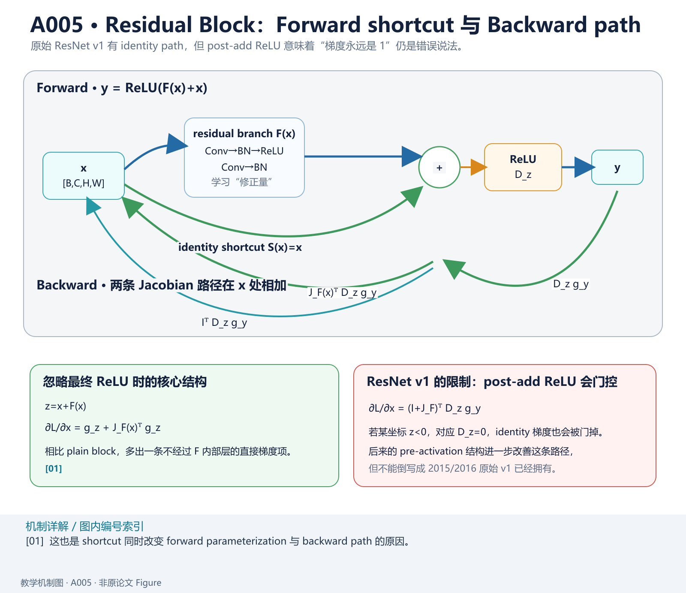

> **V2 重写 · A005 / Paperlist 第 5 篇**  
> Kaiming He、Xiangyu Zhang、Shaoqing Ren、Jian Sun，[*Deep Residual Learning for Image Recognition*](https://arxiv.org/abs/1512.03385)，CVPR 2016。本文以 [原论文 PDF](https://arxiv.org/pdf/1512.03385) 为主线，原始 Figure 1–5 直接从 arXiv 源文件中的矢量图资产渲染到 `figures/A005/`，来源映射见 [figure_manifests/A005.json](../../../figure_manifests/A005.json)。
>
> **版本边界**：本文讨论的是原始 **ResNet v1**：残差相加以后再经过 ReLU。2016 年后续 [*Identity Mappings in Deep Residual Networks*](https://arxiv.org/abs/1603.05027) 的 pre-activation 结构不是这篇论文的原始架构，因此不能把 pre-activation 的更纯净恒等梯度性质反写成本文已经拥有。本文的 Jacobian、部署和现代 Transformer 对照属于教学扩展，原文贡献仍以 residual learning、identity shortcut 与 ImageNet/CIFAR 实验为准。

# 模型定位与谱系

## 1. 论文解决的不是“如何让网络更深”，而是“为什么更深反而训练得更差”

在 ResNet 之前，视觉模型已经沿着 AlexNet → VGG / GoogLeNet 的路线持续加深。一个很自然的直觉是：

> 更深模型的函数集合更大，至少不应该比一个较浅模型在训练集上拟合得更差。

但论文观察到一个反常现象：

- 34-layer plain net 比 18-layer plain net **训练误差更高**；
- CIFAR-10 中更深 plain net 也出现相同现象。

这不是典型 overfitting。overfitting 通常是：

~~~text
training error 继续下降
validation / test error 上升
~~~

论文的 degradation problem 却是：

~~~text
depth 增加
   ↓
training error 自己就更高
   ↓
说明优化器没有充分利用新增表达能力
~~~

**主要类型：A 原始方法论文。** 它既提出一般可复用的 residual learning 参数化，也实例化成 ResNet-18/34/50/101/152 架构族。

## 2. “存在更好的解”为什么不等于“SGD 找得到”？

设一个浅网络已经学习到映射

$$
h(x).
$$

现在在它后面增加若干层。如果新增层可以表示 identity：

$$
g(x)=x,
$$

那么更深网络至少存在一个参数配置：

$$
g(h(x))
=
h(x).
$$

也就是说，理论上可以把浅网络解**嵌入**深网络的解空间。

因此如果优化完全成功，更深模型的最优训练误差不应该因为“多了几层”而必然更高。

论文真正暴露的是：

> **解存在，但当前参数化 + SGD 不容易找到它。**

这个区分非常关键：

- **expressivity**：有没有参数能表示好函数；
- **optimization**：训练过程能不能找到那些参数。

ResNet 的目标是改变后者。

## 3. Residual Learning 的第一性原理

原本希望一组层直接逼近

$$
\mathcal H(x).
$$

论文改写成学习

$$
\mathcal F(x)
=
\mathcal H(x)-x.
$$

实际输出再恢复：

$$
\boxed{
\mathcal H(x)
=
\mathcal F(x)+x
}.
$$

如果最优映射接近 identity：

$$
\mathcal H(x)\approx x,
$$

那么

$$
\mathcal F(x)\approx0.
$$

于是网络不再必须“用数层非线性重新造一个 $x$”，而只要学习：

> 在已有表示上应该修改多少？

原文使用的是 **“We hypothesize that it is easier…”**。这非常重要：作者把“residual 更容易优化”作为假设，再用实验支撑，而不是先给一个全局优化定理。

## 4. 技术树

~~~text
深层 CNN
  ↓
VGG / GoogLeNet：继续增加深度
  ↓
vanishing / exploding gradient 大幅缓解
  ├── 更好的初始化
  └── BatchNorm
  ↓
仍出现 degradation problem
  ↓
Residual Learning
  ├── 主分支 F(x)
  └── shortcut S(x)
       ├── identity
       └── projection（必要时匹配维度）
  ↓
ResNet-18/34
  ↓
Bottleneck → ResNet-50/101/152
  ↓
后续 pre-activation、残差流、Transformer residual stream 等
~~~

BatchNorm、ReLU、SGD 都是本文 **ADOPTS** 的技术，不是本文提出。

*教学解释图｜identity shortcut 同时改写前向映射与反向梯度路径，使深层网络拥有稳定的残差通道。*

# 输入、输出与任务

## 1. ImageNet 输入输出

论文 ImageNet 分类：

$$
X
\in
\mathbb R^{B\times3\times224\times224},
$$

标签

$$
y
\in
\{0,\ldots,999\}^{B}.
$$

最后分类 logits：

$$
z
\in
\mathbb R^{B\times1000}.
$$

训练目标为监督分类交叉熵。

ResNet 的创新不依赖 224×224 尺寸；真正的结构约束来自**残差两路必须能够逐元素相加**。

## 2. Basic Block 的 Shape

设输入

$$
x
\in
\mathbb R^{B\times C\times H\times W}.
$$

同一 stage 内的 basic block：

~~~text
x [B,C,H,W]
 │
 ├───────────────────────────────┐
 │                               │
 ↓                               │
3×3 Conv → BN → ReLU             │
 ↓                               │
3×3 Conv → BN                    │
 ↓ F(x) [B,C,H,W]                │
 └────────────── + ←──────────────┘
                 ↓
               ReLU
                 ↓
          y [B,C,H,W]
~~~

只有当

$$
\operatorname{shape}(F(x))
=
\operatorname{shape}(x)
$$

时，identity shortcut 才能直接相加。

## 3. 维度变化时为什么需要特殊 shortcut？

假设 stage 切换：

*教学解释图｜Shape Projection Bottleneck。*

$$
x:
[B,64,56,56],
$$

主分支输出：

$$
F(x):
[B,128,28,28].
$$

两者不能直接相加。

原论文考虑：

### Option A：identity + zero padding

空间通过 stride 下采样，新增通道用 0 填充。

优点：

- 无额外参数；
- 仍保持 shortcut 参数免费。

缺点：

- 新增通道没有来自 shortcut 的可学习信息。

### Option B：只在维度变化处做 projection

用

$$
W_sx
$$

匹配 Shape，典型实现为 stride 2 的 $1\times1$ convolution。

### Option C：所有 shortcut 都做 projection

参数和计算更多。

论文实验显示 A/B/C 都比 plain 好，B 略好于 A，C 仅略好于 B，因此作者后续深模型主要采用 **B**：只在维度变化处 projection。

## 4. ResNet-34 的完整 Shape 流

原文 Table 1：

~~~text
Input
[B,3,224,224]
    ↓ 7×7 Conv, 64, stride 2
[B,64,112,112]
    ↓ 3×3 MaxPool, stride 2
[B,64,56,56]

conv2_x:
[3×3,64
 3×3,64] × 3
→ [B,64,56,56]

conv3_x:
[3×3,128
 3×3,128] × 4
→ [B,128,28,28]

conv4_x:
[3×3,256
 3×3,256] × 6
→ [B,256,14,14]

conv5_x:
[3×3,512
 3×3,512] × 3
→ [B,512,7,7]

Global Average Pool
→ [B,512]

FC
→ [B,1000]
~~~

计数：

$$
1
+
2(3+4+6+3)
+
1
=
34.
$$

这里的“34 layers”按论文惯例计 weighted layers；projection shortcut 的 $1\times1$ 通常不因此改变模型命名。

## 5. Bottleneck 的 Shape

ResNet-50/101/152 使用：

$$
1\times1
\rightarrow
3\times3
\rightarrow
1\times1.
$$

例如一个输出宽度 256 的 bottleneck：

~~~text
[B,256,H,W]
    ↓ 1×1: 256 → 64
[B,64,H,W]
    ↓ 3×3: 64 → 64
[B,64,H,W]
    ↓ 1×1: 64 → 256
[B,256,H,W]
    + shortcut
    ↓
[B,256,H,W]
~~~

$1\times1$ 并不是“提取空间局部特征”的主力，它主要在这里承担**通道维压缩和恢复**，让昂贵的 $3\times3$ 在较窄通道上运行。

# 骨干架构与信息交互

## 1. Figure 1：degradation problem 的第一张证据图

*教学解释图｜Degradation Identity Argument。*

*原论文 Figure 1，源文件 `eps/cifar.pdf`。左侧 training error，右侧 test error；比较 20-layer 与 56-layer plain networks。*

先看左图。

如果问题只是 overfitting，更深网络应该能够把 training error 压得更低，只是 test error 更差。

但图里更深 plain net 的**训练误差也更高**。

这正是作者为什么使用 “degradation problem” 而不是简单写“overfitting”。

这张图能支持：

> 在作者给定 plain architecture / optimizer / BN 配置下，增加深度造成了明显优化困难。

它不能单独证明：

> 任意深层网络都必然存在这种退化。

## 2. Figure 2：整篇论文最重要的一张结构图

*原论文 Figure 2，源文件 `eps/block.pdf`。*

图里有两条信息路径：

1. 主分支：
   :::{math}
   x
   \rightarrow
   \mathcal F(x)
   :::
2. shortcut：
   :::{math}
   x
   \rightarrow
   x
   :::

然后逐元素相加：

$$
y_{\mathrm{pre}}
=
\mathcal F(x)+x.
$$

原始 ResNet v1 再做：

$$
y
=
\operatorname{ReLU}
\left(
\mathcal F(x)+x
\right).
$$

图中的弯曲 shortcut 不是“另一组特征拼接”。

如果是 channel concatenation：

$$
[\mathcal F(x);x],
$$

通道数会增加，还需要后续层重新融合。

ResNet 是**element-wise addition**：

$$
\mathcal F(x)+x,
$$

Shape 不变，主分支被明确解释成“对现有表示的修正”。

## 3. Figure 3：为什么 plain-34 与 ResNet-34 可以做较干净对照？

*原论文 Figure 3，源文件 `eps/arch.pdf`。*

中间 plain-34 与右侧 ResNet-34：

- 深度相同；
- 主卷积布局相同；
- width 大体相同；
- 主要区别是 shortcut。

所以作者能够构造一个比“ResNet vs VGG”更干净的问题：

> 在几乎相同主干计算下，只加入 parameter-free identity shortcut，会不会改变优化难度？

这比直接拿 ResNet-152 和 VGG-19 排名更有因果解释力。

## 4. Figure 4：ImageNet 上 plain / residual 的训练轨迹

*原论文 Figure 4，源文件 `eps/imagenet.pdf`。细线为 training error，粗线为 center-crop validation error；左侧 plain 18/34，右侧 residual 18/34。*

左侧：

- plain-34 training error 长期高于 plain-18；
- degradation 再次出现。

右侧：

- ResNet-34 反而低于 ResNet-18；
- 增加深度开始带来训练和验证收益。

这张图比“最终 top-1 数字”更重要，因为它直接显示：

> residual parameterization 改变了**优化轨迹**，不是只在测试阶段偶然得到更好分数。

论文 Table 2 进一步给出：

| 模型 | Top-1 error |
|---|---:|
| plain-18 | 27.94% |
| plain-34 | 28.54% |
| ResNet-18 | 27.88% |
| ResNet-34 | 25.03% |

关键不是单纯 “25.03 最低”，而是深度关系反转：

~~~text
Plain:
18 → 34
性能变差

Residual:
18 → 34
性能变好
~~~

## 5. Figure 5：为什么深层 ResNet 要换 bottleneck？

*原论文 Figure 5，源文件 `eps/block_deeper.pdf`。左为两层 3×3 basic block，右为 1×1–3×3–1×1 bottleneck。*

作者明确说，使用 bottleneck 主要是**practical considerations / training-time budget**。

这句话很重要。

Bottleneck 不是 residual learning 数学上必需的条件。

它是在“已经接受 residual block”以后，为了让 50/101/152 层网络计算可承受而采用的工程结构。

例如教学计算：

若全宽 $C=256$ 的两个 $3\times3$：

$$
2\times9\times256^2
=
1{,}179{,}648
$$

个权重。

若 bottleneck 内宽 $64$：

$$
256\times64
+
9\times64^2
+
64\times256
=
69{,}632.
$$

这不是说两者表达能力完全等价，而是说明为什么深层网络需要先缩通道再做 $3\times3$。

# 关键技术

## 1. 最关键的逻辑：constructed solution 是存在性论证，不是训练保证

原文 Introduction 有一个很漂亮的论证。

假设浅网络参数已经给出良好函数：

$$
f_{\mathrm{shallow}}(x).
$$

给深网络新增层，并让新增层都实现 identity：

$$
g_i(z)=z.
$$

于是深网络可以复制浅网络：

$$
f_{\mathrm{deep}}(x)
=
f_{\mathrm{shallow}}(x).
$$

所以：

$$
\min_{\theta_{\mathrm{deep}}}
L(\theta_{\mathrm{deep}})
\le
L(\theta_{\mathrm{constructed}})
=
L(\theta_{\mathrm{shallow}}),
$$

只要深模型确实包含这个构造解。

可是实验得到的**训练结果**却是：

$$
L(\hat\theta_{\mathrm{deep}})
>
L(\hat\theta_{\mathrm{shallow}}).
$$

注意两个符号不同：

- $\theta^\star$：全局/理想最优；
- $\hat\theta$：实际训练算法找到的参数。

因此 degradation 说明的不是：

> 深模型表达能力更弱。

而是：

> 当前 solver 没有在可行预算里找到至少和 constructed identity solution 一样好的点。

这是 ResNet 动机的逻辑核心。

## 2. 为什么学习 residual 可能比直接学习 identity 更容易？

目标：

$$
\mathcal H(x).
$$

传统 plain stack：

$$
\mathcal H_\theta(x)
=
F_\theta(x).
$$

ResNet：

$$
\mathcal H_\theta(x)
=
x+F_\theta(x).
$$

如果目标接近 identity：

$$
\mathcal H(x)
=
x+\delta(x),
$$

那么 ResNet 主路只需拟合

$$
F_\theta(x)
\approx
\delta(x).
$$

当

$$
\delta(x)
$$

较小时，零附近就成为自然参考点。

但要强调：

> “更接近零”并不自动推出“非凸优化一定更容易”。

原文自己写的是 **hypothesize**，并在 CIFAR layer-response 实验中观察 residual responses 通常更小，以此提供经验支持。

## 3. 梯度为什么多了一条 identity 路径？

先忽略最终 ReLU：

*教学解释图｜Residual Gradient Highway。*

$$
z
=
x+F(x).
$$

下游给出

$$
g_z
=
\frac{\partial L}{\partial z}.
$$

Jacobian：

$$
\frac{\partial z}{\partial x}
=
I+J_F(x).
$$

因此

$$
\begin{aligned}
\frac{\partial L}{\partial x}
&=
\left(
I+J_F(x)
\right)^\top
g_z\\
&=
g_z
+
J_F(x)^\top g_z.
\end{aligned}
$$

相较 plain mapping

$$
z=F(x),
$$

只有

$$
\frac{\partial L}{\partial x}
=
J_F^\top g_z,
$$

residual block 至少多出一项

$$
g_z.
$$

这就是“shortcut 提供更直接梯度通路”的数学来源。

### 但原始 ResNet v1 不能写成“梯度永远等于 1”

原始 v1：

$$
y
=
\operatorname{ReLU}(z),
\qquad
z=x+F(x).
$$

定义 ReLU 局部 Jacobian

$$
D_z
=
\operatorname{diag}
\left(
\mathbf 1_{z>0}
\right).
$$

则

$$
\boxed{
\frac{\partial L}{\partial x}
=
\left(
I+J_F(x)
\right)^\top
D_z
g_y
}.
$$

当 $z<0$ 时，post-add ReLU 会把该坐标梯度门掉。

因此：

> 原始 ResNet v1 有 identity shortcut，但并不等于“任何层任何坐标都有无条件单位梯度”。

后来的 pre-activation ResNet 正是继续优化这一点。

## 4. Projection shortcut 时梯度公式怎样改？

若维度变化：

$$
z
=
F(x)
+
W_sx,
$$

那么

$$
\frac{\partial z}{\partial x}
=
J_F(x)
+
W_s.
$$

于是

$$
\boxed{
\frac{\partial L}{\partial x}
=
\left(
J_F+W_s
\right)^\top
D_zg_y
}.
$$

只有当

$$
W_s=I
$$

时，才是真正 identity shortcut。

所以“ResNet 所有 shortcut 都是无参数 identity”是错误表述。

## 5. 一个二维例子：主路学的是改变量

假设输入

$$
x=(2,-1),
$$

目标局部映射

$$
\mathcal H(x)
=
(2.2,-0.8).
$$

plain 分支要直接产生

$$
(2.2,-0.8).
$$

residual 分支只要产生

$$
F(x)
=
\mathcal H(x)-x
=
(0.2,0.2).
$$

于是

$$
x+F(x)
=
(2.2,-0.8).
$$

这说明“residual 是修正量”的语义。

但原始 v1 最后还有 ReLU：

$$
y
=
\operatorname{ReLU}(x+F(x)).
$$

所以如果第二个坐标仍为负，它会变成 0。不能把

$$
x+F(x)
$$

直接当作整个 block 的最终函数。

## 6. 为什么 identity shortcut 的实验价值比 projection 更大？

若 plain 与 residual 模型主分支相同，只多出一个**无参数、几乎无 FLOPs**的 identity shortcut，那么：

- 参数量几乎不变；
- width 不变；
- 主卷积不变；
- depth 不变。

因此性能差异更容易归因于参数化方式本身。

这也是论文 §3.2 特意强调 shortcut “introduce neither extra parameter nor computational complexity” 的原因。

它不仅是部署优点，更是**实验设计优点**。

## 7. 为什么 $F$ 不是一层线性层？

原文明确说，实验中的 residual function 通常有两层或三层。

若只有一层：

$$
y
=
W_1x+x
=
(W_1+I)x.
$$

这和重新参数化一个线性层非常接近，作者没有观察到明显优势。

因此 ResNet 的关键不只是“任何地方加一个 $+x$”，而是：

> 给一个多层非线性子网络提供 identity reference。

## 8. Bottleneck 为什么主要是算力问题？

一个 $3\times3$ 卷积 MACs 近似：

$$
HWC_{\mathrm{out}}
\left(
C_{\mathrm{in}}k^2
\right).
$$

若直接在高通道宽度做多个 $3\times3$，深度很快变得昂贵。

bottleneck：

$$
1\times1:
C
\rightarrow
C_b,
$$

$$
3\times3:
C_b
\rightarrow
C_b,
$$

$$
1\times1:
C_b
\rightarrow
C,
$$

让最昂贵的空间卷积运行在

$$
C_b\ll C
$$

的通道宽度。

原文甚至明确说：

> bottleneck 的使用主要来自 practical considerations。

所以不要把“1×1–3×3–1×1”当成 residual learning 的理论必要条件。

## 9. 原文训练控制：为什么 Figure 4 比榜单更能说明 residual learning？

ImageNet plain/residual 对照采用相同大框架：

- BN after each conv, before activation；
- SGD；
- batch size 256；
- initial lr 0.1；
- plateau 时除以 10；
- momentum 0.9；
- weight decay 0.0001；
- 不使用 dropout。

因此 Figure 4 对“plain vs residual”有较强解释力。

反之，最终 ILSVRC ensemble：

- 多模型；
- 多尺度；
- 竞赛 recipe；
- 可能与单模型消融不同。

所以：

> **榜单证明系统最终效果；Figure 4 更接近证明结构改动本身。**

两类证据不要混用。

## 10. 最小 PyTorch：原始 v1 BasicBlock

~~~python
import torch
from torch import nn

class BasicBlockV1(nn.Module):
    def __init__(self, in_channels, out_channels, stride=1):
        super().__init__()

        self.conv1 = nn.Conv2d(
            in_channels,
            out_channels,
            kernel_size=3,
            stride=stride,
            padding=1,
            bias=False,
        )
        self.bn1 = nn.BatchNorm2d(out_channels)

        self.conv2 = nn.Conv2d(
            out_channels,
            out_channels,
            kernel_size=3,
            stride=1,
            padding=1,
            bias=False,
        )
        self.bn2 = nn.BatchNorm2d(out_channels)

        self.relu = nn.ReLU(inplace=False)

        if stride == 1 and in_channels == out_channels:
            self.shortcut = nn.Identity()
        else:
            self.shortcut = nn.Sequential(
                nn.Conv2d(
                    in_channels,
                    out_channels,
                    kernel_size=1,
                    stride=stride,
                    bias=False,
                ),
                nn.BatchNorm2d(out_channels),
            )

    def forward(self, x):
        residual = self.relu(self.bn1(self.conv1(x)))
        residual = self.bn2(self.conv2(residual))

        y = residual + self.shortcut(x)

        # ResNet v1: addition 后再 ReLU
        return self.relu(y)

same = BasicBlockV1(64, 64)
change = BasicBlockV1(64, 128, stride=2)

x = torch.randn(2, 64, 56, 56)

assert same(x).shape == (2, 64, 56, 56)
assert change(x).shape == (2, 128, 28, 28)
~~~

Shape：

- identity block：
  :::{math}
  [2,64,56,56]
  \rightarrow
  [2,64,56,56]
  :::
- projection block：
  :::{math}
  [2,64,56,56]
  \rightarrow
  [2,128,28,28].
  :::

当前 MCP 默认 Python 没有 PyTorch，因此这里只完成代码结构、Shape 与论文 v1 布局审查，**不声称本地运行通过**。

## 11. 实验：真正需要保留哪些控制变量？

### ImageNet plain vs residual

| 模型 | Top-1 error（10-crop） |
|---|---:|
| plain-18 | 27.94% |
| plain-34 | 28.54% |
| ResNet-18 | 27.88% |
| ResNet-34 | 25.03% |

最关键的观察：

- plain：更深变差；
- residual：更深变好。

### Shortcut A / B / C

原文报告：

- A：zero-padding + identity；
- B：只在维度变化处 projection；
- C：所有 shortcut projection。

A/B/C 都显著优于 plain；B 仅略优于 A，C 又仅略优于 B。

所以：

> projection 不是解决 degradation 的必要条件。

identity shortcut 才是作者希望强调的最小机制。

### 50 / 101 / 152 层

原文 Table 1 计算量：

- ResNet-50：约 3.8B FLOPs；
- ResNet-101：约 7.6B；
- ResNet-152：约 11.3B。

作者同时指出 ResNet-152 的计算量仍低于 VGG-16/19 的 15.3/19.6B（按论文计数口径）。

这支持：

> bottleneck 让深度扩张在计算上可承受。

不能推出：

> FLOPs 越少，GPU latency 一定越低。

### CIFAR-10 超深实验

论文 Table 6：

| ResNet | 参数量 | Test error |
|---|---:|---:|
| 20 | 0.27M | 8.75% |
| 32 | 0.46M | 7.51% |
| 44 | 0.66M | 7.17% |
| 56 | 0.85M | 6.97% |
| 110 | 1.7M | 6.43%（五次均值约 $6.61\pm0.16$） |
| 1202 | 19.4M | 7.93% |

1202-layer 模型 training error 可以非常低，但 test error 反而比 110-layer 差。

这恰好说明：

> residual learning 解决“难以优化极深网络”，并不等于“越深泛化一定越好”。

到这里，degradation 与 overfitting 被清楚分开：

- plain 深网：training error 高 → optimization；
- 1202-layer ResNet：training error 极低、test 更差 → overfitting / capacity。

# 预训练与后训练

本文不是现代 LLM 的 pretraining / SFT / preference learning 工作。

但它确实包含一个今天仍很熟悉的视觉迁移流程：

~~~text
ImageNet supervised training
       ↓
得到 ResNet visual backbone
       ↓
替换 VGG backbone
       ↓
Faster R-CNN 等 detector fine-tuning
       ↓
PASCAL / COCO detection
~~~

所以从现代术语看：

- ImageNet 分类训练可视为通用视觉表征预训练；
- detection 是下游任务迁移；
- 但目标不是 next-token prediction、instruction tuning 或 RLHF。

## 原文 ImageNet 训练 recipe

论文 §3.4：

- 随机 resize：短边从 $[256,480]$ 采样；
- 随机 $224\times224$ crop 和 horizontal flip；
- per-pixel mean subtraction；
- color augmentation；
- 每个 convolution 后、activation 前使用 BN；
- He-style initialization；
- SGD；
- batch size 256；
- 初始 learning rate 0.1；
- error plateau 时 learning rate 除以 10；
- 最多约 $60\times10^4$ iterations；
- weight decay 0.0001；
- momentum 0.9；
- 不使用 dropout。

这说明一个重要事实：

> ResNet 的实验成功不是“只靠 shortcut”，而是在当时一套成熟 CNN training recipe 上验证 shortcut 的增量价值。

但 plain/residual 对照尽量保持这些 recipe 相同，因此 residual 结构仍具有较强的干预解释力。

## Detection 迁移怎样读？

原文在相同 Faster R-CNN baseline 下，把 VGG-16 backbone 替换为 ResNet-101，报告 PASCAL/COCO detection 提升。

这支持：

> ResNet 学到的视觉表示能迁移到分类之外。

但 detection 最终结果仍受：

- detector head；
- anchor / proposal；
- image scale；
- fine-tuning recipe；
- inference procedure

影响。

所以竞赛最终榜单不是 residual block 单一结构的纯消融。

# 推理与部署

## 1. Identity shortcut 真的“零成本”吗？

从参数和主要 MACs 看，同 Shape 的 identity shortcut：

- 0 trainable parameters；
- 0 convolution MACs；
- 只做 element-wise addition。

但系统层面仍然需要：

- 保存/读取输入激活 $x$；
- 等待主分支 $F(x)$ 完成；
- 读两路数据；
- 写加法输出。

因此：

> “no extra computational complexity” 是相对卷积主算力的架构级表述，不等于现代 GPU/NPU 上绝对 0 latency / 0 HBM traffic。

## 2. Projection shortcut 有真实额外成本

若 shortcut 是

$$
W_sx,
$$

$1\times1$ convolution 需要实际 GEMM/Conv 计算和参数读取。

所以部署统计时必须区分：

- identity shortcut；
- projection shortcut。

## 3. FLOPs / MACs 计数口径

卷积 MACs：

$$
\mathrm{MACs}
=
H_{\mathrm{out}}
W_{\mathrm{out}}
C_{\mathrm{out}}
\left(
C_{\mathrm{in}}k_hk_w
\right).
$$

有的资料把

$$
1\ \mathrm{MAC}
$$

计成 1 FLOP，有的计成 2 FLOPs（multiply + add）。

原论文给出 3.6B / 11.3B 等“FLOPs”时，应在论文自身口径下做横向比较，不应直接与现代 profiler 未核对口径的 TFLOPs 数字相减。

## 4. BN 可以在 inference 融合，但 residual add 仍存在

BN 推理固定统计后可折进前一 Conv：

$$
W'
=
aW,
$$

$$
b'
=
a(b-\mu)+\beta,
$$

其中

$$
a
=
\frac{\gamma}
{\sqrt{\sigma^2+\epsilon}}.
$$

所以 Conv+BN 可减少独立 kernel。

但 residual block 仍然需要：

$$
F(x)+S(x).
$$

这条 merge 不能简单消失，因为它就是网络函数定义。

## 5. 边缘部署为什么不能只看“层数”？

ResNet-50 比某些更浅但更宽的网络：

- 层数更多；
- 但每层通道结构不同；
- bottleneck 降低 $3\times3$ 成本；
- kernel shape 与硬件利用率不同；
- activation memory lifetime 也不同。

因此 wall-clock latency 需要实测：

- batch size；
- Conv kernel implementation；
- TensorRT/NPU fusion；
- memory bandwidth；
- precision；
- input resolution。

不能由“50 layers”直接推出一定慢于“34 layers”。

**Prefill / Decode / KV Cache 不适用于原始 ResNet。**

## 技术 → 模型

- **Residual Learning → ResNet v1**：`PROPOSES`
- **Identity Shortcut → ResNet-18/34/50/101/152**：`IMPLEMENTS`
- **Projection Shortcut → stage transition**：`OPTIONAL / IMPLEMENTS`
- **Bottleneck → ResNet-50/101/152**：`IMPLEMENTS`
- **BatchNorm → ResNet v1**：`ADOPTS`
- **Residual connection → later Transformers**：后续架构广泛 `ADOPTS` 残差思想，但 Attention/FFN 并非本文提出

## 模型 → 技术

- **ResNet-34**：`IMPLEMENTS` $[3,4,6,3]$ basic blocks；`ADOPTS` Conv/BN/ReLU/SGD
- **ResNet-50**：`DERIVED_FROM` residual framework；`IMPLEMENTS` bottleneck + option B projection
- **ResNet-101/152**：`EXTENDS` bottleneck stage depth
- **Pre-activation ResNet**：`EXTENDS` ResNet v1，并重新安排 BN/ReLU 与 shortcut 路径
- **Transformer**：`ADOPTS` 广义 residual stream；不应标作 `DERIVED_FROM` ResNet 的 CNN 主干

# 论文细读

## 1. Abstract：第一句为什么是 “Deeper neural networks are more difficult to train”？

**定位：Abstract，PDF p.1。**

作者没有从“我们的模型达到多少准确率”开场，而是先提出一个**训练问题**：

> 深网络更难训练。

这句话直接限定论文贡献层级：作者不是首先声称“更深一定更强”，而是问：

> 怎样让那些理论上更有表达能力的深网真正可优化？

第二句紧接：

> “We present a residual learning framework…”

所以 Abstract 的逻辑是：

~~~text
问题：depth 难训练
   ↓
方法：reformulate as residual functions
   ↓
证据：easier to optimize
   ↓
结果：can gain accuracy from increased depth
~~~

“easier to optimize” 在这里是**实验主张**，后面必须由 plain/residual training curves 支撑。

## 2. Abstract 后半为什么把 152 layers、VGG complexity、竞赛结果连续写在一起？

作者从方法证据切到规模与应用：

- 152 layers；
- 比 VGG 深约 8×；
- 但 complexity 更低；
- ensemble 获得 3.57% top-5 test error；
- detection / localization / segmentation 也受益。

这段的功能是告诉读者：

> residual learning 不只是一个 toy optimization trick，它能支撑当时非常深、非常强的视觉系统。

但要区分证据：

- 152-layer single model：说明深度可训练；
- ensemble 3.57%：说明完整竞赛系统很强；
- detection gains：说明表征可迁移。

它们不是同一个消融。

## 3. Introduction 第 1–3 段：为什么先强调“depth 很重要”？

作者先回顾 CNN 在图像任务上的成功，再指出 VGG、GoogLeNet 等领先模型都依赖“very deep”架构。

这一步在建立研究价值：

> 如果 depth 不重要，那解决深网优化也没有意义。

因此前几段实际上建立：

$$
\text{depth useful}
\quad+\quad
\text{depth hard to optimize}
\quad\Rightarrow\quad
\text{worth solving}.
$$

## 4. “Is learning better networks as easy as stacking more layers?” 是全文真正的问题句

这一句是 Introduction 的关键转折。

作者先承认 depth 重要，然后立即追问：

> 既然深度有价值，直接堆层是不是就行？

接下来先提 vanishing/exploding gradients。

但作者没有把 ResNet 动机简单写成“解决梯度消失”，而是马上说：

> 这个问题已经在很大程度上被 normalized initialization 与 intermediate normalization layers 缓解。

这句非常重要。

它是在**排除一个旧解释**，为后面的 degradation problem 腾出位置。

## 5. Figure 1 前后的 “Unexpectedly” 为什么重要？

作者写：

> 深度继续增加后 accuracy 饱和并退化；**unexpectedly**，这种 degradation 不是由 overfitting 导致，因为 training error 也更高。

“unexpectedly” 表明这与传统统计学习直觉不同。

如果只是 test error 高，原因很多；但 training error 更高意味着：

> 优化算法甚至没把更大的函数空间利用起来。

因此 Figure 1 不是简单 benchmark 图，而是**问题定义图**。

## 6. “There exists a solution by construction” 是全文最漂亮的一段逻辑

作者让我们想象：

1. 已经训练好一个 shallow model；
2. deep model 复制浅模型已有层；
3. 新增层全部做 identity。

那么 deep model 至少拥有一个与 shallow model 一样好的训练解。

这个 argument 非常有力，因为它不用知道真实最优函数是什么。

它只证明：

> 深模型不应该因为“函数表达范围更小”而训练得更差。

紧接着作者写：

> 当前 solver 却找不到 comparable solution。

于是问题从“深网络有没有能力”被精准重定向成：

> **现有参数化是否让 identity / near-identity 很难学？**

Residual formulation 正好回答这个问题。

## 7. “We hypothesize” 必须原样保留其证据强度

作者说：

> “We hypothesize that it is easier to optimize the residual mapping…”

这不是定理。

论文没有证明所有损失面上

$$
F(x)=H(x)-x
$$

一定比

$$
H(x)
$$

更容易优化。

作者给的是：

- constructed identity argument；
- parameterization intuition；
- plain vs residual experiments；
- layer response magnitude analysis。

因此中文不能写：

> “数学证明了残差一定更容易优化。”

应写：

> “作者提出这一假设，并给出强经验支持。”

## 8. Figure 2 段落：为什么作者强调 identity shortcut “neither extra parameter nor complexity”？

这个措辞有两个层次。

### 工程层

identity shortcut 非常便宜。

### 实验层

更重要的是它让 plain/residual comparison 更公平：

- same depth；
- same width；
- same number of main parameters；
- similar computational cost。

所以一旦 residual model 更容易训练，不能轻易把原因归结成“它只是参数更多”。

这是一个很好的论文设计原则：

> **把方法设计成便于做干净对照。**

## 9. Related Work 为什么分成 Residual Representations 与 Shortcut Connections 两条线？

作者不想把“residual”说成自己第一次发明的抽象思想。

所以先回顾：

- VLAD / Fisher Vector；
- multigrid / hierarchical basis；
- 残差式求解思想。

然后另一条线回顾：

- 历史 shortcut connection；
- auxiliary classifier；
- Inception branches；
- Highway Networks。

最后指出本文区别：

> Highway 有 data-dependent, parameterized gates；本文 identity shortcut parameter-free、不会关闭。

这段的写作作用是划定**原创性边界**：

> 新意不是“世界第一次出现 shortcut”，而是这种 identity residual reformulation 在超深 CNN 中的具体设计与证据。

## 10. §3.1 脚注为什么值得注意？

作者说：

> 如果多层 nonlinear network 可以渐近逼近复杂函数……

脚注马上承认：

> 这个假设本身仍是 open question。

这是一种很好的学术克制。

论文并没有假装掌握通用神经网络优化理论，而是在一个常用假设下比较：

$$
H(x)
$$

与

$$
H(x)-x
$$

两种参数化。

细读时应保留这种“假设—论证”关系。

## 11. §3.1 从 “identity optimal” 到 “real cases” 的让步结构

作者先用极端情形：

> 若 identity 就是最优函数，残差只需推到 0。

随后马上让步：

> 实际任务中 identity 不太可能就是精确最优。

为什么要主动说这句？

因为否则读者会批评：

> 图像分类网络怎么可能每两层都应该是 identity？

作者把更合理的论点降到：

> 最优映射如果**更接近 identity 而不是 zero mapping**，residual parameterization 可能更像一种 preconditioning。

这个版本弱一些，但更可信。

后面 Figure 7 观察 residual responses 更小，就是对这一弱化版本的支持。

## 12. §3.2 为什么 Eq.(1) 后马上补 Eq.(2)？

Eq.(1)：

$$
y
=
F(x)+x.
$$

读者立刻会遇到工程问题：

> 通道数或 feature-map size 改变时怎么加？

所以作者马上给

$$
y
=
F(x)+W_sx.
$$

这不是额外炫技，而是在把理论公式变成可构建 CNN 的必要补丁。

随后又说 projection 只在 matching dimensions 时使用，重新强调 identity shortcut 的经济性。

## 13. “single-layer residual function 没观察到优势”为什么值得保留？

作者明确指出：

$$
y
=
W_1x+x
$$

本质接近重新参数化一个 linear layer，实验中没有观察到相同优势。

这句话防止把 ResNet 粗暴总结成：

> “所有 Linear 后都加 x 就行。”

论文关注的是**多层 nonlinear mapping** 的 residual reformulation。

## 14. Figure 3 / §3.3：为什么先设计 plain baseline，再从它加 shortcut？

作者先定义 plain-34：

- 主要用 $3\times3$；
- 同空间尺寸保持 filter 数；
- 空间减半时通道翻倍；
- stride 2 下采样；
- GAP + 1000-way FC。

然后 residual network **基于同一 plain architecture 插入 shortcut**。

这种顺序是实验设计上的刻意安排。

如果作者一开始就给一个完全不同的 ResNet architecture，后面性能提升就无法区分：

> 是 shortcut 的作用，还是 width / filter / depth 配方变了？

## 15. §3.4：为什么训练 recipe 要写得这么具体？

BN、初始化、SGD、batch size、lr、momentum、weight decay、data augmentation 都写清楚，是因为作者后面要声称：

> plain 与 residual 的 optimization behavior 不同。

若训练 recipe 不透明，这个因果叙事就不可信。

特别值得注意：

> 论文已经用了 BN。

所以当 plain-34 仍然 degradation 时，作者可以更有底气说：

> 这不是简单的经典 vanishing/exploding gradient 故事。

## 16. §4.1 Plain Networks：作者为什么先只分析 plain，再转 residual？

作者没有直接把两组曲线混在一起讲。

先分析 plain：

- 34-layer validation error 更高；
- training error 也更高；
- BN 下梯度 norm 仍健康；
- 多训练 3× iterations 仍观察 degradation。

然后才进入 Residual Networks。

这个顺序是在先**建立问题确实存在**，再展示方法解决问题。

因此读者不会把 ResNet 结果看成单纯“新模型榜单”。

## 17. “We conjecture that deep plain nets may have exponentially low convergence rates” 为什么不能写成结论？

原文使用 **conjecture**。

作者观察：

- gradient norm 健康；
- 训练仍慢；
- 延长 iterations 仍没解决。

于是猜测 convergence rate 可能非常差。

但他们自己写：

> 原因将在未来研究。

所以不能把这一句改写成：

> “论文证明 plain deep nets 指数慢收敛。”

它只是一个基于现象的猜想。

## 18. Residual Networks 的 “three major observations” 是实验章最核心的段落

作者把 Table 2 / Figure 4 总结成三点。

### 第一

ResNet-34 优于 ResNet-18。

说明 depth 的收益恢复了。

### 第二

ResNet-34 显著优于 plain-34。

说明结构改动确实缓解 degradation。

### 第三

18-layer plain/residual 最终 accuracy 接近，但 ResNet 早期收敛更快。

这第三点很有价值：

> residual 并不是只有“非常深才有效”；即使 shallow solver 最终也能找到好解，residual parameterization 仍可能让优化路径更顺。

## 19. Shortcut A/B/C：为什么这个消融非常关键？

如果 projection 本身提供更多参数，读者可能怀疑：

> ResNet 好是不是只是因为 shortcut 学了额外矩阵？

所以作者比较：

- A：无参数 zero-pad；
- B：仅维度变化 projection；
- C：所有 projection。

三者都大幅优于 plain，差异却很小。

这支持：

> 解决 degradation 的核心并不依赖大量 projection parameters。

这比只展示 option B 的最好成绩更有机制说服力。

## 20. Figure 5 与 “practical considerations” 是工程论文写法的典型

作者没有假装 bottleneck 是更深理论。

他们很直接：

> 训练时间有限，所以改用 bottleneck。

这是非常值得学习的写作习惯：

- 哪些设计来自理论动机；
- 哪些来自算力预算；
- 哪些来自经验；

要明确分开。

ResNet 的成功不是所有决策都由一个统一数学定理推出。

## 21. CIFAR 100/1000 层：为什么 1202-layer 结果反而是论文的优点？

1202-layer：

- training error $<0.1\%$；
- test error 7.93%，比 110-layer 差。

作者没有藏掉这个负结果，而是明确讨论 overfitting。

这反而帮助我们分清两类问题：

### Optimization degradation

深度加大，training error 也高。

### Overfitting

training error 极低，但 test error 变差。

Residual learning 主要解决前者，不保证消灭后者。

## 22. Detection 结果：什么可以归因，什么不能？

作者在 Faster R-CNN baseline 中替换：

~~~text
VGG-16 backbone
      ↓
ResNet-101 backbone
~~~

其他 detection implementation 尽量保持一致，因此这组结果对 backbone representation quality 有较强指向性。

但竞赛最终系统还包含更多工程因素。

所以原文“strong evidence shows residual principle is generic”是作者依据跨任务结果做出的较强经验概括，而不是数学上证明 non-vision 任务也必然受益。

## 本篇最小闭环

真正读懂以后，应能自己回答：

1. 为什么 degradation problem 不能简单叫 overfitting？
2. “constructed identity solution” 到底证明了表达能力，还是证明了优化难度？
3. 为什么原文用 “we hypothesize” 而不是 “we prove” 来描述 residual easier to optimize？
4. identity shortcut 为什么同时是优化设计、工程设计和实验控制设计？
5. 为什么原始 v1 的梯度不能粗暴写成“永远有一条 1”？
6. Figure 4 与 ILSVRC ensemble 各自在证明什么，为什么不能混成一个证据？

能把这六个问题和 Figure 1–5、Eq.(1)/(2)、Table 1/2 串起来，才算真正完成对 ResNet 原论文的拆解。
