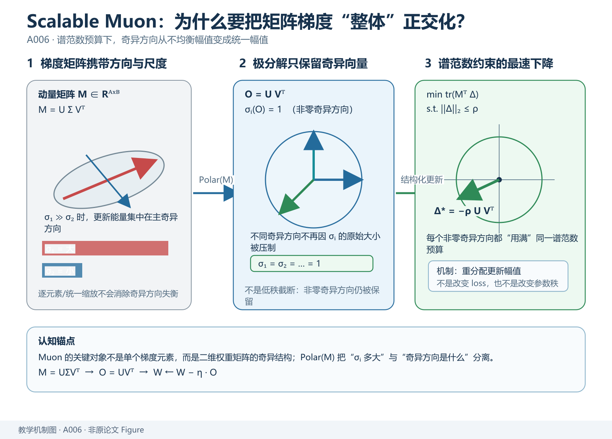
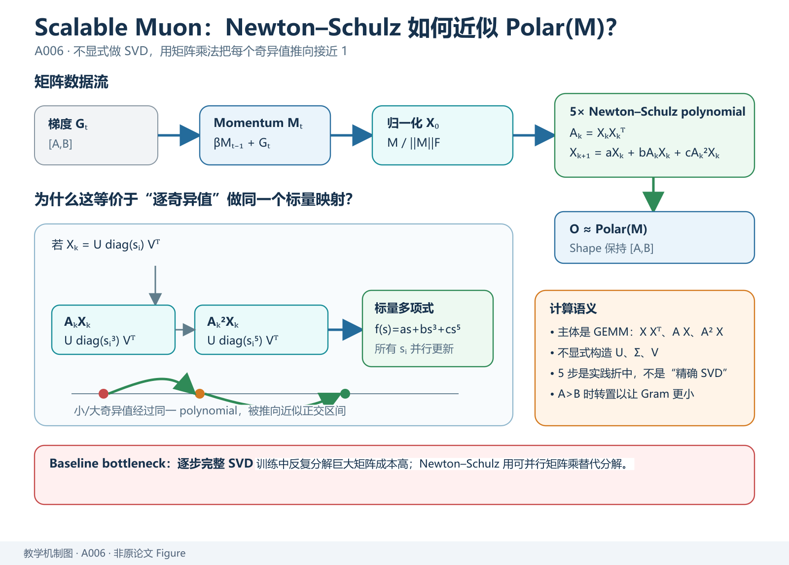
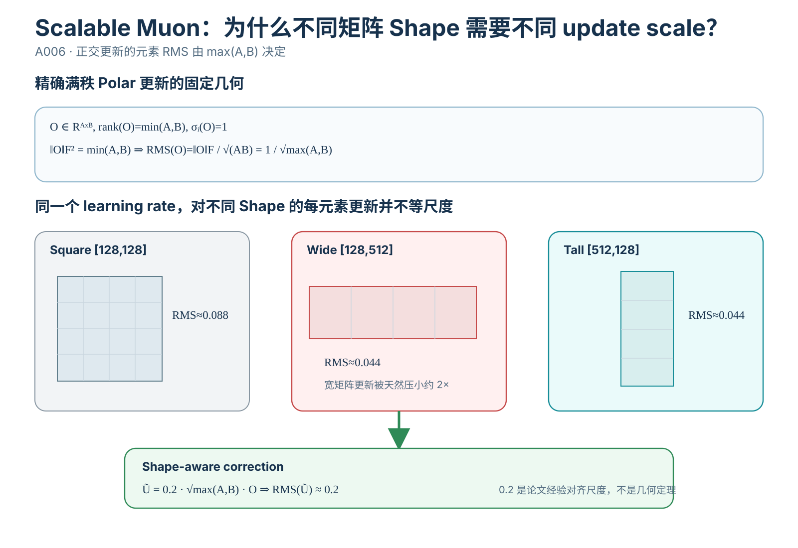
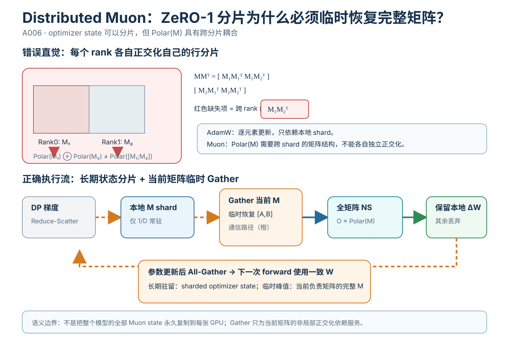

> **原文**：Jingyuan Liu 等，*Muon is Scalable for LLM Training*, [arXiv](https://arxiv.org/abs/2502.16982)、[HTML 全文](https://ar5iv.labs.arxiv.org/html/2502.16982)。**前代方法**：Keller Jordan 等的 [*Muon: An optimizer for hidden layers in neural networks* 原始技术博客](https://kellerjordan.github.io/posts/muon/)；前代的基础矩阵正交化**并非**本篇首次提出。对应 `Paperlist.md` A/01 第 6 篇。

# 模型定位与谱系

**主要类型：A 原始方法论文（针对已有优化器的规模化方法创新）；次要类型：C 分布式训练工程、B Moonlight 模型实证报告。** 分类依据：论文第 2 节的核心贡献不是重新定义整个 LLM 骨干，而是提出使已有 Muon 适应较大规模 LLM 的**decoupled weight decay、按矩阵形状匹配更新 RMS 和 ZeRO-1 兼容的 Distributed Muon**。论文另训练了一个 16B 级 MoE 模型 Moonlight 验证方法，但 Moonlight 是实验载体，不等于本文是从零发明 Muon 算法。[原文 `1–3](https://ar5iv.labs.arxiv.org/html/2502.16982)

技术演进需要分清「优化方向」和「分布式实现」两条线：

~~~text
反向传播得到梯度 G ∈ R[A,B]
       │
       ├── Adam / AdamW：逐坐标历史尺度自适应
       │      └── 矩阵每个元素作为相对独立的更新坐标
       │
       └── 原始 Muon：矩阵梯度的动量 M
                      → 近似极分解/正交化 O
                      → 用 O 更新二维权重
                              │
                小模型可行，大模型训练遇到
                权重长期增长 / 矩阵宽高差异 /
                分布式切分破坏完整矩阵依赖
                              ↓
           本文：decoupled decay + shape-aware RMS scale
                 + DP 上分片动量/全矩阵临时正交化
                              ↓
                    大规模预训练验证
                              ↓
                Moonlight 约 16B 总参数 MoE
~~~

主要技术路径 `训练 → 参数优化 → 矩阵整体梯度变换 → 动量正交化 → Muon → Scalable Muon（本篇）`；分支路径 `分布式训练 → Optimizer State Sharding → ZeRO-1 → Distributed Muon`。不要把「正交化矩阵梯度」与 LoRA 的「低秩限制参数改变量」混同：前者操纵更新矩阵的奇异值尺度，后者约束可训练参数化的秩。

# 输入、输出与任务

## Muon 处理的是**二维参数矩阵**，不是 token

考虑 Transformer 的投影矩阵 `W\in\mathbb R^{A\times B}`，收到 `G_t=\nabla_W L_t\in\mathbb R^{A\times B}`。原始 Muon 维护同形的矩阵动量 `M_t`，正交化得到 `O_t\in\mathbb R^{A\times B}`，输出更新后的 `W_t`。本篇针对大规模训练增加矩阵 shape-aware 的倍率和与 AdamW 一致的衰减：

$$
\boxed{W_t=W_{t-1}-
\eta_t\left(0.2\sqrt{\max(A,B)}\,O_t+\lambda W_{t-1}\right).}
$$

`\eta_t` 是训练学习率，`\lambda` 是本篇与 `\eta_t` 同乘的 weight decay 系数；`O_t` 是由动量近似正交化得到的矩阵，而不是原始梯度，也不是权重本身。[原文 `2.2 Eq.(4)](https://ar5iv.labs.arxiv.org/html/2502.16982)

| 对象 | Shape / 类型 | 来源与消费方 |
|---|---|---|
| Transformer 层的 `W_Q,W_{\rm FFN}` | 典型 `[H,H]`、`[H,4H]` 等 | 神经网络参数 |
| 数据梯度 `G_t` | 与 `W` 完全同形 | 反向传播 |
| 历史动量 `M_t` | `[A,B]` | 优化器时间递推 |
| 近似正交化 `O_t` | `[A,B]` | Newton–Schulz 迭代结果 |
| 单矩阵更新尺度 | `0.2\sqrt{\max(A,B)}` | 在不同 Shape 间匹配 RMS |
| 分布式本地分片 | 对应 `1/D` 的 optimizer 数据 | 数据并行 `D` 个 rank 上 |
| 全矩阵临时 Gather | `[A,B]` | 正交化前恢复矩阵结构 |
| 非二维参数（例如某些 Norm 向量） | `[H]` | 原文方案仍用 AdamW 处理 |

**矩阵 Shape 是算法输入条件。** 若把一个二维矩阵随意拆成多个子矩阵、分别正交化再拼回来，结果一般不同于对原矩阵整体正交化；原文大规模方案的分布式 Gather 正是为了维护这个数学语义。卷积核四维重排为二维后应用 Muon 属于具体框架设计，不能在不知道原作者参数分组规则时擅自扩展到所有参数。

训练输入还有 minibatch token、模型前向与 CE loss，但这些是外层 LLM 的输入，不是 Muon 优化器自身的输入。推理只使用最终更新后的矩阵权重，通常不带优化器动量或 Newton–Schulz kernel。

# 骨干架构与信息交互

## 从模型 batch 到一次参数更新

~~~mermaid
flowchart TD
  Tokens["训练 token batch"] --> Model["LM / MoE forward"]
  Model --> CE["next-token CE Lₜ"]
  CE --> BP["backward：每个矩阵梯度 Gₜ"]
  BP --> RS["DP reduce-scatter / 本地梯度"]
  RS --> M["本地分片动量更新 Mₜ"]
  M --> Gather["DP gather：恢复完整二维 Mₜ"]
  Gather --> NS["5 步 Newton–Schulz：Oₜ"]
  NS --> Scale["0.2·sqrt(max(A,B))·Oₜ"]
  Scale --> Local["仅选本 rank 更新分片"]
  RS --> Decay["旧权重分片的独立 decay"]
  Decay --> Local
  Local --> AG["all-gather 新权重 → 下一次 forward"]
~~~

模块解释：梯度聚合确保 DP rank 对同一训练目标的梯度定义一致；分片动量减小长期驻留状态；临时 gather 修复「正交化必须见到整张矩阵」的非局部依赖；Newton–Schulz 使用小矩阵乘替代训练时每步昂贵的完整 SVD；shape-aware scale 解决不同宽高矩阵的更新 RMS 不一致；独立 weight decay 控制较长训练中权重尺度；all-gather 新参数供下一轮模型前向一致读取。

在单 GPU 最小实现中可去掉所有 collective，其余矩阵算法完全相同。**正交化本身是跨矩阵坐标的混合运算**，不能像 AdamW 的逐元素更新那样在任意分片内独立完成。

# 关键技术

## 1. 原始 Muon 为什么偏要把一个矩阵整体正交化？

最朴素的 SGD 把局部损失一阶 Taylor 展开：

*教学解释图｜Spectral Geometry。*

$$
L(W+\Delta)\approx L(W)+\langle G,\Delta\rangle_F,\qquad
\langle G,\Delta\rangle_F=\operatorname{tr}(G^\top\Delta).
$$

若约束更新的 Frobenius 范数 `\|\Delta\|_F\le\rho`，由 Cauchy–Schwarz，

$$
\langle G,\Delta\rangle_F
\ge-\|G\|_F\|\Delta\|_F
\ge-\rho\|G\|_F,
$$

取 `\Delta^\star=-\rho G/\|G\|_F` 可以达到下界，这是把整张梯度做单一 Frobenius 缩放的最速下降方向。AdamW 更进一步给每个**标量坐标**独立历史尺度。

Muon 的另一种视角是把 `W` 看作线性算子，限制位移的**谱范数** `\|\Delta\|_2=\sigma_{\max}(\Delta)\le\rho`。设矩阵梯度的紧致 SVD 为

$$
G=U\Sigma V^\top,\quad
U^\top U=I_r,\quad V^\top V=I_r,
$$

其中 `r=\operatorname{rank}(G)`；`\Sigma=\operatorname{diag}(\sigma_1,\ldots,\sigma_r)`，`\sigma_i>0`。把一阶内积代入：

$$
\langle G,\Delta\rangle_F
=\operatorname{tr}(\Sigma U^\top\Delta V)
=\sum_{i=1}^{r}\sigma_i\,u_i^\top\Delta v_i.
$$

根据 `|u_i^\top\Delta v_i|\le\|\Delta\|_2\le\rho`，得到

$$
\langle G,\Delta\rangle_F\ge-\rho\sum_{i=1}^{r}\sigma_i.
$$

若取 `\Delta=-\rho UV^\top`，则每一项 `u_i^\top\Delta v_i=-\rho`，恰好达到下界，故它是该谱范数约束的一阶线性问题的一个最优更新方向。这一步说明**保持每个非零奇异方向同样的更新奇异值**从何而来，并不说明对任意非凸神经网络都具有全局收敛保证。

把 `G` 换为平滑动量 `M_t`，Muon 的方向就近似是 `\operatorname{Polar}(M_t)=UV^\top`。直觉上原始梯度某个奇异方向的 `\sigma_i=100`、另一个 `\sigma_j=1` 时，未经正交化的主更新方向尺度相差 100 倍；极分解把两者的非零奇异值都映成 1，在给定谱范数预算内更充分地利用多个方向。与「先对梯度做低秩截断」恰好相反：它没有主动丢弃较小的非零奇异方向。

## 2. 矩阵极分解到底如何得到：从 SVD 到 Newton–Schulz

理论上当 `M=U\Sigma V^\top` 为满行秩、`A\le B` 时，

*教学解释图｜Newton Schulz Dataflow。*

$$
MM^\top=U\Sigma^2U^\top,\qquad
(MM^\top)^{-1/2}=U\Sigma^{-1}U^\top,
$$

因此

$$
(MM^\top)^{-1/2}M
=U\Sigma^{-1}U^\top U\Sigma V^\top
=UV^\top.
$$

若 `A>B`，适当转置并使用另一侧 `M(M^\top M)^{-1/2}`；若秩亏，则上述逆平方根的零奇异值需要 Moore–Penrose 伪逆或数值正则化，不能无条件写普通矩阵逆。SVD 对每个巨大权重矩阵每步计算成本高、并行实现也不一定划算，故原始 Muon 采用迭代近似。

本篇沿用原 Muon 的五次多项式迭代，先 `X_0=M/\|M\|_F`（实际实现须防零除），再对每轮

$$
A_k=X_kX_k^\top,\qquad
X_{k+1}
=aX_k+bA_kX_k+cA_k^2X_k,
$$

系数沿用 `a=3.4445,\ b=-4.7750,\ c=2.0315`，原文实践选择 5 步。把 `X_k=U\,\operatorname{diag}(s_i)\,V^\top` 代入并利用 `U^\top U=V^\top V=I`，可得

$$
A_kX_k=U\operatorname{diag}(s_i^3)V^\top,\quad
A_k^2X_k=U\operatorname{diag}(s_i^5)V^\top,
$$

所以每个奇异值经历同一个标量多项式

$$
s_i^{(k+1)}
=a s_i^{(k)}+b(s_i^{(k)})^3+c(s_i^{(k)})^5.
$$

**这就是矩阵公式的来历**：用矩阵乘法并行实施「把奇异值朝接近 1 的区间推」的近似映射，而不显式调用 SVD。给一个可观察的数值：`M=\operatorname{diag}(4,1)`，初始 `X_0=M/\sqrt{17}=\operatorname{diag}(0.97014,0.24254)`，两个奇异方向会分别经历上述 `f(s)=as+bs^3+cs^5`，较小奇异值会被较大幅度地抬升；五步是速度与近似质量的折中，**不是严格保证五步后得到正交矩阵**。论文观察 10 步正交性更准确，却未在其设置中带来一致的模型性能提升。[原文 `2.1、`2.2](https://ar5iv.labs.arxiv.org/html/2502.16982)

## 3. 为什么到了大模型会暴露权重长期增长的问题

原始 Muon 的任务位移大体是 `-\eta O`，其中 `O` 的非零奇异值被限制在接近 1 的范围；但这并不约束**长期累积的权重矩阵** `W_t` 本身。如果不同训练阶段的更新长时间同方向累积，`\|W_t\|` 和层输出尺度可能持续增长。原文在较长训练设置下观察到一些权重和激活的 RMS 变大，且无衰减 Muon 后期性能下降。[原文 `2.2 Fig.2](https://ar5iv.labs.arxiv.org/html/2502.16982)

最直接的改造沿用前一篇 AdamW 的独立 weight decay：

$$
W_t=W_{t-1}-\eta_t(O_t+\lambda W_{t-1}).
$$

这是**把权重增长控制和梯度方向估计分离**，不让 `\lambda W` 进入 Muon 动量矩阵再被整体正交化。该改造不是证明权重绝不增长；它给原权重添加与大小成正比、朝零缩小的独立更新分量。原文 800M 模型、100B token（相对文中给定计算最优训练量约 5 倍）实验中，增加 decay 后后期验证损失改善；这说明其观察条件下的价值，不等价于「任何短程任务上 Muon 都必须选相同 `\lambda`」。

## 4. 形状不一致使 Muon 的 update RMS 天生不一致：完整推导

设 `O\in\mathbb R^{A\times B}` 是精确的、满秩的极分解更新（`r=\min(A,B)`），其非零奇异值全为 1。因此

*教学解释图｜Shape Aware RMS。*

$$
\|O\|_F^2=\sum_{i=1}^{r}\sigma_i(O)^2=r.
$$

按矩阵所有标量元素定义 RMS：

$$
\operatorname{RMS}(O)
=\sqrt{\frac{1}{AB}\sum_{i,j}O_{ij}^2}
=\frac{\|O\|_F}{\sqrt{AB}}
=\sqrt{\frac{\min(A,B)}{AB}}
=\boxed{\frac{1}{\sqrt{\max(A,B)}}}.
$$

这正是原文 Lemma 1；**条件是满秩、精确正交化**。若只有 `r<\min(A,B)` 个非零奇异值，则实际 RMS 为 `\sqrt{r/(AB)}`，近似 Newton–Schulz 还会产生数值偏差。[原文 Lemma 1](https://ar5iv.labs.arxiv.org/html/2502.16982)

直接计算两个不同形状矩阵：`[128,128]` 的精确极分解 RMS 为 `1/\sqrt{128}\approx0.08839`；`[128,512]` 的 RMS 为 `1/\sqrt{512}\approx0.04419`。若二者共用相同 `\eta`，后一矩阵每元素更新幅度约为前者一半。它可能导致宽矩阵 FFN 更新相对偏弱、很小的 head 子矩阵更新相对偏强。**这些 Shape 差异由正交矩阵的数学约束直接决定，不能靠统一调整全局学习率同时消掉。**

论文的修复是按矩阵乘 `\sqrt{\max(A,B)}`，于是

$$
\operatorname{RMS}\bigl(\sqrt{\max(A,B)}\,O\bigr)\approx1.
$$

作者还希望与其训练中 AdamW 更新的经验 RMS 范围对齐，在前面再乘 `0.2`，得到最终

$$
\operatorname{RMS}\bigl(0.2\sqrt{\max(A,B)}O\bigr)\approx0.2.
$$

**`0.2` 是原文针对其基线更新尺度的经验选择，不是由正交性严格推导出来的普适常数。** 论文比较了直接测量并规范化更新 RMS 的 Update Norm 与按 Shape 调整的 Adjusted LR，选择后者是为降低额外计算和统计开销。[原文 `3.1](https://ar5iv.labs.arxiv.org/html/2502.16982)

## 5. 分布式陷阱：为什么 ZeRO-1 对 AdamW 成立，不等于对 Muon 成立

假设 `W\in\mathbb R^{4\times4}` 被切成前后两个行块 `W_1,W_2\in\mathbb R^{2\times4}`，数据并行两张卡各持一个分片。AdamW 对每个元素更新只需本地 `g,m,v,W`，因此在全局梯度已正确汇聚的前提下，每卡独立更新对应分片，再 all-gather 新权重即可。Muon 则要构建 `MM^\top`：

*教学解释图｜Distributed Muon。*

$$
MM^\top=
\begin{bmatrix}
M_1M_1^\top & M_1M_2^\top\\
M_2M_1^\top & M_2M_2^\top
\end{bmatrix}.
$$

每卡只有一个 `M_i` 就无法计算两个非对角交叉块 `M_1M_2^\top`。因而**先分别正交化行分片再拼接**不是 `\operatorname{Polar}(M)` 的等价分布式实现。

原文的 Distributed Muon 保留 ZeRO-1 的分片动量和参数状态，同时为每个被负责的矩阵执行：DP reduce-scatter 梯度 → 本地分片动量 → **临时 Gather 完整动量矩阵** → 全矩阵 Newton–Schulz → 仅保留本 rank 负责的更新分片 → 独立 weight decay/更新 → all-gather 新参数。这里「每卡恢复完整矩阵」是指**当前由它负责正交化的矩阵的临时副本**，不是所有 GPU 永久复制整个模型的优化器状态。[原文 `2.3 Algorithm 1](https://ar5iv.labs.arxiv.org/html/2502.16982)

原文在其 FP32 主权重/梯度、BF16 NS 通信假设下，把分布式 AdamW 的典型通信量抽象为 `4+4=8` 份标量字节，而 Distributed Muon 增加 BF16 gather 的约 `2` 份，即上界 `(4+2+4)/8=1.25`；随着 DP 分片与通信重叠，报告的实际额外通信趋近较低端。**这是论文指定策略的通信分析，不是任意 TP/PP/EP 拓扑和网络带宽下的 1.25 倍硬上限**；启用 TP 可能引入额外 gather。

## 6. 单 GPU 可运行代码：精确 SVD 参照与五次 Newton–Schulz

~~~python
import torch

def exact_polar(g: torch.Tensor):
    """仅作小矩阵数学参考：大模型逐步训练不该每次都做完整 SVD。"""
    u, _, vh = torch.linalg.svd(g.float(), full_matrices=False)
    return u @ vh

@torch.no_grad()
def ns_polar(g: torch.Tensor, steps: int = 5):
    """论文系数的近似极分解，二维矩阵版本。"""
    assert g.ndim == 2
    transposed = g.shape[0] > g.shape[1]
    x = g.float().T if transposed else g.float()
    x = x / (x.norm() + 1e-7)                     # Frobenius 归一化
    a, b, c = 3.4445, -4.7750, 2.0315
    for _ in range(steps):
        gram = x @ x.T                            # [min(A,B),min(A,B)]
        x = a*x + (b*gram + c*(gram @ gram)) @ x
    return x.T if transposed else x

torch.manual_seed(13)
for rows, cols in [(4, 4), (3, 12), (12, 3)]:
    g = torch.randn(rows, cols)
    o_exact = exact_polar(g)
    o_ns = ns_polar(g)
    assert o_ns.shape == g.shape
    assert torch.isfinite(o_ns).all()
    exact_rms = o_exact.square().mean().sqrt()
    predicted_rms = 1.0 / (max(rows, cols) ** 0.5)
    torch.testing.assert_close(
        exact_rms, torch.tensor(predicted_rms), rtol=1e-5, atol=1e-5)
    matched_update = 0.2 * (max(rows, cols) ** 0.5) * o_ns
    print((rows, cols), "exact RMS:", float(exact_rms),
          "NS approx RMS:", float(o_ns.square().mean().sqrt()),
          "scaled RMS:", float(matched_update.square().mean().sqrt()))

# 用已知矩阵梯度演示一次单矩阵更新（非完整预训练脚本）
w = torch.randn(3, 12)
momentum = torch.zeros_like(w)
grad = torch.randn_like(w)
momentum = 0.95 * momentum + grad
orthogonal_update = ns_polar(momentum)
learning_rate, decay = 1e-3, 0.1
w_new = w - learning_rate * (
    0.2 * (max(w.shape) ** 0.5) * orthogonal_update + decay * w
)
assert w_new.shape == w.shape
~~~

逐行对应：`exact_polar` 通过 SVD 显式得到 `UV^\top`，只用于检验小矩阵上的数学性质；`ns_polar` 判断矩阵是否高于宽，以较小的 `XX^\top` 参与乘法降低临时矩阵规模；`x.norm()` 默认 Frobenius 范数并防止零矩阵除零；`gram`、`gram@gram` 分别是论文多项式中的二阶、四阶矩阵因子；`a*x+...` 对应 `aX+b(XX^\top)X+c(XX^\top)^2X`；五次得到**近似** `O`。循环同时检查方形、宽矩阵、长矩阵三种输入，`exact_rms` 与理论 `1/\sqrt{\max(A,B)}` 应接近；近似结果只输出数值，不虚构与精确正交相等的严格断言。最后的 `momentum` 是跨训练步一阶累积，`w_new` 合并 shape-scale、经验 `0.2` 和独立 decay，输出仍为 `[3,12]`。

**实现边界：** 这份例子没有 DP collective、混合精度缩放、完整参数分组、训练稳定性保护或对零奇异值的生产级处理，不应拿它与论文的分布式吞吐结果直接比较。

## 7. 实验与证据区分：哪些改造各自带来改善

| 原文实验 | 检验的具体关系 | 报告结果 | 必须保留的局限 |
|---|---|---|---|
| `2.2 Fig.2：800M 模型、100B tokens | 原始 Muon 后期权重增长是否影响长训练，decay 能否缓解？ | 增加 weight decay 后长训练验证损失低于无衰减 Muon，并与 AdamW 形成比较 | 这是特定模型、数据和超参数的曲线，不能外推到所有训练时间长度。 |
| `3.1 Table 1：800M 实验早期 4B tokens | 统一按 hidden size 乘 `\sqrt H` 是否对宽矩阵不公平？ | 基线验证损失 2.812；Update Norm 和按 shape Adjusted LR 都是 2.789；宽 MLP 更新响应被改善 | 该实验同时考察更新尺度和不同结构，更强结论需要跨 seed 与其他维度复核。 |
| `3.2 399M–1.5B Dense scaling law 拟合 | 优化器可否改变达到同等 loss 所需的训练计算量？ | 作者按拟合曲线报告，指定 compute-optimal 假设下 Muon 约需要 AdamW 的 52% 训练 FLOPs | **拟合模型与设定相关**，不是实际每一步 GPU FLOPs 自动减半，也不是墙钟时间必然快 48%。 |
| `3.3 Moonlight vs Moonlight-A，约 1.2T tokens | 基本相同模型/训练方案下替换优化器是否影响下游结果？ | 原文 HumanEval pass@1：37.2 对 29.3；MATH：19.8 对 16.1；但 BBH：43.2 对 45.3 | 不能只挑有利指标写「所有指标均领先」；与非同设置的公开模型比较更不能严格隔离优化器因果。 |
| `2.3 Distributed Muon | ZeRO-1 分片下全矩阵正交化是否可工程实现？ | 作者报告以额外 gather/近似运算换取可分布式运行，分析额外通信和延迟 | 集群重叠策略、参数拓扑与网络条件限制其墙钟结论。 |

[原文 `2–3、Table 1–5](https://ar5iv.labs.arxiv.org/html/2502.16982)。论文对「Muon 能作为大规模训练优化器」提供多类实证，但 **Moonlight 的能力来自模型架构、数据、预训练预算和优化器共同作用**；仅能把匹配设置的 Moonlight-A 消融视为优化器效应的直接比较证据。

# 预训练与后训练

## 优化器创新与 Moonlight 模型训练配方必须分开

本文的 Muon 改动对任何可微任务损失都可作为候选**优化器方案**；它不是预训练数据清洗方法、SFT 方式、偏好学习算法或 RL 训练目标。若 LLM 预测下一个 token，则基本目标仍为

$$
L_{\rm LM}(\theta)
=-\frac{1}{N}\sum_{n=1}^{N}\log p_\theta(y_n\mid y_{<n}),
$$

反向传播产生的每个二维参数梯度 `G=\nabla_W L_{\rm LM}` 经 Muon 处理；Norm、embedding 与其他不适合矩阵正交化的参数在原文方案中由 AdamW 处理。**「同时使用 Muon 和 AdamW」不是模型融合，而是按参数形状划分优化器组。**

Moonlight 是这篇论文的完整大模型实验证据，其报告的结构约 15.29B 参数（**排除 embedding**）、激活约 2.24B；计入 embedding 后约 16B 总参数/3B 激活。它继承 DeepSeek-V3-Small 风格 MoE 架构，**不是此文提出 MLA 或 MoE 架构**。原文预训练最长上下文 8K、总计约 5.7T tokens、weight decay 0.1，并分为：

1. `0\to33\mathrm{B}` tokens：约 2,000 步 warmup 至学习率 `4.2\times10^{-4}`；
2. `33\mathrm{B}\to5.2\mathrm{T}` tokens：余弦风格降至 `4.2\times10^{-5}`，训练 batch 在中间扩大；
3. `5.2\to5.7\mathrm{T}` tokens：高质量数学/代码/推理数据的 cooldown，学习率先调至约 `10^{-4}` 后线性衰减至 0。

[原文 `3.3](https://ar5iv.labs.arxiv.org/html/2502.16982)。这些训练阶段来自**模型实验报告**，不应误认为「Muon 优化器定义必须有 5.7T token 才有效」。若要复现论文数值，仍必须核对作者数据细节、分布式配置和各参数组超参数；单靠公开 loss 公式不足以确保同样的 Moonlight 性能。

原文没有在此提出一套新的 RLHF/PPO/DPO/GRPO 后训练算法；不能按现代大模型教程的固定模板自行补造 Moonlight 的完整 RL 阶段。

# 推理与部署

## 训练显存与通信：把优化器开销从整网计算中拆出来

对 `P_m` 个归 Muon 管理的矩阵参数、`D` 路数据并行，若动量 FP32 且按 ZeRO-1 分片，**仅驻留的矩阵动量**约为 `4P_m/D` 字节，而 AdamW 对同一组参数的 FP32 `m,v` 约 `8P_m/D` 字节；这与模型权重、梯度、可能的主权重副本、非二维参数的 AdamW 状态和临时 gather buffer 都是不同项目。不能声称「Muon 的整个训练显存只有 AdamW 的一半」。

单个 `A\times B` 矩阵一次 NS 迭代需要构造较小的 Gram 矩阵并实施乘法。若 `A\le B`，`XX^\top` 约 `O(A^2B)`，`(XX^\top)^2` 约 `O(A^3)`，以及乘回 `X` 约 `O(A^2B)`；选择长矩阵转置后可粗略写成 `O(\min(A,B)^2\max(A,B))` 每轮的主数量级，五步叠加，显然**不是**像 AdamW 那样全程 `O(AB)` elementwise。BF16 矩阵乘和计算-通信重叠让其在特定大模型训练集群中仍可能只占有限训练步耗时。

分布式额外 Gather、DP reduce-scatter、权重 all-gather、TP 参与时的额外通信，以及 NS kernel 真实墙钟耗时必须分别核算；论文给出的约 1–3% 典型优化器步骤占比是其工程条件下的报告，不是面向所有 GPU/网络拓扑的常数保证。

**推理时没有 Muon 特有的数据流。** Moonlight 的 Prefill、Decode、KV Cache、Attention 和 MoE 路由由模型架构与推理框架决定；优化器选择只通过训练完成的参数值间接影响模型能力。它不会凭自身让推理 FLOPs、HBM KV 访存或服务 batch 调度降低。

## 技术 → 模型

- `梯度动量极分解 / Newton–Schulz → 原始 Muon`：`PROPOSES`，见 [Keller Jordan 原始 Muon 博客](https://kellerjordan.github.io/posts/muon/)；不是本论文首创。
- `Decoupled Weight Decay → Scalable Muon`：`ADOPTS` AdamW 的独立衰减思想；本篇验证其长训练必要性。
- `Shape-aware Update RMS Scale → Scalable Muon`：`PROPOSES` 本文用于大模型不同形状参数的形状补偿规则及经验匹配系数；相关缩放问题有同期研究。
- `ZeRO-1 → Distributed Muon`：`EXTENDS` 分片优化器状态机制以支持全矩阵近似正交化。
- `Scalable Muon → Moonlight`：`IMPLEMENTS` 将 Muon/AdamW 参数分组与本文扩展用于 16B 级 MoE 预训练。

## 模型 → 技术

- `原始 Muon`：`PROPOSES` 基于梯度动量的近似矩阵极分解更新，主要面向二维矩阵。
- `Distributed Muon`：`DERIVED_FROM` 原始 Muon；`ADOPTS` decoupled decay；`EXTENDS` ZeRO-1 的状态分片与全矩阵临时 Gather。
- `Moonlight`：`DERIVED_FROM` DeepSeek-V3-Small 风格的 MoE 架构；`ADOPTS` 本文 Scalable Muon、非二维参数 AdamW、余弦预训练调度；不能把既有 MLA/MoE 技术误标为本文提出。
- `Moonlight-A`：`IMPLEMENTS` 与 Moonlight 基本匹配的训练对照，但将目标优化器替换为 AdamW，服务于论文中对优化器效果的实验评估。

**验收：** 给一个 `[128,512]` 与一个 `[128,128]` 的满秩梯度矩阵，能否从 SVD 严格推导各自极分解更新的 RMS、解释 `\sqrt{\max(A,B)}` 为什么出现，并画出分片动量 Gather 后才能计算 `MM^\top` 的通信路径？若可以，就同时理解了这篇论文的算法贡献和系统贡献。
