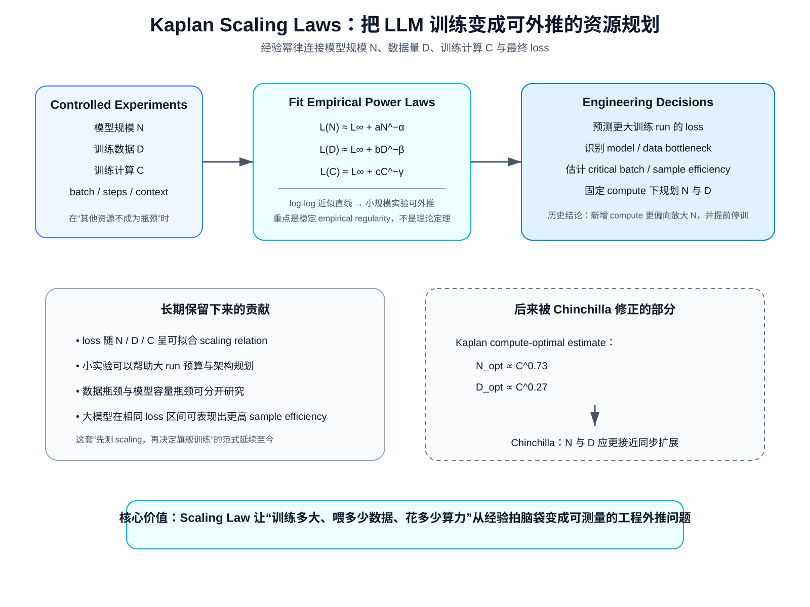
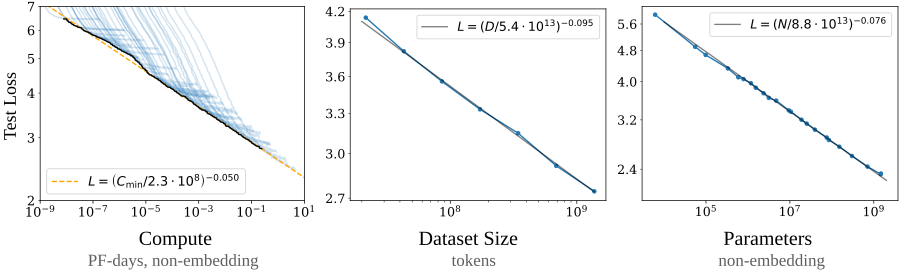
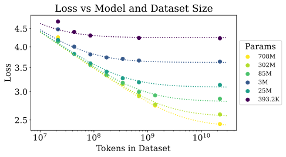
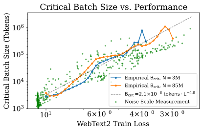
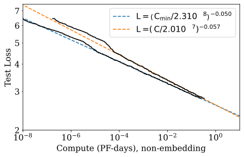
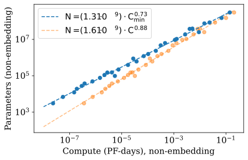
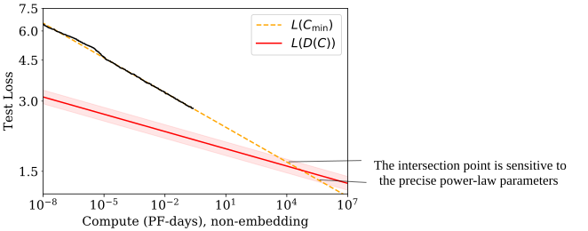

# Kaplan Scaling Laws：为什么语言模型训练第一次变成了“可外推的工程问题”

> **论文**：Jared Kaplan et al., [Scaling Laws for Neural Language Models](https://arxiv.org/abs/2001.08361)，2020。  
> **类型**：A · 原始经验方法论文。  
> **一句话定位**：这篇论文真正改变的不是 Transformer 结构，而是大模型研发的决策方式：模型参数量 $N$、数据量 $D$、训练计算量 $C$ 与最终 language-model loss 之间，在实验区间内呈现出稳定、可拟合的幂律，于是“训练多大模型、要多少数据、给多少算力”第一次可以被当成一个经验可预测的资源分配问题。

这篇论文必须和下一篇 **Chinchilla** 连起来读。

原因是它同时包含两层贡献：

1. 一层后来被反复验证、并真正奠定现代大模型工程基础；
2. 一层关于 **固定 compute 下应该怎样分配模型参数和训练 token** 的具体结论，后来被 Chinchilla 明确修正。

因此最容易犯的错误有两个：

> “Kaplan 已经过时，所以不用读。”

以及：

> “Kaplan 的 scaling law 就是今天仍应照搬的 compute-optimal 配方。”

这两句话都不对。

真正应该保留的是：

~~~text
Kaplan 2020
├─ 保留下来的核心：
│  ├─ loss 随 N / D / C 呈稳定经验幂律
│  ├─ 小规模实验可以用于大规模外推
│  ├─ 数据瓶颈与模型瓶颈可以分开研究
│  ├─ 大模型具有更高 sample efficiency
│  └─ scaling law 可以参与真实训练规划
│
└─ 后来被修正的部分：
   └─ 固定 compute 时，应该把大部分新增算力用于增大 N，
      而只缓慢增加训练 token
            ↓
       Chinchilla 2022 重新实验
            ↓
       N 与 D 应更接近同步扩展
~~~

如果这一层历史关系没有建立，后面读 Llama 3 的 IsoFLOPs、Qwen2.5 的 hyperparameter scaling，都会只剩“他们画了一堆曲线”。

---

## 阅读导航

这篇文章不要求先懂 Chinchilla，但建议已经知道：

- next-token cross entropy；
- Transformer 基本结构；
- Adam / batch / training step 的含义；
- log-log 坐标；
- 幂函数与指数。

站内相关：

- [Transformer](../03-transformer/A013-transformer-attention-is-all-you-need.md)
- [Adam](../01-foundations/A002-adam.md)
- [AdamW](../01-foundations/A003-adamw.md)
- [Llama 3](../../B/05-moe-complete-llm/B011-llama3.md)
- [Qwen2.5](../../B/05-moe-complete-llm/B012-qwen2.5.md)

读完后再进入：

- **A010 · Chinchilla / Training Compute-Optimal Large Language Models**

本文重点解决：

1. Scaling law 到底在预测什么？
2. $N,D,C,B,S,L$ 分别是什么，为什么经常被混淆？
3. 为什么 log-log 图上近似直线就意味着 power law？
4. $L(N)$、$L(D)$、$L(C)$ 为什么必须在“另外两个资源不成为瓶颈”时才有意义？
5. 小小的指数 $0.076$、$0.095$ 为什么仍然重要？
6. Kaplan 的联合 $L(N,D)$ 为什么是经验 ansatz，而不是第一性定理？
7. “$D\propto N^{0.74}$”到底是什么意思，为什么它**不是** Chinchilla 问的 compute-optimal token ratio？
8. $C\approx6NBS$ 从哪来？
9. Critical Batch Size 为什么也会进入 compute-efficient training？
10. 为什么 Kaplan 得到 $N_{\rm opt}\propto C^{0.73}$？
11. 为什么这会推出“模型做得更大、提前停训”？
12. Kaplan 自己为什么已经意识到 scaling law 必然会失效？
13. Chinchilla 后来到底修正的是哪一层？
14. Llama 3 和 Qwen2.5 现在怎样继续使用 scaling-law 思想？

---

## 总结架构图

> **教学总结图**：从受控实验拟合 N/D/C 幂律到工程外推，概括 Kaplan Scaling Laws 的资源规划逻辑及其边界。

## 1. 这篇论文真正面对的工程问题是什么？

假设你现在有一笔训练预算。

你可以把新增资源花在：

- 更大的模型；
- 更多训练数据；
- 更多 training steps；
- 更大的 batch；
- 更长训练时间。

最简单的直觉是：

> 模型越大越好。

但这不够。

因为固定 compute 下，变量彼此耦合。

比如：

~~~text
模型做大 4×
但训练总 FLOPs 不变
        ↓
每个 token 变贵
        ↓
能够处理的 token 数下降
        ↓
模型可能“更有容量但训练不足”
~~~

反过来：

~~~text
模型很小
把所有算力用于看更多 token
        ↓
优化很充分
        ↓
但最终受模型容量限制
~~~

所以真正问题是：

$$
\boxed{
\text{在有限资源下，模型规模、数据和优化时间应该如何共同增长？}
}
$$

这就是 scaling law 从“观察规律”走向“训练规划”的入口。

---

## 2. 先把所有符号钉死：Scaling Law 最容易混淆的就是“数据量”

Kaplan 论文中常见变量：

| 符号 | 含义 | 最容易混淆的地方 |
|---|---|---|
| $N$ | non-embedding trainable parameters | 不一定等于今天报告的 total parameters |
| $D$ | dataset size / data tokens | 与训练中累计处理 token 数的语境要区分 |
| $B$ | batch 中处理的 token 数 | 不是 sequence count |
| $S$ | optimizer update steps | 不是 token 数 |
| $C$ | training FLOPs | 不是 GPU 峰值算力，也不是 wall-clock time |
| $C_{\min}$ | 调整 batch inefficiency 后的最小有效 compute | 是经验归一化量 |
| $L$ | test negative log-likelihood | 论文主要优化对象 |
| $B_{\rm crit}$ | critical batch size | 随 training state / loss 变化 |

训练过程中累计处理 token 数可粗略写成：

$$
D_{\rm processed}
\approx
B S.
$$

但“独特语料池大小”和“累计训练 token 数”并不总是同一个概念。

如果训练多个 epoch：

$$
D_{\rm processed}
>
D_{\rm unique}.
$$

后面读 Chinchilla 时尤其要注意：它讨论的 $D$ 更直接指本次训练总共处理多少 tokens。

---

## 3. 下层仍然是普通语言模型，上层研究对象变成了“训练运行”

底层模型没有神秘之处。

输入：

$$
x_1,x_2,\dots,x_T.
$$

自回归 likelihood：

$$
p_\theta(x_{1:T})
=
\prod_{t=1}^{T}
p_\theta(x_t|x_{<t}).
$$

training loss：

$$
\mathcal L_{\rm LM}
=
-
\frac1T
\sum_{t=1}^{T}
\log p_\theta(x_t|x_{<t}).
$$

但这篇论文研究的“一个样本”不再只是一个文本 sequence。

更高一层的实验对象是：

$$
(N,D,B,S,C)
\rightarrow
L.
$$

也就是：

> 给定一次训练 run 的规模配置，最终 loss 会怎样？

整个方法可以抽象成：

~~~{mermaid}
flowchart TD
    A["Choose N / D / B / S"] --> B["Train autoregressive LM"]
    B --> C["Measure train/test loss curves"]
    C --> D["Control which resource is the bottleneck"]
    D --> E["Fit empirical power laws"]
    E --> F["Extrapolate to larger scale"]
    F --> G["Training-plan decisions"]
~~~

因此 scaling law 不是新网络层。

它是：

> **训练系统之上的经验性能模型。**

---

## 4. 原论文 Figure 1：最重要的发现是“很多数量级仍近似直线”

*原论文核心总览图。论文把模型参数量、数据规模和训练 compute 与 test loss 放到 log-log 坐标下，观察到跨多个数量级的近似 power-law 关系。它支持“规模变化具有可预测性”，但不证明这些直线可以无限外推。*

这张图的第一性原理读法不是：

> “有三条线。”

而是：

> **当一个关系在 log-log 坐标上接近直线，我们可以用非常少的参数描述跨数量级变化。**

---

## 5. 为什么 log-log 直线意味着 power law？

假设：

$$
L(X)=kX^{-\alpha},
$$

其中 $X$ 可以是：

- $N$；
- $D$；
- $C$。

两边取 log：

$$
\log L
=
\log k
-
\alpha\log X.
$$

定义：

$$
u=\log X,
\qquad
v=\log L.
$$

则：

$$
v
=
-\alpha u+\log k.
$$

这就是直线：

$$
v=mu+b.
$$

斜率：

$$
m=-\alpha.
$$

所以：

> log-log 图上出现稳定直线，本质上是在说资源扩大一个**比例**，loss 改善也近似遵循稳定比例关系。

---

## 6. 为什么 power law 对工程特别有用？

假设：

$$
L(N)
=
kN^{-\alpha}.
$$

模型增大：

$$
N_2=qN_1.
$$

则：

$$
\frac{L(N_2)}{L(N_1)}
=
\frac{k(qN_1)^{-\alpha}}
{kN_1^{-\alpha}}
=
q^{-\alpha}.
$$

只需要知道：

- 当前 scale；
- 放大倍数 $q$；
- 指数 $\alpha$；

就能估计收益。

例如：

$$
\alpha_N\approx0.076.
$$

参数量翻倍：

$$
q=2.
$$

那么：

$$
2^{-0.076}
\approx0.949.
$$

即 loss 大约变为原来的 94.9%。

也就是相对下降约：

$$
5.1\%.
$$

注意：

> 这不是 accuracy +5.1 个百分点。

如果原 NLL：

$$
L_1=3.0,
$$

那么粗略：

$$
L_2\approx2.85.
$$

perplexity：

$$
PPL=e^L.
$$

于是：

$$
e^{3.0}\approx20.1,
$$

$$
e^{2.85}\approx17.3.
$$

小指数在跨很多个数量级以后仍然会产生巨大累计差异。

---

## 7. 三条最著名的单资源 scaling law

Kaplan 报告：

### 7.1 参数受限

当：

- 数据足够；
- 训练足够；
- 主要瓶颈是模型容量；

经验上：

$$
\boxed{
L(N)
=
\left(
\frac{N_c}{N}
\right)^{\alpha_N}
}
$$

其中：

$$
\alpha_N\approx0.076.
$$

### 7.2 数据受限

当：

- 模型足够大；
- 用有限数据训练并合理 early stop；
- 主要瓶颈是数据；

经验上：

$$
\boxed{
L(D)
=
\left(
\frac{D_c}{D}
\right)^{\alpha_D}
}
$$

其中：

$$
\alpha_D\approx0.095.
$$

### 7.3 Compute 受限

当：

- 数据足够；
- 模型大小合理；
- batch 也被调整到更有效率的工作区；

论文写：

$$
\boxed{
L(C_{\min})
=
\left(
\frac{C_c^{\min}}
{C_{\min}}
\right)^{\alpha_C}
}
$$

其中：

$$
\alpha_C\approx0.050.
$$

这三条关系最容易被错误地摆成同一层“万能公式”。

真正前提是：

> **每一条单变量 law 都要求另外两个资源不要先成为主瓶颈。**

---

## 8. 为什么控制瓶颈如此重要？

假设你想测：

$$
L(N).
$$

如果数据集只有很少 token，那么模型增大以后，性能可能不再改善。

这不代表：

> model scaling law 失效。

可能只是：

$$
D
$$

先成为瓶颈。

同理，测：

$$
L(D)
$$

时，如果模型太小，无论加多少数据，最终 loss 都会被模型 capacity floor 卡住。

所以实验逻辑必须是：

~~~text
想研究 N
→ 尽量让 D 和 training 足够

想研究 D
→ 尽量让 N 足够大

想研究 C
→ 同时优化 N / batch / steps allocation
~~~

这也是为什么真正的 scaling-law 工作需要很多训练 run，而不是画一条现成模型 leaderboard 拟合直线。

---

## 9. 模型“形状”为什么不是第一主变量？

Kaplan 做了一个非常有影响力的观察：

> 在合理范围内，当 non-embedding parameter count $N$ 固定时，深度、宽度、head 数等 shape 改变，对 loss 的影响远小于 scale 本身。

注意这不是说 architecture 不重要。

更准确地说：

> **在论文测试的 Transformer family 与 shape 范围内，参数总规模比具体 depth/width aspect ratio 更能解释 performance trend。**

这让大规模实验可以把：

$$
N
$$

作为一个相对稳定的一维 scale coordinate。

否则每变一次模型深宽，就必须重新定义 scaling law。

---

## 10. 这里为什么使用 non-embedding parameters？

词表 embedding 参数：

$$
V\times d.
$$

会强烈受到：

- vocabulary size；
- tokenizer；
- embedding tying；

影响。

但它们并不总是以和 Transformer block 内矩阵相同的方式贡献 compute/capacity。

因此 Kaplan 的 $N$ 主要采用：

> non-embedding parameter count。

这也是为什么不能把论文里的：

$$
N_c
$$

常数直接搬到今天任意 tokenizer/model family。

scale exponent 比绝对 normalization constant 更具有可迁移解释价值。

---

## 11. 数据瓶颈：模型和数据不是两个可以独立无限扩展的旋钮

如果：

$$
N\rightarrow\infty
$$

但：

$$
D
$$

固定，最终会过度受限于数据。

如果：

$$
D\rightarrow\infty
$$

但：

$$
N
$$

固定，最终受限于容量。

所以论文需要一个 joint function：

$$
L(N,D).
$$

原论文核心图：

*原论文联合 $N,D$ 实验的一部分。它的意义是：模型大小和数据大小共同决定最终 loss，并存在可预测的数据瓶颈边界。*

---

## 12. Kaplan 的 $L(N,D)$ 从哪里来？不是严格推导，是 empirical ansatz

论文提出：

$$
\boxed{
L(N,D)
=
\left[
\left(
\frac{N_c}{N}
\right)^{\alpha_N/\alpha_D}
+
\frac{D_c}{D}
\right]^{\alpha_D}.
}
$$

这个公式很容易被过度神化。

它不是从 Transformer dynamics 唯一推导出的“自然定律”。

它是一个经验函数形式，设计时满足几个合理边界。

### 当数据无限大

$$
D\rightarrow\infty.
$$

第二项消失：

$$
L(N,\infty)
=
\left[
\left(
\frac{N_c}{N}
\right)^{\alpha_N/\alpha_D}
\right]^{\alpha_D}.
$$

所以：

$$
\boxed{
L(N,\infty)
=
\left(
\frac{N_c}{N}
\right)^{\alpha_N}.
}
$$

恢复 $L(N)$。

### 当模型无限大

$$
N\rightarrow\infty.
$$

第一项消失：

$$
\boxed{
L(\infty,D)
=
\left(
\frac{D_c}{D}
\right)^{\alpha_D}.
}
$$

恢复 $L(D)$。

所以它至少保证两端行为一致。

真正可信度来自：

> 与实验数据拟合得好，而不是因为公式看起来漂亮。

---

## 13. $D\propto N^{0.74}$ 到底在回答什么？

从联合函数看，有限数据惩罚大致由一个无量纲比例控制：

$$
\frac{N^{\alpha_N/\alpha_D}}{D}.
$$

联合拟合中：

$$
\alpha_N\approx0.076,
\qquad
\alpha_D\approx0.103.
$$

所以：

$$
\frac{\alpha_N}{\alpha_D}
\approx
0.738.
$$

要保持类似程度的数据瓶颈：

$$
\boxed{
D\propto N^{0.74}.
}
$$

例如模型扩大：

$$
8\times.
$$

数据大约需要扩大：

$$
8^{0.74}\approx4.7\times.
$$

于是论文总结成：

> 模型 8×，大约 5× 数据可以维持类似的 overfitting penalty。

---

## 14. 这绝对不是“compute-optimal tokens 应该按 $N^{0.74}$ 增长”

这是理解 Kaplan → Chinchilla 最关键的分界。

刚才的：

$$
D\propto N^{0.74}
$$

回答：

> **为了不让有限数据瓶颈明显恶化，数据规模应怎样随模型容量扩展？**

它不是在解：

$$
\min_{N,D} L(N,D)
\quad
\text{s.t. fixed training FLOPs}.
$$

后一个问题才是 Chinchilla 的主问题。

因此：

~~~text
Kaplan joint N-D law
→ 数据容量 / overfitting boundary

Chinchilla compute-optimal law
→ 固定 FLOPs 下 N 与 processed tokens 怎样分配
~~~

它们不是一个公式的两个写法。

---

## 15. 训练 FLOPs 的 $6N$ 近似从哪里来？

对于 dense Transformer，粗略看每个参数参与主要矩阵乘法。

单 token forward：

$$
\approx2N
$$

FLOPs。

直觉是：

> 一次 multiply + add 常按 2 FLOPs 计。

backward 需要：

- 对 activation 求梯度；
- 对 weight 求梯度。

粗略约为 forward 的两倍：

$$
\approx4N.
$$

所以每 token：

$$
C_{\rm token}
\approx
2N+4N
=
6N.
$$

若每 step 处理 $B$ tokens，训练 $S$ steps：

$$
\boxed{
C
\approx
6NBS.
}
$$

如果定义总 processed tokens：

$$
D_{\rm processed}=BS,
$$

则：

$$
\boxed{
C
\approx
6ND_{\rm processed}.
}
$$

这条式子后来成为 Chinchilla 等 scaling analysis 的核心近似。

---

## 16. 为什么 $6ND$ 不是 GPU 账单公式？

它忽略：

- attention $L^2$ 项；
- embedding/output head；
- normalization；
- activation recomputation；
- optimizer update；
- communication；
- pipeline bubble；
- kernel utilization；
- padding；
- routing / MoE；
- hardware precision。

所以：

$$
C_{\rm theoretical}
\neq
C_{\rm wall-clock}.
$$

更准确的用途是：

> 在同类 dense Transformer training run 之间建立一个近似统一的 compute coordinate。

现代长上下文、MoE、稀疏 attention 下，必须重新校准。

---

## 17. 为什么大模型“sample efficiency 更高”？

论文观察到：

> 大模型达到同样 loss，往往需要更少 optimization steps / samples。

这并不神秘。

小模型的容量瓶颈可能很早出现。

大模型在训练早期就拥有更强的函数表示能力，因此同样 token 数下，loss 可以下降得更快。

于是：

~~~text
Small model
→ cheap per token
→ but many steps / samples to reach a target loss

Large model
→ expensive per token
→ but reaches same loss with fewer steps
~~~

compute-optimal training 就是要在：

$$
\text{cost per token}
$$

与：

$$
\text{sample efficiency}
$$

之间找平衡。

---

## 18. Learning Curve 也可以 scaling

Kaplan 不只研究最终 loss。

它还研究：

$$
L(N,S).
$$

论文观察到，在初始 transient 之后，不同模型的 learning curve 也可以用相似幂律表示。

一种形式：

$$
L(N,S)
=
\left(
\frac{N_c}{N}
\right)^{\alpha_N}
+
\left(
\frac{S_c}{S_{\min}}
\right)^{\alpha_S}.
$$

其中：

$$
\alpha_S\approx0.76.
$$

第一项：

> model-capacity floor。

第二项：

> training progress 还不够造成的 optimization gap。

这给出一个很有价值的视角：

$$
\text{final loss}
=
\text{capacity limitation}
+
\text{not-trained-long-enough limitation}.
$$

后面 Chinchilla 的：

$$
E+\frac{A}{N^\alpha}+\frac{B}{D^\beta}
$$

与这个思想有明显谱系关系。

---

## 19. Batch size 为什么也必须进入 scaling law？

固定 token budget 时，不同 batch size 并不等价。

batch 太小：

- gradient noise 大；
- update 次数多；
- serial steps 多。

batch 太大：

- 额外样本边际信息变少；
- compute efficiency 可能下降；
- 为了同样 optimization progress 处理过多样本。

因此存在一个：

$$
B_{\rm crit}.
$$

直觉上：

> 增大 batch 到一定程度以前，可以用更多并行数据减少 serial updates；超过临界点以后，再扩大 batch 的收益迅速下降。

---

## 20. Critical Batch Size 的 scaling

原论文拟合：

$$
\boxed{
B_{\rm crit}(L)
=
\frac{B_*}
{L^{1/\alpha_B}}
}
$$

其中：

$$
\alpha_B\approx0.21.
$$

原论文证据图：

*原论文关于 critical batch 的经验结果。论文观察到 $B_{\rm crit}$ 更主要与当前性能/loss 水平相关，而不是简单由模型参数量决定。*

当训练越后期、loss 越低时：

$$
B_{\rm crit}
$$

通常增大。

因此一个固定 batch 从头训练到底，并不一定在整个训练过程中都 compute-efficient。

---

## 21. 为什么论文还引入 $C_{\min}$，而不是直接用实测 $C$？

如果一个 run 的 batch 远离 critical batch，那么它可能浪费 compute。

为了研究“如果每个 run 都以更理想 batch 训练，理论上最少需要多少 compute”，论文构造：

$$
C_{\min}.
$$

它本质上是在尝试把：

> batch 选择造成的训练效率差异

从 scaling trend 中剥离。

所以：

$$
L(C_{\min})
$$

并不是数据中心真实电表读数。

而是一种：

> **归一化后的 compute-efficiency coordinate。**

---

## 22. 原论文 Compute-Efficient Frontier

*原论文把不同训练 run 调整到更接近 compute-efficient batch 后，重新观察 loss 与 $C_{\min}$ 的关系。论文认为这条曲线比固定 batch 的原始 compute 曲线更适合用于外推。*

拟合：

$$
L(C_{\min})
\propto
C_{\min}^{-0.050}.
$$

指数看起来只有：

$$
0.05.
$$

但如果 compute 增加：

$$
1000\times,
$$

loss 比例：

$$
1000^{-0.05}
\approx0.708.
$$

也就是仍然可积累出明显收益。

---

## 23. Kaplan 当时怎样解“固定 compute 应该做多大的模型”？

论文最终观察：

$$
\boxed{
N_{\rm opt}
\propto
C_{\min}^{0.73}.
}
$$

同时：

$$
B_{\rm crit}
\propto
C_{\min}^{0.24}.
$$

而 serial optimization steps：

$$
S_{\min}
\propto
C_{\min}^{0.03}.
$$

因为：

$$
C
\approx
6NBS.
$$

指数大致满足：

$$
0.73+0.24+0.03\approx1.
$$

这意味着，如果训练 compute 增长 10×：

### 模型规模

$$
10^{0.73}\approx5.37\times.
$$

### Batch

$$
10^{0.24}\approx1.74\times.
$$

### Serial steps

$$
10^{0.03}\approx1.07\times.
$$

所以 Kaplan 得出非常鲜明的工程结论：

> 新增算力主要应该用于**增大模型**，其次用于扩大 batch，而不是明显增加 serial training time。

---

## 24. 原论文 Figure：为什么“更大模型 + 更早停”会看起来 compute-efficient？

*原论文的 compute-optimal model-size trend。该论文在自己的实验设置与 batch-adjusted learning-curve 建模下，得到最优模型规模随 compute 约按 $C^{0.73}$ 增长。*

直觉是：

~~~text
Large model
→ 每 token 更贵
→ 但 early learning 更快 / sample efficiency 更高

Small model
→ 每 token 更便宜
→ 但要训练很久才能追上
~~~

于是如果目标只是：

> 固定 compute 下尽量把 loss 压低，

Kaplan 的拟合认为：

> 做更大的模型，训练到离 convergence 还很远时就停，反而更划算。

---

## 25. “Convergence is inefficient”真正是什么意思？

它不是说：

> 模型永远不要充分训练。

而是说，在论文定义的固定 training-compute optimization 中：

$$
\text{train smaller model to convergence}
$$

未必是最低 loss 的方式。

因为你可以把同样 compute 换成：

$$
\text{larger model}
+
\text{fewer steps}.
$$

如果 larger model 的 early-stage sample efficiency 足够好，就可能更优。

这个结论后来仍然有重要影响。

Chinchilla 并没有推翻：

> compute-optimal model 不必训练到传统意义上的 convergence。

它修正的是：

> **“到底应该多大，以及到底要训练多少 token。”**

## 26. 为什么 Kaplan 的 data scaling 会推出一个非常慢的 processed-token 增长？

如果：

$$
N_{\rm opt}
\propto
C^{0.73},
$$

而总 compute：

$$
C\approx6ND,
$$

那么：

$$
D_{\rm processed}
\propto
\frac{C}{N}.
$$

代入：

$$
N\propto C^{0.73},
$$

得到：

$$
D_{\rm processed}
\propto
C^{1-0.73}.
$$

所以：

$$
\boxed{
D_{\rm processed}
\propto
C^{0.27}.
}
$$

也就是说算力增加：

$$
10\times,
$$

processed tokens 只增加：

$$
10^{0.27}
\approx1.86\times.
$$

而模型参数增加约：

$$
5.37\times.
$$

这就是后来 Chinchilla 最直接挑战的结论。

---

## 27. 为什么这个结论在 2020 年会显得合理？

不能站在 2026 年回头简单说：

> Kaplan 当时“明显错了”。

它来自一组真实实验和一套内部一致的建模。

几个重要背景：

1. 论文里的大部分 scaling runs 比后来的 Chinchilla run 小得多；
2. training schedule 设计与后来的 Chinchilla 不同；
3. 对 learning-curve intermediate points 的使用方式不同；
4. batch efficiency 被特别纳入了 compute normalization；
5. 论文更强调“大模型早期训练效率高”。

所以在它自己的实验区域里，结论有经验依据。

真正的科学问题是：

> **外推到更大 compute 时，这组 fitted exponent 是否仍然成立？**

这恰恰是 scaling law 最核心的风险。

---

## 28. Scaling law 为什么天然存在 extrapolation risk？

我们观测：

$$
X\in[X_{\min},X_{\max}]
$$

内近似：

$$
L(X)\propto X^{-\alpha}.
$$

然后预测：

$$
X\gg X_{\max}.
$$

这个预测隐含：

> 未来 regime 的 dominant mechanism 没有改变。

但实际上随着 scale 增长，可能出现：

- 数据分布变化；
- optimizer regime 变化；
- architecture 变化；
- context length 变化；
- precision 变化；
- batch scaling 变化；
- data reuse；
- hardware communication bottleneck；
- irreducible entropy floor。

所以 scaling law 的正确用法从来不是：

> 拟合一次，永久当自然定律。

而是：

> **持续用更大规模实验重新校准经验前沿。**

Chinchilla 就是一次非常典型的 recalibration。

---

## 29. Kaplan 自己已经看到了内部“矛盾”

论文有一个很有价值但经常被忽略的章节：

> Contradictions and a Conjecture。

它发现：

compute-efficient data usage：

$$
D_{\rm compute}
\propto
C^{0.26\sim0.27}
$$

增长得很慢。

另一方面，为了不让 overfitting penalty 恶化，联合 $N,D$ law 暗示：

$$
D_{\rm overfit}
\propto
N^{0.74}.
$$

而：

$$
N\propto C^{0.73},
$$

所以：

$$
D_{\rm overfit}
\propto
C^{0.73\times0.74}.
$$

大约：

$$
D_{\rm overfit}
\propto
C^{0.54}.
$$

于是两个 data requirement：

$$
C^{0.27}
$$

和：

$$
C^{0.54}
$$

增长速度不一致。

scale 足够大以后，一定会冲突。

---

## 30. 原论文的“Contradiction”图为什么特别重要？

*原论文自己指出，compute-efficient training 所预测的慢速数据增长最终会与数据受限 scaling law 冲突。这张图非常重要，因为它明确提醒：论文中的 power laws 必须在某处发生 regime change，不能无限外推。*

这张图告诉我们的不是某个精确“终极模型规模”。

更重要的是：

> **作者自己已经知道经验 scaling law 的外推存在自洽边界。**

这是做 empirical science 非常重要的态度。

---

## 31. 所以 Chinchilla 后来到底修正了什么？

不是修正：

> loss 随 scale 有规律。

而是修正：

> **固定 FLOPs 下，最优 $N$ 与 $D$ 如何共同增长。**

Kaplan：

$$
N_{\rm opt}
\propto
C^{0.73},
$$

$$
D_{\rm opt}
\propto
C^{0.27}.
$$

Chinchilla：

$$
N_{\rm opt}
\propto
C^{\approx0.5},
$$

$$
D_{\rm opt}
\propto
C^{\approx0.5}.
$$

也就是说 Kaplan 把更多新增 compute 分给：

$$
N.
$$

Chinchilla 则认为：

> 参数量与训练 token 应更接近同步增长。

这是两篇论文最重要的关系。

---

## 32. 为什么不能把 Kaplan 的失败理解成“power law 不存在”？

因为 Chinchilla 本身仍然使用：

- power-law fitting；
- small-to-large extrapolation；
- IsoFLOP curves；
- parametric loss function。

也就是说它没有否定 scaling-law paradigm。

它做的是：

> **重新设计实验，让 model size 和 training tokens 的 trade-off 被更直接地测量。**

所以技术谱系是：

~~~text
Kaplan:
发现并系统化 empirical scaling regularity
        ↓
Chinchilla:
重新估计 compute-optimal N/D allocation
        ↓
Llama 3:
把 IsoFLOPs / scaling forecast 作为旗舰设计工具
        ↓
Qwen2.5:
进一步把 scaling law 用于 LR / batch / MoE design
~~~

---

## 33. 一个必须区分的概念：training-compute optimal vs deployment optimal

假设固定 training FLOPs：

$$
C_{\rm train}.
$$

我们求：

$$
(N_{\rm opt},D_{\rm opt})
=
\arg\min L(N,D)
\quad
\text{s.t. } C_{\rm train}=C.
$$

这是 training-compute optimum。

但现实部署可能固定：

$$
N\le N_{\rm deploy}.
$$

例如：

> 我就只能部署 8B。

这时候你不能选择更大模型。

目标变成：

$$
\min_D L(N_{\rm deploy},D).
$$

于是即使超过 training-compute-optimal token 数，也可能值得继续训练。

这就是现代 small model “overtraining” 的逻辑。

---

## 34. 为什么 Llama 3 8B / 70B 会故意训练超过 compute-optimal？

在 [Llama 3](../../B/05-moe-complete-llm/B011-llama3.md) 中，Meta 明确区分：

- flagship 405B 的 training compute allocation；
- 8B / 70B 的 deployment product point。

如果用户最终只能部署：

$$
N=8B,
$$

那么训练阶段多花 token，让 8B 更强，具有真实价值。

即：

$$
\text{training compute optimal}
\neq
\text{inference-size constrained optimal}.
$$

这一点实际上让我们重新理解 Kaplan 的“大模型早停”结论：

> 它只对应一类 objective，不是所有产品目标。

---

## 35. 为什么 inference cost 会改变最优模型选择？

假设两个方案训练 loss 接近：

### 方案 A

$$
N=100B,
\quad
D=1T.
$$

### 方案 B

$$
N=50B,
\quad
D=2T.
$$

训练 FLOPs：

$$
C\approx6ND
$$

可能近似。

如果最终要服务：

$$
10^{12}
$$

个 inference tokens，

更小的模型会在长期 serving 中节省巨大 compute。

所以总生命周期成本应该考虑：

$$
C_{\rm total}
=
C_{\rm train}
+
C_{\rm inference}
+
C_{\rm finetune}.
$$

Kaplan 主要问：

$$
C_{\rm train}.
$$

Chinchilla 已经开始强调 smaller compute-optimal model 对 inference 的额外价值。

现代模型产品更不能只看训练一次的成本。

---

## 36. 为什么 scaling law 与“涌现能力”并不矛盾？

Kaplan 主要研究：

$$
\text{cross entropy / NLL}.
$$

它观察到的是 smooth trend。

但某个下游 benchmark 的 accuracy 可能表现出看似突然跃迁。

原因之一是：

> smooth probability improvement 经过 threshold / argmax evaluation 后，可以变成 discrete metric jump。

例如正确答案 probability：

$$
0.20
\rightarrow
0.25
\rightarrow
0.30
\rightarrow
0.40.
$$

如果其他错误选项原来是：

$$
0.35,
$$

则 accuracy 直到最后才从：

$$
0
\rightarrow1.
$$

底层 likelihood 改善可能很平滑。

外层指标却会跳。

所以：

> scaling loss smooth 不意味着所有行为指标都必须 smooth。

Llama 3 后来用：

$$
\text{compute}
\rightarrow
\text{correct-answer NLL}
\rightarrow
\text{benchmark accuracy}
$$

两阶段 forecast，正是类似思想。

---

## 37. Scaling law 为什么适合做大模型研发“前置实验”？

旗舰训练可能只有一次机会。

如果一次 run 要花：

$$
10^{25}
$$

FLOPs，

你不可能在 flagship scale 做：

- 10 个 model size；
- 20 个 learning rate；
- 8 个 batch；
- 5 个 data mixture；

完整 grid search。

所以现代研发模式变成：

~~~text
大量便宜小模型实验
        ↓
拟合 scaling relationship
        ↓
预测大模型配置
        ↓
少量中尺度验证
        ↓
旗舰训练
~~~

这是一种：

> **实验设计压缩。**

不是让模型替代实验。

而是让大量小实验指导昂贵大实验。

---

## 38. Qwen2.5 为什么把 scaling law 用到 learning rate / batch？

Kaplan 证明了一个更广义的思想：

> 很多 training property 随规模变化不是完全不可预测的。

[Qwen2.5](../../B/05-moe-complete-llm/B012-qwen2.5.md) 进一步拟合：

$$
\mu_{\rm opt}
=
f(N,D,\text{architecture}),
$$

以及：

$$
B_{\rm opt}
=
g(N,D,\text{architecture}).
$$

也就是说 scaling law 从：

> 预测最终 loss

扩展到：

> 预测最优 hyperparameter。

这非常符合 Kaplan 的方法论精神，但不是 Kaplan 原论文已经证明的具体 law。

---

## 39. Llama 3 为什么又重新做自己的 scaling runs？

如果 Kaplan / Chinchilla 已经有 law，为什么 Meta 不直接套公式？

因为 scaling coefficients 依赖：

- tokenizer；
- data distribution；
- model architecture；
- optimizer；
- context length；
- training recipe；
- evaluation metric。

Llama 3 重新训练 40M→16B 的小模型，重新拟合 IsoFLOPs。

这说明真正成熟的 scaling-law 用法是：

> **继承方法，不继承未经校准的常数。**

---

## 40. “Scaling law 是经验规律”与“它很有工程价值”并不冲突

工程中很多非常有价值的模型并不是从第一性公理严格推出。

例如：

- aerodynamic empirical coefficient；
- battery degradation curve；
- material fatigue S-N curve；
- latency model；
- cache miss model。

Scaling law 也是类似。

它的价值来自：

1. fit stability；
2. predictive power；
3. useful extrapolation range；
4. decision value。

不是因为：

> 神经网络必须数学上遵守这一幂律。

---

## 41. 哪些量不能跨论文直接比较？

### 41.1 $N_c,D_c,C_c$

依赖 tokenizer、dataset 和 loss unit。

### 41.2 perplexity

不同 tokenizer 下：

$$
PPL=e^{\text{NLL/token}}
$$

并非直接可比。

### 41.3 tokens

一个 tokenizer 的 1T tokens：

$$
\neq
$$

另一个 tokenizer 的相同文本量。

### 41.4 FLOPs

Dense、MoE、长 context、activation checkpointing 等计算结构不同。

因此现代 scaling paper 经常需要重新定义：

> active parameters、total parameters、non-embedding parameters、training FLOPs。

---

## 42. 为什么 architecture independence 不能被过度解释？

Kaplan 观察到：

> 在测试范围内，depth/width/head 等 shape 改变影响相对弱。

不能推出：

> architecture innovation 没价值。

因为后来的：

- FlashAttention；
- MoE；
- MLA；
- GQA；
- better positional encoding；
- better optimizer；

都会改变：

$$
\text{quality per FLOP},
$$

或者：

$$
\text{memory / throughput constraints}.
$$

Scaling law 描述：

> 给定 model family 内 scale 的变化。

换 family 后，需要重新拟合。

---

## 43. 为什么模型参数越多不一定代表训练 FLOPs 同比例增加？

Dense Transformer 中：

$$
C\approx6ND
$$

比较自然。

但 MoE：

$$
N_{\rm total}
\gg
N_{\rm active}.
$$

每个 token 只激活部分 expert。

此时：

$$
C
$$

更接近 active compute，而 model capacity 又和 total parameters 有关。

因此现代 MoE scaling law 需要至少考虑：

$$
(N_{\rm total},N_{\rm active},D,C).
$$

Qwen2.5 的 MoE scaling experiment 就是这种扩展。

---

## 44. 一个具体的预算例子：为什么资源分配 law 会极大影响训练计划？

假设训练 compute 增长：

$$
100\times.
$$

### Kaplan allocation

模型：

$$
100^{0.73}
\approx28.8\times.
$$

processed data：

$$
100^{0.27}
\approx3.47\times.
$$

### Chinchilla-style equal scaling

模型：

$$
100^{0.5}
=
10\times.
$$

data：

$$
100^{0.5}
=
10\times.
$$

两个策略对同一增长预算的决策完全不同：

~~~text
Kaplan:
非常激进地增大模型
较少增加 token

Chinchilla:
模型和 token 一起增加
~~~

所以 exponent 不是论文里的“小数细节”。

它直接决定：

> 几百亿、几千亿参数模型应该训练多久。

---

## 45. 为什么 Figure 里的直线不能成为“无限扩张许可证”？

任何 power law：

$$
L(C)=kC^{-\alpha}
$$

如果无限延伸：

$$
C\rightarrow\infty
$$

就会：

$$
L\rightarrow0.
$$

但自然语言存在不可约不确定性。

所以 NLL 不可能无限趋近 0。

因此至少最终要变成：

$$
L(C)
=
L_\infty
+
kC^{-\alpha},
$$

或者发生其他 regime change。

Chinchilla 后来明确引入：

$$
E
$$

作为 entropy floor：

$$
L(N,D)
=
E+\frac{A}{N^\alpha}+\frac{B}{D^\beta}.
$$

这比 Kaplan 的某些零渐近形式更显式地表达了极限。

---

## 46. 原论文最值得保留的不是某个 exponent，而是实验方法

Kaplan 的长期价值可以压成四步：

### 第一步

把复杂训练现象压缩成几个规模坐标：

$$
N,D,C,B,S.
$$

### 第二步

控制瓶颈，做大量实验。

### 第三步

用简单经验函数拟合：

$$
L=f(N,D,C,\dots).
$$

### 第四步

用拟合做：

- 外推；
- budget allocation；
- experiment planning。

这套方法后来成为 foundation-model engineering 的标准工具之一。

---

## 47. 论文真正证明了什么？

比较稳妥的结论：

1. 在论文所研究的 autoregressive Transformer / WebText2 regime 内，test loss 随 $N,D,C$ 呈稳定经验 power law；
2. 模型参数量是解释 performance 的强 scale variable，模型 shape 在所测范围内影响相对较弱；
3. 参数与数据存在可拟合的共同 bottleneck；
4. learning curve、critical batch 也表现出相对稳定的 scaling behavior；
5. 小规模实验能够对更大训练配置提供有用预测；
6. 在论文自己的优化/训练设置下，compute-efficient allocation 强烈偏向增大模型并较早停止训练。

---

## 48. 论文没有证明什么？

### 48.1 所有模型永远遵守同一 power-law exponent

没有。

### 48.2 $N^{0.74}$ 是 universal data law

没有。

### 48.3 未来所有 compute 应主要花在模型参数上

Chinchilla 后来就修正了这一点。

### 48.4 architecture 不重要

没有。

### 48.5 scaling 可以无限延伸

论文自己已经指出矛盾与 breakdown。

### 48.6 loss scaling 自动等价于所有 downstream capability scaling

没有。

---

## 49. 从今天回头看，Kaplan 哪些结论“活下来了”？

### 活下来的 1：Predictable scaling

小模型实验真的可以帮助预测大模型。

### 活下来的 2：规模要联合考虑

不能只看：

$$
N.
$$

必须看：

$$
N,D,C.
$$

### 活下来的 3：大模型研发是资源配置问题

architecture 之外：

- data；
- compute；
- optimizer；
- batch；
- schedule；

同样是 model design。

### 活下来的 4：Scaling law 是工具，不是定理

每代模型需要重新测。

---

## 50. 哪些结论被后续工作重新估计？

最关键的是：

$$
N_{\rm opt}
\propto
C^{0.73}
$$

与：

$$
D_{\rm opt}
\propto
C^{0.27}.
$$

Chinchilla 使用更广泛的 fixed-FLOP experiment 与不同 learning-rate schedule 处理，得到约：

$$
N_{\rm opt}
\propto
C^{0.5},
$$

$$
D_{\rm opt}
\propto
C^{0.5}.
$$

所以不要把“Kaplan scaling law”当成一个单一公式。

它包含：

> scaling paradigm

以及：

> particular fitted coefficients。

前者影响深远。

后者必须持续更新。

---

## 51. 下一篇为什么必须马上读 Chinchilla？

如果现在停住，很容易留下一个错误认知：

> Scaling law = 参数越大越划算。

下一篇会直接重新问：

$$
\boxed{
\text{固定 FLOPs 时，N 和 D 到底怎么配？}
}
$$

而且它不是只提出另一个拟合。

它使用三种独立方法：

1. training-curve envelope；
2. IsoFLOP profiles；
3. parametric loss function；

都得到接近一致的答案。

然后真正训练：

$$
70B
$$

参数、

$$
1.4T
$$

tokens 的 Chinchilla，

与：

$$
280B
$$

参数、

约：

$$
300B
$$

tokens 的 Gopher，

在近似相同训练 compute 下对照。

所以 Kaplan → Chinchilla 应该视为同一问题的上下两章。

---

## 52. 一张因果图收束 Kaplan

~~~{mermaid}
flowchart TD
    A["Training is expensive"] --> B["Need small-run prediction"]
    B --> C["Measure N / D / C"]
    C --> D["Log-log power laws"]
    D --> E["L(N), L(D), L(C)"]
    E --> F["Joint N-D bottleneck"]
    E --> G["Learning-curve scaling"]
    G --> H["Critical batch"]
    H --> I["Normalize to C_min"]
    I --> J["Compute-efficient allocation"]
    J --> K["Kaplan estimate: N ~ C^0.73 D ~ C^0.27"]
    K --> L["Aggressive model scaling early stopping"]
    K --> M["Extrapolation contradiction"]
    M --> N["Need re-estimation"]
    N --> O["Chinchilla"]
~~~

---

## 53. 最容易学错的十个地方

### 错法 1：Scaling law 是理论定理

不是，是 empirical law。

### 错法 2：log-log 直线说明永远都成立

不是，只说明观察区间可近似 power law。

### 错法 3：$D\propto N^{0.74}$ 就是 Chinchilla 的 token ratio

不是，它主要描述数据瓶颈/overfitting scaling。

### 错法 4：$6ND$ 是实际 GPU 成本

不是，是 dense training FLOPs approximation。

### 错法 5：模型 shape 完全不重要

不是，论文只说同 family 合理范围内较弱。

### 错法 6：大模型一定要训练到收敛

固定 training compute objective 下不一定。

### 错法 7：Kaplan 被 Chinchilla 完全推翻

错误。compute-allocation exponent 被修正，但 scaling methodology 被继承。

### 错法 8：$C_{\min}$ 就是实际训练 compute

不是，它包含 batch efficiency normalization。

### 错法 9：token count 跨 tokenizer 可直接比较

不能。

### 错法 10：只要 loss 能预测，所有 benchmark 都自动可预测

需要额外建模。

---

## 54. 最终自检

读完 Kaplan Scaling Laws，应该能回答：

1. scaling law 为什么首先是工程决策问题？
2. $N,D,B,S,C,L$ 分别是什么？
3. 为什么 processed tokens 与 unique data size 要区分？
4. 为什么 log-log 直线对应 power law？
5. $L(N)$ 的前提是什么？
6. $L(D)$ 的前提是什么？
7. 为什么资源 bottleneck 会污染单变量 scaling fit？
8. $\alpha_N\approx0.076$ 怎样解释？
9. 为什么小 exponent 仍然可以跨规模积累明显收益？
10. Kaplan 为什么使用 non-embedding parameters？
11. 联合 $L(N,D)$ 公式为什么属于 empirical ansatz？
12. 怎样验证其 $D\to\infty$ 与 $N\to\infty$ 极限？
13. $D\propto N^{0.74}$ 到底回答什么？
14. 为什么它不是 fixed-compute optimum？
15. $C\approx6NBS$ 怎样得到？
16. 为什么 $6ND$ 不是 wall-clock cost？
17. 什么叫 sample efficiency？
18. learning curve 为什么也可以 scaling？
19. critical batch 是什么？
20. 为什么 $B_{\rm crit}$ 会随 loss 改变？
21. $C_{\min}$ 为什么被引入？
22. Kaplan 怎样得到 $N_{\rm opt}\propto C^{0.73}$？
23. 为什么这会推出 $D_{\rm processed}\propto C^{0.27}$？
24. “larger model + early stop”为什么可能 compute-efficient？
25. training-compute optimum 与 deployment optimum 有什么区别？
26. Kaplan 自己发现了什么 extrapolation contradiction？
27. Chinchilla 后来真正修正了哪条结论？
28. 为什么 Chinchilla 没有否定 scaling-law paradigm？
29. Llama 3 为什么还要自己重新做 scaling runs？
30. Qwen2.5 怎样把 scaling law 扩展到 hyperparameter selection？

如果这些问题都能回答，就可以进入下一篇：

> **A010 · Chinchilla：固定训练 FLOPs 下为什么参数量和训练 token 应一起扩展。**

