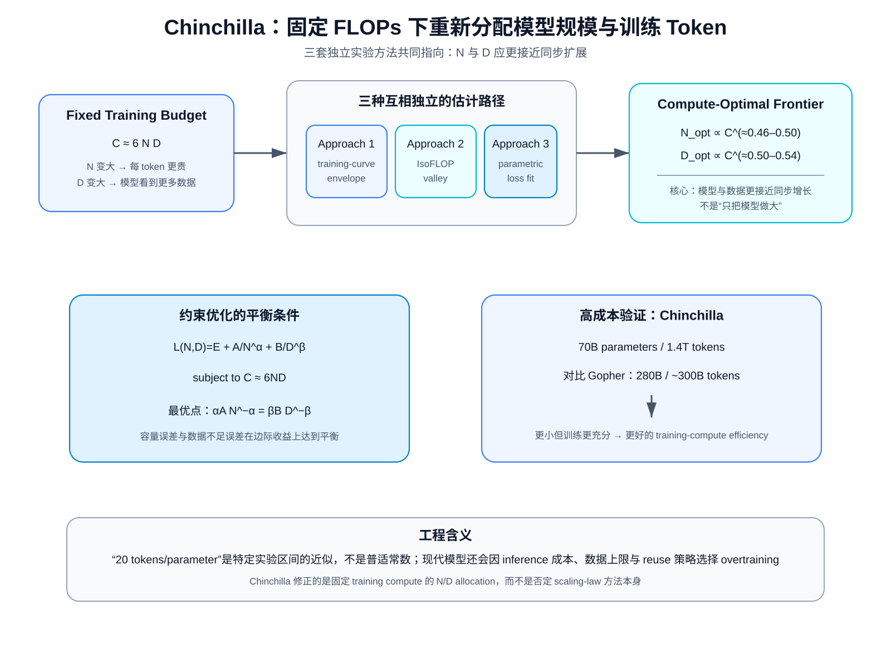
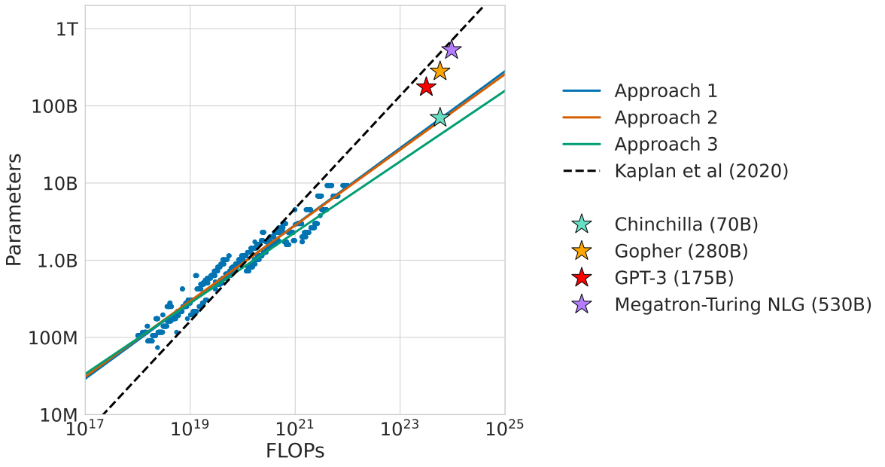
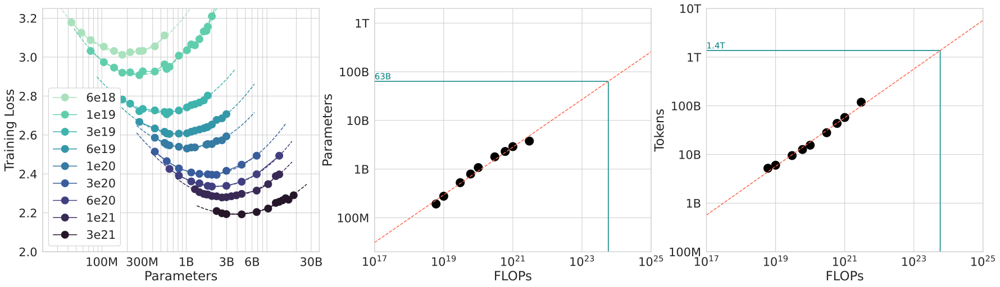
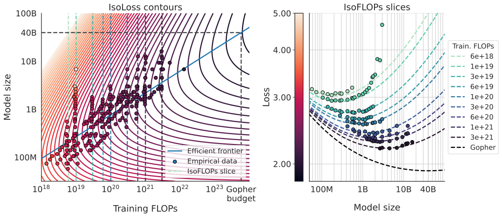
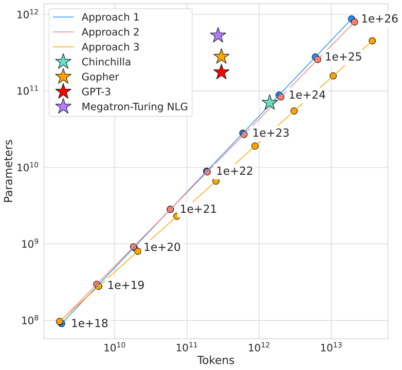
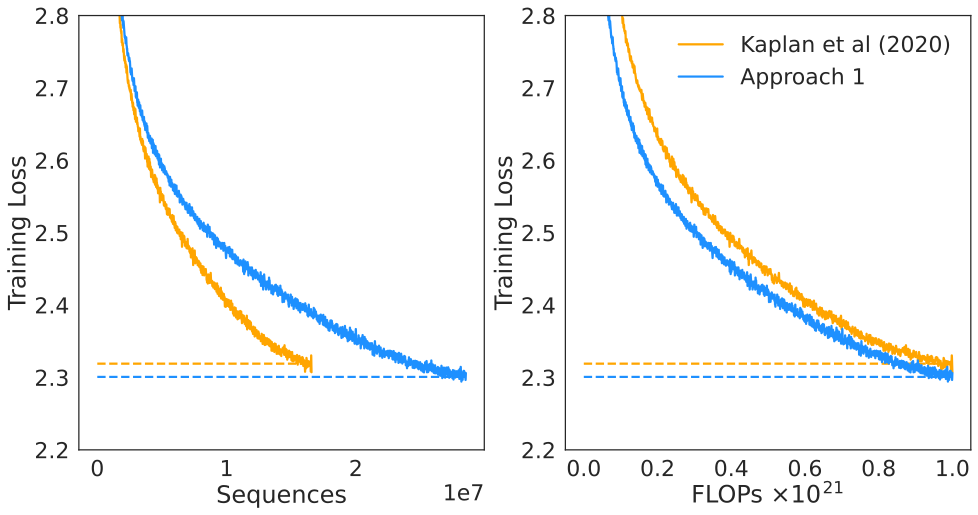

# Chinchilla：固定训练 FLOPs 时，为什么模型参数和训练 Token 应该一起扩展

> **论文**：Jordan Hoffmann et al., [Training Compute-Optimal Large Language Models](https://arxiv.org/abs/2203.15556)，2022。  
> **类型**：A · 原始经验方法论文；同时包含 70B Chinchilla 的高成本验证。  
> **一句话定位**：Chinchilla 不是“发现 20 tokens/parameter”这么简单。它真正重新定义的是一个受约束优化问题：**给定固定训练 FLOPs \(C\)，模型参数量 \(N\) 与训练 token 数 \(D\) 应该怎样分配，才能得到最低 loss？** 作者用 training-curve envelope、IsoFLOP profiles、parametric loss fit 三套彼此不同的方法都得到相近结论：随着 compute 增长，\(N\) 与 \(D\) 应更接近同步扩展，而不是像 Kaplan 2020 的估计那样主要把新增 compute 用于增大模型。

这篇必须紧接 [Kaplan Scaling Laws](A009-kaplan-scaling-laws.md)。

Kaplan 的长期贡献是：

> **语言模型的 loss 随模型、数据、compute 呈现稳定、可预测的经验 scaling relation。**

Chinchilla 并没有否定这一点。

它修正的是更具体的一层：

> **固定训练 compute 时，模型规模与训练 token 的最优分配。**

先把两篇论文的冲突写成最简形式。

Kaplan 2020 的经验估计：

$$
N_{\rm opt}
\propto
C^{0.73},
$$

$$
D_{\rm opt}
\propto
C^{0.27}.
$$

Chinchilla 2022 的三种方法约得到：

$$
N_{\rm opt}
\propto
C^{0.46\sim0.50},
$$

$$
D_{\rm opt}
\propto
C^{0.50\sim0.54}.
$$

这不是小数点差异。

假设 compute 增长：

$$
100\times.
$$

Kaplan 大致建议：

$$
N\uparrow28.8\times,
\qquad
D\uparrow3.47\times.
$$

Chinchilla-style equal scaling：

$$
N\uparrow10\times,
\qquad
D\uparrow10\times.
$$

这会把整个旗舰模型规划推向完全不同的位置。

---

## 阅读导航

建议先读：

- [Kaplan Scaling Laws](A009-kaplan-scaling-laws.md)：理解 power law、\(N,D,C\)、critical batch 和 Kaplan 的 compute allocation；
- [Transformer](../03-transformer/A013-transformer-attention-is-all-you-need.md)：底层语言模型仍是普通 decoder Transformer；
- [AdamW](../01-foundations/A003-adamw.md)：Chinchilla 最终模型相对 Gopher 的 recipe 变化之一；
- [Llama 3](../../B/05-moe-complete-llm/B011-llama3.md)：现代 IsoFLOPs 设计的真实案例；
- [Qwen2.5](../../B/05-moe-complete-llm/B012-qwen2.5.md)：scaling law 继续扩展到 LR、batch 与 MoE。

本文重点解决：

1. Chinchilla 到底修正 Kaplan 什么，没有修正什么？
2. 为什么固定 FLOPs 后 \(N\) 和 \(D\) 必须互相竞争？
3. 为什么 \(C\approx6ND\) 会让“模型越大越好”失效？
4. Approach 1 的 training-curve envelope 在做什么？
5. Approach 2 的 IsoFLOP valley 为什么是最直观证据？
6. Approach 3 为什么要拟合：
   $$
   L(N,D)=E+\frac{A}{N^\alpha}+\frac{B}{D^\beta}?
   $$
7. 怎样一步不省地用约束优化推出 \(N_{\rm opt}(C)\)、\(D_{\rm opt}(C)\)？
8. 最优点为什么满足：
   $$
   \alpha A N^{-\alpha}
   =
   \beta B D^{-\beta}?
   $$
9. 三种方法为什么给出略不同 exponent，却仍支持同一个工程结论？
10. “20 tokens per parameter”从哪里来，为什么不能把它当普适常数？
11. 70B / 1.4T Chinchilla 对 280B / ~300B Gopher 到底验证了什么？
12. 为什么这个对照并不是纯粹的单变量 \(N/D\) ablation？
13. 为什么更小、训练更充分的模型还会降低 inference 成本？
14. 为什么现代 LLM 往往又远远超过 Chinchilla token ratio？
15. training-compute optimal、inference-optimal、data-limited optimal 到底怎样区分？

---

## 总结架构图

> **教学总结图**：固定 FLOPs 后同时权衡模型规模 N 与训练 Token D，并展示三种估计路径如何导向 compute-optimal 配置。

## 1. 先把问题写对：Chinchilla 研究的不是“模型多大最好”

如果没有约束，当然可以说：

> 更大模型 + 更多数据 + 更多 compute 往往更好。

但工程上 compute 是有限的。

假设总训练预算：

$$
C.
$$

模型参数量：

$$
N.
$$

训练累计处理 token：

$$
D.
$$

dense Transformer 近似：

$$
C\approx6ND.
$$

所以给定 \(C\) 后：

$$
D
\approx
\frac{C}{6N}.
$$

这意味着：

> \(N\) 和 \(D\) 不是两个可以同时免费增大的变量。

模型越大，每个 token 越贵。

固定 compute 下，能够处理的 token 就越少。

所以真正问题是：

$$
\boxed{
(N_{\rm opt}(C),D_{\rm opt}(C))
=
\arg\min_{N,D:\operatorname{FLOPs}(N,D)=C}
L(N,D).
}
$$

---

## 2. 固定 compute 后为什么天然存在一个“太大”和“太小”？

假设 \(C\) 固定。

### 模型太小

$$
N\downarrow.
$$

那么：

$$
D=\frac{C}{6N}\uparrow.
$$

你可以给它很多 token。

但最终可能被模型容量限制：

$$
\text{capacity bottleneck}.
$$

### 模型太大

$$
N\uparrow.
$$

那么：

$$
D=\frac{C}{6N}\downarrow.
$$

模型容量很强，但只看到少量数据：

$$
\text{undertraining / data-training bottleneck}.
$$

所以固定 compute 下 loss 直觉上应呈：

~~~text
Loss
 ^
 | \             /
 |  \           /
 |   \_________/
 |       ↑
 |   optimal N
 +----------------> Model Size
~~~

这就是 IsoFLOP valley 的第一性原理来源。

---

## 3. Chinchilla 为什么要重新研究 Kaplan？

[Kaplan](A009-kaplan-scaling-laws.md) 已经研究 compute-efficient allocation。

它得到：

$$
N_{\rm opt}
\propto
C^{0.73}.
$$

换句话说，compute 增长 10× 时，模型规模约增长：

$$
10^{0.73}
\approx5.4\times.
$$

processed token 仅增长：

$$
10^{0.27}
\approx1.86\times.
$$

于是 2020–2021 许多大模型研发自然形成：

> 参数不断增大，但 training tokens 长期停留在几百 billion 量级。

Chinchilla 论文列出的几个典型模型：

| Model | Parameters | Training tokens |
|---|---:|---:|
| LaMDA | 137B | 168B |
| GPT-3 | 175B | 300B |
| Jurassic-1 | 178B | 300B |
| Gopher | 280B | 300B |
| MT-NLG | 530B | 270B |
| Chinchilla | 70B | 1.4T |

这张表本身就暴露了一个问题：

> 参数从 175B 增到 530B，但 token 仍然大致卡在 300B 左右。

Chinchilla 要问：

> **这些模型是不是其实“太大、训练太少”？**

---

## 4. 原论文 Figure 1：三种方法都把最优点推向“小模型 + 更多 token”

*原论文 Figure 1 的核心证据。三种不同方法得到的 compute-optimal 前沿都明显偏向比 Kaplan 预测更小的模型、更多的训练 token。图中的价值不是某个单点，而是三种估计方法在趋势上互相支持。*

为什么需要三种方法？

因为 scaling-law fit 很容易被：

- schedule；
- interpolation；
- model range；
- loss function form；
- outlier；
- extrapolation；

影响。

如果三种完全不同的分析都得到相近结论，可信度会明显更高。

---

## 5. Chinchilla 做了多大的实验矩阵？

作者训练超过：

$$
400
$$

个 language models。

参数量大致：

$$
70M
\rightarrow
>16B.
$$

training tokens：

$$
5B
\rightarrow
>400B.
$$

这不是：

> 拿几个公开大模型 checkpoint 做回归。

而是主动控制：

$$
N
$$

和：

$$
D.
$$

这使它比单纯观察行业模型更接近一个真正的 controlled scaling experiment。

---

## 6. 三种方法分别在问什么？

### Approach 1：Training-Curve Envelope

问：

> 我已经训练了很多不同大小、不同 schedule 长度的模型。在任意 compute 预算 \(C\) 上，哪条训练曲线此时 loss 最低？

### Approach 2：IsoFLOP Profiles

问：

> 固定某个最终 FLOP budget \(C\)，改变模型参数量 \(N\)，并让 token 数自动满足 \(D=C/(6N)\)。哪一个 \(N\) 的最终 loss 最低？

### Approach 3：Parametric Loss Model

问：

> 能否把所有实验点拟合成一个显式 \(L(N,D)\)，然后直接解约束优化问题？

三者不是同一图重复三遍。

它们的误差来源不同。

---

## 7. Approach 1：从 training curve 上找“同 compute 最低点”

作者训练多个模型，每个模型又使用多个 cosine schedule horizon。

于是每个 run 都有：

$$
L(C)
$$

随训练推进的曲线。

在任意 compute：

$$
C_i,
$$

查看所有模型：

$$
N_1,N_2,\dots
$$

当前的 loss。

选择：

$$
\min_j L(N_j,C_i).
$$

对应的模型大小就是该 compute 下的经验最优模型。

将不同 \(C_i\) 的最低点连起来，就是：

> training-curve envelope。

---

## 8. 原论文 Approach 1 图怎样读？

*左图包含不同参数规模与训练 horizon 的实际 loss curves；作者从这些曲线提取固定 compute 下的最小 loss envelope，再在中、右图拟合 optimal parameters 与 optimal tokens 随 compute 的 scaling。*

它得到约：

$$
\boxed{
N_{\rm opt}
\propto
C^{0.50}
}
$$

和：

$$
\boxed{
D_{\rm opt}
\propto
C^{0.50}.
}
$$

这已经和 Kaplan 的：

$$
0.73/0.27
$$

非常不同。

---

## 9. 为什么 Learning-Rate Schedule 会影响 scaling-law 结论？

这是 Chinchilla 对 Kaplan 的一个关键方法论批评。

假设一个模型计划训练：

$$
D_{\rm final}=130B
$$

tokens。

cosine LR schedule 也按 130B token 设计。

现在你在中途：

$$
D'=20B
$$

tokens 时读取 loss。

这时 learning rate 可能还很高。

所以当前 loss：

$$
L(D')
$$

不等于：

> 如果一开始就计划只训练 20B tokens，并把 cosine schedule 在 20B 附近衰减完，最终能达到的 loss。

因此：

> **一条长训练曲线的中间点，不一定是“以该 compute 为最终预算”的最优训练结果。**

Chinchilla 为不同 training horizon 匹配 schedule，减少这种偏差。

这被认为是 Kaplan 与 Chinchilla estimate 差异的重要原因之一。

---

## 10. 为什么这个问题如此隐蔽？

因为从形式上看：

$$
C'=6ND'
$$

确实是一个合法的 intermediate compute point。

但 optimization state 不只由：

$$
(N,D')
$$

决定。

还由：

- LR schedule；
- warmup；
- decay endpoint；
- batch；
- optimizer state；

决定。

所以真正 loss 更像：

$$
L
=
L(N,D,\text{training recipe}).
$$

如果 recipe 没有针对目标 horizon 调整，就可能污染 scaling estimate。

---

## 11. Approach 2：IsoFLOP 为什么是最直观的 compute-optimal 实验？

固定：

$$
C=C_0.
$$

对于不同 \(N\)，令：

$$
D=\frac{C_0}{6N}.
$$

比如：

### 小模型

$$
N=1B,
$$

则可训练很多 tokens。

### 大模型

$$
N=10B,
$$

则 token 数约少 10×。

每一个点严格使用同一总 FLOPs。

最后比较：

$$
L(N,D).
$$

这就是：

> 真正让 model size 与 training tokens 在一个固定 budget 下直接竞争。

---

## 12. IsoFLOP curve 为什么应该有谷底？

固定 \(C\)。

当 \(N\) 很小时：

$$
\text{capacity error}\uparrow.
$$

当 \(N\) 很大时：

$$
D=\frac{C}{6N}
$$

太小：

$$
\text{finite-training/data error}\uparrow.
$$

所以 loss：

$$
L(N,C/(6N))
$$

自然可能呈 U-shaped。

最小值：

$$
N^*(C).
$$

这是 compute-optimal point。

---

## 13. 原论文 Approach 2：真正应该盯着左图 valley

*原论文 IsoFLOP 图。左图在每个固定 FLOP budget 下扫描不同模型参数量，能看到清晰的 loss valley；中、右图再用这些 valley 的位置拟合 optimal \(N\) 与 \(D\) 随 compute 的变化。*

Approach 2 得到：

$$
N_{\rm opt}
\propto
C^{0.49},
$$

$$
D_{\rm opt}
\propto
C^{0.51}.
$$

这与 Approach 1 的：

$$
0.50/0.50
$$

高度接近。

---

## 14. IsoFLOP 比“模型越大 loss 越低”多了什么？

普通 scaling plot：

$$
N\uparrow
\Rightarrow
L\downarrow
$$

通常默认：

> 每个模型都给足了训练资源。

IsoFLOP 则强制：

$$
C=\text{constant}.
$$

所以它问：

> 如果额外模型容量必须用减少训练 token 来支付，这个交换还值不值？

这是完全不同的问题。

---

## 15. Approach 3：为什么还要拟合显式 \(L(N,D)\)？

Approach 1/2 都依赖直接实验曲线。

但旗舰 scale 远超实验范围。

为了外推，需要一个连续函数：

$$
\hat L(N,D).
$$

论文提出：

$$
\boxed{
\hat L(N,D)
=
E
+
\frac{A}{N^\alpha}
+
\frac{B}{D^\beta}.
}
$$

这条公式是整个 Chinchilla 数学部分的核心。

但首先必须强调：

> **它是经验风险分解，不是从 Transformer 方程严格推出的自然定律。**

---

## 16. 三项分别代表什么？

### 第一项：不可约 floor

$$
E.
$$

直觉：

> 即使模型与数据都无限，真实文本仍存在不可约熵。

### 第二项：有限模型容量

$$
\frac{A}{N^\alpha}.
$$

当：

$$
N\rightarrow\infty,
$$

这一项：

$$
\rightarrow0.
$$

### 第三项：有限训练数据/训练量

$$
\frac{B}{D^\beta}.
$$

当：

$$
D\rightarrow\infty,
$$

这一项：

$$
\rightarrow0.
$$

于是：

$$
L\rightarrow E.
$$

这比某些直接趋于 0 的简单 power law 更显式地保留 entropy floor。

---

## 17. 为什么用“加法”分解？

经验形式：

$$
E
+
A N^{-\alpha}
+
B D^{-\beta}
$$

隐含一个近似：

> model-capacity error 与 finite-data/training error 可以被视为两个可分的主要贡献。

现实中它们不一定严格独立。

模型大小会影响：

- optimization dynamics；
- sample efficiency；
- representation learning。

所以：

$$
L(N,D)
$$

未必真的严格 separable。

这就是为什么必须把它理解为：

> **能解释实验点并支持外推的 fitted ansatz。**

而不是第一性定律。

---

## 18. 原论文 Approach 3 图：蓝线是什么？

*左图展示拟合的 \(L(N,D)\) 等高线与 compute-efficient frontier；右图展示固定 FLOPs 的切片。蓝色前沿经过每条 iso-loss contour 上所需 FLOPs 最少的位置。*

如果 loss contour 表示：

$$
L(N,D)=\text{constant},
$$

那么一条 contour 上不同点都达到类似 quality。

但训练 compute：

$$
C\approx6ND
$$

不同。

最优点就是：

> 在这条 quality contour 上，让 \(ND\) 最小。

反过来固定 compute，等价于找到：

> 该 compute hyperbola 与最低 loss contour 的切点。

---

## 19. 现在开始完整推导：固定 \(C\) 下怎样最小化 \(\hat L(N,D)\)？

目标：

$$
\min_{N,D}
\left(
E+\frac{A}{N^\alpha}+\frac{B}{D^\beta}
\right)
$$

约束：

$$
6ND=C.
$$

构造 Lagrangian：

$$
\mathcal J(N,D,\lambda)
=
E
+
A N^{-\alpha}
+
B D^{-\beta}
+
\lambda(6ND-C).
$$

接下来三个偏导一个不省。

---

## 20. 对 \(N\) 求偏导

$$
\frac{\partial\mathcal J}{\partial N}
=
-\alpha A N^{-\alpha-1}
+
6\lambda D.
$$

最优点：

$$
-\alpha A N^{-\alpha-1}
+
6\lambda D
=
0.
$$

所以：

$$
\boxed{
\alpha A N^{-\alpha-1}
=
6\lambda D.
}
$$

两边乘 \(N\)：

$$
\boxed{
\alpha A N^{-\alpha}
=
6\lambda ND.
}
$$

---

## 21. 对 \(D\) 求偏导

$$
\frac{\partial\mathcal J}{\partial D}
=
-\beta B D^{-\beta-1}
+
6\lambda N.
$$

令 0：

$$
\beta B D^{-\beta-1}
=
6\lambda N.
$$

两边乘 \(D\)：

$$
\boxed{
\beta B D^{-\beta}
=
6\lambda ND.
}
$$

---

## 22. 两个式子一对比，得到最优平衡条件

刚才：

$$
\alpha A N^{-\alpha}
=
6\lambda ND,
$$

以及：

$$
\beta B D^{-\beta}
=
6\lambda ND.
$$

因此：

$$
\boxed{
\alpha A N^{-\alpha}
=
\beta B D^{-\beta}.
}
$$

这是比“20 tokens/parameter”更本质的式子。

它说：

> **最优点平衡的是两类 error contribution 的边际价值，而不是简单要求两个 error term 数值相等。**

只有当：

$$
\alpha=\beta
$$

时，才有：

$$
A N^{-\alpha}
=
B D^{-\beta}.
$$

---

## 23. 为什么这里出现 \(\alpha\) 和 \(\beta\)？

因为：

$$
\frac{d}{dN}
N^{-\alpha}
=
-\alpha N^{-\alpha-1}.
$$

一个误差项虽然数值小，但如果 exponent 大，它对增加资源更敏感。

所以资源分配应该比较的是：

> **多投入一点参数 / token 能带来多少 marginal loss reduction。**

这就是 \(\alpha,\beta\) 进入平衡条件的原因。

---

## 24. 用约束消掉 \(D\)

约束：

$$
D
=
\frac{C}{6N}.
$$

代入平衡条件：

$$
\alpha A N^{-\alpha}
=
\beta B
\left(
\frac{C}{6N}
\right)^{-\beta}.
$$

右边：

$$
=
\beta B
\left(
\frac{6N}{C}
\right)^\beta.
$$

于是：

$$
\alpha A N^{-\alpha}
=
\beta B
6^\beta
N^\beta
C^{-\beta}.
$$

乘：

$$
N^\alpha,
$$

得到：

$$
\alpha A
=
\beta B
6^\beta
N^{\alpha+\beta}
C^{-\beta}.
$$

所以：

$$
N^{\alpha+\beta}
=
\frac{\alpha A}{\beta B}
\left(
\frac{C}{6}
\right)^\beta.
$$

两边开：

$$
\frac{1}{\alpha+\beta}
$$

次方：

$$
\boxed{
N_{\rm opt}(C)
=
\left(
\frac{\alpha A}{\beta B}
\right)^{1/(\alpha+\beta)}
\left(
\frac{C}{6}
\right)^{\beta/(\alpha+\beta)}.
}
$$

定义：

$$
G
=
\left(
\frac{\alpha A}{\beta B}
\right)^{1/(\alpha+\beta)}.
$$

则：

$$
\boxed{
N_{\rm opt}(C)
=
G
\left(
\frac{C}{6}
\right)^a
}
$$

其中：

$$
\boxed{
a
=
\frac{\beta}{\alpha+\beta}.
}
$$

---

## 25. 再推出 \(D_{\rm opt}(C)\)

因为：

$$
D=\frac{C}{6N}.
$$

代入：

$$
N_{\rm opt}
=
G(C/6)^a.
$$

所以：

$$
D_{\rm opt}
=
\frac{C/6}
{G(C/6)^a}.
$$

得到：

$$
D_{\rm opt}
=
G^{-1}
(C/6)^{1-a}.
$$

而：

$$
1-a
=
1-
\frac{\beta}{\alpha+\beta}
=
\frac{\alpha}{\alpha+\beta}.
$$

定义：

$$
\boxed{
b
=
\frac{\alpha}{\alpha+\beta}.
}
$$

于是：

$$
\boxed{
D_{\rm opt}(C)
=
G^{-1}
\left(
\frac{C}{6}
\right)^b.
}
$$

并且：

$$
\boxed{
a+b=1.
}
$$

这最后一个关系也可以直接从：

$$
C\propto ND
$$

理解：

如果：

$$
N\propto C^a,
\qquad
D\propto C^b,
$$

那么：

$$
ND
\propto
C^{a+b}.
$$

要与：

$$
C
$$

同阶，必须：

$$
a+b=1.
$$

## 26. 方法三的 fitted exponent 到底是多少？

论文方法三拟合大约：

$$
\alpha=0.34,
\qquad
\beta=0.28.
$$

因此：

$$
a
=
\frac{0.28}{0.34+0.28}
=
\frac{0.28}{0.62}
\approx0.452,
$$

$$
b
=
\frac{0.34}{0.62}
\approx0.548.
$$

论文汇总时约写为：

$$
a\approx0.46,
\qquad
b\approx0.54.
$$

所以方法三其实并不是严格：

$$
0.5/0.5.
$$

但它仍然与 Kaplan 的：

$$
0.73/0.27
$$

存在明显差异。

---

## 27. 三种方法放在一起，真正结论是什么？

论文 Table 2：

| 方法 | \(N_{\rm opt}\propto C^a\) | \(D_{\rm opt}\propto C^b\) |
|---|---:|---:|
| Approach 1 · training-curve envelope | 0.50 | 0.50 |
| Approach 2 · IsoFLOP | 0.49 | 0.51 |
| Approach 3 · parametric fit | 0.46 | 0.54 |
| Kaplan 2020 | 0.73 | 0.27 |

不要把：

$$
0.50,0.49,0.46
$$

当成噪声然后机械平均。

更好的理解是：

> **不同方法的误差来源不同，但都把最优资源分配推向“参数与训练 token 大致同步增长”的区域。**

所以强结论是趋势。

不是某个小数点后两位的 universal constant。

---

## 28. 为什么 Approach 3 更偏向 token？

Approach 3：

$$
a\approx0.46,
\qquad
b\approx0.54.
$$

相比 0.5/0.5，更偏向：

$$
D.
$$

论文讨论一个原因：

> fitted frontier 在不同 compute regime 存在轻微 curvature。

方法三使用所有点做 global parametric fit，并用 Huber loss 处理 residual。

因此它对大尺度区域的权重与前两种直接 valley 方法不同。

这提醒我们：

> **scaling exponent 会依赖 fit model 和 observation window。**

---

## 29. 为什么作者还要做 bootstrap interval？

如果只拟合一次得到：

$$
a=0.49,
$$

我们不知道这个数字对：

- 采样 run；
- noise；
- outlier；

有多敏感。

论文通过 bootstrap 重采样实验数据，再重复拟合。

这给出 exponent 的经验区间。

目的不是证明“真实世界 exponent 就在这个 interval”。

而是评估：

> **在当前实验数据内，拟合有多稳定。**

外推误差仍然是另一层问题。

---

## 30. “20 tokens per parameter”到底从哪里来？

很多人把 Chinchilla 压缩成：

> 每个参数训练 20 个 token。

这个数大致来自论文 compute-optimal frontier 中：

$$
D_{\rm opt}
\approx
20N
$$

的局部经验比例。

例如：

$$
N\approx67B,
$$

论文 Approach 1 预测：

$$
D\approx1.5T.
$$

比值：

$$
\frac{1.5T}{67B}
\approx22.4.
$$

最终 Chinchilla：

$$
N=70B,
$$

$$
D=1.4T.
$$

所以：

$$
\frac{D}{N}
=
20.
$$

于是“20 tokens/parameter”成为一个容易记忆的 shorthand。

---

## 31. 为什么 20 不能被当作自然常数？

因为真正理论形式是：

$$
N_{\rm opt}
=
G(C/6)^a,
$$

$$
D_{\rm opt}
=
G^{-1}(C/6)^b.
$$

所以比例：

$$
\frac{D_{\rm opt}}{N_{\rm opt}}
=
G^{-2}
(C/6)^{b-a}.
$$

如果：

$$
a=b=0.5,
$$

那么比例才与 \(C\) 无关。

但方法三：

$$
a\neq b.
$$

比例会随 compute 改变。

另外 \(G\) 依赖：

$$
A,B,\alpha,\beta.
$$

这些又依赖：

- data distribution；
- tokenizer；
- architecture；
- optimizer；
- training recipe。

所以：

$$
20
$$

不是普适物理常数。

更准确的记忆是：

> **在 Chinchilla 的 dense Transformer / MassiveText / 训练 recipe / 实验 scale 下，compute-optimal frontier 大致落在几十 tokens per parameter、且 \(N\) 与 \(D\) 近似等比例随 compute 扩展。**

---

## 32. 原论文把 optimal tokens vs parameters 直接画出来了

*原论文 appendix 中对三种方法的 optimal token / parameter 预测。它比“20 tokens/parameter”这一句更完整，因为它直接展示 ratio 随模型规模和方法估计变化。*

真正应该学的是：

> 看前沿。

不是背一个 ratio。

---

## 33. 为什么 Chinchilla 认为当时的大模型普遍“undertrained”？

这里的 undertrained 是相对定义。

不是说：

> GPT-3 没训练好，loss 还在乱跳。

而是：

> 在相同 training compute 下，存在另一个更小的模型，如果把节省下来的 per-token compute 用于处理更多 tokens，可以达到更低 loss。

也就是：

$$
L(N_{\rm current},D_{\rm current})
>
L(N_{\rm opt},D_{\rm opt})
$$

在：

$$
6ND=C
$$

相同约束下。

所以：

> **undertrained = 相对于 compute-optimal allocation，参数过大、token 过少。**

---

## 34. 一个具体例子：为什么 280B Gopher 可能太大？

Gopher：

$$
N\approx280B,
$$

training tokens：

$$
D\approx300B.
$$

训练 compute 约：

$$
C
\approx
6ND.
$$

Chinchilla 问：

> 如果 \(C\) 固定，我能不能把 \(N\) 减少，同时把 \(D\) 大幅增加？

最终：

$$
N=70B,
$$

$$
D=1.4T.
$$

模型参数：

$$
4\times
$$

更小。

训练 token：

$$
\frac{1.4T}{300B}
\approx4.67\times
$$

更多。

粗略 product：

$$
70B\times1.4T
$$

与：

$$
280B\times300B
$$

处于相近数量级。

这就是同 compute 不同 allocation 的旗舰级实验。

---

## 35. 为什么最终选 70B，而方法三甚至预测约 40B？

三种方法在 Gopher compute 附近并非完全一致。

大致预测：

> optimal model size 在 40B–70B 区域。

最终选择：

$$
70B.
$$

论文说明这同时考虑：

- dataset；
- computational efficiency；
- 实际训练工程。

这非常重要。

Scaling law 不应该被理解成：

> fit 出 43.217B，就必须精确训练 43.217B。

现实选择仍需要考虑：

- hardware topology；
- model divisibility；
- training throughput；
- available data；
- serving target。

所以 scaling law 给的是：

> **合理设计区域。**

---

## 36. Chinchilla 为什么不是一个新 architecture？

Chinchilla 沿用 Gopher 的 dense Transformer 主线。

最终 70B：

- 80 layers；
- 64 attention heads；
- key/value size 128；
- \(d_{\rm model}=8192\)；
- FFN size = \(4d_{\rm model}\)。

所以论文的核心因果变量不是：

> 新 Attention。

而是：

$$
(N,D,C)
$$

allocation。

这也是为什么它应该被归为 A 类 scaling-method paper，而不是 B 类架构报告。

---

## 37. 但是 Chinchilla 和 Gopher 又不只差 \(N,D\)

这点必须非常严格。

除了：

- 280B → 70B；
- ~300B → 1.4T；

论文还改变：

### Optimizer

Gopher：

$$
Adam.
$$

Chinchilla：

$$
AdamW.
$$

### Dataset mixture

都基于 MassiveText，但采样比例略有变化。

### Tokenizer normalization

Chinchilla 修改 SentencePiece normalization，尤其改善数学/化学表示。

### Optimizer precision

forward/backward 用 bfloat16，但 optimizer state 中保存 float32 weight copy。

所以：

> **Chinchilla vs Gopher 并不是一个严格只改变 \(N,D\) 的单变量实验。**

---

## 38. 那 70B Chinchilla 的 flagship 对照还能证明什么？

它提供的是非常强的 system-level validation：

> 按新的 compute-optimal scaling law 选择明显更小、训练更久的模型，在接近同 training compute 下，可以获得非常强的下游表现。

但不能严格写成：

> 所有性能提升 100% 都由 70B/1.4T allocation 导致。

更强的 causal evidence 来自前面数百个 controlled scaling runs。

旗舰模型更像：

> **高成本外推验证。**

---

## 39. 原论文对 Kaplan 做了直接小规模 head-to-head

*原论文 appendix 在 \(10^{21}\) FLOPs 附近直接训练了 Chinchilla Approach 1 与 Kaplan scaling law 分别预测的模型规模。论文报告 Chinchilla 方法预测的较小模型取得更低最终 loss。*

这是很重要的证据。

因为它不是：

> 拿两条回归线争论。

而是：

> 用两个 scaling law 给出不同训练配置，然后真的训练出来比较。

当然这个实验仍然只覆盖：

$$
10^{21}
$$

FLOP 级别，不是直接在所有未来 scale 验证。

---

## 40. 为什么 Chinchilla 的“equal scaling”会让模型显著变小？

假设 compute：

$$
C
$$

固定。

Kaplan：

$$
N\propto C^{0.73}.
$$

Chinchilla：

$$
N\propto C^{0.5}.
$$

当 \(C\) 很大时：

$$
C^{0.73}
\gg
C^{0.5}.
$$

所以随着 compute budget 增加，两种建议会越来越分叉。

这解释为什么到了 Gopher 级 compute：

> Chinchilla 建议的模型可以比当时常见旗舰小很多。

---

## 41. 为什么“小模型 + 更多 token”同时改善 inference economics？

训练 compute 近似相同：

$$
C_{\rm train,A}
\approx
C_{\rm train,B}.
$$

但 inference 每 token 计算通常更直接随模型 active parameters 增长。

dense 模型粗略：

$$
C_{\rm infer/token}
\propto N.
$$

Chinchilla：

$$
70B
$$

vs Gopher：

$$
280B.
$$

所以 inference 基础 compute 约有：

$$
4\times
$$

参数规模差异。

这带来：

- 更低 memory；
- 更低 decode compute；
- 更容易部署；
- fine-tuning 更便宜。

因此：

> **compute-optimal pretraining allocation 还可能顺带改善 deployment cost。**

---

## 42. 这为什么改变了“大模型越大越好”的产业直觉？

在 Chinchilla 前，常见思路：

~~~text
更多训练 compute
→ 首先做更大参数模型
→ training tokens 大致固定
~~~

Chinchilla：

~~~text
更多训练 compute
→ 参数 + token 都增加
→ 不要把 capacity 做大后却不给足训练
~~~

于是模型参数量不再是唯一“规模指标”。

更合理的是同时报告：

$$
(N,D,C).
$$

今天看一个模型只问：

> 几 B 参数？

已经远远不够。

---

## 43. 为什么今天很多模型又训练得远超 20 tokens/parameter？

例如现代小模型可能：

$$
N=7B
$$

却训练：

$$
D=10T+
$$

tokens。

ratio：

$$
\frac{D}{N}
\gg20.
$$

这不代表 Chinchilla 被简单“推翻”。

最重要原因是目标函数变了。

Chinchilla 主要优化：

$$
\min L
\quad
\text{s.t. fixed training compute}.
$$

但产品可能优化：

$$
\min L
\quad
\text{s.t. fixed inference model size}.
$$

如果模型必须是：

$$
7B,
$$

那么你无法把 compute 换成更大模型。

只能继续增加：

$$
D.
$$

---

## 44. Training-compute optimal 和 fixed-model-size optimal

### Chinchilla 问题

$$
\min_{N,D}
L(N,D)
$$

约束：

$$
6ND=C.
$$

### 部署约束问题

固定：

$$
N=N_0.
$$

求：

$$
\min_D
L(N_0,D)
$$

同时允许增加 training compute。

两个 optimization problem 不一样。

所以同一个 7B 模型训练 10T token 可能：

> 相对 Chinchilla training-compute optimum 是 overtrained，

但：

> 相对 7B deployment constraint 是合理的。

这也是 [Llama 3](../../B/05-moe-complete-llm/B011-llama3.md) 8B / 70B 策略的重要背景。

---

## 45. 为什么 inference-heavy 产品甚至应该“比 Chinchilla 更偏小模型”？

假设总成本：

$$
C_{\rm lifecycle}
=
C_{\rm train}
+
Q\,C_{\rm infer},
$$

其中 \(Q\) 是未来 inference query/token 规模。

如果：

$$
Q
$$

非常大，

多花训练 compute 去让一个小模型更强，可能长期更划算。

也就是：

~~~text
多花一次 training
→ 换更小 serving model
→ 每个用户 token 都省 compute
→ 大规模 serving 后摊薄训练成本
~~~

所以真实产品 optimum 可能是：

> 比纯 training-compute optimum 更“overtrain small models”。

---

## 46. 为什么数据质量会让 Chinchilla ratio 再次改变？

Chinchilla 的 \(D\) 是：

> processed token count。

但 1 token 并不等价于另一 token 的学习价值。

如果数据质量更高：

$$
I_{\rm token}\uparrow.
$$

同样 token 数可能带来更多有效学习。

如果大量 synthetic / duplicated / low-quality token：

$$
I_{\rm token}\downarrow.
$$

所以更严格的模型应该考虑：

$$
D_{\rm effective}
\neq
D_{\rm raw}.
$$

现代数据工程会改变：

> quality-adjusted compute-optimal frontier。

这也是为什么 Llama 3 / Qwen2.5 不会机械套 2022 年 Chinchilla ratio。

---

## 47. Tokenizer 为什么也会改变“每参数多少 token”的意义？

假设两种 tokenizer：

### Tokenizer A

平均：

$$
3.0\ \text{chars/token}.
$$

### Tokenizer B

平均：

$$
4.0\ \text{chars/token}.
$$

同样原始文本字符量 \(C_{\rm chars}\)：

$$
D_A
=
\frac{C_{\rm chars}}{3},
$$

$$
D_B
=
\frac{C_{\rm chars}}{4}.
$$

所以：

$$
D_A>D_B.
$$

但语义文本量可能相同。

因此：

> tokens/parameter 不能脱离 tokenizer 解释。

---

## 48. 为什么 Chinchilla 的结果不能直接套到 MoE？

Dense Transformer：

$$
C
\approx
6N_{\rm total}D
$$

还比较合理。

MoE：

$$
N_{\rm total}
\gg
N_{\rm active}.
$$

每 token 只激活部分 experts。

此时：

$$
C
\approx
6N_{\rm active}D
$$

更接近实际主计算。

但 model capacity 又与：

$$
N_{\rm total}
$$

有关。

于是 compute-optimal problem 至少变成：

$$
L
=
L(
N_{\rm active},
N_{\rm total},
D
).
$$

这解释了为什么 [Qwen2.5](../../B/05-moe-complete-llm/B012-qwen2.5.md) 会单独做 MoE scaling experiments。

---

## 49. 为什么 context length 也会破坏简单 \(6ND\)？

如果 sequence length：

$$
L_{\rm ctx}
$$

很大，

attention score compute：

$$
O(L_{\rm ctx}^2 d)
$$

变得不可忽略。

此时总训练 FLOPs 不再只由：

$$
N\times D
$$

解释。

所以 long-context model 的 compute-optimal analysis 应加入：

$$
L_{\rm ctx}.
$$

这也是现代模型 scaling law 必须重新实测，而不能永远复用 Chinchilla 常数的原因。

---

## 50. 为什么 Chinchilla 的第三种 loss form 对现代 scaling 仍有启发？

$$
L(N,D)
=
E
+
\frac{A}{N^\alpha}
+
\frac{B}{D^\beta}
$$

最重要的不是这五个 fitted constants。

而是思维：

> 把性能下降拆成不同资源瓶颈的 contribution，再做 constrained optimization。

现代系统可以扩展成：

$$
L
=
f(
N_{\rm active},
N_{\rm total},
D,
L_{\rm ctx},
Q_{\rm data},
\dots
).
$$

然后约束可能是：

$$
C_{\rm train}\le C_0,
$$

$$
M_{\rm infer}\le M_0,
$$

$$
T_{\rm latency}\le T_0.
$$

这已经从 scaling law 进入真正的 system co-design。

---

## 51. 为什么三种方法比一个漂亮公式更重要？

如果论文只有 Approach 3：

$$
L=E+A/N^\alpha+B/D^\beta,
$$

别人完全可以质疑：

> 结论是不是你选这个函数形式选出来的？

但 Approach 1 不依赖这个 loss formula。

Approach 2 也不依赖。

结果：

$$
0.50/0.50,
$$

$$
0.49/0.51,
$$

$$
0.46/0.54
$$

方向一致。

所以论文最强的证据结构是：

> **method triangulation。**

即不同 measurement / fitting path 指向同一个工程结论。

---

## 52. 为什么 IsoFLOP 是后来 Llama 3 最值得继承的方法？

[Llama 3](../../B/05-moe-complete-llm/B011-llama3.md) 重新使用类似 IsoFLOPs 思路。

原因很简单。

固定：

$$
C.
$$

扫描：

$$
N.
$$

直接观察 valley。

它比：

> 先假设复杂的 loss model，再求 optimum

少一层 modeling assumption。

所以在有足够训练 budget 时：

> IsoFLOP profile 是非常直观的 empirical design tool。

---

## 53. 为什么大 compute 下 valley 会变平？

Llama 3 观察到大 compute regime 下，IsoFLOP minimum 周围比较平。

即：

$$
N=N^*
$$

附近，

多个不同 \(N,D\) 配置 loss 很接近。

这意味着：

> compute-optimal scaling 往往给一个区域，而不是精确唯一点。

如果：

$$
L(N^*-\delta)
\approx
L(N^*)
\approx
L(N^*+\delta),
$$

那么工程团队可以基于：

- hardware；
- inference cost；
- data availability；
- parallelism；

选择其中一个点。

这比“必须严格保持 20 tokens/parameter”更符合现实。

---

## 54. 原论文的 flagship 结果为什么仍然重要？

Scaling fit 是小模型实验。

真正风险是：

> extrapolation 到 Gopher scale 后失效。

所以训练 70B Chinchilla 是一次昂贵的 sanity check。

它在多类：

- language modeling；
- MMLU；
- reading comprehension；
- common sense；
- QA；
- BIG-bench；

上表现很强。

这让：

> “更小 + 更多 token”

不只停留在 low-loss proxy。

而是被带到大规模 downstream evaluation。

---

## 55. 但 benchmark 不是这篇论文最核心的证据

如果只记：

> Chinchilla MMLU 比 Gopher 高。

就把论文读反了。

核心证据顺序应该是：

~~~text
400+ controlled scaling runs
        ↓
three independent methods
        ↓
compute-optimal frontier
        ↓
70B / 1.4T flagship prediction
        ↓
train Chinchilla
        ↓
downstream validation
~~~

benchmark 是最后一层。

不是结论来源的第一层。

---

## 56. Chinchilla 真正修正 Kaplan 的原因可以压成什么？

最简洁地说：

> Kaplan 高估了继续增大模型规模相对于继续增加训练 token 的 compute value。

但机制上不止一句。

Chinchilla 指出几个重要差异：

1. training horizon 与 LR schedule 应匹配；
2. 使用更大的模型范围；
3. 直接固定 FLOPs 扫描 model size；
4. 通过三种方法交叉验证；
5. 对大 compute frontier 重新拟合。

所以它是：

> **实验设计修正 + empirical re-estimation。**

---

## 57. Kaplan 和 Chinchilla 其实共享哪些结论？

两者都认为：

### 57.1 Scaling 是可预测的

$$
L
$$

随资源变化有稳定趋势。

### 57.2 不应该只训练小模型到充分收敛

compute-optimal point通常在更大模型、更少 convergence 的区域。

### 57.3 model/data/compute 必须联合考虑

没有单一“模型越大越好”。

### 57.4 大规模训练应该先做小规模实验

旗舰 run 之前应先建立 empirical model。

真正冲突的是：

> **资源怎样分配。**

---

## 58. 为什么 Chinchilla 也不是 scaling law 的终点？

因为 2022 以后又发生：

- 更强 tokenizer；
- dedup/data filtering；
- synthetic data；
- MoE；
- GQA/MLA；
- longer context；
- better optimizers；
- low precision；
- post-training；
- inference-heavy economics。

这些都会改变：

$$
\text{quality per training FLOP}.
$$

所以正确继承 Chinchilla 的方式是：

> **重新实验、重新拟合、重新求 optimum。**

不是永久背：

$$
20.
$$

---

## 59. 从 Llama 3 回看 Chinchilla

Llama 3 405B 的 scaling-law 预测大约：

- 402B parameters；
- 16.55T tokens。

实际：

- 405B；
- ~15.6T tokens。

ratio：

$$
\frac{15.6T}{405B}
\approx38.5.
$$

已经不是 20。

为什么不矛盾？

因为：

- tokenizer 不同；
- data 不同；
- model recipe 不同；
- scale 更大；
- fitting law 重新估计；
- Llama 3 用自己的 IsoFLOP experiments。

真正继承的是：

> **compute-optimal design methodology。**

---

## 60. 从 Qwen2.5 回看 Chinchilla

Qwen2.5 进一步把 scaling-law 实验用于：

$$
\mu_{\rm opt}
=
f(N,D,\text{architecture}),
$$

$$
B_{\rm opt}
=
g(N,D,\text{architecture}).
$$

并单独处理 dense 与 MoE。

这说明 scaling law 的现代化方向不是：

> 找一个永久模型大小公式。

而是：

> 建一个 empirical surrogate model，帮助预测昂贵 run 的设计参数。

---

## 61. 一个更现代的 training design objective

现实训练不只是：

$$
\min L(N,D)
\quad
\text{s.t. }6ND=C.
$$

还可能约束：

$$
M_{\rm GPU}
\le
M_0,
$$

$$
T_{\rm train}
\le
T_0,
$$

$$
T_{\rm latency}
\le
T_{\rm infer},
$$

$$
C_{\rm serving}
\le
C_{\rm serve}.
$$

所以真正问题逐渐变成：

$$
\min
\Big(
L,
C_{\rm train},
C_{\rm inference},
\text{latency},
\text{memory}
\Big).
$$

这是 Pareto optimization。

Chinchilla 是这个更复杂问题的经典二维起点。

---

## 62. 为什么这对本地部署模型尤其重要？

如果硬件只能接受：

$$
N\le7B,
$$

你关心的不是：

> 在无限选择范围内 training-compute 最优模型是不是 20B。

你关心：

> **怎样把 7B 训练到在这个部署 envelope 下尽可能强。**

所以：

- distilled models；
- long-trained small LMs；
- domain-adapted models；

常常故意远超 Chinchilla ratio。

这不是“浪费 compute”。

而是优化另一个 constraint set。

---

## 63. 对具身智能有什么直接启示？

具身模型的训练资源至少包括：

- policy parameters \(N\)；
- offline trajectories \(D\)；
- simulation steps；
- real robot data；
- image/video tokens；
- action tokens；
- world-model rollout；
- environment interaction compute。

因此未来也需要问：

$$
\text{固定总预算下}
$$

更多资源应该花在：

> 更大的 VLA？

还是：

> 更多 robot trajectory？

还是：

> 更强 world model？

还是：

> 更多 online interaction？

Chinchilla 的真正迁移价值不是 20 tokens/param。

而是：

> **把“模型规模 vs 数据规模”正式写成受约束资源分配问题，并通过小规模实验估计前沿。**

---

## 64. 为什么机器人数据比文本更需要“quality-adjusted scaling”？

文本 token 成本已经不一致。

机器人 trajectory 更夸张。

一个 token 可能来自：

- simulation；
- teleoperation；
- autonomous rollout；
- failed trial；
- synthetic trajectory；
- real-world contact-rich episode。

它们的：

$$
\text{cost/token}
$$

与：

$$
\text{information/token}
$$

差几个数量级。

所以具身 scaling law 更可能需要：

$$
D_{\rm effective}
=
\sum_i
w_iD_i.
$$

甚至：

$$
C_{\rm total}
=
C_{\rm train}
+
C_{\rm sim}
+
C_{\rm real}.
$$

Chinchilla 提供的是方法范式，而不是直接公式。

---

## 65. 为什么“训练数据越多越好”仍然不是 Chinchilla 的结论？

固定 \(N\) 时，增加 \(D\) 通常降低：

$$
B/D^\beta.
$$

但每个 token 都有 compute cost。

固定：

$$
C=6ND.
$$

无限增加 \(D\) 必然迫使：

$$
N\downarrow.
$$

所以 Chinchilla 不是：

> 多训练就完了。

而是：

> **参数容量与训练量之间存在 compute-constrained balance。**

---

## 66. 为什么“模型越小越好”同样不是结论？

70B Chinchilla 打败 280B Gopher，不代表：

> 更小一定更强。

如果继续把：

$$
N
$$

减成 1B，

即使给很多 token，capacity term：

$$
A/N^\alpha
$$

会变大。

compute-optimal point是 valley。

不是边界。

---

## 67. 为什么“同 FLOPs”也不等于“同真实训练成本”？

$$
6ND
$$

只是 theoretical FLOPs。

真实 wall clock 还取决于：

- hardware utilization；
- parallel efficiency；
- communication；
- batch；
- checkpointing；
- activation memory；
- cluster failures。

小模型训练更多 tokens：

> 可能拥有更高 data-parallel throughput，

也可能：

> 需要更长 serial wall-clock。

所以实际工程 optimum 不只看 FLOPs。

---

## 68. 为什么数据 availability 会把 optimum 推离数学前沿？

假设 compute-optimal 预测：

$$
D_{\rm opt}=5T.
$$

但你只有：

$$
D_{\rm unique}=500B.
$$

如果重复 10 epochs：

$$
D_{\rm processed}=5T,
$$

是否等价？

不一定。

data reuse 可能带来：

- overfitting；
- diminishing returns；
- memorization。

于是 constraint 变成：

$$
D_{\rm effective}
\le
D_{\rm available}.
$$

这时最优 \(N\) 可能需要重新变大。

所以 data acquisition 是 scaling strategy 的一部分。

---

## 69. 为什么 Chinchilla 之后高质量数据成为更关键的壁垒？

如果 compute 增加时：

$$
D
$$

也要显著增长，

那么每一代更大训练 budget 都要求更多：

- unique；
- high-quality；
- diverse；

data。

这直接推动后来：

- dedup；
- filtering；
- synthetic generation；
- quality classifiers；
- domain balancing。

[Llama 3](../../B/05-moe-complete-llm/B011-llama3.md) 与 [Qwen2.5](../../B/05-moe-complete-llm/B012-qwen2.5.md) 的数据工程，都可以看作这一趋势的继续。

---

## 70. 为什么 modern synthetic data 让 Chinchilla 问题更复杂？

如果真实高质量 token 不够，可以生成 synthetic data。

但 synthetic data 的有效价值依赖：

- teacher quality；
- diversity；
- verification；
- filtering；
- contamination；
- mode collapse。

因此 raw \(D\) 不再充分。

可能需要：

$$
L
=
L(
N,
D_{\rm real},
D_{\rm synthetic},
Q_{\rm synthetic}
).
$$

于是 modern scaling law 逐渐从：

> one-dimensional token count

转向：

> data mixture optimization。

---

## 71. 论文最强的 causal evidence 到底是哪几层？

从强到弱可以这样理解。

### 第一层：Controlled scaling runs

大量 \(N,D,C\) 组合。

这是最直接证据。

### 第二层：三种独立分析一致

减少单一拟合形式造成的偏差。

### 第三层：Kaplan-predicted vs Chinchilla-predicted head-to-head

直接比较不同 scaling rule 的结果。

### 第四层：70B Chinchilla vs 280B Gopher

旗舰 scale system-level validation。

但这一层同时存在 optimizer/data/tokenizer 等差异。

所以 causal purity 反而不如前面的小规模 controlled experiments。

---

## 72. 论文哪些结论最不应该被过度扩张？

### 72.1 20 tokens/parameter 是永久最优比率

错误。

### 72.2 所有模型都应该严格 \(N,D\propto C^{0.5}\)

错误。

### 72.3 Chinchilla 证明 architecture 不重要

错误。

### 72.4 更小模型一定比更大模型好

错误。

### 72.5 训练更多 token 永远有相同收益

错误。

### 72.6 同 FLOPs 就代表同 wall-clock / energy

错误。

---

## 73. “Compute-optimal”这个词本身要带约束读

说：

> model A 是 compute-optimal。

必须继续问：

> 对哪个 compute？

- training FLOPs？
- wall-clock？
- inference lifecycle？
- active params？
- total energy？

还要问：

> 在什么 model family / data / tokenizer / optimizer 下？

所以完整表述应该是：

> 在指定训练目标、数据与架构族下，对固定 pretraining FLOPs 的经验最优 \(N,D\) allocation。

这才严谨。

---

## 74. 一张图把 Kaplan → Chinchilla 的逻辑串起来

~~~{mermaid}
flowchart TD
    K1["Kaplan: predictable scaling"] --> K2["N / D / C power laws"]
    K2 --> K3["Compute allocation estimate"]
    K3 --> K4["N ~ C^0.73 D ~ C^0.27"]
    K4 --> P["Industry trend: very large models / ~300B tokens"]
    P --> Q["Chinchilla question: Are these models undertrained?"]

    Q --> A1["Approach 1 training-curve envelope"]
    Q --> A2["Approach 2 IsoFLOP profiles"]
    Q --> A3["Approach 3 parametric L(N,D)"]

    A1 --> R["N,D roughly scale together"]
    A2 --> R
    A3 --> R

    R --> C["70B / 1.4T Chinchilla"]
    C --> V["Flagship validation"]
    V --> M["Modern scaling methodology"]
~~~

---

## 75. 为什么这两篇论文应该成对学习？

只读 Kaplan：

> 容易留下“更多 compute 主要做更大模型”。

只读 Chinchilla：

> 容易把它记成“20 tokens/parameter”。

两篇一起读，才能建立真正的 scaling-law 方法论：

~~~text
Empirical regularity
      ↓
Fit law
      ↓
Use law for budget decisions
      ↓
Build larger experiment
      ↓
Check extrapolation
      ↓
Recalibrate law
~~~

这才是科学闭环。

---

## 76. 从 Chinchilla 到 Llama 3：方法怎样进化？

Chinchilla：

> 固定 compute，直接找 \(N,D\) optimum。

Llama 3：

> 在自己的 tokenizer/data/model family 上重新做 IsoFLOP experiments。

还进一步预测：

$$
\text{compute}
\rightarrow
\text{correct-answer NLL}
\rightarrow
\text{benchmark accuracy}.
$$

所以 scaling law 从：

> pretraining-loss planning

扩展成：

> capability forecasting。

---

## 77. 从 Chinchilla 到 Qwen2.5：变量怎样继续扩展？

Qwen2.5 不只问：

$$
N,D.
$$

还问：

$$
\mu_{\rm opt},
B_{\rm opt}.
$$

而且 architecture 有：

- dense；
- MoE。

所以现代 scaling law 更像：

$$
\text{small-run database}
\rightarrow
\text{surrogate model}
\rightarrow
\text{flagship design}.
$$

它已经越来越接近工业系统中的 design-space optimization。

---

## 78. 为什么 scaling law 不是“AI 玄学曲线拟合”？

一个合格 scaling-law 工作至少需要：

1. 明确定义变量；
2. 控制其他 bottleneck；
3. 大量 experiment；
4. holdout / bootstrap / multiple methods；
5. 明确 extrapolation range；
6. 高尺度 validation；
7. 记录 regime change。

如果只是：

> 拿 6 个公开模型参数量和 benchmark 分数画一条线，

那远远不是 Chinchilla 式 scaling analysis。

---

## 79. 为什么 Chinchilla 的思维很适合工程师？

因为它把一句模糊问题：

> “模型该多大？”

改成：

$$
\min L(N,D)
$$

subject to：

$$
C(N,D)=C_0.
$$

也就是标准约束优化。

一旦问题写成这样，就可以：

- 明确变量；
- 明确成本；
- 明确目标；
- 做 controlled experiment；
- 拟合 surrogate；
- 求 Pareto point。

这比“大家现在都做 70B，所以我们也做 70B”强得多。

---

## 80. 如果现在自己要做一个小规模 scaling study，流程应该是什么？

假设你准备训练 50M–1B 的小语言模型。

### Step 1：固定 tokenizer / data / architecture family

避免混入太多变量。

### Step 2：选多个 FLOP budget

例如：

$$
C_1<C_2<\dots<C_k.
$$

### Step 3：每个 budget 扫不同 \(N\)

自动令：

$$
D=\frac{C}{6N}.
$$

### Step 4：让 schedule 匹配目标 horizon

避免把长 schedule 的中间点当最终结果。

### Step 5：画 IsoFLOP curve

$$
N
\rightarrow
L.
$$

### Step 6：拟合 valley location

得到：

$$
N_{\rm opt}(C).
$$

### Step 7：由 constraint 得 \(D_{\rm opt}(C)\)

### Step 8：留一个更大 compute 做外推验证

这就是 Chinchilla 方法最可复用的实验模板。

---

## 81. 为什么不要一开始就做超大 grid search？

Scaling law 本来的目的就是：

> 减少昂贵搜索。

所以实验设计应覆盖：

- 足够宽 model range；
- 足够多 compute budgets；
- 能看见 valley；

而不是每个点把所有 hyperparameter 都扫一遍。

否则小规模 scaling study 本身就变成不可承受的旗舰实验。

---

## 82. 最容易学错的十个地方

### 错法 1：Chinchilla = 20 tokens/parameter

太简化。

### 错法 2：Chinchilla 推翻 Kaplan scaling laws

没有；修正的是 compute allocation estimate。

### 错法 3：Approach 1/2/3 是同一公式重复验证

不是，测量与拟合路径不同。

### 错法 4：\(E+A/N^\alpha+B/D^\beta\) 是理论定律

不是，是 empirical ansatz。

### 错法 5：最优点要求两个 error term 相等

只有 \(\alpha=\beta\) 时才成立。

一般是：

$$
\alpha A N^{-\alpha}
=
\beta B D^{-\beta}.
$$

### 错法 6：70B vs 280B 是严格单变量实验

不是，还存在 optimizer、data mixture、tokenizer 等差异。

### 错法 7：今天 7B 训练 10T token 就违反 Chinchilla

如果目标是 fixed inference size，并不矛盾。

### 错法 8：token ratio 可以跨 tokenizer 直接比较

不能。

### 错法 9：MoE 应该直接拿 total params 套 \(6ND\)

不合理，要考虑 active compute。

### 错法 10：compute-optimal 是一个永恒唯一点

它依赖目标、约束、architecture、data 与 scale。

---

## 83. 论文真正证明了什么？

比较稳妥的结论：

1. 在论文研究的 dense autoregressive Transformer regime 内，当固定训练 FLOPs 时，存在明显的 model-size / token-count trade-off；
2. 三种不同方法都估计 \(N\) 与 \(D\) 应比 Kaplan 2020 的建议更接近同步扩展；
3. 直接 IsoFLOP experiments 能观察到 loss valley；
4. parametric \(L(N,D)\) fit 能给出可解析的 constrained optimum；
5. 一个按新前沿选择的 70B/1.4T 模型在旗舰尺度上表现强，支持此前许多大型模型相对 training compute 而言训练 token 偏少的判断；
6. 更小的 compute-optimal model 还具有 inference / fine-tuning 成本优势。

---

## 84. 论文没有证明什么？

1. 20 tokens/parameter 是 universal；
2. 所有未来模型的 exponent 都是 0.5；
3. Chinchilla recipe 是所有模型家族的最优 recipe；
4. MoE / multimodal / long-context 直接遵守同一 law；
5. 所有 Chinchilla-Gopher downstream 差异都只由 token allocation 引起；
6. raw token count 足以描述 data quality；
7. training FLOPs optimum 等于 serving lifecycle optimum。

---

## 85. 两篇 Scaling Laws 专题最后应该留下什么？

### Kaplan 留下：

> **模型、数据、compute 的性能关系可以被经验建模并外推。**

### Chinchilla 留下：

> **scaling law 的 coefficients 必须靠更好的 controlled experiment 持续校准；固定 compute 下，模型容量和训练量是互相竞争的资源。**

组合起来：

$$
\boxed{
\text{Scaling Law}
\neq
\text{one permanent formula}
}
$$

而是：

$$
\boxed{
\text{measurement}
\rightarrow
\text{fit}
\rightarrow
\text{decision}
\rightarrow
\text{validation}
\rightarrow
\text{re-fit}.
}
$$

---

## 86. 现在回看 Llama 3 的 405B 选择就不再抽象

Meta 做小规模 IsoFLOP runs：

$$
40M\rightarrow16B.
$$

固定 compute 下扫描模型规模。

找 valley。

再拟合：

$$
N^*(C),D^*(C).
$$

外推到：

$$
3.8\times10^{25}
$$

FLOPs。

得到约：

$$
402B,
$$

$$
16.55T.
$$

最终选择：

$$
405B,
$$

$$
15.6T.
$$

这就是 Kaplan → Chinchilla 方法论在现代旗舰模型上的直接延续。

---

## 87. 现在回看 Qwen2.5 的 scaling law 也更清晰

Qwen2.5 不是只问：

> \(N,D\) 怎么分。

它问：

> 当 \(N,D,\text{architecture}\) 变化时，optimal LR / batch 又怎么变？

所以：

$$
\mu_{\rm opt}
=
f(N,D,A),
$$

$$
B_{\rm opt}
=
g(N,D,A).
$$

这说明 scaling study 的真正本质是：

> **为昂贵训练系统建立低成本 empirical surrogate。**

---

## 88. 下一步应该下钻什么？

到这里，Llama 3 / Qwen2.5 暴露的 scaling-law 技术债已经闭环。

下一个仍然明确阻塞 Qwen2.5 长上下文理解的节点是：

> **YaRN / 长上下文位置外推。**

Qwen2.5 中：

~~~text
32K / 262K long-context training
        +
YaRN
        +
Dual Chunk Attention
        ↓
128K / 1M serving context
~~~

我们已经知道：

> training length、position extrapolation、attention organization、runtime sparse inference 是四个不同层次。

所以下一组应转向：

- RoPE extension；
- position interpolation / NTK-aware scaling；
- YaRN；
- 再回到 Qwen2.5 的 1M pipeline。

---

## 89. 最终自检

读完 Chinchilla，至少应该能回答：

1. Chinchilla 的主优化问题如何写？
2. 为什么 \(C\approx6ND\) 让 \(N,D\) 互相竞争？
3. 模型太小与模型太大分别受什么瓶颈？
4. Kaplan 的 0.73/0.27 意味着什么？
5. Chinchilla 为什么怀疑当时大型模型 undertrained？
6. Approach 1 training-curve envelope 怎样找 optimum？
7. 为什么 target horizon 与 LR schedule 必须匹配？
8. 为什么长 schedule 的中间点不能直接视为短 budget optimum？
9. Approach 2 IsoFLOP 如何构造？
10. 为什么 IsoFLOP curve 会有 valley？
11. Approach 2 得到的 0.49/0.51 怎样解释？
12. Approach 3 为什么拟合：
    $$
    E+A/N^\alpha+B/D^\beta?
    $$
13. \(E\) 的意义是什么？
14. 为什么这个 loss 是 empirical ansatz？
15. 怎样完整写出 Lagrangian？
16. 对 \(N,D\) 求导后为什么得到：
    $$
    \alpha A N^{-\alpha}
    =
    \beta B D^{-\beta}?
    $$
17. 为什么最优点不一定要求两个 error term 相等？
18. 怎样推出：
    $$
    a=\frac{\beta}{\alpha+\beta},
    \quad
    b=\frac{\alpha}{\alpha+\beta}?
    $$
19. 为什么 \(a+b=1\)？
20. 方法三为什么是约 0.46/0.54，而不是严格 0.5/0.5？
21. 三种方法 exponent 不同为什么仍支持同一结论？
22. 20 tokens/parameter 从哪里来？
23. 为什么 20 不是 universal constant？
24. undertrained 在本文里是什么相对含义？
25. 70B/1.4T 与 280B/~300B 的 compute trade-off 是什么？
26. 为什么旗舰 Chinchilla vs Gopher 不是纯 \(N,D\) ablation？
27. 哪一层 evidence 对 compute-allocation 因果更强？
28. 为什么更小 compute-optimal model 还能降低 inference 成本？
29. 为什么今天小模型会训练远超 Chinchilla ratio？
30. training-compute optimal 与 fixed-model-size optimal 有何不同？
31. 为什么 inference-heavy workload 可能进一步偏向 smaller-overtrained model？
32. data quality 为什么会改变 raw token optimum？
33. tokenizer 为什么影响 tokens/parameter 可比性？
34. MoE 为什么不能直接用 total params 套 \(6ND\)？
35. long context 为什么让 \(6ND\) 变得更粗糙？
36. 为什么 Llama 3 需要重新做自己的 IsoFLOPs？
37. Qwen2.5 怎样把 scaling law 扩展到 hyperparameters？
38. “compute-optimal”这个词为什么必须同时说明约束与 model family？
39. Kaplan → Chinchilla 的科学闭环是什么？
40. 怎样自己设计一个小规模 IsoFLOP scaling experiment？

如果这些问题能回答，那么 Chinchilla 就不再是：

> “70B 模型训练了 1.4T token。”

而是：

> **一个用多组 controlled experiments 重新估计固定训练预算下资源分配前沿，并通过旗舰模型验证外推的完整 scaling-law 方法。**

