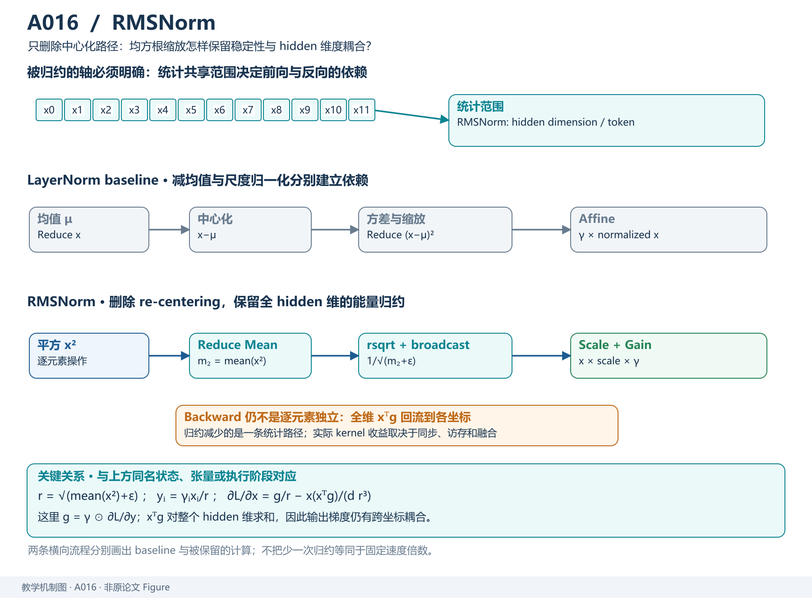
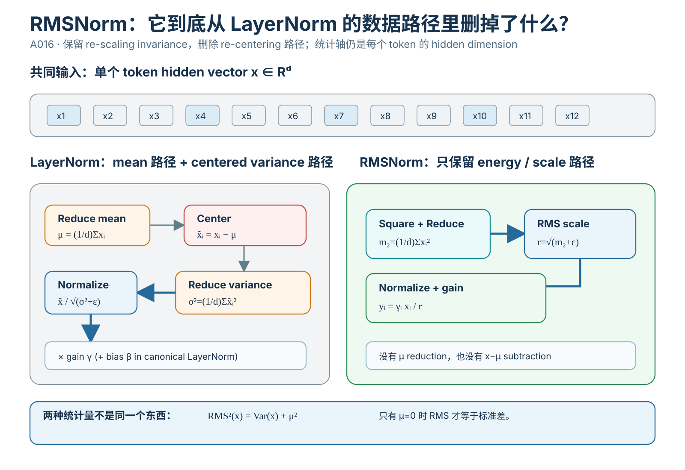
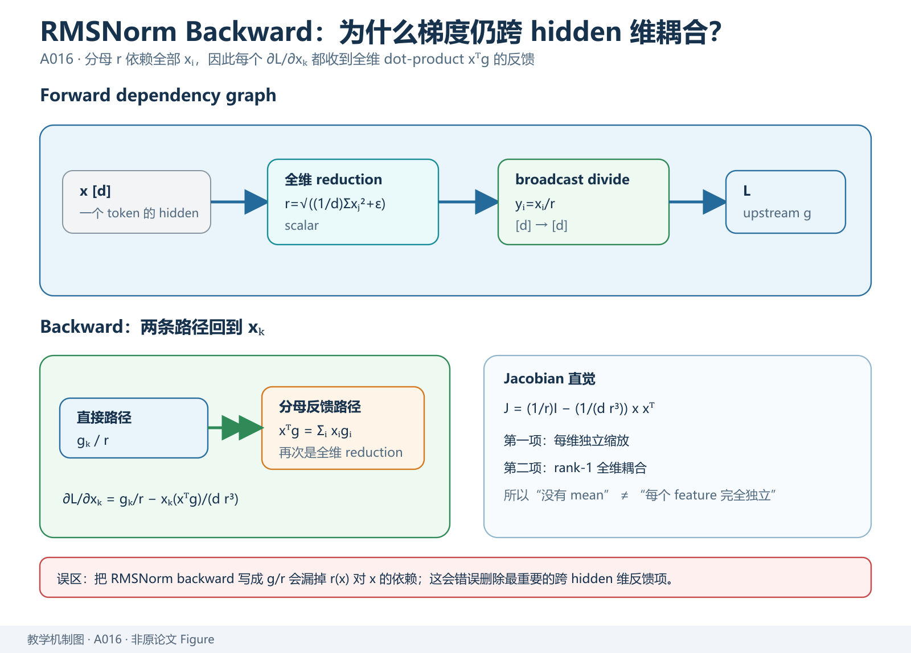
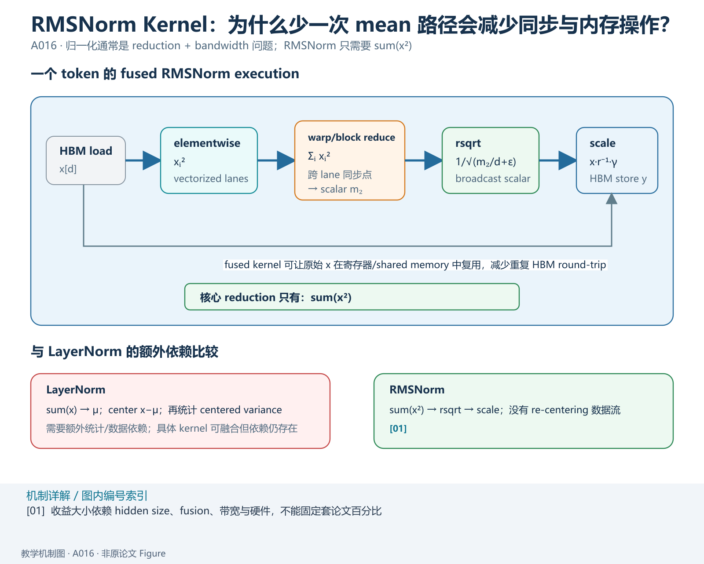

> **原文**：Biao Zhang, Rico Sennrich, *Root Mean Square Layer Normalization*, 2019，[arXiv](https://arxiv.org/abs/1910.07467)。对应 Paperlist A/03 第 6 篇。本文提出 RMSNorm 与 partial RMSNorm。要特别区分：RMSNorm 的核心不是“把 LayerNorm 换个名字”，而是**主动删除 re-centering，只保留 re-scaling invariance**。

# 模型定位与谱系

**主要类型：A 原始方法论文。** 本文位于 Transformer / RNN / FFN 的归一化模块层，不改变 Attention、FFN、Tokenizer 或训练目标。

技术谱系：

~~~text
BatchNorm
   └─ 依赖 batch 统计
          ↓
LayerNorm
   ├─ 对单样本 hidden features 求均值
   ├─ 对单样本 hidden features 求方差
   └─ 适合 RNN / Transformer
          ↓
观察：LayerNorm 同时做
   1. re-centering
   2. re-scaling
          ↓
问题：re-centering 是否真的必要？
          ↓
RMSNorm
   ├─ 不减均值
   ├─ 只除 RMS
   └─ 保留 gain 参数
          ↓
现代 LLM 广泛采用
~~~

技术树：

~~~text
Transformer
└── Normalization
    ├── LayerNorm
    └── RMSNorm
        └── partial RMSNorm
~~~

论文判断是：在其测试模型上，LayerNorm 的 re-centering invariance 并非总是必要，而 re-scaling invariance 更关键；RMSNorm 用更简单计算获得接近性能。论文报告不同模型上运行时间可降低约 7%–64%，但这个比例是**特定模型和实现环境中的端到端结果**，不能直接套到现代 fused Transformer kernel。citeturn100152academia0

*教学解释图｜去掉均值中心化以后，RMSNorm 保留尺度归一化，同时缩短 forward/backward 的归约依赖。*

# 输入、输出与任务

对单个 token hidden state：

$$
x=(x_1,\ldots,x_d)\in\mathbb R^d.
$$

批量 Transformer：

$$
X\in\mathbb R^{B\times T\times d}.
$$

RMSNorm 在最后 hidden 维上独立计算：

$$
\operatorname{RMS}(x)
=
\sqrt{
\frac1d\sum_{i=1}^{d}x_i^2+\epsilon
}.
$$

归一化：

$$
\hat x_i
=
\frac{x_i}{\operatorname{RMS}(x)}.
$$

带可学习 gain：

$$
y_i=g_i\hat x_i,\qquad g\in\mathbb R^d.
$$

Shape 不变：

$$
[B,T,d]\to[B,T,d].
$$

与 BatchNorm 不同，RMSNorm 不跨 batch 或 sequence 维共享统计：

~~~text
X[B,T,d]
   ↓
每个 (b,t) 单独对 d 个 hidden feature 求 RMS
   ↓
Y[B,T,d]
~~~

因此 batch 大小变化不会像 BatchNorm 那样改变归一化统计语义。

# 骨干架构与信息交互

## LayerNorm 与 RMSNorm 的数据流

LayerNorm：

*教学解释图｜LayerNorm vs. RMSNorm Dataflow。*

~~~text
x
 ↓
μ = mean(x)
 ↓
x - μ
 ↓
σ = sqrt(mean((x-μ)^2)+eps)
 ↓
(x-μ)/σ
 ↓
γ * ... + β
~~~

RMSNorm：

~~~text
x
 ↓
r = sqrt(mean(x²)+eps)
 ↓
x/r
 ↓
g * ...
~~~

RMSNorm 删除：

1. mean reduction；
2. subtract mean；
3. centered value 的平方统计。

保留：

1. square；
2. mean；
3. rsqrt；
4. scale。

在 Transformer Pre-Norm 结构中：

~~~text
x
 ├──────────── residual ────────────┐
 ↓                                │
RMSNorm                            │
 ↓                                │
Attention / FFN                    │
 ↓                                │
+─────────────────────────────────┘
~~~

RMSNorm 本身不决定 Pre-Norm 或 Post-Norm；那是 block layout 的更高层设计。

# 关键技术

## 1. LayerNorm 到底提供哪两种 invariance

LayerNorm：

$$
\mu(x)=\frac1d\sum_i x_i,
$$

$$
\sigma(x)
=
\sqrt{
\frac1d\sum_i(x_i-\mu)^2+\epsilon
}.
$$

输出：

$$
\operatorname{LN}(x)
=
\gamma\odot
\frac{x-\mu(x)}{\sigma(x)}
+\beta.
$$

对：

$$
x'=ax+b\mathbf1.
$$

忽略 `\epsilon` 且 `a>0`：

$$
\mu(x')=a\mu(x)+b,
$$

$$
x'-\mu(x')=a(x-\mu(x)),
$$

$$
\sigma(x')=a\sigma(x).
$$

所以：

$$
\frac{x'-\mu(x')}{\sigma(x')}
=
\frac{x-\mu(x)}{\sigma(x)}.
$$

LayerNorm 同时消除了整体平移 `b\mathbf1` 与正尺度 `a`。

RMSNorm：

$$
\operatorname{RMS}(x)
=
\sqrt{\frac1d\sum_i x_i^2}.
$$

若：

$$
x'=ax,
$$

则：

$$
\operatorname{RMS}(x')
=
|a|\operatorname{RMS}(x).
$$

当 `a>0`：

$$
\frac{x'}{\operatorname{RMS}(x')}
=
\frac{x}{\operatorname{RMS}(x)}.
$$

但加常数 `b\mathbf1` 时一般不成立。因此 RMSNorm 保留 re-scaling invariance，舍弃 re-centering invariance。

## 2. RMS 与标准差不是一回事

定义：

$$
\operatorname{RMS}^2(x)
=
\frac1d\sum_i x_i^2.
$$

方差：

$$
\operatorname{Var}(x)
=
\frac1d\sum_i(x_i-\mu)^2.
$$

展开：

$$
\operatorname{Var}(x)
=
\frac1d\sum_i x_i^2-\mu^2.
$$

因此：

$$
\boxed{
\operatorname{RMS}^2(x)
=
\operatorname{Var}(x)+\mu^2
}
$$

只有 `\mu=0` 时 RMS 等于标准差。

数值例：

$$
x=(1,2,3),\qquad \mu=2.
$$

$$
\sigma^2=\frac{1+0+1}{3}=\frac23,\quad
\sigma\approx0.8165.
$$

$$
\operatorname{RMS}
=
\sqrt{\frac{1+4+9}{3}}
=
\sqrt{\frac{14}{3}}
\approx2.1602.
$$

两者明显不同。

## 3. 为什么说 RMSNorm 带来隐式尺度调节

考虑：

$$
y=Wx.
$$

若上游把输入放大：

$$
x'=ax,
$$

普通线性层输出：

$$
Wx'=aWx.
$$

而 RMSNorm：

$$
\hat x'
=
\frac{ax}{\operatorname{RMS}(ax)}
=
\frac{x}{\operatorname{RMS}(x)}
=
\hat x.
$$

所以后续层对整体正尺度变化不敏感。它并没有真正改 optimizer 的 learning rate；所谓 implicit learning-rate adaptation 是对有效激活/梯度尺度的解释。

## 4. 反向传播完整推导

忽略 gain，定义：

*教学解释图｜Backward Hidden Coupling。*

$$
r=
\sqrt{\frac1d\sum_jx_j^2+\epsilon},
\qquad
y_i=\frac{x_i}{r}.
$$

首先：

$$
\frac{\partial r}{\partial x_k}
=
\frac{x_k}{dr}.
$$

然后：

$$
\frac{\partial y_i}{\partial x_k}
=
\frac{\delta_{ik}}{r}
-
\frac{x_ix_k}{dr^3}.
$$

设上游梯度：

$$
g_i=\frac{\partial L}{\partial y_i}.
$$

则：

$$
\frac{\partial L}{\partial x_k}
=
\sum_i
g_i
\left(
\frac{\delta_{ik}}{r}
-
\frac{x_ix_k}{dr^3}
\right).
$$

向量形式：

$$
\boxed{
\nabla_xL
=
\frac{g}{r}
-
\frac{x}{dr^3}(x^\top g)
}
$$

若有 learnable gain，只需先把上游梯度逐元素乘 gain。

这说明 backward 仍存在 hidden 维度耦合：RMS 分母依赖全部 `x_i`，不能把它理解成每个元素独立除一个常数。

## 5. 为什么少一个 mean reduction 可能更快

LayerNorm 要获得中心和尺度，RMSNorm 只需要：

*教学解释图｜RMSNorm Kernel Reduction。*

$$
\sum_i x_i^2.
$$

归一化算子通常计算强度不高，却涉及 reduction、同步与 HBM 读写。删除均值统计与 centered subtraction 可以减少指令和数据依赖。

现代 fused kernel 中真实收益取决于：

- hidden size；
- token 数；
- vectorization；
- fusion；
- memory bandwidth。

因此论文 7%–64% 不能当成现代 LLM 固定收益。citeturn100152academia0

## 6. pRMSNorm

partial RMSNorm 用一部分 feature 估计：

$$
\operatorname{RMS}_p(x)
=
\sqrt{
\frac1m
\sum_{i\in S_p}x_i^2
}.
$$

再缩放整个向量：

$$
y_i=\frac{x_i}{\operatorname{RMS}_p(x)}.
$$

目的是减少统计成本，但这是近似；如果子集不代表完整 hidden distribution，估计会偏离真实 RMS。

## 7. 最小 PyTorch 实现

~~~python
import torch
from torch import nn

class RMSNorm(nn.Module):
    def __init__(self, dim, eps=1e-6):
        super().__init__()
        self.weight = nn.Parameter(torch.ones(dim))
        self.eps = eps

    def forward(self, x):
        # x: [B,T,d]
        rms = torch.sqrt(
            x.pow(2).mean(dim=-1, keepdim=True) + self.eps
        )                                      # [B,T,1]
        x_hat = x / rms                       # [B,T,d]
        return x_hat * self.weight            # [B,T,d]

torch.manual_seed(0)
x = torch.randn(2, 4, 8, requires_grad=True)

norm = RMSNorm(8)
y = norm(x)

assert y.shape == x.shape

loss = y.square().mean()
loss.backward()

print(norm.weight.grad.shape)  # [8]
print(x.grad.shape)            # [2,4,8]
~~~

`pow(2)` 对应 `x_i^2`；`mean(dim=-1)` 对应 hidden 维平均；`sqrt` 得 RMS；`x/rms` 完成 re-scaling；`weight` 对应可学习 gain。

## 8. 实验结果与证据边界

论文在多类网络/任务上比较 LayerNorm 与 RMSNorm，报告 RMSNorm 能保持相近性能，同时在其设置下降低运行时间，并研究 pRMSNorm。citeturn100152academia0

支持：

- re-centering 不是所有测试任务的必要条件；
- 只做 RMS scaling 可以稳定训练；
- 简化归一化能带来实际运行收益。

不能推出：

- 所有架构都可无损替换 LayerNorm；
- RMSNorm 与 LayerNorm 函数完全等价；
- 所有现代 GPU 都能复现同样加速百分比。

# 预训练与后训练

RMSNorm 不改变预训练目标：

$$
L=-\sum_t\log p_\theta(x_t\mid x_{<t}).
$$

它只是 backbone forward 中的模块：

~~~text
hidden
 ↓
RMSNorm
 ↓
Attention / FFN
 ↓
Residual
~~~

训练时 gain 参数参与反向；没有 BatchNorm 式 running mean/variance。SFT、DPO、PPO 等阶段都可沿用相同 RMSNorm backbone，因此归一化方法与后训练目标基本正交。

# 推理与部署

Prefill：

$$
X\in\mathbb R^{B\times T\times d},
$$

对每个 `(b,t)` 独立求 hidden RMS。

Decode：

$$
X\in\mathbb R^{B\times1\times d},
$$

每层每 token 仍执行 RMSNorm。

RMSNorm 不创建 KV Cache。其 kernel 主要是：

~~~text
load
 → square
 → reduce
 → rsqrt
 → scale
 → multiply gain
 → store
~~~

因此系统优化重点是 reduction、HBM traffic 与 fusion，而不是改变 Attention 的 `O(T^2)` 复杂度。

## 技术 → 模型

- LayerNorm → RMSNorm：`DERIVED_FROM`
- RMSNorm → 本文：`PROPOSES`
- pRMSNorm → 本文：`PROPOSES`
- RMSNorm → LLaMA/Mistral/DeepSeek 等：后续 `ADOPTS`

## 模型 → 技术

- RMSNorm：`IMPLEMENTS` RMS re-scaling + learnable gain
- LLaMA 类 Decoder：`ADOPTS` RMSNorm，通常结合 Pre-Norm residual
- 原始 Transformer：`ADOPTS` LayerNorm，不应反向标成 RMSNorm
- BatchNorm CNN：统计轴不同，不是 RMSNorm 同义实现

**验收：** 能否证明 `RMS^2=Var+\mu^2`，证明 re-scaling invariance，并完整推导 `\nabla_xL=g/r-x(x^\top g)/(dr^3)`。
