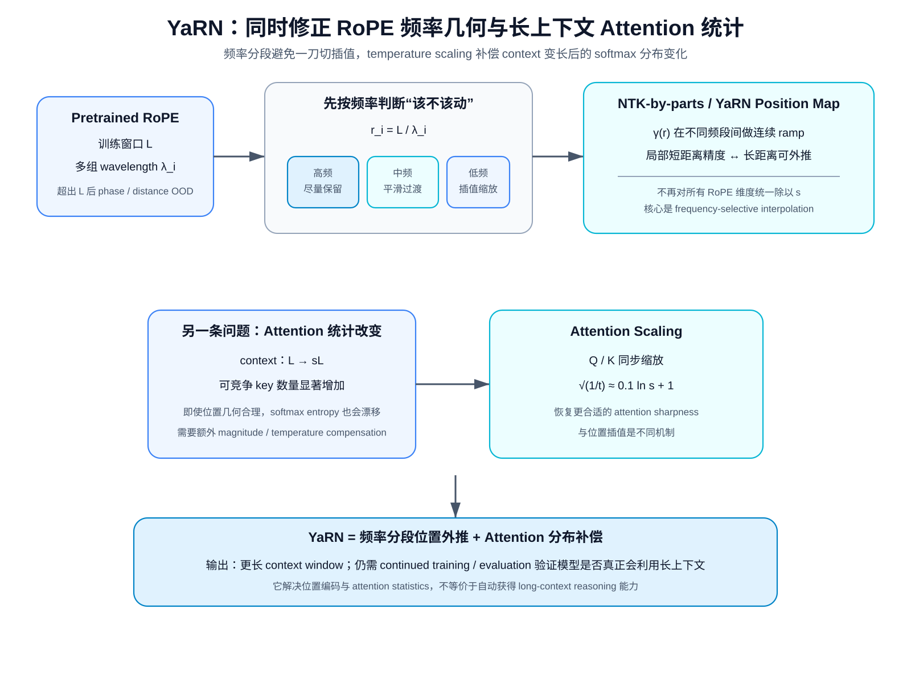
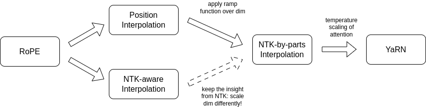
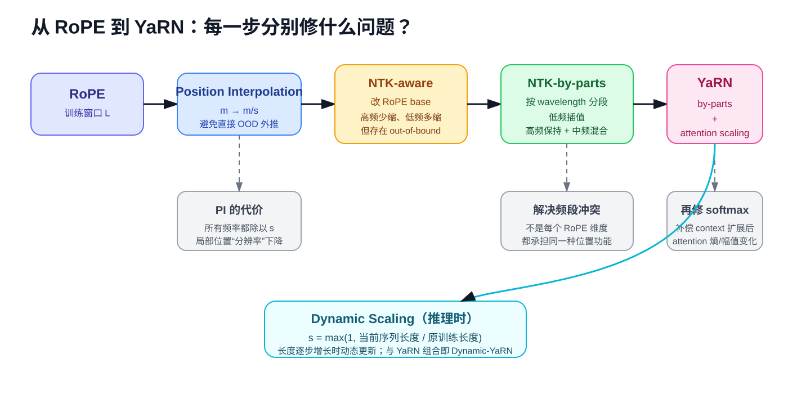
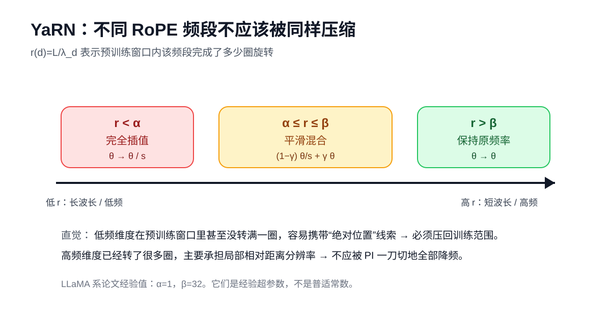
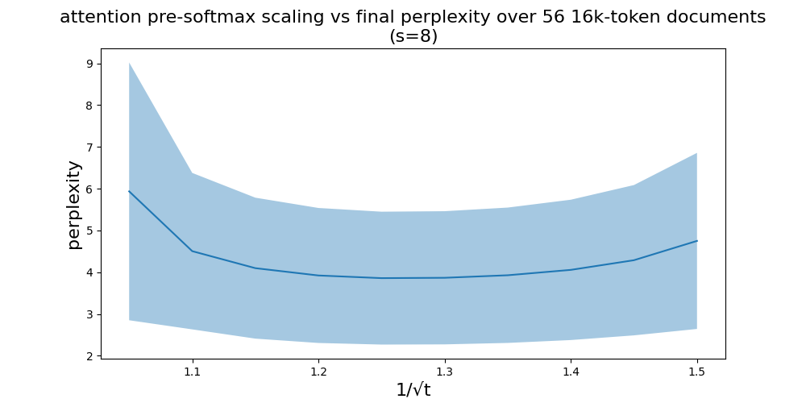
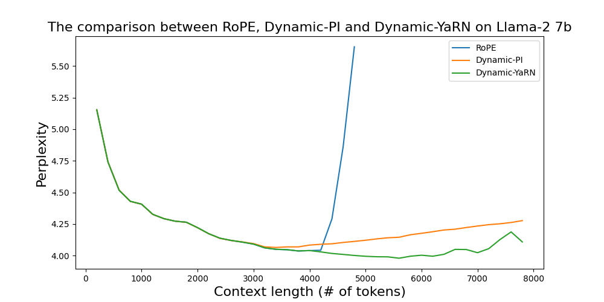
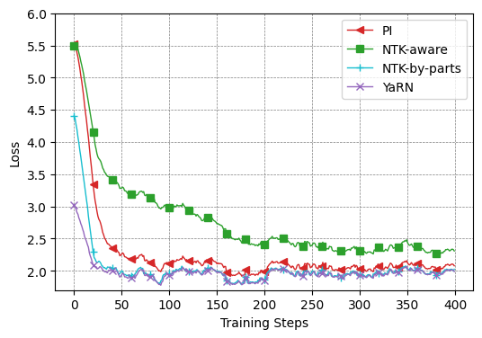
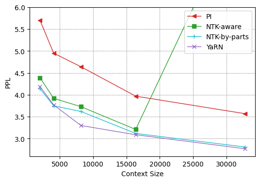
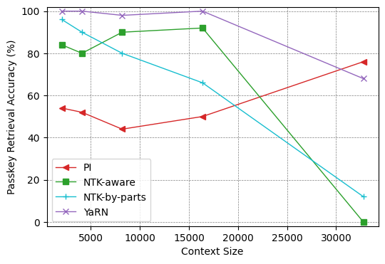
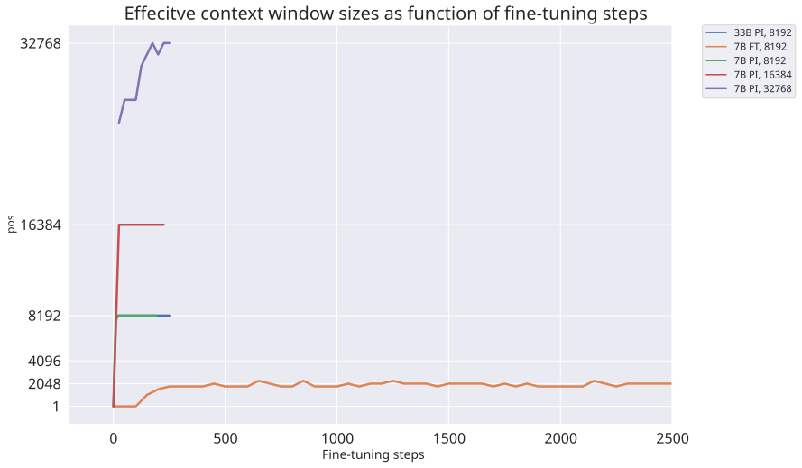

# YaRN：RoPE 长上下文外推为什么不能只“缩放位置”，以及频率分段 + Attention Scaling 如何解决它

> **主论文**：Bowen Peng et al., [YaRN: Efficient Context Window Extension of Large Language Models](https://arxiv.org/abs/2309.00071)，ICLR 2024。  
> **关键前置论文**：Shouyuan Chen et al., [Extending Context Window of Large Language Models via Positional Interpolation](https://arxiv.org/abs/2306.15595)。  
> **类型**：A · 原始方法论文；长上下文位置外推 / 继续训练方法。  
> **一句话定位**：YaRN 不是简单“把 RoPE 的 base 改大”。它沿着 **直接外推失败 → Position Interpolation → NTK-aware → NTK-by-parts → attention temperature scaling** 的问题链，最终得到一套按 RoPE 频率选择“保留还是插值”、再补偿 attention 分布变化的长上下文扩展方案。

这篇文章直接承接 [RoPE](A014-roformer-rope.md)。

如果 RoPE 只记成：

> “把 token position 乘上一个角频率，然后旋转 Q/K。”

那么长上下文扩展很容易被误解成：

> “把最大 position 从 4096 改成 131072。”

真正的问题要复杂得多。

因为一个已经训练好的 RoPE 模型，不只学了：

$$
\text{token content}.
$$

它还适应了训练区间内一整套：

$$
\text{relative distance}
\rightarrow
\text{rotary phase}
\rightarrow
QK^\top
\rightarrow
\text{attention distribution}
$$

几何关系。

当 context window 被放大：

$$
L
\rightarrow
L'=sL,
$$

你必须同时处理：

1. 新位置是否跑到训练 phase distribution 之外；
2. 如果把所有位置压回去，会不会破坏局部高频位置分辨率；
3. 不同 RoPE 维度本来就有不同 wavelength，为什么要一刀切；
4. context 中 key 数量增加以后，softmax attention 的统计分布会不会发生变化；
5. fine-tuning length 与 inference length 是否必须相等；
6. inference-time dynamic scaling 与 training-time interpolation 是不是同一件事；
7. 位置编码扩展是否等于“模型真正会利用长上下文”。

YaRN 的价值就在于：

> **它把这些原本混在一起的长上下文问题拆成了多个机制。**

---

## 阅读导航

建议先读：

- [RoPE：把相对位置信息写进旋转内积](A014-roformer-rope.md)
- [Qwen2.5](../../B/05-moe-complete-llm/B012-qwen2.5.md)：YaRN 是其 128K / 1M context pipeline 的一部分
- [Llama 3](../../B/05-moe-complete-llm/B011-llama3.md)：用于对照“直接继续预训练扩 context”和“位置外推技术”

本文重点回答：

1. RoPE 为什么明明编码相对位置，却还是会在长 context 上 OOD？
2. 为什么 Position Interpolation 比直接 extrapolation 稳定？
3. PI 为什么又会损失高频位置信息？
4. NTK-aware scaling 为什么通过改 base 而不是统一除频率？
5. RoPE 的 wavelength 到底怎么解释？
6. 为什么短 wavelength 维度应该尽量不动？
7. 为什么长 wavelength 维度反而最需要 interpolation？
8. $r=L/\lambda$ 为什么可以衡量一个维度在训练窗口中转了几圈？
9. NTK-by-parts 的 $\gamma(r)$ ramp 如何工作？
10. YaRN 比 NTK-by-parts 多了什么？
11. Attention temperature $t$ 为什么可以通过同时缩放 Q/K 实现？
12. 为什么作者建议：
    :::{math}
    \sqrt{1/t}=0.1\ln s+1?
    :::
13. Dynamic YaRN 与普通 YaRN 有什么区别？
14. Dynamic scaling 为什么会和 KV Cache 实现发生冲突？
15. 64K fine-tuning 为什么可以在论文里外推到 128K？
16. passkey retrieval、perplexity、训练 loss 分别能证明什么？
17. 为什么 Qwen2.5 的 1M context 不能写成“因为用了 YaRN”？

---

## 总结架构图

> **教学总结图**：把 frequency-selective RoPE interpolation 与 attention magnitude scaling 合并到一张长上下文外推总览图中。

## 1. 先回到 RoPE：每个 head dimension 其实是一组不同频率的二维时钟

设 attention head dimension：

$$
d_h.
$$

RoPE 把维度两两配对。

第 $i$ 个二维 pair 的角频率常写成：

$$
\omega_i
=
b^{-2i/d_h},
$$

其中典型：

$$
b=10000.
$$

位置：

$$
m
$$

对应旋转角：

$$
\phi_{m,i}
=
m\omega_i.
$$

二维旋转矩阵：

$$
R(\phi)
=
\begin{bmatrix}
\cos\phi & -\sin\phi\\
\sin\phi & \cos\phi
\end{bmatrix}.
$$

所以 query / key：

$$
q'_{m,i}
=
R(m\omega_i)q_{m,i},
$$

$$
k'_{n,i}
=
R(n\omega_i)k_{n,i}.
$$

不同 $i$ 的：

$$
\omega_i
$$

不一样。

所以一个 token position 实际被编码成：

> **很多个不同转速的二维时钟同时指向的位置。**

---

## 2. 为什么 RoPE 点积只依赖相对位置？

计算：

$$
(q'_{m,i})^\top k'_{n,i}.
$$

代入：

$$
=
q_{m,i}^\top
R(m\omega_i)^\top
R(n\omega_i)
k_{n,i}.
$$

旋转矩阵满足：

$$
R(a)^\top
=
R(-a),
$$

以及：

$$
R(-a)R(b)
=
R(b-a).
$$

因此：

$$
\boxed{
(q'_{m,i})^\top k'_{n,i}
=
q_{m,i}^\top
R((n-m)\omega_i)
k_{n,i}.
}
$$

所以 position 只通过：

$$
n-m
$$

进入点积。

这就是 RoPE 的 relative-position property。

---

## 3. 那为什么“只依赖相对位置”还不能天然无限外推？

这是长上下文最容易误解的一步。

“公式只依赖相对位置”不意味着：

> 模型已经见过任意大的相对距离。

训练最大 context：

$$
L.
$$

那么训练中常见相对距离大致只覆盖：

$$
|n-m|
<
L.
$$

在第 $i$ 个频率维度里，对应 phase：

$$
\Delta\phi_i
=
(n-m)\omega_i.
$$

训练只观察：

$$
|\Delta\phi_i|
\lesssim
L\omega_i.
$$

现在 context 直接扩成：

$$
L'=sL.
$$

相对距离可能变成：

$$
|n-m|
\lesssim
sL.
$$

于是 phase range：

$$
|\Delta\phi_i'|
\lesssim
sL\omega_i.
$$

这会把 attention 中的旋转组合推到训练分布之外。

所以：

$$
\boxed{
\text{relative-position formula}
\neq
\text{unlimited relative-distance generalization}.
}
$$

---

## 4. 为什么“旋转是周期函数”也救不了直接外推？

你可能会说：

> $\sin,\cos$ 本来就是周期函数，超过 $2\pi$ 不就绕回来了吗？

问题恰恰在这里。

模型训练学到的不是一个 isolated：

$$
\sin(m\omega_i).
$$

而是很多频率维度共同参与的：

$$
QK^\top.
$$

不同频率组合形成的整体 attention score 可以写成类似 Fourier basis expansion：

$$
a(s)
=
\operatorname{Re}
\left[
\sum_j
h_j e^{\mathrm{i}s\theta_j}
\right],
$$

其中：

$$
s=m-n.
$$

系数：

$$
h_j
$$

由 query / key content 决定。

即使这个函数在训练区间：

$$
s\in[0,L]
$$

表现良好，

也不保证：

$$
s>L
$$

时仍然稳定。

---

## 5. Position Interpolation 原论文为什么专门画“外推 vs 插值”？

*Position Interpolation 原论文核心图。左/中图展示一个由 RoPE 频率基底拟合出的 attention-score-like function：在训练区间内可以很平稳，但离开区间后可能快速爆掉；右图说明在已知区间内部做 interpolation 通常稳定得多。它支持“把长位置压回已训练位置范围”的基本动机，但不是对真实 Transformer 所有 attention head 的逐一证明。*

这就是 PI 的核心直觉：

> **不要让模型 extrapolate 到没见过的位置；把新位置压缩回原训练范围，让它做 interpolation。**

---

## 6. Position Interpolation 的公式其实非常简单

原 context：

$$
L.
$$

目标 context：

$$
L'>L.
$$

定义扩展倍率：

$$
s
=
\frac{L'}{L}.
$$

Position Interpolation 使用：

$$
\boxed{
m'
=
\frac{m}{s}
}
$$

再送进原 RoPE：

$$
R(m'\omega_i)
=
R\left(
\frac{m}{s}\omega_i
\right).
$$

等价地，也可以保持 $m$ 不变，把频率写成：

$$
\boxed{
\omega_i'
=
\frac{\omega_i}{s}.
}
$$

两种写法完全等价：

$$
\frac{m}{s}\omega_i
=
m\frac{\omega_i}{s}.
$$

> **读原论文时的一个符号提醒**：YaRN 正文 related-work 小节在统一 (g(m)) 记号时写过 (g(m)=s,m)，但它自己的附录以及 Position Interpolation 原论文都明确采用 (mL/L'=m/s)，其中 (s=L'/L)。本文统一使用 (m/s)。否则会把“把长位置压回训练区间”的方向完全写反。

---

## 7. PI 为什么把新的 32K 映射回旧的 2K？

例如原模型：

$$
L=2048.
$$

要扩到：

$$
L'=32768.
$$

倍率：

$$
s=16.
$$

新的位置：

$$
m=16000
$$

映射为：

$$
m'
=
\frac{16000}{16}
=
1000.
$$

新的最大位置：

$$
32767
$$

映射到约：

$$
2047.94.
$$

也就是整个新位置区间：

$$
[0,32768)
$$

被压进：

$$
[0,2048).
$$

所以 RoPE 不再见到训练范围之外的 position index。

---

## 8. PI 为什么只需要较少 fine-tuning？

因为模型的大部分：

- lexical knowledge；
- syntax；
- reasoning；
- representation；

都已经学好了。

变化主要是：

> 位置坐标系突然被压缩。

所以 long-context fine-tuning 更像：

$$
\text{adapt positional geometry}
$$

而不是：

$$
\text{learn the language model from scratch}.
$$

Position Interpolation 论文报告：

> 数百到约千步 fine-tuning 就可以让 LLaMA 系模型适应显著更长 context。

这也是后面 YaRN 可以继续压缩训练成本的基础。

---

## 9. 为什么直接 fine-tune “更长 position”还是不够？

如果不改 RoPE，只把 sequence length 拉长训练：

$$
L
\rightarrow
L',
$$

模型仍然从一开始就面对：

$$
m>L
$$

的 extrapolated phase pattern。

Position Interpolation 原论文实验观察到：

> 直接 fine-tuning 的长 context perplexity 明显差于 interpolation 后 fine-tuning。

所以问题不是：

> “给模型多看点长文本就一定学会。”

初始化位置几何本身是否合理，很重要。

---

## 10. Position Interpolation 的数学优势是什么？

PI 论文给出一个 interpolation bound。

核心不是背完整 bound，而是理解为什么 interpolation 比 extrapolation 更受约束。

如果：

$$
a(s)
$$

在相邻已知点：

$$
s_1,s_2
$$

之间做 interpolation，

中间：

$$
s\in[s_1,s_2]
$$

通常受到局部 smoothness 限制。

而 extrapolation：

$$
s>L
$$

没有类似局部 anchor。

因此 basis expansion：

$$
\sum_j h_je^{i\theta_js}
$$

可以在训练区间内互相抵消得很好，

出了区间却不再保证 cancellation pattern。

第一性直觉就是：

> **插值有两边锚点，外推没有。**

---

## 11. PI 看起来很漂亮，为什么 YaRN 还要继续改？

PI 对所有 RoPE 频率统一：

$$
\omega_i'
=
\frac{\omega_i}{s}.
$$

这意味着：

> 所有二维时钟都被减速 $s$ 倍。

但不同 RoPE 维度本来承担的 positional scale 不一样。

一些维度：

- 高频；
- wavelength 很短；
- 在训练窗口里转了很多圈；
- 更偏 local relative-position discrimination。

另一些：

- 低频；
- wavelength 很长；
- 在整个训练窗口甚至转不完一圈；
- 可能保留更强 absolute-like position cue。

所以：

$$
\boxed{
\text{all frequencies}
\times
\frac1s
}
$$

太粗暴。

---

## 12. 先定义 wavelength：一个 RoPE 维度多少 token 转一整圈？

角频率：

$$
\omega_i.
$$

一个完整周期满足：

$$
\lambda_i\omega_i
=
2\pi.
$$

所以：

$$
\boxed{
\lambda_i
=
\frac{2\pi}{\omega_i}.
}
$$

代入：

$$
\omega_i=b^{-2i/d_h},
$$

得到：

$$
\boxed{
\lambda_i
=
2\pi
b^{2i/d_h}.
}
$$

因此：

- 高频 $\omega_i$ 大；
- wavelength $\lambda_i$ 短；

反之：

- 低频 $\omega_i$ 小；
- wavelength $\lambda_i$ 长。

---

## 13. 一个具体 wavelength 例子

假设某维度：

$$
\lambda_i=32.
$$

那么每 32 个 token：

$$
2\pi
$$

一整圈。

在：

$$
L=4096
$$

训练窗口内会旋转：

$$
\frac{4096}{32}
=
128
$$

圈。

这是一个高度周期化的 feature。

另一个维度：

$$
\lambda_j=16384.
$$

在 4096 context 内只走：

$$
\frac{4096}{16384}
=
0.25
$$

圈。

这两个维度显然不应该被完全等价地看待。

---

## 14. 为什么短 wavelength 维度更像局部相对位置？

如果：

$$
\lambda\ll L,
$$

一个维度在训练窗口里已经重复许多周期。

单靠这个维度无法唯一判断：

> 当前到底是绝对 position 100，还是 position 132，还是 164。

因为 phase 可能重复。

因此这类维度天然更适合编码：

> 局部 relative phase / relative distance pattern。

YaRN 论文的核心假设之一是：

> **这类高频维度已经主要承担局部相对位置信息，不应该被强烈 interpolation。**

---

## 15. 为什么长 wavelength 维度可能保留 absolute-like 信息？

如果：

$$
\lambda>L,
$$

整个训练 context 内连一圈都没有转完。

那么从 position 0 开始：

$$
0
\rightarrow
L
$$

的 phase 基本不重复。

因此 position 与 phase 之间近似保持唯一关系。

模型有机会把它当成：

> absolute-like location signal。

当 context 扩到：

$$
L'>L,
$$

如果继续原频率，就会进入训练时没见过的 phase 区域。

所以 YaRN 的思路是：

> **长 wavelength 维度反而应该更彻底地做 interpolation。**

---

## 16. 用 $r=L/\lambda$ 表示“训练时转了几圈”

YaRN 定义：

$$
\boxed{
r(i)
=
\frac{L}{\lambda_i}.
}
$$

因为：

$$
\lambda_i
$$

是一圈需要多少 token。

所以：

$$
r(i)
$$

就是在整个训练窗口：

$$
L
$$

内大约完成多少 rotation。

例如：

### $r=128$

训练窗口转 128 圈。

高度周期化。

### $r=0.25$

训练窗口只转四分之一圈。

更像 absolute-like positional coordinate。

这让 frequency classification 变得非常直观。

---

## 17. NTK-aware interpolation 先解决了 PI 的什么问题？

PI：

$$
\omega_i'
=
\frac{\omega_i}{s}
$$

对所有频率统一减速。

高频也被减速。

于是 local positional resolution 被压缩。

NTK-aware 的思路：

> **不要每个频率都除同样的 $s$。高频尽量少改，低频多改。**

最简单实现：

> 改 RoPE base $b$。

---

## 18. NTK-aware base change 是怎么来的？

原频率：

$$
\omega_i
=
b^{-2i/d_h}.
$$

希望最高频基本保持。

当：

$$
i=0,
$$

无论 base 多大：

$$
\omega_0
=
b^0
=
1.
$$

天然不变。

希望最低频大约缩小：

$$
s
$$

倍。

最后一个有效二维频率 index 近似：

$$
i_{\max}
=
\frac{d_h-2}{2}.
$$

对应 exponent：

$$
\frac{2i_{\max}}{d_h}
=
\frac{d_h-2}{d_h}.
$$

希望：

$$
(b')^{-(d_h-2)/d_h}
=
\frac1s
b^{-(d_h-2)/d_h}.
$$

两边倒数：

$$
(b')^{(d_h-2)/d_h}
=
s
b^{(d_h-2)/d_h}.
$$

所以：

$$
\boxed{
b'
=
b\,
s^{d_h/(d_h-2)}.
}
$$

这就是 NTK-aware 常见 base scaling 的来源。

---

## 19. 为什么 base change 会自然形成“高频少缩、低频多缩”？

新频率：

$$
\omega_i'
=
(b')^{-2i/d_h}.
$$

代入：

$$
b'
=
b s^{d_h/(d_h-2)}.
$$

得到：

$$
\omega_i'
=
b^{-2i/d_h}
s^{-2i/(d_h-2)}.
$$

即：

$$
\boxed{
\omega_i'
=
\omega_i
s^{-2i/(d_h-2)}.
}
$$

当：

$$
i=0,
$$

缩放：

$$
s^0=1.
$$

最高频不变。

随着 $i$ 增大，缩放越来越强。

到最低频附近：

$$
\approx\frac1s.
$$

这正是：

> 从“统一 interpolation”变成“按频率连续分配 interpolation pressure”。

---

## 20. 为什么叫 NTK-aware？

这部分名称来自 Fourier Features / Neural Tangent Kernel 的启发：

> 深网络如果缺少高频 input feature，对高频函数学习可能更困难。

Position Interpolation 会把整个 RoPE frequency spectrum 都向低频移动：

$$
\omega_i
\rightarrow
\omega_i/s.
$$

因此高频 positional components 被整体削弱。

NTK-aware 的动机就是：

> 保留更多高频 positional signal。

但需要明确证据边界：

> YaRN 论文借用了 NTK / Fourier feature 直觉来解释该设计；这不等于对完整 Transformer long-context generalization 给出了严格 NTK 理论。

---

## 21. NTK-aware 为什么仍然不够？

它的问题是：

> base change 同时连续改变所有非最高频维度。

一些维度可能被缩放成：

$$
\omega_i'
$$

以后，仍然进入部分 extrapolation / interpolation 混合状态。

而且为了达到目标 context：

$$
L',
$$

实际最优：

$$
b'
$$

经常需要经验调参。

所以问题变成：

> **我们能不能不用一个“整体改 base”的间接手段，而直接按照每个 wavelength 的语义，决定它该不该插值？**

这就是 NTK-by-parts。

---

## 22. 原论文如何总结 PI → NTK → YaRN 的谱系？

*YaRN 原论文的 method summary。图中把 Position Interpolation、NTK-aware、Dynamic NTK、NTK-by-parts 与 YaRN 的关系放在一起。一个重要事实是：其中部分 NTK 方法最初来自开源社区 / 非正式技术工作，YaRN 论文的重要贡献之一就是把这些经验方法系统化并纳入统一框架。*

*教学解释图。原论文图负责给出方法谱系；这张图进一步把每一次方法变化对应到具体 failure mode：PI 修 direct extrapolation，NTK-aware 修统一降频，NTK-by-parts 把频率分工显式化，而完整 YaRN 再加入 attention magnitude scaling。*

这张图很适合用来避免一个常见误解：

> YaRN 不是一步发明出来的单公式。

它是多条经验改进汇合的结果。

---

## 23. NTK-by-parts：不要再改 base，直接按 wavelength 分类

定义：

$$
r(i)
=
\frac{L}{\lambda_i}.
$$

引入两个 threshold：

$$
\alpha,
\qquad
\beta,
$$

且：

$$
\alpha<\beta.
$$

### 情况 1：$r<\alpha$

训练窗口内旋转很少。

wavelength 很长。

执行 full interpolation：

$$
\omega_i'
=
\frac{\omega_i}{s}.
$$

### 情况 2：$r>\beta$

训练窗口内转很多圈。

wavelength 很短。

保持原频率：

$$
\omega_i'
=
\omega_i.
$$

### 情况 3：中间

平滑混合。

*教学解释图。横轴不是普通神经元编号，而是用 (r(d)=L/\lambda_d) 表示“该频率在原训练窗口内转过多少圈”。低 (r) 的长波长维度完全插值，高 (r) 的短波长维度保留原频率，中间频段平滑混合。*

---

## 24. Ramp function $\gamma(r)$

YaRN 定义：

$$
\boxed{
\gamma(r)
=
\begin{cases}
0,
&
r<\alpha
\\[4pt]
1,
&
r>\beta
\\[4pt]
\dfrac{r-\alpha}{\beta-\alpha},
&
\text{otherwise}.
\end{cases}
}
$$

于是：

- $\gamma=0$：full interpolation；
- $\gamma=1$：不 interpolation；
- 中间：线性过渡。

---

## 25. 最终 frequency mixing 公式

NTK-by-parts：

$$
\boxed{
\omega_i'
=
(1-\gamma_i)
\frac{\omega_i}{s}
+
\gamma_i
\omega_i.
}
$$

展开：

$$
=
\omega_i
\left[
\frac{1-\gamma_i}{s}
+
\gamma_i
\right].
$$

所以每个频率的实际 scale factor 不是统一：

$$
1/s.
$$

而是：

$$
\boxed{
k_i
=
\frac{1-\gamma_i}{s}
+
\gamma_i.
}
$$

其中：

$$
k_i\in[1/s,1].
$$

---

## 26. 这个公式怎么读最自然？

不要先看数学。

看三段：

~~~text
Low frequency / long wavelength
r small
→ training window 没转几圈
→ absolute-like cue 强
→ full interpolation

Middle frequency
→ blend

High frequency / short wavelength
r large
→ training window 已转很多圈
→ local relative cue 强
→ keep original
~~~

这就是：

> **按 RoPE 维度的空间尺度分工。**

---

## 27. LLaMA family 的 $\alpha,\beta$ 是多少？

YaRN 论文实验推荐：

$$
\alpha=1,
$$

$$
\beta=32.
$$

也就是：

### $r<1$

训练 context 内连一圈都不到：

> full interpolation。

### $r>32$

训练 context 内超过约 32 圈：

> 不 interpolation。

中间平滑混合。

注意：

> 这是论文针对 LLaMA family 的经验值，不是所有 RoPE 模型的 universal constant。

---

## 28. 一个具体维度例子

假设：

$$
L=4096,
$$

目标：

$$
L'=32768,
$$

所以：

$$
s=8.
$$

### 维度 A

$$
\lambda_A=8192.
$$

则：

$$
r_A
=
4096/8192
=
0.5.
$$

小于：

$$
\alpha=1.
$$

所以：

$$
\gamma_A=0.
$$

得到：

$$
\omega_A'
=
\omega_A/8.
$$

### 维度 B

$$
\lambda_B=64.
$$

则：

$$
r_B
=
4096/64
=
64.
$$

大于：

$$
\beta=32.
$$

所以：

$$
\gamma_B=1.
$$

得到：

$$
\omega_B'
=
\omega_B.
$$

一个变 8× 慢。

一个完全不变。

这就是 YaRN 与 PI 的核心区别之一。

---

## 29. 中频维度怎么算？

假设：

$$
r=8.
$$

并取：

$$
\alpha=1,
\qquad
\beta=32.
$$

那么：

$$
\gamma
=
\frac{8-1}{32-1}
=
\frac7{31}
\approx0.226.
$$

若：

$$
s=8,
$$

频率 scale：

$$
k
=
\frac{1-\gamma}{8}
+
\gamma.
$$

代入：

$$
k
\approx
\frac{0.774}{8}
+
0.226.
$$

所以：

$$
k\approx0.323.
$$

因此：

$$
\omega'
\approx0.323\omega.
$$

既不是：

$$
\omega/8,
$$

也不是：

$$
\omega.
$$

---

## 30. 到 NTK-by-parts 为止，YaRN 还没完整出现

如果只实现：

$$
\omega_i'
=
(1-\gamma_i)\omega_i/s+\gamma_i\omega_i,
$$

你实现的是：

> NTK-by-parts interpolation。

YaRN 论文还加入另一个独立观察：

> **长上下文扩展后，attention logits 的 softmax temperature / magnitude 也值得调整。**

这才组成完整 YaRN。

---

## 31. 为什么 context 变长可能影响 attention distribution？

原 attention：

$$
A
=
\operatorname{softmax}
\left(
\frac{QK^\top}{\sqrt{d_h}}
\right).
$$

一行 attention 原来可能有：

$$
L=4096
$$

个候选 key。

扩展后：

$$
L'=32768.
$$

候选 key 数变成 8×。

即使 logit distribution 形状相似，

softmax normalization：

$$
\sum_j e^{z_j}
$$

也面对更多项。

这可能改变：

- attention entropy；
- mass concentration；
- peakiness。

YaRN 论文经验观察到：

> 在 RoPE interpolation 后，对 attention logits 做一个统一 temperature scaling，可以降低 perplexity。

---

## 32. Temperature $t$ 怎样进入 Attention？

YaRN 写：

$$
\boxed{
A
=
\operatorname{softmax}
\left(
\frac{QK^\top}
{t\sqrt{d_h}}
\right).
}
$$

如果：

$$
t<1,
$$

则 logits 被放大：

$$
\frac1t>1.
$$

softmax 变得更 sharp。

如果：

$$
t>1,
$$

softmax 更平。

YaRN 扩 context 时推荐的有效结果对应：

$$
1/t>1.
$$

也就是适度 sharpen attention。

---

## 33. 为什么可以不改 Attention kernel，只缩放 RoPE 输出？

假设同时把：

$$
Q
$$

和：

$$
K
$$

乘：

$$
m.
$$

那么：

$$
(mQ)(mK)^\top
=
m^2QK^\top.
$$

想要：

$$
m^2
=
\frac1t.
$$

所以：

$$
\boxed{
m
=
\sqrt{\frac1t}.
}
$$

于是：

$$
\operatorname{softmax}
\left(
\frac{mQ(mK)^\top}{\sqrt{d_h}}
\right)
=
\operatorname{softmax}
\left(
\frac{QK^\top}{t\sqrt{d_h}}
\right).
$$

所以可以把 temperature scaling 合并进 rotary embedding magnitude。

---

## 34. YaRN 推荐的 magnitude scaling

针对 LLaMA / Llama 2，论文经验拟合：

$$
\boxed{
m
=
\sqrt{\frac1t}
=
0.1\ln s+1.
}
$$

例如：

$$
s=8.
$$

则：

$$
\ln8
\approx2.079.
$$

所以：

$$
m
\approx
1+0.2079
=
1.208.
$$

于是：

$$
1/t
=
m^2
\approx1.46.
$$

得到：

$$
t
\approx0.684.
$$

attention logits 大约被放大：

$$
1.46\times.
$$

---

## 35. 这个 scaling formula 是理论推导出来的吗？

不是。

这是非常重要的证据边界。

论文在多个 LLaMA sizes 与不同 scale $s$ 上搜索：

$$
m
$$

使 perplexity 最低。

然后对最佳点拟合：

$$
m=0.1\ln s+1.
$$

因此它是：

> **empirical rule。**

不是 Transformer softmax entropy 的严格 closed-form optimum。

---

## 36. 原论文的 magnitude-scaling 实验

*YaRN 原论文 appendix：固定 $s=8$，扫描 $1/\sqrt t$（等价于 Q/K magnitude scale）并测 LLaMA 7B perplexity。实验支持某个统一 magnitude scaling 在不同样本上可以改善扩展后的 perplexity。*

它能支持：

> attention scaling 是一个真实可观测的额外增益项。

但不能推出：

> 所有模型都严格服从 $0.1\ln s+1$。

---

## 37. 完整 YaRN 可以压成两步

### Step 1：频率分段

$$
\omega_i'
=
(1-\gamma_i)
\frac{\omega_i}{s}
+
\gamma_i\omega_i.
$$

### Step 2：magnitude scaling

$$
m
=
0.1\ln s+1.
$$

旋转后的 Q/K 同时乘：

$$
m.
$$

因此：

$$
\boxed{
\text{YaRN}
=
\text{NTK-by-parts}
+
\text{attention magnitude scaling}.
}
$$

这句话比“YaRN 是一种 RoPE scaling”更准确。

---

## 38. 一个完整的数据流

~~~{mermaid}
flowchart LR
    P["position m"] --> R["RoPE frequencies ω_i"]
    R --> W["wavelength λ_i = 2π/ω_i"]
    W --> C["r_i = L/λ_i"]
    C --> G["ramp γ_i"]
    G --> F["ω'_i = (1-γ_i)ω_i/s + γ_iω_i"]
    F --> ROT["Rotate Q,K"]
    S["scale s=L'/L"] --> M["m = 0.1 ln s + 1"]
    M --> ROT
    ROT --> LOGIT["QK^T / √d"]
    LOGIT --> SM["softmax"]
~~~

这个数据流里：

- shape 没变；
- Transformer block 没加新层；
- V 不变；
- causal mask 不变。

变化的是：

> **Q/K 的 position-dependent geometry 与 magnitude。**

## 39. Dynamic Scaling：这是 inference-time policy，不是 YaRN 本体公式

前面的 YaRN 假设目标 context：

$$
L'
$$

固定，因此：

$$
s=\frac{L'}{L}
$$

固定。

但 autoregressive generation 的实际 sequence length：

$$
\ell
$$

会从：

$$
1,2,3,\dots
$$

不断增长。

如果从 token 1 开始就使用最大 scale：

$$
s_{\max}=\frac{L'}{L},
$$

那么即使：

$$
\ell\ll L,
$$

模型也已经在使用强 interpolation。

这会无谓改变原本已经学得很好的 short-context geometry。

---

## 40. Dynamic YaRN 的基本思想

不要固定最大：

$$
s.
$$

而是在每次 forward 根据当前 sequence length 更新：

$$
\boxed{
s_{\rm dyn}
=
\max\left(
1,
\frac{\ell}{L}
\right).
}
$$

当：

$$
\ell\le L,
$$

有：

$$
s_{\rm dyn}=1.
$$

于是继续使用原始 RoPE。

当：

$$
\ell>L,
$$

才逐渐开始扩展。

可以把它看成：

~~~text
short context
→ original geometry

cross pretrained limit
→ gradually increase scale

very long context
→ stronger interpolation
~~~

---

## 41. 为什么 Dynamic Scaling 能减少 short-context penalty？

静态 YaRN 如果目标：

$$
s=16,
$$

意味着从 position 1 开始，低频已经按照 16× context 的目标被压缩。

但如果当前 sequence 实际只有：

$$
1000<L,
$$

根本没有扩窗需求。

Dynamic scaling 会令：

$$
s=1.
$$

所以短上下文继续使用原始位置几何。

这是它最直接的收益。

---

## 42. 为什么 Dynamic Scaling 还能让超出目标长度后的退化更平滑？

假设静态目标：

$$
L'=32K.
$$

固定：

$$
s=8.
$$

输入如果突然到：

$$
40K,
$$

最后一段又会进入目标 scale 未覆盖的区域。

Dynamic scaling 可以继续随着：

$$
\ell
$$

增大：

$$
s_{\rm dyn}.
$$

这不保证无限 context。

更准确地说：

> 它是一种按当前输入长度自适应的位置缩放策略，使模型离开已适配区间时不必突然撞上一个硬边界。

因此：

$$
\boxed{
\text{Dynamic Scaling}
\neq
\text{Infinite Context}.
}
$$

---

## 43. Dynamic Scaling 为什么会和 KV Cache 冲突？

这是非常重要的工程细节。

普通 decode：

~~~text
token 1
→ compute K1
→ apply fixed RoPE
→ cache K1_rot

token 2
→ compute K2
→ apply fixed RoPE
→ reuse K1_rot

...
~~~

只要：

$$
s
$$

固定，

历史 token 的旋转结果永远不变。

但 Dynamic Scaling 中：

$$
s_{\rm dyn}
$$

会随着 sequence length 改变。

于是 token 1 在：

$$
\ell=1000
$$

时应该使用的 RoPE，

和在：

$$
\ell=10000
$$

时按照新 scale 重新计算出的 RoPE 不再相同。

如果历史缓存保存的是：

$$
K_1^{\rm post\text{-}RoPE},
$$

那么它已经“烘焙”了旧 scale。

---

## 44. 为什么论文强调要谨慎处理 cached K？

逻辑上最干净的方案是缓存：

$$
K^{\rm pre\text{-}RoPE},
$$

再根据当前：

$$
s_{\rm dyn}
$$

重新施加旋转。

但这会带来新的：

- memory；
- recomputation；
- cache orchestration；

成本。

因此实际 serving implementation 可能采用：

- 固定分段 scale；
- cache-compatible approximation；
- 预先设计的动态频率策略。

这里最重要的结论不是某个 API：

> **只要位置编码依赖“当前总长度”，历史 KV 是否仍可原样复用就必须重新审查。**

---

## 45. 原论文 Dynamic YaRN 图

*YaRN appendix 在未做长上下文 fine-tuning 的 Llama 2 上比较原 RoPE、Dynamic PI 与 Dynamic YaRN。它支持 dynamic scaling 在部分超预训练长度场景中改善 perplexity 或延缓崩坏；它不能被解释成“无需训练即可获得完整长上下文能力”。*

这里必须区分两句话：

> perplexity 没有立刻炸。

与：

> 模型已经学会利用几十万 token 的远距离信息。

不是一回事。

---

## 46. YaRN 的训练方式：它不是从头训练一个 128K 模型

论文从已有：

- LLaMA；
- Llama 2；

checkpoint 出发。

主要修改：

- RoPE frequency；
- attention magnitude scaling；

再做少量 long-context fine-tuning。

对于 Llama 2：

原 context：

$$
L=4096.
$$

### Scale $s=16$

目标：

$$
L'=65536.
$$

训练设置包括：

- 400 steps；
- global batch 64；
- 64K chunks；
- PG19；
- AdamW；
- learning rate $2\times10^{-5}$；
- FSDP；
- FlashAttention 2。

### Scale $s=32$

目标：

$$
L'=131072.
$$

从：

$$
s=16
$$

checkpoint 出发，

再训练：

$$
200
$$

steps。

但实际训练 sequence 仍是：

$$
64K.
$$

---

## 47. 一个非常重要的结果：训练 64K，评估到 128K

论文的 $s=32$ model：

- YaRN target scale 对应 128K；
- additional fine-tuning data 最大只有 64K；
- 最终在 128K evaluation 上仍保持可用结果。

这说明：

> position-extension method 能让已经适配长上下文的模型，在训练长度之外继续获得一定 extrapolation / transfer。

但不能进一步说：

> 训练到一半长度就普遍能无损泛化到两倍。

这是特定模型、数据、方法与 evaluation 下的证据。

---

## 48. 为什么 YaRN 可以比 PI 更快适应？

PI 对全部频率：

$$
\omega_i\rightarrow\frac{\omega_i}{s}.
$$

因此模型同时需要重新适应：

- long-range phase；
- local high-frequency positional resolution；
- attention score distribution。

YaRN：

- 高频尽量保留；
- 低频插值；
- 中频平滑混合；
- attention magnitude 再补偿。

所以它对预训练 geometry 的扰动更有选择性。

一个合理的机制解释是：

> **需要重新学习的位置关系更少，因此少量 long-context fine-tuning 更容易恢复。**

---

## 49. 原论文 Training Loss：相同 budget 下 YaRN 收敛更快

*原论文使用 LLaMA 7B 扩展到 32K，在相同训练设置下比较多种 interpolation techniques。YaRN 的 training loss 更快进入较低区域。它直接支持“在该实验配置下更容易适配”，但不是所有模型训练成本的普适倍数定律。*

论文报告的“更少 token / 更少 steps”应该始终理解为：

> 在指定 baseline、scale 与模型族下的实验结果。

---

## 50. Long-context evaluation 为什么不能只看一个数字？

一个扩窗方法至少要回答三类不同问题。

### 50.1 Language Modeling

context 更长以后：

$$
PPL
$$

是否保持稳定，甚至下降？

### 50.2 Retrieval

远距离单点信息能否找回？

例如 passkey。

### 50.3 Capability Retention

扩窗以后：

- MMLU；
- HellaSwag；
- ARC；

等原有短上下文能力有没有显著下降？

因此：

$$
\text{Long Context Quality}
\neq
\text{one benchmark}.
$$

---

## 51. Sliding-window perplexity 在测什么？

对于很长 document，可以滑动 evaluation window。

每次：

- 提供尽可能长的历史；
- 计算后续 token NLL；
- 汇总整个 document。

如果 context 扩大后：

$$
PPL
$$

继续下降，

说明：

> 模型至少在 next-token prediction 上利用到了更远的历史信息。

但它仍然不直接证明：

> 复杂跨章节 reasoning 正确。

---

## 52. 原论文 long-context perplexity

*原论文在相同 long-context fine-tuning budget 下比较多种 interpolation 方法的 sliding-window perplexity。YaRN 在目标长上下文区间保持较低 perplexity。*

它主要回答：

> 语言建模有没有随着 sequence 变长稳定工作。

不是：

> 128K QA 一定正确。

---

## 53. Passkey Retrieval 在测什么？

构造长 prompt。

随机位置放：

~~~text
The pass key is 384719.
~~~

最后问：

> pass key 是什么？

如果模型正确输出：

$$
384719,
$$

至少说明：

1. 远距离 token 没有完全失真；
2. 最终 query 可以访问它；
3. long-range retrieval path 没有彻底崩坏。

---

## 54. 原论文 passkey 结果怎样读？

*原论文 passkey retrieval 对比。这个任务对有效上下文长度很敏感，但它是合成 needle-retrieval 测试，不能单独证明复杂长文档理解。*

对于更长 YaRN model，论文 appendix 还报告了在测试范围内很高的 passkey accuracy。

正确结论：

> long-distance single-fact retrieval 可以工作。

错误结论：

> 所有长上下文 information 都被模型等价理解。

---

## 55. 为什么 passkey 是必要但远不充分的 benchmark？

现实长上下文任务可能要求：

- 综合多章节信息；
- 对冲突事实做判断；
- repository-level code dependency tracing；
- 长时间时序关系；
- multi-hop evidence aggregation。

因此能力更接近：

$$
\text{retrieval}
+
\text{integration}
+
\text{reasoning}.
$$

passkey 主要覆盖第一项。

---

## 56. Position Interpolation 的 retrieval 图为什么也值得保留？

*Position Interpolation 原论文已经证明“把位置压回训练区间 + 少量 fine-tuning”可以显著延长有效 retrieval context。YaRN 的历史位置是在这个范式上进一步改善频率处理与训练效率。*

因此不能把：

> long-context interpolation

全部归功于 YaRN。

PI 已经建立了关键基础。

---

## 57. YaRN 与 PI 的关系应该怎样准确描述？

### PI

完成关键范式切换：

$$
\boxed{
\text{Extrapolation}
\rightarrow
\text{Interpolation}.
}
$$

### YaRN

把：

$$
\boxed{
\text{Uniform Interpolation}
}
$$

改成：

$$
\boxed{
\text{Frequency-selective Interpolation}
+
\text{Attention Scaling}.
}
$$

所以：

> PI 改变问题形式，YaRN 改进资源分配方式。

---

## 58. YaRN 与 NTK-aware 的关系

NTK-aware 保留核心直觉：

> 高频少缩、低频多缩。

实现：

$$
b\rightarrow b'.
$$

NTK-by-parts 则显式根据：

$$
r=L/\lambda
$$

决定每个维度的 interpolation strength。

因此技术链：

~~~text
NTK-aware
→ distribute interpolation pressure

NTK-by-parts
→ explicit wavelength-based allocation

YaRN
→ NTK-by-parts + attention magnitude scaling
~~~

---

## 59. 为什么 YaRN 论文还承担了“形式化开源社区方法”的角色？

NTK-aware、Dynamic NTK、NTK-by-parts 的一部分发展早期来自：

- Reddit；
- 开源社区；
- 技术实验。

YaRN 论文的重要贡献之一是：

> 把这些此前分散的方法写进统一数学记号、系统实验并解释它们之间的关系。

所以读论文时应区分：

- earlier community method；
- paper formalization；
- YaRN 新组合。

---

## 60. 为什么“YaRN = 改 RoPE Base”是错的？

单纯：

$$
b\rightarrow b'
$$

更接近 NTK-aware。

完整 YaRN：

$$
\omega_i'
=
(1-\gamma_i)
\frac{\omega_i}{s}
+
\gamma_i\omega_i,
$$

再加：

$$
m=0.1\ln s+1.
$$

所以它不是单一 base change。

---

## 61. 为什么“YaRN = Position Interpolation”也不对？

PI：

$$
\omega_i'
=
\frac{\omega_i}{s}
\qquad
\forall i.
$$

YaRN：

$$
\omega_i'
\in
\left[
\frac{\omega_i}{s},
\omega_i
\right],
$$

而且具体位置依赖：

$$
\lambda_i.
$$

所以 YaRN 明确拒绝：

> 所有 frequency 一刀切。

---

## 62. 一个 PyTorch 风格的教学伪实现

~~~python
import math
import torch

def yarn_inv_freq(
    head_dim,
    base,
    original_ctx,
    target_ctx,
    alpha=1.0,
    beta=32.0,
):
    idx = torch.arange(0, head_dim, 2, dtype=torch.float32)

    # 原始 RoPE frequency
    omega = base ** (-idx / head_dim)

    # 一圈需要多少 token
    wavelength = 2 * math.pi / omega

    # 原训练窗口里转多少圈
    r = original_ctx / wavelength

    s = target_ctx / original_ctx

    # gamma = 0: full interpolation
    # gamma = 1: keep original
    gamma = ((r - alpha) / (beta - alpha)).clamp(0.0, 1.0)

    omega_new = (1 - gamma) * (omega / s) + gamma * omega
    return omega_new
~~~

真正要记的是数据流：

~~~text
frequency
→ wavelength
→ rotations inside pretrained context
→ interpolation strength
~~~

而不是 Python API。

---

## 63. Attention magnitude scaling 的教学伪实现

~~~python
def yarn_mscale(scale_factor):
    if scale_factor <= 1:
        return 1.0
    return 0.1 * math.log(scale_factor) + 1.0
~~~

RoPE 后：

~~~python
q_rot = apply_rope(q, cos, sin)
k_rot = apply_rope(k, cos, sin)

m = yarn_mscale(s)
q_rot = m * q_rot
k_rot = m * k_rot
~~~

于是：

$$
q_{\rm rot}^\top k_{\rm rot}
$$

整体乘：

$$
m^2.
$$

等价于：

$$
t=\frac1{m^2}.
$$

---

## 64. 为什么实际库实现可能和论文公式长得不一样？

工程库可以把这些逻辑折进：

- inv_freq；
- cos/sin cache；
- attention_factor；
- RoPE module；
- model config。

所以看到某个 YaRN config 只暴露一个 factor，不代表内部只有一个变量。

真正应该检查：

1. frequency interpolation 怎么算；
2. original max context 是多少；
3. attention magnitude 是否缩放；
4. dynamic scaling 是否存在。

---

## 65. 为什么 YaRN 可以保持 FlashAttention compatibility？

YaRN 最终仍然计算标准：

$$
\operatorname{softmax}
\left(
\frac{QK^\top}{\sqrt{d_h}}
\right)V.
$$

只是 Q/K 在进入 kernel 前已经被：

- 新 RoPE frequency；
- magnitude scaling；

处理。

因此不需要引入完全不同的 attention operator。

这让它容易继续使用：

> FlashAttention 2 等标准优化 kernel。

---

## 66. 但 YaRN 完全没有解决 $O(L^2)$

这是必须钉死的边界。

full attention score matrix：

$$
QK^\top
\in
\mathbb R^{L\times L}.
$$

所以：

$$
\text{compute}
\sim
O(L^2).
$$

从：

$$
4K
\rightarrow
128K
$$

长度：

$$
32\times.
$$

naive pairwise interactions：

$$
1024\times.
$$

因此：

> **位置上能表示 128K，不等于系统上便宜地跑 128K。**

---

## 67. 这正是 Qwen2.5 为什么同时需要 DCA 和 MInference

[Qwen2.5](../../B/05-moe-complete-llm/B012-qwen2.5.md) 的长上下文链应该拆成：

### Training

普通 dense：

$$
32K
$$

Turbo progressive：

$$
32K
\rightarrow65K
\rightarrow131K
\rightarrow262K.
$$

### Position extrapolation

$$
\text{YaRN}.
$$

### Attention organization

$$
\text{Dual Chunk Attention}.
$$

### Runtime acceleration

$$
\text{MInference-derived sparse attention}.
$$

四层职责不同。

---

## 68. YaRN 在 Qwen2.5 中真正承担哪一层？

最准确的表述：

> **YaRN 扩展 RoPE position-frequency mapping，使推理位置超过训练长度后不必直接使用原始 RoPE 的 uncontrolled extrapolation。**

它不直接负责：

- long-context semantic training；
- full-attention complexity；
- prefill acceleration；
- GPU memory management。

---

## 69. 为什么 Qwen2.5 的 1M 不能归因于 YaRN？

完整链：

~~~text
progressive long-context pretraining
32K → 65K → 131K → 262K
        ↓
long-context SFT
        ↓
YaRN + DCA
        ↓
1M position/context extension
        ↓
sparse long-context inference
~~~

所以：

$$
\boxed{
1M
\neq
\text{YaRN alone}.
}
$$

YaRN 只负责其中 position extrapolation 一层。

---

## 70. YaRN 与 Llama 3 的长上下文路线有什么差别？

[Llama 3](../../B/05-moe-complete-llm/B011-llama3.md) 更强调：

- RoPE base adjustment；
- staged continued pretraining；
- 最终真正训练到 128K；
- context parallelism；
- long-context SFT。

YaRN 路线更强调：

> 从已有 RoPE checkpoint 出发，让位置几何更容易扩窗。

可以粗略理解为：

### Llama 3

$$
\text{strongly train into the long-context distribution}.
$$

### YaRN

$$
\text{change positional geometry to make adaptation/extrapolation easier}.
$$

现实模型完全可以组合两类思想。

---

## 71. 为什么“训练长度”和“声明 context 长度”必须分开？

假设：

- 原始 pretraining：4K；
- fine-tuning：64K；
- YaRN target：128K；
- passkey evaluation：128K。

模型卡可能直接写：

$$
128K.
$$

但研究分析必须分开：

| 层次 | 长度 |
|---|---:|
| 原始 pretrained | 4K |
| long-context fine-tune | 64K |
| position target | 128K |
| retrieval evaluated | 128K |
| complex reasoning reliable | 需要额外测试 |

否则一个 context number 会把不同能力全部混掉。

---

## 72. 为什么 Position Interpolation 仍是最关键的前置？

YaRN 的全部改进建立在 PI 已经证明：

> **把外推点映射回训练位置 domain 是有效的。**

所以学习顺序必须是：

~~~text
RoPE
→ direct extrapolation failure
→ Position Interpolation
→ high-frequency loss
→ NTK-aware
→ wavelength interpretation
→ NTK-by-parts
→ attention scaling
→ YaRN
~~~

从最终 config 倒背 factor，会丢失所有方法出现的必要性。

---

## 73. PI 的 basis-expansion 解释为什么非常值得保留？

RoPE score 可抽象成：

$$
a(s)
=
\operatorname{Re}
\sum_j
h_j e^{i\theta_js}.
$$

训练只约束：

$$
s\in[-L,L].
$$

有限区间内多个 Fourier component 可以互相抵消得很好。

但区间外：

$$
|s|>L
$$

并没有同样约束。

所以：

> **训练 domain 内函数稳定，不自动保证 extrapolation domain 稳定。**

PI 的本质是把 query point 拉回训练 domain。

---

## 74. 为什么 interpolation 本身也有 resolution cost？

原来相邻 token：

$$
m,\quad m+1.
$$

在某 frequency 上 phase difference：

$$
\Delta\phi=\omega.
$$

PI 后：

$$
\Delta\phi'
=
\frac{\omega}{s}.
$$

若：

$$
s=32,
$$

所有位置 phase resolution 都缩成：

$$
1/32.
$$

所以：

> range 被拉长，但每个 token 的 positional phase spacing 变密。

YaRN 保留高频，本质上是在补这个 trade-off。

---

## 75. 为什么低频 interpolation 不会同样毁掉 local order？

低频本来：

$$
\omega
$$

很小。

相邻 token phase difference就很弱。

local discrimination 更多依赖高频部分。

因此把低频进一步压缩，主要是在调整：

> coarse / long-range position scale。

这是多频率 position encoding 可以做选择性变换的根本优势。

---

## 76. 为什么这种方法很像多尺度信号处理？

可以把 RoPE frequency bank 粗略理解成：

~~~text
high frequency
→ fine positional detail

middle frequency
→ medium-range structure

low frequency
→ coarse long-range coordinate
~~~

扩展 global range 时：

> 不应该把所有尺度一起等比例牺牲。

YaRN 是一种 scale-selective transformation。

这种思想比具体的 $\alpha,\beta$ 更值得迁移。

---

## 77. 但不能把“高频=局部、低频=绝对位置”说成严格语义分工

模型从未被监督：

> 某几维只能负责 local，另几维只能负责 absolute。

真实 representation 会耦合。

严谨表述应该是：

> **不同 wavelength 维度具有不同的周期性、位置可辨识性与尺度特征，因此对 context extension 的敏感性不同。**

不是人工指定语义通道。

---

## 78. 为什么 $\alpha,\beta$ 仍然是经验超参数？

即使：

$$
r=L/\lambda
$$

有清楚的物理含义，

“转多少圈以后可以视为充分周期化”仍依赖：

- head dimension；
- base；
- pretraining context；
- model family；
- data。

LLaMA 经验：

$$
\alpha=1,
\quad
\beta=32.
$$

不是理论常数。

---

## 79. 为什么 Attention Scaling 特别容易被教程漏掉？

很多介绍只谈：

> inv_freq 如何改。

但 YaRN 原论文的 definition 明确：

$$
\boxed{
\text{YaRN}
=
\text{NTK-by-parts}
+
\text{Attention Scaling}.
}
$$

如果完全漏掉第二项，

严格说就不是论文完整方法。

后续模型实现可以是 YaRN variant，需要以具体 config/source 为准。

---

## 80. 为什么 short-context benchmark 必须一起测？

任何位置扩展都会改变原始 geometry。

如果换来 128K 的代价是：

> 4K 内能力严重下降，

产品价值很低。

所以 long-context method 需要评估：

$$
\text{long gain}
\leftrightarrow
\text{short retention}.
$$

Dynamic scaling 在这一点上尤其有吸引力，因为原始长度内：

$$
s=1.
$$

---

## 81. Position Extension 和 Long-Context Learning 是两回事

一个模型可以：

> 在 128K position 上不崩。

但是否会：

- repository reasoning；
- long summarization；
- evidence aggregation；

仍取决于训练 data 和任务监督。

所以：

$$
\boxed{
\text{Long-context capability}
=
\text{positional validity}
+
\text{long-context training}
+
\text{task supervision}
+
\text{runtime feasibility}.
}
$$

YaRN 主要解决第一项，并让第二项更容易。

---

## 82. 这和 Llama 3 的 long-context SFT 观察完全一致

Llama 3 pretraining 已经把模型扩到：

$$
128K.
$$

但如果后面 SFT 只喂 short context，

long-context capability 会回退。

这证明：

> position encoding 可用只是必要条件，不是 sufficient condition。

优化器仍需要持续看到：

$$
\text{long-context gradients}.
$$

---

## 83. YaRN 论文最强的证据链

### 第一层：Controlled interpolation ablation

同模型、相近 budget，比较：

- PI；
- NTK variants；
- YaRN。

### 第二层：Training efficiency

看 convergence / loss。

### 第三层：Long PPL

验证长序列 language modeling。

### 第四层：Passkey

验证长距离 retrieval。

### 第五层：Standard benchmarks

验证 short-context retention。

这是比只报一个最大 context length 更完整的证据结构。

---

## 84. 论文没有证明什么？

### 84.1 128K passkey = 128K reasoning

没有。

### 84.2 YaRN 可以无限延长 context

没有。

### 84.3 $0.1\ln s+1$ 对所有模型最优

没有。

### 84.4 $\alpha=1,\beta=32$ 是 universal constants

没有。

### 84.5 YaRN 降低 $O(L^2)$

没有。

### 84.6 Dynamic YaRN 无需 fine-tuning 就等价于完整长上下文模型

没有。

---

## 85. YaRN 的工程优势

1. **改动局部**：主要作用在 RoPE；
2. **无新增 trainable parameters**；
3. **保持标准 attention kernel 形态**；
4. **容易与 FlashAttention 组合**；
5. **比 uniform PI 更保护 local positional resolution**；
6. **少量 continue training 即可适应较长 context**；
7. **可配合 dynamic inference scaling**。

---

## 86. YaRN 的主要局限

1. 仍然有经验参数；
2. 不替代真实 long-context data；
3. 不降低 full attention quadratic cost；
4. effective extrapolation length 必须实测；
5. dynamic scaling 会增加 KV cache 实现难度；
6. 不同 model family 的 YaRN variant 可能并不完全等同于原论文。

---

## 87. 一张因果图收束整个方法

~~~{mermaid}
flowchart TD
    A["RoPE trained on length L"] --> B["Directly evaluate at sL"]
    B --> C["Unseen relative-phase region"]
    C --> D["Position Interpolation m → m/s"]
    D --> E["All frequencies compressed"]
    E --> F["Local high-frequency resolution lost"]
    F --> G["NTK-aware preserve more high frequency"]
    G --> H["Base scaling indirect / partial extrapolation"]
    H --> I["NTK-by-parts classify by wavelength"]
    I --> J["low freq interpolate high freq keep middle blend"]
    J --> K["Attention statistics still shift"]
    K --> L["Magnitude / temperature scaling"]
    L --> M["YaRN"]
    M --> N["Optional Dynamic Scaling"]
    M --> O["Still O(L²) needs DCA / sparse runtime"]
~~~

---

## 88. 为什么这条技术链比最终公式更重要？

每一步都对应一个 failure mode：

| 方法 | 解决 | 新问题 |
|---|---|---|
| Direct extrapolation | 零修改 | phase OOD |
| PI | 回到训练 position range | 高频一起被压 |
| NTK-aware | 高频少缩、低频多缩 | base 间接、需调参 |
| NTK-by-parts | wavelength 显式分段 | attention statistics 变化 |
| YaRN | 加 attention scaling | quadratic cost 仍在 |
| Dynamic YaRN | 当前长度自适应 | KV cache 更复杂 |

这才是为什么这些方法会依次出现。

---

## 89. 为什么现代模型仍然经常使用“改 RoPE base”？

因为它：

- 简单；
- 无额外参数；
- 不改 attention kernel；
- 可以整体改变频率谱。

Code Llama、Llama 3、Qwen 系都出现过 base / ABF 类设计。

但要区分：

> base change 是整体 frequency warp。

YaRN 是：

> explicit per-frequency interpolation allocation + magnitude scaling。

---

## 90. 为什么 Qwen2.5 同时提 YaRN 与 DCA？

YaRN：

$$
\text{position-frequency extrapolation}.
$$

DCA：

$$
\text{cross-chunk attention organization}.
$$

一个解决：

> 位置怎么表示。

一个解决：

> 更长 sequence 的 attention relation 怎样组织。

下一节点因此应进入：

> **Dual Chunk Attention。**

---

## 91. MInference 又在哪一层？

就算 YaRN + DCA 让质量可用，

1M prompt prefill 仍然可能非常慢。

MInference 类方法关注：

$$
\text{TTFT / prefill compute}.
$$

所以：

~~~text
YaRN
→ position validity

DCA
→ long attention organization

MInference
→ long-context runtime acceleration
~~~

这三个节点不能合并成“长上下文技术”。

---

## 92. 一个必须保留的术语表

| 术语 | 含义 |
|---|---|
| pretrained context length | 原始预训练真正看过的长度 |
| fine-tuning context length | 扩窗继续训练实际长度 |
| target extension length | positional method 的设计目标 |
| evaluated context length | benchmark 实际测试长度 |
| effective context | 模型实际仍能利用信息的长度 |
| advertised context | 产品/API 声明长度 |
| extrapolation | 使用训练 position domain 外的编码 |
| interpolation | 把新 position 映射回已训练 domain |
| dynamic scaling | 推理时按当前 sequence length 更新 scale |

如果这些术语不分，长上下文讨论几乎一定混乱。

---

## 93. 为什么 Effective Context 比 max_position_embeddings 更重要？

配置可以写：

~~~text
max_position_embeddings = 131072
~~~

它主要说明 runtime 接受：

- shape；
- position index。

真正的有效 context 要问：

- PPL 是否稳定？
- retrieval 是否稳定？
- multi-hop reasoning 是否稳定？
- middle context 是否被忽略？
- short context 是否退化？

所以：

$$
\boxed{
\text{Configured Context}
\neq
\text{Effective Context}.
}
$$

---

## 94. 对 VLA / 机器人时序有什么启示？

VLA sequence 可能包含：

- 多帧视觉 token；
- instruction；
- observation history；
- action history；
- memory；
- map token。

时序扩展同样存在：

> 长时间跨度 vs 局部高频事件分辨率

trade-off。

例如机器人同时需要：

- 10 ms 级接触变化；
- 秒级动作；
- 分钟级任务阶段。

如果所有 temporal frequency 一刀切压缩，

global range 虽然增加，

但局部 dynamics 可能损失。

YaRN 值得迁移的不是原公式本身，而是：

> **扩大全局时间尺度时，要保护局部高频结构。**

---

## 95. 为什么世界模型也会遇到类似问题？

trajectory：

$$
(o_1,a_1,o_2,a_2,\dots)
$$

同时包含：

- fast dynamics；
- medium-horizon behavior；
- long-horizon task state。

多尺度 position / memory encoding 都会面对：

$$
\text{range}
\leftrightarrow
\text{resolution}.
$$

这是 YaRN 背后更通用的系统设计思想。

---

## 96. 最容易学错的十个地方

### 错法 1：RoPE 是 relative，所以天然无限 context

错误。

### 错法 2：PI 就是把 max length 配置改大

错误，它重映射 position / frequency。

### 错法 3：PI 和 YaRN 一样

错误。

### 错法 4：NTK-aware 就是 YaRN

错误。

### 错法 5：高频维度被人工训练成 local feature

不是这么强的语义结论。

### 错法 6：YaRN 只改 base

错误。

### 错法 7：Attention Scaling 与 YaRN 无关

原论文把它定义为完整方法的一部分。

### 错法 8：Dynamic YaRN 与静态 YaRN 是同一机制

不是，一个是 inference-time scale policy。

### 错法 9：128K passkey 证明 128K reasoning

错误。

### 错法 10：YaRN 解决 1M context 的运行成本

完全没有。

---

## 97. 五个应该真正记住的第一性原理

### 原理 1

$$
\text{relative formulation}
\neq
\text{unlimited extrapolation}.
$$

### 原理 2

把新输入拉回 training domain 往往比 uncontrolled extrapolation 更稳定。

### 原理 3

多频率 positional representation 不应该被一刀切缩放。

### 原理 4

sequence length 变化还会改变 attention statistics，不只是 position range。

### 原理 5

position validity、long-context learning、attention complexity、serving runtime 是四层不同问题。

---

## 98. 从这里继续怎么读？

如果 phase / wavelength / relative dot-product 仍然不稳：

> 回 [RoPE](A014-roformer-rope.md)。

如果想重新看完整模型：

> 回 [Qwen2.5](../../B/05-moe-complete-llm/B012-qwen2.5.md)，重新区分 training length、YaRN/DCA extrapolation 与 1M serving。

下一篇最自然的节点：

> **Dual Chunk Attention：为什么位置外推之后，还需要重新组织跨 chunk 的 attention relation。**

再之后：

> **MInference：为什么 1M context 真正服务时，TTFT / prefill 又成为新的系统瓶颈。**

---

## 99. 最终自检

读完 YaRN，至少应该能回答：

1. RoPE 第 $i$ 个 pair 的频率怎么写？
2. 为什么 RoPE dot product 只依赖 $m-n$？
3. 为什么 relative position 不等于 unlimited length generalization？
4. direct extrapolation 为什么仍会 OOD？
5. PI 为什么用 $m/s$？
6. 为什么 $m/s$ 等价于 $\omega/s$？
7. interpolation 为什么一般比 extrapolation 更受约束？
8. PI 为什么能用少量 fine-tuning 扩窗？
9. PI 最大的 frequency-level 缺陷是什么？
10. wavelength $2\pi/\omega$ 如何解释？
11. 为什么短 wavelength 在训练窗口内会转很多圈？
12. 为什么这类维度更应保留 local resolution？
13. 为什么长 wavelength 更需要 interpolation？
14. $r=L/\lambda$ 表示什么？
15. NTK-aware 为什么改 base？
16. 如何推导 $b'=bs^{d/(d-2)}$？
17. 为什么 base change 使高频少缩、低频多缩？
18. NTK-aware 的局限是什么？
19. NTK-by-parts 的 $\alpha,\beta$ 做什么？
20. ramp $\gamma(r)$ 怎么写？
21. $\gamma=0$ 为什么表示 full interpolation？
22. $\gamma=1$ 为什么表示 keep original？
23. 中频怎样混合？
24. LLaMA family 的 $\alpha=1,\beta=32$ 为什么只是经验值？
25. 完整 YaRN 比 NTK-by-parts 多什么？
26. temperature $t$ 怎样进入 softmax？
27. 为什么同时缩放 Q/K 等效于 temperature scaling？
28. $m=0.1\ln s+1$ 是理论式还是经验式？
29. Dynamic Scaling 的 $s_{\rm dyn}$ 怎么写？
30. Dynamic Scaling 为什么保护 short context？
31. Dynamic Scaling 为什么影响 KV Cache？
32. cached post-RoPE K 为什么会失效？
33. 64K training → 128K evaluation 能说明什么？
34. 为什么不能泛化成“总能 2× extrapolate”？
35. PPL、passkey、short benchmark 各测什么？
36. 为什么 passkey 不等于 long reasoning？
37. YaRN 为什么容易兼容 FlashAttention？
38. YaRN 为什么没有降低 $O(L^2)$？
39. Qwen2.5 中 YaRN、DCA、MInference 各自在哪一层？
40. 为什么 1M context 绝不能简单归因于 YaRN？

如果这些问题都能回答，YaRN 就不再是一个配置项，而是一条清晰的方法链：

> **外推失败 → 插值 → 多频率分工 → attention statistics 补偿 → dynamic inference scaling。**

