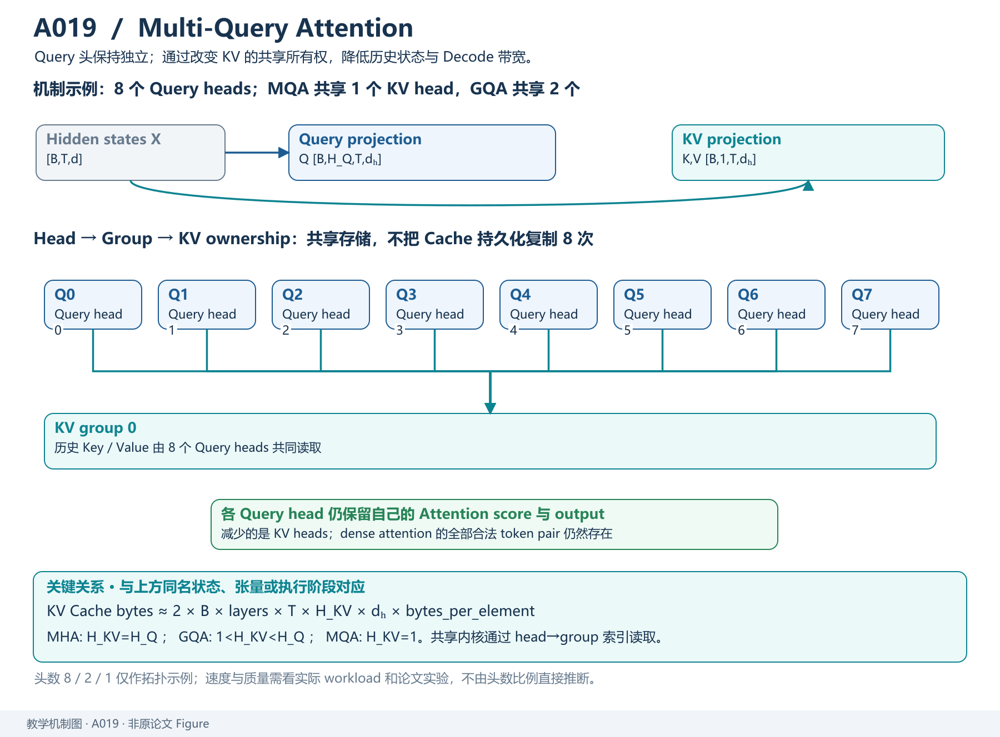
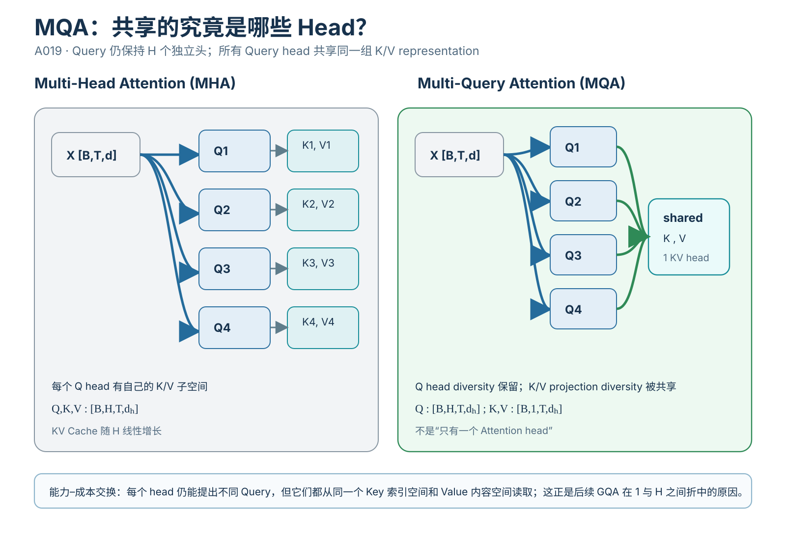
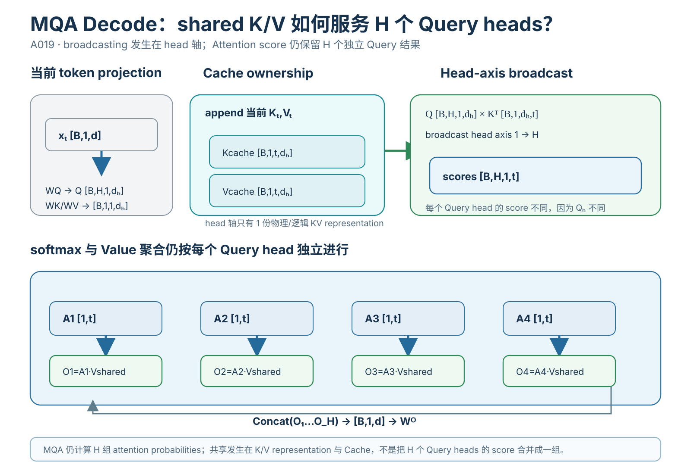
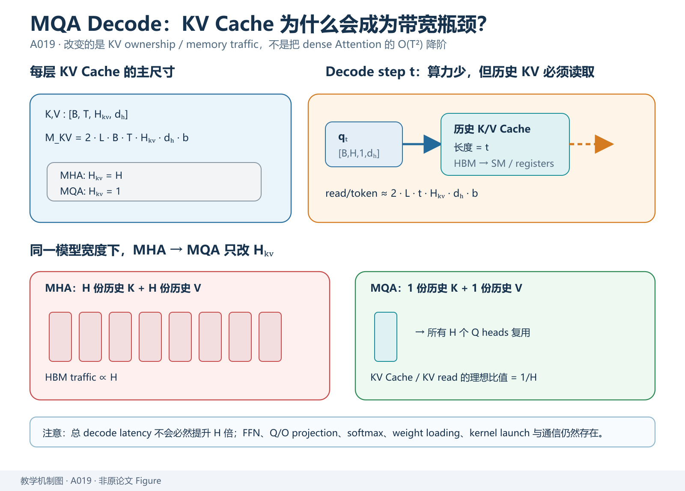

> **原文**：Noam Shazeer, *Fast Transformer Decoding: One Write-Head is All You Need*, 2019，[arXiv](https://arxiv.org/abs/1911.02150)。对应 Paperlist A/04 第 1 篇。本文提出 Multi-Query Attention（MQA）：**Query 仍保留多头，但所有 Query Head 共享同一组 Key/Value Head**。它主要针对 autoregressive incremental decoding 的 KV memory bandwidth，而不是把 Attention 的数学复杂度从二次降为线性。

# 模型定位与谱系

**主要类型：A 原始方法论文；次要属性：推理效率架构。**

技术谱系：

~~~text
Multi-Head Attention (MHA)
   ├─ H 个 Q heads
   ├─ H 个 K heads
   └─ H 个 V heads
          ↓
训练阶段：T 个 token 可并行
          ↓
自回归 Decode：
每生成 1 token
都要读取历史 K/V
          ↓
历史越长，KV 读取越大
GPU 算力没有吃满，HBM bandwidth 成瓶颈
          ↓
Multi-Query Attention
   ├─ H 个 Q heads
   ├─ 1 个 K head
   └─ 1 个 V head
          ↓
KV Cache 约缩小 H 倍
历史 KV bandwidth 约缩小 H 倍
          ↓
后续 GQA：
1 < H_KV < H_Q
在质量和速度之间折中
~~~

论文摘要明确指出，增量推理慢的重要原因是反复加载巨大的 Key/Value tensor；MQA 让所有 query head 共享 K/V，显著降低这些张量大小和 memory bandwidth，同时只带来较小质量下降。citeturn319775academia1

技术树：

~~~text
Transformer
└── Attention
    └── Attention Head Structure
        ├── MHA
        ├── MQA
        └── GQA
~~~

*教学解释图｜保留多组 Query heads，同时共享 K/V 状态，以牺牲较少表达自由度换取 decode cache 与带宽下降。*

# 输入、输出与任务

输入：

$$
X\in\mathbb R^{B\times T\times d_{\rm model}}.
$$

设：

- Query head 数：`H`；
- 每 head 维度：`d_h`；
- 通常 `d_{\rm model}=Hd_h`。

## MHA

$$
Q\in\mathbb R^{B\times H\times T\times d_h},
$$

$$
K\in\mathbb R^{B\times H\times T\times d_h},
$$

$$
V\in\mathbb R^{B\times H\times T\times d_h}.
$$

## MQA

Query 不变：

$$
Q\in\mathbb R^{B\times H\times T\times d_h}.
$$

Key / Value：

$$
K,V
\in
\mathbb R^{B\times1\times T\times d_h}.
$$

计算第 `h` 个 Query head：

$$
A_h
=
\operatorname{softmax}
\left(
\frac{Q_hK^\top}{\sqrt{d_h}}
\right),
$$

$$
O_h=A_hV.
$$

所有 `h` 使用同一个 `K,V`。

输出拼接：

$$
O=
\operatorname{Concat}(O_1,\ldots,O_H)
\in\mathbb R^{B\times T\times d_{\rm model}}.
$$

# 骨干架构与信息交互

## MHA

~~~text
X
 ├─ Wq1 → Q1 ─┐
 ├─ Wq2 → Q2 ─┤
 ├─ ...        ├─ each attends to its own Ki,Vi
 ├─ Wk1 → K1  │
 ├─ Wk2 → K2  │
 ├─ Wv1 → V1  │
 └─ Wv2 → V2  │
               ↓
         concat heads
~~~

*教学解释图｜MHA vs. MQA Head Sharing。*

## MQA

~~~text
X
 ├─ Wq1 → Q1 ─┐
 ├─ Wq2 → Q2 ─┤
 ├─ ...        ├────┐
 └─ WqH → QH ─┘    │
                    │
X ── Wk → shared K ├─ all Q heads attend
X ── Wv → shared V ┘
                    ↓
              concat H outputs
~~~

删除的是 K/V 的**head-specific projection diversity**，而不是 Q head diversity。

# 关键技术

## 1. 为什么 Decode 与训练阶段的瓶颈不同

训练/Prefill 时：

*教学解释图｜Decode Broadcast Tensor Flow。*

$$
QK^\top
$$

包含大矩阵乘法，GPU 可以并行处理所有 `T` 个 query。

Decode 第 `t` 步只有一个新 query：

$$
q_t\in\mathbb R^{B\times H\times1\times d_h}.
$$

但需要和全部历史 key：

$$
K_{1:t}
\in
\mathbb R^{B\times H\times t\times d_h}
$$

计算：

$$
q_tK_{1:t}^\top.
$$

Arithmetic intensity 显著下降：新 query 很小，但每一步要从 HBM 读取很长的 K/V cache。

因此 Decode 常表现为：

~~~text
读大量历史 KV
       ↓
做相对少量 dot-product
       ↓
memory bandwidth bound
~~~

MQA 正针对这个瓶颈。

## 2. KV Cache 大小完整推导

设：

- 层数 `L`；
- batch `B`；
- sequence length `T`；
- KV head 数 `H_{kv}`；
- head dim `d_h`；
- 每元素 `b` bytes。

一层 K：

$$
B T H_{kv} d_h
$$

个元素。

V 同样：

$$
B T H_{kv} d_h.
$$

总共 `L` 层：

$$
N_{\rm KV}
=
2LBT H_{kv}d_h.
$$

字节：

$$
\boxed{
M_{\rm KV}
=
2LBT H_{kv}d_h b
}
$$

### MHA

$$
H_{kv}=H.
$$

### MQA

$$
H_{kv}=1.
$$

因此理想比值：

$$
\boxed{
\frac{M_{\rm MQA}}{M_{\rm MHA}}
=
\frac1H
}
$$

这不是“整个模型显存缩小 H 倍”，只是 KV Cache 这一项。

## 3. 具体 32 层例子

设：

$$
L=32,\quad
B=1,\quad
T=4096,
$$

$$
H=32,\quad
d_h=128,
$$

BF16：

$$
b=2\text{ bytes}.
$$

MHA：

$$
M_{\rm KV}
=
2(32)(1)(4096)(32)(128)(2).
$$

计算：

$$
4096\times32\times128
=
16,777,216.
$$

再乘：

$$
2\times32\times2=128.
$$

所以：

$$
M_{\rm KV}
=
2,147,483,648\text{ bytes}
\approx2\text{ GiB}.
$$

MQA：

$$
H_{kv}=1.
$$

$$
M_{\rm KV}
=
\frac{2\text{ GiB}}{32}
\approx64\text{ MiB}.
$$

这里非常直观：单请求 4K context 的 KV，从约 2 GiB 降到约 64 MiB。

如果 batch=32：

- MHA 约 64 GiB；
- MQA 约 2 GiB。

这就是服务场景 MQA 价值远高于“少几个 projection 参数”的原因。

## 4. 每个 Decode token 为什么也减少 HBM 读取

第 `t` 步，每层至少需要历史 K/V：

*教学解释图｜Decode KV Cache Bandwidth。*

$$
2tH_{kv}d_hb.
$$

跨 `L` 层：

$$
R_{\rm KV/token}
\approx
2LtH_{kv}d_hb.
$$

MHA→MQA：

$$
R
\to
\frac{R}{H}.
$$

在 bandwidth-bound 情况下，理论上 throughput 可显著改善。

但真实延迟还包括：

- Q projection；
- output projection；
- FFN；
- weight loading；
- softmax；
- kernel launch；
- communication。

所以不能说 Decode 总延迟一定精确提升 `H` 倍。

## 5. MQA 没有把 Attention 的 token 复杂度降阶

Prefill full attention：

$$
O(T^2d).
$$

MQA 仍然计算每个 Query head 对所有 token：

$$
H\times T\times T.
$$

因此 token 维复杂度仍是：

$$
O(T^2).
$$

Decode 每 token：

$$
O(Td)
$$

量级也没有变成 `O(1)`。

MQA 改的是：

- K/V projection 参数；
- K/V Cache；
- K/V HBM traffic；

不是稀疏化 attention matrix。

## 6. 为什么共享 K/V 可能损失质量

MHA 第 `h` 头拥有：

$$
W_h^K,\quad W_h^V.
$$

不同 head 可把输入投影到不同 key/value 子空间。

MQA 强制：

$$
W_1^K=\cdots=W_H^K=W^K,
$$

$$
W_1^V=\cdots=W_H^V=W^V.
$$

Q head 仍不同：

$$
W_h^Q.
$$

因此每个 head 可以提出不同“问题”，但所有 head 都从同一套 key/value representation 检索。

直觉：

~~~text
MHA:
每个专家拥有自己的索引 + 自己的内容表示

MQA:
每个专家有自己的 query
但共用一个索引库和 value 库
~~~

这减少表示容量，因此可能造成质量下降。后续 GQA 就是用多个共享组折中。

## 7. MHA 参数量与 MQA 参数量

仅看 QKV projection。

MHA：

$$
W_Q,W_K,W_V
\in\mathbb R^{d\times d}.
$$

参数：

$$
3d^2.
$$

MQA 的 Q：

$$
W_Q\in\mathbb R^{d\times d}.
$$

共享 K/V：

$$
W_K,W_V
\in
\mathbb R^{d\times d_h}.
$$

参数：

$$
d^2+2dd_h.
$$

因为：

$$
d=Hd_h,
$$

所以：

$$
2dd_h
=
\frac{2d^2}{H}.
$$

总：

$$
d^2\left(1+\frac2H\right).
$$

若 `H=32`：

$$
1+\frac{2}{32}
=
1.0625.
$$

MHA QKV 是：

$$
3d^2.
$$

所以 QKV projection 参数约从 3 份降到 1.0625 份。

但整个 Transformer 大量参数在 FFN，因此整模型参数不会降 3 倍。

## 8. 最小 PyTorch：真正只共享 K/V

~~~python
import torch
from torch import nn
import math

class MultiQueryAttention(nn.Module):
    def __init__(self, d_model, num_heads):
        super().__init__()
        assert d_model % num_heads == 0

        self.h = num_heads
        self.dh = d_model // num_heads

        self.wq = nn.Linear(
            d_model,
            num_heads * self.dh,
            bias=False
        )

        self.wk = nn.Linear(
            d_model,
            self.dh,
            bias=False
        )

        self.wv = nn.Linear(
            d_model,
            self.dh,
            bias=False
        )

        self.wo = nn.Linear(
            d_model,
            d_model,
            bias=False
        )

    def forward(self, x):
        B, T, D = x.shape

        q = self.wq(x).view(
            B, T, self.h, self.dh
        ).transpose(1, 2)                # [B,H,T,dh]

        k = self.wk(x).unsqueeze(1)     # [B,1,T,dh]
        v = self.wv(x).unsqueeze(1)     # [B,1,T,dh]

        scores = (
            q @ k.transpose(-1, -2)
        ) / math.sqrt(self.dh)           # broadcast → [B,H,T,T]

        mask = torch.triu(
            torch.ones(
                T, T,
                dtype=torch.bool,
                device=x.device
            ),
            diagonal=1
        )

        scores = scores.masked_fill(
            mask[None, None],
            float("-inf")
        )

        attn = torch.softmax(
            scores,
            dim=-1
        )

        out = attn @ v                   # broadcast → [B,H,T,dh]

        out = out.transpose(
            1, 2
        ).contiguous().view(B, T, D)

        return self.wo(out)

m = MultiQueryAttention(
    d_model=128,
    num_heads=8
)

x = torch.randn(2, 16, 128)
y = m(x)

assert y.shape == x.shape
~~~

关键不是代码行数，而是 Shape：

$$
Q:[B,8,T,16]
$$

$$
K,V:[B,1,T,16]
$$

矩阵乘时 batch broadcasting 让同一个 K/V 被 8 个 Query head 使用。

## 9. 原文实验的证据边界

论文在 Transformer 语言/翻译等设置中比较 MHA 与 MQA，核心观察是：

- incremental decoding 明显加速；
- KV memory bandwidth 显著下降；
- 质量相对 baseline 只有小幅退化。citeturn319775academia1

真正因果链：

~~~text
共享 K/V
 → Cache/读取量下降
 → bandwidth pressure 下降
 → decode throughput 提高
~~~

但“只轻微掉点”不是所有任务都保证。不同规模、训练策略、head 数与数据都会影响质量差异。

# 预训练与后训练

MQA 是**架构改动**，不是新的训练目标。

语言模型仍：

$$
L=
-\sum_t
\log p_\theta(x_t\mid x_{<t}).
$$

如果从头训练 MQA：

~~~text
tokens
 → MQA Transformer
 → logits
 → next-token CE
~~~

如果已有 MHA checkpoint，直接把 K/V head 强行合并并不保证性能保持；后续 GQA 论文专门提出 uptraining recipe。

MQA 与：

- SFT；
- RLHF；
- DPO；
- LoRA

均属于不同层级。

# 推理与部署

## Prefill

MQA 能减少 K/V projection 与 KV 写入，但 dense attention score 仍是：

$$
[B,H,T,T].
$$

所以 Prefill 仍可能被 Attention FLOPs/HBM 主导。

## Decode

这是 MQA 最大收益点：

~~~text
new token
 ↓
H query heads
 ↓
1 shared K/V history
 ↓
H attention outputs
~~~

KV Cache：

$$
[B,L,1,T,d_h]
$$

而不是：

$$
[B,L,H,T,d_h].
$$

## Batch 服务

如果显存上限固定，KV 缩小可让：

- batch 更大；
- context 更长；
- 并发 request 更多。

这可能让 throughput 收益比单请求 latency 收益更显著。

## 技术 → 模型

- MHA → MQA：`DERIVED_FROM`
- MQA → 本文：`PROPOSES`
- MQA → PaLM 等后续模型：`ADOPTS`
- MQA → GQA：`GENERALIZED_BY / EXTENDS`，GQA 令 KV heads 从 1 增至中间值

## 模型 → 技术

- 原始 Transformer：`ADOPTS` MHA
- MQA Transformer：`IMPLEMENTS` H Query heads + 1 KV head
- GQA Transformer：`DERIVED_FROM` MHA/MQA 两个端点之间
- 使用 PagedAttention 的 serving system：可以服务 MQA，但 PagedAttention 不等于 MQA

**验收：** 能否从 `2LBT H_{kv}d_hb` 手算 KV Cache，解释为什么 MQA 的主要收益是 Decode HBM bandwidth，而不是把 `O(T^2)` Attention 降阶。
