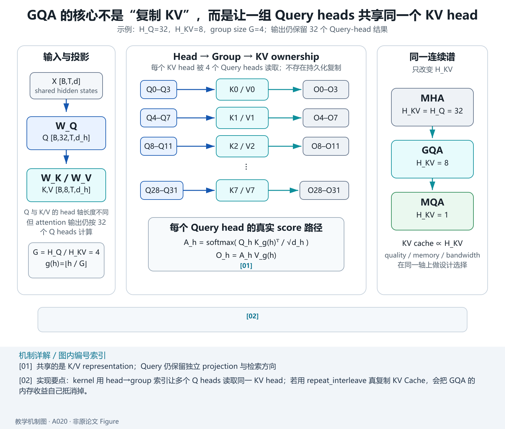
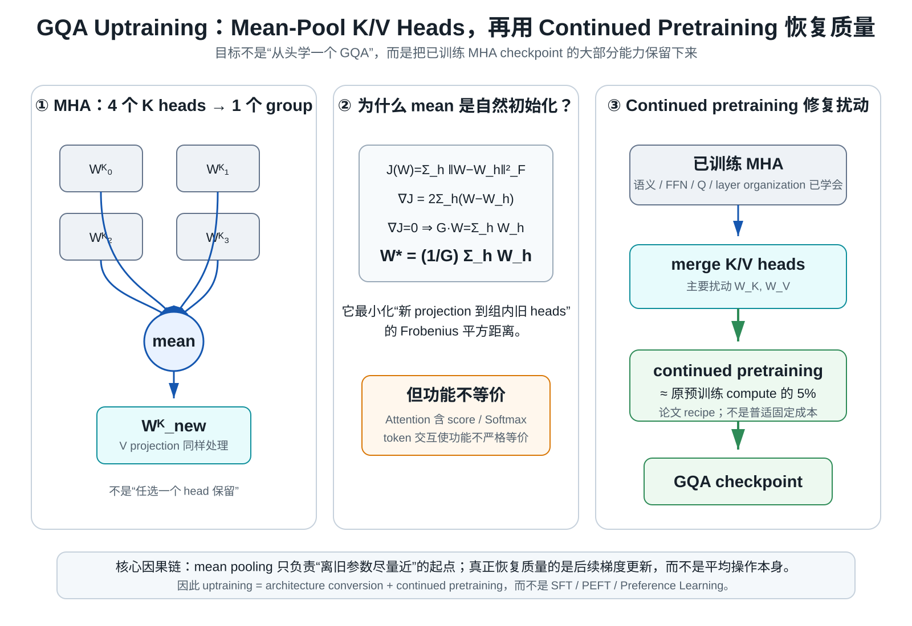
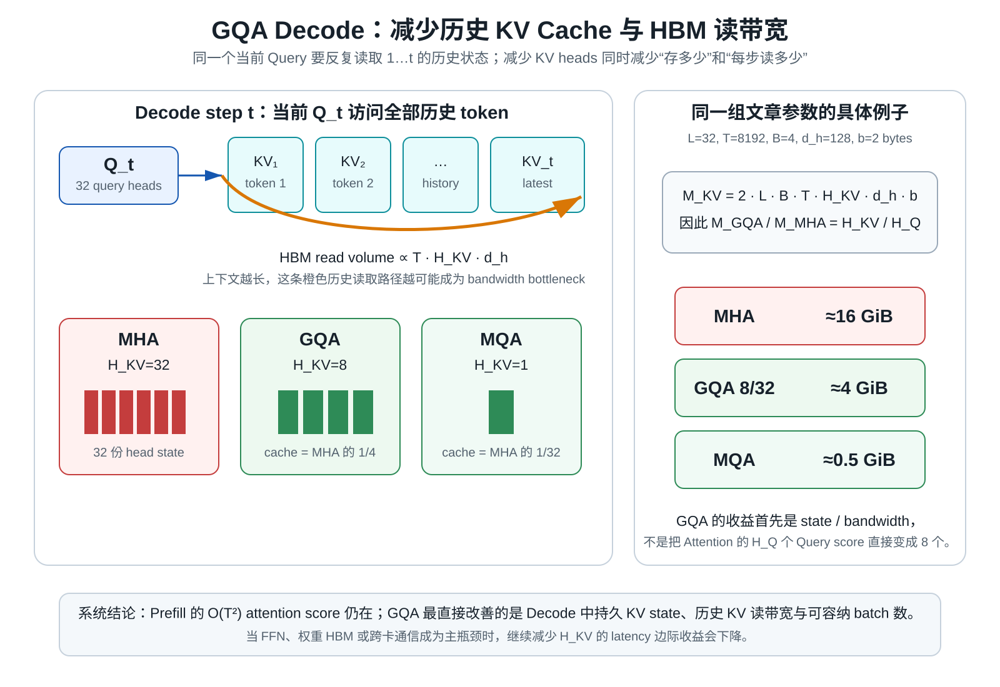

> **原文**：Joshua Ainslie 等，*GQA: Training Generalized Multi-Query Transformer Models from Multi-Head Checkpoints*, 2023，[arXiv](https://arxiv.org/abs/2305.13245)。对应 Paperlist A/04 第 2 篇。本文提出 Grouped-Query Attention（GQA）以及从已有 MHA checkpoint 进行 uptraining 的方案。GQA 的核心关系：`H_Q` 个 Query heads 被划成 `H_{KV}` 组，每组共享一个 Key/Value head。

# 模型定位与谱系

**主要类型：A 原始方法论文。**

技术谱系：

~~~text
MHA
H_Q = H_KV
优点：每个 head 都有独立 K/V
缺点：Decode KV Cache / bandwidth 大
        ↓
MQA
H_KV = 1
优点：最省 KV
缺点：共享过强，可能掉质量
        ↓
GQA
1 < H_KV < H_Q
每组 Query 共享 K/V
        ↓
接近 MHA 质量
接近 MQA 速度
~~~

论文还解决一个现实问题：

> 已经有一个昂贵训练完成的 MHA 模型，难道为了 GQA 必须从头预训练一次？

答案是 uptraining：把多个 MHA K/V head 聚合成较少的 GQA head，再用约原预训练 5% 的 compute 继续训练恢复性能。论文摘要明确给出这一设计与实验结论。citeturn319775academia3

技术树：

~~~text
Transformer
└── Attention
    └── KV Head Sharing
        ├── MHA: H_KV = H_Q
        ├── GQA: 1 < H_KV < H_Q
        └── MQA: H_KV = 1
~~~

所以 MHA、GQA、MQA 应看成一个连续家族，而不是三个互不相关机制。

# 输入、输出与任务

设：

$$
H_Q=32,
$$

$$
H_{KV}=8.
$$

每组 Query 数：

$$
G
=
\frac{H_Q}{H_{KV}}
=
4.
$$

输入：

$$
X\in\mathbb R^{B\times T\times d}.
$$

Query：

$$
Q\in
\mathbb R^{B\times32\times T\times d_h}.
$$

Key/Value：

$$
K,V\in
\mathbb R^{B\times8\times T\times d_h}.
$$

映射：

~~~text
Q head  0–3   → KV head 0
Q head  4–7   → KV head 1
Q head  8–11  → KV head 2
...
Q head 28–31  → KV head 7
~~~

公式：

$$
g(h)
=
\left\lfloor
\frac{h}{G}
\right\rfloor.
$$

第 `h` 个 Query head：

$$
A_h
=
\operatorname{softmax}
\left(
\frac{
Q_hK_{g(h)}^\top
}{
\sqrt{d_h}
}
\right),
$$

$$
O_h
=
A_hV_{g(h)}.
$$

# 骨干架构与信息交互

~~~mermaid
flowchart TD
  X["X"] --> Q["32 Q heads"]
  X --> K["8 K heads"]
  X --> V["8 V heads"]

  Q --> G0["Q0-Q3"]
  Q --> G1["Q4-Q7"]
  Q --> G2["..."]

  K --> KV0["K0"]
  V --> VV0["V0"]

  K --> KV1["K1"]
  V --> VV1["V1"]

  G0 --> A0["Attention group 0"]
  KV0 --> A0
  VV0 --> A0

  G1 --> A1["Attention group 1"]
  KV1 --> A1
  VV1 --> A1
~~~

它仍然输出 `H_Q` 个 head，最后 concat，因此：

$$
O\in\mathbb R^{B\times T\times d}.
$$

# 关键技术

## 1. 统一公式：MHA、GQA、MQA 只是 H_KV 不同

令：

$$
H_Q=H.
$$

则：

### MHA

$$
H_{KV}=H.
$$

每组：

$$
G=1.
$$

### GQA

$$
1<H_{KV}<H.
$$

每组：

$$
G=\frac{H}{H_{KV}}.
$$

### MQA

$$
H_{KV}=1.
$$

每组：

$$
G=H.
$$

统一 KV Cache：

$$
M_{\rm KV}
=
2LBT H_{KV}d_hb.
$$

因此：

$$
\frac{
M_{\rm GQA}
}{
M_{\rm MHA}
}
=
\frac{
H_{KV}
}{
H_Q
}.
$$

例如：

$$
H_Q=32,\quad H_{KV}=8.
$$

则：

$$
M_{\rm GQA}
=
\frac14M_{\rm MHA}.
$$

MQA：

$$
M_{\rm MQA}
=
\frac1{32}M_{\rm MHA}.
$$

所以 GQA 并不是追求极限最小 KV，而是找到中间点。

## 2. 为什么多个 Query 共享 K/V 仍有表达能力

第 `h` 个 Query：

*教学解释图｜Head Sharing Topology。*

$$
q_h=xW_h^Q.
$$

即使共享：

$$
K_g,V_g,
$$

不同 Query 仍有不同方向：

$$
q_1\ne q_2\ne q_3.
$$

Attention score：

$$
q_hK_g^\top.
$$

因此同一个 K database 上，不同 query head 可以检索不同 token pattern。

类比：

~~~text
共享搜索索引
但每个 query 的检索向量不同
~~~

比 MQA 更强的地方是：不同 Query group 还有不同：

$$
K_g,V_g.
$$

所以可以同时保留多个“索引/内容子空间”。

## 3. 为什么不能随便删 K/V heads

假设原 MHA：

$$
K_1,K_2,K_3,K_4.
$$

希望压成一个：

$$
\bar K.
$$

最粗暴做法：

~~~text
只保留 K1
删除 K2,K3,K4
~~~

会完全丢失其余 head 已训练出的 projection。

GQA 论文的 uptraining 初始化思想是对同组 K/V projection 做 mean pooling。

例如：

$$
W^K_{\rm new}
=
\frac1G
\sum_{h\in group}
W_h^K.
$$

Value 同理：

$$
W^V_{\rm new}
=
\frac1G
\sum_{h\in group}
W_h^V.
$$

为什么平均是自然起点？它在参数空间中最小化：

$$
\sum_{h\in group}
\|
W-W_h
\|_F^2.
$$

证明：

定义：

$$
J(W)
=
\sum_h
\|W-W_h\|_F^2.
$$

梯度：

$$
\nabla_WJ
=
2\sum_h(W-W_h).
$$

令 0：

$$
G W
=
\sum_hW_h.
$$

所以：

$$
\boxed{
W^\*
=
\frac1G\sum_hW_h
}
$$

它是同组权重的最小平方误差代表。

这不保证平均后功能完全等价，因为 attention 是非线性 Softmax；因此还需要继续训练。

## 4. 为什么只用约 5% 原预训练 compute 就能 uptrain

MHA checkpoint 已经学会：

*教学解释图｜Uptraining Mean Pooling。*

- token semantics；
- FFN；
- attention query features；
- layer organization；
- language knowledge。

GQA conversion 只主要扰动：

$$
W_K,W_V.
$$

因此不是：

~~~text
random initialization
 → learn language from zero
~~~

而是：

~~~text
trained MHA
 → merge K/V heads
 → local architecture perturbation
 → continued pretraining
 → recover / adapt
~~~

论文实验使用约原训练 5% compute 做这种 uptraining，并显示 GQA 可获得接近 MHA 的质量与接近 MQA 的速度。citeturn319775academia3

5% 是论文 recipe，不是所有 checkpoint 的固定恢复成本。

## 5. GQA 的参数量推导

Q projection：

$$
W_Q:
d
\to
H_Qd_h=d.
$$

参数：

$$
d^2.
$$

K：

$$
W_K:
d
\to
H_{KV}d_h.
$$

参数：

$$
dH_{KV}d_h.
$$

因为：

$$
d=H_Qd_h,
$$

所以：

$$
dH_{KV}d_h
=
d^2
\frac{H_{KV}}{H_Q}.
$$

V 同样。

QKV 总：

$$
\boxed{
d^2
\left(
1+
2\frac{H_{KV}}{H_Q}
\right)
}
$$

### MHA

$$
H_{KV}=H_Q:
\quad
3d^2.
$$

### GQA 8/32

$$
d^2(1+2\times0.25)
=
1.5d^2.
$$

### MQA

$$
d^2
\left(
1+\frac2{H_Q}
\right).
$$

GQA 正好处于中间。

## 6. 具体 KV 数字

设：

*教学解释图｜KV Cache Decode Bandwidth。*

$$
L=32,\quad
T=8192,\quad
B=4,
$$

$$
H_Q=32,\quad
d_h=128,\quad
b=2.
$$

MHA：

$$
M
=
2(32)(4)(8192)(32)(128)(2).
$$

约：

$$
16\text{ GiB}.
$$

GQA：

$$
H_{KV}=8.
$$

约：

$$
4\text{ GiB}.
$$

MQA：

$$
H_{KV}=1.
$$

约：

$$
0.5\text{ GiB}.
$$

因此同一张 GPU：

~~~text
MHA: 可能只能容纳少量请求
GQA: 可以显著增大 batch
MQA: KV 最省，但质量约束更强
~~~

## 7. 最小 PyTorch GQA

~~~python
import torch
from torch import nn
import math

class GQA(nn.Module):
    def __init__(
        self,
        d_model,
        q_heads,
        kv_heads
    ):
        super().__init__()

        assert d_model % q_heads == 0
        assert q_heads % kv_heads == 0

        self.hq = q_heads
        self.hkv = kv_heads
        self.group = q_heads // kv_heads
        self.dh = d_model // q_heads

        self.wq = nn.Linear(
            d_model,
            q_heads * self.dh,
            bias=False
        )

        self.wk = nn.Linear(
            d_model,
            kv_heads * self.dh,
            bias=False
        )

        self.wv = nn.Linear(
            d_model,
            kv_heads * self.dh,
            bias=False
        )

        self.wo = nn.Linear(
            d_model,
            d_model,
            bias=False
        )

    def forward(self, x):
        B, T, D = x.shape

        q = self.wq(x).view(
            B, T, self.hq, self.dh
        ).transpose(1, 2)

        k = self.wk(x).view(
            B, T, self.hkv, self.dh
        ).transpose(1, 2)

        v = self.wv(x).view(
            B, T, self.hkv, self.dh
        ).transpose(1, 2)

        k = k.repeat_interleave(
            self.group,
            dim=1
        )

        v = v.repeat_interleave(
            self.group,
            dim=1
        )

        scores = (
            q @ k.transpose(-1, -2)
        ) / math.sqrt(self.dh)

        mask = torch.triu(
            torch.ones(
                T, T,
                dtype=torch.bool,
                device=x.device
            ),
            diagonal=1
        )

        scores = scores.masked_fill(
            mask[None, None],
            float("-inf")
        )

        attn = torch.softmax(
            scores,
            dim=-1
        )

        out = attn @ v

        out = out.transpose(
            1, 2
        ).contiguous().view(B, T, D)

        return self.wo(out)

m = GQA(
    d_model=128,
    q_heads=8,
    kv_heads=2
)

x = torch.randn(2, 16, 128)
y = m(x)

assert y.shape == x.shape
~~~

教学代码用 `repeat_interleave` 让 K/V 显式复制成 Query head 数，便于看懂 Shape：

$$
[B,2,T,16]
\to
[B,8,T,16].
$$

**生产实现不应真的复制 KV Cache。** Kernel 应通过 head→group 索引让多个 query head 读取同一个 K/V head，否则内存优势会被自己复制掉。

## 8. GQA 的真正质量—速度连续谱

令 ratio：

$$
r=
\frac{H_{KV}}{H_Q}.
$$

那么：

$$
0<r\le1.
$$

MHA：

$$
r=1.
$$

MQA：

$$
r=\frac1{H_Q}.
$$

GQA 在中间。

近似有：

$$
M_{\rm KV}\propto r.
$$

而表示容量通常随 `H_{KV}` 增大而提升，但不是简单线性函数。

因此架构设计不是“GQA 永远最好”，而是：

~~~text
quality target
+
serving memory
+
latency
+
head dimension
+
training budget
   ↓
choose H_KV
~~~

## 9. 实验结果如何读

论文比较：

- MHA；
- MQA；
- GQA；
- 从 MHA checkpoint uptraining 的不同变体。

主要结论：

- MQA Decode 快但质量可能下降；
- GQA uptraining 后质量接近 MHA；
- inference speed 可接近 MQA；
- 无需从头训练，约 5% 原预训练 compute 可完成转换。citeturn319775academia3

不能把“接近 MQA speed”理解成所有硬件上 latency 相等；当 FFN、weight bandwidth、通信成为主瓶颈时，KV head 减少的边际收益会下降。

# 预训练与后训练

GQA 论文最重要的训练创新之一就是 **uptraining**。

~~~text
MHA checkpoint
     ↓
按 group mean-pool K/V projection
     ↓
GQA initialization
     ↓
continued pretraining
     ↓
GQA model
~~~

训练目标仍为语言模型 CE。

这属于：

$$
\text{architecture conversion}
+
\text{continued pretraining}
$$

不是 SFT、PEFT 或 Preference Learning。

如果用 LoRA 修复转换后的 K/V，也属于额外 PEFT 方案，不是论文核心 recipe。

# 推理与部署

GQA 的系统意义集中在 Decode。

KV Cache：

$$
2LBT H_{KV}d_hb.
$$

减小 `H_{KV}` 可：

- 降低单请求显存；
- 降低历史 KV read bandwidth；
- 提高 continuous batching 容量；
- 支持更长 context。

但：

- Attention score 仍有 `H_Q` 个 Query head；
- Prefill `O(T^2)` 不变；
- FFN FLOPs 不变；
- 参数 weight bandwidth 仍在。

## 技术 → 模型

- MHA → GQA：`DERIVED_FROM`
- MQA → GQA：`GENERALIZES`，GQA 包含 MQA 作为 `H_{KV}=1` 特例
- GQA → 本文：`PROPOSES`
- GQA → Llama 2 70B / Llama 3 等：后续 `ADOPTS`

## 模型 → 技术

- MHA Transformer：`IMPLEMENTS` `H_Q=H_{KV}`
- MQA Transformer：`IMPLEMENTS` `H_{KV}=1`
- GQA Transformer：`IMPLEMENTS` `1<H_{KV}<H_Q`
- GQA-uptrained checkpoint：`DERIVED_FROM` MHA checkpoint，`IMPLEMENTS` mean-pooled K/V initialization + continued pretraining

**验收：** 能否统一用 `H_Q,H_{KV}` 表示 MHA/GQA/MQA，证明 GQA KV Cache 比例为 `H_{KV}/H_Q`，再从 Frobenius least-squares 推导为什么 mean-pooling 是合并 K/V head 的自然初始化。
