# Dual Chunk Attention：不训练模型，怎样重新组织 RoPE 相对位置把 4K 扩到 32K+？

> **论文**：Chenxin An et al., [Training-Free Long-Context Scaling of Large Language Models](https://arxiv.org/abs/2402.17463)，ICML 2024。  
> **方法**：Dual Chunk Attention（DCA），开源实现常称 ChunkLlama。  
> **类型**：A · 原始方法论文；长上下文相对位置重映射 / Attention 组织方法。  
> **一句话定位**：DCA 不修改模型权重，也不把所有 RoPE frequency 统一缩放。它把长序列切成 chunk，并针对“同一 chunk、相邻 chunk、更早 chunk”分别构造三套 query position，使**所有参与 attention 的相对位置尽量停留在原预训练范围内，同时又保住 chunk 边界附近的局部距离精度**。

这篇最适合紧接 [YaRN](../03-transformer/A018-yarn.md)。

上一站我们已经拆清：

~~~text
RoPE
→ direct extrapolation OOD
→ Position Interpolation
→ NTK-aware
→ NTK-by-parts
→ YaRN
~~~

YaRN 的主要问题意识是：

> **RoPE frequency spectrum 应该怎样外推？**

DCA 换了一个观察角度：

> **既然 RoPE 最后进入 attention 的真正对象是 query-key 的相对位置，那么我们能不能不把整个 position axis 连续缩放，而是直接重新设计“不同 token pair 应该看到什么相对位置”？**

这就是 DCA。

它不是 YaRN 的替代品。在 [Qwen2.5](../../B/05-moe-complete-llm/B012-qwen2.5.md) 中，两者甚至被一起使用：

$$
\text{YaRN}+\text{DCA}.
$$

因此本文最重要的是把职责彻底分开：

- **YaRN**：RoPE frequency / position extrapolation；
- **DCA**：relative-position matrix 与跨 chunk attention relation；
- **MInference**：后续超长 prompt 的 prefill / TTFT runtime acceleration。

---

## 阅读导航

建议先掌握：

- [Transformer](../03-transformer/A013-transformer-attention-is-all-you-need.md)：标准 causal self-attention；
- [RoPE](../03-transformer/A014-roformer-rope.md)：为什么 $q_i^\top k_j$ 中位置只依赖相对距离；
- [YaRN](../03-transformer/A018-yarn.md)：PI / NTK / YaRN 如何修改 RoPE frequency；
- [Qwen2.5](../../B/05-moe-complete-llm/B012-qwen2.5.md)：DCA 在真实 128K / 1M pipeline 中的位置。

本文重点回答：

1. 为什么 DCA 从 relative-position matrix $M$ 而不是 RoPE frequency 开始？
2. 标准 RoPE 超出训练长度时，矩阵里究竟出现了什么“没见过的数”？
3. 为什么把长序列分 chunk 后，单纯循环 position id 仍然不够？
4. Intra-Chunk Attention 精确保留了什么？
5. 为什么跨 chunk 直接用循环 position id 会出现负相对位置？
6. Inter-Chunk 为什么把 query position 固定到 $c-1$？
7. 这样做为什么能把远距离关系压回训练范围？
8. Inter-Chunk 为什么会破坏相邻 chunk 边界的 locality？
9. Successive-Chunk 的 $w=c-s$ 从哪里来？
10. 三种 attention 怎样拼成一个 piecewise relative-position matrix？
11. 为什么 DCA 会故意牺牲远距离的精确位置分辨率？
12. DCA 是否仍然让 query 访问所有历史 token？
13. 三次 attention 为什么不能简单把三个 output 相加？
14. 怎样严格恢复一个全局 softmax？
15. FlashAttention 中应该保存什么统计量才能合并？
16. DCA 的复杂度是否真的从 $O(L^2)$ 降下来了？
17. 为什么论文仍能报告接近 FlashAttention 的速度与显存？
18. DCA 对 KV cache 有什么特殊要求？
19. ablation 为什么必须同时看 PPL 和 passkey？
20. “training-free”到底意味着什么、不意味着什么？
21. 为什么 DCA 可以和 PI / NTK / YaRN 叠加？
22. 4K pretrained → 100K+ evaluation 能证明什么，不能证明什么？
23. passkey retrieval 与 long-document reasoning 有什么证据边界？
24. Qwen2.5 为什么 YaRN 和 DCA 两个都要？
25. DCA 之后为什么还需要 MInference？

---

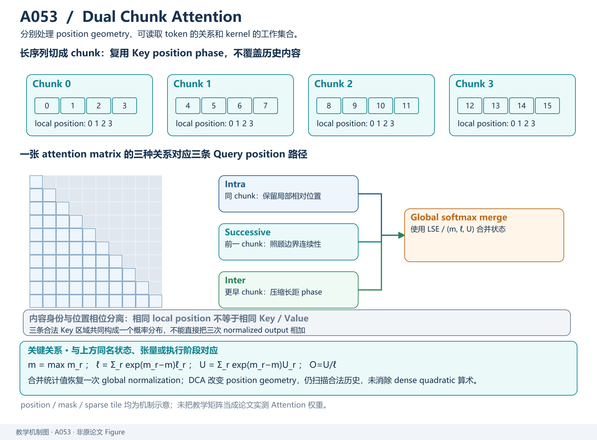

*教学解释图｜chunk 划分、三类相对位置关系与全局 softmax 归并共同构成 DCA 的位置重组织机制。*

# 一、先把问题从 RoPE frequency 换成 Relative-Position Matrix

## 1. 标准 RoPE 最终到底把什么交给 Attention？

标准 attention：

$$
A_{ij}
=
\frac{
q_i^\top k_j
}{
\sqrt d
}.
$$

RoPE 对 query / key 做位置旋转：

$$
q_i'
=
R(P_q[i])q_i,
$$

$$
k_j'
=
R(P_k[j])k_j.
$$

标准情况下：

$$
P_q[i]=P_k[i]=i.
$$

由 RoPE 的旋转性质：

$$
(R_iq_i)^\top(R_jk_j)
$$

只依赖：

$$
i-j.
$$

所以我们可以把整个 sequence 的相对位置关系写成一个矩阵：

$$
\boxed{
M[i][j]
=
P_q[i]-P_k[j].
}
$$

对于 causal attention，只关心：

$$
j\le i.
$$

这就是 DCA 整篇论文最重要的抽象。

---

## 2. 为什么把 RoPE 看成矩阵 $M$ 很有用？

假设 sequence length：

$$
l=6.
$$

标准 position：

$$
P=[0,1,2,3,4,5].
$$

对于最后一个 query：

$$
i=5,
$$

它看到历史 key 的相对距离：

$$
[5,4,3,2,1,0].
$$

整个 causal relative-position matrix 大致：

$$
M=
\begin{bmatrix}
0\\
1&0\\
2&1&0\\
3&2&1&0\\
4&3&2&1&0\\
5&4&3&2&1&0
\end{bmatrix}.
$$

如果模型预训练最大长度：

$$
c=6,
$$

它最多稳定见过的相对距离大致就是：

$$
0,1,\dots,c-1.
$$

因此 context extrapolation 可以重新表达成：

> **测试时 $M$ 是否出现了训练时没有出现过的 relative-position value？**

这比只说“position 超出 max length”更具体。

---

## 3. 原论文 Figure：标准 RoPE 超窗时发生什么？

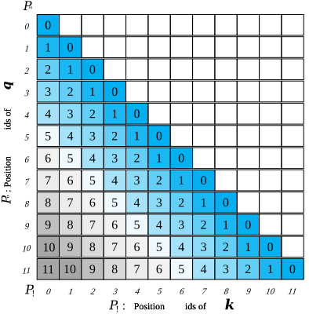

*原论文 Figure。示例把 pretraining window 设为 6，却输入长度 12。矩阵中的较大 relative offset 没有在训练阶段出现。图的作用是说明 DCA 的优化对象是 relative-position geometry，而不是简单把配置里的最大长度改大。*

假设：

$$
c=6,
\qquad
l=12.
$$

最后一个 query：

$$
i=11
$$

面对 key 0：

$$
M[11][0]
=
11.
$$

但训练阶段最大只到：

$$
5.
$$

因此：

$$
11
$$

是 out-of-training-range relative position。

---

## 4. 为什么“RoPE 是相对位置”仍然解决不了？

这和 [YaRN](../03-transformer/A018-yarn.md) 里的结论一致：

$$
\text{relative formulation}
\neq
\text{unlimited extrapolation}.
$$

模型训练时真正适应的是：

$$
M[i][j]\in[0,c-1]
$$

对应的一组 rotary phase / attention score statistics。

测试突然出现：

$$
M[i][j]\gg c
$$

时：

- sin/cos 当然还能计算；
- tensor shape 当然也合法；
- 但这些 phase combination 并没有被模型训练过。

所以问题仍然是 distribution shift。

---

# 二、已有方法：统一缩放 Relative Position

## 5. Position Interpolation 在矩阵 $M$ 视角下是什么？

PI 令：

$$
P_q[i]\rightarrow\frac{P_q[i]}{r},
$$

$$
P_k[j]\rightarrow\frac{P_k[j]}{r},
$$

其中：

$$
r=\frac{L'}{L}.
$$

于是：

$$
M[i][j]
\rightarrow
\frac{
P_q[i]-P_k[j]
}{
r
}.
$$

也就是整个 relative-position matrix 全局缩小。

例如：

$$
c=6,
\qquad
l=12,
\qquad
r=2.
$$

原来最大：

$$
M_{\max}=11.
$$

缩放后：

$$
M'_{\max}=5.5.
$$

重新落回训练附近。

---

## 6. DCA 为什么不满意“把所有距离一起缩小”？

因为它会同时压缩：

- 远距离；
- 中距离；
- 邻居距离。

例如原来两个相邻 token：

$$
\Delta=1.
$$

若 extension ratio：

$$
r=8,
$$

PI 后：

$$
\Delta'=0.125.
$$

虽然 RoPE 支持连续位置，但模型原本学到的 local pattern 被重新参数化了。

DCA 的设计目标更激进：

> **局部距离尽量保持原样，只有超出训练范围的远距离关系才做信息压缩。**

这和 YaRN “保护高频局部 position resolution”的动机在精神上非常接近，但技术实现完全不同。

---

# 三、DCA 第一层：先切 Chunk

## 7. 基本变量

定义：

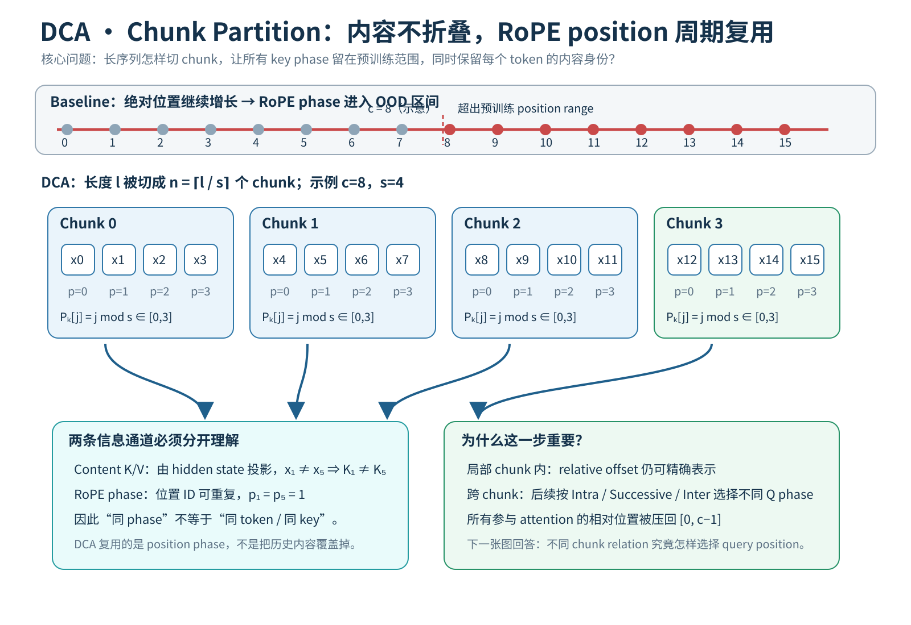

*教学解释图｜Chunk Partition。*

- $l$：当前输入长度；
- $c$：pretraining context length；
- $s$：chunk size；
- $w$：successive local window。

要求：

$$
s<c.
$$

长序列被分成：

$$
n
\approx
\left\lceil\frac ls\right\rceil
$$

个 chunks。

例如：

$$
l=12,
\qquad
c=8,
\qquad
s=4.
$$

则：

~~~text
Chunk 0:
token 0 1 2 3

Chunk 1:
token 4 5 6 7

Chunk 2:
token 8 9 10 11
~~~

---

## 8. Key position 为什么循环复用？

DCA 为 key 定义：

$$
\boxed{
P_k
=
[0,1,\dots,l-1]\bmod s.
}
$$

对于例子：

$$
P_k
=
[0,1,2,3,\,
0,1,2,3,\,
0,1,2,3].
$$

即每个 chunk 的 key position 都重新从 0 开始。

这一步很关键。

因为无论 sequence 多长：

$$
P_k[j]\in[0,s-1].
$$

只要：

$$
s<c,
$$

key 的 RoPE position 永远没有离开 pretraining range。

---

## 9. 但是这会不会把不同 chunk 的 token 混成同一个 key？

不会。

这里必须区分：

### Content vector

不同 token 有不同：

$$
k_j=W_kh_j.
$$

### RoPE positional phase

不同 chunk 的 key 可以复用同一个：

$$
P_k[j].
$$

例如：

~~~text
token 1:
content key = k₁
position id = 1

token 5:
content key = k₅
position id = 1

token 9:
content key = k₉
position id = 1
~~~

三者的 content vector 完全不同。

DCA alias 的只是：

> positional phase。

所以远距离 token 并没有被“合并成一个 KV”。

---

# 四、Intra-Chunk Attention：局部位置一个都不要丢

## 10. 同 chunk 的 query position

对 intra-chunk：

$$
\boxed{
P_q^{\text{Intra}}
=
P_k
=
[0,1,\dots,l-1]\bmod s.
}
$$

如果 query $i$ 与 key $j$ 在同一 chunk：

$$
\left\lfloor\frac is\right\rfloor
=
\left\lfloor\frac js\right\rfloor,
$$

则：

$$
\boxed{
M[i][j]
=
P_q^{\text{Intra}}[i]
-
P_k[j].
}
$$

---

## 11. 为什么这精确保留局部 relative distance？

设：

$$
i=qs+a,
$$

$$
j=qs+b,
$$

其中：

$$
0\le a,b<s.
$$

那么：

$$
P_q^{\text{Intra}}[i]=a,
$$

$$
P_k[j]=b.
$$

于是：

$$
M[i][j]
=
a-b.
$$

而真实 absolute relative distance：

$$
i-j
=
(qs+a)-(qs+b)
=
a-b.
$$

所以：

$$
\boxed{
M_{\text{Intra}}[i][j]
=
i-j.
}
$$

同一 chunk 内没有任何位置误差。

---

## 12. Intra-Chunk 最大 relative distance

由于：

$$
0\le a,b<s,
$$

causal 情况：

$$
0\le a-b\le s-1.
$$

因此：

$$
M_{\max}^{\text{Intra}}
=
s-1.
$$

又因为：

$$
s<c,
$$

所以：

$$
s-1<c.
$$

完全落在 pretraining relative-position range。

这就是 DCA 最干净的一部分。

---

## 13. 只用 Intra-Chunk 会发生什么？

如果每个 chunk 只看自己：

~~~text
Chunk 0 → Chunk 0
Chunk 1 → Chunk 1
Chunk 2 → Chunk 2
~~~

就变成一种 local / block attention。

优点：

- local language modeling 很稳定；
- relative position 完全熟悉；
- PPL 可以很低。

问题：

> 当前 chunk 根本不能使用很早 chunk 的信息。

例如 passkey 在 Chunk 0，问题在 Chunk 10：

如果只做 intra：

$$
\text{query in Chunk 10}
\nrightarrow
\text{key in Chunk 0}.
$$

retrieval 必然失败。

所以还需要跨 chunk attention。

---

# 五、为什么循环 Position ID 不能直接跨 Chunk？

## 14. 一个最直接的失败例子

假设：

$$
s=4.
$$

Chunk 0：

$$
P=[0,1,2,3].
$$

Chunk 1：

$$
P=[0,1,2,3].
$$

现在 query 是 Chunk 1 的第一个 token：

$$
i=4.
$$

它的循环 position：

$$
P_q^{\text{Intra}}[4]=0.
$$

看 Chunk 0 的 key：

$$
j=3,
\qquad
P_k[3]=3.
$$

相对位置：

$$
0-3=-3.
$$

但 causal sequence 中：

$$
i-j=1.
$$

也就是说：

> 明明 key 在 query 前面，position system 却告诉 RoPE 它在“未来 3 个单位”。

这显然破坏 causal relative-position geometry。

---

## 15. 为什么 DCA 保持 $P_k$ 不动，主要改 query position？

论文给出的工程考虑之一是：

> KV cache。

在 autoregressive decode 中，历史 key 已经被缓存。

如果每次当前 query 到来，都要求根据“它与哪个新 query 的关系”重新修改旧 key position，就会破坏 cache 的可复用性。

更自然的是：

- 历史 K：统一按一种 position scheme 缓存；
- 当前 q：针对不同 key group 生成不同 RoPE 版本。

因此 DCA 固定：

$$
P_k=[0,\dots]\bmod s,
$$

再构造：

- $P_q^{\text{Intra}}$；
- $P_q^{\text{Inter}}$；
- $P_q^{\text{Succ}}$。

---

# 六、Inter-Chunk Attention：远距离可以粗，但不能 OOD

## 16. 最简单的目标

对于很早的 chunk，我们至少希望：

1. query position 大于历史 key position；
2. relative offset 不超过原训练最大值；
3. 当前 query 仍然能看到那些 content K/V。

由于：

$$
P_k[j]\in[0,s-1],
$$

一个极其简单的选择是：

$$
\boxed{
P_q^{\text{Inter}}[i]
=
c-1.
}
$$

即所有 inter-chunk query 都使用 pretraining range 的最大 position。

---

## 17. Inter-Chunk relative distance

于是：

$$
\boxed{
M_{\text{Inter}}[i][j]
=
(c-1)-P_k[j].
}
$$

由于：

$$
0\le P_k[j]\le s-1,
$$

所以：

$$
c-s
\le
M_{\text{Inter}}[i][j]
\le
c-1.
$$

这给出一个非常漂亮的性质：

$$
\boxed{
M_{\text{Inter}}
\subseteq
[c-s,c-1].
}
$$

也就是说：

> 不管历史 key 距离当前 query 是 8K、80K 还是更远，它们在 RoPE relative position 上都被压进原训练窗口靠后的一个安全区间。

---

## 18. 这是一种什么信息压缩？

假设：

$$
c=8,
\qquad
s=4.
$$

则 inter relative positions 永远在：

$$
[4,7].
$$

例如两个历史 token：

~~~text
真实距离：
1001 tokens

真实距离：
10001 tokens
~~~

只要它们在非相邻旧 chunk，DCA 并不试图保留：

$$
1001
\neq
10001
$$

这种精确绝对差异。

它更像编码：

> “这是一个较远历史 token，它在自己 chunk 内的局部 phase 是多少。”

因此 DCA 对远距离位置做的是：

$$
\boxed{
\text{exact distance}
\rightarrow
\text{coarse safe-range positional class}.
}
$$

这是一种主动 positional aliasing。

---

## 19. 为什么这种 aliasing 仍可能有用？

因为 long-context task 并不总要求模型知道：

> 这个事实在 37,421 token 之前，还是 48,617 token 之前。

很多 retrieval / QA 任务真正需要的是：

1. content key 仍然可访问；
2. model 知道它来自较远历史；
3. 局部 token organization 不被破坏。

DCA 用：

- content K/V 保留语义；
- inter positional range 表示“远历史”；
- successive attention 保留边界局部结构。

于是换取：

> 在不训练新 position range 的前提下继续访问全局历史。

---

## 20. 一个必须保留的边界：DCA 没有保存精确远距离

所以不能说：

> “DCA 精确保留所有 relative positions。”

恰恰相反。

它的关键 trade-off 是：

$$
\boxed{
\text{local precision}
+
\text{global accessibility}
-
\text{exact far-distance resolution}.
}
$$

远 chunk 之间可能发生 position alias。

这是它 training-free extrapolation 的核心代价之一。

---

# 七、Inter-Chunk 还不够：相邻 Chunk 的 Locality 被毁了

## 21. 看 chunk 边界的两个相邻 token

论文例子：

$$
c=10,
\qquad
s=6.
$$

Chunk 0 最后一个 key：

$$
j=5,
\qquad
P_k[5]=5.
$$

Chunk 1 第一个 query：

$$
i=6.
$$

真实距离：

$$
i-j=1.
$$

但若用 inter query：

$$
P_q^{\text{Inter}}[6]
=
c-1
=
9.
$$

得到：

$$
M[6][5]
=
9-5
=
4.
$$

真实相邻：

$$
1
$$

被编码成：

$$
4.
$$

局部顺序精度丢了。

---

## 22. 为什么这会明显伤 PPL？

next-token prediction 高度依赖最近 token。

自然语言、代码、数学公式都有强烈 locality：

$$
p(x_t|x_{<t})
$$

中，最近：

$$
x_{t-1},x_{t-2},\dots
$$

通常影响很强。

如果 chunk boundary 恰好把：

~~~text
... "machine"
| chunk boundary |
"learning" ...
~~~

切开，而 attention 突然把真实距离 1 变成距离 4、10 或更远，模型原有的 local positional prior 被破坏。

因此：

> **跨 chunk 不能统一都当成“远距离”。**

相邻 chunk 必须单独处理。

---

# 八、Successive-Chunk Attention：专门修复 Chunk Boundary

## 23. 目标是什么？

对于 immediately previous chunk：

> 当前 query 的前几个位置，仍然应该精确看到上一 chunk 尾部的邻居关系。

因此引入：

$$
w
$$

作为 local window。

论文建议可以直接取：

$$
\boxed{
w=c-s.
}
$$

---

## 24. Successive query position

论文构造：

$$
\boxed{
P_q^{\text{Succ}}
=
[
s,
s+1,
\dots,
s+w-1,
c-1,
\dots,
c-1
].
}
$$

每个 chunk 使用相同 pattern。

例如：

$$
c=10,
\quad
s=6,
\quad
w=4.
$$

则：

$$
P_q^{\text{Succ}}
=
[6,7,8,9,9,9].
$$

当前 chunk 的前四个 query 使用：

$$
6,7,8,9,
$$

后面则饱和到：

$$
9=c-1.
$$

---

## 25. 为什么这样能恢复边界 locality？

看当前 chunk 第一个 query：

$$
P_q^{\text{Succ}}=s.
$$

上一 chunk 最后一个 key：

$$
P_k=s-1.
$$

所以：

$$
M
=
s-(s-1)
=
1.
$$

真实距离恰好也是：

$$
1.
$$

第二个 query：

$$
P_q=s+1.
$$

看上一 chunk 最后一个 key：

$$
M
=
(s+1)-(s-1)
=
2.
$$

真实跨边界距离也是：

$$
2.
$$

所以 successive scheme 在 boundary local window 内恢复真实 relative distance。

---

## 26. 为什么 $w\le c-s$？

Successive query 的最大精确 position：

$$
s+w-1.
$$

为了不超过 pretraining 最大 index：

$$
c-1,
$$

要求：

$$
s+w-1
\le
c-1.
$$

即：

$$
w\le c-s.
$$

若希望把可用训练位置范围全部利用起来，就取：

$$
\boxed{
w=c-s.
}
$$

这不是神秘经验值。

它直接来自：

> **在不超出原 position range 的条件下，能给相邻 chunk 保留多大的连续 local window。**

---

## 27. 三类 Query Position 的统一图

这也是为什么 DCA 不能简单写成：

> “给 position id 做个 modulo。”

真正的核心是：

$$
\boxed{
\text{pair type}
\rightarrow
\text{different query positional transform}.
}
$$

# 九、把三种 Attention 合成一个 Piecewise Relative-Position Matrix

## 28. 先定义 Chunk Index

对 absolute token index：

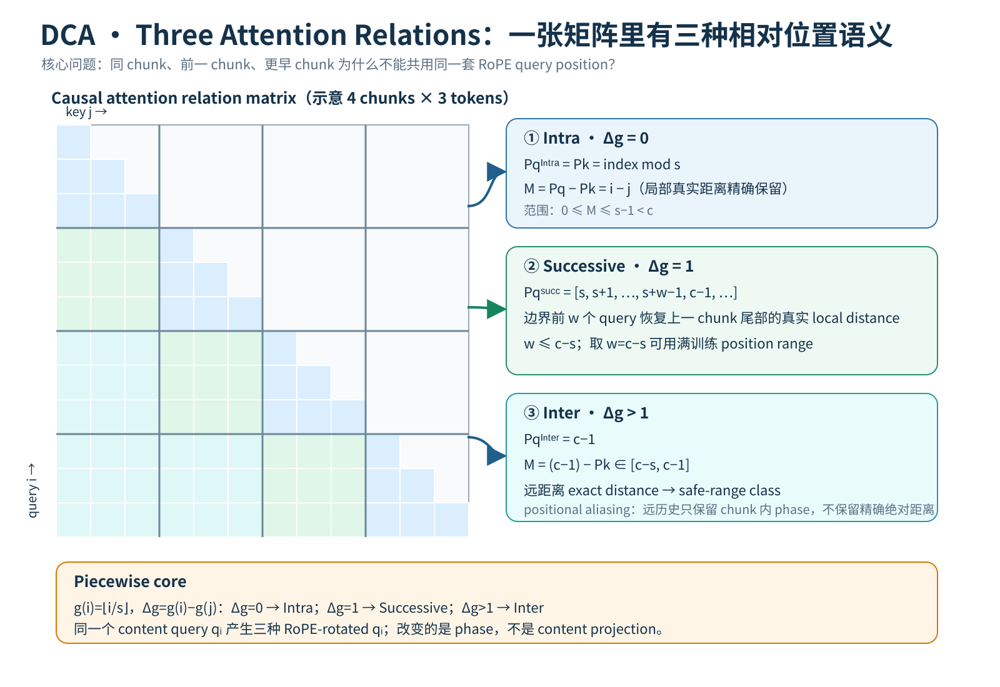

*教学解释图｜Three Attention Relations。*

$$
i,
$$

它属于：

$$
\boxed{
g(i)
=
\left\lfloor
\frac{i}{s}
\right\rfloor.
}
$$

query $i$ 与 key $j$ 的 chunk distance：

$$
\Delta g
=
g(i)-g(j).
$$

causal attention 中：

$$
\Delta g\ge0.
$$

于是 DCA 的三类关系可以直接写成：

### 同 chunk

$$
\Delta g=0.
$$

### 前一个 chunk

$$
\Delta g=1.
$$

### 更早 chunk

$$
\Delta g>1.
$$

---

## 29. DCA 的最终相对位置公式

于是：

$$
\boxed{
M[i][j]
=
\begin{cases}
P_q^{\text{Intra}}[i]-P_k[j],
&
\Delta g=0,
\\[6pt]
P_q^{\text{Succ}}[i]-P_k[j],
&
\Delta g=1,
\\[6pt]
P_q^{\text{Inter}}[i]-P_k[j],
&
\Delta g>1.
\end{cases}
}
$$

这就是整个 DCA 的数学核心。

注意：

> 它不是先算一个统一 $M$，再事后切 chunk。

而是：

> **pair 属于哪一类，决定该 query 使用哪一个 RoPE position。**

---

## 30. 对应的 QK 内积

定义 RoPE function：

$$
f(q,p)
$$

表示对 query $q$ 使用 position $p$ 做旋转。

那么：

$$
\boxed{
q_i^Tk_j
=
\begin{cases}
f(q_i,P_q^{\text{Intra}}[i])^T
f(k_j,P_k[j]),
&\Delta g=0,
\\[6pt]
f(q_i,P_q^{\text{Succ}}[i])^T
f(k_j,P_k[j]),
&\Delta g=1,
\\[6pt]
f(q_i,P_q^{\text{Inter}}[i])^T
f(k_j,P_k[j]),
&\Delta g>1.
\end{cases}
}
$$

所以同一个 hidden-state query：

$$
q_i
$$

会产生：

$$
q_i^{\text{Intra}},
\qquad
q_i^{\text{Succ}},
\qquad
q_i^{\text{Inter}}.
$$

这三个向量的 content projection 相同。

区别只来自：

> RoPE rotation phase。

---

## 31. 一个原论文公式阅读提醒

DCA 论文 Inter-Chunk 小节的一处文字公式写成类似：

$$
M
=
P_q^{\text{Intra}}-P_k
=
c-1-P_k.
$$

从上下文、定义与后面的完整 piecewise equation 看，左边这里显然应当是：

$$
\boxed{
P_q^{\text{Inter}}-P_k.
}
$$

因为：

$$
P_q^{\text{Inter}}=c-1.
$$

本文统一按论文完整定义与实现逻辑使用：

$$
M_{\text{Inter}}
=
P_q^{\text{Inter}}-P_k.
$$

这是读源码/论文时值得注意的一个局部记号问题。

---

## 32. 原论文的三块 Relative-Position Matrix

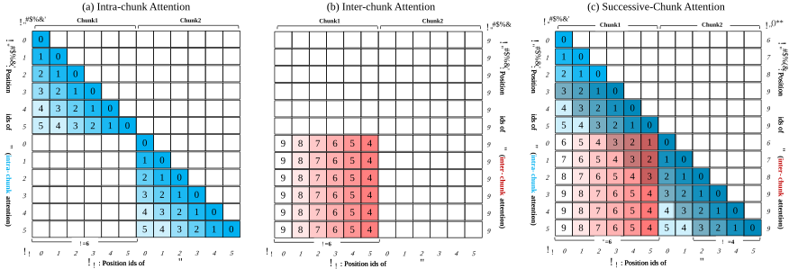

*原论文核心 Figure。它把同一条长 sequence 的 relative-position matrix 拆成 Intra、Inter、Successive 三个区域。真正应该观察的不是颜色，而是：最终填入矩阵的 relative offsets 都被限制在原训练 position range 内，同时相邻 chunk 的边界保留一块精确 local window。*

这张图就是整篇 DCA 的“电路图”。

如果能从图中自己解释：

- 对角 chunk block 为什么像普通 causal attention；
- 更早 chunk 为什么 position pattern 重复；
- successive block 为什么多出一条 local band；

就已经掌握了大半方法。

---

## 33. 为什么所有 DCA relative position 都不会超出原窗口？

分别证明。

### Intra

$$
0\le
M_{\text{Intra}}
\le
s-1.
$$

因为：

$$
s<c,
$$

所以：

$$
M_{\text{Intra}}\le c-1.
$$

### Inter

$$
c-s
\le
M_{\text{Inter}}
\le
c-1.
$$

自然：

$$
M_{\text{Inter}}\le c-1.
$$

### Successive

在 local part：

$$
P_q^{\text{Succ}}
\in[s,c-1].
$$

key：

$$
P_k\in[0,s-1].
$$

所以最大：

$$
(c-1)-0
=
c-1.
$$

最小 local causal offset仍为非负。

因此三个分支统一满足：

$$
\boxed{
0
\le
M[i][j]
\le
c-1.
}
$$

这就是 DCA “training-free” 的 position-level 核心：

> **不要求模型解释训练窗口之外的 RoPE relative offsets。**

---

## 34. DCA 与 Position Interpolation 最大区别

PI 做的是：

$$
\Delta
\rightarrow
\frac{\Delta}{r}.
$$

是一种连续 global compression。

DCA 做的是 piecewise remapping：

$$
\Delta
\rightarrow
\begin{cases}
\Delta,
&\text{local},
\\
\text{boundary-preserving map},
&\text{adjacent chunk},
\\
\text{coarse safe-range map},
&\text{far chunks}.
\end{cases}
$$

所以两者的信息策略完全不同。

### PI

> 所有距离都保留顺序关系，但 resolution 全局下降。

### DCA

> 局部距离尽量精确，远距离的精确 metric structure 被主动压缩。

这就是：

$$
\text{uniform resolution reduction}
$$

和：

$$
\text{non-uniform positional compression}
$$

的区别。

---

# 十、一个完整手算例子：$c=8,s=4,l=12$

## 35. Key Position

三个 chunk：

~~~text
Chunk 0: absolute 0 1 2 3
Chunk 1: absolute 4 5 6 7
Chunk 2: absolute 8 9 10 11
~~~

key position：

$$
P_k
=
[0,1,2,3,
0,1,2,3,
0,1,2,3].
$$

取当前 query：

$$
i=8.
$$

它是 Chunk 2 第一个 token。

---

## 36. 对 Current Chunk：Intra

current chunk keys：

$$
j=8.
$$

对于 query 8：

$$
P_q^{\text{Intra}}[8]
=
0.
$$

当前 self key：

$$
P_k[8]=0.
$$

所以：

$$
M[8][8]=0.
$$

后续 query 10 若看 key 8：

$$
P_q^{\text{Intra}}[10]=2,
$$

$$
P_k[8]=0.
$$

因此：

$$
M[10][8]=2.
$$

真实 absolute distance：

$$
10-8=2.
$$

完全一致。

---

## 37. 对 Previous Chunk：Successive

这里：

$$
w=c-s=4.
$$

所以：

$$
P_q^{\text{Succ}}
=
[4,5,6,7]
$$

循环到每个 chunk 的相对位置。

query 8 是新 chunk 第一个 token：

$$
P_q^{\text{Succ}}[8]=4.
$$

看上一 chunk 最后一个 key：

$$
j=7,
\qquad
P_k[7]=3.
$$

得到：

$$
M[8][7]
=
4-3
=
1.
$$

真实距离：

$$
8-7=1.
$$

再看 key 6：

$$
P_k[6]=2,
$$

所以：

$$
M[8][6]
=
4-2
=
2.
$$

真实距离：

$$
8-6=2.
$$

仍然精确。

---

## 38. 对更早 Chunk：Inter

query 8 看 Chunk 0。

inter query position：

$$
P_q^{\text{Inter}}[8]
=
c-1
=
7.
$$

Chunk 0 keys：

$$
P_k=[0,1,2,3].
$$

所以相对位置：

$$
[7,6,5,4].
$$

真实 absolute relative distances：

$$
[8,7,6,5].
$$

DCA 不是精确保留真实距离。

而是压缩成：

$$
[7,6,5,4]
\subset[0,7].
$$

如果 query 在 absolute 8000，仍然可能被压到同一个安全 relative-position pattern。

---

## 39. 因此远距离 Chunk Identity 从哪里来？

这是一个很好的问题。

在纯 positional encoding 层面：

> 不同旧 chunks 可能产生相同 position-id pattern。

例如 Chunk 0 和 Chunk 10 的某个相对位置 token 都可能使用：

$$
P_k=2.
$$

DCA 并没有额外编码：

$$
\text{chunk index}=0
$$

还是：

$$
10.
$$

区别主要仍来自：

- token content；
- hidden state；
- causal computation history；
- attention interaction。

所以 DCA 不是一个“精确 chunk address system”。

它是：

> **让模型继续能访问那些 content state，同时避免 position phase 超出训练范围。**

---

# 十一、最容易被忽略的实现问题：三次 Attention 不是三个独立 Softmax

## 40. 为什么需要分三次算？

对当前 query $q_i$，key 被分成三个 disjoint groups：

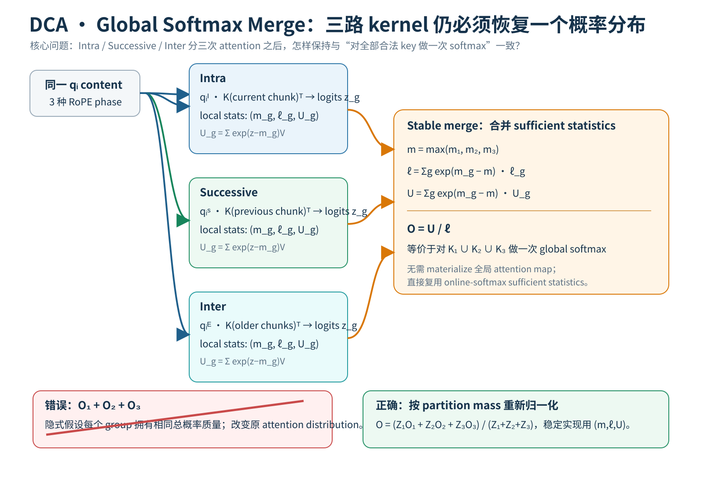

*教学解释图｜Global Softmax Merge。*

$$
\mathcal K_1
=
\text{current chunk},
$$

$$
\mathcal K_2
=
\text{previous chunk},
$$

$$
\mathcal K_3
=
\text{older chunks}.
$$

由于 query 在三个 group 使用不同 RoPE rotation：

$$
q_i^{(1)},
\quad
q_i^{(2)},
\quad
q_i^{(3)},
$$

所以不能简单一次标准 matmul 完成。

实现自然会变成三次 attention kernel。

---

## 41. 如果每组各做一次 Softmax，然后直接把 output 相加，会怎样？

标准 full attention：

$$
o
=
\frac{
\sum_j e^{z_j}v_j
}{
\sum_j e^{z_j}
}.
$$

把 keys 分组：

$$
\mathcal K
=
\mathcal K_1
\cup
\mathcal K_2
\cup
\mathcal K_3.
$$

每组局部 normalizer：

$$
Z_g
=
\sum_{j\in\mathcal K_g}
e^{z_j}.
$$

每组局部 output：

$$
o_g
=
\frac{
1
}{
Z_g
}
\sum_{j\in\mathcal K_g}
e^{z_j}v_j.
$$

如果直接：

$$
o_1+o_2+o_3,
$$

等于默认三个 group 各自拥有同等总概率质量。

但标准 global softmax 从来没有这个保证。

---

## 42. 正确的合并公式怎么推？

由：

$$
Z_go_g
=
\sum_{j\in\mathcal K_g}
e^{z_j}v_j.
$$

所以全体 numerator：

$$
\sum_j e^{z_j}v_j
=
\sum_g Z_go_g.
$$

全体 denominator：

$$
\sum_j e^{z_j}
=
\sum_g Z_g.
$$

因此：

$$
\boxed{
o
=
\frac{
Z_1o_1
+
Z_2o_2
+
Z_3o_3
}{
Z_1+Z_2+Z_3
}.
}
$$

这就是三个 attention group 恢复成一个 global attention distribution 的方式。

---

## 43. 实际实现为什么不能直接计算 $Z_g=\sum e^{z}$？

因为长序列 logits 可能很大。

直接 exponentiate 容易 overflow。

FlashAttention 使用 numerically stable online softmax。

每个 block / group 通常维护：

- maximum logit $m_g$；
- exp-sum / log-sum-exp statistic；
- normalized partial output。

如果 group $a,b$ 要合并，思想是先找到：

$$
m
=
\max(m_a,m_b),
$$

然后把两个 group 的 normalizer 都重新缩放到同一个 max 基准：

$$
l
=
e^{m_a-m}l_a
+
e^{m_b-m}l_b.
$$

output numerator 同理重标定。

所以工程上真正应该理解成：

> **合并 softmax sufficient statistics。**

而不是把完整 attention map materialize 出来再求和。

---

## 44. 为什么这和 FlashAttention 的 online softmax 天然兼容？

FlashAttention 本来就在做：

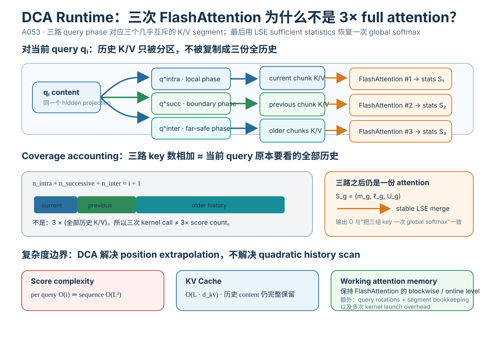

*教学解释图｜Flashattention Runtime。*

~~~text
一大块 K/V
    ↓
切成 tiles
    ↓
每块局部 max / exp-sum / output
    ↓
online merge
    ↓
exact global softmax
~~~

DCA 只是把分组边界从：

> hardware tiles

扩展成：

> semantic position groups。

因此三路 attention 结果也可以用相同的 log-sum-exp merge 思想恢复全局 normalization。

这就是论文声称与 FlashAttention 兼容的底层原因。

---

# 十二、DCA 与 FlashAttention 的实际组织

## 45. 对一个 query，三个 Key Segment 分别多大？

设当前 query absolute index：

$$
i.
$$

令：

$$
n
=
\left\lfloor
\frac{i}{s}
\right\rfloor.
$$

那么：

### Current chunk

大约：

$$
i-ns
$$

个 keys。

### Previous chunk

最多：

$$
s
$$

个 keys。

### Earlier chunks

大约：

$$
s(n-1)
$$

个 keys。

三者相加：

$$
(i-ns)
+
s
+
s(n-1).
$$

化简：

$$
=
i.
$$

量级上仍然是：

> 当前 query 看所有历史 keys。

---

## 46. 所以 DCA 是 Sparse Attention 吗？

不是。

这是一个必须明确的结论：

$$
\boxed{
\text{DCA is not primarily a sparsity method}.
}
$$

虽然它把 attention 分成 chunk-based calls，但总 key coverage 并没有像 Longformer / block sparse 那样大量丢弃历史 keys。

每个 query 仍然访问：

- current chunk；
- previous chunk；
- all earlier chunks。

所以 score count 量级仍是：

$$
O(i)
$$

per query。

整条 sequence：

$$
\sum_{i=1}^{L}O(i)
=
O(L^2).
$$

因此：

$$
\boxed{
\text{DCA does not solve quadratic attention complexity}.
}
$$

这也是 Qwen2.5 后面还需要 MInference 的原因。

---

## 47. 那为什么叫 Chunk Attention？

“chunk”在这里主要用于：

> **把 positional relation 分区。**

不是主要用于：

> 剪掉大多数 attention edge。

这是一个很容易被名字带偏的地方。

DCA 的本质更接近：

$$
\boxed{
\text{chunk-conditioned RoPE remapping}.
}
$$

---

## 48. 原论文 Appendix 给出的三次 FlashAttention 调用

论文伪代码大意：

~~~text
K = RoPE(K, P_k)

q_intra = RoPE(q, P_q_intra)
Flash(q_intra, current_chunk_KV)

q_succ = RoPE(q, P_q_succ)
Flash(q_succ, previous_chunk_KV)

q_inter = RoPE(q, P_q_inter)
Flash(q_inter, older_chunk_KV)

merge three partial softmax outputs
~~~

这个结构很适合工程实现。

因为历史 K 只需要：

$$
\text{RoPE}(K,P_k)
$$

一次。

三个分支主要多出的是：

> 当前 query 的三种旋转版本 + 三次 kernel dispatch / split。

---

## 49. 为什么 DCA 不需要重新旋转历史 K？

因为：

$$
P_k
=
\text{absolute index}\bmod s
$$

对每个历史 token 一旦确定，就不会再随未来 query 改变。

所以可以像普通 autoregressive inference 一样把 rotated K 缓存。

当新 query 到来，只生成：

$$
q^{\text{Intra}},
q^{\text{Succ}},
q^{\text{Inter}}.
$$

这是 DCA 能保持 KV cache 可用的关键设计。

---

## 50. DCA 的 KV Cache 代价是什么？

### 不需要

为每种关系缓存三份 K。

历史 key position scheme 是统一的。

### 仍然需要

完整历史 K/V content。

因为 Inter-Chunk 仍然访问早期所有 chunk。

所以 DCA 并没有解决 KV cache 总量：

$$
O(L).
$$

这和 MLA / KV compression 是完全不同的问题。

如果 context 到百万级：

> KV cache 仍然是巨大的系统对象。

---

# 十三、DCA 原论文 Figure：为什么三块 Matrix 缺一不可？

## 51. Intra 负责什么？

最小化 local language-modeling disturbance。

它保留：

$$
M=i-j
$$

within chunk。

因此：

> PPL 往往很好。

但没有 global retrieval。

---

## 52. Inter 负责什么？

恢复：

> 访问任意更早 chunk 的能力。

query 仍能和所有 older K 做 content matching。

所以 passkey / retrieval 才有可能成功。

代价：

> far position resolution 被压缩。

---

## 53. Successive 负责什么？

专门补：

> chunk boundary locality。

因为普通 Inter 会把上一 chunk 的最后一个邻居误编码成较大 relative distance。

Successive branch 恢复：

$$
1,2,3,\dots,w
$$

这种精确 local offsets。

---

## 54. 这三项其实构成一个 Pareto trade-off

可以把目标写成三个方向：

$$
\text{local fidelity},
$$

$$
\text{global access},
$$

$$
\text{position in-distribution}.
$$

普通 full RoPE 超窗：

- local fidelity：高；
- global access：高；
- in-distribution：差。

纯 local chunk：

- local fidelity：高；
- global access：差；
- in-distribution：高。

全局 PI：

- global access：高；
- in-distribution：较高；
- local fidelity：被整体缩放。

DCA：

- local exact relation：尽量保；
- global content access：保；
- far exact distance：主动牺牲。

它并没有免费获得所有属性。

---

# 十四、为什么 DCA 叫 Training-Free？

## 55. Training-Free 的精确定义

DCA 主要要求修改：

- position-id construction；
- query RoPE variants；
- attention grouping；
- softmax merge；
- inference runtime。

它不要求：

$$
\nabla_\theta\mathcal L
$$

更新模型权重。

所以：

$$
\boxed{
\text{training-free}
=
\text{no additional weight training required for extension}.
}
$$

---

## 56. Training-Free 不等于什么？

不等于：

### 零代码改动

错误。

attention runtime 必须改。

### 零计算成本

错误。

长序列仍然很贵。

### 零显存成本

错误。

K/V 仍然随 length 增长。

### 模型真正学过长上下文

错误。

它没有用 long-context data 更新模型参数。

### 无限 context

错误。

论文只是展示在一定模型 / benchmark / length 上仍能工作。

---

## 57. 为什么 training-free 仍然可能提升 long-context 能力？

因为原模型可能已经有：

> content matching / semantic retrieval

能力。

真正阻碍它超窗的部分问题来自：

> RoPE relative-position geometry OOD。

如果通过 DCA 把 positional geometry 拉回熟悉范围，就可能重新释放模型已有的 content capability。

所以 DCA 的假设是：

$$
\boxed{
\text{short-context learned capability}
+
\text{better position remapping}
\Rightarrow
\text{some long-context transfer}.
}
$$

这和重新训练模型学新知识不是一回事。

# 十五、实验怎么读：先看 Ablation，不要先看排行榜

## 58. 原论文最重要的因果证据其实是 Ablation

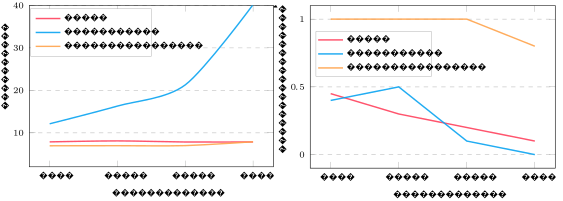

*原论文 ablation。左侧是 language-modeling perplexity，右侧是 passkey retrieval。真正有价值的不是某一个绝对分数，而是三种机制逐个加入时 failure mode 怎样变化。*

实验条件依次：

1. only Intra；
2. Intra + Inter；
3. Intra + Inter + Successive。

这几乎直接对应论文的三步设计动机。

---

## 59. Only Intra：为什么 PPL 好，Retrieval 差？

only Intra 等价于：

> 每个 chunk 基本只用自己内部上下文。

模型永远看到熟悉的 relative position：

$$
0,\dots,s-1.
$$

因此 local token prediction 很稳定。

所以：

> PPL 可以很低。

但 passkey 在其他 chunk 时：

$$
q
\nrightarrow
k_{\text{passkey}}.
$$

因此 retrieval 差。

这证明：

> **低 perplexity 不能证明模型真的使用了全局 long context。**

---

## 60. 加 Inter：为什么 Retrieval 上来了，PPL 反而可能恶化？

Inter 让 query 可以访问历史所有 chunks。

所以：

> global content access 恢复。

passkey retrieval 自然提高。

但普通 Inter 把 immediately previous chunk 也用：

$$
P_q=c-1
$$

处理。

于是 chunk boundary locality 被破坏。

因此：

- retrieval ↑；
- local language modeling quality ↓；
- PPL ↑。

这个 ablation 是 Successive-Chunk 必要性的直接证据。

---

## 61. 再加 Successive：为什么两个指标一起改善？

Successive 只对：

$$
\Delta g=1
$$

的 adjacent chunk 使用。

它没有改变：

- Intra 的 local relation；
- 更远 chunk 的 Inter access。

只修边界：

$$
1,2,\dots,w
$$

这些关键近距离。

于是：

> global retrieval 能力保留，同时 local language-modeling 恢复。

这是整篇论文最强的机制级论证之一。

---

# 十六、Perplexity：DCA 真能把 4K 模型直接跑到更长吗？

## 62. 论文如何测 Language Modeling？

主要使用长文档数据，例如：

- PG19；
- 其他长文本。

比较：

- original RoPE；
- PI；
- NTK；
- YaRN variants；
- DCA；
- 已经进行 long-context training 的模型。

关键观察：

> 原始 RoPE 模型一旦明显超过训练窗口，PPL 往往快速失控；DCA 能把这种崩溃推迟到远得多的长度。

---

## 63. 为什么 PPL 是必要但不充分的指标？

PPL 测：

$$
\exp
\left(
-\frac1T
\sum_t
\log p(x_t|x_{<t})
\right).
$$

如果 PPL 稳定，说明：

> 模型在该 long-context runtime 下至少还能进行相对正常的 next-token prediction。

但它不告诉你：

> 远处的 token 是否真的被有效使用。

因为语言模型只靠最近：

$$
2K
$$

token，也可能在普通文本上得到不错 PPL。

所以 DCA 还必须测 passkey。

---

## 64. 原论文 PPL 证据应该怎样表述？

论文报告在其设置中：

- Llama2 原始模型超窗后 PPL 快速恶化；
- DCA-enhanced 模型能在远超 training context 的长度保持更平稳 PPL；
- 70B 模型的 extrapolation 尤其明显；
- 将 DCA 叠加到已经使用 PI / NTK 做过长上下文 adaptation 的模型上，还能继续扩展。

这些结果支持：

> **DCA 的 relative-position remapping 确实缓解了超训练窗口后的语言建模崩溃。**

但不能直接推出：

> “任意 RoPE LLM 都能无损扩大几十倍。”

---

# 十七、Passkey Retrieval：模型到底有没有看到远处？

## 65. Passkey task 在测什么？

典型构造：

~~~text
大量无关文本
...
The pass key is 37492.
...
更多无关文本
...
Question:
What is the pass key?
~~~

改变：

- 总 context length；
- passkey depth。

如果模型答对：

> 至少说明它能够从远距离 context 中恢复这个简单目标信息。

这是 long-range accessibility 的测试。

---

## 66. 原论文 Passkey 图

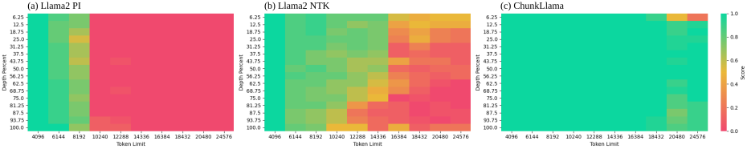

*原论文 needle/passkey 图。它比较 training-free extension methods 在不同输入长度与 document depth 下能否取回目标。该图主要测 retrieval accessibility，不等价于复杂 long-context reasoning。*

论文报告 DCA 在 4K-pretrained Llama2 13B 上，在明显超出 4K 的区间仍能保持较高 passkey retrieval accuracy。

这与 PPL 一起提供两个不同维度：

$$
\text{PPL}
\rightarrow
\text{local language modeling stability},
$$

$$
\text{Passkey}
\rightarrow
\text{far-content accessibility}.
$$

---

## 67. “Lost in the Beginning” 是什么？

论文附录观察到一个很有意思的 failure pattern。

在非常长 context 下，DCA 的 retrieval failure 不一定先出现在 middle。

有时反而：

> 最早的 document beginning 先掉。

这和某些其他方法的 “lost in the middle” pattern 不完全相同。

为什么这很有价值？

因为它说明：

> **不同 position-remapping method 会产生不同的 spatial bias。**

DCA 将所有很早 chunks 都压进类似 Inter positional range。

极早信息与其他远历史信息之间的 positional distinguishability 较弱，可能是潜在原因之一。

但这只能作为机制直觉，不应该把论文观察直接提升成严格因果证明。

---

## 68. 更长的 192K Passkey 图说明什么？

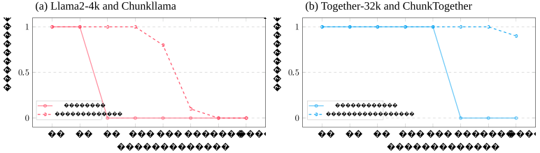

*原论文长距离 passkey evidence。论文将 DCA 叠加到已经支持更长 training context 的模型上，展示 context extension 可以继续向外推。该实验支持 DCA 与已有 positional scaling 的正交性，但不证明所有模型都能稳定达到 192K。*

这张图最值得读的不是：

> 192K 这个数字多大。

而是：

> DCA 可以放在已经做过 PI / NTK / long-context adaptation 的模型之上。

也就是说它和 frequency scaling 并不是同一个维度的改动。

---

# 十八、Orthogonality：为什么 DCA 可以叠加 PI / NTK / YaRN？

## 69. 两类方法改的是不同对象

### PI / NTK / YaRN

改：

$$
f(q,p;\theta_{\text{RoPE}})
$$

里的 position / frequency mapping。

也就是：

> 一个给定 relative position 应该对应什么 rotary phase？

### DCA

改：

$$
P_q,
\qquad
P_k,
$$

以及：

> 某一对 query-key 应该使用哪组 position id？

因此：

$$
\boxed{
\text{frequency mapping}
\perp
\text{pairwise position remapping}
}
$$

并不是严格数学意义的 orthogonal vector space，而是工程维度不同。

---

## 70. 用函数复合看最清楚

原 RoPE：

$$
q'
=
f(q,p).
$$

YaRN 可以理解成：

$$
q'
=
f_{\text{YaRN}}(q,p).
$$

DCA 则决定：

$$
p
=
P_q^{g(i,j)}.
$$

所以组合后：

$$
q'
=
f_{\text{YaRN}}
\left(
q,
P_q^{g(i,j)}
\right).
$$

也就是说：

- DCA 决定 **给什么 position**；
- YaRN 决定 **这个 position 怎样映射成 frequency phase**。

因此两者可以叠加。

---

## 71. 这正是 Qwen2.5 的 “YaRN + DCA”

[Qwen2.5](../../B/05-moe-complete-llm/B012-qwen2.5.md) 中的长上下文 extrapolation 不是只写一个参数。

论文明确使用：

$$
\text{YaRN}+\text{DCA}.
$$

可以理解成：

~~~text
YaRN:
repair / extrapolate RoPE frequency geometry

DCA:
repair pairwise relative-position organization
        ↓
jointly improve inference beyond training length
~~~

但 Qwen2.5 还做了：

- long-context pre-training；
- long-context SFT；
- progressive context expansion；
- MInference-derived sparse runtime。

所以不能反过来说：

> Qwen2.5 的 128K / 1M 就是 DCA 带来的。

---

# 十九、Real-World Long-Context Tasks：比 Passkey 更接近真正应用

## 72. 论文测了哪些任务？

包括：

- NarrativeQA；
- Qasper；
- QuALITY；
- QMSum；
- L-Eval 中若干任务。

它们涉及：

- 长文档 QA；
- scientific paper QA；
- narrative understanding；
- meeting summarization；
- long input closed-ended tasks。

相比 passkey：

> 更接近真正 semantic processing。

---

## 73. 论文为什么强调 70B？

很多 long-context extension 论文只验证 7B / 13B。

原因很现实：

> long-context fine-tuning 大模型非常贵。

DCA training-free，使作者可以直接在 Llama2 70B 上做实验。

因此论文的一个工程贡献是：

> **把 training-free extension 验证扩到更大模型尺度。**

---

## 74. “94% of GPT-3.5-16k”应该怎样读？

论文 abstract / experiment 中有类似：

> training-free 70B model reaches 94% of GPT-3.5-16k performance。

这个数字必须严格限定：

- 特定 benchmark；
- 特定 task set；
- 特定 prompt/evaluation protocol；
- 特定模型版本。

它不能被改写成：

> “ChunkLlama2-70B 总体有 GPT-3.5 94% 的能力。”

那是完全不同的命题。

所以本文只保留为：

> **在论文所选 long-context task aggregate 下，training-free DCA 70B 与该 proprietary baseline 的差距相对有限。**

---

## 75. 为什么 Real-World Benchmark 仍然不能完全证明 Long-Context Reasoning？

因为一些 benchmark 可以被：

- short relevant span；
- lexical matching；
- local answer extraction；

解决。

真正严格的 long-context reasoning 还需要区分：

- retrieval；
- aggregation；
- cross-document reasoning；
- global consistency；
- multi-hop dependence；
- position robustness。

因此没有一个单独 benchmark 可以代表全部 long-context capability。

---

# 二十、Efficiency：三次 FlashAttention 为什么论文说开销并不大？

## 76. 原论文 Efficiency Figure

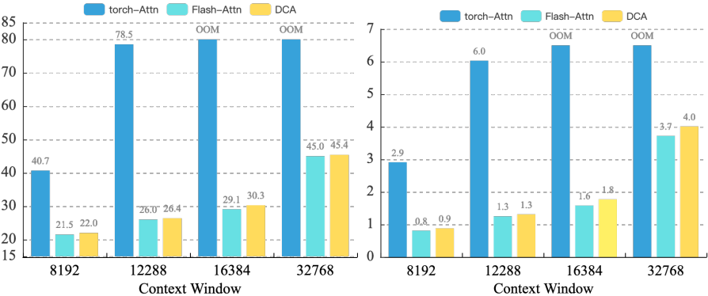

*原论文 efficiency 图，比较 PyTorch attention、FlashAttention 与 DCA+FlashAttention。论文实验中 DCA 的 memory / latency 与 FlashAttention 接近。该结果是特定硬件、模型和实现条件下的 measured evidence，不应直接当成任意部署环境的固定 overhead。*

---

## 77. 三次 Kernel Call 为什么不等于三倍计算？

因为三次不是都看完整 history。

对于 query $i$：

- Intra：current chunk 部分；
- Successive：one previous chunk；
- Inter：remaining older chunks。

key sets 是分区：

$$
\mathcal K_1
\dot\cup
\mathcal K_2
\dot\cup
\mathcal K_3
=
\{0,\dots,i\}.
$$

所以总 QK pair 数仍大致等于普通 full attention：

$$
i+1.
$$

不是：

$$
3(i+1).
$$

额外成本更多来自：

- 多次 query RoPE；
- kernel dispatch；
- group boundary；
- merge statistics。

---

## 78. 为什么 DCA 又没有让 Attention 更便宜？

因为 pair 总数仍是：

$$
O(L^2).
$$

所以它做到的是：

> **保持 full-history accessibility 时，不显著增加相对标准 FlashAttention 的 asymptotic score count。**

而不是：

> **把 full attention 降成线性 attention。**

这个区别非常重要。

---

## 79. 超长 Prompt 下真正的新瓶颈是什么？

当：

$$
L=1M,
$$

即使 DCA position geometry 完全有效：

$$
O(L^2)
$$

仍然不可接受。

尤其 prefill：

$$
QK^T
$$

要处理巨大 token pair 数。

用户感知首先表现为：

> Time To First Token（TTFT）非常高。

所以后续需要：

- MInference；
- sparse attention；
- retrieval / block selection；
- kernel / system optimization。

DCA 没有解决这一层。

---

# 二十一、为什么 DCA 和 StreamingLLM / Local Attention 不一样？

## 80. Streaming 类方法的核心取舍

某些 training-free long-context method 会只保留：

- recent window；
- attention sinks；
- 少量 selected memory。

这样 score count 可以下降。

但代价是：

> 部分历史 token 完全不可访问。

---

## 81. DCA 的选择不同

DCA 更愿意保留：

$$
\text{all-history content access}.
$$

它压缩的是：

> positional precision。

而不是直接删除：

> old content keys。

所以它在 design space 中更接近：

$$
\boxed{
\text{full content coverage}
+
\text{compressed far-position geometry}.
}
$$

这也是为什么 passkey retrieval 是它很重要的证据。

---

# 二十二、DCA 的隐含归纳偏置到底是什么？

## 82. Locality 是最高优先级

Intra + Successive 明确告诉模型：

> 附近 token 的精确距离非常重要。

这与语言建模的 local dependency 一致。

---

## 83. Very Far Distance 被降成粗粒度

Inter 告诉模型：

> 远 token 的 exact metric distance 不如“内容仍能访问”重要。

也就是：

$$
\text{far distance 50K vs 60K}
$$

可能被视为接近同一 positional class。

---

## 84. 所以 DCA 是一种 Hierarchical Position Prior

可以抽象成：

~~~text
same chunk:
exact local coordinate

previous chunk:
exact-ish boundary coordinate

far chunks:
coarse remote coordinate
~~~

这很像分层空间表示：

$$
\text{fine near}
+
\text{coarse far}.
$$

它与机器人地图、多分辨率 memory 甚至 hierarchical planning 都有相似设计思想。

---

# 二十三、一个更第一性原理的解释：位置编码本身就是有限带宽

## 85. 为什么不可能同时免费保留无限 Range 与无限 Resolution？

模型只有固定维度：

$$
d_h.
$$

RoPE 提供固定频率集合。

如果想支持：

$$
L\rightarrow\infty
$$

同时要求：

- 每一个远距离都唯一；
- 每一个局部距离都高精度；
- 不增加 dimension；
- 不重新训练；

本质上是在要求固定表示系统承载无限 positional information。

DCA 的答案不是假装没有 trade-off。

而是明确分配表示带宽：

> local precision 优先，far distance 压缩。

---

## 86. 这与 YaRN 的 Range–Resolution Trade-off 是同一主题

YaRN 中：

- 低频负责长 range；
- 高频保护 local resolution。

DCA 中：

- far chunks 使用 coarse position；
- near chunks 使用 exact relation。

两个方法虽然实现不同，但第一性原理相同：

$$
\boxed{
\text{expand range}
\Rightarrow
\text{must decide where to spend positional resolution}.
}
$$

---

# 二十四、论文中最值得保留的 Evidence Boundary

## 87. 4K → 32K 不等于“模型学会了 8× 更长任务”

DCA 没有 weight update。

因此它没有新增：

- long-document training experience；
- long-range reasoning supervision；
- long-context instruction tuning。

它只是让原有模型在更长输入下不那么快被 positional OOD 摧毁。

所以准确表述：

> **DCA 延长了模型可用的 positional / attention operating range。**

而不是：

> “DCA 训练出了新的 long-context reasoning capability。”

---

## 88. PPL 低不等于 Retrieval 强

Ablation 自己已经证明：

> only Intra 可以 PPL 很低，但 passkey 差。

所以：

$$
\text{low PPL}
\nRightarrow
\text{global context use}.
$$

---

## 89. Passkey 强不等于 Reasoning 强

Passkey 只要求找到：

> 一个简单 literal target。

复杂 reasoning 可能要求同时组合：

$$
e_1,e_2,e_3,\dots
$$

多个远距离证据。

所以：

$$
\text{retrieval}
\nRightarrow
\text{multi-hop reasoning}.
$$

---

## 90. Benchmark 强不等于任意 100K 输入都稳定

实际文档类型可能不同：

- code repository；
- legal document；
- multi-turn chat；
- mixed-language data；
- time series；
- tool trace。

DCA 的 position remapping 对不同 workload 的影响可能不同。

因此 context length 必须总是和：

> task distribution

一起报告。

---

# 二十五、为什么 Qwen2.5 同时使用 YaRN + DCA？

## 91. 先看 Training Length

普通 Qwen2.5：

$$
L_{\text{train,long}}
\approx32K.
$$

Turbo progressive training：

$$
32K
\rightarrow
65K
\rightarrow
131K
\rightarrow
262K.
$$

这里模型真正通过 gradient 适应长 context。

---

## 92. 再看 YaRN

YaRN 处理：

$$
L_{\text{inference}}
>
L_{\text{training}}
$$

时的 RoPE frequency extrapolation。

它回答：

> 超出训练长度的 position phase 怎么处理？

---

## 93. 再看 DCA

DCA 回答：

> query 与同 chunk / neighbor chunk / far chunk 的 relative-position relation 怎么组织，才能保护 locality 又不让远距离 OOD？

所以它是 pairwise attention organization。

---

## 94. 最后才是 MInference

即使：

- model learned long context；
- YaRN position 合法；
- DCA relation 合理；

1M prompt 的 full prefill 仍然太贵。

MInference 类方法进一步处理：

$$
\text{attention compute}
$$

和：

$$
\text{TTFT}.
$$

因此完整链：

~~~text
long-context training
        ↓
YaRN
position-frequency extrapolation
        ↓
DCA
relative-position / chunk relation organization
        ↓
MInference
sparse prefill / runtime acceleration
~~~

---

# 二十六、为什么 DCA 特别适合和 RoPE 模型组合？

## 95. 它依赖 RoPE 的一个关键性质

RoPE inner product 的 position dependency 可以通过：

$$
P_q-P_k
$$

操纵。

DCA 不需要改变：

- Wq；
- Wk；
- Wv；
- FFN；
- hidden states。

主要重构：

$$
P_q,
P_k.
$$

所以是一种 parameter-free positional intervention。

---

## 96. 如果位置编码不是 RoPE 呢？

不能机械照搬。

不同 positional encoding：

- absolute learned embedding；
- ALiBi；
- relative bias；
- RoPE；

其 attention relation 结构不同。

DCA 的具体公式建立在：

> RoPE position indices 可被重新分配，并且 QK 内积编码相对 position difference。

因此不要把 DCA 的 position-id trick 无条件推广到所有 architecture。

---

# 二十七、与 ReRoPE / SelfExtend 这类方法怎样理解关系？

## 97. 共性

这类 training-free method 都在问：

> 能不能通过重新映射 relative-position relation，使测试时 position pattern 更接近训练分布？

共同核心是：

$$
\text{position remapping}
$$

而不是：

$$
\text{weight learning}.
$$

---

## 98. DCA 的特色

DCA 特别强调：

1. chunk decomposition；
2. local vs adjacent vs far 三类关系；
3. FlashAttention compatibility；
4. full-history content access。

因此它不是单纯一个 scalar distance clipping function。

---

# 二十八、从工程实现角度重新走一次

## 99. Prefill

输入一条长 prompt。

先为每个 key 构造：

$$
P_k=i\bmod s.
$$

计算并缓存：

$$
K_{\text{rope}}.
$$

对 query block，根据 target key group 构造：

- intra query rotation；
- successive query rotation；
- inter query rotation。

分别进入 FlashAttention。

最后用全局 softmax merge 恢复一个 attention output。

---

## 100. Decode

新 token 到来时：

1. content $q,k,v$ projection；
2. 新 K 用 modulo position 旋转后加入 cache；
3. current q 生成三种 rotated variant；
4. 按 key range 分成 current / previous / old；
5. 三路 attention；
6. merge；
7. 继续下一层。

因此 decode 依旧可以使用 persistent KV cache。

---

## 101. 为什么同一个 Q 要旋转三次而 K 只旋一次？

这是 DCA 最关键的系统折中。

如果 K 也针对每个 query relation 重新旋转：

> 历史 KV cache 无法固定。

通过固定 K position：

$$
P_k=j\bmod s,
$$

把 relation-specific freedom 全压到 current Q：

$$
P_q^{\text{Intra/Succ/Inter}}.
$$

于是：

> 当前 query 多做少量旋转，换历史 cache 稳定。

这是一种典型的 decode-oriented design。

---

# 二十九、DCA 的复杂度要怎样严谨表述？

## 102. 计算复杂度

如果每个 query 仍访问全部历史 keys：

$$
O(L^2d)
$$

attention arithmetic order 不变。

因此：

$$
\boxed{
\text{DCA is not an asymptotic compute reduction}.
}
$$

---

## 103. 显存复杂度

使用 FlashAttention 时，不需要 materialize：

$$
L\times L
$$

attention matrix。

working memory 可保持接近 FlashAttention 的 blockwise level。

但 KV cache 仍是：

$$
O(Ld_{kv}).
$$

所以：

> 长 context 的 persistent state 仍然线性增长。

---

## 104. Kernel overhead

相比单一路径 FlashAttention，DCA 多：

- query rotations；
- segment bookkeeping；
- multiple kernel calls；
- LSE merge。

所以真实 latency 不会数学上“完全免费”。

论文的 efficiency figure说明：

> 在其实现与硬件条件下，额外 overhead 相对 full FlashAttention 较小。

这是 empirical engineering result。

---

# 三十、DCA 适合什么，不适合什么？

## 105. 适合

### 已有模型无法重新训练

希望零 weight-update 扩 context。

### 想保留 full-history access

不能接受纯 sliding window 丢掉远 token。

### 使用 RoPE + FlashAttention

最匹配论文设计。

### 需要在更大模型上快速验证

70B long-context fine-tuning 成本过高时尤其有吸引力。

---

## 106. 不一定适合

### 需要精确远距离 metric position

DCA 会 alias far distance。

### 需要百万级 full attention 低 TTFT

它不降 $O(L^2)$。

### 需要真正新增长程 reasoning skill

没有 long-context training signal。

### 非 RoPE architecture

需要重新分析位置机制。

---

# 三十一、把 DCA 与现有站内技术放回一张图

## 107. RoPE

解决：

> 把 relative position 写进 QK rotation。

[RoPE](../03-transformer/A014-roformer-rope.md)

---

## 108. YaRN

解决：

> 原 RoPE frequency spectrum 怎样更稳地外推。

[YaRN](../03-transformer/A018-yarn.md)

---

## 109. DCA

解决：

> 超长 sequence 的不同 token pair 应该看到什么 relative-position class。

本文。

---

## 110. GQA / MLA

解决：

> KV state / decode memory。

[GQA](A020-gqa.md) 与 [DeepSeek-V2](../../B/05-moe-complete-llm/B008-deepseek-v2.md)。

DCA 并不替代它们。

---

## 111. FlashAttention

解决：

> exact attention 的 IO / kernel execution。

DCA 依赖它来避免 materialize attention matrix。

---

## 112. MInference

解决：

> 超长 prompt full-attention prefill 太慢。

这是下一节点。

---

# 三十二、一个值得迁移到机器人 / VLA 的设计思想

## 113. 历史越远，时间精度可以越粗吗？

机器人时序中也常见：

- 最近 100 ms：需要精确 dynamics；
- 最近几秒：动作级关系；
- 几分钟前：只需要任务语义；
- 更早历史：只保留摘要 / event memory。

DCA 的核心先验：

$$
\text{near}
\rightarrow
\text{fine position},
$$

$$
\text{far}
\rightarrow
\text{coarse position}.
$$

非常像多尺度 temporal memory。

---

## 114. 但不能直接把 DCA 套到控制序列

控制系统中精确时间间隔可能决定：

- velocity；
- acceleration；
- latency；
- contact dynamics。

远历史也可能需要真实时间戳。

所以可迁移的是：

> **hierarchical resolution allocation 的设计思想。**

不是直接照搬其 RoPE index formula。

---

# 三十三、论文最容易学错的十二个地方

## 错法 1：DCA 是 Sparse Attention

不准确。

它主要重映射位置，仍访问全部历史 key。

## 错法 2：DCA 把旧 chunk 压成一个向量

错误。

content K/V 都保留。

## 错法 3：Modulo key position 会让不同 token 完全相同

错误。

只 alias positional phase。

## 错法 4：Inter 保留精确远距离

错误。

它故意压缩 far distance。

## 错法 5：Successive 是为了增加更多远距离信息

错误。

它主要修复 boundary locality。

## 错法 6：三路 softmax output 可以直接相加

错误。

必须按 global normalizer 合并。

## 错法 7：三次 FlashAttention 等于 3× QK FLOPs

不对。

三个 key group 基本互斥，总 coverage 接近一次 full history。

## 错法 8：DCA 解决 $O(L^2)$

错误。

## 错法 9：Training-Free = 零工程改动

错误。

runtime 改动很实质。

## 错法 10：Passkey 强 = long reasoning 强

错误。

## 错法 11：DCA 与 YaRN 是替代关系

不对。

Qwen2.5 就把两者组合。

## 错法 12：Qwen2.5 1M context 来自 DCA

完全不对。

它来自训练、外推、attention organization 与 runtime 多层系统。

---

# 三十四、把整篇论文压成一条因果链

## 115. Failure → Design

~~~{mermaid}
flowchart TD
    A["RoPE pretrained on context c"] --> B["Inference length > c"]
    B --> C["Relative-position matrix contains unseen offsets"]
    C --> D["Split sequence into chunks"]
    D --> E["Reuse key positions 0 ... s-1"]
    E --> F["Intra: exact local distance"]
    E --> G["Inter: map far history into safe range c-s ... c-1"]
    G --> H["Problem: adjacent chunk locality is distorted"]
    H --> I["Successive: reserve local window w=c-s"]
    F --> J["Three relation-specific Q rotations"]
    I --> J
    G --> J
    J --> K["Three FlashAttention calls"]
    K --> L["Global softmax / LSE merge"]
    L --> M["Training-free long-context extrapolation"]
    M --> N["Still O(L²): runtime bottleneck remains"]
~~~

---

## 116. 一句话记忆

> **DCA 不试图让模型精确理解任意大的 RoPE 距离；它把长序列重新编码成“近处精确、远处粗粒度但仍可访问”的相对位置结构，并把所有 RoPE offset 控制在模型训练过的范围内。**

---

# 三十五、论文论证强度怎么分层？

## 117. 强因果证据

### 三分支 Ablation

Intra → +Inter → +Successive。

非常直接对应设计机制。

---

## 118. 强工程证据

### Efficiency Figure

说明 DCA 可以与 FlashAttention 结合，并在论文硬件设置下 overhead 较小。

---

## 119. 中等证据

### PG19 PPL + passkey

两个指标互补，说明：

- local LM stability；
- far retrieval。

但不覆盖所有 long-context reasoning。

---

## 120. 更弱的综合能力外推

### Long benchmark aggregate

能够说明模型在这些任务中可用。

但不能证明：

> training-free DCA 与经过 long-context training 的模型在所有场景能力等价。

---

# 三十六、从这里继续怎么读？

## 121. 如果 Relative-Position Matrix 没建立起来

回：

> [RoPE](../03-transformer/A014-roformer-rope.md)。

把：

$$
q_i^Tk_j
$$

为什么只依赖：

$$
P_q[i]-P_k[j]
$$

重新推一遍。

---

## 122. 如果不理解为什么 DCA 与 YaRN 能同时使用

回：

> [YaRN](../03-transformer/A018-yarn.md)。

然后分别写：

$$
\text{YaRN}
=
\text{frequency mapping},
$$

$$
\text{DCA}
=
\text{pairwise position-id assignment}.
$$

---

## 123. 如果想回真实模型系统

回：

> [Qwen2.5](../../B/05-moe-complete-llm/B012-qwen2.5.md)。

重新看：

~~~text
long-context pre-training
→ long-context SFT
→ YaRN + DCA
→ 1M extrapolation
→ MInference-derived sparse runtime
~~~

---

## 124. 下一篇：MInference

现在真正剩下的问题已经不是：

> position 对不对。

而是：

> **当 prompt 真有几十万甚至一百万 token 时，full attention prefill 的 $O(L^2)$ 怎么办？**

这会把我们从：

> positional geometry

带到：

> attention sparsity + kernel + TTFT。

因此下一节点最自然是：

**MInference 1.0：Accelerating Pre-filling for Long-Context LLMs via Dynamic Sparse Attention。**

---

# 三十七、最终自检

读完 DCA，至少应该能回答：

1. 为什么 DCA 用 relative-position matrix $M$ 表述 RoPE？
2. 标准 RoPE 的 $M[i][j]$ 是什么？
3. 为什么测试长度超过 $c$ 后会出现训练没见过的 relative offset？
4. PI 在 $M$ 视角下做了什么？
5. DCA 为什么不想统一压缩所有 relative distance？
6. chunk size $s$ 为什么必须小于 pretraining context $c$？
7. $P_k=i\bmod s$ 的作用是什么？
8. 不同 chunk 的相同 key position 为什么不会让 content key 相同？
9. Intra-Chunk 的 $P_q$ 怎样定义？
10. 为什么同 chunk 内 $M=i-j$ 完全精确？
11. 为什么直接拿循环 position 跨 chunk 会出现负 relative distance？
12. 为什么 DCA 更愿意固定 K 而修改 Q？
13. Inter query 为什么取 $c-1$？
14. 为什么 Inter relative distance 一定落在 $[c-s,c-1]$？
15. Inter 牺牲了什么 positional information？
16. 为什么 adjacent chunk 不能直接用 Inter？
17. Successive query position 怎样定义？
18. 为什么 $w\le c-s$？
19. 为什么常取 $w=c-s$？
20. DCA 的最终 piecewise $M[i][j]$ 怎么写？
21. 同一个 query 为什么要有三种 RoPE 版本？
22. 为什么所有 DCA offset 都不超过 $c-1$？
23. DCA 与 PI 的信息压缩策略有什么根本不同？
24. 三个 attention group 为什么不能独立 softmax 后直接相加？
25. $o=(\sum Z_go_g)/(\sum Z_g)$ 怎么推出来？
26. FlashAttention 怎样用 LSE statistics 做稳定 merge？
27. 三个 key group 的 token 数相加为什么仍约等于 $i$？
28. 为什么 DCA 不是 sparse-attention acceleration？
29. 为什么整体复杂度仍是 $O(L^2)$？
30. 为什么 DCA 可以复用 KV cache？
31. KV cache 为什么仍然是 $O(L)$？
32. Intra-only ablation 为什么低 PPL 却 retrieval 差？
33. 加 Inter 后为什么 retrieval 提升但 PPL 可能恶化？
34. Successive 为什么能同时修两个指标？
35. PPL 与 passkey 分别测什么？
36. “lost in the beginning” 暗示什么 position bias？
37. 为什么 DCA 可以叠加到 PI / NTK / YaRN？
38. “training-free”精确是什么意思？
39. DCA 为什么没有训练新的 long-context reasoning skill？
40. 论文的 94% GPT-3.5 结论为什么必须限定 benchmark？
41. Qwen2.5 中 YaRN 与 DCA 分别在哪一层？
42. 为什么 1M context 最后还必须有 MInference？
43. DCA 最核心的 range-resolution trade-off 是什么？

如果这些问题都能回答，DCA 就不再是“把 Attention 切成 chunk”这么模糊的一句话，而是一套很清晰的设计：

> **用三种关系特化的 query position，把超长序列的相对位置压回训练域；近处保留精确位置，远处压缩位置分辨率，但不丢掉 content access。**

