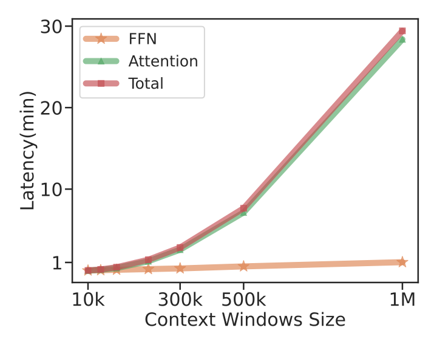
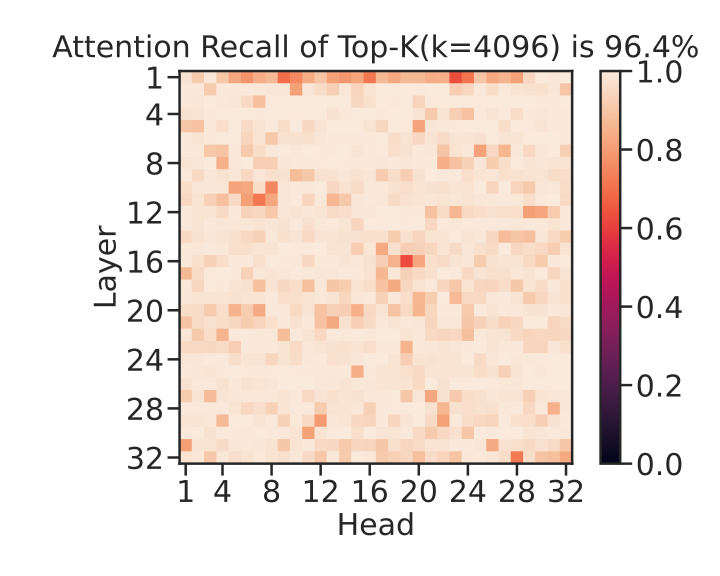
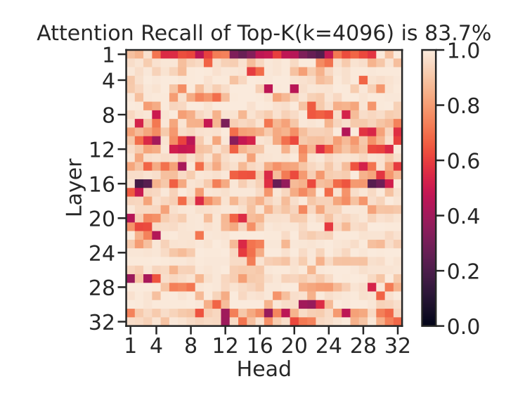
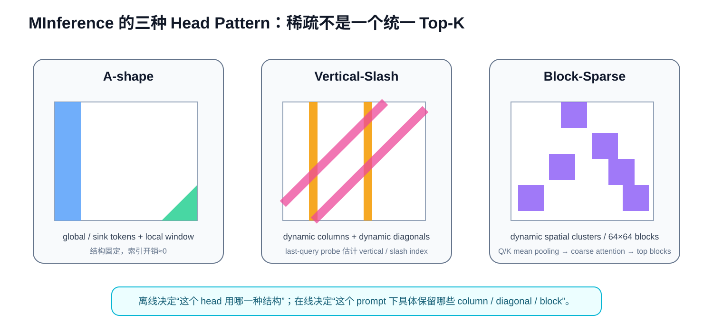
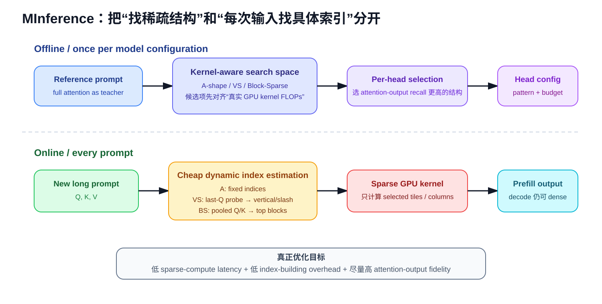
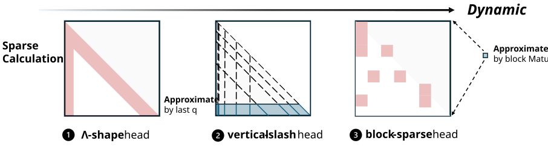
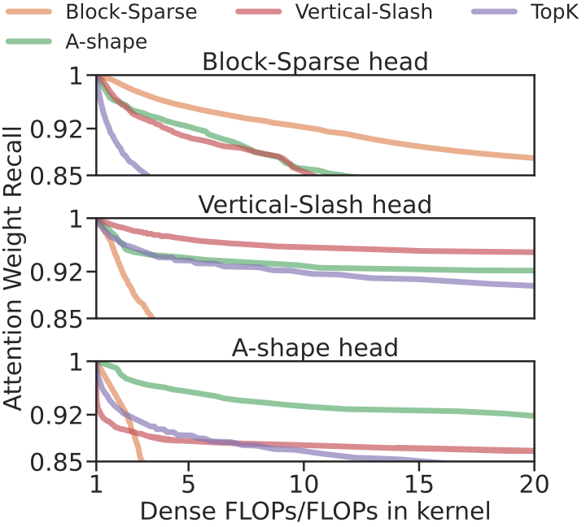
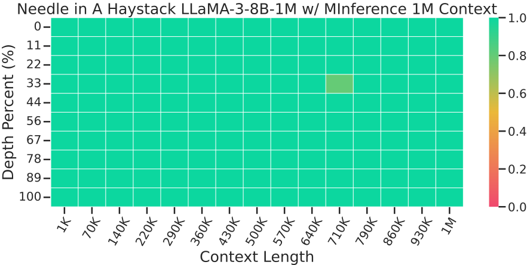
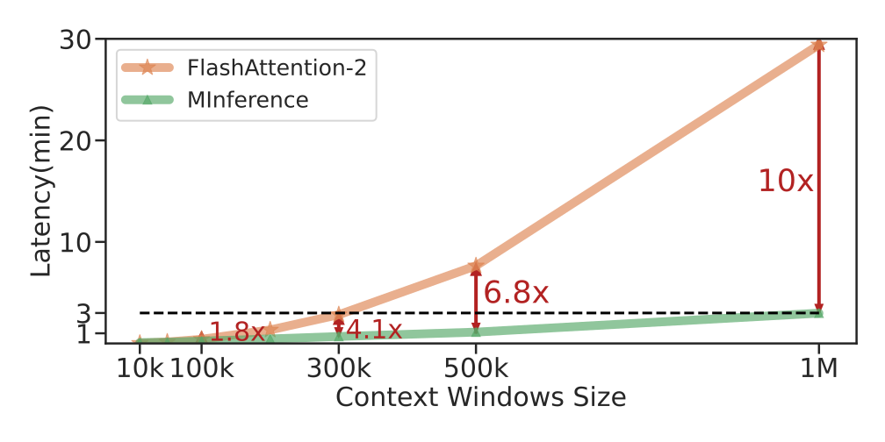
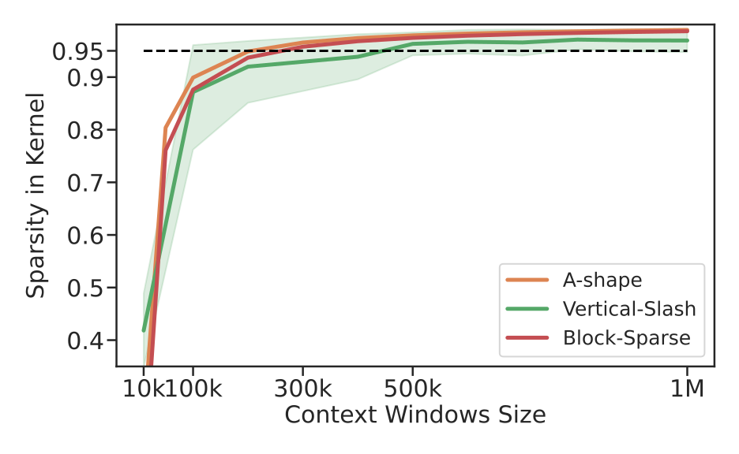

# MInference 1.0：长上下文已经能“看见”，为什么 1M Prompt 仍要等几十分钟？

> **论文**：Huiqiang Jiang et al., [MInference 1.0: Accelerating Pre-filling for Long-Context LLMs via Dynamic Sparse Attention](https://arxiv.org/abs/2407.02490)，NeurIPS 2024。  
> **类型**：A · 方法 / 系统交叉论文；Dynamic Sparse Attention + GPU Kernel Co-design。  
> **一句话定位**：MInference 不负责把模型的 RoPE 从 32K 外推到 1M，也不负责训练新的 long-context reasoning。它假设模型已经具备长上下文能力，然后专门处理另一个问题：**Prefill 阶段的 Dense Attention 是 \(O(L^2)\)，在百万 token 时会吞掉绝大部分 TTFT；而真实 attention weight 往往高度稀疏、但稀疏位置随输入动态变化。因此可以离线为每个 head 选择 GPU 友好的稀疏结构，在线以很低成本预测当前 prompt 的具体 sparse indices，最后只计算重要 attention tiles。**

这篇文章正好接在 [Dual Chunk Attention](A053-dual-chunk-attention.md) 后面。

我们现在已经把 Qwen2.5 的 long-context chain 分成了三层：

~~~text
YaRN
→ position / frequency extrapolation

Dual Chunk Attention
→ query-key relative-position organization

MInference
→ prefill sparse computation / TTFT
~~~

三者解决的不是同一个问题。

[Qwen2.5](../../B/05-moe-complete-llm/B012-qwen2.5.md) 中所说的 1M context，只有把：

- long-context training；
- position extrapolation；
- attention relation；
- inference runtime；

共同考虑，才是真正可用的系统。

---

## 阅读导航

建议先掌握：

- [Transformer](../03-transformer/A013-transformer-attention-is-all-you-need.md)：Self-Attention 的 \(QK^T\)、Softmax、\(AV\)；
- [GQA](A020-gqa.md)：Decode 为什么被 KV Cache / memory bandwidth 限制；
- [YaRN](../03-transformer/A018-yarn.md)：context length 超过训练范围时，RoPE frequency 怎么处理；
- [Dual Chunk Attention](A053-dual-chunk-attention.md)：为什么 position relation 合理了，计算复杂度仍然还是 \(O(L^2)\)；
- [Qwen2.5](../../B/05-moe-complete-llm/B012-qwen2.5.md)：MInference 在真实 1M pipeline 中负责什么。

本文重点回答：

1. Prefill 与 Decode 的计算结构为什么完全不同？
2. 为什么长上下文首先卡 TTFT，而不是 tokens/s？
3. \(QK^T\) 为什么在 prefill 阶段是 \(L\times L\)？
4. 1M token 为什么会产生万亿级 attention pair？
5. FlashAttention 已经不 materialize attention matrix，为什么还是很慢？
6. MInference 为什么不是普通 Top-K Attention？
7. “Attention 很稀疏”到底指什么？
8. 96.8% attention mass recall 这个数字能说明什么、不能说明什么？
9. 为什么稀疏位置不能做成一个固定 mask？
10. 为什么同一个 head 的具体 index 会变，但 pattern family 反而相对稳定？
11. A-shape、Vertical-Slash、Block-Sparse 分别对应什么结构？
12. 为什么 Top-K token 虽然细粒度，却可能在 GPU 上很慢？
13. Kernel-aware pattern search 为什么必须用真实 kernel FLOPs？
14. 为什么 pattern type 可以 offline 决定，而具体 indices 要 online 决定？
15. Vertical-Slash 为什么只用最后 64 个 query 就能估计全局重要列？
16. slash line 到底是什么？
17. Block-Sparse 为什么可以先 mean-pool Q/K 再找 top blocks？
18. sparse-index estimation 自己也需要算力，为什么最终还会更快？
19. Dynamic mask 的优化目标怎样写？
20. MInference 是近似 attention 还是 exact attention？
21. 在选定 sparse mask 内，FlashAttention softmax 是否仍然精确？
22. PIT / Triton / FlashAttention 分别承担什么？
23. 1M 下 10× speedup 为什么不能简单解释成 95% sparsity = 20×？
24. 为什么 context 越长，MInference 越划算？
25. 为什么 10K context 反而可能几乎没有收益？
26. MInference 为什么只加速 prefill，decode 仍然可以 dense？
27. MInference 与 KV Cache Compression 为什么可以叠加？
28. 为什么 static sparse indices 在 KV retrieval 上接近失效？
29. 为什么 only Vertical-Slash 已经很强，却仍不等于完整方法？
30. 为什么 sparse attention 有时 benchmark 分数会略高于 full attention，但不能据此说稀疏更准确？
31. MInference 与 StreamingLLM / local attention 的本质差别是什么？
32. Qwen2.5 报告里的 12.5× attention-load reduction 与 3.2–4.3× TTFT 应怎样理解？
33. MInference 之后还暴露了哪些系统依赖——尤其 FlashAttention？

---

# 一、先区分 Prefill 与 Decode：这是理解 MInference 的起点

## 1. 一次 LLM 请求其实有两个完全不同的阶段

假设用户输入 prompt：

$$
x_{1:L}.
$$

模型随后生成：

$$
y_1,y_2,\dots
$$

推理过程可以拆成：

### Prefill

一次性处理完整 prompt：

$$
x_1,\dots,x_L.
$$

为所有 prompt token 计算 hidden states，并建立 KV Cache。

### Decode

之后每次只新增一个 token：

$$
y_t.
$$

新 query 与历史 K/V 做 attention，然后生成下一个 token。

这两个阶段虽然都叫 Transformer inference，但硬件 bottleneck 完全不同。

---

## 2. Prefill 的 Attention Shape

一层 self-attention 中：

$$
Q\in\mathbb R^{L\times d},
$$

$$
K\in\mathbb R^{L\times d}.
$$

所以：

$$
QK^T
\in
\mathbb R^{L\times L}.
$$

因此 score computation 大致：

$$
O(L^2d).
$$

如果：

$$
L=10^6,
$$

则 token pair 数量：

$$
L^2
=
10^{12}.
$$

也就是：

> **万亿级 query-key interaction。**

即使每个 interaction 只做很简单的计算，这个规模也已经巨大。

---

## 3. Decode 为什么不是 \(L^2\)？

生成第一个新 token 时，只有一个新的 query：

$$
q_t\in\mathbb R^{1\times d}.
$$

历史 K：

$$
K_{\le t}
\in
\mathbb R^{L\times d}.
$$

所以：

$$
q_tK^T
\in
\mathbb R^{1\times L}.
$$

单步 decode attention：

$$
O(Ld).
$$

如果生成：

$$
T
$$

个 token，粗略：

$$
O(TLd).
$$

所以：

~~~text
Prefill:
many queries × many keys
→ O(L²)

Decode:
one new query × all historical keys
→ O(L) per token
~~~

MInference 主要攻击的是第一项。

---

## 4. 为什么长上下文用户首先感受到 TTFT？

TTFT：

> Time To First Token。

用户提交一个 1M-token prompt 后，在看到模型第一个输出 token 前，系统必须先做：

1. tokenizer / input transfer；
2. embedding；
3. 每一层 Transformer prefill；
4. 建立所有 prompt token 的 KV state；
5. 最终 LM Head；
6. 才能开始 decode。

如果 prefill 花：

$$
1800\text{ seconds},
$$

即使后面 decode 能做到：

$$
50\text{ tokens/s},
$$

用户仍然要先等 30 分钟。

因此：

$$
\boxed{
\text{Long-context UX}
\approx
\text{TTFT}
+
\text{decode latency}.
}
$$

百万级 prompt 时，前者可能成为主导项。

---

## 5. MInference 论文给出的基线有多夸张？

论文以 LLaMA-3-8B、单张 A100 为例。

Dense prefill 大约：

- 300K prompt：约 6 分钟；
- 1M prompt：约 30 分钟。

论文分析显示：

> 在超长 prompt 下，自注意力计算占 prefill latency 的 90% 以上。

原论文 latency breakdown：

*原论文证据图。它支持的结论是：在论文给定 LLaMA-3-8B / A100 / 长上下文设置下，Attention 是 prefill 的主 bottleneck。它不代表任意 GPU、任意模型、任意 sequence length 都固定超过 90%。*

因此真正值得优化的对象非常明确：

$$
QK^T
\rightarrow
\operatorname{Softmax}
\rightarrow
AV.
$$

---

# 二、FlashAttention 已经很快了，为什么还不够？

## 6. Dense Attention 有两个不同成本

标准 naive attention 最大的问题之一，是 materialize：

$$
L\times L
$$

attention matrix。

FlashAttention 通过 tiling + online softmax：

- 不把完整 attention matrix 写回 HBM；
- 降低 IO；
- fuse kernel；
- 保持 exact attention。

这解决的是：

> **Memory IO complexity。**

但它并没有消除：

$$
L^2
$$

个 score interaction。

---

## 7. FlashAttention 不是把 \(O(L^2)\) 变成 \(O(L)\)

这是 MInference 必须建立的前置认识。

FlashAttention：

$$
\boxed{
\text{same dense attention math}
+
\text{better IO schedule}.
}
$$

它仍然需要在因果允许范围内计算大量：

$$
q_i^Tk_j.
$$

所以当：

$$
L=1M,
$$

即使没有 materialize 巨大 score matrix，算术量本身仍然太大。

这也是为什么我们在 [DCA](A053-dual-chunk-attention.md) 最后强调：

> position geometry 解决了，不代表 runtime 解决了。

---

# 三、第一观察：Attention Weight 实际上高度稀疏

## 8. Dense Matrix 中真的每个 Entry 都重要吗？

标准 attention 输出：

$$
o_i
=
\sum_j
a_{ij}v_j,
$$

其中：

$$
a_{ij}
=
\frac{
e^{z_{ij}}
}{
\sum_k e^{z_{ik}}
}.
$$

理论上每个：

$$
a_{ij}>0.
$$

但现实中很多权重极小。

例如：

$$
a_{i1}=0.3,
$$

$$
a_{i2}=0.2,
$$

而大量其他 token：

$$
a_{ij}\approx10^{-7}.
$$

从输出贡献看，绝大多数 entry 接近无效。

---

## 9. 128K Attention 的一个论文观察

MInference 在 128K attention matrix 上做分析。

保留 top 4K columns 时，论文报告可以覆盖约：

$$
96.8\%
$$

的 total attention mass。

原论文证据：

*原论文观测。在其 LLaMA-3-8B / 128K 分析中，少数 column 能覆盖大部分 attention mass。96.8% 是该实验设置下的统计结果，不是所有模型、所有 head、所有任务的普适常数。*

这带来一个非常诱人的想法：

> 如果 95% 以上 attention weight 都集中在少数位置，为什么还要计算全部 \(L^2\) entry？

---

## 10. “Attention 稀疏”不能怎样理解？

错误理解：

> 96.8% mass 在 top 4K，所以剩下的全部可以无损删掉。

不对。

原因包括：

### Softmax normalization

删掉 entry 会改变 denominator。

### Value vector

一个 attention weight 虽小，但对应：

$$
v_j
$$

可能在某些维度贡献显著。

### 多层累积

单层微小误差会传播到后续 layer。

### Head 差异

不同 head 的稀疏结构完全不同。

### Task 差异

retrieval、summarization、code 的重要 token 分布不同。

所以正确结论是：

> **存在很强的可压缩冗余，但必须设计能保留输出 fidelity 的 sparse mechanism。**

---

# 四、第二观察：Attention 稀疏，但具体位置是动态的

## 11. 为什么不能离线保存一套 Top-K Token？

假设在 prompt A 中发现：

$$
\mathcal I_A
=
\{10,35,1024,\dots\}
$$

最重要。

然后把这组 indices 直接用于另一个 prompt B。

论文实验发现，attention recall 会从约：

$$
96.8\%
$$

下降到约：

$$
83.7\%.
$$

原论文图：

*原论文证据。它说明“attention 很 sparse”不等于“同一组 sparse indices 可以跨 prompt 复用”。具体重要 token 位置具有明显 input dependence。*

原因很自然。

prompt A 可能是：

> code repository。

prompt B 可能是：

> meeting transcript。

真正重要 token 的位置当然不会相同。

---

## 12. 于是出现一个矛盾

我们想要：

$$
\text{sparse attention}
$$

来省计算。

但为了知道哪些位置重要，最直接方法又是先算：

$$
QK^T.
$$

这就陷入循环：

~~~text
为了省掉 Dense Attention
        ↓
必须先知道 Sparse Mask
        ↓
为了知道 Sparse Mask
        ↓
又想先算 Dense Attention
~~~

MInference 真正解决的，就是：

> **怎样用远低于 dense attention 的成本预测 sparse mask。**

---

# 五、第三观察：Indices 动态，但 Pattern Family 相对稳定

## 13. 最关键的工程突破

MInference 发现：

> 对同一个 attention head，具体 sparse indices 会随 prompt 改变，但稀疏的二维几何形状往往相对稳定。

也就是：

$$
\boxed{
\text{Pattern Type}
\approx
\text{head-specific stable property}
}
$$

而：

$$
\boxed{
\text{Pattern Indices}
=
\text{input-dependent dynamic property}.
}
$$

这两个层次一分开，问题突然变简单了。

---

## 14. 三种典型 Pattern

论文把长上下文 attention head 归纳成：

1. A-shape；
2. Vertical-Slash；
3. Block-Sparse。

原论文 attention visualization：

*原论文不同 head 的 attention pattern。应该观察的是二维结构类别，而不是具体某一条亮线的位置：同一个 head 的 pattern family 相对一致，但实际激活 column / diagonal / block 会随输入变化。*

教学化总结：

*教学解释图。A-shape 是静态 global+local；Vertical-Slash 是动态列与动态对角线；Block-Sparse 是动态空间块。MInference 不是要求所有 head 都套同一个 mask。*

---

# 六、A-shape：最简单，也最像 StreamingLLM

## 15. A-shape 长什么样？

Attention matrix：

- 横轴：key position；
- 纵轴：query position。

A-shape 通常有两部分：

### 左侧 vertical band

模型持续关注最开始一批 token。

类似：

- attention sink；
- global tokens；
- system / BOS 等早期位置。

### 对角线附近 local band

每个 query 主要关注最近的 token。

形成 causal diagonal 附近宽带。

合起来：

~~~text
|█............
|██...........
|███..........
|█.██.........
|█..██........
|█...██.......
|█....██......
~~~

视觉上类似字母 A / 左列 + 对角带。

---

## 16. A-shape 为什么最便宜？

因为 mask 可以提前固定：

- first \(g\) tokens；
- last \(w\) local window。

例如论文默认计算预算参考：

$$
g=1024,
$$

$$
w=4096.
$$

对每个 prompt 不需要重新找重要位置。

所以：

$$
t_{\text{index}}
\approx0.
$$

直接进 sparse kernel。

---

## 17. A-shape 的弱点是什么？

它只能看：

- 固定 global tokens；
- 当前附近 token。

如果一个重要事实出现在：

> 文档中间某个不属于 global/local 的位置，

它可能永远被 mask 掉。

所以 StreamingLLM 类方法在：

- PassKey；
- KV retrieval；
- arbitrary-position needle；

上容易失败。

---

# 七、Vertical-Slash：MInference 最重要的一类 Pattern

## 18. Vertical Line 是什么？

如果很多 query 都关注同一个 key position：

$$
j^\star,
$$

attention matrix 会出现一条 vertical line：

~~~text
........█.....
........█.....
........█.....
........█.....
........█.....
........█.....
~~~

这种 key 可能是：

- delimiter；
- section heading；
- rare salient token；
- important entity；
- global semantic anchor。

关键：

> 具体是哪一列，会随 prompt 改变。

所以 vertical index 必须 online 预测。

---

## 19. Slash Line 是什么？

如果 attention 倾向某个 fixed relative offset：

$$
j=i-\delta,
$$

则随着 query index \(i\) 增长，key index \(j\) 也跟着增长。

在二维矩阵上形成一条斜线：

~~~text
█.............
.█............
..█...........
...█..........
....█.........
~~~

或与主 diagonal 平行的其他斜线。

它代表：

> 某类 relative-distance dependency。

因此 Vertical-Slash 同时捕捉：

- content-specific global token；
- relative-position-specific dependency。

---

## 20. 为什么 Vertical 和 Slash 要组合？

只用 vertical：

> 能找全局 anchor，但缺少动态 relative relation。

只用 slash：

> 能保留固定偏移结构，但缺少 arbitrary global salient token。

论文附录 ablation 显示：

- only vertical 明显掉性能；
- only slash 保留较多性能；
- 但在 KV retrieval 等高度动态任务上仍比完整 VS 差。

所以：

$$
\boxed{
\text{VS}
=
\text{global dynamic columns}
+
\text{dynamic relative diagonals}.
}
$$

---

# 八、Block-Sparse：当重要区域不是线，而是空间簇

## 21. 什么叫 Spatial Clustering？

有些 head 的重要 attention entry 不形成干净的 vertical / diagonal line。

而是：

~~~text
.....██.......
.....██.......
..............
..██..........
..██..........
.........██...
.........██...
~~~

也就是二维局部 cluster。

论文分析 nearest non-zero entry 距离时发现，重要 attention weight 往往有明显 spatial locality。

因此可以用：

$$
B\times B
$$

blocks 表示。

论文常用：

$$
B=64.
$$

---

## 22. 为什么 Block-Sparse 比 Fine-Grained Top-K 更 GPU 友好？

GPU 擅长：

> 连续、规则、tile 化的数据块。

如果只选散乱 token：

$$
j=\{5,37,9201,120033,\dots\},
$$

会产生：

- irregular gather；
- memory coalescing 差；
- kernel launch / index overhead；
- tensor core 利用率低。

如果保留：

$$
64\times64
$$

block，则：

- memory access 连续；
- 可以直接复用 FlashAttention-style tile；
- GPU occupancy 更好。

所以：

$$
\boxed{
\text{more sparse}
\nRightarrow
\text{faster on GPU}.
}
$$

结构比 sparsity ratio 本身更重要。

---

# 九、为什么 MInference 不直接统一用 Vertical-Slash？

## 23. 论文里 VS 的确占大多数 Head

附录 pattern distribution 显示，在某些搜索配置下：

> 超过 90% heads 最终可能选择 Vertical-Slash。

这说明 VS 是一个非常强的通用 pattern。

但完整 ablation 仍显示：

> only VS 会在高度动态任务上退化。

例如 LLaMA-3-8B-262K InfiniteBench：

完整 MInference平均：

$$
38.8.
$$

only VS：

$$
37.1.
$$

KV retrieval：

$$
12.8
\rightarrow
5.0.
$$

所以 minority head 仍然可能对某些 capability 很重要。

---

## 24. 这告诉我们什么？

神经网络 head specialization 并不是：

> 多数投票。

一个很少见的 head pattern 也可能承担：

> 某类关键 retrieval function。

因此 MInference 选择：

> per-head pattern assignment。

而不是：

> model-wide one-size-fits-all sparse mask。

---

# 十、Kernel-Aware：为什么“同 FLOPs”也可能速度差很多？

## 25. 论文比较四类 Sparse Pattern

| Pattern | Spatial Structure | Indices | GPU Latency | Index Cost |
|---|---|---|---|---|
| A-shape | structured | static | low | zero |
| Vertical-Slash | structured | dynamic | medium | small |
| Block-Sparse | structured | dynamic | low | small |
| fine-grained Top-K | unstructured | dynamic | high | high |

这张逻辑表比单独 sparsity ratio 更重要。

---

## 26. 概念 FLOPs 与 Kernel FLOPs 有什么区别？

假设理论上只想保留：

$$
5\%
$$

attention entries。

细粒度 Top-K：

$$
0.05L^2
$$

看起来很省。

但 GPU 可能无法只执行这些标量乘法。

真实 kernel 需要把它们映射成：

- tiles；
- rows；
- columns；
- aligned blocks。

于是实际执行的 FLOPs：

$$
F_{\text{kernel}}
$$

可能显著高于：

$$
F_{\text{ideal mask}}.
$$

所以 MInference 搜索时不是比较：

> mask 里有多少 1。

而是比较：

> **这个 mask 在对应 GPU kernel 中真实要算多少。**

---

## 27. 为什么这叫 Kernel-Aware Search？

对于每一个 pattern family，先构造一组参数候选：

$$
\rho.
$$

然后要求候选尽量满足同一个 target compute：

$$
t.
$$

即：

$$
F_{\text{kernel}}(\rho_i)
\approx
t.
$$

这样不同 pattern 才是公平比较。

否则：

~~~text
Pattern A:
理论保留 5%

Pattern B:
理论保留 5%

但 A 的 kernel 实际算 12%
B 的 kernel 实际算 6%
~~~

直接比较 accuracy 没有意义。

---

# 十一、Offline Search：先给每个 Head 选“结构类型”

## 28. Offline Search 输入什么？

对某个 head，有：

$$
Q,K,V.
$$

先计算 dense reference：

$$
Y_{\text{dense}}
=
\operatorname{Attention}(Q,K,V).
$$

然后对每个 candidate sparse pattern：

$$
\rho_i
$$

计算：

$$
Y_i
=
\operatorname{SparseAttention}(Q,K,V;\rho_i).
$$

评估：

$$
D(Y_i,Y_{\text{dense}}).
$$

选：

$$
\boxed{
\rho^\star
=
\arg\min_{\rho_i}
D(Y_i,Y_{\text{dense}}).
}
$$

也就是：

> 同等真实 kernel budget 下，谁最接近 dense attention output。

---

## 29. 为什么不是只看 Attention Matrix Recall？

因为最终真正进入后续网络的是：

$$
AV.
$$

不是：

$$
A
$$

本身。

两个 sparse mask 即使保留相似 attention mass，如果丢掉的 entry 对应不同 value vector，输出误差可能不同。

因此 paper search 会把：

$$
V
$$

考虑进去。

这比单纯比较 top attention weight recall 更 end-to-end。

---

## 30. Offline Search 要对每个 Prompt 重做吗？

不是。

它主要给每个：

> layer × head

决定：

- pattern family；
- sparse budget / 参数。

例如：

~~~text
Layer 3 Head 5
→ Vertical-Slash
→ 100 vertical / 1800 slash config

Layer 20 Head 7
→ Block-Sparse
→ top 100 blocks

Layer 1 Head 2
→ A-shape
→ 1K global + 4K local
~~~

这些配置离线保存。

真正每次 prompt 改变的是：

> 动态 vertical / slash / block indices。

---

## 31. Search 成本大吗？

论文附录报告：

- 使用一个约 30K-token KV-retrieval sample；
- 单张 A100；
- 搜索约 15 分钟。

这是一项一次性的 model-configuration cost。

但必须保留边界：

> **一条 reference sample 就能泛化到多个 domain / length，是论文的 empirical finding，不是理论保证。**

换模型、换 architecture、换 attention implementation，可能需要重新 search。

---

## 32. 整个 Offline / Online 分离

*教学解释图。Offline 决定 head 用什么结构以及预算；Online 对当前 prompt 只预测具体动态 indices。MInference 的关键不是把 sparse mask 固定，而是把“结构稳定性”与“索引动态性”拆开。*

这个设计是整篇论文真正的系统核心之一。

# 十二、Online Vertical-Slash：为什么只看最后 64 个 Query 就能找全局重要位置？

## 33. Online 阶段真正缺的是什么？

Offline search 已经告诉某个 head：

> 你属于 Vertical-Slash。

但新 prompt 到来以后，仍然不知道：

- 哪些 column 是 vertical lines；
- 哪些 diagonal offset 是 slash lines。

假设完整 attention：

$$
A
=
\operatorname{softmax}
\left(
\frac{QK^T}{\sqrt d}
+
M_{\text{causal}}
\right).
$$

直接计算全部：

$$
A\in\mathbb R^{L\times L}
$$

当然能找到重要 line。

但那就失去加速意义。

所以必须构造一个小得多的：

$$
\hat A.
$$

---

## 34. Vertical-Slash 用最后一小段 Query 做 Probe

论文默认：

$$
\text{last\_q}=64.
$$

只取：

$$
Q_{\text{probe}}
=
Q[-64:].
$$

然后与完整 K 相乘：

$$
\boxed{
\hat A
=
\operatorname{softmax}
\left(
\frac{
Q[-64:]K^T
}{
\sqrt d
}
+
M_{\text{causal}}
\right).
}
$$

shape：

$$
\hat A
\in
\mathbb R^{64\times L}.
$$

而不是：

$$
L\times L.
$$

估计成本从：

$$
O(L^2d)
$$

降为：

$$
O(64Ld).
$$

当：

$$
L\gg64,
$$

差别巨大。

---

## 35. 为什么偏偏用最后几个 Query？

Causal attention 中，第 \(i\) 个 query 只能看到：

$$
j\le i.
$$

如果选序列前面的 query：

> 它们根本看不到后半段 K。

而最后几个 query：

$$
i\approx L
$$

几乎能看到整个 prompt。

因此它们是廉价的：

> **global probes。**

可以把最后 64 个 query 想成：

~~~text
在序列最末端站 64 个观察者
        ↓
每个观察者都能向前看几乎整条历史
        ↓
用它们的 attention 快速估计
哪些 columns / relative diagonals 最重要
~~~

---

## 36. 这里有什么隐含假设？

隐含假设：

> 一个 head 的重要 vertical / slash structure，在靠近 sequence end 的 query 上仍然具有代表性。

这不是数学定理。

例如某个 head 可能：

- 前半文档关注一种结构；
- 后半文档关注另一种结构。

这时 last-query probe 可能不完整。

论文的结论是：

> 在其测试模型和任务中，这个低成本 probe 足够有效。

所以应理解为：

$$
\boxed{
\text{cheap empirical estimator}
}
$$

而不是 exact recovery。

---

# 十三、Vertical Indices 怎样从 Probe Matrix 得到？

## 37. 一列为什么代表一个 Key Token？

\(\hat A\) 中：

- row：probe query；
- column：key position。

如果某个 key position：

$$
j
$$

被很多 probe queries 高度关注，则：

$$
\sum_i
\hat A_{ij}
$$

会很大。

因此定义 column score：

$$
\boxed{
s_v(j)
=
\sum_i
\hat A_{ij}.
}
$$

再做：

$$
\boxed{
\mathcal I_v
=
\operatorname{TopK}
(
s_v,
k_v
).
}
$$

这就是 vertical-line indices。

---

## 38. 一个简单例子

假设 4 个 probe query：

$$
\hat A=
\begin{bmatrix}
0.1&0.6&0.1&0.2\\
0.1&0.7&0.1&0.1\\
0.2&0.5&0.2&0.1\\
0.1&0.65&0.1&0.15
\end{bmatrix}.
$$

按列求和：

$$
[0.5,\,
2.45,\,
0.5,\,
0.55].
$$

第二列显然是 global important key：

$$
j=1.
$$

它在二维 attention matrix 中会形成 vertical stripe。

---

# 十四、Slash Indices 怎样得到？

## 39. Diagonal 为什么对应 Relative Offset？

attention matrix 中：

$$
(i,j)
$$

的相对距离：

$$
\delta=i-j.
$$

固定：

$$
\delta
$$

意味着：

$$
j=i-\delta.
$$

这是一条与主 diagonal 平行的斜线。

因此对每个 relative offset：

$$
\delta,
$$

定义 diagonal score：

$$
\boxed{
s_s(\delta)
=
\sum_{i-j=\delta}
\hat A_{ij}.
}
$$

然后：

$$
\boxed{
\mathcal I_s
=
\operatorname{TopK}
(
s_s,
k_s
).
}
$$

得到最重要的 slash lines。

---

## 40. Slash 不等于 Local Window

local window 保留：

$$
\delta
\in
[0,w].
$$

是一段连续 relative-distance range。

Slash pattern 可以选：

$$
\delta=
128,
$$

$$
512,
$$

$$
4096
$$

等离散 relative offsets。

所以它能够捕捉：

> 某个 head 对特定长距离关系的偏好。

这比普通 local window 更灵活。

---

## 41. Vertical 与 Slash 怎样转成 GPU Sparse Format？

如果简单把：

- \(k_v\) 个 columns；
- \(k_s\) 条 diagonals；

全部变成散乱 scalar indices，GPU execution 仍然不理想。

论文实现中：

- slash segments 转成 block ranges；
- vertical columns 单独组织；
- overlap 区域合并；
- 最后生成适合 PIT / block-sparse kernel 的 index representation。

因此 pipeline：

~~~text
probe attention
   ↓
vertical indices + slash offsets
   ↓
geometric sparse pattern
   ↓
GPU-friendly block / column representation
   ↓
sparse kernel
~~~

这一步非常系统工程化。

---

# 十五、Block-Sparse Online Estimation：为什么 Mean Pooling 有用？

## 42. 目标

如果某个 head offline 被判为 Block-Sparse：

> 当前 prompt 下到底哪些 64×64 blocks 值得计算？

不能先算 full:

$$
QK^T.
$$

所以需要 coarse approximation。

---

## 43. 先把 Sequence 分块

block size：

$$
B=64.
$$

原始：

$$
Q,K
\in
\mathbb R^{L\times d}.
$$

分成：

$$
N
=
\frac LB
$$

个 blocks。

对每个 query block 做 mean pooling：

$$
\hat q_a
=
\frac1B
\sum_{i\in \mathcal B_a}
q_i.
$$

key：

$$
\hat k_b
=
\frac1B
\sum_{j\in\mathcal B_b}
k_j.
$$

得到：

$$
\hat Q,\hat K
\in
\mathbb R^{N\times d}.
$$

---

## 44. Coarse Attention Matrix

计算：

$$
\boxed{
\hat S
=
\frac{
\hat Q\hat K^T
}{
\sqrt d
}.
}
$$

shape：

$$
N\times N
=
\frac LB
\times
\frac LB.
$$

原始 attention score count：

$$
L^2.
$$

coarse score count：

$$
\frac{L^2}{B^2}.
$$

若：

$$
B=64,
$$

缩小：

$$
4096
$$

倍。

这使在线估计非常便宜。

---

## 45. 为什么 Mean-Pooled Q/K 的 Dot Product 有意义？

看一个 block pair：

$$
\mathcal B_a,\mathcal B_b.
$$

平均所有原始 pair dot products：

$$
\frac1{B^2}
\sum_{i\in a}
\sum_{j\in b}
q_i^Tk_j.
$$

利用线性：

$$
=
\left(
\frac1B\sum_{i\in a}q_i
\right)^T
\left(
\frac1B\sum_{j\in b}k_j
\right).
$$

也就是：

$$
\boxed{
\hat q_a^T\hat k_b.
}
$$

所以在 **dot-product score、softmax 之前**：

> mean pooling 与 pairwise block-average dot product 存在严格线性关系。

---

## 46. 但 Softmax 后还是精确的吗？

不是。

一般：

$$
\operatorname{softmax}
(
\mathbb E[S]
)
\neq
\mathbb E[
\operatorname{softmax}(S)
].
$$

因此：

$$
\hat Q\hat K^T
$$

只是 coarse importance estimator。

它的作用是：

> 找“哪几个 block 可能重要”。

最终被选中的 block 内，仍使用原始：

$$
Q,K,V
$$

做真实 sparse attention。

---

## 47. Top Blocks

对 coarse matrix：

$$
\hat A
=
\operatorname{softmax}
(\hat S).
$$

选择：

$$
k_b
$$

个重要 blocks。

建立 sparse index：

$$
\mathcal I_b.
$$

最终只计算：

$$
(QK^T)_{(a,b)\in\mathcal I_b}.
$$

也就是：

> coarse stage 负责路由，fine stage 负责真实 attention。

---

# 十六、A-shape Online 阶段为什么什么都不用估计？

## 48. 因为它的 Sparse Geometry 是固定的

如果 head 已经被 offline 分类为 A-shape：

$$
M_{ij}=1
$$

当：

- \(j<g\)，属于 global token；
- 或 \(i-j<w\)，属于 local window。

例如：

$$
g=1024,
$$

$$
w=4096.
$$

这个 mask 只依赖位置，不依赖内容。

因此：

$$
t_{\text{index}}=0.
$$

这也是为什么 A-shape kernel 很快。

---

# 十七、三种 Pattern 的 Online Cost 对比

## 49. A-shape

### Index cost

$$
O(1)
$$

或几乎为 0。

### Attention cost

大约：

$$
O(L(g+w)d).
$$

若 \(g,w\) 固定，近似：

$$
O(Ld).
$$

---

## 50. Vertical-Slash

### Estimation cost

last-query probe：

$$
O(q_pLd),
$$

其中：

$$
q_p=64.
$$

### Sparse attention

依赖保留 columns + slash blocks 的真实面积。

不是简单一个统一 \(k\)。

---

## 51. Block-Sparse

### Estimation cost

coarse matmul：

$$
O
\left(
\left(\frac LB\right)^2d
\right).
$$

### Sparse attention

如果每个 query block 保留：

$$
k_b
$$

个 key blocks：

$$
O
\left(
\frac LB
\cdot
k_b
\cdot
B^2d
\right).
$$

简化：

$$
O(Lk_bBd).
$$

若 \(k_b,B\) 固定，则随 L 近似线性。

---

# 十八、Formal Mask Objective：MInference 真正在优化什么？

## 52. Dynamic Sparse Mask

定义：

$$
M_{ij}\in\{0,1\}.
$$

若：

$$
M_{ij}=1,
$$

保留这个 query-key pair。

若：

$$
M_{ij}=0,
$$

mask 掉。

论文写：

$$
\boxed{
A(M)
=
\operatorname{Softmax}
\left(
\frac{QK^T}{\sqrt d}
-
c(1-M)
\right),
}
$$

其中：

$$
c
$$

是很大的常数，例如：

$$
10^5.
$$

当：

$$
M_{ij}=0,
$$

对应 logit：

$$
z_{ij}-c
\rightarrow-\infty,
$$

softmax 后：

$$
A_{ij}\approx0.
$$

---

## 53. 两个互相冲突的优化目标

第一目标：

$$
\boxed{
\min_M
\|
A(M)-A_{\text{dense}}
\|.
}
$$

希望 sparse attention 尽量接近 dense。

第二目标：

$$
\boxed{
\min_M
t_{\text{sparse}}(M)
+
t_{\text{overhead}}(M).
}
$$

希望：

- sparse kernel 快；
- mask estimation 也快。

两者天然冲突。

---

## 54. 为什么保留更多 Entry 不一定更优？

如果保留率提高：

$$
\rho\uparrow,
$$

一般 approximation error 会下降。

但：

$$
t_{\text{sparse}}\uparrow.
$$

反过来，mask 越激进：

$$
\rho\downarrow,
$$

速度快，但：

$$
\text{accuracy risk}\uparrow.
$$

所以 MInference 不是：

> sparsity 最大化。

而是寻找：

$$
\boxed{
\text{Accuracy–Latency Pareto Point}.
}
$$

---

## 55. 还有第三个隐藏变量：Index Cost

某些非常聪明的动态 Top-K 方法可能产生很好的 sparse mask。

但为了找到这个 mask，需要：

$$
t_{\text{overhead}}
$$

很大。

如果：

$$
t_{\text{overhead}}
>
t_{\text{dense}}-t_{\text{sparse}},
$$

总时间反而更慢。

所以真正加速条件：

$$
\boxed{
t_{\text{index}}
+
t_{\text{sparse}}
<
t_{\text{dense}}.
}
$$

这一条几乎可以看作整篇系统论文的第一性原理。

---

# 十九、为什么 Context 越长，MInference 越划算？

## 56. Dense Attention 的增长

近似：

$$
T_{\text{dense}}
\propto
L^2.
$$

---

## 57. Index Estimator 的增长更慢

Vertical-Slash probe：

$$
T_{\text{VS-index}}
\propto
q_pL,
$$

且：

$$
q_p=64.
$$

Block-Sparse coarse：

$$
T_{\text{BS-index}}
\propto
\frac{L^2}{B^2}.
$$

其中：

$$
B=64.
$$

虽然仍然二次，但系数极小。

A-shape：

$$
T_{\text{A-index}}\approx0.
$$

所以：

$$
\frac{
T_{\text{index}}
}{
T_{\text{dense}}
}
$$

通常随 L 增大而下降。

---

## 58. 为什么短 Context 反而可能不值得？

论文 limitation 明确指出：

当：

$$
L\approx10K,
$$

dense attention 本身已经很快。

这时 index construction 占比可能达到约：

$$
30\%.
$$

最终 MInference 与 FlashAttention end-to-end latency 很接近。

也就是说：

> 动态 sparse attention 有固定/低阶开销，只有 dense \(L^2\) 足够大时才能 amortize。

这是典型的：

$$
\boxed{
\text{optimization break-even point}.
}
$$

---

# 二十、从 Amdahl's Law 看 MInference

## 59. 假设 Attention 占 90%

原始 total time：

$$
T
=
T_{\text{attn}}
+
T_{\text{other}}.
$$

假设：

$$
T_{\text{attn}}=0.9T,
$$

$$
T_{\text{other}}=0.1T.
$$

如果 sparse attention kernel 速度提升：

$$
20\times,
$$

忽略 index overhead：

$$
T'
=
\frac{0.9T}{20}
+
0.1T
=
0.145T.
$$

总 speedup：

$$
\frac{T}{T'}
\approx6.9\times.
$$

不是：

$$
20\times.
$$

---

## 60. 再加 Index Overhead

若 index build：

$$
0.03T,
$$

则：

$$
T'
=
0.045T
+
0.1T
+
0.03T
=
0.175T.
$$

总 speedup：

$$
\approx5.7\times.
$$

所以：

> **Kernel speedup 永远不能直接等于 end-to-end speedup。**

这正是理解论文“95% sparsity / 10× TTFT”时必须保留的系统视角。

---

# 二十一、Sparse Kernel：选了 Index 后，真正怎样计算？

## 61. Block-Sparse FlashAttention

标准 FlashAttention 对 Q block：

$$
Q_i
$$

遍历所有 causal K/V tiles。

Block-Sparse 改成：

> 只遍历 selected block indices。

假设：

$$
N=\frac LB
$$

个 query blocks。

每个 row 只选：

$$
k_b
$$

个 key blocks。

那么每个 query block 从遍历：

$$
O(N)
$$

tiles，变成：

$$
O(k_b).
$$

---

## 62. Appendix 给出的近似 Speedup

论文写：

$$
\boxed{
s_p
=
\frac{
S
}{
2Bk_b
}.
}
$$

其中：

- \(S\)：sequence length；
- \(B\)：block size；
- \(k_b\)：selected blocks 数。

这是一种 kernel-level approximation。

不能当成 end-to-end 精确公式，因为现实还包括：

- index load；
- scheduling；
- memory stalls；
- softmax；
- QKV projection；
- FFN；
- communication。

但它给出直觉：

$$
S\uparrow
\Rightarrow
\text{sparse advantage}\uparrow
$$

当：

$$
B,k_b
$$

固定时尤其明显。

---

# 二十二、Vertical-Slash Kernel 为什么更复杂？

## 63. 两种 Geometry 混在一起

Vertical part：

> 离散 columns。

Slash part：

> diagonal ranges。

GPU 最喜欢整 block。

但 vertical columns 是：

> skinny regions。

因此不能只用普通 block-sparse kernel。

---

## 64. Slash 怎样转成 Block Range？

对某个 query tile：

$$
i:i+B,
$$

一条 slash offset：

$$
\delta
$$

对应 key range大致：

$$
[i-\delta,\,
i+B-\delta].
$$

它自然是一个长度约：

$$
B
$$

的连续 range。

所以可以表示成：

$$
B\times B
$$

block。

---

## 65. Vertical Column 怎样处理？

vertical index：

$$
j_v
$$

对很多 query row 都要访问。

如果硬扩成完整 64×64 block，可能浪费很多计算。

论文结合 PIT：

> Permutation Invariant Transformation。

核心思想可以先理解为：

> 把离散 sparse columns 重排 / gather 成适合 dense hardware tile 执行的形式。

因此 VS kernel 是 hybrid：

- slash → block-sparse path；
- vertical → PIT sparse-column path；
- 最终共享 online softmax state。

---

# 二十三、为什么 Sparse Kernel 内仍然需要 Online Softmax？

## 66. Sparse Attention 仍然是 Softmax Attention

对 selected set：

$$
\mathcal S_i,
$$

输出：

$$
o_i
=
\frac{
\sum_{j\in\mathcal S_i}
e^{z_{ij}}v_j
}{
\sum_{j\in\mathcal S_i}
e^{z_{ij}}
}.
$$

只不过：

$$
\mathcal S_i
\subset
\{0,\dots,i\}.
$$

当 selected blocks 分批加载时，仍然不能一次保存所有 logits。

所以继续需要 FlashAttention-style：

- running max \(m\)；
- running normalizer \(l\)；
- running output accumulator \(O\)。

---

## 67. 两个 Sparse Tile 怎样合并？

第一批 logits 最大值：

$$
m_1.
$$

exp sum：

$$
l_1.
$$

第二批最大值：

$$
m_2.
$$

新的全局 max：

$$
m
=
\max(m_1,m_2).
$$

旧 normalizer 重标定：

$$
l_1'
=
e^{m_1-m}l_1.
$$

新：

$$
l_2'
=
e^{m_2-m}l_2.
$$

合并：

$$
l
=
l_1'+l_2'.
$$

output numerator 同理。

这和我们在 [DCA](A053-dual-chunk-attention.md) 中推过的 partial-softmax merge 是同一套数学基础。

区别：

- DCA 分组来自 position relation；
- MInference 分组来自 selected sparse tiles。

---

## 68. MInference 是 Exact Attention 吗？

必须分两个层次说。

### 给定 Sparse Mask 后

对：

$$
\mathcal S_i
$$

内保留的 entries，kernel 会正确计算它们的 softmax attention。

### 相对于原 Dense Attention

不是 exact。

因为：

$$
\mathcal S_i
\neq
\{0,\dots,i\}.
$$

被 mask 掉的 score 根本没有参与 denominator。

所以整体是：

$$
\boxed{
\text{approximate dense attention}.
}
$$

近似误差来自：

> sparse mask omission。

不是来自 FlashAttention numerics 本身。

---

# 二十四、原论文 Framework 图

## 69. 三种 Pattern 怎样放进一个系统？

*原论文框架图。重点不是把三种 pattern 背下来，而是观察：每个 head 可以采用不同 sparse geometry；pattern selection 与 runtime kernel 是共同设计，而不是先随便选 mask 再期待 GPU 自动跑快。*

MInference 可以概括成：

~~~text
Attention Head
   ↓ offline
Pattern Family + Budget
   ↓ online prompt
Dynamic Sparse Indices
   ↓
Pattern-specialized GPU Kernel
   ↓
Approximate Dense Attention Output
~~~

---

# 二十五、Pattern Recall：为什么 Structured Pattern 比 Fine-Grained Top-K 更有效率？

## 70. 原论文 Pattern Recall 图

*原论文证据图。横轴强调的是 GPU kernel 中实际需要的 FLOPs，而不是理想 mask 中非零元素数量；结构化 pattern 在相同真实计算预算下能保留更多重要 attention。*

这正是 kernel-aware 的核心证据。

---

## 71. 为什么 Fine-Grained Top-K 可能理论上更精确？

如果你已经知道 dense attention matrix：

直接选：

$$
\text{TopK}(A)
$$

当然可以保留最重要的 individual entries。

这是最灵活的 sparse representation。

---

## 72. 但为什么系统上反而可能差？

因为每一行的 index 都可能完全不规则：

~~~text
row 1:
5, 31, 928, 11023

row 2:
1, 66, 701, 9280

row 3:
...
~~~

GPU 需要：

- random gather；
- complex index；
- low locality；
- irregular work distribution。

因此：

$$
\text{ideal math sparsity}
$$

很高，

但：

$$
\text{real hardware utilization}
$$

低。

MInference 则约束 sparsity 必须长得像：

- columns；
- diagonals；
- blocks。

牺牲一点 mask flexibility，换：

> structured compute。

---

# 二十六、这是 Algorithm–Hardware Co-design

## 73. 如果只从算法角度优化

目标：

$$
\min
\|
A_{\text{sparse}}-A_{\text{dense}}
\|.
$$

可能会得到极其 irregular 的 mask。

---

## 74. 如果只从硬件角度优化

目标：

> 最规则的 block mask。

可能 precision 很差。

---

## 75. MInference 的折中

候选 pattern 本身就是：

> GPU-friendly basis。

然后在这些结构内寻找：

> 最适合每个 head 的动态 sparse realization。

所以真正设计变量是：

$$
\boxed{
\text{Sparse Geometry}
\times
\text{Approximation Quality}
\times
\text{Kernel Efficiency}.
}
$$

这也是它比“attention 很 sparse，所以剪掉”更值得学习的地方。

# 二十七、实验先看什么？先看 Static vs Dynamic

## 76. 最有因果意义的一项比较

如果我们已经知道某个 head 属于 Vertical-Slash / Block-Sparse，

能不能把某次 prompt 找到的 sparse indices 固定下来，以后都复用？

这就是：

> Ours w/ static。

结果在 InfiniteBench 明显掉分。

LLaMA-3-8B-262K：

$$
\text{Full MInference Avg}
=
38.8,
$$

$$
\text{Static Avg}
=
31.9.
$$

更夸张的是 KV retrieval：

$$
12.8
\rightarrow
0.2.
$$

这与前面的 96.8% → 83.7% attention-recall 观察一致。

---

## 77. 这说明 Pattern Stable 与 Index Stable 是两回事

正确：

$$
\boxed{
\text{Pattern family can be stable}
}
$$

但：

$$
\boxed{
\text{specific sparse indices are dynamic}.
}
$$

Vertical-Slash head 的“形状”可以稳定。

但：

- 哪些 token 是 vertical；
- 哪些 relative offsets 是 slash；

必须随 prompt 更新。

这是 MInference 的核心 empirical claim。

---

# 二十八、Ablation：为什么三种 Pattern 都要保留？

## 78. LLaMA-3-8B-262K InfiniteBench

完整 MInference：

$$
38.8.
$$

only Block-Sparse：

$$
18.7.
$$

only Vertical-Slash：

$$
37.1.
$$

看起来：

> VS 已经几乎够了？

不能这么快下结论。

---

## 79. KV Retrieval 暴露 Minority Head 的价值

完整：

$$
12.8.
$$

only VS：

$$
5.0.
$$

only Block-Sparse：

$$
0.0.
$$

说明：

> 平均 benchmark 掩盖了某些 specialized capability。

少数非 VS head 可能对高度动态 retrieval 至关重要。

因此 per-head heterogeneity 不能只看多数 pattern。

---

## 80. Additional Ablation：Vertical 与 Slash 也不能随便删

论文附录继续拆 VS：

### only vertical

性能明显下降，尤其 retrieval。

### only slash

保留更多整体性能。

但高度动态 KV retrieval 仍进一步下降。

所以：

$$
\boxed{
\text{Vertical-Slash}
\neq
\text{just local diagonal}
}
$$

也不是：

$$
\text{just global columns}.
$$

两者互补。

---

# 二十九、InfiniteBench：为什么 Local Window Baseline 在 Retrieval 上崩？

## 81. StreamingLLM 的结构限制

StreamingLLM 主要保留：

- global initial tokens；
- recent local window。

如果 target 出现在中间：

~~~text
global region
   ↓
...
needle / key-value
   ↓
...
recent window
~~~

target 不在 sparse mask 内。

所以模型即使原本具备 retrieval 能力：

> runtime 直接把所需 K/V edge 删除了。

---

## 82. MInference 为什么能避免这类硬删除？

Vertical-Slash / Block-Sparse 会根据当前 prompt 动态估计：

> 中间哪些位置重要。

因此一个远处 key-value token 可以成为：

- vertical column；
- important block。

这样即使不在 fixed local/global window，也可能被保留。

这就是 dynamic sparsity 的实际价值。

---

## 83. InfiniteBench 结果怎样读？

论文表中，例如 LLaMA-3-8B-262K：

Dense baseline average：

$$
38.2.
$$

MInference：

$$
38.8.
$$

Yi-9B-200K：

$$
37.5
\rightarrow
37.7.
$$

GLM-4-9B-1M：

$$
46.7
\rightarrow
47.0.
$$

最安全的解释：

> **在论文这组 benchmark 下，MInference 在大幅减少 attention compute 的同时，整体任务性能与 dense baseline 接近。**

不要写成：

> sparse attention 比 full attention 更准确。

---

## 84. 为什么 Sparse 有时分数会略高于 Dense？

可能原因很多：

- evaluation noise；
- greedy decoding sensitivity；
- sparse approximation 改变 attention distribution；
- 删除一部分低价值 distractor；
- benchmark sample variance。

这些都不能从当前实验单独区分。

因此：

$$
\text{score}_{\text{sparse}}
>
\text{score}_{\text{dense}}
$$

不能直接推出：

$$
\text{sparsity causally improves model capability}.
$$

---

# 三十、RULER：Claimed Context 与 Effective Context 不是一回事

## 85. 什么叫 Claimed Context？

模型配置写：

$$
262K,
$$

$$
1M,
$$

只是说明：

> runtime / position scheme 宣称支持这么长输入。

---

## 86. 什么叫 Effective Context？

RULER 用 task accuracy 测：

> 实际随着 length 增长还能保持多少能力。

论文沿用 benchmark 的 threshold：

$$
85\%.
$$

达到 threshold 的最大长度作为 effective context window 的一个 operational definition。

---

## 87. 一个有意思的结果

LLaMA-3-8B-262K dense：

effective context：

$$
16K
$$

在论文 RULER criterion 下。

MInference：

$$
32K.
$$

GLM-4-9B-1M：

dense 和 MInference 都达到：

$$
64K
$$

effective。

这再次提醒：

$$
\boxed{
\text{Configured Context Length}
\neq
\text{Effective Task Context}.
}
$$

---

## 88. 为什么 Sparse 可能偶尔提升 RULER？

一种可能直觉：

> 动态 sparse mask 删除部分无关 distractors，使有限 attention mass 更集中。

但论文并没有严格验证这个因果解释。

因此只能说：

> MInference 在这些测试长度上没有明显破坏，并在部分点上略高于 dense。

不能把“稀疏有去噪作用”写成已证事实。

---

# 三十一、PG-19：Language Modeling 误差有多大？

## 89. 为什么还需要 PPL？

Needle / retrieval 主要测：

> 找特定远信息。

但 sparse attention 也可能破坏普通语言建模。

因此需要：

$$
\text{Perplexity}.
$$

---

## 90. 论文报告

对 100K prompt：

MInference 相比 full attention：

> PPL 只高约 0.2。

而相比一些 local sparse baseline 更接近 full attention。

这支持：

> sparse mask 并没有只为 retrieval benchmark 特化到完全破坏 next-token modeling。

---

## 91. 但 PPL 与 Long Reasoning 仍然不是一回事

和 DCA 一样：

$$
\text{low PPL}
\nRightarrow
\text{multi-hop long reasoning}.
$$

PPL 主要说明：

> local/global token prediction distribution 没被严重破坏。

所以仍需 RULER / InfiniteBench 等任务补充。

---

# 三十二、Needle in a Haystack：1M 还能找到信息吗？

## 92. 原论文 1M Needle 图

*原论文 1M Needle evidence。它表明在论文使用的 LLaMA-3-8B-1M 模型与 MInference 配置中，动态 sparse prefill 能在不同 document depth 上维持 retrieval。它证明的是“必要信息没有因为 sparse mask 被系统性裁掉”，不等于证明所有 1M-token reasoning 都无损。*

这项实验非常关键。

因为 MInference 最大风险就是：

> 我为了加速，把真正需要的远 token 删掉了。

Needle 正好测试这个风险。

---

## 93. 为什么 StreamingLLM 会出现明显空洞？

如果 needle 不在：

- first global tokens；
- recent local window；

fixed mask 直接不让 query 看它。

所以 heatmap 中会出现大面积失败。

MInference dynamic index 能根据 attention probe 发现：

> 某个远 token / block 现在是 salient。

于是把它纳入 sparse set。

---

# 三十三、Latency：Context 越长，Speedup 越大

## 94. 原论文 End-to-End Speedup

*原论文单 A100 latency evidence。随着 context 从 100K 增长到 1M，dense attention 的二次成本迅速增长，而 sparse pattern 的预算增长更慢，因此 speedup 扩大。具体数值依赖模型、GPU、kernel 和配置。*

论文报告：

| Context | Speedup |
|---:|---:|
| 100K | 1.8× |
| 300K | 4.1× |
| 500K | 6.8× |
| 1M | 10× |

1M：

$$
30\text{ min}
\rightarrow
3\text{ min}
$$

单 A100。

---

## 95. 为什么 Speedup 不是常数？

Dense：

$$
T_{\text{dense}}
\sim
O(L^2).
$$

MInference 中结构化 sparse compute 更接近：

$$
O(LK)
$$

或具有远低于 full matrix 的有效 block 数。

index estimator 的增长也更慢。

因此：

$$
L\uparrow
\Rightarrow
\frac{
T_{\text{dense}}
}{
T_{\text{MInference}}
}
\uparrow.
$$

这就是 speedup 随长度增加的根本原因。

---

# 三十四、实际 Kernel Sparsity 与理论 Mask Sparsity

## 96. 为什么还要单独测 Kernel Sparsity？

理论 mask 说：

> 只保留 3% attention entry。

但 kernel 为了 block alignment 可能实际计算：

> 7%。

所以 paper 统计：

> GPU kernel 真正执行的区域。

原论文图：

*原论文 kernel-level sparsity。它强调实际硬件执行覆盖率，而不是抽象 mask 中的非零率。*

---

## 97. 论文观察

context > 200K 后：

> 三类 pattern 的实际 kernel sparsity 都超过约 90%。

context > 500K：

> relative to FlashAttention 的 sparsity 超过约 95%。

这给出理论上很大的 kernel speedup 空间。

但 end-to-end 仍受：

- index overhead；
- FFN；
- projection；
- memory；
- scheduler；

限制。

所以最终是约 10×，而不是简单：

$$
1/(1-0.95)
=
20\times.
$$

---

# 三十五、Latency Breakdown：Index Build 到底占多少？

## 98. 原论文详细 latency 图

*原论文 microbenchmark。不同 pattern kernel 与 index estimator 的成本不同；长 context 下 sparse kernel 获益明显，短 context 下 index-building overhead 更突出。*

论文报告在长 prompt 下：

$$
t_{\text{index}}
$$

约占总 sparse attention pipeline 的：

$$
5\%\sim20\%.
$$

这是一个非常重要的数量级。

因为它说明：

> 动态不是免费的，但比 dense attention 省下的成本小得多。

---

## 99. 为什么 10K 时 Index Cost 可能到 30%？

当：

$$
L=10K,
$$

dense attention 本身已经不算很贵。

但 VS probe / BS pooling 仍有固定结构开销。

于是：

$$
\frac{
t_{\text{index}}
}{
t_{\text{total}}
}
$$

变大。

这就是 sparse method 的 crossover point。

所以现实 serving system 完全可以设计：

~~~text
if L < threshold:
    use dense FlashAttention
else:
    use MInference
~~~

而不是无论多短都强制 sparse。

---

# 三十六、三种 Sparse Kernel 本身速度也不同

## 100. Appendix Microbenchmark

论文在 1M context 下报告：

- Vertical-Slash kernel：相对 FlashAttention 约 13×；
- Block-Sparse：约 30×；
- A-shape 也有明显加速。

这些是单 attention kernel / paper setup 的结果。

---

## 101. 为什么 Block-Sparse 最容易跑快？

因为它最贴合 GPU tile：

$$
64\times64.
$$

访问：

- 连续；
- 规则；
- 少分支。

---

## 102. 为什么 Vertical-Slash 慢一点？

它需要同时处理：

- block ranges；
- scattered columns；
- PIT transform；
- merge。

结构更复杂。

但 VS accuracy / coverage 往往更强，所以这是：

$$
\text{accuracy}
\leftrightarrow
\text{kernel regularity}
$$

的 trade-off。

---

# 三十七、为什么 MInference 只做 Prefill Sparse，Decode 保持 Dense？

## 103. Decode 本身已经不是 \(L^2\)

单 decode token：

$$
q_tK^T
$$

只是一行：

$$
1\times L.
$$

稀疏化能省：

$$
O(L)
$$

计算。

但如果为了 sparse decode 还要先预测 indices：

$$
t_{\text{index}}
$$

可能占比较大。

---

## 104. Prefill 才是最肥的目标

Prefill：

$$
L\times L.
$$

可以一次性利用二维结构：

- vertical；
- slash；
- blocks。

大量重复 query rows 让 pattern estimation 更有价值。

所以论文选择：

$$
\boxed{
\text{Sparse Prefill}
+
\text{Dense Decode}.
}
$$

这是一个非常务实的 scope choice。

---

## 105. 这和 KV Cache Compression 的目标不同

KV compression：

> Decode 阶段历史 K/V 太多。

MInference：

> Prefill 阶段 full \(QK^T\) 太贵。

所以它们可以叠加：

~~~text
Prefill:
MInference sparse attention

       ↓ KV cache built

Decode:
SnapKV / ShadowKV / other KV compression
~~~

论文也实验了与 SnapKV 的组合。

---

# 三十八、为什么 MInference 与 DCA 完全不是一回事？

## 106. DCA 不减少 Pair Count

[DCA](A053-dual-chunk-attention.md) 仍然让 query 访问所有历史 content key。

主要改：

$$
\text{relative-position mapping}.
$$

整体：

$$
O(L^2).
$$

---

## 107. MInference 真正删除大量 Pair

MInference 构造：

$$
M_{ij}\in\{0,1\}.
$$

大量：

$$
M_{ij}=0.
$$

这些 QK pair 根本不计算。

所以它是真正的：

> computational sparsification。

---

## 108. 两者为什么还能组合？

因为 DCA / YaRN 决定：

> 一个保留下来的 pair 的 position relation 应怎样表示。

MInference 决定：

> 这个 pair 要不要算。

可以形式化为：

$$
z_{ij}
=
M_{ij}
\cdot
\operatorname{Score}
(
q_i,k_j,
\text{position transform}
).
$$

二者在系统层面是不同轴。

---

# 三十九、为什么 MInference 与 YaRN 也不是替代关系？

## 109. YaRN 解决的是 Position OOD

[YaRN](../03-transformer/A018-yarn.md) 调整：

- RoPE frequency；
- interpolation；
- attention scaling。

它不能减少：

$$
QK^T
$$

pair 数。

---

## 110. MInference 不会自动让模型支持更长 RoPE

如果一个 4K model：

> 在 1M position 上已经完全失效，

MInference 就算把 compute 降低 100×：

> 只是更快地产生错误结果。

所以 MInference 假设：

> base model / position method 已经有 long-context capability。

---

# 四十、把 Qwen2.5 的 1M Pipeline 再走一次

## 111. 第一步：Progressive Long-Context Training

Qwen2.5-Turbo 训练：

$$
32K
\rightarrow
65K
\rightarrow
131K
\rightarrow
262K.
$$

模型参数真正看到长序列。

---

## 112. 第二步：YaRN + DCA

外推到：

$$
1M.
$$

其中：

### YaRN

处理 position-frequency extrapolation。

### DCA

处理 chunk-wise relative-position relation。

---

## 113. 第三步：MInference-derived Sparse Attention

即使模型可以逻辑上接收：

$$
1M,
$$

dense prefill：

$$
O(10^{12})
$$

attention pairs。

所以 Qwen2.5 报告又开发：

> 基于 MInference 的 sparse attention runtime。

报告称：

- attention computation load 约降低 12.5×；
- TTFT speedup 约 3.2×–4.3×，依硬件配置而异。

---

## 114. 为什么 Qwen 的 12.5× 与 MInference 论文 10× 不能混在一起？

它们来自不同系统：

### MInference paper

- 模型；
- GPU；
- sparse budget；
- runtime；
- context setup；

有自己的实验条件。

### Qwen2.5-Turbo

是在阿里自己的 serving / long-context stack 中：

> 基于 MInference 思路进一步开发。

所以不能写：

> “MInference 固定就是 12.5×。”

也不能写：

> “Qwen 的 3.2–4.3× 就是原论文 MInference benchmark。”

它们只是同一技术思想在不同系统中的实现证据。

---

# 四十一、为什么 95% Sparse 不意味着只保留 5% Token？

## 115. Attention Sparsity 是二维的

mask：

$$
M
\in
\{0,1\}^{L\times L}.
$$

95% sparse 意味：

> QK pair 中 95% 不计算。

它不等价于：

> 只保留 5% K/V tokens。

Vertical-Slash 中，一个 key column可能对很多 query 保留。

Block-Sparse 中，不同 query blocks 可选择不同 key blocks。

所以：

$$
\text{pair sparsity}
\neq
\text{token pruning ratio}.
$$

---

## 116. 这也是为什么 KV Cache 还在

即使某个 query 不关注某些 key：

> 下一批 query 可能关注。

因此 MInference prefill sparse mask 不代表这些 K/V 可以永久删除。

要做 persistent KV eviction，需要另外的：

- SnapKV；
- H2O；
- other cache compression。

---

# 四十二、为什么 Dynamic Sparse Index 本身是一个 Prediction Problem？

## 117. Dense Attention 是 Teacher

真正想知道：

$$
M^\star
$$

应该保留哪些 entry。

但只有算完 dense attention 才知道。

于是构造 cheap proxy：

$$
\hat M
=
g(Q,K).
$$

目标：

$$
\hat M
\approx
M^\star.
$$

所以 index builder 本质上是一个：

> **runtime predictor。**

---

## 118. 为什么不训练一个 Neural Predictor？

可以。

但会引入：

- 新参数；
- training data；
- extra model inference；
- deployment complexity。

MInference 选择：

> analytical / heuristic estimator。

例如：

- last-query attention；
- mean-pooled QK。

优点：

> training-free。

代价：

> approximation flexibility 较低。

---

# 四十三、MInference 的一个非常值得学的系统原则

## 119. 不要预测完整目标，只预测“够执行”的结构

如果目标是恢复完整：

$$
L\times L
$$

attention map，

那 estimator 仍然太贵。

MInference 只需要预测：

- vertical index；
- slash offset；
- top block。

也就是把复杂目标降维成：

$$
\boxed{
\text{small set of geometric parameters}.
}
$$

这是一种非常通用的系统设计：

> 不恢复完整昂贵对象，只恢复能驱动高效 kernel 的 sufficient structure。

---

# 四十四、为什么 Offline Pattern Search 只用一个 Sample 仍可能泛化？

## 120. 因为 Search 的对象不是具体 Token Index

offline 决定：

> 这个 head 更像 A / VS / BS 哪一类。

这是 head-level inductive behavior。

online 才决定：

> 当前 prompt 的 index。

如果 pattern family 真的是 head 的相对稳定属性：

> 一个代表性样本就可能足以识别。

---

## 121. 但这个结论不能无限外推

换：

- model family；
- fine-tuning recipe；
- attention architecture；
- modality；
- domain；

head behavior 可能变化。

所以最好把 offline config 视为：

> model-specific calibration artifact。

而不是 universal sparse head map。

---

# 四十五、MInference 是否需要 Fine-Tuning？

## 122. 不需要 Weight Update

论文方法不做：

$$
\theta\leftarrow\theta-\eta\nabla\mathcal L.
$$

所以属于：

> training-free inference optimization。

---

## 123. 但绝不是 Zero-Preparation

需要：

1. offline pattern search；
2. sparse config；
3. custom Triton / PIT kernels；
4. runtime integration；
5. correctness / fallback；
6. hardware tuning。

所以：

$$
\boxed{
\text{training-free}
\neq
\text{engineering-free}.
}
$$

这和 DCA 一样。

---

# 四十六、为什么 Short Context 不应该强制使用 MInference？

## 124. Total Latency

写成：

$$
T_{\text{MI}}
=
T_{\text{index}}
+
T_{\text{sparse-attn}}
+
T_{\text{rest}}.
$$

Dense：

$$
T_{\text{dense}}
=
T_{\text{dense-attn}}
+
T_{\text{rest}}.
$$

只有当：

$$
T_{\text{index}}
+
T_{\text{sparse-attn}}
<
T_{\text{dense-attn}}
$$

才值得启用。

---

## 125. 因此 Runtime 应该是 Adaptive 的

合理 serving policy：

$$
\text{if }L<L_{\text{switch}}
:
\text{Dense FlashAttention}
$$

$$
\text{else}
:
\text{MInference}.
$$

甚至不同 GPU：

$$
L_{\text{switch}}
$$

都不同。

这是部署系统应真正做的决策。

---

# 四十七、为什么 Sparse Budget 不能越低越好？

## 126. 更高 Sparsity 的风险

论文 limitation 明确：

> 当 sparsity 进一步提高时，model performance 会明显下降。

因为 eventually：

$$
\mathcal S_i
$$

开始漏掉真正重要 attention edges。

---

## 127. 所以 Sparse Budget 是一个 Quality Knob

可以把服务目标写成：

$$
\min
T_{\text{TTFT}}(\rho)
$$

subject to：

$$
Q(\rho)
\ge
Q_{\min},
$$

其中：

$$
\rho
$$

是保留 compute ratio。

这和 quantization bit-width、speculative decoding acceptance rate 一样：

> 是质量–性能参数。

---

# 四十八、为什么 MInference 的 Pattern Search 要看 Kernel FLOPs，而不是 Wall Time？

## 128. Search 时直接测 Wall Time 不是更真实吗？

理论上可以。

但 wall time：

- jitter；
- warmup；
- scheduler；
- GPU frequency；
- caching；

噪声较大。

kernel FLOPs / structured cost model 更稳定。

然后最终仍用实际 benchmark 验证。

因此论文的 kernel-aware 不是：

> 完全用理论 FLOPs 代替性能测试。

而是：

> search space 构造时用真实 kernel execution granularity 估算公平 compute budget。

---

# 四十九、一个值得注意的命名：Million-tokens Inference

## 129. 它不是只服务 1M

MInference 可以用在：

- 128K；
- 200K；
- 262K；
- 1M。

名字强调的是：

> 极长 context scale。

不是：

> 只有恰好 1,000,000 token 才启用。

---

# 五十、与 DCA 相比，MInference 终于真正改变 Complexity 了吗？

## 130. Dense

$$
O(L^2d).
$$

---

## 131. A-shape

如果 global/local width 固定：

$$
O(Ld).
$$

---

## 132. VS

如果 vertical/slash budget不随 L 线性增长：

> 实际计算区域远低于 \(L^2\)。

可近似表现为：

$$
O(LK d),
$$

其中 K 是结构预算。

---

## 133. Block-Sparse

固定每个 query block 的：

$$
k_b
$$

selected key blocks：

$$
O(Lk_bBd).
$$

也近似线性于 L。

---

## 134. 但 Online Estimation 也要算

因此严格系统复杂度：

$$
T_{\text{total}}
=
T_{\text{estimate}}
+
T_{\text{sparse kernel}}.
$$

VS estimator：

$$
O(q_pLd).
$$

BS estimator：

$$
O(L^2d/B^2).
$$

所以不是简单一句：

> MInference 是 O(L)。

不同 pattern 有不同 estimator complexity。

---

# 五十一、为什么 Block-Sparse Estimator 仍是 Quadratic，却没问题？

## 135. 因为常数缩小 4096 倍

$$
B=64.
$$

coarse matrix：

$$
\frac L{64}
\times
\frac L{64}.
$$

score count：

$$
\frac{L^2}{4096}.
$$

相对 dense：

$$
0.0244\%.
$$

所以即使 asymptotic 仍是：

$$
O(L^2),
$$

在 practical length range 中常数差非常大。

这再次提醒：

> 系统工程不能只看 Big-O。

---

# 五十二、MInference 对 Head Specialization 给了什么启示？

## 136. Attention Head 并不是同质的

不同 heads：

- global；
- local；
- relative-offset；
- dynamic retrieval；
- clustered semantic relation。

MInference 通过 sparse pattern 侧面观察到了这种异质性。

---

## 137. 但 Pattern 不等于可解释语义标签

不能说：

> Vertical-Slash head 就是“事实检索 head”。

pattern 只描述：

> attention geometry。

它并不自动给出：

- 语义功能；
- reasoning role；
- neuron-level mechanism。

需要额外 causal intervention 才能做 stronger interpretation。

---

# 五十三、MInference 与 Attention Sink

## 138. A-shape 左侧 Vertical Band

早期 token 经常被大量 queries attention。

这与 Attention Sink / StreamingLLM 观察有关。

MInference 并没有声称重新发现这个全部现象。

它把这种 head：

> 归入 A-shape pattern。

并给出一个专用低成本 kernel。

---

# 五十四、MInference 与 Longformer / BigBird 的差别

## 139. Fixed Sparse Pattern

Longformer / BigBird 通常在 architecture / training 阶段使用预定义 sparsity：

- local；
- global；
- random；
- dilated。

模型在这种 attention structure 下训练。

---

## 140. MInference

目标是：

> 已经训练好的 dense long-context LLM。

不希望重新 fine-tune。

所以 sparse pattern 必须：

- 尽量拟合原 dense attention；
- dynamically adapt to input；
- training-free。

因此属于 inference-time sparsification。

---

# 五十五、MInference 与 Top-K / SparQ 的关系

## 141. Fine-Grained Dynamic Sparse 的优势

可以更精确选择 important entries。

---

## 142. 缺点

为了找到这些 fine-grained indices：

- estimator 复杂；
- gather irregular；
- GPU kernel 难以高效。

MInference 则约束 pattern：

$$
\text{geometric structured sparsity}.
$$

这是：

> algorithm accuracy 与 hardware regularity 的共同设计。

---

# 五十六、为什么论文最终要用 Triton + PIT + FlashAttention？

## 143. Triton

用来写：

> custom GPU kernels。

比纯 PyTorch operator 拼接更容易控制：

- tile；
- SRAM；
- memory access；
- program instances。

---

## 144. FlashAttention

提供：

- tiled attention；
- online softmax；
- IO-aware execution。

Block-Sparse kernel建立在这个执行模式上。

---

## 145. PIT

主要帮助：

> irregular sparse columns 重新组织成 GPU 可高效处理的数据。

因此 Vertical-Slash 才能同时高效支持：

- block-like slash ranges；
- skinny vertical columns。

三者不是竞争库，而是不同层次组件。

---

# 五十七、论文最重要的 System Formula

## 146. Total Speedup 的第一性原理

设 Dense prefill：

$$
T_D
=
T_A
+
T_R,
$$

其中：

- \(T_A\)：dense attention；
- \(T_R\)：rest。

MInference：

$$
T_M
=
T_E
+
T_S
+
T_R,
$$

其中：

- \(T_E\)：dynamic index estimation；
- \(T_S\)：sparse attention。

真正 speedup：

$$
\boxed{
S
=
\frac{
T_A+T_R
}{
T_E+T_S+T_R
}.
}
$$

这条式子解释了几乎所有实验趋势。

---

## 147. Context 越长

$$
T_A
\sim L^2
$$

快速增加。

而：

$$
T_E+T_S
$$

增长更慢。

所以：

$$
S\uparrow.
$$

---

## 148. Context 很短

$$
T_A
$$

本身不大。

固定 overhead：

$$
T_E
$$

相对突出。

所以：

$$
S\approx1.
$$

---

## 149. 其他层越来越占比

即使 attention 无限快：

$$
T_S\rightarrow0,
$$

speedup 上限：

$$
\frac{
T_A+T_R
}{
T_E+T_R
}.
$$

这就是 Amdahl's Law。

---

# 五十八、MInference 的 Evidence Boundary

## 150. 96.8% Attention Mass

支持：

> paper-tested heads/inputs 中 sparse concentration 很高。

不支持：

> 所有 LLM attention 都固定 96.8% sparse。

---

## 151. Pattern Stability

支持：

> paper-tested models 中 per-head pattern assignment 可以在新 prompt 上工作。

不支持：

> 一个 model 的 head map 可以直接拿给另一个 model。

---

## 152. 10× Speedup

支持：

> 1M prompt、single A100、paper implementation 下达到约 10× prefill speedup。

不支持：

> 任意 context / GPU / model 都 10×。

---

## 153. Benchmark Near-Dense Accuracy

支持：

> tested long-context tasks 上 sparse approximation整体损失较小。

不支持：

> sparse attention 与 dense attention 数学等价。

---

## 154. 1M Needle

支持：

> selected sparse mask 没有系统性破坏该 retrieval pressure test。

不支持：

> 任意 1M-token multi-hop reasoning 完全无损。

---

## 155. Training-Free

支持：

> 不更新 model weight。

不支持：

> 无 calibration、无 custom kernel、无 runtime integration。

---

# 五十九、论文的核心论证链

## 156. Claim 1：Long-context Prefill 的核心瓶颈是 Attention

证据：

- latency breakdown；
- 300K / 1M dense prefill measurement。

---

## 157. Claim 2：Long Attention 高度 Sparse

证据：

- top-4K columns attention-mass recall；
- sparse visualization。

---

## 158. Claim 3：Sparse Indices 是 Dynamic 的

证据：

- cross-prompt index reuse recall 下降；
- static-mask ablation。

---

## 159. Claim 4：Dynamic Sparsity 存在 Structured Pattern Families

证据：

- head visualization；
- pattern recall；
- per-head offline search；
- cross-input generalization。

---

## 160. Claim 5：Structured Sparse Pattern 能真正映射到 Fast GPU Kernel

证据：

- kernel-aware FLOPs；
- custom VS/BS kernels；
- latency microbenchmark；
- 1M end-to-end speedup。

这一步是整篇论文区别于纯 algorithm sparse attention 的关键。

---

# 六十、最容易学错的十六个地方

## 错法 1：MInference 用来扩大 RoPE Context

错误。

它主要加速已经具备 long-context 能力的模型。

## 错法 2：Attention Sparse，所以直接固定 Top-K Index

错误。

indices 是 input-dependent。

## 错法 3：Pattern Dynamic，所以每次都要重新搜索 Pattern Type

错误。

pattern family 主要 offline per-head 确定；online 更新具体 indices。

## 错法 4：96.8% = 所有场景都能删 96.8%

错误。

是特定实验统计。

## 错法 5：Top-K 越细粒度一定越快

错误。

GPU irregular sparse execution 可能很差。

## 错法 6：Block-Sparse 就是把 Q/K 压缩后直接做最终 Attention

错误。

pooling 只负责选 block；最终使用原 Q/K/V。

## 错法 7：last 64 Q 是数学上充分统计量

错误。

是低成本 empirical probe。

## 错法 8：Sparse Kernel 内 Softmax 是近似的

不完全准确。

在保留的 entries 上可使用精确 online softmax；近似来自 mask omission。

## 错法 9：95% Kernel Sparsity = 20× End-to-End Speedup

错误。

还有 index overhead、FFN、projection 等。

## 错法 10：MInference 加速 Decode

论文主方法针对 prefill；decode保留 dense。

## 错法 11：Prefill Sparse 后 KV Cache 也自动压缩

错误。

这是不同问题。

## 错法 12：MInference 与 DCA 是二选一

错误。

一个改 pair selection，一个改 relative-position organization。

## 错法 13：Sparse Benchmark 略高于 Dense，说明 Sparse 更强

证据不足。

## 错法 14：Short Prompt 也应该启用 Sparse

不一定。

可能没有 break-even。

## 错法 15：Training-Free = No Engineering

完全错误。

## 错法 16：Qwen2.5 的 1M 只靠 MInference

错误。

需要完整训练 + position + attention + runtime stack。

---

# 六十一、把整篇 MInference 压成一条因果链

~~~{mermaid}
flowchart TD
    A["Long-context model already supports large L"] --> B["Dense prefill Attention O(L²)"]
    B --> C["1M prompt: TTFT dominated by attention"]
    C --> D["Observation: attention mass is highly sparse"]
    D --> E["But exact sparse indices change with each prompt"]
    E --> F["Observation: each head has relatively stable geometric pattern family"]
    F --> G["Offline kernel-aware per-head search"]
    G --> H["A-shape / Vertical-Slash / Block-Sparse"]
    H --> I["New prompt arrives"]
    I --> J["Cheap dynamic index estimator"]
    J --> K["GPU-friendly sparse indices"]
    K --> L["Triton / PIT / FlashAttention kernels"]
    L --> M["Sparse prefill"]
    M --> N["Lower TTFT while approximately preserving dense behavior"]
~~~

---

# 六十二、一句话记忆

> **MInference 的关键不是“Attention 很稀疏”，而是发现“Head 的稀疏几何类型相对稳定、具体索引随输入变化”，从而把 expensive dynamic Top-K 问题拆成 offline pattern selection + cheap online index prediction，再把选择结果映射到真正 GPU 友好的结构化 sparse kernels。**

---

# 六十三、从 Qwen2.5 回看 Long-Context 技术栈

现在可以把 [Qwen2.5](../../B/05-moe-complete-llm/B012-qwen2.5.md) 中容易混成一句话的长上下文能力彻底拆开。

## Layer 1：模型真的训练过长序列吗？

Progressive long-context training。

## Layer 2：超训练长度后位置怎么表达？

[YaRN](../03-transformer/A018-yarn.md)。

## Layer 3：不同距离 query-key relation 怎么组织？

[Dual Chunk Attention](A053-dual-chunk-attention.md)。

## Layer 4：百万 prompt 的 full prefill 怎么跑得动？

MInference。

## Layer 5：Decode 历史 KV 怎么省？

GQA / MLA / KV-cache compression。

所以：

$$
\boxed{
\text{Long Context}
=
\text{Capability}
+
\text{Position}
+
\text{Attention Relation}
+
\text{Prefill Runtime}
+
\text{Decode State}.
}
$$

---

# 六十四、下一步：FlashAttention 已经成为真正阻塞依赖

读完 DCA 和 MInference，有一个 system node 已经反复出现：

> FlashAttention。

前面我们一直可以把它当“高效 exact attention kernel”使用。

但现在已经真正需要理解：

- 为什么 naive attention 是 IO-bound；
- tiling 如何避免写 \(N\times N\) matrix 到 HBM；
- online softmax 怎样允许 block-by-block exact normalization；
- SRAM / HBM cost model；
- forward / backward；
- FlashAttention-2 为什么重新分工；
- 为什么 DCA / MInference 都可以建立在 FlashAttention execution model 上。

因此下一节点应该从 long-context method 转到 system foundation：

> **FlashAttention：Fast and Memory-Efficient Exact Attention with IO-Awareness。**

---

# 六十五、最终自检

读完 MInference，至少应该能回答：

1. Prefill 与 Decode 的 attention shape 分别是什么？
2. 为什么 prefill 是 \(O(L^2)\)？
3. 1M prompt 有多少量级 QK pair？
4. TTFT 为什么成为 long-context serving 核心指标？
5. FlashAttention 为什么仍然没有消除 \(L^2\) 算术量？
6. 论文的 96.8% attention-mass recall 是怎么得到的、能说明什么？
7. 为什么 sparse indices 不能静态跨 prompt 复用？
8. pattern family 和 pattern indices 有什么区别？
9. A-shape 的两个组成部分是什么？
10. Vertical line 表示什么 attention relation？
11. Slash line 为什么对应 fixed relative offset？
12. Block-Sparse 解决哪类 geometry？
13. 为什么 fine-grained Top-K 可能比 structured sparsity 更慢？
14. kernel-aware 的含义是什么？
15. 为什么 candidate pattern 要按真实 kernel FLOPs 对齐预算？
16. Offline search 对每个 head 决定什么？
17. Online 阶段还需要决定什么？
18. 为什么最后 64 个 query 可以作为 global probe？
19. vertical score 怎样通过按列求和得到？
20. slash score怎样通过按 diagonal 求和得到？
21. VS index 为什么还要转换成 block/column format？
22. Block-Sparse 为什么先 mean-pool Q/K？
23. 为什么 pooled QK 对应 block-average dot product？
24. 为什么 softmax 后不能称为完全精确 estimator？
25. A-shape 为什么没有 online index overhead？
26. dynamic mask \(M\) 怎样进入 attention formula？
27. MInference 的两个优化目标是什么？
28. 为什么 index-building cost 必须进入目标？
29. 什么条件下 sparse attention 才真正比 dense 快？
30. context 越长为什么收益越大？
31. 10K context 为什么 index cost 占比会变高？
32. Amdahl's Law 为什么限制 end-to-end speedup？
33. Block-Sparse FlashAttention kernel 怎样减少 tile loop？
34. VS kernel 为什么需要 PIT + block-sparse 两条路径？
35. sparse kernel 中 running max / running sum 有什么作用？
36. MInference 相对于 dense attention 为什么仍是近似方法？
37. Static ablation 为什么特别伤 KV retrieval？
38. only VS 为什么已经很强但仍不够？
39. InfiniteBench sparse 略高于 dense 为什么不能解释成能力提升？
40. Claimed context 与 effective context 有什么区别？
41. PG-19 PPL、Needle、RULER 分别测什么？
42. 1M 10× speedup是在什么条件下报告的？
43. 95% kernel sparsity 为什么不等于 20× end-to-end？
44. 为什么论文只 sparse prefill、不 sparse decode？
45. MInference 与 SnapKV 为什么能同时用？
46. MInference 与 DCA 的核心区别是什么？
47. MInference 与 YaRN 的核心区别是什么？
48. Qwen2.5 的 1M pipeline 为什么需要三者共同参与？
49. 训练免费为什么不等于工程免费？
50. 为什么下一篇必须正式进入 FlashAttention？

如果这些问题都能回答，那么 MInference 就不再是“一个稀疏 Attention 方法”，而是一套很典型的现代 AI system co-design：

> **先找到模型中可利用的结构，再把结构压缩成低成本 runtime predictor，最后只设计那些硬件真正能高效执行的 sparsity。**

