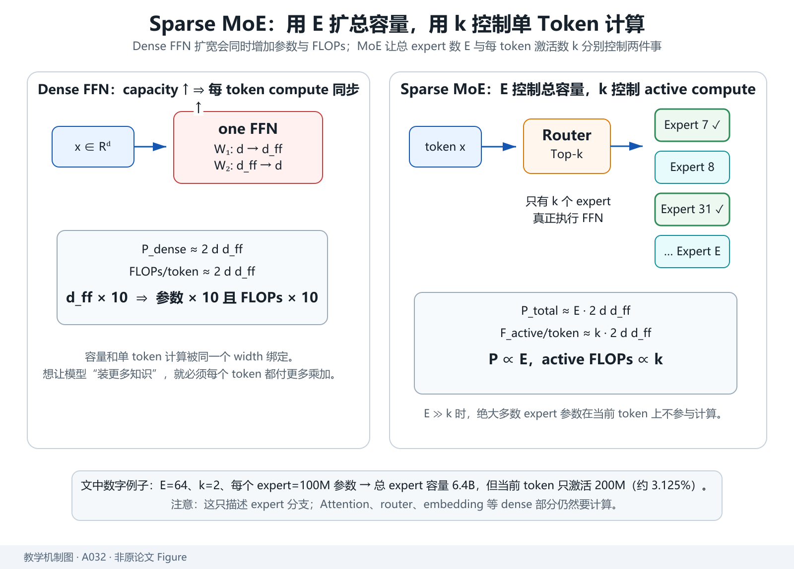
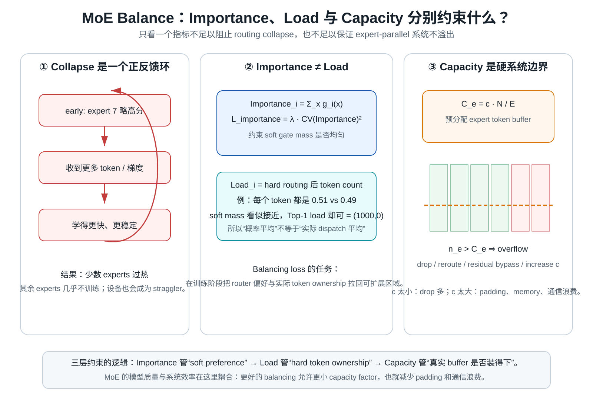
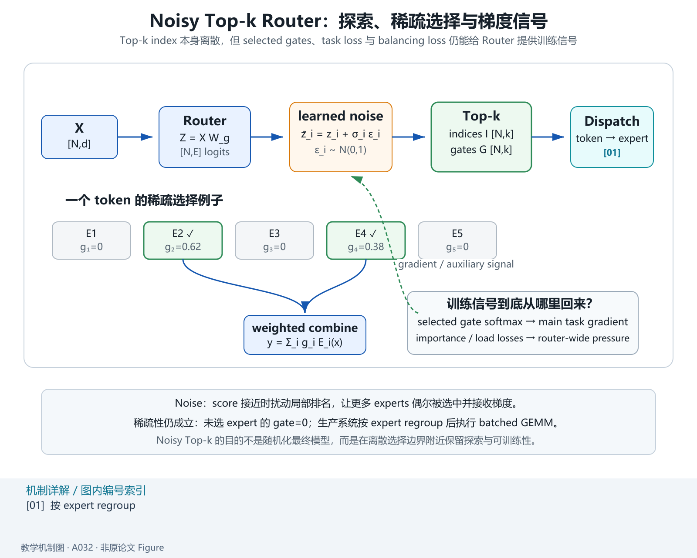
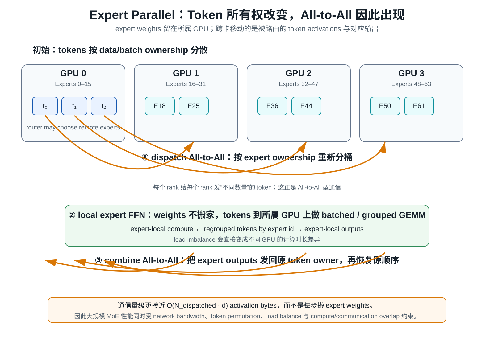

> **原文**：Noam Shazeer 等，*Outrageously Large Neural Networks: The Sparsely-Gated Mixture-of-Experts Layer*, 2017，[arXiv](https://arxiv.org/abs/1701.06538)。对应 Paperlist A/05 第 1 篇。本文提出可扩展的 Sparsely-Gated Mixture-of-Experts（MoE）层：给每个 token 一个 router，仅激活少量专家，从而让**总参数量大幅增长，而单 token 计算量只增长很少**；同时引入 noisy top-k gating、load-balancing 辅助目标与专家并行通信。

# 模型定位与谱系

**主要类型：A 原始方法论文；次要属性：C 分布式条件计算系统。**

技术谱系：

~~~text
Dense FFN
每个 token 都经过同一组参数
        ↓
模型容量增加
= 每 token FLOPs 同时增加
        ↓
早期 Mixture of Experts
多个 experts + gating
        ├─ 理论上可做条件计算
        └─ 难训练、负载不均、分布式难扩展
        ↓
Sparsely-Gated MoE 2017
        ├─ 很多 experts
        ├─ noisy top-k router
        ├─ only k experts active/token
        ├─ load-balancing auxiliary loss
        └─ expert parallel distributed implementation
        ↓
Switch Transformer
Top-1 routing 简化
        ↓
DeepSeekMoE
fine-grained experts + shared experts
        ↓
现代大规模 MoE LLM
~~~

主技术树：

~~~text
Transformer / Sequence Model
└── Feed-Forward Capacity
    └── Conditional Computation
        └── Mixture of Experts
            └── Sparsely-Gated MoE
                ├── Top-k Routing
                ├── Noisy Gating
                └── Load Balancing
~~~

MoE 的第一性原理目标不是“让每个 token 计算更多”，而是：

> **把参数容量和每 token 计算解耦。**

Dense 模型参数和激活 FLOPs高度绑定；Sparse MoE 则允许大部分参数在当前 token 上不参与计算。

# 输入、输出与任务

设输入 token hidden：

$$
x\in\mathbb R^d.
$$

共有：

$$
E
$$

个 experts。

每个 expert 是一个子网络：

$$
E_i(x)\in\mathbb R^d.
$$

最常见是 FFN：

$$
E_i(x)
=
W_{2,i}\phi(W_{1,i}x).
$$

Router 计算 gating logits：

$$
z
=
W_gx
\in\mathbb R^E.
$$

加入噪声后：

$$
\tilde z_i
=
z_i+\epsilon_i.
$$

选择 Top-k：

$$
\mathcal S(x)
=
\operatorname{TopK}(\tilde z,k).
$$

稀疏 gate：

$$
g_i(x)
=
\begin{cases}
\frac{\exp(\tilde z_i)}
{\sum_{j\in\mathcal S(x)}\exp(\tilde z_j)},
&i\in\mathcal S(x),\\
0,&\text{otherwise}.
\end{cases}
$$

MoE 输出：

$$
\boxed{
y
=
\sum_{i=1}^{E}
g_i(x)E_i(x)
}
$$

但实际上只有 `k` 个非零项。

批量：

$$
X\in\mathbb R^{B\times T\times d}.
$$

Router logits：

$$
Z\in\mathbb R^{B\times T\times E}.
$$

Top-k indices：

$$
I\in\mathbb N^{B\times T\times k}.
$$

Dispatch 后每个 expert 接收一部分 token。

# 骨干架构与信息交互

~~~mermaid
flowchart TD
  X["tokens X [N,d]"] --> R["router logits [N,E]"]
  R --> N["noise"]
  N --> TOP["Top-k expert ids + gates"]

  TOP --> D["dispatch tokens"]
  D --> E1["Expert 1 FFN"]
  D --> E2["Expert 2 FFN"]
  D --> EE["... Expert E"]

  E1 --> C["weighted combine"]
  E2 --> C
  EE --> C
  TOP --> C
  C --> Y["Y [N,d]"]
~~~

其中：

$$
N=B\times T
$$

是展平 token 数。

系统实现还有关键一步：

~~~text
router
 ↓
token-to-expert assignment
 ↓
All-to-All / device exchange
 ↓
expert local FFN
 ↓
All-to-All back
 ↓
restore original token order
~~~

所以 MoE 的困难不仅是数学路由，还包括**动态通信和负载均衡**。

# 关键技术

## 1. Dense FFN 为什么把容量和 FLOPs绑在一起

Dense FFN：

*教学解释图｜Capacity Compute Decoupling。*

$$
h
=
W_2\phi(W_1x).
$$

若：

$$
W_1\in\mathbb R^{d\times d_{ff}},
$$

$$
W_2\in\mathbb R^{d_{ff}\times d},
$$

参数量约：

$$
2dd_{ff}.
$$

每 token 主要乘加也约：

$$
2dd_{ff}.
$$

把：

$$
d_{ff}
\to 10d_{ff}
$$

容量增加 10×，每 token FFN FLOPs 也近似 10×。

MoE 改为 `E` 个 FFN，总参数：

$$
P_{\rm MoE}
\approx
E\cdot2dd_{ff}.
$$

若每 token 只激活 `k` 个：

$$
F_{\rm active}
\approx
k\cdot2dd_{ff}.
$$

因此：

$$
\boxed{
P\propto E,
\qquad
\text{active FLOPs}\propto k
}
$$

当：

$$
E\gg k,
$$

参数容量和计算解耦。

## 2. 具体数字例子

设：

$$
E=64,
\qquad
k=2.
$$

每个 expert 参数：

$$
P_e=100M.
$$

总 expert 参数：

$$
6.4B.
$$

每 token 实际 expert 激活参数量：

$$
2\times100M
=
200M.
$$

也就是：

- 总容量 6.4B；
- 当前 token 只使用其中约 3.125%。

这就是 sparse conditional computation 的本质。

但不要把“激活参数 200M”直接等价为“整个模型每 token 只算 200M 参数”，因为 Attention、embedding、router、shared layers 等仍是 dense。

## 3. 为什么最简单 Top-k 会崩成少数 experts

如果 router 早期偶然更偏 expert 7：

*教学解释图｜Balance Capacity Collapse。*

$$
g_7
>
g_i.
$$

那么 expert 7 收到更多 token。

更多 token 意味：

- 更多训练样本；
- 更稳定梯度；
- 更快改善。

于是 router 更可能继续选择它。

形成正反馈：

~~~text
slightly preferred expert
      ↓
receives more data
      ↓
learns faster
      ↓
becomes more preferred
      ↓
load collapse
~~~

最终可能：

- 少数 experts 过载；
- 多数 experts 几乎不训练；
- 并行设备严重不均衡。

所以负载均衡不是“为了好看”，而是 sparse MoE 能否扩展的必要条件。

## 4. Noisy Top-k 为什么有探索作用

Router logits：

*教学解释图｜Noisy Top-k Routing Flow。*

$$
z_i=x^\top w_i.
$$

加入噪声：

$$
\tilde z_i
=
z_i+\sigma_i(x)\epsilon_i.
$$

其中：

$$
\epsilon_i\sim\mathcal N(0,1).
$$

如果两个 expert score 很接近，噪声会让不同 batch 中的排名发生变化。

作用类似探索：

~~~text
without noise:
early small preference → deterministic winner

with noise:
nearby experts occasionally sampled
→ more experts receive gradients
→ router can discover better specialization
~~~

噪声不是最终目的，目的是让离散 Top-k 附近保持探索和可训练性。

## 5. Importance loss 为什么要看 gate mass

定义 expert `i` 的 importance：

$$
\operatorname{Imp}_i
=
\sum_{x\in\mathcal B}
g_i(x).
$$

若 router 完全均衡：

$$
\operatorname{Imp}_1
\approx
\cdots
\approx
\operatorname{Imp}_E.
$$

论文使用 coefficient of variation：

$$
CV(v)
=
\frac{\operatorname{Std}(v)}
{\operatorname{Mean}(v)}.
$$

辅助 loss：

$$
\boxed{
L_{\rm importance}
=
\lambda
CV(
\operatorname{Imp}
)^2
}
$$

若所有 experts importance 相等：

$$
\operatorname{Std}=0
\Rightarrow
L_{\rm importance}=0.
$$

如果一个 expert 吸走大部分 gate mass，variance 增大，loss 惩罚 router。

这个 loss 控制的是：

> 概率质量分配均衡。

它和真正“每个 expert 实际收到多少 token”并不完全等价，因此论文还研究 load 估计。

## 6. 为什么 Load 和 Importance 是两个概念

假设 Top-1 router。

两个 experts 的 softmax gate mass可能：

$$
(0.51,0.49).
$$

但如果所有 token 的第一个都略大：

~~~text
token1: 0.51 vs 0.49 → expert1
token2: 0.52 vs 0.48 → expert1
...
~~~

实际 hard load：

$$
(1000,0).
$$

虽然概率 importance 可能看起来不算极端。

所以：

- Importance：soft gate mass；
- Load：hard routing 后 token count / probability of selection。

高质量 MoE balancing 必须关心真实 dispatch load。

## 7. Capacity 为什么是系统约束而不仅是模型超参

每个 expert 所在 device 的 tensor buffer 必须预先有有限容量。

若 batch token 数：

$$
N.
$$

理想平均每 expert：

$$
N/E.
$$

定义 capacity factor：

$$
c>1.
$$

expert capacity：

$$
\boxed{
C_e
=
c\frac{N}{E}
}
$$

如果某 expert 收到：

$$
n_e>C_e,
$$

多出来的 token 不能无限塞入 buffer。

系统通常需要：

- drop；
- reroute；
- residual bypass；
- 或更大 capacity。

capacity factor 太小：

- token dropping 多；
- 质量下降。

太大：

- padding / buffer 浪费；
- memory 增加；
- communication 不高效。

所以 routing quality 和系统效率通过 capacity 紧密耦合。

## 8. Expert Parallel 为什么自然需要 All-to-All

假设：

*教学解释图｜Expert Parallel All-to-All。*

- GPU 0 放 experts 0–15；
- GPU 1 放 16–31；
- GPU 2 放 32–47；
- GPU 3 放 48–63。

但 GPU 0 当前持有的 input token 可能被 router 选到 expert 50。

所以必须：

~~~text
tokens initially distributed by batch/data parallel
          ↓
router decides expert ownership
          ↓
redistribute token activations across devices
          ↓
local expert compute
          ↓
send expert outputs back
~~~

这种“每个 rank 给每个 rank 发不同数量 token”的通信模式天然接近：

$$
\text{All-to-All}.
$$

所以 MoE scaling 的关键不只在 FFN FLOPs，而在：

- network bandwidth；
- token permutation；
- load balance；
- overlap communication/computation。

## 9. 为什么稀疏路由梯度仍能训练 Router

Top-k index 是离散操作。

对未选 experts：

$$
g_i=0.
$$

其 expert 输出不参与当前 token loss。

对被选 experts，softmax gate：

$$
g_i
=
\frac{e^{z_i}}
{\sum_{j\in S}e^{z_j}}
$$

仍对 selected logits 可微。

Router 梯度还受到：

- main task loss；
- importance/load auxiliary loss；
- noisy gating 的 selection probability

影响。

因此并不是对完整 Top-k ranking 处处光滑求导，而是通过选中路径和辅助概率机制得到可训练信号。

## 10. 最小 PyTorch：Top-2 MoE 信息流

~~~python
import torch
from torch import nn

class Expert(nn.Module):
    def __init__(self, d, hidden):
        super().__init__()

        self.net = nn.Sequential(
            nn.Linear(d, hidden),
            nn.ReLU(),
            nn.Linear(hidden, d),
        )

    def forward(self, x):
        return self.net(x)

class TinyMoE(nn.Module):
    def __init__(
        self,
        d,
        hidden,
        num_experts,
        top_k=2,
    ):
        super().__init__()

        self.router = nn.Linear(
            d,
            num_experts,
            bias=False,
        )

        self.experts = nn.ModuleList(
            [
                Expert(d, hidden)
                for _ in range(num_experts)
            ]
        )

        self.top_k = top_k

    def forward(self, x):
        # x: [N,d]
        logits = self.router(x)                 # [N,E]

        top_val, top_idx = logits.topk(
            self.top_k,
            dim=-1,
        )                                       # [N,k]

        gate = torch.softmax(
            top_val,
            dim=-1,
        )                                       # [N,k]

        out = torch.zeros_like(x)

        for slot in range(self.top_k):
            ids = top_idx[:, slot]

            for e, expert in enumerate(
                self.experts
            ):
                mask = ids == e

                if mask.any():
                    y = expert(
                        x[mask]
                    )

                    out[mask] += (
                        gate[mask, slot, None]
                        * y
                    )

        return out

x = torch.randn(32, 64)

m = TinyMoE(
    d=64,
    hidden=256,
    num_experts=8,
    top_k=2,
)

y = m(x)

assert y.shape == x.shape
~~~

这是教学实现，生产系统绝不会逐 expert Python loop；会先对 token 按 expert 排序/dispatch，再执行 batched GEMM 与 All-to-All。

## 11. 实验结果与证据边界

原论文把 MoE 用于语言建模和机器翻译等任务，并展示数千 experts、极大参数量条件下，单样本只激活少量专家仍能获得更强容量。其代表系统把总参数扩到当时极大的量级，同时保持相对有限计算成本。

实验支持：

- sparse conditional computation 可以真正扩展参数容量；
- noisy routing 与 load balancing 对训练至关重要；
- expert parallel 能跨大量设备实现。

不能推出：

- 总参数越多质量一定单调提高；
- MoE FLOPs 低就一定 wall-clock 更快；
- Top-k 越小永远越好；
- 专家自然会自动形成清晰人类可解释领域分工。

# 预训练与后训练

本文 MoE 层本身与目标函数正交。

语言模型仍可：

$$
L_{\rm task}
=
-\sum_t\log p_\theta(x_t\mid x_{<t}).
$$

总 loss：

$$
\boxed{
L
=
L_{\rm task}
+
\lambda_1L_{\rm importance}
+
\lambda_2L_{\rm load}
}
$$

具体辅助项随实现而异。

因此 MoE 新增的是：

- conditional parameter activation；
- router；
- balancing losses。

它不是 SFT、Preference Learning 或 RL。

# 推理与部署

## Active Parameters

总 expert 参数：

$$
P_{\rm expert,total}
=
E P_e.
$$

单 token 激活：

$$
P_{\rm expert,active}
=
kP_e.
$$

所以 MoE 模型必须同时报告：

- total parameters；
- activated parameters。

只报总参数会高估每 token FLOPs；只报 active 参数又会低估显存/存储容量。

## Prefill / Decode

每个 token 都要：

1. router；
2. dispatch；
3. selected experts；
4. combine。

MoE 不直接降低 Attention 的 `T^2`；它主要替换/扩展 FFN 部分。

## Weight HBM

即便每 token 只激活少量 experts，batch 中不同 token 可能覆盖很多 experts。

小 batch Decode 时：

- expert weight reuse 可能差；
- weight HBM / device communication 可能成为瓶颈。

大 batch 时，按 expert regroup token 能提升 GEMM efficiency。

## Expert Parallel Communication

核心通信通常为：

$$
O(
N_{\rm dispatched}\cdot d
)
$$

activation bytes，而不是把 expert weights 每次发来发去。

因此大规模 MoE 的系统性能取决于 token dispatch 与网络拓扑。

## 技术 → 模型

- Mixture of Experts → Sparsely-Gated MoE：`DERIVED_FROM / EXTENDS`
- Noisy Top-k gating → 本文：`PROPOSES`
- importance/load balancing → 本文：`PROPOSES/IMPLEMENTS`
- Sparsely-Gated MoE → Switch Transformer：后续 `SIMPLIFIES/EXTENDS`
- Sparsely-Gated MoE → DeepSeekMoE：后续 `EXTENDS` expert specialization

## 模型 → 技术

- Dense FFN：`IMPLEMENTS` all parameters active/token
- Sparsely-Gated MoE：`IMPLEMENTS` Top-k conditional expert activation
- Switch Transformer：`DERIVED_FROM` sparse MoE，采用 Top-1
- DeepSeekMoE：`DERIVED_FROM` sparse MoE，进一步细粒度 + shared experts

**验收：** 能否从 dense FFN 推导 `P\propto E`、active FLOPs `\propto k` 的解耦关系，解释为什么 router 会正反馈 collapse，再区分 Importance、Load、Capacity 和 All-to-All 各自解决的不同问题。
