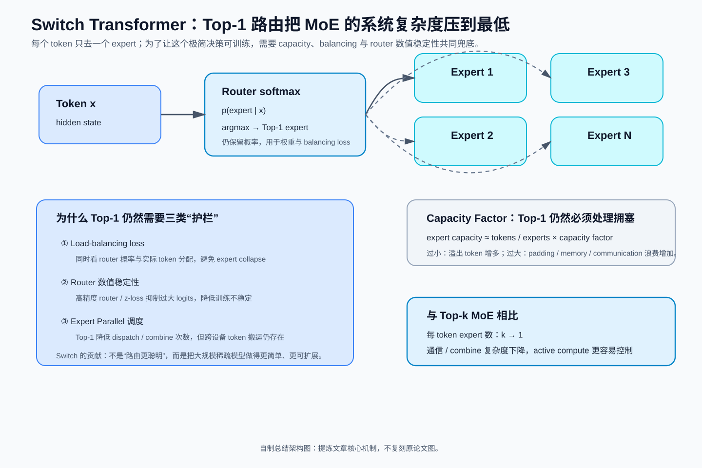

> **原文**：William Fedus, Barret Zoph, Noam Shazeer, *Switch Transformers: Scaling to Trillion Parameter Models with Simple and Efficient Sparsity*, 2021，[arXiv](https://arxiv.org/abs/2101.03961)。对应 Paperlist A/05 第 2 篇。Switch Transformer 把此前 Top-k MoE 进一步简化成**每个 token 只路由到一个 expert（Top-1）**，重点解决大规模稀疏模型训练时的通信、capacity、数值稳定与工程复杂度问题。

# 模型定位与谱系

**主要类型：A 原始方法论文；次要属性：C 大规模 MoE 训练系统。**

技术谱系：

~~~text
Sparsely-Gated MoE
Top-k experts / token
   ├─ capacity 高
   ├─ router 更复杂
   └─ token 需要多 expert dispatch + combine
          ↓
问题：
大规模训练真正瓶颈包含
communication / load balance / numerical instability
          ↓
Switch Transformer
Top-1 routing
   ├─ one token → one expert
   ├─ simpler dispatch
   ├─ lower communication
   ├─ capacity factor
   ├─ auxiliary load balancing
   └─ selective precision for router
          ↓
Trillion-parameter sparse model
~~~

主技术树：

~~~text
Conditional Computation
└── Sparse MoE
    ├── Top-k MoE
    └── Switch MoE
        └── Top-1 Routing
~~~

Switch 的贡献不能只写成“把 k=2 改成 k=1”。真正问题是：**如果只选一个 expert，模型还能保持质量吗？如果可以，就能删掉大量跨 expert combine 与通信复杂性。**

## 总结架构图

> **教学总结图**：用 Top-1 routing、expert capacity、load balancing 与 router 数值稳定性概括 Switch Transformer 的极简 MoE 设计。

# 输入、输出与任务

输入 token：

$$
x\in\mathbb R^d.
$$

共有 `E` 个 experts：

$$
E_i:\mathbb R^d\to\mathbb R^d.
$$

Router logits：

$$
z=W_rx\in\mathbb R^E.
$$

概率：

$$
p_i(x)
=
\frac{e^{z_i}}
{\sum_{j=1}^{E}e^{z_j}}.
$$

选择：

$$
e^\*(x)
=
\arg\max_i p_i(x).
$$

输出：

$$
\boxed{
y
=
p_{e^\*}(x)
E_{e^\*}(x)
}
$$

只有一个 expert forward。

批量展平 token：

$$
X\in\mathbb R^{N\times d},
\qquad N=BT.
$$

Router：

$$
P\in\mathbb R^{N\times E}.
$$

expert ids：

$$
I\in\mathbb N^N.
$$

# 骨干架构与信息交互

~~~mermaid
flowchart TD
  X["tokens [N,d]"] --> R["router softmax [N,E]"]
  R --> TOP["argmax one expert/token"]
  TOP --> CAP["capacity check"]
  CAP --> D["dispatch"]
  D --> E1["Expert 1"]
  D --> E2["Expert 2"]
  D --> EE["Expert E"]
  E1 --> C["restore token order"]
  E2 --> C
  EE --> C
  R --> C
  C --> Y["weighted expert output"]
~~~

与 Top-2 MoE 比较：

~~~text
Top-2:
token → expert A + expert B
      → 2 outputs
      → weighted combine

Switch:
token → expert A
      → 1 output
~~~

所以 dispatch volume 与 expert FLOPs 都更简单。

# 关键技术

## 1. 为什么 Top-1 可以显著降低系统复杂度

Top-k expert compute：

$$
F_{\rm expert}
\propto k.
$$

Dispatch activation volume：

$$
V_{\rm dispatch}
\propto kNd.
$$

Top-2 → Top-1：

$$
\frac{V_{Top1}}{V_{Top2}}
=
\frac12.
$$

在 expert-parallel 系统中，通信常常是昂贵部分，因此减半 dispatch 数有直接系统价值。

同时不再需要多个 expert 输出的：

$$
\sum_{i\in S}g_iE_i(x)
$$

combine。

但总 expert 参数：

$$
EP_e
$$

完全可以继续增大。

## 2. 为什么 Top-1 不等于 Router 不需要概率

虽然 expert id 是：

$$
e^\*=\arg\max p_i,
$$

输出仍乘：

$$
p_{e^\*}(x).
$$

因此 selected router probability 仍影响 main-task gradient。

而完整概率分布 `p_i` 还用于 auxiliary balancing。

所以 Switch 不是把 router 退化成不可训练的硬 hash function。

## 3. Capacity Factor 完整推导

总 token 数：

$$
N.
$$

experts：

$$
E.
$$

理想平均 token/expert：

$$
N/E.
$$

capacity factor：

$$
c.
$$

每 expert 最大容量：

$$
\boxed{
C
=
\left\lceil
c\frac{N}{E}
\right\rceil
}
$$

例如：

$$
N=8192,\quad E=64,\quad c=1.25.
$$

平均：

$$
8192/64=128.
$$

capacity：

$$
C=160.
$$

若 expert 7 被分到 190 个 token：

$$
190-160=30
$$

个 token overflow。

Switch 的实现需要决定这些 token 如何处理；论文讨论 dropped token / residual bypass 等策略。

## 4. 为什么 capacity factor 是效率—质量 trade-off

增大 `c`：

- overflow 更少；
- token dropping 更少；
- 质量通常更安全；

但 expert buffer 预留更大。

所有 experts buffer 容量：

$$
EC
\approx
cN.
$$

所以 padding/空槽比例约随：

$$
c-1
$$

增长。

例如：

### c=1.0

总 slot ≈ N，最省，但任何不均衡都会 overflow。

### c=2.0

总 slot ≈ 2N，容错强，但最坏一半 slot 是空的。

所以 router balancing 与 capacity 是联动的：balance 越好，可以用更低 capacity factor。

## 5. Switch load-balancing loss 为什么同时看概率与实际分配

定义 batch 中 expert `i` 实际 token fraction：

$$
f_i
=
\frac1N
\sum_{x}
\mathbf1[
e^\*(x)=i
].
$$

平均 router probability：

$$
P_i
=
\frac1N
\sum_x
p_i(x).
$$

Switch auxiliary loss：

$$
\boxed{
L_{\rm aux}
=
\alpha E
\sum_{i=1}^{E}
f_iP_i
}
$$

为什么最均衡时是小值？

若完全均衡：

$$
f_i=P_i=\frac1E.
$$

则：

$$
E\sum_i
\frac1E\frac1E
=
E\cdot E\cdot\frac1{E^2}
=
1.
$$

所以：

$$
L_{\rm aux}=\alpha.
$$

若所有 token 集中一个 expert：

$$
f_1=P_1=1.
$$

则：

$$
E\sum_i f_iP_i=E.
$$

惩罚放大到：

$$
\alpha E.
$$

这个目标同时连接：

- hard assignment `f_i`；
- soft router preference `P_i`。

比只看 probability mass 更直接反映实际 load。

## 6. 为什么 bfloat16 训练 Router 可能不稳定

Expert FFN 的大矩阵乘适合 BF16。

但 router 需要：

$$
\operatorname{softmax}(W_rx).
$$

若 logits 很接近或 magnitude 大，低精度舍入可能改变：

$$
\arg\max_i z_i.
$$

而 expert id 是离散的，一点数值变化可能导致完全不同 dispatch path。

例如：

$$
z_1=1.0001,\quad z_2=1.0000.
$$

低精度若两者 round 成相同数，Top-1 tie-breaking 就可能改变 expert。

论文因此使用 **selective precision**：

- 大部分模型 BF16；
- router 局部计算 FP32；
- 再回到低精度。

这是一种“只把数值敏感的小模块保留高精度”的工程设计。

## 7. Router z-loss 为什么抑制过大 logits

Softmax 对统一平移不敏感：

$$
\operatorname{softmax}(z+c\mathbf1)
=
\operatorname{softmax}(z).
$$

所以主 loss 不一定阻止所有 logits 一起变得很大。

过大：

$$
z_i\gg1
$$

会让：

$$
e^{z_i}
$$

数值范围恶化。

后续 Switch 训练 recipe 中使用 router z-loss 一类正则，惩罚 log-partition：

$$
z_{\rm loss}
\propto
\left(
\log
\sum_i e^{z_i}
\right)^2.
$$

作用是控制 router logits scale，改善低精度稳定性。

要区分：

- balancing loss：防 expert collapse；
- z-loss：控制 router 数值幅度。

它们解决不同问题。

## 8. 为什么 Top-1 仍然可以形成专家 specialization

即便每 token 只进一个 expert，router 可以根据 hidden：

$$
x
$$

把不同 token 类型分给不同 experts。

Expert `e` 的训练数据分布：

$$
\mathcal D_e
=
\{
x:e^\*(x)=e
\}.
$$

只要 router 学到内容相关 partition：

$$
\mathcal D_1
\ne
\mathcal D_2
\ne\cdots,
$$

experts 就会在不同子分布上优化。

但 specialization 不等于必须对应人类可解释领域。一个 expert 可能按：

- syntax；
- token position；
- hidden feature；
- language；
- semantic category

等混合模式分工。

## 9. 一个 4-expert 数字例子

4 个 token 的 router：

$$
P=
\begin{bmatrix}
0.7&0.1&0.1&0.1\\
0.6&0.2&0.1&0.1\\
0.1&0.7&0.1&0.1\\
0.1&0.6&0.2&0.1
\end{bmatrix}.
$$

Top-1 assignment：

~~~text
token1 → E1
token2 → E1
token3 → E2
token4 → E2
~~~

所以：

$$
f=(0.5,0.5,0,0).
$$

平均概率：

$$
P_{\rm avg}
=
(0.375,0.4,0.125,0.1).
$$

balance term：

$$
E\sum_i f_iP_i
=
4[
0.5(0.375)
+
0.5(0.4)
].
$$

$$
=
4(0.3875)
=
1.55.
$$

完全均衡最优基线是 1，因此当前 routing 被惩罚。

## 10. 最小 PyTorch：Switch Top-1 + balancing

~~~python
import torch
from torch import nn

class SwitchLayer(nn.Module):
    def __init__(
        self,
        d,
        hidden,
        experts,
    ):
        super().__init__()

        self.router = nn.Linear(
            d,
            experts,
            bias=False,
        )

        self.experts = nn.ModuleList(
            [
                nn.Sequential(
                    nn.Linear(d, hidden),
                    nn.ReLU(),
                    nn.Linear(hidden, d),
                )
                for _ in range(experts)
            ]
        )

    def forward(self, x):
        # x: [N,d]
        logits = self.router(
            x.float()
        )                                       # selective FP32 router

        probs = torch.softmax(
            logits,
            dim=-1,
        )                                       # [N,E]

        expert_id = probs.argmax(
            dim=-1,
        )                                       # [N]

        chosen_prob = probs.gather(
            1,
            expert_id[:, None],
        )                                       # [N,1]

        out = torch.zeros_like(x)

        for e, expert in enumerate(
            self.experts
        ):
            mask = expert_id == e

            if mask.any():
                out[mask] = (
                    chosen_prob[mask]
                    * expert(x[mask])
                )

        one_hot = torch.nn.functional.one_hot(
            expert_id,
            num_classes=len(self.experts),
        ).float()

        f = one_hot.mean(
            dim=0
        )                                       # [E]

        p = probs.mean(
            dim=0
        )                                       # [E]

        aux = (
            len(self.experts)
            * (f * p).sum()
        )

        return out, aux

x = torch.randn(64, 128)

layer = SwitchLayer(
    d=128,
    hidden=512,
    experts=8,
)

y, aux = layer(x)

assert y.shape == x.shape
assert aux.ndim == 0
~~~

教学代码没有 capacity/drop、distributed dispatch、expert parallel 或 fused grouped GEMM。

## 11. 实验结果与证据边界

Switch Transformer 将 sparse MoE 扩展到万亿参数级，并在 T5 风格预训练/迁移任务上比较 dense 与 sparse 模型。论文报告 sparse 模型在相近计算预算下能显著提高 sample efficiency，并展示 Top-1 routing 足以获得很强结果。

论文的重要工程结果包括：

- Top-1 降低 routing/communication；
- selective FP32 router 提高 BF16 稳定性；
- balancing/capacity 是大规模训练必要组件；
- 稀疏模型可以在多语言等任务上迁移。

不能推出：

- 1T 总参数等于每 token 1T FLOPs；
- Switch 一定比所有 dense 模型更低 wall-clock；
- Top-1 在所有模型规模都优于 Top-2；
- experts 数越多无限增加都有效。

# 预训练与后训练

Switch 替换 Transformer 的 FFN：

~~~text
Attention
 ↓
Switch MoE layer
 ↓
Attention
 ↓
Switch MoE layer
~~~

具体频率由模型设计决定。

主预训练 loss 仍为 token objective：

$$
L_{\rm task}.
$$

总 loss：

$$
\boxed{
L
=
L_{\rm task}
+
L_{\rm aux}
+
L_{\rm router\ stability}
}
$$

不同实现是否使用 z-loss 等需要按版本核实。

这不是新的 SFT/RLHF 方法。

# 推理与部署

## Active compute

每 token 只有一个 expert：

$$
k=1.
$$

因此 expert active FLOPs 比 Top-2 近似减半。

## Total parameters

仍可：

$$
P_{\rm total}
=
E P_e+\text{dense params}.
$$

推理显存必须容纳或分布这些 expert weights。

## Small-batch Decode

单 token 只去一个 expert，计算少；但若 experts 分布在多卡，路由通信 latency 可能突出。

## Large-batch Prefill

大量 token 可按 expert regroup：

~~~text
token permutation
 ↓
large expert GEMM
 ↓
inverse permutation
~~~

更容易利用 GPU。

## Capacity at inference

在线 serving 也可能出现瞬时 expert hot spot。训练均衡不代表任意请求 batch 都严格均衡。

## 技术 → 模型

- Sparsely-Gated MoE → Switch：`DERIVED_FROM / SIMPLIFIES`
- Top-1 routing → Switch Transformer：`PROPOSES/POPULARIZES`
- load-balancing `f_iP_i` objective → Switch：`PROPOSES/IMPLEMENTS`
- selective FP32 router → Switch：`IMPLEMENTS`
- Switch → 后续 large MoE LLM：`ADOPTS/INSPIRES`

## 模型 → 技术

- Switch Transformer：`IMPLEMENTS` Top-1 sparse expert routing
- original sparse MoE：通常 `IMPLEMENTS` Top-k noisy gating
- DeepSeekMoE：`DERIVED_FROM` sparse MoE，但使用 fine-grained/shared experts，不是 Switch 的简单复刻
- Dense Transformer：所有 FFN 参数 active，无 routing

**验收：** 能否推导 capacity `C=\lceil cN/E\rceil`，说明 Top-1 如何同时降低 expert FLOPs 与 dispatch volume，再从 `E\sum_i f_iP_i` 分析完全均衡和完全 collapse 两个极端，并区分 balancing loss 与 router numerical-stability loss。
