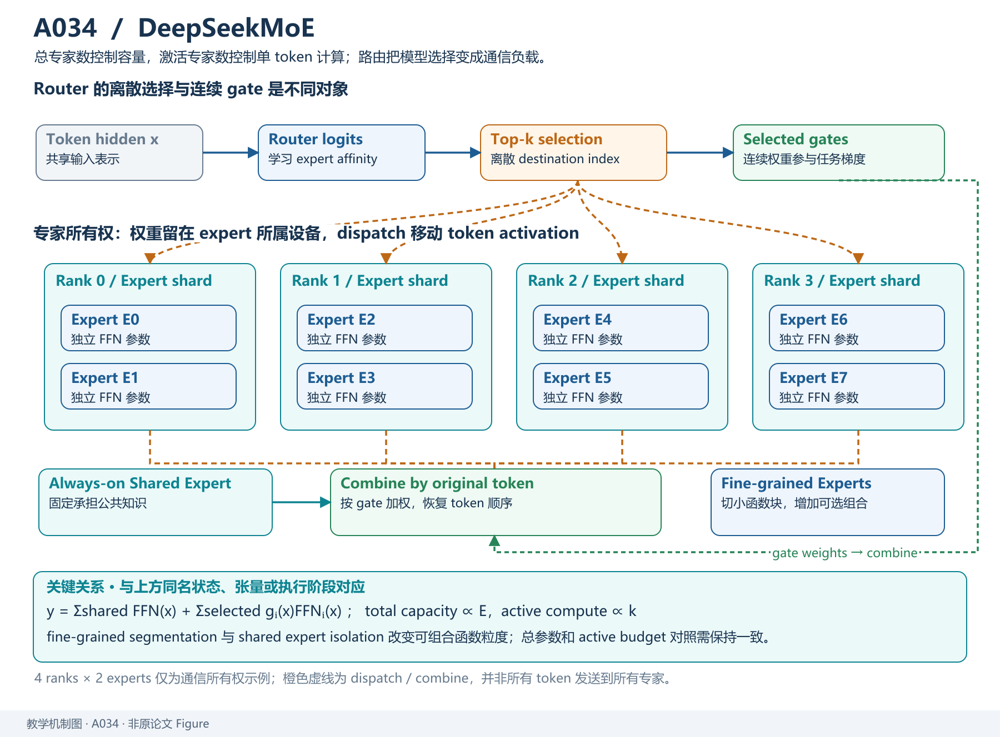
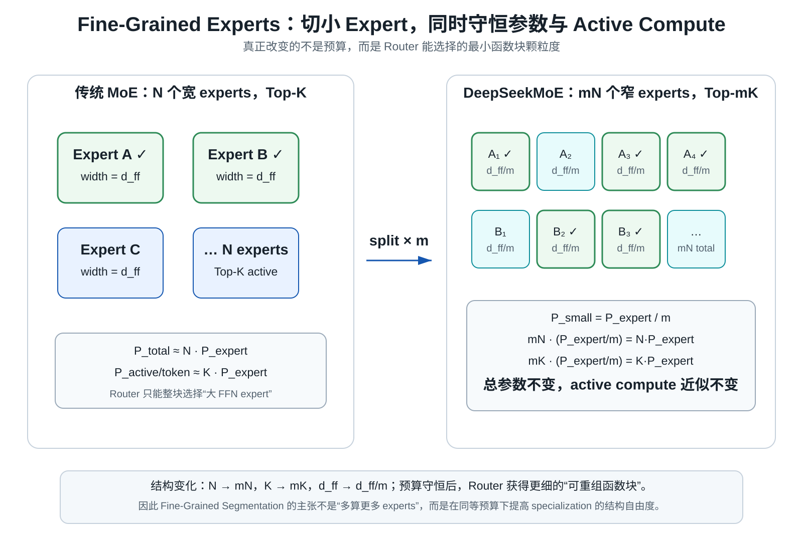
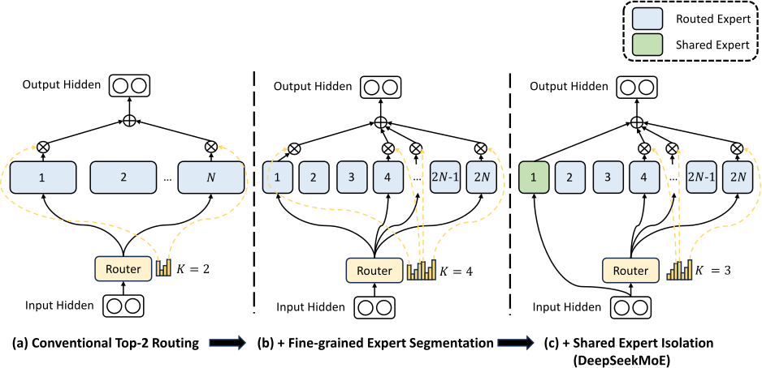
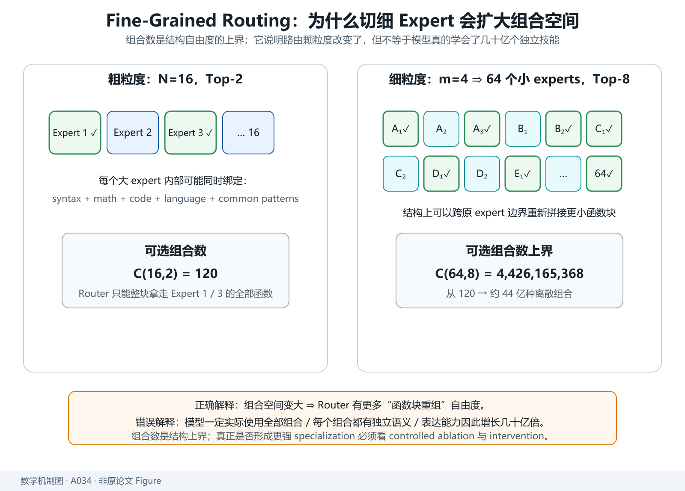
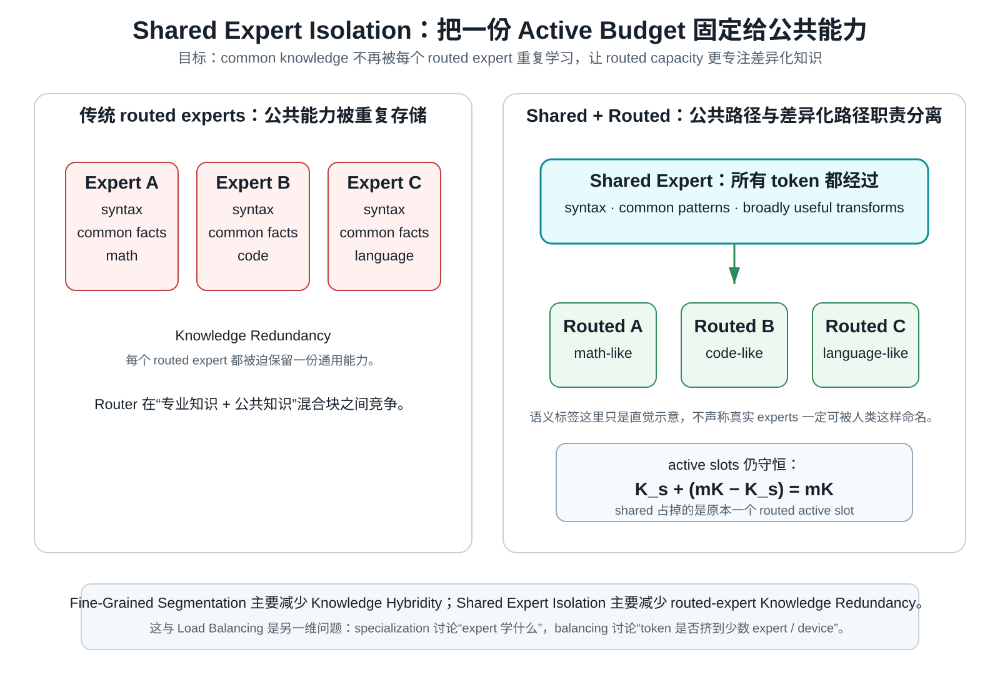
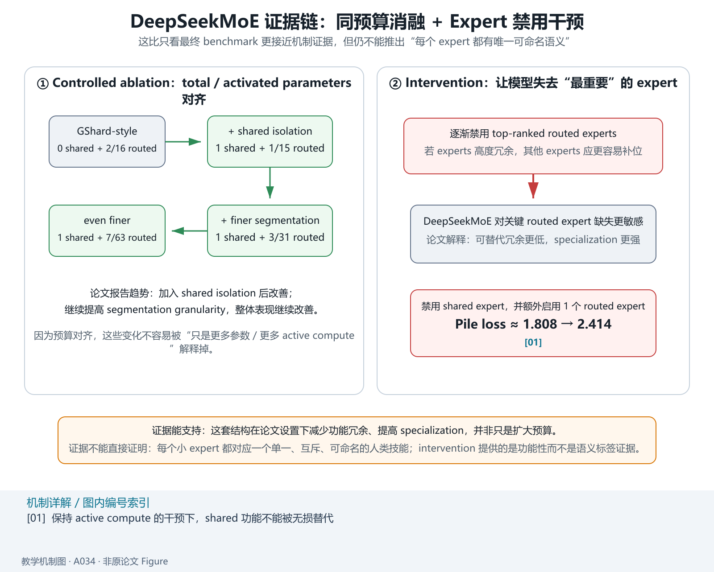
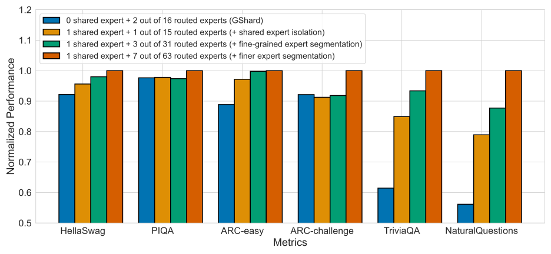
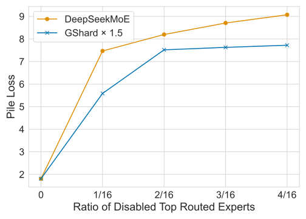

# DeepSeekMoE：MoE 真正浪费的，可能不是“算了太多专家”，而是“每个专家都不够专”

> **原论文**：DeepSeek-AI, [DeepSeekMoE: Towards Ultimate Expert Specialization in Mixture-of-Experts Language Models](https://arxiv.org/abs/2401.06066)，arXiv v1，2024-01-11。  
> **类型**：A · 原始方法论文。  
> **一句话定位**：DeepSeekMoE 不是继续追求“更稀疏”，而是在 **总 expert 参数与每 token active compute 基本不变** 的前提下，用 fine-grained segmentation 提高可组合粒度，再用 shared expert isolation 把共通知识从 routed experts 中剥离，目标是减少 hybridity 与 redundancy。  
> **在当前主线中的位置**：我们先读了 DeepSeek-V3，再向下追到 DeepSeek-V2 的 MLA；现在继续沿 V2/V3 的 FFN 分支下钻，回答一个更局部的问题：**DeepSeekMoE 为什么要把专家切得更细，又为什么要专门留出永远激活的 shared experts？**  
> **原图来源**：[figure_manifests/A034.json](../../../figure_manifests/A034.json)。

## 阅读导航：这是 V2 / V3 的 FFN 技术下钻页

**前置阅读**

- [DeepSeek-V2](../../B/05-moe-complete-llm/B008-deepseek-v2.md) —— 先知道 DeepSeekMoE 在完整 Transformer 中替换的是 FFN 分支；
- [DeepSeek-V3](../../B/05-moe-complete-llm/B009-deepseek-v3.md) —— 先看细粒度 experts 进一步怎样变成负载均衡、expert parallel 与通信问题；
- [Sparsely-Gated MoE](A032-sparsely-gated-moe.md) / [Switch Transformer](A033-switch-transformer.md) —— 如果 Top-K sparse routing 的基本范式还不熟，再回查。

**读完往哪里去**

- 回 [DeepSeek-V2](../../B/05-moe-complete-llm/B008-deepseek-v2.md) 看 2 shared + 160 routed experts 怎样进入完整模型；
- 回 [DeepSeek-V3](../../B/05-moe-complete-llm/B009-deepseek-v3.md) 看 1 shared + 256 routed experts、Top-8 routing 与 auxiliary-loss-free balancing；
- 模型主线继续到 [DeepSeek-R1](../../B/05-moe-complete-llm/B010-deepseek-r1.md)，那里不再改 MoE 主干，而是重点进入 reasoning post-training。

**本文重点**

1. “专家很多”为什么仍然可能不够专业；
2. fine-grained segmentation 怎样在相同参数 / active compute 预算下增加路由组合自由度；
3. shared expert isolation 到底解决什么 redundancy；
4. specialization 与 load balancing 为什么是两个不同问题；
5. Figure 3 的消融怎样分别隔离 segmentation / shared expert 的贡献；
6. Figure 4 的“禁用 top experts”实验到底支持什么，又不能证明什么。

如果只把 MoE 理解成：

> 很多 FFN，router 每次选几个，所以总参数很大、计算量很小。

那么 DeepSeekMoE 看起来会非常奇怪。

传统 MoE 已经会 Top-K 路由了，为什么还要：

1. 把一个 expert 拆成更多、更小的 experts；
2. 反而让每个 token 激活更多 experts；
3. 再额外放一部分 shared experts，让所有 token 都必须计算？

表面上看，这甚至像在把稀疏 MoE 又做稠密一点。

DeepSeekMoE 的出发点其实不是继续压 FLOPs，而是反过来问：

> **在 total parameters 和 active compute 已经固定的情况下，现有 MoE 有没有把这些专家参数真正用好？**

作者把问题概括成两个词：

- **Knowledge Hybridity**：一个 expert 里混进了太多种不同知识；
- **Knowledge Redundancy**：不同 experts 又重复学习了很多相同知识。

于是这篇论文真正优化的对象不是稀疏率，而是：

> **专家参数的职责分工。**

整篇论文可以先压成这一条因果链：

~~~text
传统 sparse MoE
每 token 只选 Top-K
        ↓
但 expert 数通常很少（8 / 16）
        ↓
每个 expert 很大，必须同时容纳多类知识
        ↓
Knowledge Hybridity

与此同时：
不同 token 虽然走不同 experts
但都需要语法、常识等共享能力
        ↓
多个 experts 各自重复学一份
        ↓
Knowledge Redundancy

于是：
把大 expert 切成更多小 expert
        ↓
Fine-Grained Expert Segmentation
        ↓
token 可以组合更多知识组件

再把共通知识单独拿出来
        ↓
Shared Expert Isolation
        ↓
routed experts 更专注差异化知识

目标：
在相同 total expert params
和相同 active expert compute 下
获得更高 expert specialization
~~~

*自制解释图，不是原论文 Figure。先把作者的两个问题一一对应起来：fine-grained segmentation 主要对付 Knowledge Hybridity；shared expert isolation 主要对付 Knowledge Redundancy。后面的实验再分别检查这两种结构变化是否真的带来收益。*

*教学解释图｜细粒度 routed experts 与 shared experts 分工组合，在固定 active compute 下扩大可组合专家空间。*

## 1. 先把传统 MoE 写清楚：Router 能选 expert，但不能选 expert 内部的知识子块

普通 Transformer 的 FFN：

$$
h_t^l
=
\operatorname{FFN}(u_t^l)+u_t^l.
$$

Sparse MoE 把这个单一 FFN 换成：

$$
h_t^l
=
\sum_{i=1}^{N}
g_{i,t}
\operatorname{FFN}_i(u_t^l)
+
u_t^l.
$$

其中 $N$ 是 experts 总数。

router 计算 token 与第 $i$ 个 expert 的 affinity：

$$
s_{i,t}
=
\operatorname{Softmax}_{i}
\left(
(u_t^l)^\top e_i^l
\right),
$$

然后只有 Top-$K$ 的 gate 非零：

$$
g_{i,t}
=
\begin{cases}
s_{i,t},
&
s_{i,t}
\in
\operatorname{TopK}
(\{s_{j,t}\}_{j=1}^{N},K),
\\[4pt]
0,
&
\text{otherwise}.
\end{cases}
$$

于是一个 token 只计算：

$$
K\ll N
$$

个 experts。

这已经实现 conditional computation。

但 router 的控制粒度只能到：

> 进哪个 FFN expert。

它不能说：

> 我只要 Expert 3 里的数学子能力和 Expert 7 里的代码子能力，但不要它们内部其他部分。

如果每个 expert 自己就是一个很宽的大 FFN，那么路由仍然很粗。

这就是第一个问题。

## 2. Knowledge Hybridity：专家数量太少时，一个 expert 很容易变成小型杂货铺

论文 Introduction 特别指出，当实践中只有 8 或 16 个 experts 时，一个 expert 收到的 token 很可能覆盖多种不同知识。

可以想象成：

~~~text
Expert 1
  syntax
  common words
  some code
  factual recall

Expert 2
  math
  English
  some code
  reasoning

Expert 3
  Chinese
  factual recall
  syntax
  ...
~~~

即使 router 已经把 token 分流，expert 内部仍可能混合许多能力。

作者称之为：

> **Knowledge Hybridity。**

问题不是一个 expert 不能表示多种知识。

问题是：

> 如果这些知识只在部分 token 上同时有用，却被绑在一个大 expert 里，router 就无法重新组合更细的能力。

这像有 16 个巨大的工具箱，每次允许选 2 个箱子。

箱子里可以有几百种工具，但 router 只能整箱做决定。

DeepSeekMoE 的第一步就是：

> **把箱子拆小。**

## 3. Fine-Grained Expert Segmentation：专家切小以后，为什么总参数和 active compute 都能不变？

假设传统 MoE 有：

*教学解释图｜Fine Grained Budget Invariants。*

$$
N
$$

个 experts，每个 expert 的 intermediate width 是：

$$
d_{\mathrm{ff}}.
$$

每 token 激活：

$$
K
$$

个 experts。

对于一个普通两层 FFN：

$$
W_1\in\mathbb R^{d\times d_{\mathrm{ff}}},
\qquad
W_2\in\mathbb R^{d_{\mathrm{ff}}\times d}.
$$

忽略 bias：

$$
P_{\mathrm{expert}}
\approx
2dd_{\mathrm{ff}}.
$$

即使是 gated FFN，主要参数量和 FLOPs 对 $d_{\mathrm{ff}}$ 仍近似线性。

现在把每个 expert 切成 $m$ 份：

$$
d_{\mathrm{ff}}'
=
\frac{d_{\mathrm{ff}}}{m}.
$$

expert 总数：

$$
N
\rightarrow
mN.
$$

每个小 expert 参数：

$$
P_{\mathrm{small}}
=
\frac{1}{m}P_{\mathrm{expert}}.
$$

因此总 expert 参数：

$$
mN
\cdot
\frac{1}{m}
P_{\mathrm{expert}}
=
NP_{\mathrm{expert}}.
$$

所以：

$$
\boxed{
P_{\mathrm{total\ expert}}
\text{ 不变}
}
$$

但如果拆完仍只激活 $K$ 个小 experts，那么 active compute 会降为原来的 $1/m$。

这会破坏公平比较。

因此论文同时让：

$$
K
\rightarrow
mK.
$$

新的 active expert compute：

$$
mK
\cdot
\frac{1}{m}
P_{\mathrm{expert}}
=
KP_{\mathrm{expert}}.
$$

得到第二个关键不变量：

$$
\boxed{
P_{\mathrm{active/token}}
\text{ 也近似不变}
}
$$

这就是 Fine-Grained Expert Segmentation 最干净的地方：

> **不靠更多总参数，也不靠更多 active compute，而只是重新安排专家颗粒度。**

## 4. 原论文 Figure 2：三种结构的预算其实是对齐的

*左：传统 Top-2；中：每个 expert 切两份，总 expert 从 $N$ 变成 $2N$，激活从 2 变 4；右：再隔离 1 个 shared expert，于是 shared 永远激活，routed 部分只需要 Top-3。三种结构保持相同的 expert 参数量和计算成本。*

图的重点不是颜色，而是预算守恒：

~~~text
(a)
N 个大 experts
Top-2

(b)
2N 个半宽 experts
Top-4

(c)
1 shared expert
+
(2N - 1) routed experts
Top-3 routed
+
1 shared
=
总共仍激活 4 份小 expert
~~~

所以 shared expert 的收益不能简单解释成：

> 多算了一个 FFN。

作者专门把 routed active count 减掉一份，维持同等 active compute。

## 5. 为什么专家切细以后，组合自由度会爆炸？

论文给了一个很直观的例子。

*教学解释图｜Combinatorial Routing Space。*

传统：

$$
N=16,
\qquad
K=2.
$$

组合数：

$$
\binom{16}{2}
=
120.
$$

若每个 expert 切成 4 份：

$$
m=4,
$$

则：

$$
mN=64,
\qquad
mK=8.
$$

组合数：

$$
\binom{64}{8}
=
4{,}426{,}165{,}368.
$$

从 120 变成四十多亿。

但这只能解释成：

> **路由组合的离散上界大幅扩大。**

不能推成：

- 模型真的使用了所有组合；
- 每个组合都有独立语义；
- 表达能力增长几十亿倍；
- 组合数越大一定越好。

真正重要的是：

> **粗粒度函数块变成更小函数块以后，router 可以按 token 重新组合这些块。**

这才是作者所谓 more flexible combination 的结构含义。

## 6. 从函数角度看，Fine-Grained Segmentation 增加的是什么自由度？

假设一个粗 expert 实际学成：

$$
f_A(x)
=
f_{\mathrm{syntax}}(x)
+
f_{\mathrm{math}}(x)
+
f_{\mathrm{English}}(x).
$$

另一个：

$$
f_B(x)
=
f_{\mathrm{syntax}}'(x)
+
f_{\mathrm{code}}(x)
+
f_{\mathrm{English}}'(x).
$$

某个 token 主要需要 math + code。

传统 Top-2 只能选择：

~~~text
整个 Expert A
+
整个 Expert B
~~~

于是很多并不需要的部分也一起绑定进来。

如果更细：

~~~text
A1 ≈ math
A2 ≈ English
A3 ≈ syntax

B1 ≈ code
B2 ≈ English
B3 ≈ syntax
~~~

router 在结构上就有机会选择：

~~~text
A1 + B1 + 必要的 common component
~~~

这不代表真实模型一定自动形成如此清晰的可解释模块。

更准确的说法是：

> **Fine-Grained Segmentation 为更高 specialization 提供了更细的结构自由度。**

后面的消融和干预实验再验证这种自由度是否真的被利用。

### 这一组你应该记住什么

- Fine-Grained Segmentation 不是“无条件增加更多专家计算”，而是把大 expert 切小，同时把 active count 按比例增加；
- 因为每个小 expert 更窄，所以 total expert parameters 与 active expert compute 可以近似保持不变；
- 真正增加的是 router 可以重新组合的**函数块颗粒度**；
- 组合数爆炸只是结构自由度上界，不能直接解释成模型表达能力增长几十亿倍。

### 如果你卡在这里

- 不懂 Top-K sparse MoE 的基本公式 → 回 [Sparsely-Gated MoE](A032-sparsely-gated-moe.md)；
- 不懂“相同 active compute”为什么成立 → 重算 §3 中每个 expert width 与 active expert count 的缩放；
- 想知道“切细以后到底有没有真的更专” → 继续看 §9–§10 的 controlled ablation 与 redundancy intervention。

---

## 7. Shared Expert Isolation：既然已经切细，为什么还要让一部分 expert 永远激活？

Fine-Grained Segmentation 主要解决：

*教学解释图｜Shared Expert Isolation。*

> 一个 routed expert 内部混了太多种彼此不一定同时需要的知识。

但它还没有解决另一个问题。

假设大量 token 都需要：

- 基础语法；
- 高频语言模式；
- 通用事实表示；
- 常见的局部变换。

如果这些公共能力只能放在 routed experts 里，那么不同 expert 很可能都被迫各学一份：

~~~text
Expert A
├── 自己的领域知识
└── 一份 common knowledge

Expert B
├── 自己的领域知识
└── 又一份 common knowledge

Expert C
├── 自己的领域知识
└── 再一份 common knowledge
~~~

这就是作者所说的：

> **Knowledge Redundancy。**

DeepSeekMoE 的第二个结构变化是：

> **把一小部分 experts 从竞争路由中拿出来，变成 shared experts，让所有 token 都经过它们。**

完整一层可以写成：

$$
h_t^l
=
sum_{i=1}^{K_s}
operatorname{FFN}_i^{(s)}(u_t^l)
+
sum_{i=K_s+1}^{mN}
g_{i,t}
operatorname{FFN}_i^{(r)}(u_t^l)
+
u_t^l.
$$

其中：

- $K_s$ 个 shared experts 永远激活；
- 其余是 routed experts；
- routed Top-K 的数量不再是原本完整的 $mK$，而是：

$$
mK-K_s.
$$

于是总 active expert 份数仍然保持：

$$
K_s+(mK-K_s)=mK.
$$

所以 Figure 2(c) 的关键不是：

> “额外多算了一个 shared FFN。”

而是：

> **把一份原本参与竞争路由的 active compute，改成永远提供 common knowledge 的 shared capacity。**

### 7.1 这不是“DeepSeek 第一次发明 shared expert”

论文在 Related Work / Method 语境里明确把 shared experts 的先行原型追溯到已有 MoE 工作，例如 DeepSpeed-MoE 一类设计。

因此更准确的贡献边界是：

- shared expert 作为结构原型并非 DeepSeekMoE 首次出现；
- DeepSeekMoE 把它和 fine-grained segmentation 组合，并明确从 **“隔离共通知识、减少 routed-expert redundancy、促进 specialization”** 的算法目标来组织整个方法。

这也是为什么知识图谱里应该写：

> DeepSeekMoE **PROPOSES 这套 specialization-oriented combination / formulation**，

而不能简单写：

> DeepSeekMoE “发明了 shared expert”。

---

## 8. Specialization 和 Load Balancing 是两个不同问题，不要混在一起

到了这里很容易把两件事混掉：

*教学解释图｜Specialization Evidence。*

### 问题 A：expert 学得够不够“专”

这是本文主问题：

- Knowledge Hybridity；
- Knowledge Redundancy；
- fine-grained segmentation；
- shared expert isolation。

### 问题 B：router 会不会把 token 全挤到少数 experts

这是训练 / 系统稳定性问题：

- routing collapse；
- device load imbalance；
- straggler；
- 跨设备通信压力。

DeepSeekMoE 原论文仍然需要额外的负载均衡约束。

论文给出 expert-level balance loss，形式可概括为：

$$
L_{mathrm{ExpBal}}
=
alpha_1
sum_i f_i P_i,
$$

其中：

- $f_i$ 表示 expert $i$ 的归一化选中频率；
- $P_i$ 表示 batch 上的平均 routing affinity。

同时，为了避免某个设备承载的 routed experts 整体过热，还引入 device-level balance：

$$
L_{mathrm{DevBal}}
=
alpha_2
sum_d f'_d P'_d.
$$

它把一组 experts 聚合到 device 粒度再看负载。

作者的实际取舍是：

- expert-level balance 系数较小，用来防止极端 routing collapse；
- device-level balance 可以更强，优先保证设备计算负载不要严重失衡。

这正好解释后续演化：

~~~text
DeepSeekMoE / V2
仍依赖多种 auxiliary balancing losses
        ↓
问题：
系统平衡约束会通过 loss 直接影响主任务梯度
        ↓
DeepSeek-V3
主要改成 routing bias 调 selection
        ↓
把“选谁的系统校正”
尽量和“语言模型主 loss”拆开
~~~

所以理解 V3 的 auxiliary-loss-free balancing，必须知道它不是凭空出现的；它是在修前代 MoE 的实际训练矛盾。

---

## 9. 原论文 Figure 3：作者怎样把两个设计拆开做 controlled ablation？

这张图非常重要，因为它比“最终模型赢了多少 benchmark”更接近因果证据。

作者比较的几个结构保持：

> **相同 total parameters 与相同 activated parameters。**

核心变化大致沿着：

~~~text
传统 GShard 风格
0 shared + 2 / 16 routed
        ↓
只加入 shared isolation
1 shared + 1 / 15 routed
        ↓
再把 routed experts 切细
1 shared + 3 / 31 routed
        ↓
继续更细
1 shared + 7 / 63 routed
~~~

这里最该看的不是具体颜色，而是：

> **预算基本对齐，只改变专家结构。**

论文报告的趋势是：

1. 加入 shared expert isolation 后，多数 benchmark / validation 指标改善；
2. 在保持预算的前提下继续提高 segmentation granularity，整体性能继续呈改善趋势。

### 这张图支持什么？

它支持：

> 在论文实验设置下，shared expert isolation 与更细的 expert segmentation 都能贡献可测的性能收益，而且收益不能简单归因于“更多参数 / 更多 active compute”。

### 它没有直接证明什么？

它并没有直接证明：

- 每个小 expert 都形成了人类可命名的单一技能；
- 更细一定可以无限继续；
- expert 组合数越大，效果就必然越好；
- shared expert 学到的全部内容都严格等于“共通知识”。

这些都是比消融结果更强的解释。

---

## 10. 原论文 Figure 4：作者怎样把“参数冗余”变成一个可干预的实验问题？

“Knowledge Redundancy”本来是一个很抽象的词。

作者把它变成了一个 intervention：

> 如果 routed experts 之间真的高度冗余，那么把当前最重要的一部分 routed experts 禁用掉，其他 experts 应该比较容易顶上来。

反过来：

> 如果每个 routed expert 更不可替代，禁用 top experts 后性能应该掉得更快。

论文用一个与 DeepSeekMoE 在正常条件下 Pile loss 匹配的 GShard 对照，逐渐禁用 top-ranked routed experts。

结果是：

> DeepSeekMoE 对禁用关键 routed experts 更敏感。

作者把这种更强敏感性解释为：

> **routed experts 之间的可替代冗余更低，说明 specialization 更强。**

论文还做了一个很有意思的 shared-expert 干预：

- 禁用 shared expert；
- 为了保持 active compute 不变，额外启用一个 routed expert；
- Pile loss 从约 $1.808$ 上升到 $2.414$。

这说明在该模型与训练设置里：

> shared expert 承担的那部分功能，并不能简单靠“多选一个 routed expert”无损替代。

### 但仍然要保留证据边界

这种 intervention 强于单纯可视化，因为它真的改变模型路径再看性能。

但它仍然只是**功能性证据**：

- top expert 被禁用后更敏感；
- shared expert 被拿掉后损失变差。

它不能直接给出每个 expert 的语义标签，更不能严格证明 routed experts 彼此学习了完全互斥的知识集合。

---

## 11. 最终 scaling 结果应该怎样读：先区分 controlled evidence 与整模型对比

DeepSeekMoE 论文还报告了不同规模的模型结果。

例如论文强调：

- 2B 级 DeepSeekMoE 在较低 expert 参数 / compute 下，可以做到与更大 GShard 对照相当；
- 16B 级模型与 LLaMA2 7B 做比较时，论文强调其较低训练计算成本下的竞争力；
- 145B 级实验被作者明确写成 preliminary exploration，用来观察方法扩展到更大规模是否仍成立。

这些结果适合支持：

> **这种 expert-organization 原则能够扩展到更大模型，并具有实际效率价值。**

但它们的证据强度和 Figure 3 不一样。

### Figure 3

更接近：

> 同预算 controlled ablation，隔离结构变化。

### 跨模型 scaling / benchmark

往往同时改变：

- 模型规模；
- 数据；
-训练 token 数；
- recipe；
- baseline family。

因此更适合说明：

> “整套方法最终可以做成有竞争力的模型”，

而不是用来单独证明某一个结构细节的因果作用。

尤其论文对 145B 部分使用 preliminary 一类限定词时，中文解读也应该保留这种证据强度。

---

## 12. 论文细读：作者其实是先造出两个“失败模式”，再让两个设计一一对应

### 12.1 Introduction 为什么先命名 Knowledge Hybridity / Redundancy？

因为这两个词不是普通背景。

它们直接决定 Method 的两块结构：

~~~text
Knowledge Hybridity
        ↓
Fine-Grained Expert Segmentation

Knowledge Redundancy
        ↓
Shared Expert Isolation
~~~

这是很值得学习的技术论文写法：

> 先定义“现有方法到底浪费在哪里”，再让每个结构变化都能回答一个具体失败模式。

### 12.2 “Ultimate Expert Specialization” 更像研究目标，不是已经被严格证明的终点

标题中的 ultimate 很强。

但论文真实证据包括：

- 同预算消融；
- expert disabling intervention；
- validation / benchmark；
- scaling 实验。

这些证据支持：

> specialization-oriented design 有效。

它们并不能把“ultimate”变成数学意义上的最优性定理。

所以技术博客更适合写：

> “朝更强 expert specialization 推进”，

而不是：

> “证明这种设计实现了终极专家专业化”。

### 12.3 作者主动引用 shared expert 原型，反而帮助我们划清 novelty

高质量论文阅读不能看到一个模块出现在方法里，就默认它是本文首次发明。

这里更准确的 novelty 是：

1. 用 fine-grained segmentation 系统地改变 expert granularity；
2. 把 shared expert isolation 明确组织成降低 knowledge redundancy 的机制；
3. 在相同参数 / active compute 下做结构对齐实验；
4. 用干预实验进一步支撑 specialization / redundancy 的解释。

这比简单说“提出 shared expert”准确得多。

### 12.4 工程翻译：这篇论文真正教的是“把参数容量重新组织”

如果把方法翻译成工程语言：

> **不是一味增加总参数，也不是一味降低 FLOPs，而是在固定预算下重新定义“可被路由选择的最小函数块”和“哪些函数块不应该参与竞争”。**

这就是为什么它后来能自然成为 DeepSeek-V2 / V3 的 FFN 主干。

---

## 13. 回到 DeepSeek-V2 / V3：原始方法最后怎样变成大模型里的具体配置？

读原始方法论文的最后一步必须回到模型。

### DeepSeek-V2

[DeepSeek-V2](../../B/05-moe-complete-llm/B008-deepseek-v2.md) 采用：

- 2 shared experts；
- 160 routed experts；
- 每 token 激活 6 个 routed experts。

这说明原论文里的“shared + many smaller routed experts”已经从小规模结构实验变成完整 236B MoE 的 FFN 参数化。

### DeepSeek-V3

[DeepSeek-V3](../../B/05-moe-complete-llm/B009-deepseek-v3.md) 继续采用并调整为：

- 1 shared expert；
- 256 routed experts；
- 每 token 激活 8 个 routed experts。

但 V3 还额外处理了一个原始 DeepSeekMoE 没彻底解决的问题：

> **大规模 expert routing 怎样在不强力污染主任务 loss 的情况下保持负载均衡。**

所以技术演化更准确地写成：

~~~text
DeepSeekMoE
PROPOSES / FORMULATES:
fine-grained expert segmentation
+ shared expert isolation
        ↓
DeepSeek-V2
ADOPTS:
作为主模型 FFN 路径
+ 多种 auxiliary balancing
        ↓
DeepSeek-V3
ADOPTS / EXTENDS:
更大 expert pool
+ routing-bias-based main balance
+ 更复杂 expert parallel / communication overlap
~~~

这条链比一句“V3 使用 DeepSeekMoE”信息量大得多。

---

## 14. 读完 DeepSeekMoE 后，应该把问题带回哪一篇？

### 如果你卡在“为什么 expert 切小仍不增加计算”

→ 回本文 §3，把 expert width 缩小 $m$ 倍、active count 增大 $m$ 倍重新算一遍。

### 如果你卡在“shared expert 到底有什么用”

→ 看 §7，再对照 Figure 4 的 shared-expert disabling intervention。

### 如果你卡在“specialization 和 load balance 有什么区别”

→ 看 §8，然后回 [DeepSeek-V3](../../B/05-moe-complete-llm/B009-deepseek-v3.md) 的 auxiliary-loss-free balancing。

### 如果你卡在“这些方法在完整大模型哪里执行”

→ 回 [DeepSeek-V2](../../B/05-moe-complete-llm/B008-deepseek-v2.md) / [DeepSeek-V3](../../B/05-moe-complete-llm/B009-deepseek-v3.md) 的 Transformer block 数据流。

### 如果你现在想继续模型主线

→ [DeepSeek-R1](../../B/05-moe-complete-llm/B010-deepseek-r1.md)，从“模型如何构建”切换到“强 Base 怎样通过后训练改变 reasoning policy”。

### 读完本篇至少应该能回答

1. Knowledge Hybridity 与 Knowledge Redundancy 分别是什么？
2. 为什么把 $N$ 个宽 expert 改成 $mN$ 个窄 expert 可以保持总 expert parameters 不变？
3. 为什么 active expert count 还必须从 $K$ 变成 $mK$？
4. 组合数暴涨为什么不能直接解释成表达能力暴涨？
5. shared expert 为什么不会必然增加 active compute？
6. 为什么 shared expert 更适合承接 common knowledge？
7. shared expert 原型与 DeepSeekMoE 本文的 novelty 应该怎样区分？
8. expert specialization 与 expert load balance 为什么是两个不同问题？
9. Figure 3 为什么比最终 leaderboard 更能隔离两个结构设计的贡献？
10. Figure 4 的 disabling intervention 为什么可以作为 redundancy 的功能性证据？
11. 为什么这种证据仍不能严格证明“每个 expert 都有单一可命名语义”？
12. DeepSeek-V2 / V3 分别怎样把这套原始方法变成完整 MoE 配置？
