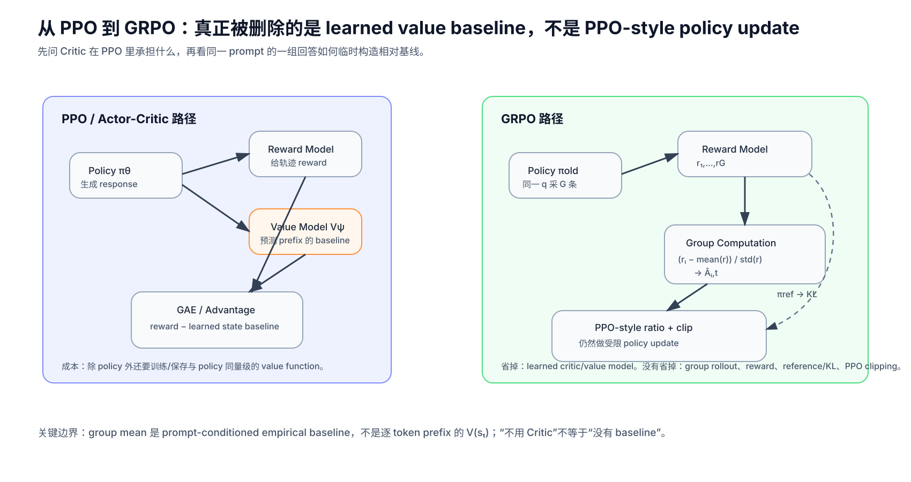
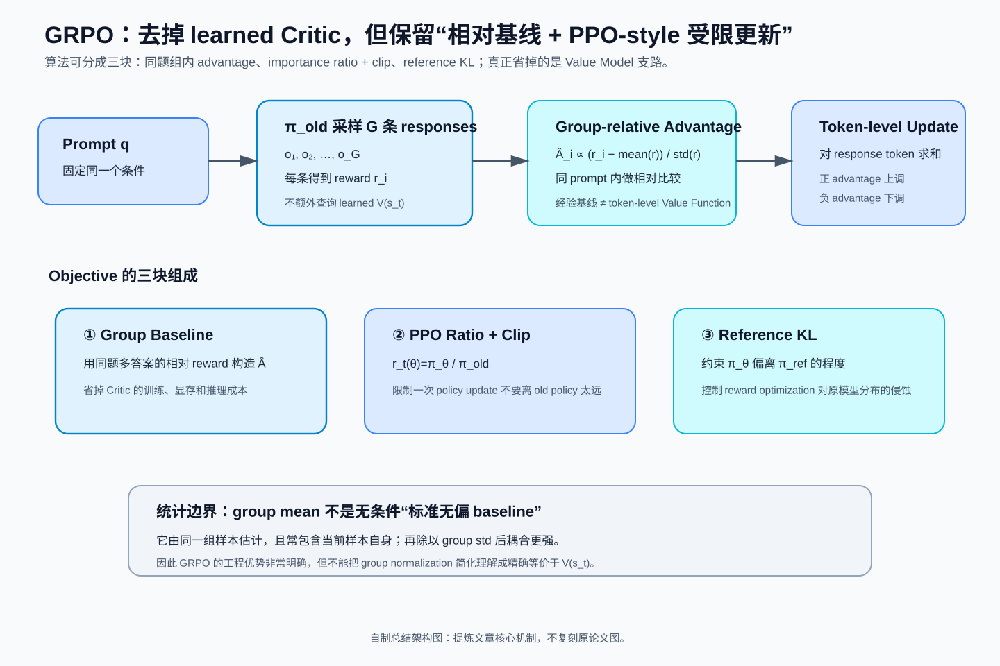
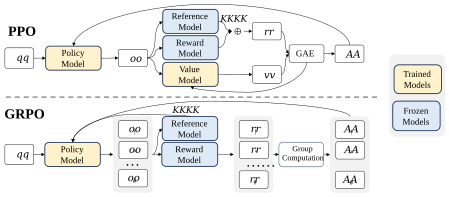
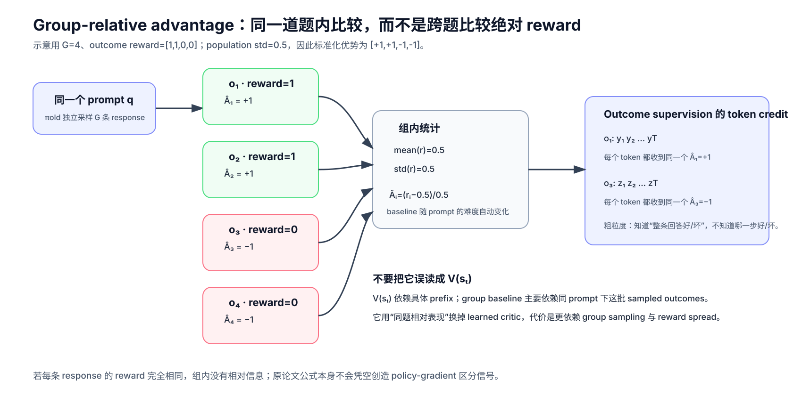
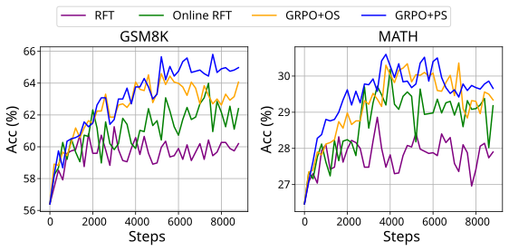
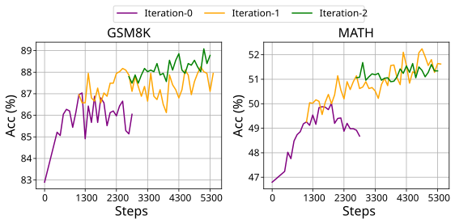
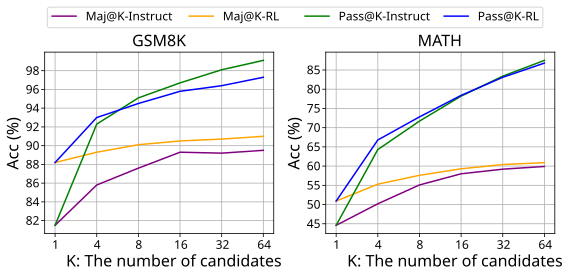

# DeepSeekMath / GRPO：真正被删掉的是 Critic，不是 PPO 的 Policy Optimization

> **论文**：DeepSeek-AI, [DeepSeekMath: Pushing the Limits of Mathematical Reasoning in Open Language Models](https://arxiv.org/abs/2402.03300)，本文以 arXiv v3（2024-04-27）为基线。  
> **类型**：A · 原始方法论文下钻。DeepSeekMath 本身同时包含数学预训练与完整模型实验，但本文只把其中 **GRPO / RL 方法线** 拆透。  
> **一句话定位**：GRPO 保留 PPO-style importance ratio 与 clipping，却不再训练 learned value model；它对同一 prompt 一次采样一组 responses，用组内 reward 的相对位置构造 advantage，再直接做 policy update。  
> **原图来源**：[figure_manifests/A051.json](../../../figure_manifests/A051.json)。  
> **为什么现在读它**：[DeepSeek-V3](../../B/05-moe-complete-llm/B009-deepseek-v3.md) 和 [DeepSeek-R1](../../B/05-moe-complete-llm/B010-deepseek-r1.md) 都已经把 GRPO 当作后训练组件使用。模型报告只需要知道“它省掉 Critic”；到这里我们必须继续追问：**Critic 原来到底干什么？组内 baseline 是否等于 Value Function？clip 和 KL 为什么还在？group normalization 有没有统计代价？**

## 阅读导航：这是一篇“从 PPO 到 GRPO”的方法页

**从哪里来**

- [DeepSeek-R1](../../B/05-moe-complete-llm/B010-deepseek-r1.md) —— 先看 GRPO 为什么在 reasoning RL 中重要；
- [DeepSeek-V3](../../B/05-moe-complete-llm/B009-deepseek-v3.md) —— 看 GRPO 在更早的 DeepSeek post-training 中处于什么位置；
- [PPO 原论文](https://arxiv.org/abs/1707.06347) —— 如果 ratio / clip 的基本动机仍不牢，可作为更底层的算法依赖。

**读完往哪里去**

- 回 [DeepSeek-R1](../../B/05-moe-complete-llm/B010-deepseek-r1.md)，你会真正知道 R1-Zero / R1 的 group-relative update 在算什么；
- 后续可继续进入 DAPO / GSPO / verifier-based RL，观察 reasoning post-training 怎样围绕 GRPO 的长度偏置、采样效率与 token-level credit 继续演化；
- 若要系统回顾 PPO 的 GAE、Critic 与 old-policy 多轮更新，可再单开 PPO 原始方法专题，而不是把整篇 PPO 历史重复塞在这里。

**本文重点**

1. PPO 的 Critic / Value Model 究竟承担什么数学职责；
2. 为什么“去掉 Critic”不等于“去掉 baseline”；
3. group-relative advantage 是怎样从同一 prompt 的一组回答得到的；
4. GRPO 为什么仍然保留 ratio、clip 与 reference-policy KL；
5. outcome supervision 为什么把同一个 response-level advantage 广播给所有 token；
6. process supervision 怎样重新获得更细的 credit assignment；
7. group mean 不是严格意义上的 $V(s_t)$，也不能随口宣称“完全无偏”；
8. DeepSeekMath 的实验究竟支持了 online sampling、gradient coefficient、process reward 与 iterative RL 的哪些结论。

*自制解释图，不是原论文 Figure。先抓住最关键的结构变化：PPO 用 learned Value Model 估计 baseline；GRPO 改用同一 prompt 下多条 response 的组内相对 reward。Policy update 本身仍然是 PPO-style clipped surrogate。*

---

## 总结架构图

> **教学总结图**：把组内相对 advantage、PPO-style ratio/clip 与 reference KL 放在同一目标中，突出 GRPO 真正删除的是 Critic。

## 1. 先别急着看 GRPO：PPO 为什么要有 Critic？

理解 GRPO 最容易犯的错误，是从一句：

> “GRPO 不需要 Value Model。”

直接跳到：

> “所以 Value Model 原来是多余的。”

不是。

Critic 在 PPO 里不是为了“让梯度存在”，而是为了得到一个**低方差、尽量贴近当前 state 的 advantage estimate**。

先从最原始的 policy gradient 开始。

给定 prompt：

$$
q,
$$

模型生成 response：

$$
o=(o_1,o_2,\ldots,o_T).
$$

在语言模型里可以定义：

$$
s_t=(q,o_{<t}),
\qquad
a_t=o_t.
$$

整个 response 的概率：

$$
\pi_\theta(o\mid q)
=
\prod_{t=1}^{T}
\pi_\theta(o_t\mid q,o_{<t}).
$$

假设最终 return 是：

$$
R(q,o).
$$

目标：

$$
J(\theta)
=
\mathbb E_{o\sim\pi_\theta(\cdot\mid q)}
[R(q,o)].
$$

使用 log-derivative trick：

$$
\nabla_\theta J
=
\mathbb E
\left[
R(q,o)
\nabla_\theta
\log\pi_\theta(o\mid q)
\right].
$$

又因为：

$$
\log\pi_\theta(o\mid q)
=
\sum_{t=1}^{T}
\log\pi_\theta(o_t\mid q,o_{<t}),
$$

所以：

$$
\boxed{
\nabla_\theta J
=
\mathbb E
\left[
\sum_{t=1}^{T}
R(q,o)
\nabla_\theta
\log\pi_\theta(o_t\mid s_t)
\right]
}
$$

从这个式子看，**没有 Critic 也能做 policy gradient**。

真正的问题是：

> 同一个 state 下 rollout return 波动可能极大，直接拿 $R$ 乘 score function，variance 很高。

### 1.1 为什么 baseline 可以减掉而不改变期望？

如果 baseline：

$$
b(s_t)
$$

只依赖 state，不依赖当前 action，那么：

$$
\mathbb E_{a_t\sim\pi_\theta}
[
b(s_t)
\nabla_\theta\log\pi_\theta(a_t\mid s_t)
\mid s_t
]
$$

等于：

$$
b(s_t)
\sum_a
\pi_\theta(a\mid s_t)
\nabla_\theta
\log\pi_\theta(a\mid s_t).
$$

利用：

$$
\pi\nabla\log\pi=\nabla\pi,
$$

得到：

$$
b(s_t)
\sum_a
\nabla_\theta
\pi_\theta(a\mid s_t)
=
b(s_t)
\nabla_\theta 1
=
0.
$$

因此：

$$
R_t
\rightarrow
R_t-b(s_t)
$$

不会改变理想 policy-gradient 的期望，只会改变 variance。

最自然的 baseline 就是：

$$
V^\pi(s_t)
=
\mathbb E[R_t\mid s_t].
$$

这就是 Critic / Value Function 的角色。

### 1.2 为什么 LLM 里的 Value Model 很重？

对一个大语言模型，state 是一整段 prefix：

$$
s_t=(q,o_{<t}).
$$

Value Model 要对几乎每一个 token prefix 预测：

$$
V_\psi(s_t).
$$

PPO 还通常需要：

~~~text
Policy / Actor
Reference Model
Reward Model
Value / Critic Model
~~~

DeepSeekMath 特别指出，Value Model 通常与 Policy Model 规模相当，因此会带来显著的：

- 参数显存；
- optimizer state；
- activation；
- 前向 / 反向计算；
- 分布式训练状态。

更麻烦的是，在 LLM RL 中，任务 reward 往往主要出现在 response 末端，而 Value Model 却要学习每个 prefix 的价值。

于是出现一个非常自然的问题：

> **既然同一道题本来就会采多个答案，能不能不用另一个大模型预测 baseline，而直接拿这些答案互相比较？**

这就是 GRPO 的入口。

---

## 2. 原论文 Figure 4：GRPO 删除的是 Value Model 这条支路

这张图应该先看模型数量，而不是先看公式。

PPO 上半部分：

~~~text
q
↓
Policy Model
↓
response
├── Reference Model → KL
├── Reward Model → reward
└── Value Model → value
          ↓
         GAE
          ↓
       Advantage
~~~

GRPO 下半部分：

~~~text
q
↓
Policy Model
↓
同题采样 G 条 response
↓
Reward Model
↓
G 个 rewards
↓
Group Computation
↓
G 个 relative advantages
~~~

Value Model 消失了。

但是下面这些东西**没有消失**：

- Policy Model；
- old policy；
- reward signal；
- reference policy / KL regularization；
- importance ratio；
- PPO-style clipping；
- rollout sampling。

所以更准确的描述是：

> **GRPO 是 critic-free 的 PPO-style policy optimization，而不是“把 PPO 整套扔掉换了一种完全不同的 RL”。**

### 这一组你应该记住什么

- Critic 的核心数学角色是 baseline / advantage estimation；
- 去掉 Critic 不意味着 policy gradient 不再需要相对好坏信号；
- GRPO 用“同题多样本的相对 reward”取代 learned state-value baseline；
- 节省的是 Value Model 相关训练状态，不代表 rollout compute 自动变成零。

### 如果你卡在这里

- 不懂 baseline 为什么不改期望 → 重读 §1.1；
- 不懂 Value Model 为什么会接近 Policy 规模 → 回忆语言模型中每个 prefix 都是 state；
- 不懂为什么还要 old policy / ratio / clip → 继续读 §5。

---

## 3. GRPO 的核心：同一道题采一组答案，让“同题相对表现”成为 baseline

对每个 question：

$$
q,
$$

从 old policy：

$$
\pi_{\theta_{\mathrm{old}}}
$$

采样：

$$
\{o_1,o_2,\ldots,o_G\}.
$$

得到 rewards：

$$
\mathbf r
=
(r_1,r_2,\ldots,r_G).
$$

Outcome supervision 下，DeepSeekMath 定义：

$$
\mu_r
=
\operatorname{mean}(\mathbf r),
$$

$$
\sigma_r
=
\operatorname{std}(\mathbf r),
$$

并令：

$$
\boxed{
\hat A_{i,t}
=
\tilde r_i
=
\frac{r_i-\mu_r}{\sigma_r}
}
$$

这里最反直觉的一点是：

> 对同一个 response $o_i$，所有 token 的 $\hat A_{i,t}$ 都一样。

也就是说：

$$
\hat A_{i,1}
=
\hat A_{i,2}
=
\cdots
=
\hat A_{i,T_i}.
$$

### 3.1 一个最小数值例子

假设同一道题采 4 个回答：

$$
G=4,
$$

reward：

$$
(1,1,0,0).
$$

为了便于直觉，若这里用 population standard deviation：

$$
\mu=0.5,
\qquad
\sigma=0.5.
$$

于是：

$$
\hat A
=
(+1,+1,-1,-1).
$$

前两个 response：

> 比这一组的平均表现好。

后两个：

> 比这一组的平均表现差。

*自制解释图，不是原论文 Figure。它刻意强调两个事实：第一，比较发生在同一个 prompt 内；第二，outcome supervision 把 response-level 相对优势广播给整条 token trajectory。*

### 3.2 为什么一定强调“同一个 prompt”？

假设有两道题：

~~~text
题 A：非常简单
大多数回答 reward≈1

题 B：非常困难
大多数回答 reward≈0
~~~

如果直接跨题比较绝对 reward：

> B 上偶尔答对一次的高价值探索，很容易被 A 上普遍的高分淹没。

group-relative normalization 改成：

> 你不是问“这个回答绝对有多高分”，而是问“对这道题而言，它比同题其他尝试好多少”。

因此它天然带有：

> **prompt-conditioned relative baseline**

的味道。

---

## 4. 但 group mean 不是 $V(s_t)$：两种 baseline 的信息粒度不同

这是理解 GRPO 最关键的边界。

PPO Critic 试图预测：

$$
V(s_t)
=
V(q,o_{<t}).
$$

它看到的是：

> 当前已经生成到哪个 prefix。

因此不同 token 时刻：

$$
V(s_1),V(s_2),\ldots,V(s_T)
$$

理论上都可以不同。

而 outcome-GRPO 的 group baseline：

$$
\bar r
=
\frac1G
\sum_{j=1}^{G}r_j
$$

主要是：

> 对同一个 question 的一批完整 response 做统计。

它并不知道 response 中：

- 第 10 个 token 是好转折；
- 第 80 个 token 开始犯错；
- 第 150 个 token 才把答案救回来。

因此不能写成：

> “GRPO 用 group mean 精确等价替换了 $V(s_t)$。”

更准确的是：

> **GRPO 放弃逐-prefix learned value estimation，改用 prompt-level group-relative outcome 作为更便宜、更粗的 advantage signal。**

这也是为什么 process supervision 后面又会重新加入 step-level 信息。

---

## 5. 一个经常被忽略的问题：group baseline 自己包含当前样本，它还是标准的无偏 baseline 吗？

不能直接照搬：

$$
b(s_t)
$$

的 baseline 无偏证明。

原因很简单。

标准 baseline 要求：

> 在给定 state 后，baseline 不依赖当前 sampled action。

但 GRPO 的 group mean：

$$
\bar r
=
\frac1G
\sum_{j=1}^{G}r_j
$$

里面包含当前 response 自己的：

$$
r_i.
$$

所以：

$$
r_i-\bar r
$$

与当前样本不是独立的。

### 5.1 先看“不除标准差”的简化版本

令：

$$
\bar A_i
=
r_i-\bar r.
$$

再把整条 response 的 score function 简写成：

$$
g_i
=
\nabla_\theta
\log\pi_\theta(o_i\mid q).
$$

那么：

$$
\mathbb E[\bar A_i g_i]
=
\mathbb E
\left[
\left(
r_i-\frac1G\sum_{j=1}^{G}r_j
\right)
g_i
\right].
$$

展开：

$$
=
\mathbb E[r_i g_i]
-
\frac1G
\mathbb E[r_i g_i]
-
\frac1G
\sum_{j\ne i}
\mathbb E[r_j g_i].
$$

若同一 prompt 下各 rollout 条件独立，则对：

$$
j\ne i,
$$

有：

$$
\mathbb E[r_j g_i]
=
\mathbb E[r_j]\mathbb E[g_i].
$$

而 score function：

$$
\mathbb E[g_i]=0.
$$

因此：

$$
\boxed{
\mathbb E[\bar A_i g_i]
=
\left(1-\frac1G\right)
\mathbb E[r_i g_i]
}
$$

也就是说，在这个极简条件下：

> self-including group mean 会带来一个 $1-\frac1G$ 的缩放。

方向没有被这个纯 centering 改掉，但它不是你熟悉的“任意 action-independent baseline 完全不改期望”的同一个证明。

### 5.2 一旦再除以 group std，事情更复杂

DeepSeekMath 实际使用：

$$
\hat A_i
=
\frac{r_i-\bar r}{\operatorname{std}(\mathbf r)}.
$$

分母也是随机量，而且由整组 samples 决定。

于是它不再只是一个固定常数缩放。

这意味着：

> **不要把“group normalization”随口描述成严格无偏的 Value baseline 替代。**

原论文的工程论点是：

- 不训练 Critic；
- 用组内相对 reward 得到 advantage；
- 显著降低 Value Model 带来的资源负担；
- 实验上有效。

它并没有在主文里证明：

> finite-$G$、带 sample standardization 的 GRPO advantage 与理想 $V(s)$ baseline 在统计意义上完全等价。

这是论文解读必须保留的边界。

### 5.3 如果用 leave-one-out mean 会怎样？

仅作为理解对照，若定义：

$$
b_i
=
\frac1{G-1}
\sum_{j\ne i}r_j,
$$

那么在条件独立假设下：

$$
b_i
$$

不包含当前 $r_i$。

这会更接近传统“baseline 对当前 action 独立”的逻辑。

但：

> **这不是 DeepSeekMath 原论文的 GRPO 定义。**

不要为了理论上更顺手，把原方法偷偷改写掉。

---

## 6. GRPO 并没有删除 PPO clipping：ratio 仍然是核心

对 response $i$ 的第 $t$ 个 token，定义：

$$
\rho_{i,t}(\theta)
=
\frac{
\pi_\theta(o_{i,t}\mid q,o_{i,<t})
}{
\pi_{\theta_{\mathrm{old}}}(o_{i,t}\mid q,o_{i,<t})
}.
$$

这在问：

> 当前 policy 相对 rollout 时的 old policy，把这个已经采到的 token 概率改了多少？

如果：

$$
\rho=1,
$$

说明当前 policy 与 old policy 对这个 token 的概率相同。

如果：

$$
\rho>1,
$$

说明当前 policy 更偏向这个 token。

如果：

$$
\rho<1,
$$

说明当前 policy 降低了这个 token 的概率。

GRPO 保留 PPO-style clipped term：

$$
\min
\left[
\rho_{i,t}\hat A_{i,t},
\operatorname{clip}
(\rho_{i,t},1-\epsilon,1+\epsilon)
\hat A_{i,t}
\right].
$$

### 6.1 当 $\hat A>0$

这是“比同题其他回答好”的 response。

我们希望：

$$
\rho>1,
$$

即提高这些 token 的概率。

但当：

$$
\rho>1+\epsilon,
$$

clipped branch 把正向收益封顶。

含义是：

> 已经把一个好 token 概率推高很多后，不再继续因为同一批旧数据获得无限奖励。

### 6.2 当 $\hat A<0$

这是“比同题其他回答差”的 response。

我们希望：

$$
\rho<1,
$$

降低这些 token 的概率。

但如果已经降到：

$$
\rho<1-\epsilon,
$$

clip 会阻止继续利用同一批样本无限压低它。

所以 clip 的本质没有变：

> **同一批 old-policy rollout 可以被重复用于若干 gradient steps，但单次数据不能允许 current policy 离 rollout policy 漂得太远。**

这和“有没有 Critic”是两个正交问题。

GRPO 改的是：

> advantage 从哪里来。

PPO clip 解决的是：

> old-policy 数据被当前 policy 重用时，更新步子不能无限大。

---

## 7. 把完整 GRPO objective 写出来：它其实是三块拼起来的

DeepSeekMath Eq. (3)：

$$
\boxed{
\begin{aligned}
J_{\mathrm{GRPO}}(\theta)
=
\mathbb E
\Bigg[
&
\frac1G
\sum_{i=1}^{G}
\frac1{|o_i|}
\sum_{t=1}^{|o_i|}
\Bigg\{
\\
&
\min
\left[
\rho_{i,t}\hat A_{i,t},
\operatorname{clip}
(\rho_{i,t},1-\epsilon,1+\epsilon)
\hat A_{i,t}
\right]
\\
&
-
\beta
D_{\mathrm{KL}}
[\pi_\theta\Vert\pi_{\mathrm{ref}}]
\Bigg\}
\Bigg].
\end{aligned}
}
$$

它可以拆成三个完全不同的控制器。

### 第一块：group-relative advantage

回答：

> **这条 response 相对同题其他 response 是好还是坏？**

### 第二块：PPO ratio + clip

回答：

> **基于 old-policy rollout，current policy 这次允许改多远？**

### 第三块：reference KL

回答：

> **即使当前这批 reward 很诱人，也不能让 policy 无限制偏离 reference distribution。**

这三件事不要混成一句“GRPO loss”。

---

## 8. PPO 与 GRPO 的 KL 放置位置不同，这不是排版细节

DeepSeekMath 先写 PPO-style RLHF 中的 per-token reward：

$$
r_t
=
r_\phi(q,o_{\le t})
-
\beta
\log
\frac{
\pi_\theta(o_t\mid q,o_{<t})
}{
\pi_{\mathrm{ref}}(o_t\mid q,o_{<t})
}.
$$

也就是说，KL-like penalty 先进入 reward。

然后：

~~~text
reward
↓
return / GAE
↓
advantage
↓
policy update
~~~

于是 KL 会间接进入 advantage。

GRPO 则把 KL 直接放在 policy objective 中：

$$
\text{policy surrogate}
-
\beta D_{\mathrm{KL}}
[\pi_\theta\Vert\pi_{\mathrm{ref}}].
$$

论文明确说明这样做的一个动机是：

> 避免 KL penalty 把 group-relative advantage 的计算继续复杂化。

### 8.1 DeepSeekMath 使用的单样本 KL estimator

定义：

$$
x
=
\frac{
\pi_{\mathrm{ref}}(o_{i,t}\mid s_{i,t})
}{
\pi_\theta(o_{i,t}\mid s_{i,t})
}.
$$

论文使用：

$$
\boxed{
\hat D_{\mathrm{KL}}
=
x-\log x-1
}
$$

即：

$$
\frac{\pi_{\mathrm{ref}}}{\pi_\theta}
-
\log
\frac{\pi_{\mathrm{ref}}}{\pi_\theta}
-
1.
$$

### 8.2 为什么它逐样本非负？

利用：

$$
\log x
\le
x-1.
$$

所以：

$$
x-\log x-1
\ge
0.
$$

### 8.3 为什么它在 $\pi_\theta$ 采样下是 forward KL 的无偏 estimator？

对：

$$
a\sim\pi_\theta(\cdot\mid s),
$$

有：

$$
\mathbb E_{\pi_\theta}
\left[
\frac{\pi_{\mathrm{ref}}(a\mid s)}
{\pi_\theta(a\mid s)}
\right]
=
\sum_a
\pi_\theta(a\mid s)
\frac{\pi_{\mathrm{ref}}(a\mid s)}
{\pi_\theta(a\mid s)}
=
1.
$$

另一方面：

$$
-\mathbb E_{\pi_\theta}
\left[
\log
\frac{\pi_{\mathrm{ref}}}
{\pi_\theta}
\right]
=
D_{\mathrm{KL}}
(\pi_\theta\Vert\pi_{\mathrm{ref}}).
$$

因此：

$$
\mathbb E_{\pi_\theta}
[
x-\log x-1
]
=
1
+
D_{\mathrm{KL}}
(\pi_\theta\Vert\pi_{\mathrm{ref}})
-1.
$$

得到：

$$
\boxed{
\mathbb E[\hat D_{\mathrm{KL}}]
=
D_{\mathrm{KL}}
(\pi_\theta\Vert\pi_{\mathrm{ref}})
}
$$

这里要非常小心：

> 原论文明确称“无偏 estimator”的，是这个 KL estimator。

不要把这句话错误外推成：

> “整个 group-normalized advantage 也是无偏 Value estimator。”

它们是两件不同的事。

---

## 9. Outcome supervision 的真正代价：整条 response 的 token 共用一个信用信号

Outcome supervision 中：

$$
\hat A_{i,t}
=
\tilde r_i.
$$

于是如果一条 200-token response 最后答对：

> 前面正确步骤、无关废话、偶然绕路、真正关键推导，都被乘上同一个正 advantage。

如果最后答错：

> 前面可能完全正确的 190 个 token，也会和最后错误步骤一起收到负 advantage。

所以 outcome reward 的 credit assignment 很粗。

这不代表它没用。

它仍然可以通过大量 rollout 统计地提高：

> 更常出现在高 reward trajectories 中的 token / pattern。

但它无法直接回答：

> 到底是哪一步推理导致最后成功。

这正是 process supervision 出现的原因。

---

## 10. Process Supervision：把“整条轨迹一个分数”改成“每个 reasoning step 有 reward”

假设 response $i$ 有：

$$
K_i
$$

个 reasoning steps。

第 $j$ 个 step 的结束 token：

$$
\operatorname{index}(j).
$$

Process Reward Model 给每一步 reward：

$$
r_i^{\operatorname{index}(j)}.
$$

论文同样先对 process rewards 做 group normalization：

$$
\tilde r_i^{\operatorname{index}(j)}
=
\frac{
r_i^{\operatorname{index}(j)}
-
\operatorname{mean}(\mathbf R)
}{
\operatorname{std}(\mathbf R)
}.
$$

然后 token $t$ 的 advantage 定义为它之后所有 step rewards 的和：

$$
\boxed{
\hat A_{i,t}
=
\sum_{\operatorname{index}(j)\ge t}
\tilde r_i^{\operatorname{index}(j)}
}
$$

这和 reward-to-go 的思想非常接近。

当前 token 不应该被它之前已经发生的 step reward 重新归因。

而是只看：

> **从当前 token 往后，还会发生哪些被评价的 reasoning steps。**

### 10.1 Outcome 与 Process 的区别不要写成“稀疏 vs 稠密”这么简单

更关键的是 credit granularity：

| 维度 | Outcome Supervision | Process Supervision |
|---|---|---|
| reward 位置 | response 末端 | reasoning step 末端 |
| 同一 response 的 token advantage | 通常整条共享一个值 | 随 token 所处 step 改变 |
| credit assignment | 粗 | 更细 |
| reward 标注 / verifier 成本 | 相对低 | 更高 |
| 对错误中间步骤定位 | 弱 | 更强 |

DeepSeekMath 的实验后面也发现：

> GRPO + Process Supervision 在其设置下优于 GRPO + Outcome Supervision。

但这是论文实验结论，不应扩写成：

> “任何 reasoning RL 都必须使用 PRM。”

后来的 R1 恰恰大量依赖可验证 outcome reward，也说明 reward design 与任务可验证性之间还有更复杂的权衡。

---

## 11. Iterative GRPO：Policy 在变，Reward Model 也不能永远停在最初分布

静态 Reward Model 有一个很现实的问题。

训练初期：

$$
\pi_\theta
\approx
\pi_{\mathrm{SFT}}.
$$

Reward Model 看到的 response 分布和原训练数据相近。

但随着 RL 推进：

$$
\pi_\theta
$$

不断改变。

新的 policy 会开始生成：

- 更长的 reasoning；
- 新的错误模式；
- 新的 reward-hacking pattern；
- 原 Reward Model 很少见过的 response。

于是：

> 固定 Reward Model 可能逐渐 out-of-distribution。

DeepSeekMath 的 iterative GRPO 因此做：

~~~text
当前 policy
↓
采新的 outputs
↓
为 Reward Model 构造新训练数据
↓
混入历史 replay
↓
继续训练 Reward Model
↓
更新 reference
↓
继续 Policy RL
~~~

论文 Algorithm 1 中：

- 每个 outer iteration 把当前 policy 设为新的 reference；
- rollout 前更新 old policy；
- 同题采 $G$ 个 outputs；
- 计算 group-relative advantage；
- 做 $\mu$ 次 GRPO update；
- Reward Model 用 replay 机制持续训练；
- replay 中保留 10% 历史数据。

这个设计非常重要，因为它已经在 2024 年明确碰到了后来 reasoning RL 大规模化时的核心问题：

> **Policy exploration 会不断改变训练数据分布；verifier / reward 也必须跟上。**

---

## 12. DeepSeekMath 实际怎么训练 GRPO？先把实验规模摆出来

论文对 DeepSeekMath-RL 7B 的主要设置包括：

- 起点：DeepSeekMath-Instruct 7B；
- RL prompts：SFT 数据中 GSM8K / MATH 相关 CoT questions，约 144K；
- policy learning rate：
  :::{math}
  10^{-6};
  :::
- KL coefficient：
  :::{math}
  \beta=0.04;
  :::
- 每个 question 采样：
  :::{math}
  G=64
  :::
  个 outputs；
- max generation length：
  :::{math}
  1024;
  :::
- training batch size：
  :::{math}
  1024;
  :::
- 该主实验设置中，每次 exploration stage 后 policy 只做一次 update。

这里有一个很值得注意的工程现实：

> **Critic 被删掉了，但每题 64 条 rollout 并不便宜。**

所以“GRPO 更省资源”的准确表述是：

> 它显著减少了 PPO 中 learned Value Model 对显存与训练计算的需求。

而不是：

> “GRPO 的总 RL 成本一定低很多。”

当 rollout / generation 成本变成主要瓶颈时，group size：

$$
G
$$

本身就是系统代价。

---

## 13. 原论文 Figure 5：作者真正想比较的是“数据从哪里来”和“梯度系数怎样变”

DeepSeekMath 很有意思的一点，是作者没有只说：

> “GRPO 比 PPO 省 Critic。”

他们试图把 SFT、RFT、Online RFT、DPO、PPO、GRPO 放进统一视角。

作者把方法拆成三个维度：

~~~text
Data Source
+
Reward Function
+
Gradient Coefficient
~~~

### 13.1 Offline vs Online

Offline：

> 训练数据主要来自初始 SFT policy 的采样。

Online：

> 训练过程中不断从当前 real-time policy 重新采样。

论文把：

- RFT；
- DPO

归到其分析中的 offline style。

把：

- Online RFT；
- PPO；
- GRPO

归到 online style。

论文实验观察到：

> Online RFT 在后期明显优于 offline RFT。

作者的解释是：

训练早期：

$$
\pi_\theta
\approx
\pi_{\mathrm{SFT}},
$$

两种数据源差别不大。

训练后期：

$$
\pi_\theta
$$

已经移动，实时采样更能覆盖当前 policy 真正会访问的区域。

这其实就是一个 distribution shift 问题。

### 13.2 为什么 GRPO 又优于 Online RFT？

Online RFT 的简化逻辑更像：

~~~text
答对
→ 正向训练

答错
→ 不训练
~~~

而 GRPO 的 group-relative advantage 可以：

~~~text
高于组平均
→ 正 gradient coefficient

低于组平均
→ 负 gradient coefficient
~~~

所以它不仅奖励正确 / 高分轨迹，还能主动降低差轨迹概率。

论文把这描述成：

> 不同 reward magnitude 对 gradient coefficient 产生差异化强化与惩罚。

这比“在线采样”又多了一层信息。

---

## 14. 原论文 Figure 6：Iterative RL 为什么第一轮提升最大？

论文做了两轮 iterative RL。

Figure 6 中：

- iteration-0 是初始阶段；
- iteration-1 明显继续提高 GSM8K / MATH；
- iteration-2 仍有收益，但边际提升更小、更噪声。

作者据此认为：

> iterative update Reward Model / Policy 有明显价值，尤其第一轮最突出。

这里不要过度解释成：

> “两轮就是最优轮数。”

实验只说明：

> 在他们当前数据、Reward Model 与 7B policy 设置下，继续刷新 data / reward system 可以进一步提升表现。

---

## 15. 原论文 Figure 7：RL 提高 Maj@K，却没有明显提高 Pass@K，这意味着什么？

这一张图很值得细读。

先区分两个指标。

### Pass@K

问的是：

> 采 $K$ 次，只要至少有一次正确就算成功。

它更接近：

> 模型分布里“有没有”正确解法。

### Maj@K

看多次 sample 的多数 / self-consistency 结果。

它更接近：

> 正确答案在 sampling distribution 中是否拥有更稳定的概率质量。

DeepSeekMath 观察到：

> RL 更明显提高 Maj@K，而没有同步显著提高 Pass@K。

作者因此提出一个很谨慎的解释：

> RL 的收益可能更多来自把已有 candidate space 中的正确 response 推到更高概率，而不一定意味着模型突然获得了原来完全不存在的新基础能力。

这是一个很重要的边界。

可以把它理解成：

~~~text
SFT model
已经“会”某些正确路径
但概率不够高
        ↓
RL
重新分配 probability mass
        ↓
正确路径更常被采出来
        ↓
Maj@K 提高
~~~

但“Pass@K 没涨”也不能被无限外推。

它只对应本文的：

- 当前模型；
- 当前 RL 数据；
- 当前 reward；
- 当前 sampling 设置。

后续更大规模 reasoning RL 是否只做 probability reshaping，是另一个需要单独实验的问题。

---

## 16. 从“梯度系数”角度，把 SFT / RFT / PPO / GRPO 放在同一条线上

DeepSeekMath Appendix 做了一件非常值得学习的事情：

> 不再只按算法名字分类，而是看每个 token 的 $\nabla\log\pi$ 前面到底乘了什么。

统一写成：

$$
\nabla_\theta J
=
\mathbb E
\left[
\sum_t
C_t
\nabla_\theta
\log\pi_\theta(o_t\mid s_t)
\right].
$$

核心差别变成：

$$
C_t
$$

是什么。

### SFT

$$
C_t=1.
$$

每个 teacher token 都被正向提高概率。

### RFT

大致是：

$$
C_t
=
\mathbb I(\text{response correct}).
$$

答对才训练。

### PPO

$$
C_t
=
A_t,
$$

其中：

$$
A_t
$$

来自 GAE + learned Value Function。

### GRPO

在论文的简化梯度分析下，核心系数包含：

$$
\hat A_{i,t}
$$

以及 reference KL 的梯度贡献。

这个视角非常重要，因为它把一堆名字统一成一个问题：

> **训练数据从哪里来？什么信号决定当前 token 应该被增加还是减少多少概率？**

这比死记：

> PPO、DPO、RFT、GRPO 是四套完全互不相关的算法

更接近它们在 LLM post-training 中真正的计算结构。

---

## 17. GRPO 为什么特别适合“同题可多次采样 + reward 可比较”的 reasoning 场景？

GRPO 的优势不是无条件的。

它非常依赖一个结构：

> 同一个 prompt 可以采出多条有意义的候选 response。

于是：

$$
\{o_1,\ldots,o_G\}
$$

形成了一个天然 comparison set。

数学 / 代码 reasoning 又经常有：

- exact answer；
- test case；
- verifier；
- process reward；
- rule-based score。

所以 reward 在同题内部尤其容易比较。

这使：

$$
\operatorname{mean}(r_1,\ldots,r_G)
$$

成为一个很自然的 difficulty-adaptive reference。

对简单题：

> 大家都高分，只有特别差的 response 才明显低于均值。

对难题：

> 大家都低分，偶尔成功的 response 会显著高于均值。

这正是 R1 后来大规模 reasoning RL 很容易继承 GRPO 的原因之一。

但反过来也说明：

> 如果一个任务很难产生多个可比较 rollout，或者 reward 极噪，group-relative signal 的质量也会变差。

---

## 18. “Group std”其实是一个非常强的归一化操作

DeepSeekMath 不只减 mean，还除以：

$$
\sigma_r.
$$

直觉上，它在做：

> 不同 prompt 的 reward scale 对齐。

假设题 A：

$$
r=(0.9,0.8,0.7,0.6),
$$

题 B：

$$
r=(0.51,0.50,0.49,0.48).
$$

只减均值时，题 A 的梯度幅度会明显更大。

除以 std 后：

> 两组内部“高于平均几个标准差”可以得到相近尺度。

这有利于不同 question 之间的 gradient scale 对齐。

但也带来一个隐含 trade-off：

> 当一组 reward spread 很小时，除以很小的 std 会放大微小差异。

原论文主公式写的是：

$$
\operatorname{std}(\mathbf r),
$$

并没有在理论部分把所有 numerical edge case 详细展开。

因此工程实现通常必须认真处理：

- 全组 reward 相同；
- std 极小；
- reward quantization；
- group size 太小；
- binary verifier 导致大量 ties。

这些问题后来成为 reasoning RL 继续改 GRPO 的重要方向之一。

在原始方法解读里，最重要的是先看见：

> **std normalization 不只是“顺手标准化”，它改变了每个 prompt 对总梯度的权重。**

---

## 19. 论文细读：DeepSeekMath 为什么不是一篇“只提出 GRPO”的算法论文？

DeepSeekMath 的标题是数学模型论文。

整篇主线实际有两条：

~~~text
Math Data / Continual Pretraining
        +
Instruction Tuning / RL
~~~

论文把 DeepSeekMath-Base 从 DeepSeek-Coder-Base-v1.5 7B 继续训练，在总计 500B continual-training tokens 中包含 120B math-related tokens。

然后：

~~~text
DeepSeekMath-Base
↓
Math Instruction Tuning
↓
DeepSeekMath-Instruct
↓
GRPO
↓
DeepSeekMath-RL
~~~

因此 GRPO 的实验前提非常重要：

> 它不是拿一个毫无数学能力的 Base Model，通过 RL 凭空变成数学专家。

它站在已经经过：

- code pretraining；
- math continual pretraining；
- mathematical SFT

的强初始化上。

这点和后来 R1 的逻辑高度一致：

> **RL 更像在强 prior 上搜索、重排和放大高 reward trajectories，而不是从空白策略空间凭空发明任意能力。**

---

## 20. 论文细读：作者为什么先讲“资源问题”，再讲“相对 reward”？

GRPO 的叙事顺序很清楚。

作者不是从：

> “group normalization 很优雅”

开始。

而是先指出 PPO 的两个现实问题：

1. Value Model 与 Policy Model 规模相当，内存 / 计算重；
2. LLM reward 常在 response 末端，逐 token 学 Value Function 本身并不轻松。

然后才问：

> 同一 question 的多个 sampled outputs 能不能直接给 baseline？

所以 GRPO 的方法不是从数学形式凭空长出来，而是一个非常典型的工程驱动算法：

~~~text
训练资源瓶颈
↓
识别 Value Model 的职责
↓
寻找不训练 Value Model 的 baseline 来源
↓
利用同 prompt 多 rollout
↓
group-relative advantage
↓
保留 PPO clip 保证 old-policy 数据重用稳定
~~~

这条因果链比“GRPO 公式长什么样”更值得记。

---

## 21. 论文细读：哪些措辞是作者结论，哪些是我们不能擅自加强的？

### 21.1 “显著减少训练资源”

论文明确把这和：

> foregoes the critic / value model

联系起来。

可以写：

> GRPO 避免训练一个与 policy 同量级的 Value Model，从而显著降低这一部分的 memory / computation burden。

不宜直接写：

> GRPO 总训练 FLOPs 必然比 PPO 小多少倍。

因为实际 GRPO 还要：

$$
G=64
$$

rollouts / question。

rollout 成本是否主导，要看具体系统。

### 21.2 “group score 估 baseline”

可以写：

> GRPO 用同题组内 reward 统计构造相对 advantage。

不宜写：

> group mean 就是准确的 $V(s_t)$。

它没有 prefix-level state information。

### 21.3 “Process Supervision 更好”

论文当前实验支持：

> 在其设置中 GRPO+PS 优于 GRPO+OS。

不宜写：

> process reward 在所有 reasoning RL 中必然优于 outcome verifier。

R1 后来的结果本身就提醒我们：

> 可验证 outcome reward 在大规模数学 / 代码 RL 中同样可以非常强。

### 21.4 “RL 为什么有效”

作者根据 Maj@K / Pass@K 给出的解释，本身用了类似：

> it seems

的谨慎强度。

因此中文也应该保留：

> **当前证据更符合“重排已有候选概率质量”的解释，而不是已经证明 RL 创造了新的基础 reasoning capability。**

---

## 22. 从 DeepSeekMath 回到 DeepSeek-V2 / V3 / R1：GRPO 是怎么变成主干技术的？

### DeepSeekMath

~~~text
PROPOSES GRPO
↓
critic-free group-relative advantage
+ PPO clip
+ direct KL regularization
~~~

### DeepSeek-V2

[DeepSeek-V2](../../B/05-moe-complete-llm/B008-deepseek-v2.md) 的 post-training 已经采用 GRPO。

这说明 GRPO 很快从：

> 数学模型实验算法

进入完整 LLM alignment pipeline。

### DeepSeek-V3

[DeepSeek-V3](../../B/05-moe-complete-llm/B009-deepseek-v3.md) 继续使用 GRPO 做 post-training。

此时模型规模已经来到 671B total / 37B active，Value Model 的资源问题更加现实。

### DeepSeek-R1

[DeepSeek-R1](../../B/05-moe-complete-llm/B010-deepseek-r1.md) 把 GRPO 放进 reasoning RL 主线。

但 R1 的 reward system 与 DeepSeekMath 已经发生变化：

- 更强调 rule-based verifiable reward；
- R1-Zero 直接从 V3-Base 进行 reasoning RL；
- 最终 R1 又加入 cold start、rejection sampling、SFT 与 all-scenario RL。

所以技术关系应该写成：

~~~text
DeepSeekMath
PROPOSES GRPO
        ↓
DeepSeek-V2 / V3
ADOPTS in post-training
        ↓
DeepSeek-R1
ADOPTS GRPO
+ changes reward / training pipeline
+ scales reasoning RL
~~~

不能反过来说：

> “GRPO 是 R1 首次提出的。”

---

## 23. GRPO 的真实 trade-off：删掉 Critic 后，成本和偏差被搬到了哪里？

一个算法几乎不会“白送”收益。

GRPO 删除 Value Model 后，代价主要转移到四个地方。

### 23.1 Group rollout

为了估计同题相对表现，需要：

$$
G>1.
$$

DeepSeekMath 主实验甚至用：

$$
G=64.
$$

采样本身可能成为主要系统开销。

### 23.2 Credit assignment 更粗

Outcome GRPO：

$$
\hat A_{i,t}
=
\hat A_i.
$$

整条 response 共用一个 advantage。

### 23.3 Group statistics 引入有限样本效应

mean / std 都来自当前小批 sampled responses。

它们会受：

- group size；
- reward ties；
- reward noise；
- prompt difficulty；
- extreme samples

影响。

### 23.4 Reward quality 变得更关键

没有 Value Model 并不意味着：

> reward 错了也没关系。

恰恰相反。

policy update 仍然直接相信：

$$
\hat A.
$$

Reward Model / verifier 如果被 exploit，Policy 仍会朝错误方向优化。

DeepSeekMath 后面专门讨论：

- reward generalization；
- reward uncertainty；
- 高质量 process reward；
- weak-to-strong robustness

不是跑题，而是方法自然暴露出的下一层瓶颈。

---

## 24. 一张表把 PPO 与原始 GRPO 真正的差别定死

| 维度 | PPO（DeepSeekMath 文中的 LLM PPO） | GRPO |
|---|---|---|
| rollout 来源 | old / current policy | old / current policy |
| 是否需要 Policy | 是 | 是 |
| 是否需要 Reference | 通常是 | 是，原论文目标含 KL |
| 是否需要 Reward Model / reward | 是 | 是 |
| 是否训练 Value Model | **是** | **否** |
| baseline | learned $V_\psi(s_t)$ | group-relative reward statistics |
| advantage 粒度 | 可逐 token / prefix | outcome 时整条 response 共用；process 时更细 |
| importance ratio | 有 | 有 |
| PPO clip | 有 | **保留** |
| KL 位置 | 常进入 per-token reward 再影响 advantage | 直接作为 objective regularizer |
| 主要节省 | — | Value Model 的参数、optimizer state、前后向 |
| 新成本 | Value training | group sampling / group statistics |
| 关键适用条件 | 能训练可靠 Critic | 同 prompt 可多采样且 reward 可比较 |

如果只记一句：

> **GRPO 不是“没有 Advantage 的 PPO”，而是“Advantage 不再由 learned Critic 产生的 PPO-style update”。**

---

## 25. 最后把整个逻辑链压成一遍

~~~text
Policy Gradient
需要低方差 relative signal
        ↓
PPO / Actor-Critic
训练 Value Model V(s_t)
        ↓
LLM 场景问题：
Value Model 很重
+
reward 常稀疏 / 末端
        ↓
同一道题本来就能采 G 条回答
        ↓
为什么不让它们互相做 baseline？
        ↓
Group Relative Advantage
(r_i - mean(r)) / std(r)
        ↓
不再训练 Critic
        ↓
但 old-policy data reuse 仍存在
        ↓
所以 PPO ratio + clip 仍保留
        ↓
reference drift 仍要限制
        ↓
KL 直接放进 objective
        ↓
Outcome credit 太粗
        ↓
Process Supervision
        ↓
Policy 分布持续变化
        ↓
Iterative Reward / RL
        ↓
DeepSeek-V2 / V3 / R1 继续采用
~~~

---

## 26. 读完本篇，你至少应该能自己回答这些问题

1. 为什么没有 Critic 也能写 policy gradient？
2. Critic / Value Model 真正降低的是什么？
3. 为什么标准 state baseline 不改变期望？
4. GRPO 的 group mean 与 $V(s_t)$ 为什么不是同一个对象？
5. 为什么同一 prompt 下采多个 response 可以形成 difficulty-adaptive baseline？
6. outcome-GRPO 为什么给同一 response 的所有 token 相同 advantage？
7. group mean 包含当前样本时，为什么不能直接照搬 action-independent baseline 的无偏证明？
8. 在不除 std 的简化情况下，为什么 self-including group mean 会得到 $1-1/G$ 的缩放？
9. std normalization 为什么会进一步改变不同 prompt 的梯度权重？
10. GRPO 已经不用 Critic，为什么还要 $\pi_{\mathrm{old}}$？
11. ratio 在 LLM token 层具体表示什么？
12. clip 对正 advantage 与负 advantage 分别限制什么？
13. 为什么 GRPO 没有删除 reference model？
14. PPO 把 KL 放 reward 与 GRPO 把 KL 放 objective，有什么计算链差异？
15. 为什么 $x-\log x-1$ 非负？
16. 为什么这个 KL estimator 在 $\pi_\theta$ 采样下是 $D_{\mathrm{KL}}(\pi_\theta\Vert\pi_{\mathrm{ref}})$ 的无偏 estimator？
17. process supervision 的 token advantage 为什么要累加“未来 step rewards”？
18. iterative GRPO 为什么要更新 Reward Model 的数据分布？
19. 为什么“删掉 Value Model”不能直接推出“总 RL 训练一定更便宜”？
20. Figure 7 中 Maj@K 提升但 Pass@K 不明显提升，作者为什么更倾向于“概率质量重排”的解释？
21. DeepSeekMath、V2、V3、R1 与 GRPO 的 PROPOSES / ADOPTS 关系分别是什么？

如果这些问题可以从第一性原理重新推出来，GRPO 就不再是：

> “DeepSeek 那个不用 Critic 的 RL 算法。”

而会变成一条非常清楚的设计逻辑：

> **识别 PPO 中 Value Model 的数学职责 → 找到同题多采样这一替代统计量 → 保留 PPO 的稳定更新机制 → 接受更粗 credit 与 group-sampling 代价 → 再通过 process reward / iterative RL 补回信息。**

### 继续阅读：按你的困惑分流

- **“R1-Zero 为什么直接用这套方法就能强化 reasoning trajectory？”** → [DeepSeek-R1](../../B/05-moe-complete-llm/B010-deepseek-r1.md)
- **“GRPO 在超大 MoE 模型后训练里放在哪？”** → [DeepSeek-V3](../../B/05-moe-complete-llm/B009-deepseek-v3.md)
- **“V2 什么时候已经开始用 GRPO？”** → [DeepSeek-V2](../../B/05-moe-complete-llm/B008-deepseek-v2.md)
- **“PPO 的 GAE / old-policy 多轮更新还想再从头严格推一遍”** → [PPO 原论文](https://arxiv.org/abs/1707.06347)，后续再建立独立 PPO 方法页
- **“Outcome reward 太粗以后，reasoning RL 怎么继续改？”** → 后续进入 Process Reward / DAPO / GSPO / verifier-based RL 分支
