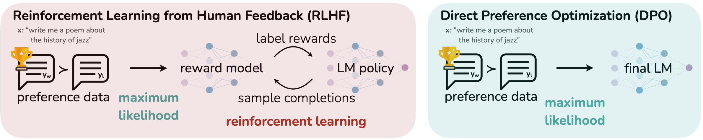
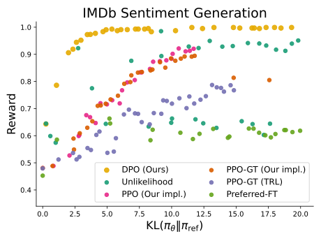
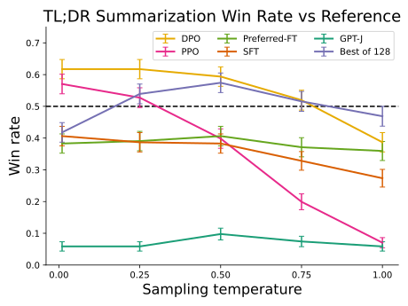
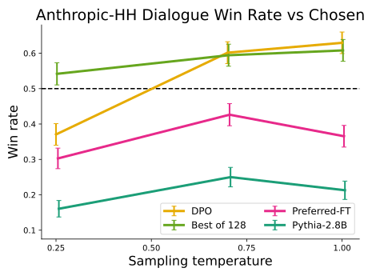
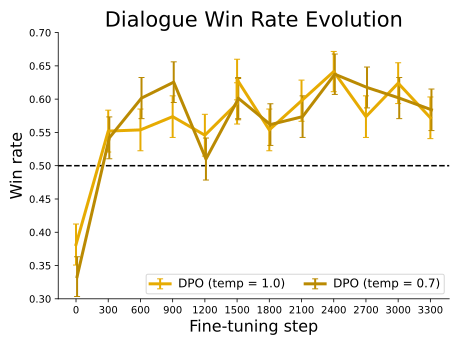

# DPO：怎样把 KL-Regularized RLHF 消元成一个二分类损失

> **论文**：[Direct Preference Optimization: Your Language Model is Secretly a Reward Model](https://arxiv.org/abs/2305.18290)  
> **类型**：A · 原始方法论文  
> **一句话定位**：DPO 不是“把 PPO 换成一个更简单的 loss”。它真正的数学核心是：先解出 **KL-regularized reward maximization** 的最优 policy，再把 reward 用 policy/reference 的 log-ratio 重参数化；由于 Bradley–Terry preference model 只依赖 reward difference，未知 partition function 会自动消掉，最终可以直接对 preference pair 做 maximum likelihood。

DPO 现在值得单独下钻，因为它已经从“可选方法”变成现代模型主线中的高频组件：

- [Llama 3](../../B/05-moe-complete-llm/B011-llama3.md) 把 DPO 放在 SFT 之后做 preference alignment；
- [Qwen2.5](../../B/05-moe-complete-llm/B012-qwen2.5.md) 先做 Offline DPO，再做 Online GRPO；
- [DeepSeekMath / GRPO](A051-deepseekmath-grpo.md) 则代表另一条显式 policy-gradient 路线。

所以现在正好可以回答一个关键问题：

> **如果我们手里本来就只有“回答 A 比回答 B 好”这种 preference data，为什么一定要先训练 Reward Model，再通过 PPO 间接更新语言模型？能不能直接从 preference pair 得到 policy 的训练目标？**

DPO 的答案是：可以，而且在一组明确假设下，这不是经验技巧，而是能从标准 KL-regularized RLHF objective 严格推出。

---

## 阅读导航

如果下面几个概念已经熟悉，可以直接进入第 6 节：

- SFT 的 maximum likelihood / cross entropy；
- Reward Model 的 pairwise preference likelihood；
- KL regularization；
- PPO 中 policy、reference policy、reward 的角色；
- sequence probability 是 token conditional probabilities 的乘积。

相关站内文章：

- [DeepSeekMath / GRPO](A051-deepseekmath-grpo.md)：PPO、Advantage、Critic、GRPO；
- [Llama 3](../../B/05-moe-complete-llm/B011-llama3.md)：RM → Rejection Sampling → SFT → DPO；
- [Qwen2.5](../../B/05-moe-complete-llm/B012-qwen2.5.md)：SFT → Offline DPO → Online GRPO。

本文重点解决：

1. RLHF 为什么先训练 Reward Model？
2. Bradley–Terry model 到底在建模什么？
3. KL penalty 为什么会让最优 policy 有 closed form？
4. partition function \(Z(x)\) 为什么看似麻烦，却能在 DPO 中消失？
5. 为什么 reward 可以写成 \(\beta\log\frac{\pi}{\pi_{\mathrm{ref}}}\)？
6. “Your Language Model is Secretly a Reward Model” 到底是什么意思？
7. DPO loss 怎样一步步推出来？
8. DPO 是 response-level preference，为什么 token 参数仍然能被训练？
9. \(\beta\) 为什么既乘在 DPO logit 上，又代表更强 KL regularization？
10. reference policy 为什么不可有可无？
11. DPO gradient 为什么不是简单的“preferred 加、rejected 减”？
12. DPO 与 SFT、Unlikelihood、PPO、GRPO 到底差在哪里？
13. “DPO 与 RLHF 等价”这句话在哪些条件下成立，又不能怎样扩大解释？

---

## 1. 从问题场景开始：Preference Learning 缺的究竟是什么？

给定 prompt：

$$
x.
$$

模型生成两个回答：

$$
y_1,\qquad y_2.
$$

人类通常很难给出稳定的绝对效用值，例如：

$$
r(x,y_1)=7.3,\qquad r(x,y_2)=5.8.
$$

但相对判断容易得多：

$$
y_1\succ y_2\mid x.
$$

也就是：

> 在 prompt \(x\) 下，我更喜欢 \(y_1\)。

于是 preference dataset 通常写成：

$$
\mathcal D
=
\left\{
(x^{(i)},y_w^{(i)},y_l^{(i)})
\right\}_{i=1}^N,
$$

其中：

- \(y_w\)：winner / preferred response；
- \(y_l\)：loser / dispreferred response。

现在真正的问题是：

> **这种“相对关系”怎样转化成语言模型参数 \(\theta\) 的训练信号？**

---

## 2. 为什么只拿 preferred response 做 SFT 不够？

最直接的想法：

> 既然 \(y_w\) 更好，那就只训练 \(y_w\)。

即：

$$
\mathcal L_{\text{Preferred-FT}}
=
-\log\pi_\theta(y_w|x).
$$

这当然会提高 preferred response 的 likelihood。

但它完全没有使用：

$$
y_l.
$$

例如：

~~~text
Prompt:
“机器人 CAN 总线突然无响应，应该先查什么？”

Preferred:
“先确认供电与总线物理层，再检查错误帧和节点状态。”

Rejected:
“直接重新烧写所有控制器固件。”
~~~

只做 preferred SFT，只告诉模型：

> 这个回答值得模仿。

它没有告诉模型：

> 相对于另一个回答，这个回答更好。

Preference data 最宝贵的信息恰恰是：

$$
\text{relative ordering}.
$$

所以我们真正想学习的是某种：

$$
\text{preference margin}.
$$

---

## 3. 那直接“preferred 加、rejected 减”不就行了？

第二个自然想法：

$$
\mathcal L_{\text{naive}}
=
-\log\pi_\theta(y_w|x)
+
\log\pi_\theta(y_l|x).
$$

最小化它，相当于：

- 增加 \(y_w\) likelihood；
- 降低 \(y_l\) likelihood。

看起来正好。

问题是，这个 objective 没有回答：

> rejected 应该降低多少才够？

理论上，它总可以通过继续降低：

$$
\log\pi_\theta(y_l|x)
$$

来减小 loss。

但语言模型参数被大量 token、sequence 共享。

无约束地压低某些完整序列 likelihood，可能把概率质量推向奇怪区域，甚至破坏自然语言分布。

DPO 原论文的 Unlikelihood baseline 就观察到明显退化生成，包括大量重复 token。

所以我们缺的不是一句：

> \(y_w\uparrow,\ y_l\downarrow\)。

而是：

> **相对于一个可靠的 reference policy，到底需要拉开多大的 preference gap？当 pair 已经排序正确后，梯度是否应该自动衰减？**

DPO 的结构正是为此而来。

---

## 4. 标准 RLHF 为什么要绕一圈：Preference → Reward → Policy？

先把经典流程写完整。

*原论文 Figure 1。传统 RLHF 先用 preference data 训练显式 Reward Model，再通过 RL 优化 policy；DPO 则把 preference likelihood 直接写成 policy/reference log-ratio 的函数，因此不需要单独训练 reward head，也不需要在 DPO 更新阶段执行 PPO rollout。*

经典 RLHF 可以拆成三阶段。

### 4.1 SFT

先从高质量监督数据得到：

$$
\pi_{\mathrm{SFT}}.
$$

### 4.2 Reward Modeling

采样 response pairs：

$$
(y_1,y_2)\sim\pi_{\mathrm{SFT}}(\cdot|x),
$$

让人工给出：

$$
y_w\succ y_l.
$$

再训练：

$$
r_\phi(x,y).
$$

### 4.3 RL Fine-tuning

让当前 policy：

$$
\pi_\theta
$$

最大化 Reward Model 给出的 reward，同时不能离 reference policy 太远。

DPO 的问题意识非常明确：

> **显式 Reward Model + RL optimization，是实现 preference learning 的必要中间步骤吗？**

---

## 5. Reward Model 第一性原理：人类只给排序，为什么能学 scalar reward？

DPO 沿用经典 Bradley–Terry preference model。

假设人类判断背后存在 latent reward：

$$
r^*(x,y).
$$

我们看不到这个 reward，只看到 pairwise preference。

Bradley–Terry 假设：

$$
p^*(y_1\succ y_2|x)
=
\frac{
\exp(r^*(x,y_1))
}{
\exp(r^*(x,y_1))
+
\exp(r^*(x,y_2))
}.
$$

把分子分母同时除以：

$$
\exp(r^*(x,y_1)),
$$

得到：

$$
p^*(y_1\succ y_2|x)
=
\frac{
1
}{
1+\exp(r^*(x,y_2)-r^*(x,y_1))
}.
$$

利用：

$$
\sigma(z)=\frac{1}{1+e^{-z}},
$$

于是：

$$
\boxed{
p^*(y_1\succ y_2|x)
=
\sigma
\left(
r^*(x,y_1)-r^*(x,y_2)
\right).
}
$$

最重要的不是 sigmoid 本身，而是：

> preference probability 只依赖 **reward difference**。

也就是：

$$
\Delta r
=
r(x,y_1)-r(x,y_2).
$$

---

## 6. Reward Model loss 为什么是 \(-\log\sigma(\Delta r)\)？

数据已经告诉我们：

$$
y_w\succ y_l.
$$

Reward Model 对这个事件预测：

$$
p_\phi
=
\sigma
\left(
r_\phi(x,y_w)-r_\phi(x,y_l)
\right).
$$

maximum likelihood：

$$
\max_\phi
\prod_i
p_\phi^{(i)}.
$$

取 log：

$$
\max_\phi
\sum_i
\log p_\phi^{(i)}.
$$

改写为 minimization：

$$
\boxed{
\mathcal L_R
=
-
\mathbb E_{(x,y_w,y_l)\sim\mathcal D}
\left[
\log
\sigma
\left(
r_\phi(x,y_w)-r_\phi(x,y_l)
\right)
\right].
}
$$

所以 Reward Model 并不是在拟合一个“人工绝对分数”。

它做的是：

> 找一个 scalar function，使 reward difference 能解释 preference ordering。

---

## 7. 经典 RLHF 的第二个核心：为什么必须加 KL？

如果有了 Reward Model，最直接的 objective 是：

$$
\max_\pi
\mathbb E_{y\sim\pi(\cdot|x)}
[r(x,y)].
$$

但 Reward Model 只在有限数据分布上可靠。

如果 policy 无限追逐 reward，可能会找到：

- Reward Model blind spot；
- bizarre high-reward sequence；
- mode collapse；
- 离自然语言分布很远的输出。

所以经典 RLHF 使用：

$$
\boxed{
J(\pi)
=
\mathbb E_{x,y\sim\pi}
[r(x,y)]
-
\beta
D_{\mathrm{KL}}
\left(
\pi(\cdot|x)
\|
\pi_{\mathrm{ref}}(\cdot|x)
\right).
}
$$

其中 reference 通常来自 SFT model。

\(\beta>0\) 控制“偏离 reference 的价格”。

### \(\beta\) 大

更强地惩罚偏离：

$$
\pi\approx\pi_{\mathrm{ref}}.
$$

### \(\beta\) 小

policy 更愿意离开 reference 去追逐 reward。

这条 objective 是 DPO 的真正起点。

---

## 8. DPO 最关键的一步：先别想 PPO，直接求这个优化问题的最优 policy

固定一个 prompt \(x\)。

把所有 response 记成 \(y\)。

此时先把：

$$
\pi(y|x)
$$

看成一个可以自由优化的 probability distribution，而不是某个 Transformer 的有限参数函数。

目标：

$$
\max_{\pi}
\sum_y
\pi(y|x)r(x,y)
-
\beta
\sum_y
\pi(y|x)
\log
\frac{\pi(y|x)}
{\pi_{\mathrm{ref}}(y|x)}.
$$

约束：

$$
\sum_y\pi(y|x)=1.
$$

这个问题实际上可以解析求解。

---

## 9. 用拉格朗日乘子推导最优 policy

为方便记：

$$
\pi_y=\pi(y|x),
\qquad
r_y=r(x,y),
\qquad
\pi_{\mathrm{ref},y}
=
\pi_{\mathrm{ref}}(y|x).
$$

写 Lagrangian：

$$
\mathcal J
=
\sum_y\pi_y r_y
-
\beta
\sum_y
\pi_y
\log
\frac{\pi_y}{\pi_{\mathrm{ref},y}}
+
\lambda
\left(
\sum_y\pi_y-1
\right).
$$

对 \(\pi_y\) 求偏导：

$$
\frac{\partial\mathcal J}{\partial\pi_y}
=
r_y
-
\beta
\left(
\log\frac{\pi_y}{\pi_{\mathrm{ref},y}}
+
1
\right)
+
\lambda.
$$

令其为 0：

$$
r_y
-
\beta
\log\frac{\pi_y}{\pi_{\mathrm{ref},y}}
-
\beta
+
\lambda
=
0.
$$

移项：

$$
\beta
\log
\frac{\pi_y}{\pi_{\mathrm{ref},y}}
=
r_y+\lambda-\beta.
$$

除以 \(\beta\)：

$$
\log
\frac{\pi_y}{\pi_{\mathrm{ref},y}}
=
\frac{r_y}{\beta}
+
\frac{\lambda}{\beta}
-
1.
$$

指数化：

$$
\frac{\pi_y}{\pi_{\mathrm{ref},y}}
=
\exp\left(\frac{r_y}{\beta}\right)
\exp\left(\frac{\lambda}{\beta}-1\right).
$$

于是：

$$
\pi_y
=
\pi_{\mathrm{ref},y}
\exp\left(\frac{r_y}{\beta}\right)
C(x),
$$

其中：

$$
C(x)
=
\exp\left(\frac{\lambda}{\beta}-1\right)
$$

对固定 \(x\) 是常数。

利用：

$$
\sum_y\pi_y=1,
$$

得到：

$$
C(x)
=
\frac{
1
}{
\sum_y
\pi_{\mathrm{ref}}(y|x)
\exp(r(x,y)/\beta)
}.
$$

定义 partition function：

$$
\boxed{
Z(x)
=
\sum_y
\pi_{\mathrm{ref}}(y|x)
\exp\left(
\frac{r(x,y)}{\beta}
\right).
}
$$

最终：

$$
\boxed{
\pi_r(y|x)
=
\frac{1}{Z(x)}
\pi_{\mathrm{ref}}(y|x)
\exp
\left(
\frac{r(x,y)}{\beta}
\right).
}
$$

这就是 DPO 的第一块数学基石。

---

## 10. 这个 closed form 到底意味着什么？

把它写成比例：

$$
\pi_r
\propto
\pi_{\mathrm{ref}}
\times
e^{r/\beta}.
$$

reference policy 给出：

> 原本这个 response 有多自然、多可能。

reward exponential 给出：

> preference reward 要把它重新加权多少。

所以最优 aligned policy 是：

~~~text
Reference distribution
        ×
reward-based exponential tilt
        ↓
KL-regularized optimal policy
~~~

这就是 exponential tilting。

如果某个 response reward 更高：

$$
e^{r/\beta}
$$

更大，它相对 reference 得到更高 probability mass。

---

## 11. \(\beta\) 在 closed form 中做什么？

最优 policy：

$$
\pi_r(y|x)
\propto
\pi_{\mathrm{ref}}(y|x)
e^{r(x,y)/\beta}.
$$

若：

$$
\beta\to\infty,
$$

则：

$$
\frac{r}{\beta}\to0,
$$

所以：

$$
e^{r/\beta}\to1.
$$

因此：

$$
\pi_r\to\pi_{\mathrm{ref}}.
$$

反过来，当 \(\beta\) 很小，reward difference 被指数放大，policy 更愿意离开 reference。

所以：

$$
\boxed{
\beta\uparrow
\Rightarrow
\text{stronger regularization}
\Rightarrow
\pi^*\text{ closer to }\pi_{\mathrm{ref}}.
}
$$

后面 DPO loss 中 \(\beta\) 又乘在 logit 前，这并不矛盾，我们会专门拆。

---

## 12. 用 KL 重写再证明一次：为什么这是全局最优解？

定义：

$$
q(y|x)
=
\frac{1}{Z(x)}
\pi_{\mathrm{ref}}(y|x)
e^{r(x,y)/\beta}.
$$

那么：

$$
\log q
=
\log\pi_{\mathrm{ref}}
+
\frac{r}{\beta}
-
\log Z.
$$

计算：

$$
D_{\mathrm{KL}}(\pi\|q)
=
\mathbb E_\pi
\left[
\log\pi-\log q
\right].
$$

代入：

$$
D_{\mathrm{KL}}(\pi\|q)
=
\mathbb E_\pi
\left[
\log\frac{\pi}{\pi_{\mathrm{ref}}}
-
\frac{r}{\beta}
+
\log Z
\right].
$$

对固定 \(x\)，\(\log Z(x)\) 与 \(y\) 无关，所以：

$$
D_{\mathrm{KL}}(\pi\|q)
=
D_{\mathrm{KL}}(\pi\|\pi_{\mathrm{ref}})
-
\frac{1}{\beta}
\mathbb E_\pi[r]
+
\log Z.
$$

两边乘 \(-\beta\)：

$$
-\beta D_{\mathrm{KL}}(\pi\|q)
=
-\beta D_{\mathrm{KL}}(\pi\|\pi_{\mathrm{ref}})
+
\mathbb E_\pi[r]
-
\beta\log Z.
$$

整理：

$$
\boxed{
J(\pi)
=
\beta\log Z(x)
-
\beta
D_{\mathrm{KL}}
(
\pi(\cdot|x)
\|
q(\cdot|x)
).
}
$$

第一项与 \(\pi\) 无关。

所以最大化 \(J\) 等价于：

$$
\min_\pi
D_{\mathrm{KL}}(\pi\|q).
$$

KL 最小值是 0，当且仅当：

$$
\pi=q.
$$

因此：

$$
\boxed{
\pi^*=\pi_r.
}
$$

这说明前面的 closed form 不是局部 stationary point，而是这个 distribution optimization 的全局最优解。

---

## 13. 为什么 closed form 还不能直接拿来训练？

现在我们有：

$$
\pi^*(y|x)
=
\frac{1}{Z(x)}
\pi_{\mathrm{ref}}(y|x)
e^{r(x,y)/\beta}.
$$

但现实里有两个致命问题。

### 问题 1：reward 本来未知

我们只有：

$$
y_w\succ y_l.
$$

### 问题 2：partition function 几乎不可算

$$
Z(x)
=
\sum_y
\pi_{\mathrm{ref}}(y|x)
e^{r(x,y)/\beta}.
$$

这里的 \(y\) 是所有可能的 response sequence。

语言模型的 sequence space 巨大到无法枚举。

所以如果真的要先恢复：

$$
r(x,y),
$$

再显式计算：

$$
Z(x),
$$

这个 closed form 仍然不能直接变成可训练算法。

DPO 的第二个关键想法就是：

> **不要算 \(Z(x)\)。把 reward 反解出来，然后利用 Bradley–Terry 只看 reward difference 这一点，让 \(Z(x)\) 自动消失。**

---

## 14. 从 optimal policy 反解 reward

从：

$$
\pi_r(y|x)
=
\frac{1}{Z(x)}
\pi_{\mathrm{ref}}(y|x)
e^{r(x,y)/\beta}
$$

开始。

两边除以 reference：

$$
\frac{\pi_r(y|x)}
{\pi_{\mathrm{ref}}(y|x)}
=
\frac{1}{Z(x)}
e^{r(x,y)/\beta}.
$$

取 log：

$$
\log
\frac{\pi_r(y|x)}
{\pi_{\mathrm{ref}}(y|x)}
=
-\log Z(x)
+
\frac{r(x,y)}{\beta}.
$$

乘 \(\beta\)：

$$
\beta
\log
\frac{\pi_r(y|x)}
{\pi_{\mathrm{ref}}(y|x)}
=
-\beta\log Z(x)
+
r(x,y).
$$

因此：

$$
\boxed{
r(x,y)
=
\beta
\log
\frac{\pi_r(y|x)}
{\pi_{\mathrm{ref}}(y|x)}
+
\beta\log Z(x).
}
$$

这条式子就是 DPO 最关键的 change of variables。

---

## 15. reward 被拆成了哪两部分？

刚才的式子：

$$
r(x,y)
=
\underbrace{
\beta
\log
\frac{\pi_r(y|x)}
{\pi_{\mathrm{ref}}(y|x)}
}_{\text{response-dependent}}
+
\underbrace{
\beta\log Z(x)
}_{\text{prompt-only offset}}.
$$

第一项问：

> aligned policy 相比 reference，提高或降低了这个 response 多少 log probability？

第二项：

> 对同一个 prompt 的所有 response 都一样。

这已经暗示：

> 如果 preference model 只关心两个 response 的 reward difference，那么第二项会完全抵消。

下一步就是把这个“抵消”做成严格推导。
## 16. 为什么 reward 本来就不可能从 preference 中唯一确定？

假设：

$$
r'(x,y)
=
r(x,y)+f(x).
$$

也就是对同一个 prompt，所有 response 的 reward 都整体加一个只与 \(x\) 有关的常数。

那么：

$$
r'(x,y_w)-r'(x,y_l)
$$

等于：

$$
[r(x,y_w)+f(x)]
-
[r(x,y_l)+f(x)].
$$

所以：

$$
\boxed{
r'(x,y_w)-r'(x,y_l)
=
r(x,y_w)-r(x,y_l).
}
$$

Bradley–Terry probability 因而完全不变：

$$
p_{r'}(y_w\succ y_l|x)
=
p_r(y_w\succ y_l|x).
$$

这意味着 preference dataset 永远无法区分：

$$
r(x,y)
$$

与：

$$
r(x,y)+f(x).
$$

这不是数据量不够，也不是 Reward Model 没训练好。

它是 preference model 的结构性 identifiability 限制。

---

## 17. Reward Equivalence Class：我们真正能辨识的是一个 reward 类

DPO 论文因此定义：

如果存在只依赖 prompt 的函数 \(f(x)\)，使：

$$
r'(x,y)=r(x,y)+f(x),
$$

那么 \(r\) 与 \(r'\) 属于同一个 reward equivalence class。

直觉上：

~~~text
同一个 prompt 下
所有 response reward
一起整体上移 / 下移
        ↓
任何 pair 的 reward difference 不变
        ↓
Bradley–Terry preference probability 不变
~~~

所以 preference learning 真正能识别的是：

$$
[r],
$$

而不是唯一绝对 reward function。

---

## 18. 更关键：同一 reward class 连 KL-regularized 最优 policy 都一样

现在不只看 preference。

看：

$$
\pi_r(y|x)
=
\frac{
\pi_{\mathrm{ref}}(y|x)e^{r(x,y)/\beta}
}{
Z_r(x)
}.
$$

若：

$$
r'(x,y)=r(x,y)+f(x),
$$

那么分子：

$$
\pi_{\mathrm{ref}}(y|x)e^{r'(x,y)/\beta}
=
e^{f(x)/\beta}
\pi_{\mathrm{ref}}(y|x)e^{r(x,y)/\beta}.
$$

对应 partition function：

$$
Z_{r'}(x)
=
e^{f(x)/\beta}
Z_r(x).
$$

上下同时多出：

$$
e^{f(x)/\beta},
$$

所以：

$$
\boxed{
\pi_{r'}(y|x)
=
\pi_r(y|x).
}
$$

这是一个非常漂亮的对齐：

> Bradley–Terry 不关心 reward class 内的 prompt-only offset；KL-regularized optimal policy 同样不关心。

因此我们没有必要恢复“真实绝对 reward”。

只需要恢复这个 equivalence class 中的一个方便代表。

---

## 19. DPO 选择了哪个 reward representative？

前面得到：

$$
r(x,y)
=
\beta
\log
\frac{\pi_r(y|x)}
{\pi_{\mathrm{ref}}(y|x)}
+
\beta\log Z(x).
$$

定义：

$$
\tilde r(x,y)
=
r(x,y)
-
\beta\log Z(x).
$$

由于：

$$
\beta\log Z(x)
$$

只依赖 prompt，所以：

$$
\tilde r\sim r.
$$

也就是同一 reward equivalence class。

而：

$$
\boxed{
\tilde r(x,y)
=
\beta
\log
\frac{\pi_r(y|x)}
{\pi_{\mathrm{ref}}(y|x)}.
}
$$

于是 DPO 选取 canonical representative：

$$
\boxed{
\hat r_\pi(x,y)
=
\beta
\log
\frac{\pi(y|x)}
{\pi_{\mathrm{ref}}(y|x)}.
}
$$

这就是论文标题：

> **Your Language Model is Secretly a Reward Model**

真正的数学含义。

---

## 20. “语言模型就是 Reward Model”不能怎样理解？

一个很常见的误读是：

> LM 的 token logit 本来就是 reward。

不是。

DPO 的说法严格依赖：

1. 一个 fixed reference policy：
   $$
   \pi_{\mathrm{ref}};
   $$

2. 一个 KL coefficient：
   $$
   \beta;
   $$

3. sequence-level probability ratio：
   $$
   \frac{\pi_\theta(y|x)}
   {\pi_{\mathrm{ref}}(y|x)}.
   $$

implicit reward 才是：

$$
\boxed{
\hat r_\theta(x,y)
=
\beta
\left[
\log\pi_\theta(y|x)
-
\log\pi_{\mathrm{ref}}(y|x)
\right].
}
$$

所以它不是单模型绝对 quantity。

它是：

> **policy 相对 reference 对某个 response 做了多大概率重分配。**

---

## 21. 这个重参数化有没有偷偷限制 reward expressiveness？

这是原论文 Theorem 1 的重点。

问题是：

> 普通 Reward Model \(r_\phi(x,y)\) 看起来可以任意输出 scalar；现在强行写成
> \[
> \beta\log\frac{\pi(y|x)}{\pi_{\mathrm{ref}}(y|x)}
> \]
> 会不会缩小 reward function class？

论文证明：在 reference policy 对考虑的 response 有正概率、\(\beta>0\) 等条件下，每个 Bradley–Terry / Plackett–Luce 可辨识的 reward equivalence class，都存在一个代表可以写成：

$$
r(x,y)
=
\beta\log
\frac{\pi(y|x)}
{\pi_{\mathrm{ref}}(y|x)}.
$$

因此从 preference-identifiable information 的角度：

> **DPO 的重参数化没有丢掉 reward equivalence class。**

但措辞要准确。

它不是说：

> 任意有限参数 Transformer 都能完美表示任意 reward。

而是说：

> 在非参数 policy space 的理论映射上，每个 relevant reward class 都能对应到某个 policy。

实际有限模型、有限数据、有限优化当然仍有 approximation error。

---

## 22. partition function 为什么现在会严格消失？

回到 Bradley–Terry：

$$
p(y_w\succ y_l|x)
=
\sigma(
r(x,y_w)-r(x,y_l)
).
$$

将：

$$
r(x,y)
=
\beta
\log
\frac{\pi^*(y|x)}
{\pi_{\mathrm{ref}}(y|x)}
+
\beta\log Z(x)
$$

代入。

preferred reward：

$$
r_w
=
\beta
\log
\frac{\pi^*(y_w|x)}
{\pi_{\mathrm{ref}}(y_w|x)}
+
\beta\log Z(x).
$$

rejected reward：

$$
r_l
=
\beta
\log
\frac{\pi^*(y_l|x)}
{\pi_{\mathrm{ref}}(y_l|x)}
+
\beta\log Z(x).
$$

做差：

$$
r_w-r_l
=
\beta
\log
\frac{\pi^*(y_w|x)}
{\pi_{\mathrm{ref}}(y_w|x)}
-
\beta
\log
\frac{\pi^*(y_l|x)}
{\pi_{\mathrm{ref}}(y_l|x)}.
$$

因为：

$$
+\beta\log Z(x)-\beta\log Z(x)=0.
$$

于是：

$$
\boxed{
p^*(y_w\succ y_l|x)
=
\sigma
\left(
\beta
\left[
\log
\frac{\pi^*(y_w|x)}
{\pi_{\mathrm{ref}}(y_w|x)}
-
\log
\frac{\pi^*(y_l|x)}
{\pi_{\mathrm{ref}}(y_l|x)}
\right]
\right).
}
$$

现在整个式子：

- 没有显式 Reward Model；
- 没有 partition function；
- 只剩 policy 与 reference 的 log probability。

这就是 DPO 能成立的关键消元。

---

## 23. 最后一步：把未知 \(\pi^*\) 换成 trainable \(\pi_\theta\)

真实 optimal policy：

$$
\pi^*
$$

当然未知。

于是参数化：

$$
\pi_\theta.
$$

定义模型对 preference event 的概率：

$$
p_\theta(y_w\succ y_l|x)
=
\sigma
\left(
\beta
\left[
\log
\frac{\pi_\theta(y_w|x)}
{\pi_{\mathrm{ref}}(y_w|x)}
-
\log
\frac{\pi_\theta(y_l|x)}
{\pi_{\mathrm{ref}}(y_l|x)}
\right]
\right).
$$

数据标签已经告诉我们：

$$
y_w\succ y_l.
$$

maximum likelihood：

$$
\max_\theta
\mathbb E_{\mathcal D}
\left[
\log p_\theta(y_w\succ y_l|x)
\right].
$$

改成 loss：

$$
\boxed{
\mathcal L_{\mathrm{DPO}}
=
-
\mathbb E_{(x,y_w,y_l)\sim\mathcal D}
\log
\sigma
\left(
\beta
\left[
\log
\frac{\pi_\theta(y_w|x)}
{\pi_{\mathrm{ref}}(y_w|x)}
-
\log
\frac{\pi_\theta(y_l|x)}
{\pi_{\mathrm{ref}}(y_l|x)}
\right]
\right).
}
$$

这就是完整 DPO objective。

---

## 24. 把 DPO loss 重写成最容易理解的形式

定义 trainable policy 的 pairwise log-odds gap：

$$
\Delta_\theta
=
\log\pi_\theta(y_w|x)
-
\log\pi_\theta(y_l|x).
$$

定义 reference gap：

$$
\Delta_{\mathrm{ref}}
=
\log\pi_{\mathrm{ref}}(y_w|x)
-
\log\pi_{\mathrm{ref}}(y_l|x).
$$

于是：

$$
\boxed{
z_\theta
=
\beta
(
\Delta_\theta-\Delta_{\mathrm{ref}}
).
}
$$

DPO loss：

$$
\boxed{
\mathcal L_{\mathrm{DPO}}
=
-\log\sigma(z_\theta).
}
$$

这个形式非常重要。

DPO 不是要求：

$$
\pi_\theta(y_w|x)
>
\pi_\theta(y_l|x)
$$

这么简单。

它要求的是：

$$
\Delta_\theta
>
\Delta_{\mathrm{ref}}.
$$

也就是：

> **相比 reference，当前 policy 更偏向 preferred response。**

---

## 25. 一个数值例子：preferred 的绝对概率仍然可以比 rejected 小

假设 reference：

$$
\log\pi_{\mathrm{ref}}(y_w|x)=-12,
$$

$$
\log\pi_{\mathrm{ref}}(y_l|x)=-10.
$$

reference gap：

$$
\Delta_{\mathrm{ref}}
=
-12-(-10)
=
-2.
$$

也就是说 reference 实际更偏向 rejected。

训练一段时间后，policy：

$$
\log\pi_\theta(y_w|x)=-10.5,
$$

$$
\log\pi_\theta(y_l|x)=-10.2.
$$

此时：

$$
\pi_\theta(y_w|x)
<
\pi_\theta(y_l|x).
$$

因为：

$$
-10.5<-10.2.
$$

但是 policy gap：

$$
\Delta_\theta
=
-10.5-(-10.2)
=
-0.3.
$$

相比 reference：

$$
\Delta_\theta-\Delta_{\mathrm{ref}}
=
-0.3-(-2)
=
1.7.
$$

如果：

$$
\beta=0.5,
$$

那么：

$$
z=0.85.
$$

DPO implied preference probability：

$$
\sigma(0.85)
\approx0.70.
$$

所以：

> DPO 衡量的不是 preferred response 当前是否已经拥有更高绝对 sequence probability，而是当前 policy 相比 reference，把 pairwise preference 往正确方向推进了多少。

---

## 26. response probability 到底是什么？为什么一个完整回答会有极小概率？

对于 autoregressive LM：

$$
y=(y_1,y_2,\dots,y_T).
$$

sequence probability：

$$
\pi_\theta(y|x)
=
\prod_{t=1}^T
\pi_\theta(
y_t
\mid
x,y_{<t}
).
$$

取 log：

$$
\boxed{
\log\pi_\theta(y|x)
=
\sum_{t=1}^T
\log
\pi_\theta(
y_t
\mid
x,y_{<t}
).
}
$$

因为每个 token probability 都小于等于 1，完整 sequence probability 往往极小。

工程上不会直接乘一串概率，而是计算 token log probability 再求和。

---

## 27. DPO 是 response-level preference，为什么最终能训练每个 token？

看：

$$
\log\pi_\theta(y_w|x)
=
\sum_{t=1}^{T_w}
\log\pi_\theta(
y_{w,t}
|
x,y_{w,<t}
).
$$

对参数求梯度：

$$
\nabla_\theta
\log\pi_\theta(y_w|x)
=
\sum_{t=1}^{T_w}
\nabla_\theta
\log\pi_\theta(
y_{w,t}
|
x,y_{w,<t}
).
$$

因此虽然 preference label 是：

$$
\text{whole response level},
$$

梯度仍然会通过 sequence log-prob decomposition 传播到每个 token prediction。

所以 DPO 的 credit assignment 是：

> response-level scalar preference，通过 autoregressive log-likelihood sum 广播到 response 内所有 token。

这和 PPO/GRPO 的 token-level objective 有相似之处，但不是同一个机制。

---

## 28. DPO 对一个 response 内的所有 token 权重都一样吗？

从最外层 pairwise scalar weight 来看，是同一个 pair weight 乘在 sequence score gradient 上。

假设：

$$
g_w
=
\nabla_\theta\log\pi_\theta(y_w|x).
$$

展开：

$$
g_w
=
\sum_t
\nabla_\theta
\log\pi_\theta(y_{w,t}|x,y_{w,<t}).
$$

同一个 pair-level coefficient 会乘到这个 sum 上。

所以 DPO 本身没有显式回答：

> preferred response 中究竟第 17 个 token 好，还是第 31 个 token 好？

它只有：

$$
y_w\succ y_l.
$$

这是 outcome-level preference 的固有限制。

如果希望更细粒度 credit assignment，就需要：

- process reward；
- token/step-level preference；
- verifier；
- sequence-level RL 中更丰富的 return structure。

---

## 29. DPO 的 implicit reward 也可以展开到 token 级

定义：

$$
\hat r_\theta(x,y)
=
\beta
\log
\frac{\pi_\theta(y|x)}
{\pi_{\mathrm{ref}}(y|x)}.
$$

由于 sequence log probability 是 token log probability 求和：

$$
\hat r_\theta(x,y)
=
\beta
\sum_t
\left[
\log\pi_\theta(y_t|x,y_{<t})
-
\log\pi_{\mathrm{ref}}(y_t|x,y_{<t})
\right].
$$

可以定义 token-level contribution：

$$
\hat r_{\theta,t}
=
\beta
\left[
\log\pi_\theta(y_t|s_t)
-
\log\pi_{\mathrm{ref}}(y_t|s_t)
\right].
$$

那么：

$$
\hat r_\theta(x,y)
=
\sum_t
\hat r_{\theta,t}.
$$

但是要注意：

> 原始 DPO preference label 仍然只是 sequence-level label。

这种 token decomposition 是 autoregressive factorization 给出的 algebraic decomposition，不是人工提供了 token reward。

---

## 30. reference policy 到底在 DPO 中做了什么？

如果去掉 reference，loss 会变成类似：

$$
-\log\sigma
\left(
\beta[
\log\pi_\theta(y_w|x)
-
\log\pi_\theta(y_l|x)
]
\right).
$$

这变成：

> 只要 policy 自己越来越偏 \(y_w\) 就行。

但 DPO 的理论来源是：

$$
\max_\pi
\mathbb E[r]
-
\beta D_{\mathrm{KL}}(\pi\|\pi_{\mathrm{ref}}).
$$

所以 reference 不是训练稳定小技巧。

它承担的是 reward scale 的锚点：

$$
\hat r_\theta
=
\beta
\log
\frac{\pi_\theta}
{\pi_{\mathrm{ref}}}.
$$

某个 response 的 probability 变大还是变小，本身没有 preference reward 意义。

只有：

> **相对 reference 改变了多少**

才对应 DPO implicit reward。

---

## 31. reference policy 为什么通常是 SFT model？

Preference data 通常来自某个 SFT / assistant policy 附近。

例如：

$$
y_1,y_2
\sim
\pi_{\mathrm{SFT}}(\cdot|x).
$$

于是自然选择：

$$
\pi_{\mathrm{ref}}
=
\pi_{\mathrm{SFT}}.
$$

这样做有两个理由。

### 理论上

KL-regularized RLHF 本来就是相对一个 base/reference policy 优化。

### 分布上

preference labels 通常对 reference 附近的 responses 更可靠。

如果 policy 跑得太远：

- 人类 preference dataset 不覆盖；
- learned preference relation 外推；
- response style / format 可能漂移。

因此 reference 是：

> **alignment optimization 的分布坐标系。**

---

## 32. 如果原始 SFT model 不可用怎么办？

DPO 原论文也考虑这个问题。

如果公开 preference dataset 只给：

$$
(x,y_w,y_l),
$$

但没有当初生成这些 pairs 的 SFT model，可以先在 preferred completions 上做 maximum likelihood：

$$
\pi_{\mathrm{ref}}
=
\arg\max_\pi
\mathbb E_{(x,y_w)}
[
\log\pi(y_w|x)
].
$$

也就是先训练一个近似 reference。

论文的动机是减轻：

$$
\text{true sampling policy}
\neq
\text{available reference policy}
$$

带来的 distribution shift。

这也提醒我们：

> DPO 并不是完全“不关心 preference data 是谁生成的”。

数据生成 policy 与 reference mismatch 会影响理论对应关系和实际训练。

---

## 33. \(\beta\) 的“表面矛盾”：为什么 KL 越强，DPO logit 前的系数反而越大？

DPO：

$$
z_\theta
=
\beta
(
\Delta_\theta-\Delta_{\mathrm{ref}}
).
$$

表面看：

$$
\beta\uparrow
$$

会让同一个 gap 产生更大的 sigmoid logit。

于是很容易误解：

> \(\beta\) 大是不是让 preference learning 更激进？

但要回到它真正的定义：

$$
\hat r_\theta
=
\beta
\log
\frac{\pi_\theta}{\pi_{\mathrm{ref}}}.
$$

对同一个 target reward difference：

$$
\Delta r,
$$

需要：

$$
\Delta
\log
\frac{\pi_\theta}{\pi_{\mathrm{ref}}}
=
\frac{\Delta r}{\beta}.
$$

所以：

$$
\beta\uparrow
\Rightarrow
\text{实现同样 reward difference 所需的 policy log-ratio 更小}.
$$

也就是 policy 必须更靠近 reference。

因此理论意义上仍然是：

$$
\boxed{
\beta\uparrow
\Rightarrow
\text{stronger KL regularization}.
}
$$

---

## 34. 再用最优 policy 看一遍 \(\beta\)，避免只盯 loss

最优 policy：

$$
\pi^*
\propto
\pi_{\mathrm{ref}}e^{r/\beta}.
$$

假设两个 response reward difference：

$$
r_w-r_l=2.
$$

### 若 \(\beta=0.1\)

reward tilt ratio：

$$
e^{(r_w-r_l)/\beta}
=
e^{20}.
$$

非常激进。

### 若 \(\beta=2\)

$$
e^{(r_w-r_l)/\beta}
=
e^1.
$$

温和很多。

所以从 underlying RL objective 看非常清楚：

> \(\beta\) 越大，reward 对 reference distribution 的 tilt 越弱。

DPO loss 里的乘法形式只是 reward reparameterization 后的结果。

不能脱离原 objective 单独解释。

---

## 35. DPO gradient：真正训练时到底在做什么？

定义：

$$
z_\theta
=
\beta
\left[
\log\frac{\pi_\theta(y_w|x)}
{\pi_{\mathrm{ref}}(y_w|x)}
-
\log\frac{\pi_\theta(y_l|x)}
{\pi_{\mathrm{ref}}(y_l|x)}
\right].
$$

单样本 loss：

$$
\ell
=
-\log\sigma(z_\theta).
$$

先求：

$$
\frac{d\ell}{dz}
=
-\frac{1}{\sigma(z)}
\sigma(z)(1-\sigma(z)).
$$

所以：

$$
\frac{d\ell}{dz}
=
-(1-\sigma(z)).
$$

利用：

$$
1-\sigma(z)=\sigma(-z),
$$

得到：

$$
\boxed{
\frac{d\ell}{dz}
=
-\sigma(-z).
}
$$

reference policy 是 frozen 的，因此：

$$
\nabla_\theta z
=
\beta
\left[
\nabla_\theta\log\pi_\theta(y_w|x)
-
\nabla_\theta\log\pi_\theta(y_l|x)
\right].
$$

于是：

$$
\boxed{
\nabla_\theta\ell
=
-\beta
\sigma(-z)
\left[
\nabla_\theta\log\pi_\theta(y_w|x)
-
\nabla_\theta\log\pi_\theta(y_l|x)
\right].
}
$$

---

## 36. 用 implicit reward 重写 gradient

定义：

$$
\hat r_w
=
\beta
\log
\frac{\pi_\theta(y_w|x)}
{\pi_{\mathrm{ref}}(y_w|x)},
$$

$$
\hat r_l
=
\beta
\log
\frac{\pi_\theta(y_l|x)}
{\pi_{\mathrm{ref}}(y_l|x)}.
$$

那么：

$$
z
=
\hat r_w-\hat r_l.
$$

所以：

$$
\sigma(-z)
=
\sigma(
\hat r_l-\hat r_w
).
$$

gradient：

$$
\boxed{
\nabla_\theta\ell
=
-\beta
\sigma(
\hat r_l-\hat r_w
)
\left[
\nabla_\theta\log\pi_\theta(y_w|x)
-
\nabla_\theta\log\pi_\theta(y_l|x)
\right].
}
$$

这就是论文强调的 dynamic per-example weighting。

---

## 37. 为什么这个 dynamic weight 非常关键？

考虑三种情况。

### 情况 A：模型完全排反了

$$
\hat r_l\gg\hat r_w.
$$

那么：

$$
\sigma(\hat r_l-\hat r_w)\approx1.
$$

gradient weight 很大。

模型被强烈要求：

- 提高 \(y_w\)；
- 降低 \(y_l\)。

### 情况 B：两者差不多

$$
\hat r_l\approx\hat r_w.
$$

那么：

$$
\sigma(0)=0.5.
$$

仍有明显更新。

### 情况 C：preferred 已明显更高

$$
\hat r_w\gg\hat r_l.
$$

那么：

$$
\sigma(\hat r_l-\hat r_w)\approx0.
$$

更新自动变小。

所以 DPO 不会对每个 preference pair 永远施加同样大的“preferred↑ rejected↓”。

它会问：

> **这个 pair 当前还错得有多严重？**

---

## 38. 为什么 naive Unlikelihood 容易退化？

naive objective：

$$
\ell_{\mathrm{UL}}
=
-\log\pi_\theta(y_w|x)
+
\alpha\log\pi_\theta(y_l|x).
$$

gradient：

$$
\nabla\ell_{\mathrm{UL}}
=
-
\nabla\log\pi_\theta(y_w|x)
+
\alpha
\nabla\log\pi_\theta(y_l|x).
$$

注意 rejected 部分只要继续降低 likelihood，就一直有更新空间。

它没有一个由 pair ordering correctness 自动产生的 saturation factor。

而 DPO 有：

$$
\sigma(\hat r_l-\hat r_w).
$$

当 pair 已经排对且 margin 足够大，更新自动减弱。

所以：

> DPO 不只是“chosen 加、rejected 减”，而是一个带动态困难度权重、受 reference 锚定的 pairwise classifier。

---

## 39. DPO 其实在做什么 classification？

它把每个 preference pair 看成一个 binary classification sample。

输入：

$$
(x,y_w,y_l).
$$

logit：

$$
z_\theta
=
\beta
\left[
\log\frac{\pi_\theta(y_w|x)}
{\pi_{\mathrm{ref}}(y_w|x)}
-
\log\frac{\pi_\theta(y_l|x)}
{\pi_{\mathrm{ref}}(y_l|x)}
\right].
$$

target：

$$
1.
$$

概率：

$$
p_\theta(\text{winner is }y_w)
=
\sigma(z_\theta).
$$

loss：

$$
-\log\sigma(z_\theta).
$$

所以 DPO 的工程实现非常像 binary cross entropy。

但它的 logit 不是普通 linear classifier，而是：

> **两个 response 的 policy-vs-reference sequence log-ratio 差。**

---

## 40. DPO 的 PyTorch 核心为什么可以这么短？

论文附录中的核心逻辑可以抽象成：

~~~python
pi_logratio = logpi_yw - logpi_yl
ref_logratio = logref_yw - logref_yl

logit = beta * (pi_logratio - ref_logratio)
loss = -logsigmoid(logit)
~~~

这四行背后浓缩了：

~~~text
KL-regularized RL objective
        ↓
optimal policy closed form
        ↓
reward reparameterization
        ↓
reward equivalence class
        ↓
Bradley–Terry difference
        ↓
partition function cancellation
        ↓
maximum likelihood
~~~

所以代码短不等于理论浅。

恰好相反：

> DPO 的价值就在于把一个复杂 preference-RL pipeline，通过数学消元压缩成 supervised-style objective。

---

## 41. 为什么 reference forward 可以冻结？

DPO training 中：

$$
\pi_{\mathrm{ref}}
$$

固定。

因此：

$$
\nabla_\theta
\log\pi_{\mathrm{ref}}(y|x)
=
0.
$$

reference 只负责提供：

$$
\log\pi_{\mathrm{ref}}(y_w|x),
\qquad
\log\pi_{\mathrm{ref}}(y_l|x).
$$

工程上可以：

- 单独保留 frozen reference model；
- 预先缓存 reference log-probs；
- adapter 场景下共享 base weights并切换 adapter；
- 使用某些 reference-free 近似，但那已经不是原始 DPO 的同一个理论对象。

原始 DPO 的数学里：

> reference 是 objective 的组成部分，不是可随意删除的 implementation detail。

---

## 42. DPO 与 PPO 最大的结构差别：训练阶段不需要当前 policy rollout

PPO/RLHF：

~~~text
current policy
   ↓
sample fresh rollout
   ↓
Reward Model
   ↓
return / advantage
   ↓
policy update
~~~

DPO：

~~~text
static preference dataset
   ↓
policy log-prob
reference log-prob
   ↓
pairwise classification loss
   ↓
backprop
~~~

所以原始 DPO 是 offline preference optimization。

训练一个 batch 时不需要：

$$
y\sim\pi_\theta
$$

现场生成新 response。

这会显著降低系统复杂度。

---

## 43. 但“DPO 不需要 sampling”这句话也要说完整

DPO 的**训练更新阶段**不需要 on-policy rollout。

但 preference dataset 本身从哪里来？

仍然可能经历：

~~~text
prompt
 ↓
某个模型生成多个 responses
 ↓
human / AI judge 标注 preference
 ↓
形成 static dataset
 ↓
DPO training
~~~

所以更准确地说：

> **DPO 把 sampling 从 inner training loop 中移出去了。**

它并没有让 preference data 凭空出现。

现代 iterative DPO pipeline 甚至可能反复：

$$
\text{new policy}
\rightarrow
\text{new generations}
\rightarrow
\text{new preference data}
\rightarrow
\text{new DPO round}.
$$

例如 [Llama 3](../../B/05-moe-complete-llm/B011-llama3.md) 的多轮 post-training 就有这种数据刷新。

---

## 44. DPO 为什么不需要 Critic？

PPO 中：

$$
\nabla J
\sim
A_t
\nabla\log\pi_\theta(a_t|s_t).
$$

Advantage：

$$
A_t
=
G_t-V(s_t)
$$

通常需要：

$$
V_\psi(s_t).
$$

所以 Actor-Critic 系统往往有：

- policy；
- value model；
- reward model；
- reference model；

多个组件。

DPO 不估计 on-policy return，也不做 policy-gradient Monte Carlo estimator。

它直接最大化 static preference likelihood：

$$
-\log\sigma(z_\theta).
$$

因此不需要：

- Critic；
- GAE；
- value regression；
- rollout return。

这就是它工程上极大简化 RLHF 的主要来源之一。

---

## 45. 这和 GRPO“不需要 Critic”是一回事吗？

不是。

[GRPO](A051-deepseekmath-grpo.md) 仍然是 policy-gradient RL。

它做：

$$
y_i\sim\pi_{\mathrm{old}}(\cdot|x),
$$

得到 reward：

$$
r_i,
$$

构造 group-relative advantage：

$$
\hat A_i,
$$

再优化 PPO-style ratio objective。

所以：

~~~text
GRPO
→ 仍然 rollout
→ 仍然 reward
→ 仍然 policy gradient
→ 只是不用 learned Critic
~~~

而：

~~~text
DPO
→ static preference pairs
→ 不显式 rollout
→ 不显式 reward inference
→ 不做 policy-gradient estimator
~~~

两者都可以“不训练 Critic”，但原因完全不同。

---

## 46. DPO 与 SFT：一个是 absolute imitation，一个是 relative preference

SFT：

$$
\mathcal L_{\mathrm{SFT}}
=
-\log\pi_\theta(y_w|x).
$$

DPO：

$$
\mathcal L_{\mathrm{DPO}}
=
-\log\sigma
\left(
\beta
[
\Delta_\theta-\Delta_{\mathrm{ref}}
]
\right).
$$

SFT 问：

> 这个 response 本身应该多大概率？

DPO 问：

> 当前 policy 相对 reference，是否比以前更加偏向 preferred 而不是 rejected？

因此：

$$
\text{SFT}
\neq
\text{DPO}.
$$

即使两者都能只用 forward + backward 完成。

---

## 47. 为什么现代 pipeline 常常先 SFT 再 DPO？

因为两者解决不同问题。

SFT 先建立：

- format；
- instruction following；
- basic answer style；
- domain behavior；
- tool protocol。

然后 DPO 在这个已经合理的 policy neighborhood 中学习：

- response quality preference；
- helpfulness trade-off；
- style preference；
- chosen vs rejected ordering。

可以理解为：

~~~text
SFT
→ 先把模型带到“会做事”的区域

DPO
→ 再在这个区域里学习“哪种做法更受偏好”
~~~

这就是为什么 [Llama 3](../../B/05-moe-complete-llm/B011-llama3.md) 和 [Qwen2.5](../../B/05-moe-complete-llm/B012-qwen2.5.md) 都把 DPO 放在 SFT 之后。

---

## 48. 一个更完整的数值例子：DPO gradient 怎样自动衰减？

假设 reference：

$$
\Delta_{\mathrm{ref}}=-1.
$$

取：

$$
\beta=0.5.
$$

### 初始 policy

$$
\Delta_\theta=-1.
$$

于是：

$$
z=0.5(-1+1)=0.
$$

pair weight：

$$
\sigma(-z)=0.5.
$$

### 训练后

若：

$$
\Delta_\theta=1,
$$

则：

$$
z
=
0.5(1-(-1))
=
1.
$$

pair weight：

$$
\sigma(-1)
\approx0.269.
$$

### 再继续

若：

$$
\Delta_\theta=5,
$$

则：

$$
z
=
0.5(5+1)
=
3.
$$

pair weight：

$$
\sigma(-3)
\approx0.047.
$$

所以：

~~~text
pair 还没学会
→ 权重大

pair 已明显学会
→ 权重自动变小
~~~

这就是 logistic likelihood 自带的 saturation。

---

## 49. DPO 到底是在最大化 preferred probability，还是最小化 rejected probability？

严格地说：

> 两者都不是独立目标。

它优化的是：

$$
\left[
\log\pi_\theta(y_w)
-
\log\pi_\theta(y_l)
\right]
-
\left[
\log\pi_{\mathrm{ref}}(y_w)
-
\log\pi_{\mathrm{ref}}(y_l)
\right].
$$

所以参数更新可能出现多种实现方式：

- \(y_w\) probability 上升更多；
- \(y_l\) probability 下降更多；
- 两者同时发生；
- \(y_w\) 甚至下降，但 \(y_l\) 下降得更多。

只要：

$$
\Delta_\theta-\Delta_{\mathrm{ref}}
$$

朝正方向增大，DPO loss 就会下降。

这也是为什么后续一些工作会关注：

> preference accuracy 提升时，chosen likelihood 是否可能下降？

这是 DPO 的真实优化几何，而不是 bug。

---

## 50. 这也解释了为什么有些模型会给 DPO 再加 NLL

[Llama 3](../../B/05-moe-complete-llm/B011-llama3.md) 在 DPO 中给 chosen sequence 额外加入：

$$
0.2\mathcal L_{\mathrm{NLL}}.
$$

为什么？

DPO 本身主要约束：

$$
\text{relative preference}.
$$

它并不严格保证：

$$
\log\pi_\theta(y_w)
$$

必须单调增加。

加入 chosen NLL：

$$
-\log\pi_\theta(y_w|x)
$$

相当于再加一个 absolute anchor：

> preferred response 不只要“相对 rejected 更好”，还希望其本身保持较高 likelihood。

这就是现代工程版 DPO 与原始 DPO objective 之间一个典型扩展。

## 51. DPO 和经典 RLHF 到底“等价”在哪里？

这是整篇论文最需要控制措辞的地方。

可以严格说的是：

> 在采用相同 Bradley–Terry / Plackett–Luce preference model、相同 KL-regularized reward-maximization objective，并考虑理想化 non-parametric optimal policy 的条件下，可以把 reward function 重参数化成 policy/reference log-ratio，从而把 preference maximum likelihood 直接写成 DPO objective。

也就是这条链：

$$
\text{preference model}
+
\text{KL-regularized RL objective}
$$

推出：

$$
\text{reward}
\leftrightarrow
\text{optimal policy}.
$$

再推出：

$$
\text{preference likelihood}
\rightarrow
\mathcal L_{\mathrm{DPO}}.
$$

---

## 52. “DPO 与 PPO 完全等价”为什么是错误说法？

PPO 只是：

> 优化 KL-regularized reward objective 的一种数值算法。

DPO 推导的对象是：

$$
\max_\pi
\mathbb E[r]
-
\beta D_{\mathrm{KL}}(\pi\|\pi_{\mathrm{ref}}).
$$

不是 PPO clipping objective 本身。

所以：

$$
\boxed{
\text{DPO relates analytically to the RLHF objective}
}
$$

不等于：

$$
\boxed{
\text{DPO loss = PPO loss}.
}
$$

PPO 实际训练还会包含：

- finite rollout samples；
- importance ratio；
- clipping；
- learned value baseline；
- GAE；
- multiple epochs；
- optimizer dynamics；
- approximate KL control。

因此两条优化路径即使目标思想相关，有限模型训练轨迹也不会相同。

---

## 53. DPO 的“exact”到底 exact 在哪里？

论文说可以 exact optimize / recover optimal policy，需要放在理论上下文里。

所谓 exact mapping 指：

给定 reward function \(r\)，KL-regularized non-parametric problem 的最优 policy：

$$
\pi_r
=
\frac{1}{Z}
\pi_{\mathrm{ref}}e^{r/\beta}
$$

有解析形式。

反过来，在 reward equivalence class 的意义下：

$$
r
\sim
\beta\log\frac{\pi_r}{\pi_{\mathrm{ref}}}.
$$

所以可以把 Bradley–Terry likelihood 改写为 policy likelihood。

但真实训练中：

- \(\pi_\theta\) 是有限参数 Transformer；
- dataset 有限；
- preference 有噪声；
- optimization 非凸；
- train/test prompt distribution 不同；
- reference 与真正 data-generation policy 可能 mismatch。

因此不能理解成：

> 只要训练 DPO，就数学保证得到现实中的全局最优 assistant。

---

## 54. 为什么 DPO 是 offline method，而 PPO/GRPO 更容易在线更新？

DPO 的 expectation：

$$
\mathbb E_{(x,y_w,y_l)\sim\mathcal D}.
$$

训练 distribution 由：

$$
\mathcal D
$$

固定。

随着 policy 从 reference 逐渐变化：

$$
\pi_\theta
\neq
\pi_{\mathrm{data}}.
$$

此时可能出现：

> 当前 policy 真正会生成的 response，已经和旧 preference dataset 里的 response 不一样。

这就是 offline preference optimization 的 distribution shift。

PPO / GRPO 则可以反复：

$$
y\sim\pi_{\mathrm{current}},
$$

因此 reward signal 作用在当前 policy 的真实 rollout 上。

它的代价是：

- sampling 贵；
- reward inference 贵；
- RL system 更复杂。

这也是 DPO 与 Online RL 的核心 trade-off。

---

## 55. 为什么 Qwen2.5 要 Offline DPO → Online GRPO？

现在回看 [Qwen2.5](../../B/05-moe-complete-llm/B012-qwen2.5.md)，其阶段划分就非常自然。

### Offline DPO

适合已有高置信 preference pair：

- math final answer verifier；
- code execution；
- instruction constraint checker；
- human-reviewed pair。

### Online GRPO

适合需要当前 policy fresh sampling 的：

- helpfulness；
- truthfulness；
- conciseness；
- relevance；
- broader human preference reward。

所以：

~~~text
可靠、可离线构造 preference
→ DPO

需要当前 policy 探索 response space
→ Online RL / GRPO
~~~

这不是“DPO 被 GRPO 替代”。

而是不同信号结构适合不同 optimization mechanism。

---

## 56. 为什么 Llama 3 会迭代刷新 DPO 数据？

[Llama 3](../../B/05-moe-complete-llm/B011-llama3.md) 做多轮 post-training。

本质上是在缓解：

$$
\pi_{\mathrm{current}}
\text{ gradually moves away from }
\pi_{\mathrm{old-data}}.
$$

于是反复：

~~~text
current model
   ↓
new generations
   ↓
new preference annotation / filtering
   ↓
new DPO data
   ↓
updated model
~~~

可以把它理解成：

> 用多轮数据刷新，把一个静态 offline method 嵌入动态 data flywheel。

这样既保留 DPO 每轮训练简单的优点，又降低长期 dataset staleness。

---

## 57. Sequence log-prob 求和会不会产生长度效应？

DPO 使用：

$$
\log\pi(y|x)
=
\sum_{t=1}^{T}
\log\pi(y_t|x,y_{<t}).
$$

序列越长，通常累积的 log probability 越负。

但 DPO 比较的是：

$$
\log\frac{\pi_\theta(y|x)}
{\pi_{\mathrm{ref}}(y|x)}.
$$

也就是同一个 response 在 policy 与 reference 下的差异。

因此 reference subtraction 会消掉大量“这个 sequence 本来就很长、概率本来就很小”的共同结构。

但它并不意味着：

> DPO 天然完全没有 length bias。

因为 policy 与 reference 对不同长度 response 的相对变化仍可能不同，preference dataset 本身也可能有 verbosity bias。

所以现代实践中常常还会：

- 控制 response-length distribution；
- 做 length-aware preference data；
- 加 chosen NLL；
- 在 judge 中显式抑制 verbosity bias；
- 使用其他 preference objectives。

这属于原始 DPO 之后的工程发展，不应反过来写成原论文已经解决了所有长度偏差。

---

## 58. 为什么 reference subtraction 比直接比较 sequence probability 更合理？

假设两个 response：

$$
y_w,\ y_l
$$

风格、长度完全不同。

直接看：

$$
\log\pi_\theta(y_w)-\log\pi_\theta(y_l)
$$

混合了两类信息：

1. reference model 本来就有的语言建模偏好；
2. preference training 新产生的偏好变化。

DPO 用：

$$
\Delta_\theta-\Delta_{\mathrm{ref}}
$$

把第二类变化尽量单独拿出来。

这可以理解为：

$$
\text{post-training preference shift}
=
\text{current odds}
-
\text{reference odds}.
$$

所以 reference 不只是限制 policy 漂移。

它还是：

> **测量“训练到底改变了什么”的 baseline。**

---

## 59. DPO 的 reward 是 absolute utility 吗？

不是。

implicit reward：

$$
\hat r_\theta(x,y)
=
\beta
\log
\frac{\pi_\theta(y|x)}
{\pi_{\mathrm{ref}}(y|x)}
$$

只是 reward equivalence class 中的 canonical representative。

对同一个 prompt 加：

$$
f(x)
$$

不会改变 preference。

因此不要把：

$$
\hat r_\theta=3.2
$$

解释成：

> 人类给这个回答 3.2 分。

真正有直接 preference 意义的是：

$$
\hat r_\theta(x,y_1)
-
\hat r_\theta(x,y_2).
$$

---

## 60. 原论文实验 1：Reward–KL frontier 为什么是最重要的 controlled evidence？

原论文先在 controlled sentiment generation 上比较不同算法。

这里有一个特殊优势：

> ground-truth reward 可以由固定 sentiment classifier 给出。

因此可以画：

$$
\text{Expected Reward}
\quad\text{vs}\quad
D_{\mathrm{KL}}(\pi\|\pi_{\mathrm{ref}}).
$$

*原论文 Figure 2 左。横纵轴共同体现 KL-regularized objective 的 trade-off：不是 reward 越高就必然越好，因为如果为了少量 reward 增益付出巨大 KL 偏移，可能不是合理 policy。原论文在这组 controlled sentiment setting 中观察到 DPO 的 frontier 优于所比较的 PPO、PPO-GT、Preferred-FT 与 Unlikelihood 配置。*

为什么 frontier 比只报一个 reward 更好？

因为原 objective 是：

$$
\mathbb E[r]
-
\beta KL.
$$

所以至少有两个维度：

- reward；
- policy deviation。

只报 reward 会掩盖：

> 是否通过让 policy 极端偏离 reference 才换来高分。

---

## 61. PPO-GT 都被比较了，能说明什么？

controlled sentiment experiment 中，作者还使用：

> PPO-GT：PPO 可以直接访问 ground-truth reward。

这能部分隔离：

$$
\text{Reward Model estimation error}
$$

与：

$$
\text{policy optimization difficulty}.
$$

如果 PPO 使用真实 reward 仍然没有得到同样好的 Reward–KL frontier，那么至少说明在这组实验里：

> 问题不只来自 Reward Model 拟合误差，RL optimizer 本身的有限样本/优化行为也很重要。

但不能扩大成：

> DPO 在所有 RL task 上都比 PPO 优。

论文实验是 language preference fine-tuning 的特定环境。

---

## 62. 原论文实验 2：TL;DR summarization 看什么？

*原论文 Figure 2 右。在 Reddit TL;DR summarization 上，作者使用 GPT-4 作为 proxy judge，与 human-written reference summaries 比较。DPO 在论文配置中达到约 61% 的最高 win rate，PPO 约 57%，并且 DPO 对 sampling temperature 的变化更稳定。*

这里和 sentiment setting 不同：

> 现实 summarization 没有 ground-truth scalar reward。

因此评估换成 pairwise win rate。

论文还用 human study 检查 GPT-4 judgment 与人工 judgment 的一致性。

这比直接把 GPT-4 judge 当“真实人类偏好”更严谨，但仍然不能把自动 judge 视为绝对 ground truth。

---

## 63. 为什么 temperature robustness 值得看？

一个 alignment model 不只在：

$$
T=0
$$

下使用。

sampling temperature 改变，会改变：

$$
p_T(y_t|s_t)
\propto
\exp(z_t/T).
$$

如果 post-training 只在某个 temperature 附近表现好，稍微增加 sampling diversity 就迅速退化，那么实际 serving 的可控性较差。

原论文观察到：

> DPO 在 TL;DR 实验中随 temperature 变化的 win rate 比 PPO 更稳定。

这个结果支持：

> DPO policy 在该实验中没有把性能过度集中到非常窄的 decoding setting。

但仍然是 task-specific evidence。

---

## 64. Dialogue 实验：DPO 是否只能优化简单 sentiment？

原论文进一步用 Anthropic Helpful-Harmless preference data。

*原论文 Figure 3 左。作者在 single-turn dialogue 上比较 DPO、Preferred-FT、prompted base model 等方案，并用 GPT-4 对 response helpfulness 做 pairwise evaluation。在其配置中，DPO 是少数能明显超过 dataset preferred completion baseline 的计算高效方法。*

这说明 DPO 不只适用于：

$$
\text{单一 classifier reward}.
$$

它可以直接从真实 human preference pair 学习更开放的 dialogue behavior。

但原论文模型尺度仍远小于后来的 frontier LLM，实验时代背景需要保留。

---

## 65. Training dynamics：为什么几百 step 内就能看到明显变化？

*原论文 Figure 3 右。不同 sampling temperatures 下，DPO 在训练早期就快速提高 win rate，随后趋于稳定。它支持 DPO 在该实验设置下优化较直接、对超参数不特别敏感的经验结论，但不能被解释成所有大模型 DPO 都只需要很少训练步。*

DPO 的 loss 每个 batch 都直接利用 pairwise supervised signal：

$$
(x,y_w,y_l).
$$

不像 on-policy RL 还需要先收集 rollout，再估计 advantage。

这也是为什么它在 preference dataset 已经准备好的前提下训练流程更直接。

---

## 66. Best-of-N 为什么是一个重要 baseline？

Best-of-N：

1. 从 reference/SFT model 采样：
   $$
   y_1,\dots,y_N;
   $$

2. Reward Model 打分；
3. 返回最高分 response。

它完全不修改 policy。

当 \(N\) 很大时，可以通过 test-time compute 获得很强表现。

所以它帮助回答：

> PPO/DPO 的收益究竟来自“学到了更好的 policy”，还是只是 Reward Model 本身会挑答案？

原论文发现 Best-of-N 是强 baseline，但：

- 每个 query 都要采样很多次；
- serving 成本高；
- 随 \(N\) 增长收益逐渐饱和。

因此 DPO 的价值之一是：

> 把 preference information 编译进 policy weights，而不是每次 inference 再做大规模 rerank。

---

## 67. 原论文实验真正证明了什么？

比较稳妥的结论是：

1. 在 controlled sentiment setting，DPO 能取得很好的 reward–KL trade-off；
2. 在论文的 TL;DR summarization 与 Anthropic-HH single-turn dialogue 设置中，DPO 与作者实现/引用的 PPO、Preferred-FT、Best-of-N 等 baseline 相比表现有竞争力；
3. DPO training pipeline 显著比显式 Reward Model + PPO 简单；
4. pairwise logistic weighting 比 naive likelihood increase/decrease 更稳定。

---

## 68. 原论文实验没有证明什么？

不能由这篇论文推出：

### 68.1 DPO 永远优于 PPO / GRPO

后来的 reasoning RL、verifiable reward 与 online exploration 是不同问题。

### 68.2 不再需要 Reward Model

DPO 单轮训练不需要 standalone RM，但：

- preference data 可能由 judge/RM 生成；
- iterative data flywheel 可能依赖 RM；
- online RL 仍可能需要 RM。

### 68.3 不再需要 sampling

只是不在 inner DPO optimization loop 中采样。

### 68.4 DPO 自动解决所有 reward hacking

如果 preference labels 本身有 bias，DPO 会学习这个 bias。

### 68.5 DPO 得到“真实人类 reward”

它只在 preference model 假设下拟合相对偏好结构。

---

## 69. Bradley–Terry 假设本身有什么边界？

Bradley–Terry 假设：

$$
p(y_1\succ y_2|x)
=
\sigma(
r(x,y_1)-r(x,y_2)
).
$$

这相当于认为 preference 可以由单一 scalar utility difference 描述。

现实人类偏好可能包含：

- context-dependent criteria；
- non-transitive preference；
- annotator heterogeneity；
- ambiguity；
- style/content 多目标冲突；
- label noise。

例如可能出现：

$$
A\succ B,\quad
B\succ C,\quad
C\succ A.
$$

单一 scalar reward 无法完美表示真正循环 preference。

因此 DPO 的理论优雅依赖：

> preference relation 在所用模型族中有足够好的 latent-utility approximation。

---

## 70. DPO 不是“无 Reward Model”，而是“隐式 reward parameterization”

更准确的说法不是：

> DPO 删除了 reward。

而是：

> DPO 不再单独拟合一个 standalone \(r_\phi(x,y)\)，而是把 reward representative 写进 policy/reference log-ratio。

即：

$$
r_\phi(x,y)
\quad\longrightarrow\quad
\hat r_\theta(x,y)
=
\beta\log
\frac{\pi_\theta(y|x)}
{\pi_{\mathrm{ref}}(y|x)}.
$$

因此：

~~~text
经典 RLHF:
preference
→ explicit reward model
→ policy optimizer

DPO:
preference
→ implicit reward parameterization
→ policy likelihood
~~~

这也是论文标题最准确的解读。

---

## 71. DPO 的工程成本到底少在哪里？

经典 PPO-RLHF 常见对象：

~~~text
Actor / Policy
Reward Model
Critic / Value Model
Reference Model
rollout engine
advantage computation
PPO update
~~~

DPO：

~~~text
Trainable Policy
Frozen Reference
Preference Dataset
pairwise log-prob loss
~~~

训练资源上减少：

- standalone Reward Model 的训练/在线 inference；
- rollout generation inner loop；
- Critic；
- GAE；
- PPO ratio bookkeeping；
- Actor-Critic synchronization。

所以对于已经拥有 preference pairs 的场景：

> DPO 可以被实现成非常接近 ordinary fine-tuning 的 workload。

---

## 72. 但 DPO 仍然比普通 SFT 贵在哪里？

一个 preference sample 有两个 responses：

$$
y_w,\ y_l.
$$

每个都需要：

- policy log-prob；
- reference log-prob。

所以朴素实现中，相比单 response SFT，会有更多 forward compute。

如果 reference model 单独驻留，还会占额外显存。

常见优化包括：

- cache reference log-probs；
- concatenated forward；
- adapter sharing；
- gradient checkpointing；
- parameter-efficient tuning。

所以 DPO 是：

> 比 PPO 系统简单很多，但并不是零成本。

---

## 73. 为什么 response pair 最好来自接近 reference 的 policy？

理论 derivation 中，reference policy定义 KL anchor。

实际 preference dataset 如果来自：

$$
\pi_{\mathrm{data}},
$$

而：

$$
\pi_{\mathrm{data}}
\gg
\text{far from }
\pi_{\mathrm{ref}},
$$

会出现 distribution mismatch。

例如数据全来自一个远强于 reference 的 teacher：

~~~text
teacher response distribution
        ↓
pairwise preference
        ↓
DPO relative to a much weaker reference
~~~

这时：

$$
\log
\frac{\pi_\theta(y)}
{\pi_{\mathrm{ref}}(y)}
$$

可能需要非常大的 shift 才能解释 preference。

现代实践会通过：

- reference/SFT matching；
- iterative data refresh；
- distillation/SFT warm start；
- on-policy preference collection；

减轻这个问题。

---

## 74. 为什么 DPO 特别适合“已有 preference dataset”的组织？

如果团队已经有：

$$
(x,y_w,y_l)
$$

数据，那么 DPO 可以直接：

~~~text
load pair
→ tokenize
→ policy forward
→ reference forward
→ sequence log-prob
→ pair loss
→ backward
~~~

这让 preference learning 能复用普通 supervised training infrastructure。

不需要先搭：

- online rollout scheduler；
- Reward Model serving；
- distributed Actor-Critic；
- rollout/value synchronization。

这解释了 DPO 为什么迅速成为 LLM post-training 的常用 baseline。

---

## 75. DPO、PPO、GRPO：把三条路线放到同一张表

| 维度 | DPO | PPO-RLHF | GRPO |
|---|---|---|---|
| 数据 | static preference pairs | current-policy rollouts | current/old-policy group rollouts |
| 显式 Reward Model | 训练阶段不必有 | 通常需要 | verifier / RM / rule reward |
| Critic | 不需要 | 通常需要 | 不需要 learned Critic |
| Advantage | 无 | GAE / return-based | group-relative |
| On-policy sampling | 无 inner loop | 有 | 有 |
| Reference | objective 中显式使用 | KL regularization | 通常 KL regularization |
| 核心数学 | preference likelihood | policy gradient | policy gradient |
| 主要优势 | 简单、稳定、复用 SFT infra | 在线探索、通用 RL | 在线 RL 且省 Critic |
| 主要限制 | offline distribution | 系统复杂、成本高 | sampling/reward 仍昂贵 |

不要问：

> 哪个算法绝对更先进？

应该问：

> **我手里有什么 supervision，是否需要 current-policy exploration，reward 能不能可靠计算？**

---

## 76. 用“监督信号在哪里”重新统一三种方法

### SFT

监督信号直接给 target token：

$$
y_t^*.
$$

### DPO

监督信号给 response pair ordering：

$$
y_w\succ y_l.
$$

### PPO / GRPO

监督信号在当前 rollout 后得到 reward：

$$
r(x,y).
$$

所以从信息结构看：

~~~text
SFT:
target sequence 已知

DPO:
relative ordering 已知

RL:
当前行为产生后才得到 utility signal
~~~

这比单纯按“监督学习 / 强化学习”标签记忆更有用。

---

## 77. 什么时候 DPO 很自然？

典型条件：

1. 已有大量高质量 preference pairs；
2. response space 不需要大量在线 exploration；
3. preference dataset 与当前/reference policy 不至于严重失配；
4. 想降低 PPO 系统复杂度；
5. reward 很难标绝对分，但 pairwise judgment 容易。

例如：

- style preference；
- helpfulness pair；
- summary quality；
- format preference；
- 已验证的 code/math positive-negative pairs。

---

## 78. 什么时候 Online RL 更自然？

如果任务的关键在：

> 当前 policy 必须主动探索，才能找到以前 dataset 中不存在的新轨迹。

例如：

- 长 reasoning trajectory；
- theorem proving；
- code agent multi-step interaction；
- tool-use planning；
- environment feedback；
- robot action sequence。

这时 static pair dataset 可能很快耗尽。

于是：

$$
\text{rollout}
\rightarrow
\text{reward}
\rightarrow
\text{policy update}
$$

更自然。

这就是 [DeepSeek-R1](../../B/05-moe-complete-llm/B010-deepseek-r1.md) 把 reasoning RL 放到主线的原因之一。

---

## 79. 对具身智能的直接启示：DPO 可以学“轨迹偏好”，但不替代环境 RL

未来 VLA / embodied policy 也可以收集：

$$
(\tau_w,\tau_l)
$$

例如：

~~~text
同一个抓取目标
Trajectory A:
更短、更稳、不碰撞

Trajectory B:
成功但绕路、碰撞风险高

Human / verifier:
A ≻ B
~~~

可以学习相对 trajectory preference。

但 embodied environment 还有：

- dynamics；
- state transition；
- safety constraints；
- contact uncertainty；
- exploration；
- delayed reward。

因此 DPO-style preference optimization 可以成为 policy post-training 的一部分，但不能因为“DPO 不需要 RL”就推断：

> 机器人控制也不需要 RL / environment interaction。

两者解决的不是同一问题。

---

## 80. 原论文最核心的三层贡献

### 第一层：数学消元

把：

$$
\text{Reward Model}
\rightarrow
\text{KL-RL}
$$

重新表达为：

$$
\text{policy/reference preference likelihood}.
$$

### 第二层：工程简化

把复杂 Actor-Critic training loop 变成 ordinary backprop over preference pairs。

### 第三层：实证

在 sentiment、summarization、dialogue 上显示这种简化没有必然牺牲 preference performance。

这三层必须一起理解。

只有第一层，会把 DPO 看成漂亮公式。

只有第二层，会把它看成训练技巧。

只有第三层，会把它看成 leaderboard method。

---

## 81. 一条完整因果链把 DPO 串起来

~~~{mermaid}
flowchart TD
    A["Human preference yw ≻ yl"] --> B["Bradley–Terry P(pref)=σ(rw-rl)"]
    C["KL-regularized RL E[r]-β KL(π||πref)"] --> D["Closed-form optimal policy π* ∝ πref exp(r/β)"]
    D --> E["Invert mapping r = β log(π*/πref)+β log Z"]
    B --> F["Only reward differences matter"]
    E --> F
    F --> G["β log Z(x) cancels"]
    G --> H["Preference probability written only with π* and πref"]
    H --> I["Replace π* with πθ"]
    I --> J["DPO loss -log σ(β(Δθ-Δref))"]
    J --> K["Dynamic pair weighting"]
    K --> L["Simple offline fine-tuning"]
~~~

这张图就是 DPO 的整篇论文。

---

## 82. 最容易学错的八个地方

### 错法 1：DPO 就是 chosen ↑ rejected ↓

不完整。

还有：

- reference correction；
- logistic dynamic weight；
- KL-derived \(\beta\)。

### 错法 2：DPO 完全不需要 Reward Model

单轮 DPO training 不需要 standalone RM，但 preference labels 仍可能由 RM / judge 生成。

### 错法 3：DPO 不需要 sampling

只是 inner optimization loop 不需要 current-policy rollout。

### 错法 4：DPO 的 \(\hat r\) 是人类绝对 reward

不是，只是 reward equivalence class 中的一个 representative。

### 错法 5：\(\beta\) 越大 preference 越激进

从 underlying KL-RL objective 看，恰好代表更强 regularization。

### 错法 6：DPO 和 PPO loss 等价

DPO 与 KL-regularized RLHF objective 有解析关系，不等于 PPO clipping objective。

### 错法 7：DPO preferred likelihood 一定上升

不保证。它优化 relative log-odds improvement。

### 错法 8：有 DPO 就不需要 Online RL

取决于任务是否需要 current-policy exploration 和 fresh reward。

---

## 83. 从 Llama 3 再回看 DPO

Llama 3 的 post-training：

$$
\text{RM}
\rightarrow
\text{Rejection Sampling}
\rightarrow
\text{SFT}
\rightarrow
\text{DPO}.
$$

现在可以精准理解每一段。

### RM + RS

负责：

> 从大量 generations 中构造高质量行为。

### SFT

负责：

> 提高 selected high-quality responses 的 absolute likelihood。

### DPO

负责：

> 利用 pairwise preference，让 policy 相对 reference 调整 response ordering。

所以 Llama 3 不是“只做 DPO”。

它是在多个不同 supervision geometry 之间分工。

---

## 84. 从 Qwen2.5 再回看 DPO

Qwen2.5：

$$
\text{SFT}
\rightarrow
\text{Offline DPO}
\rightarrow
\text{Online GRPO}.
$$

现在可以把三阶段严格解释为：

### SFT

有高质量 target sequence。

### Offline DPO

有可靠 positive-negative preference pair。

### Online GRPO

需要让当前 policy 重新采样，并从 learned/verified reward 中持续获得新梯度。

因此 staged post-training 的本质是：

$$
\boxed{
\text{让 optimization method 匹配 supervision structure}.
}
$$

---

## 85. DPO 之后该如何理解后续 preference methods？

DPO 打开了一条非常大的路线：

> 如果 preference optimization 可以直接写成 policy loss，那么我们还能不能改变 preference model、margin、regularizer 或 divergence？

后续方法会围绕不同问题修改：

- sigmoid / Bradley–Terry model；
- reference dependence；
- KL geometry；
- pair weighting；
- chosen likelihood degradation；
- length bias；
- noisy preference robustness；
- online vs offline data。

因此后续读 IPO、ORPO、SimPO、KTO 等方法时，最好的基线不是死记新 loss。

而是问：

1. 它改了 DPO 的哪条假设？
2. 它保留了 reference 吗？
3. preference model 还是 Bradley–Terry 吗？
4. 它在优化 relative gap 还是 absolute margin？
5. 是否仍然对应某个 RL objective？
6. 它解决的是理论 identifiability、optimization dynamics，还是工程成本？

有了 DPO，这些方法才不会变成公式收藏。

---

## 86. 论文的证据边界

DPO 原论文给出的实验非常有代表性，但阅读时应保留时代背景：

- 模型规模主要在 GPT-2 / GPT-J / Pythia 数十亿参数级；
- dialogue 是 single-turn；
- GPT-4 被用作部分自动评估器；
- preference dataset 相对有限；
- 并没有覆盖今天的大规模 reasoning RL；
- 没有验证 tool-use agent、长轨迹 environment interaction。

所以 DPO 的长期影响来自：

> 其数学结构与工程简洁性非常容易迁移到大模型 post-training。

而不是原论文已经覆盖了所有后来应用。

---

## 87. 为什么这篇论文现在仍然重要？

因为它改变了一个默认思维：

旧思路：

~~~text
Human Preference
      ↓
必须先变成 scalar Reward Model
      ↓
再用 RL 优化 LM
~~~

DPO 说明：

~~~text
Human Preference
      ↓
如果 preference model + KL objective 结构合适
      ↓
可以直接转成 policy likelihood
~~~

这是一种非常重要的方法论：

> **不要因为问题最初被写成 RL，就默认必须用通用 RL optimizer；先研究 objective 是否存在可消元结构。**

这和很多算法设计中的第一性原理一致：

> 先理解目标函数，再决定优化器，而不是反过来。

---

## 88. 最终自检

读完 DPO，至少应该能从头推导并回答：

1. preference dataset 为什么通常写成 \((x,y_w,y_l)\)？
2. 为什么只对 \(y_w\) 做 SFT 会浪费 pairwise information？
3. naive chosen↑/rejected↓ 为什么缺少约束？
4. Bradley–Terry 为什么得到：
   $$
   p(y_w\succ y_l)=\sigma(r_w-r_l)?
   $$
5. Reward Model loss 为什么是：
   $$
   -\log\sigma(r_w-r_l)?
   $$
6. 为什么经典 RLHF objective 中需要 KL？
7. 怎样从拉格朗日乘子推导：
   $$
   \pi^*
   =
   \frac1Z\pi_{\mathrm{ref}}e^{r/\beta}?
   $$
8. 怎样把同一个 objective 重写成 KL，从而证明是全局最优？
9. \(Z(x)\) 是什么，为什么语言模型里难以显式计算？
10. 怎样反解：
    $$
    r
    =
    \beta\log\frac{\pi^*}{\pi_{\mathrm{ref}}}
    +
    \beta\log Z?
    $$
11. 为什么 \(r\) 与 \(r+f(x)\) 对 preference 等价？
12. 为什么它们产生的 KL-regularized optimal policy 也相同？
13. “Your Language Model is Secretly a Reward Model” 精确指什么？
14. 为什么 DPO reparameterization 没有丢失 reward equivalence class？
15. Bradley–Terry 中 partition function 为什么严格消失？
16. 怎样从 preference maximum likelihood 推到完整 DPO loss？
17. 为什么 DPO 学的是：
    $$
    \Delta_\theta-\Delta_{\mathrm{ref}}
    $$
    而不是单纯 \(\Delta_\theta\)？
18. sequence log-prob 怎样拆到 token？
19. response-level preference 怎样给每个 token 参数产生梯度？
20. reference policy 为什么是 alignment 的坐标系？
21. \(\beta\) 为什么越大反而对应更强 KL regularization？
22. DPO gradient 中：
    $$
    \sigma(\hat r_l-\hat r_w)
    $$
    为什么是动态 pair weight？
23. 为什么 pair 已经学对以后 gradient 会自然衰减？
24. DPO 为什么比 naive Unlikelihood 稳定？
25. DPO 为什么不需要 Critic？
26. DPO“不需要 Critic”和 GRPO“不需要 Critic”有什么根本区别？
27. 为什么 DPO training 不需要 on-policy rollout？
28. 为什么这不代表 preference data 不需要 sampling？
29. DPO 与 PPO 的“等价”到底成立在哪一层？
30. 为什么不能说 DPO loss 就是 PPO loss？
31. DPO 为什么不保证 chosen likelihood 一定上涨？
32. Llama 3 为什么给 chosen 再加 NLL？
33. Offline DPO 的主要 distribution-shift 风险是什么？
34. 为什么 Qwen2.5 在 DPO 后还要 Online GRPO？
35. DPO、PPO、GRPO 应该根据什么 supervision structure 选择？

如果这些问题都能不靠背公式回答，那么 DPO 就真正从：

> “一个很简单的 preference loss”

变成了：

> **从 KL-Regularized RLHF 中解析消元出来的 preference-learning 方法。**

