# FlashAttention：为什么“多算一点”反而更快？从 HBM、Tiling 到 Exact Online Softmax

> **论文**：Tri Dao et al., [FlashAttention: Fast and Memory-Efficient Exact Attention with IO-Awareness](https://arxiv.org/abs/2205.14135)，NeurIPS 2022。  
> **类型**：A · 原始方法 / GPU 系统论文；Exact Attention + IO-aware Algorithm。  
> **一句话定位**：FlashAttention 没有改变 Self-Attention 的数学定义，也没有把 dense attention 近似成 sparse / low-rank。它重新设计的是**计算顺序与存储层级**：把 $Q,K,V$ 分块搬入高速片上 SRAM，在 SRAM 中完成 $QK^\top$、mask、softmax、$PV$ 的局部计算，只把最终输出与少量 softmax 统计量写回 HBM，从而避免反复读写 $N\times N$ 的 score/probability matrix。Backward 甚至主动**重新计算**这些中间量，用更多 FLOPs 换更少 HBM traffic，最终反而更快。

如果刚读完 [MInference](../04-efficient-attention/A054-minference.md)，FlashAttention 是必须补上的系统基础。

MInference 的核心问题是：

> **哪些 $QK$ pair 根本不用算？**

FlashAttention 的核心问题则是：

> **即使所有 dense $QK$ pair 都必须算，怎样让它们尽量留在快 SRAM 中，不把巨大中间矩阵来回搬 HBM？**

因此两者的优化轴完全不同：

~~~text
MInference
→ fewer attention pairs
→ approximate dense attention

FlashAttention
→ same dense attention pairs
→ fewer HBM reads/writes
→ exact attention
~~~

这篇论文真正值得掌握的不是某段 CUDA，而是一个非常普适的系统观：

$$
\boxed{\text{Wall-clock time}\neq\text{FLOPs alone}}
$$

一个算法完全可能：

$$
\text{FLOPs}\uparrow
$$

但因为：

$$
\text{memory traffic}\downarrow\downarrow
$$

最终：

$$
\text{runtime}\downarrow.
$$

---

## 阅读导航

建议先掌握：

- [Transformer](../03-transformer/A013-transformer-attention-is-all-you-need.md)：$QK^\top$、row-wise softmax 与 $PV$；
- [MInference](../04-efficient-attention/A054-minference.md)：为什么 sparse Attention 也要依赖 FlashAttention-style online softmax；
- [Dual Chunk Attention](../04-efficient-attention/A053-dual-chunk-attention.md)：为什么分块 attention output 合并同样需要 softmax statistics；
- [Qwen2.5](../../B/05-moe-complete-llm/B012-qwen2.5.md)：现代长上下文系统里 kernel/runtime 为什么会成为产品能力的一部分。

本文重点回答：

1. GPU 的 HBM、SRAM、register 到底差在哪里？
2. 为什么矩阵乘法常常 compute-bound，而 softmax 更容易 memory-bound？
3. arithmetic intensity 是什么？
4. 为什么“FLOPs 少”不等于“运行快”？
5. 标准 Attention 为什么会把 $S$ 和 $P$ 写进 HBM？
6. $N\times N$ 中间矩阵到底造成多少额外 IO？
7. 为什么简单 kernel fusion 仍然不够？
8. Softmax 为什么一开始看起来阻止了 tiling？
9. 怎样只用 running max $m$ 与 running sum $\ell$ 精确合并两个 softmax block？
10. output $O$ 为什么也必须在全局 max 变化时重新缩放？
11. FlashAttention forward 为什么是 exact？
12. 为什么外层遍历 $K,V$ block、内层遍历 $Q$ block？
13. SRAM size $M$ 怎样决定 block size？
14. FlashAttention 的 HBM IO 为什么是 $\Theta(N^2d^2/M)$？
15. standard attention 的 HBM IO 为什么是 $\Theta(Nd+N^2)$？
16. 论文 lower bound 到底证明了多强的结论？
17. Backward 为什么通常需要 $P$？
18. FlashAttention 为什么不保存 $P$，反而 backward 重算？
19. “recomputation 用更多 FLOPs 却更快”怎样从 roofline 角度理解？
20. 为什么 dropout mask 也没必要存成 $N^2$？
21. $D_i=dO_i^\top O_i$ 这个恒等式为什么重要？
22. FlashAttention 为什么是 exact，而 MInference 不是？
23. 线性 memory 到底指什么，不指什么？
24. 原论文 66.6→75.2 GFLOPs、40.3→4.4 GB HBM、41.7→7.3 ms 应该怎样读？
25. 为什么 FlashAttention 能让更长 context 模型反而更快训练？
26. Block-sparse FlashAttention 与原版 exact FlashAttention 有什么边界？
27. 为什么 FlashAttention 之后还会有 FlashAttention-2？
28. 这套 IO-aware 思维怎样迁移到 NPU、机器人边缘部署和其他算子？

---

# 一、先把一个常见误区拆掉：GPU 快，不代表“算术”是最贵的

## 1. 现代 GPU 至少有两类我们必须区分的资源

为了理解 FlashAttention，先暂时不谈 Transformer。

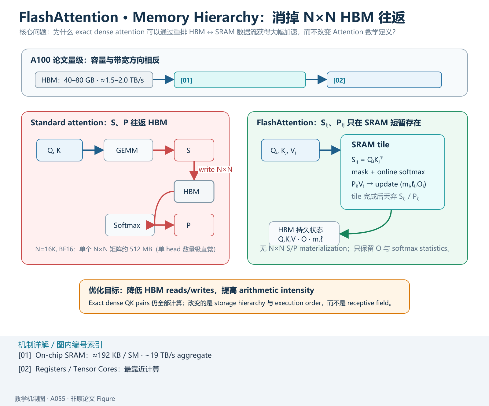

*教学解释图｜Memory Hierarchy。*

只看一个 GPU。

你可以把它粗略想成：

~~~text
        ┌────────────────────┐
        │       HBM          │
        │  很大，比较慢       │
        │  tens of GB        │
        └─────────┬──────────┘
                  │
           load / store
                  │
        ┌─────────▼──────────┐
        │  On-chip SRAM      │
        │  很小，非常快       │
        │  ~hundreds KB / SM │
        └─────────┬──────────┘
                  │
              registers
                  │
        ┌─────────▼──────────┐
        │ Tensor Cores / ALU │
        │      计算           │
        └────────────────────┘
~~~

FlashAttention 原论文以 A100 为例：

- HBM：40–80 GB；
- HBM bandwidth：约 1.5–2.0 TB/s；
- 每个 SM 上片上 SRAM：约 192 KB；
- 108 个 SM；
- 片上 SRAM 总体带宽估计约 19 TB/s。

数量级上：

$$
\text{SRAM bandwidth}\gg\text{HBM bandwidth}.
$$

但 SRAM 小得多。

这形成现代 accelerator 最根本的矛盾：

> **算得很快，数据却不一定喂得进去。**

---

## 2. 一次 kernel 真正做了什么？

一个 GPU kernel 的粗略执行：

1. 从 HBM load 数据；
2. 放入 register / SRAM；
3. arithmetic；
4. 把结果 store 回 HBM。

所以总时间不是：

$$
T=T_{\text{compute}}.
$$

而更接近：

$$
T\approx\max(T_{\text{compute}},T_{\text{memory}})
$$

再加调度、同步等开销。

如果 compute 非常多：

$$
T_{\text{compute}}\gg T_{\text{memory}},
$$

称为 compute-bound。

如果搬数据更慢：

$$
T_{\text{memory}}\gg T_{\text{compute}},
$$

称为 memory-bound。

---

## 3. Arithmetic Intensity

定义：

$$
\boxed{
I=\frac{\text{FLOPs}}{\text{Bytes transferred}}
}
$$

称为 arithmetic intensity。

如果一次从 HBM 搬入一块数据后，能在片上重复利用很多次：

$$
I\uparrow.
$$

例如大矩阵 GEMM：同一 tile 的元素会参与大量 multiply-add，所以矩阵乘法很容易达到高 arithmetic intensity。

相反，elementwise：

~~~text
load x
compute exp(x)
store result
~~~

每个 byte 只做很少运算，容易 memory-bound。

Softmax 还包含 max reduction、exp、sum reduction、divide；如果中间结果不断写回 HBM，traffic 更大。

---

# 二、Standard Attention：数学式很干净，执行图却很糟糕

## 4. 标准 Attention 三步

单 head：

$$
Q,K,V\in\mathbb R^{N\times d}.
$$

第一步：

$$
S=QK^\top\in\mathbb R^{N\times N}.
$$

第二步：

$$
P=\operatorname{softmax}(S)\in\mathbb R^{N\times N}.
$$

第三步：

$$
O=PV\in\mathbb R^{N\times d}.
$$

数学上就是：

$$
\boxed{
O=\operatorname{softmax}(QK^\top)V.
}
$$

---

## 5. 但普通实现往往把它拆成多个 kernel

典型实现：

### Kernel 1

$$
QK^\top\rightarrow S.
$$

写：

$$
S\rightarrow\text{HBM}.
$$

### Kernel 2

从 HBM 读 $S$，计算：

$$
P=\operatorname{softmax}(S),
$$

再写：

$$
P\rightarrow\text{HBM}.
$$

### Kernel 3

读 $P,V$，计算：

$$
O=PV,
$$

写 $O$。

也就是：

~~~text
Q,K
 ↓
GEMM
 ↓
S ──write→ HBM
          ↓ read
       Softmax
          ↓
P ──write→ HBM
          ↓ read
       GEMM with V
          ↓
          O
~~~

真正昂贵的地方：

$$
S,P\in\mathbb R^{N\times N}.
$$

---

## 6. 为什么 $N\times N$ 特别可怕？

如果：

$$
N=4096,
$$

则：

$$
N^2=16{,}777{,}216.
$$

FP16/BF16 每元素 2 bytes，单个矩阵约：

$$
32\text{ MB}.
$$

如果：

$$
N=16K,
$$

则：

$$
N^2=268{,}435{,}456,
$$

单矩阵 BF16 约：

$$
512\text{ MB}.
$$

这是单个 attention matrix 的数量级直觉，还没算 batch、heads、backward、dropout、其他 layers。

---

## 7. Standard Attention 真正的问题不只是“显存占用”

很多介绍只说 Attention matrix 占：

$$
O(N^2)
$$

memory。

对，但还不够。

FlashAttention 更强调的是：

> **HBM traffic。**

即使显存放得下，仍然必须：

~~~text
write S
read S
write P
read P
~~~

这些巨大数据传输本身就可能比 arithmetic 更慢。

所以优化目标从 peak memory 升级为：

$$
\boxed{\text{number of HBM reads/writes}.}
$$

---

# 三、为什么“把三个 Kernel Fuse 起来”还不是完整答案？

## 9. 最直觉方案

你可能会说：

> 那把 $QK^\top$、Softmax、$PV$ 放进一个 CUDA kernel，不就不用中间写 HBM 了吗？

问题是：

$$
S\in\mathbb R^{N\times N}
$$

根本放不进 SRAM。

SRAM 只有 hundreds of KB / SM，而 S 可能 hundreds of MB / GB。

所以不能把完整 S 留在 chip 上，必须分块，也就是 tiling。

---

## 10. GEMM 很容易 tile，Softmax 却把所有列耦合在一起

矩阵乘法：

$$
C=AB
$$

可以自然分块累加。

但 row softmax：

$$
p_j=\frac{e^{s_j}}{\sum_k e^{s_k}}
$$

分母需要整行。

为了数值稳定：

$$
p_j
=
\frac{e^{s_j-m}}{\sum_k e^{s_k-m}},
\qquad
m=\max_k s_k.
$$

全局 max 和 sum 都依赖所有 block。

所以核心问题变成：

> **没有完整 row 同时在 SRAM，能不能仍然精确计算 softmax？**

答案就是 online softmax。

---

# 四、Online Softmax：FlashAttention exactness 的数学核心

## 11. 从稳定 Softmax 开始

给：

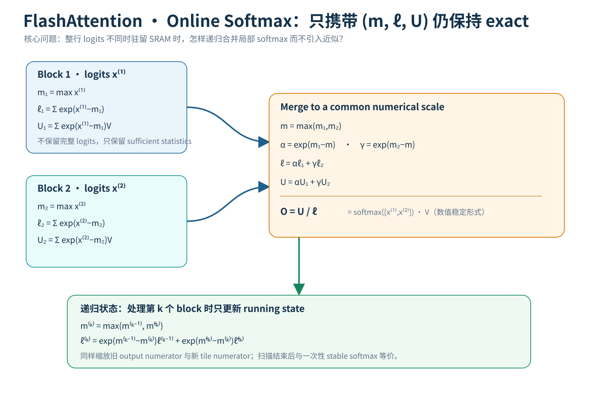

*教学解释图｜Online Softmax。*

$$
x=(x_1,\dots,x_n).
$$

定义：

$$
m=\max_i x_i.
$$

然后：

$$
\tilde p_i=e^{x_i-m}.
$$

normalizer：

$$
\ell=\sum_i e^{x_i-m}.
$$

最终：

$$
p_i=\frac{\tilde p_i}{\ell}.
$$

所以如果能维护：

$$
(m,\ell),
$$

就能恢复 softmax normalization。

---

## 12. 把一整行切成两个 Block

设：

$$
x=[x^{(1)},x^{(2)}].
$$

第一块：

$$
m_1=\max x^{(1)},
\qquad
\ell_1=\sum_j e^{x_j^{(1)}-m_1}.
$$

第二块：

$$
m_2=\max x^{(2)},
\qquad
\ell_2=\sum_j e^{x_j^{(2)}-m_2}.
$$

全局 max：

$$
\boxed{m=\max(m_1,m_2).}
$$

---

## 13. 第一块的 exp sum 怎样换到新的 global max？

原来：

$$
\ell_1
=
\sum_j e^{x_j^{(1)}-m_1}.
$$

现在：

$$
x_j^{(1)}-m
=
(x_j^{(1)}-m_1)+(m_1-m).
$$

所以：

$$
e^{x_j^{(1)}-m}
=
e^{m_1-m}
e^{x_j^{(1)}-m_1}.
$$

求和：

$$
\sum_j e^{x_j^{(1)}-m}
=
e^{m_1-m}\ell_1.
$$

第二块同理。

因此：

$$
\boxed{
\ell
=
e^{m_1-m}\ell_1
+
e^{m_2-m}\ell_2.
}
$$

这意味着不需要保存第一块所有 logits，只需要：

$$
m_1,\ell_1.
$$

---

## 14. 这可以递归

处理第 k 个 block 前维护：

$$
m^{(k-1)},\ell^{(k-1)}.
$$

当前 block：

$$
\tilde m^{(k)},\tilde\ell^{(k)}.
$$

更新：

$$
m^{(k)}
=
\max(
m^{(k-1)},
\tilde m^{(k)}
).
$$

$$
\ell^{(k)}
=
e^{m^{(k-1)}-m^{(k)}}
\ell^{(k-1)}
+
e^{\tilde m^{(k)}-m^{(k)}}
\tilde\ell^{(k)}.
$$

扫描所有 block 后，与一次性全局 stable softmax 等价。

---

# 五、Attention 最后还需要 $PV$：Output 也必须 Online Merge

## 15. 只维护 $(m,\ell)$ 还不够

Attention output：

$$
o
=
\sum_jp_jv_j
=
\frac{
\sum_j e^{s_j-m}v_j
}{
\ell
}.
$$

定义 numerator：

$$
u
=
\sum_j e^{s_j-m}v_j.
$$

则：

$$
o=\frac u\ell.
$$

因此每个 block 还贡献：

$$
u_b
=
\sum_{j\in b}
e^{s_j-m_b}v_j.
$$

---

## 16. 两个 Block 的 numerator 怎样合并？

全局 max：

$$
m=\max(m_1,m_2).
$$

于是：

$$
\boxed{
u
=
e^{m_1-m}u_1
+
e^{m_2-m}u_2.
}
$$

最终：

$$
\boxed{
o
=
\frac{
e^{m_1-m}u_1
+
e^{m_2-m}u_2
}{
e^{m_1-m}\ell_1
+
e^{m_2-m}\ell_2
}.
}
$$

---

## 17. 如果保存的是 normalized $O_{\text{old}}$

已有：

$$
O_{\text{old}}
=
\frac{u_{\text{old}}}{\ell_{\text{old}}},
$$

所以：

$$
u_{\text{old}}
=
\ell_{\text{old}}O_{\text{old}}.
$$

定义：

$$
m_{\text{new}}
=
\max(m_{\text{old}},\tilde m),
$$

$$
\alpha=e^{m_{\text{old}}-m_{\text{new}}},
\qquad
\gamma=e^{\tilde m-m_{\text{new}}}.
$$

则：

$$
\ell_{\text{new}}
=
\alpha\ell_{\text{old}}
+
\gamma\tilde\ell.
$$

output：

$$
\boxed{
O_{\text{new}}
=
\frac{
\alpha\ell_{\text{old}}O_{\text{old}}
+
\gamma\tilde U
}{
\ell_{\text{new}}
}.
}
$$

这就是论文算法里看似复杂的 output update，本质只是全局 softmax normalization 的代数展开。

---

## 18. 教学图：Online Softmax State

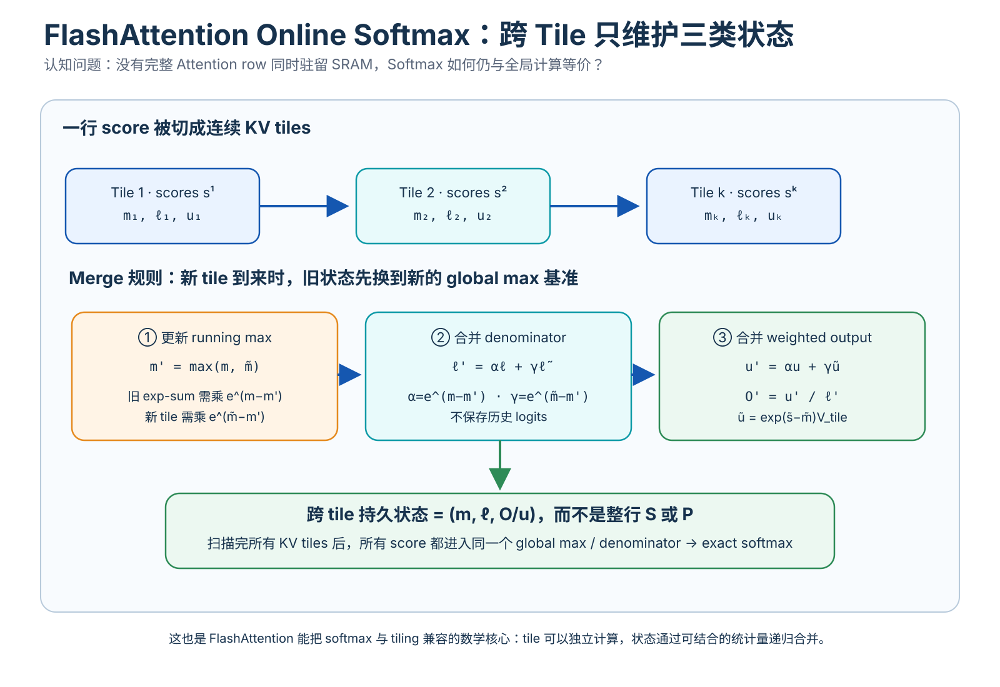

*教学解释图｜Online Softmax State Merge。*

*教学解释图。真正必须跨 block 保存的不是完整 logits，而是 running max $m$、running denominator $\ell$ 与当前 normalized output $O$。新 block 加入时统一重标定旧状态，最终结果与全局 softmax 一致。*

---

# 六、为什么这不是 Approximate Softmax？

## 19. 没有任何合法 Attention Entry 被主动删除

FlashAttention 仍计算所有合法 causal pair 的：

$$
q_i^\top k_j.
$$

只是一次算一个 tile。

所有 score 最终都参与：

- global max；
- global denominator；
- output numerator。

因此数学上：

$$
\boxed{
O_{\text{Flash}}
=
\operatorname{softmax}(QK^\top)V.
}
$$

与标准 attention 相同，只存在浮点运算重排带来的正常数值差异。

所以它属于：

> **exact attention algorithm。**

---

## 20. 和 MInference 对照

MInference：

$$
\mathcal S_i
\subset
\{0,\dots,i\},
$$

只计算 sparse subset，相对于 dense 是 approximate。

FlashAttention：

$$
\mathcal S_i
=
\{0,\dots,i\},
$$

所有合法 pair 都算，所以 exact。

MInference 可以把自己选中的 sparse tiles 用 FlashAttention-style online softmax kernel 高效算完。

---

# 七、FlashAttention Forward：为什么外层遍历 K/V Block？

## 21. 输入分块

$$
Q\rightarrow Q_1,\dots,Q_{T_r}.
$$

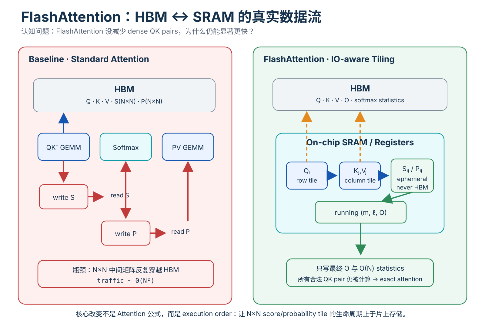

*教学解释图｜HBM SRAM Tiled Dataflow。*

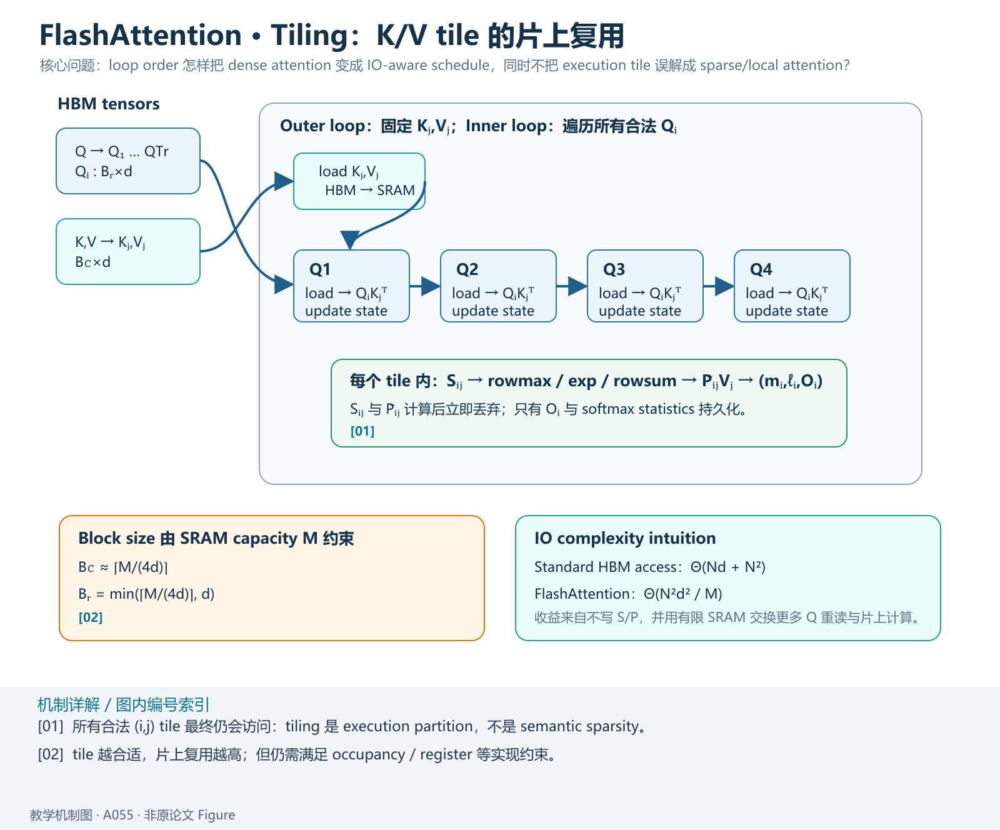

*教学解释图｜Tiling Dataflow。*

每块：

$$
Q_i\in\mathbb R^{B_r\times d}.
$$

K/V：

$$
K_j,V_j\in\mathbb R^{B_c\times d}.
$$

原论文理论设置：

$$
B_c
=
\left\lceil\frac{M}{4d}\right\rceil,
$$

$$
B_r
=
\min
\left(
\left\lceil\frac{M}{4d}\right\rceil,
d
\right),
$$

其中 $M$ 是 SRAM capacity 的抽象。

---

## 22. 外层循环

对：

$$
j=1,\dots,T_c
$$

加载一次：

$$
K_j,V_j
$$

到 SRAM。

然后内层遍历所有 $Q_i$。

原因：

> K/V tile 一旦进入 SRAM，就尽可能多复用。

loop order 本身就是 IO optimization。

---

## 23. 每个 Tile 内发生什么？

对：

$$
(Q_i,K_j,V_j)
$$

在 SRAM 内：

$$
S_{ij}=Q_iK_j^\top.
$$

应用 causal/padding mask 后，算：

$$
\tilde m_{ij}
=
\operatorname{rowmax}(S_{ij}),
$$

$$
\tilde P_{ij}
=
e^{S_{ij}-\tilde m_{ij}},
$$

$$
\tilde\ell_{ij}
=
\operatorname{rowsum}(\tilde P_{ij}).
$$

再用上一轮：

$$
m_i,\ell_i,O_i
$$

和当前：

$$
\tilde m_{ij},
\tilde\ell_{ij},
\tilde P_{ij}V_j
$$

更新 state。

然后：

$$
S_{ij},\tilde P_{ij}
$$

直接丢弃，不写入 HBM。

---

# 八、原论文主图应该怎么读？

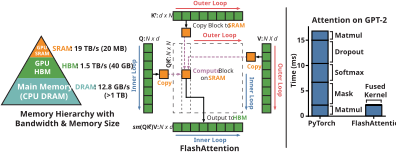

*原论文主图。左侧真正要看的是 loop/dataflow：K/V block 从 HBM 搬入 SRAM 后，被多个 Q block 复用；巨大的 $N\times N$ attention matrix 不再 materialize 到 HBM。右侧给出相对 PyTorch attention 的速度提升。*

不要把 block 误解成 local attention window。

block 是：

> execution tile。

不是：

> semantic receptive field。

最终每个 query 仍看完整合法 key set。

---

# 九、IO Complexity：为什么 HBM Access 会下降？

## 24. Standard Attention

至少处理：

- $Q,K,V$：$O(Nd)$；
- $S$：$O(N^2)$；
- $P$：$O(N^2)$。

所以：

$$
\boxed{
\Theta(Nd+N^2)
}
$$

HBM accesses。

---

## 25. FlashAttention 不写 $S,P$，但会重复读 Q

K/V block 大约：

$$
B_c\sim\frac{M}{d}.
$$

K/V block 数：

$$
T_c
\sim
\frac{N}{B_c}
\sim
\frac{Nd}{M}.
$$

每次完整扫描 Q 约：

$$
Nd
$$

元素。

所以 Q 读取量级：

$$
\frac{Nd}{M}\times Nd
=
\frac{N^2d^2}{M}.
$$

因此：

$$
\boxed{
\text{HBM IO}_{\text{Flash}}
=
\Theta
\left(
\frac{N^2d^2}{M}
\right).
}
$$

---

## 26. 为什么这比 $N^2$ 小很多？

比例：

$$
\frac{N^2}{N^2d^2/M}
=
\frac{M}{d^2}.
$$

典型：

$$
d=64\sim128.
$$

而有效 SRAM capacity 对应的元素量通常远大于 $d^2$，因此 HBM traffic 可以下降很多倍。

---

# 十、重要边界：FlashAttention 没把时间复杂度变成线性

## 27. Forward 仍然计算 Dense $QK^\top$

FLOPs：

$$
O(N^2d).
$$

仍然 quadratic。

所以：

> “FlashAttention 把 Attention 从 $O(N^2)$ 降到 $O(N)$”

是错误的。

正确说法：

$$
\boxed{
\text{Arithmetic complexity remains quadratic;}
}
$$

但：

$$
\boxed{
\text{HBM IO is substantially reduced.}
}
$$

---

## 28. 为什么仍能快很多？

当 kernel 在 memory-bound region：

$$
T\approx T_{\text{HBM}}.
$$

HBM traffic 大幅降低，即使 FLOPs 不变，runtime 也会降。

甚至 backward FLOPs 增加，只要节约的 IO 时间更大，最终仍：

$$
T_{\text{total}}\downarrow.
$$

---

# 十一、论文 Lower Bound：到底证明了什么？

## 29. Proposition

对：

$$
d\le M\le Nd,
$$

论文说明不存在一个 exact attention algorithm 能在整个 M 范围上实现：

$$
o
\left(
\frac{N^2d^2}{M}
\right)
$$

HBM accesses。

---

## 30. 不要夸大成“每个 M 上都绝对最优”

论文 lower bound 的准确含义是：

> 不存在一个算法能对**整个 SRAM-size range**都 asymptotically 更优。

并不等价于最强形式的：

> 对每个固定 M，FA1 的所有 constant 与 schedule 都已不可改进。

后来的 FlashAttention-2/3/4 仍能通过：

- work partition；
- parallelism；
- warp scheduling；
- asynchronous pipeline；
- precision；

继续优化。

所以：

> asymptotic IO complexity 不是 kernel performance 的全部。

---

# 十二、Backward：为什么训练更能体现 FlashAttention 的反直觉价值？

## 31. Standard Backward 为什么需要 $P$？

Forward：

$$
P=\operatorname{softmax}(S),
\qquad
O=PV.
$$

给上游：

$$
dO.
$$

有：

$$
dV=P^\top dO,
$$

$$
dP=dO\,V^\top.
$$

Softmax backward：

$$
dS_{ij}
=
P_{ij}
\left(
dP_{ij}
-
\sum_kP_{ik}dP_{ik}
\right).
$$

然后：

$$
dQ=dSK,
\qquad
dK=dS^\top Q.
$$

所以 standard implementation 很自然会在 forward 保存 $P$。

但：

$$
P\in\mathbb R^{N\times N}.
$$

---

# 十三、FlashAttention 的关键决策：别保存，重算

## 32. Forward 保存什么？

不保存：

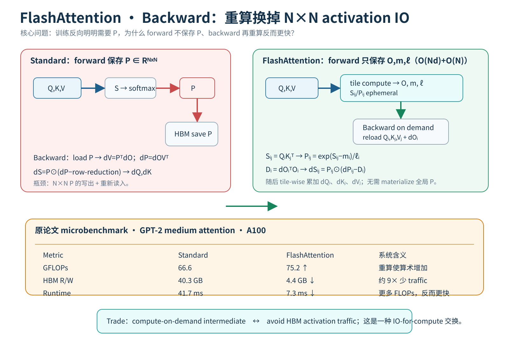

*教学解释图｜Backward Recompute。*

$$
S,P.
$$

只保存：

- $O\in\mathbb R^{N\times d}$；
- $m\in\mathbb R^N$；
- $\ell\in\mathbb R^N$；
- dropout PRNG state（若启用）。

额外 state 不再是 $O(N^2)$。

---

## 33. Backward 需要 $P_{ij}$ 时怎么办？

重新 load：

$$
Q_i,K_j.
$$

重算：

$$
S_{ij}=Q_iK_j^\top.
$$

利用保存的：

$$
m_i,\ell_i
$$

恢复：

$$
P_{ij}
=
\operatorname{diag}(\ell_i)^{-1}
e^{S_{ij}-m_i}.
$$

P 变成：

> compute-on-demand intermediate。

---

# 十四、为什么 Recomputation 居然更快？

## 34. 传统 checkpointing 直觉

~~~text
少存 activation
→ backward 重算
→ memory↓
→ FLOPs↑
→ speed↓
~~~

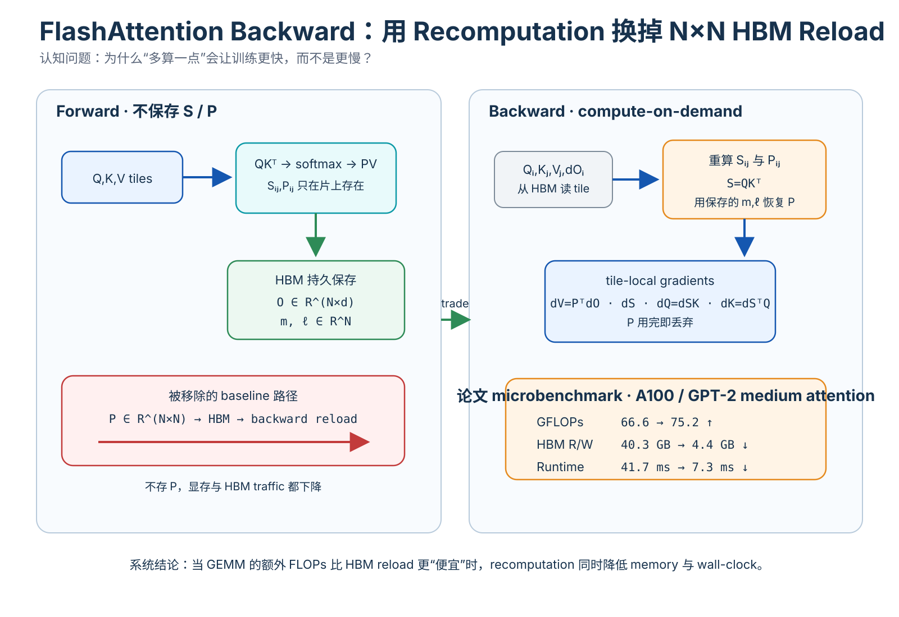

*教学解释图｜Backward Recompute Tradeoff。*

FlashAttention 则是：

~~~text
少存 N×N intermediates
→ backward 重算
→ memory↓
→ FLOPs↑
→ HBM traffic↓↓
→ speed↑
~~~

因为矩阵乘法 GPU 很擅长，而巨大 P 的 HBM reload 相对昂贵。

---

## 35. 原论文最关键的一组数字

GPT-2 medium attention，A100：

| 指标 | Standard | FlashAttention |
|---|---:|---:|
| GFLOPs | 66.6 | 75.2 |
| HBM R/W | 40.3 GB | 4.4 GB |
| Runtime | 41.7 ms | 7.3 ms |

注意：

$$
75.2>66.6.
$$

FlashAttention 算得更多。

但：

$$
4.4\ll40.3.
$$

HBM traffic 约少 9 倍。

最终：

$$
7.3\ll41.7\text{ ms}.
$$

这组数据几乎就是整篇论文最重要的系统证据。

---

## 36. 原论文 microbenchmark

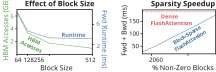

*原论文 microbenchmark。它直接展示“更多 FLOPs + 更少 HBM IO → 更短 runtime”。中图通过改变 block size 显示 HBM access 降低时 runtime 随之降低，直到其他瓶颈开始主导。*

---

# 十五、Softmax Backward 的 $D_i$：为什么不用整行 Reduction？

## 37. Standard Softmax Gradient

一行：

$$
p=\operatorname{softmax}(s).
$$

给：

$$
dp.
$$

有：

$$
ds_j
=
p_j
\left(
dp_j-\sum_kp_kdp_k
\right).
$$

定义：

$$
D_i
=
\sum_kP_{ik}dP_{ik}.
$$

看起来仍需要整行 P、dP。

---

## 38. 恒等式 $D_i=dO_i^\top O_i$

因为：

$$
O_i
=
\sum_jP_{ij}V_j.
$$

又：

$$
dP_{ij}
=
dO_i^\top V_j.
$$

所以：

$$
D_i
=
\sum_jP_{ij}dO_i^\top V_j
=
dO_i^\top
\left(
\sum_jP_{ij}V_j
\right).
$$

括号就是 $O_i$。

因此：

$$
\boxed{
D_i=dO_i^\top O_i.
}
$$

原来需要 size N 的整行 reduction，现在只需要两个 d 维向量的 dot product。

---

## 39. Backward Tile 内就能计算 $dS$

恢复 $P_{ij}$，计算：

$$
dP_{ij}
=
dO_iV_j^\top.
$$

然后：

$$
dS_{ij}
=
P_{ij}
\circ
(dP_{ij}-D_i).
$$

再累加：

$$
dQ_i
\mathrel{+}=
dS_{ij}K_j,
$$

$$
dK_j
\mathrel{+}=
dS_{ij}^\top Q_i,
$$

$$
dV_j
\mathrel{+}=
P_{ij}^\top dO_i.
$$

都以 tile 为单位，不需要 materialize 全局 $dP,dS$。

---

# 十六、Dropout Mask 为什么也不用保存？

## 40. Standard 做法

Forward 生成：

$$
Z\in\left\{0,\frac1{1-p}\right\}^{N\times N}.
$$

Backward 需要相同 mask，直觉上会保存 Z。

又是 $O(N^2)$ state。

---

## 41. 保存 PRNG State 就够了

Forward 保存随机数生成器状态：

$$
\mathcal R.
$$

Backward reset 到相同状态，然后按相同次序重建 tile-level dropout mask。

原则是：

> **能便宜、确定性重建的巨大中间量，不一定值得存。**

---

# 十七、“线性内存”到底是什么意思？

## 42. Attention Intermediate

Standard：

$$
O(N^2).
$$

FlashAttention 不保存 S/P，主要保存：

$$
O(Nd)
$$

input/output 与：

$$
O(N)
$$

softmax stats。

因此 attention-specific intermediate memory 随 N 近似线性。

---

## 43. 不代表整个 Transformer Memory 都是 O(N)

整个模型还有：

- hidden states；
- Q/K/V；
- MLP activations；
- gradients；
- parameters；
- optimizer states；
- batch/layers。

所以“linear memory”要限定在：

> Attention intermediates。

---

# 十八、为什么更省 Memory 还能提高模型质量？

## 44. FlashAttention 自己没有改变模型函数

因为 exact：

$$
f_{\text{Flash}}(x)
=
f_{\text{standard}}(x)
$$

在数学定义上相同。

如果 context 不变，不应该凭空获得新能力。

论文 quality 提升来自：

> 省下来的 runtime/memory budget 允许训练更长 context。

例如 GPT-2 FlashAttention 4K context 仍比 Megatron 1K context 更快约 30%，同时 PPL：

$$
18.2\rightarrow17.5.
$$

因果链是：

~~~text
better kernel
→ lower runtime/memory
→ can afford longer context
→ model sees more context
→ quality improves
~~~

---

# 十九、训练实验怎样读？

## 45. BERT-large

相同初始化、target MLM accuracy 72%，8×A100：

- Nvidia MLPerf 1.1：20.0 ± 1.5 min；
- FlashAttention：17.4 ± 1.4 min。

约 15% 改进。

这是 end-to-end training time，不是单 kernel。

---

## 46. GPT-2

GPT-2 small：

- HuggingFace：9.5 days；
- Megatron：4.7 days；
- FlashAttention：2.7 days。

PPL 都约 18.2。

GPT-2 medium：

- HuggingFace：21.0 days；
- Megatron：11.5 days；
- FlashAttention：6.9 days。

PPL 近似一致。

说明 kernel optimization 主要改变 execution efficiency，不改变 objective。

---

## 47. 原论文 GPT-2 training evidence

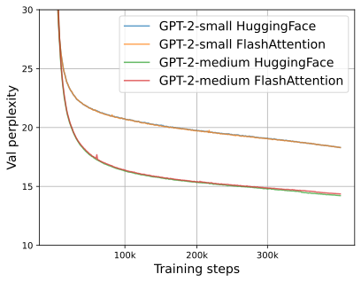

*原论文训练结果。用于检查更快 wall-clock 下训练行为是否保持，而不是只看单次 kernel microbenchmark。*

---

# 二十、Runtime 与 Memory Benchmark

## 48. 原论文 benchmark

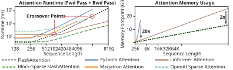

*原论文比较 exact、approximate、sparse attention 的 forward+backward runtime 与 memory。FlashAttention 在常见长度下显著快于标准 exact attention，且 attention memory 随 sequence length 近似线性增长。*

论文指出：

- exact FlashAttention 常见长度下最高约 3× faster than standard exact implementations；
- memory up to 20× lower than standard exact baselines；
- 可扩到更长 sequence；
- 某些 approximate methods 在足够长序列后会因为更低 arithmetic complexity 反超 exact FlashAttention。

最后一点很重要。

---

# 二十一、IO Optimization 不能战胜所有 Arithmetic Scaling

## 49. FlashAttention 仍是 $O(N^2d)$

当 N 非常大，即使 HBM 优化非常好：

$$
N^2d
$$

FLOPs 最终仍会成为 bottleneck。

所以一些 linear / approximate attention 在足够长序列后会出现 runtime cross-over。

这说明：

$$
\text{IO optimization}
$$

和：

$$
\text{algorithmic complexity reduction}
$$

是两个不同优化轴。

MInference 是后来的一个例子：

~~~text
MInference
→ reduce pair count

FlashAttention-style kernel
→ execute retained pairs efficiently
~~~

---

# 二十二、Block-Sparse FlashAttention：必须和 Exact FlashAttention 分开

## 50. Exact FlashAttention

计算完整合法 attention domain，只改变 execution，所以 exact。

## 51. Block-Sparse FlashAttention

给 sparse block mask：

$$
M_{ij}\in\{0,1\},
$$

只计算部分 blocks，arithmetic 也减少。

相对于 dense attention，它属于 sparse/approximate 或结构不同的 attention。

论文把它作为 proof-of-concept：

> IO-aware kernel 可以释放 sparse attention 的真实 wall-clock 潜力。

但不能反过来描述成：

> FlashAttention 本身是 sparse attention。

---

# 二十三、为什么很多“更少 FLOPs”的 Approximate Attention 当年并没有更快？

## 52. 真实 GPU 不只执行数学公式

理论 $O(N)$ 方法可能包含：

- irregular memory access；
- many small kernels；
- transpose；
- gather/scatter；
- low occupancy；
- extra materialization；
- poor tensor-core utilization。

而一个 $O(N^2)$ kernel 可能执行高度规则的 GEMM tile 且 HBM IO 很少。

在实际长度范围，后者可能更快。

因此：

$$
\boxed{
\text{Asymptotic FLOPs}
\neq
\text{Hardware efficiency}.
}
$$

---

# 二十四、Kernel Fusion 为什么必要但不充分？

## 53. Fusion 的价值

如果：

~~~text
Kernel A:
HBM → x → opA → HBM

Kernel B:
HBM → y → opB → HBM
~~~

而 B 消费 A 输出，fuse 可以少一次 write/read。

---

## 54. 但 Attention Intermediate 太大

即使逻辑上把 QK、mask、softmax、dropout、PV 融成一个 kernel，如果没有 tiling + online softmax：

> SRAM 仍装不下完整 S/P。

所以真正链条是：

$$
\boxed{
\text{Tiling}
\rightarrow
\text{Online Reduction}
\rightarrow
\text{Kernel Fusion}.
}
$$

---

# 二十五、FlashAttention 与普通 GEMM Tiling 有什么不同？

## 55. GEMM Tile 只需要 Partial Sum

$$
C_{ij}
=
\sum_kA_{ik}B_{kj}.
$$

不同 k block 的 partial sum 可以直接相加。

---

## 56. Softmax Tile 不能直接相加

如果每块各自：

$$
P^{(1)}=\operatorname{softmax}(S^{(1)}),
$$

$$
P^{(2)}=\operatorname{softmax}(S^{(2)}),
$$

然后：

$$
P^{(1)}V^{(1)}+P^{(2)}V^{(2)},
$$

是错的，因为两块 denominator 不同。

所以 online max/sum rescaling 是 attention tiling 保持 exact 的必要条件。

---

# 二十六、为什么 DCA 与 MInference 都反复出现 Online Softmax？

## 57. DCA

DCA 将 attention relation 分组，最后需要把 partial attention 合并成一个全局正确 softmax。

依赖：

$$
m,\ell,O.
$$

## 58. MInference

MInference 遍历 sparse blocks / columns，也需要 selected set 上的全局 normalization。

## 59. FlashAttention 已变成底层代数接口

不只是一个具体 CUDA kernel。

它提供：

$$
\boxed{
\text{Attention}
=
\text{tiles}
+
\text{mergeable softmax statistics}
+
\text{IO-aware traversal}.
}
$$

后续系统只需改变：

- 哪些 tile；
- tile 顺序；
- tile mapping；
- sparse/dense；
- multi-GPU placement。

---

# 二十七、Evidence Boundary

## 60. “Exact”能证明什么？

说明算法没有主动删除或近似 attention pair。

不说明 bitwise 与某个 PyTorch kernel 完全相同；浮点运算顺序变化仍会产生小 rounding differences。

## 61. “Linear memory”能证明什么？

说明不 materialize $N^2$ attention intermediates。

不说明整个 Transformer training memory 很小或完全线性。

## 62. “7.6× attention speedup”能证明什么？

是特定 hardware/shape/baseline 下的 kernel result。

不能写成所有模型 end-to-end 都 7.6×。

## 63. “更多 FLOPs 更快”能否普遍化？

只在：

$$
\text{saved memory traffic cost}
>
\text{added recompute cost}
$$

时成立。

如果 workload strongly compute-bound，重算可能真更慢。

---

# 二十八、为什么 FlashAttention-2 仍然有巨大空间？

## 64. FA1 已经降低 IO，但 GPU 不一定吃满

好的 asymptotic IO 不代表：

- warp work partition 最优；
- thread-block parallelism 最优；
- non-matmul FLOPs 最少；
- occupancy 最优；
- sequence/head dimensions 都充分并行。

FlashAttention-2 继续设计：

> parallelism 与 work partition。

技术路线从：

~~~text
FlashAttention-1
→ memory hierarchy / IO algorithm
~~~

推进到：

~~~text
FlashAttention-2
→ GPU parallel decomposition / work partition
~~~

这是下一篇应独立拆的内容。

---

# 二十九、与现代 LLM 系统重新连线

## 65. Llama 3

128K 与大规模训练系统需要成熟 fused attention kernel 体系。

## 66. Qwen2.5

1M serving 中 YaRN、DCA、MInference-derived sparse attention 最终仍需要高效 tile execution。

## 67. MInference

论文直接基于 Triton、PIT、FlashAttention-style kernel。

技术依赖实际是：

$$
\text{FlashAttention}
\rightarrow
\text{MInference sparse kernel}.
$$

我们之所以先读 MInference 再回补 FlashAttention，是按“阻塞理解”而非论文年代组织。

---

# 三十、对机器人与边缘部署最值得迁移的原则

## 68. 不要只看 MACs / FLOPs

例如 NPU 上两个网络：

### Model A

1 GFLOP，但大量 transpose、scatter、unsupported op、DDR round-trip。

### Model B

1.5 GFLOP，但 fused、SRAM reuse 高、连续 tensor、kernel support 好。

实际可能：

$$
T_B<T_A.
$$

FlashAttention 是经典反例：更多 arithmetic 不一定慢。

---

## 69. 数据移动本身就是算法的一部分

传统分析只写：

$$
O(N^2).
$$

硬件实际还需要：

$$
\text{compute complexity}
+
\text{IO complexity}
+
\text{parallel schedule}.
$$

对 GPU、NPU、embedded accelerator、CPU cache 都如此。

---

## 70. Recomputation 可以是主动性能优化

边缘平台也常出现 memory bandwidth 比 compute 更稀缺。

这时 cache intermediate 不一定比 recompute 快。

真正比较的是：

$$
T_{\text{load/store}}
\quad\text{vs}\quad
T_{\text{recompute}}.
$$

---

# 三十一、论文核心论证链

## Claim 1：Standard Attention 的 wall-clock bottleneck 大量来自 HBM IO

证据：memory hierarchy、standard execution dataflow、microbenchmark。

## Claim 2：Softmax 可以 block-wise exact aggregation

证据：$(m,\ell)$ 代数合并公式。

## Claim 3：不 materialize $S,P$ 可显著减少 HBM accesses

理论：

$$
\Theta(Nd+N^2)
\rightarrow
\Theta(N^2d^2/M).
$$

## Claim 4：Recomputation 可以同时省 memory 并加速 backward

证据：

$$
66.6\rightarrow75.2\text{ GFLOPs},
$$

$$
40.3\rightarrow4.4\text{ GB HBM},
$$

$$
41.7\rightarrow7.3\text{ ms}.
$$

## Claim 5：Kernel efficiency 能转化成 end-to-end model benefit

BERT、GPT-2、LRA、long-context experiments 支撑，但幅度受 Amdahl's law 限制。

---

# 三十二、最容易学错的十二个地方

1. **FlashAttention 是 Sparse Attention**：错，FA1 主算法是 exact dense attention。
2. **复杂度从 $O(N^2)$ 变 $O(N)$**：错，FLOPs 仍 quadratic。
3. **主要因为 CUDA 比 PyTorch 快**：太浅，核心是 IO-aware dataflow。
4. **Kernel Fusion 就是全部**：错，还需要 tiling + online softmax。
5. **每个 block 单独 Softmax 后相加**：错，必须全局 rescale。
6. **FlashAttention 不算完整 QK**：错，exact 版本所有合法 pair 都参与。
7. **Backward 重算一定更慢**：错，memory-bound 下可能更快。
8. **Linear memory = 整个模型 O(N)**：错，只指 attention intermediate。
9. **7.6× = 模型训练 7.6×**：错，kernel 与 end-to-end 不同。
10. **Lower bound 表示后续没法优化**：错，仍可优化 schedule/parallelism/precision。
11. **Block-sparse 与 exact FA 性质一样**：错，前者删除部分 attention domain。
12. **MInference 与 FlashAttention 二选一**：错，前者选 pair，后者提供高效执行基础。

---

# 三十三、整篇论文压成一条因果链

~~~{mermaid}
flowchart TD
    A["Dense Attention S=QKᵀ, P=softmax(S), O=PV"] --> B["Standard implementation materializes S and P in HBM"]
    B --> C["N² HBM reads/writes memory-bound"]
    C --> D["Tile Q/K/V into SRAM"]
    D --> E["Problem: softmax couples entire row"]
    E --> F["Online softmax running max m + normalizer ℓ"]
    F --> G["Incrementally rescale output O"]
    G --> H["Never write full S/P to HBM"]
    H --> I["Backward recompute S/P tiles"]
    I --> J["More FLOPs, much less IO"]
    J --> K["Lower runtime + linear attention intermediates"]
~~~

如果只记一句：

> **FlashAttention 的突破不是减少 Attention 的数学工作，而是认识到现代 GPU 上“把数据搬错地方”可能比“多算几次”更贵，于是用 tiling、online softmax 与 recomputation 把 $N\times N$ 中间状态限制在 SRAM 的短暂 tile 生命周期里。**

---

# 三十四、下一步：FlashAttention-2

FA1 回答：

> 怎样把 exact Attention 变成 IO-aware？

但还没完整回答：

> 怎样把 A100/H100 的全部并行计算单元吃满？

FlashAttention-2 会继续研究：

- fewer non-matmul FLOPs；
- sequence-length parallelism；
- thread-block scheduling；
- warp work partition；
- forward/backward parallelization。

因此下一节点自然是：

> **FlashAttention-2: Faster Attention with Better Parallelism and Work Partitioning。**

---

# 三十五、最终自检

读完 FlashAttention，至少应该回答：

1. HBM 和 SRAM 的容量/带宽为什么形成矛盾？
2. arithmetic intensity 是什么？
3. compute-bound 与 memory-bound 怎样区分？
4. Standard Attention 为什么 materialize $S,P$？
5. $S,P$ 为什么造成 $O(N^2)$ HBM state？
6. 为什么显存放得下仍然可能很慢？
7. kernel fusion 为什么必要但不充分？
8. Softmax 为什么看起来阻止普通 tiling？
9. stable softmax 为什么需要 row max？
10. 两个 block 的 max 怎样合并？
11. 两个 block 的 normalizer 怎样合并？
12. 为什么旧 block 要乘 $e^{m_{\text{old}}-m_{\text{new}}}$？
13. output numerator 怎样重标定？
14. 为什么 online softmax 与全局 softmax exact 等价？
15. FlashAttention block 是 execution tile 还是 attention window？
16. 为什么 K/V block 放外循环能增加 reuse？
17. SRAM size M 怎样影响 block size？
18. Standard Attention HBM IO 为什么是 $\Theta(Nd+N^2)$？
19. FlashAttention HBM IO 为什么是 $\Theta(N^2d^2/M)$？
20. 为什么这不代表 compute complexity 变 subquadratic？
21. lower bound 的准确含义是什么？
22. standard backward 为什么需要 P？
23. FlashAttention backward 为什么重算 P？
24. 为什么更多 FLOPs 可以更快？
25. 66.6/75.2 GFLOPs、40.3/4.4 GB、41.7/7.3 ms 各说明什么？
26. $D_i=dO_i^\top O_i$ 怎样推出来？
27. 为什么 dropout mask 可用 PRNG state 重建？
28. FlashAttention 的 linear memory 指什么？
29. 为什么 exact kernel 本身不会直接提升能力？
30. 更长 context 为什么会间接提高 quality？
31. block-sparse FlashAttention 与 exact FA 有何不同？
32. 为什么 approximate attention FLOPs 更少却不一定更快？
33. DCA 为什么需要 FlashAttention-style merge？
34. MInference 为什么能建立在 FlashAttention-style sparse kernel 上？
35. 为什么 FlashAttention-2 仍然有优化空间？
36. 对 NPU/机器人边缘部署，IO-aware 思维怎样迁移？

如果这些问题都能回答，FlashAttention 就不再是“一个很快的 Attention CUDA 库”，而是一套更重要的硬件算法观：

$$
\boxed{
\text{算法复杂度}
+
\text{内存层级}
+
\text{数据复用}
+
\text{并行执行}
}
$$

必须一起设计。
