# FlashAttention-2：IO 已经优化以后，为什么 Attention 还只跑到 GPU 峰值的一半？

> **论文**：Tri Dao, [FlashAttention-2: Faster Attention with Better Parallelism and Work Partitioning](https://arxiv.org/abs/2307.08691)，2023。  
> **类型**：A · 原始方法 / GPU 系统论文；Exact Attention + GPU Parallelism + Work Partitioning。  
> **一句话定位**：FlashAttention-1 已经用 tiling、online softmax 与 recomputation 大幅减少 HBM traffic，但在 A100 上 forward 仍只有约 30–50% 理论峰值、backward 约 25–35%。FlashAttention-2 不再改变核心 IO 复杂度，而是继续往 GPU execution model 里下钻：**减少昂贵的非矩阵乘 FLOPs、把 sequence length 也变成 thread-block parallel dimension、并把 warp 内的 split-K 改成 split-Q，从而减少 shared-memory communication 和 synchronization。**

上一站 [FlashAttention-1](A055-flashattention.md) 解决的是：

> **Attention 为什么不应该把 $N\times N$ 的 $S,P$ 反复写入 HBM？**

这一站继续追问：

> **如果 HBM traffic 已经降下来了，为什么 GPU 还是没有跑满？**

这正是系统优化里非常典型的“瓶颈迁移”：

~~~text
第一阶段
HBM IO 是最大瓶颈
        ↓
FlashAttention-1 消掉大量 HBM traffic
        ↓
原本被掩盖的问题浮现
        ↓
occupancy / warp communication / non-matmul FLOPs
变成新瓶颈
        ↓
FlashAttention-2
~~~

因此 FA2 最值得学的不是“比 FA1 快 2×”这个结果，而是：

$$
\boxed{
\text{一个瓶颈被解决后，优化目标会向下一层硬件约束迁移。}
}
$$

---

## 阅读导航

强烈建议先读：

- [FlashAttention-1](A055-flashattention.md)：HBM/SRAM、tiling、online softmax、backward recomputation；
- [Transformer](../03-transformer/A013-transformer-attention-is-all-you-need.md)：Attention 数学；
- [MQA](../04-efficient-attention/A019-mqa.md) / [GQA](../04-efficient-attention/A020-gqa.md)：FA2 直接讨论对共享 KV heads 的支持；
- [MInference](../04-efficient-attention/A054-minference.md)：后续 sparse kernel 怎样继续复用 FlashAttention 的执行思想。

本文重点回答：

1. FA1 已经 IO-aware，为什么 GPU utilization 仍不高？
2. GPU 中 thread、warp、thread block、SM 分别是什么？
3. occupancy 到底意味着什么？
4. 为什么长序列反而可能让 FA1 的 GPU occupancy 更差？
5. 为什么 FP32 non-matmul FLOP 比 Tensor Core matmul FLOP“贵”很多？
6. FA2 怎样减少 online softmax 中的非 matmul 操作？
7. 为什么只保存 logsumexp $L=m+\log\ell$ 就够 backward 恢复 $P$？
8. FA1 的 thread-block parallelism 为什么主要只有 batch × heads？
9. FA2 怎样把 sequence length 也变成并行维度？
10. 为什么 forward 可以按 Q row blocks embarrassingly parallel？
11. 为什么 backward 选择按 K/V column blocks 并行？
12. backward 为什么需要 atomic add 更新 $dQ$？
13. FA1 的 split-K warp partition 到底哪里浪费？
14. 为什么 split-K 会产生跨 warp partial-output reduction？
15. FA2 的 split-Q 为什么不需要这次 reduction？
16. shared memory communication 为什么比 warp-local register 运算贵？
17. block size 为什么不能无限增大？
18. register pressure、shared memory、occupancy 之间是什么关系？
19. causal mask 为什么可以直接跳过约一半 blocks？
20. 为什么 causal speedup 实际约 1.7–1.8×，不是严格 2×？
21. FA2 为什么还是 exact Attention？
22. FA2 和 FA1 的 asymptotic complexity 是否改变？
23. A100 上 73% theoretical peak 到底怎么定义？
24. 为什么 forward 与 backward 的 peak utilization 不一样？
25. end-to-end 225 TFLOPs/s/GPU 与 attention kernel 230 TFLOPs/s 不能混为一谈？
26. 为什么 FA2 在 8K context 比 2K context 的 end-to-end收益更明显？
27. MQA/GQA 在 kernel 里怎样避免真的复制 K/V heads？
28. 为什么 H100 上直接跑 FA2 就能到 335 TFLOPs/s，却仍没有真正吃到 Hopper 新特性？
29. 为什么这自然导向 FlashAttention-3？
30. 这套“work partition”思想怎样迁移到机器人 GPU/NPU kernel？

---

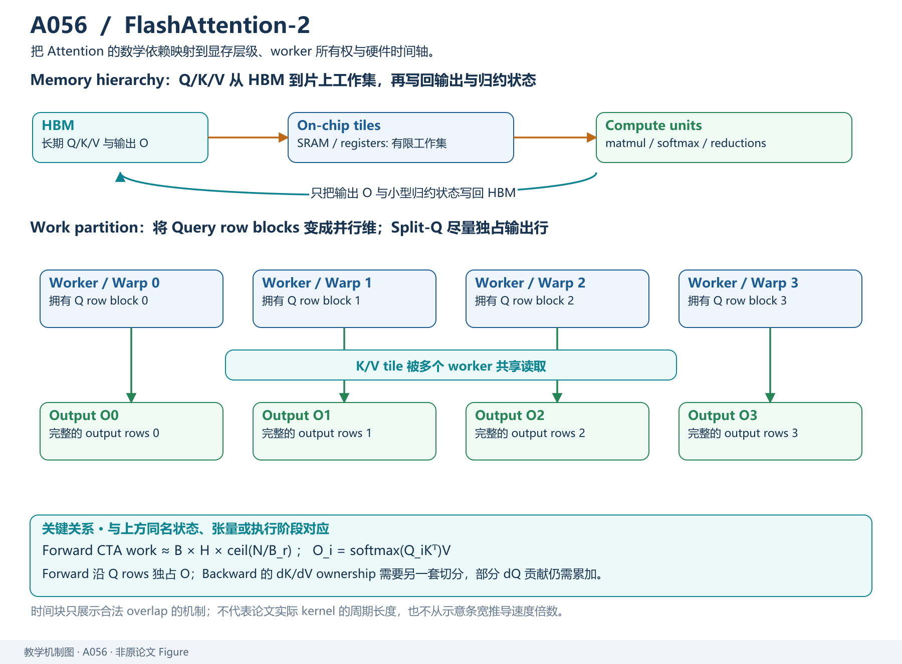

*教学解释图｜sequence parallelism 与 Split-Q 重新分配 block/warp 工作，使 IO 已优化后的 Attention 更接近 GPU 吞吐上限。*

# 一、从 FA1 的“成功”开始：为什么 30–50% Peak 仍然不够？

## 1. FA1 已经完成了最关键的算法重构

FA1 做了三件大事：

$$
\text{Tiling}
+
\text{Online Softmax}
+
\text{Backward Recomputation}.
$$

结果：

- 不 materialize $S,P\in\mathbb R^{N\times N}$；
- Attention auxiliary memory 由 quadratic 降到 linear；
- HBM traffic 显著减少；
- 相对 standard attention 得到 2–4× wall-clock speedup。

如果只从算法论文视角看，似乎已经结束了。

但 GPU profiling 告诉我们：

### FA1 Forward

大约只达到：

$$
30\%\sim50\%
$$

theoretical max FLOPs/s。

### FA1 Backward

更低：

$$
25\%\sim35\%.
$$

而 optimized GEMM：

$$
80\%\sim90\%
$$

是可能的。

于是问题变成：

> **同样都在 Tensor Core 上做大量矩阵乘，为什么 Attention 离 GEMM peak 还差这么远？**

---

## 2. 教学总图：瓶颈已经迁移

这张图建立一个很重要的系统观：

> **性能优化不是一次解决一个公式，而是不断暴露下一层 bottleneck。**

---

# 二、先补 GPU Execution Model：SM、Thread Block、Warp

## 3. GPU 不是“一个很大的并行 CPU”

以 NVIDIA GPU 为例，可以粗略理解为：

~~~text
GPU
├── SM 0
├── SM 1
├── ...
└── SM 107      (A100 example)

每个 SM 上：
├── Tensor Cores
├── CUDA cores
├── registers
├── shared memory / SRAM
└── schedulers
~~~

kernel 启动后会创建大量 threads。

threads 再组织成：

$$
\text{thread block}.
$$

thread block 被调度到某个 SM。

一个 block 中 threads 再按：

$$
32\text{ threads}
$$

组成 warp。

---

## 4. Warp 为什么是核心执行单位？

NVIDIA GPU 以 warp 为基本调度粒度。

同一 warp 的 32 threads：

- 通常执行相同 instruction；
- 可以用 warp shuffle 快速交换 register 数据；
- 可以协作执行 Tensor Core MMA。

不同 warp 之间如果要通信：

通常需要：

> shared memory + synchronization。

因此：

$$
\text{intra-warp communication}
$$

和：

$$
\text{inter-warp communication}
$$

成本完全不同。

FA2 的 split-Q 改动正是在减少后者。

---

## 5. Thread Block 为什么又重要？

thread block：

- 被完整放到一个 SM；
- block 内多个 warp 可以共享 SRAM；
- block 之间通常不能直接通过 shared memory 通信。

GPU 会尽量同时驻留多个 block。

但能驻留多少取决于：

- registers；
- shared memory；
- threads；
- architecture limits。

所以一个 kernel 不是：

> block 越大越好。

block 太大可能吃掉全部 register/SRAM resource，导致：

> 一个 SM 只能驻留很少 blocks。

这就是 occupancy 问题的一部分。

---

# 三、Occupancy：为什么“任务太少”会浪费 GPU？

## 6. A100 有很多 SM

论文例子：

$$
108\ \text{SMs}.
$$

假设 kernel 只产生：

$$
32
$$

个 independent thread blocks。

那么无论每个 block 内做多少工作：

> 至少有大量 SM 没工作可拿。

这就是 coarse-grained parallelism 不足。

---

## 7. FA1 的并行单位是什么？

论文指出，FA1 主要 parallelize：

$$
\text{batch size}
\times
\text{number of heads}.
$$

近似一个 attention head 对应一个 thread block。

因此可并行 block 数：

$$
B\times H.
$$

如果：

$$
B=8,\quad H=32,
$$

则：

$$
256
$$

blocks。

足够填满 108 SM。

但长 context 时，显存压力增大，batch 往往下降。

例如：

$$
B=1,\quad H=16.
$$

只有：

$$
16
$$

blocks。

108 SM 中大量 SM 没工作。

于是出现一个反直觉现象：

> **sequence 越长，每个 head 工作越重，但 GPU 总体 occupancy 反而可能更差。**

---

# 四、FA2 第一层改进：减少“贵”的 Non-Matmul FLOPs

## 8. FLOP 不是同价商品

在 A100：

FP16/BF16 Tensor Core matmul theoretical peak：

$$
312\ \text{TFLOPs/s}.
$$

FP32 non-matmul peak：

$$
19.5\ \text{TFLOPs/s}.
$$

比例：

$$
\frac{312}{19.5}
=
16.
$$

也就是说从 throughput 角度：

> 一个 non-matmul FLOP 可能比一个 Tensor Core matmul FLOP 昂贵约 16 倍。

当然真实 kernel 不能机械按“每个 FLOP 16 倍”换算，但它揭示方向：

$$
\boxed{
\text{FLOP type matters.}
}
$$

---

## 9. Attention 除了 GEMM 还有大量什么？

### Matmul

$$
QK^\top
$$

与：

$$
PV.
$$

Tensor Core 很擅长。

### Non-matmul

- max；
- exp；
- division；
- rescaling；
- masking；
- elementwise operations；
- reduction。

如果这些占用太多时间：

即使总 FLOPs 比例很小，也会拖慢 kernel。

---

# 五、FA1 Online Softmax 哪些地方还能省？

## 10. FA1 的 Output 每轮都在做归一化相关缩放

回忆 FA1 merge：

$$
O_{\text{new}}
=
\frac{
\alpha\ell_{\text{old}}O_{\text{old}}
+
\gamma U_b
}{
\ell_{\text{new}}
}.
$$

其中包含：

- exp；
- multiply；
- divide；
- elementwise rescale。

FA2 的想法：

> **不要每个 block 都维护 normalized O。**

维护：

$$
\tilde O
$$

这个 unscaled numerator。

最后所有 K/V blocks 扫完，再统一除：

$$
O
=
\frac{\tilde O}{\ell}.
$$

---

## 11. 为什么这不会改变答案？

假设全局：

$$
O
=
\frac{
\sum_j e^{s_j-m}v_j
}{
\sum_j e^{s_j-m}
}.
$$

定义：

$$
\tilde O
=
\sum_j e^{s_j-m}v_j.
$$

只要扫描过程中每次 global max 变化时正确 rescale：

$$
\tilde O_{\text{old}}
\leftarrow
e^{m_{\text{old}}-m_{\text{new}}}
\tilde O_{\text{old}},
$$

就可以一直维护 numerator。

最后：

$$
O
=
\frac{\tilde O}{\ell}.
$$

因此中间不用每轮执行完整 normalization。

---

## 12. 为什么这点“小改动”也值得做？

因为被省掉的是：

> non-matmul FLOPs。

而这些在 A100 上 throughput 低得多。

系统优化里常见：

$$
\text{只占总 FLOPs 5%的算子}
$$

可能占：

$$
20\%\text{ wall-clock}
$$

甚至更多。

因此不能只看 FLOP 百分比。

---

# 六、第二个小改动：只保存 LogSumExp

## 13. FA1 Backward 保存什么？

为了重建 softmax probability：

通常保存：

$$
m_i
$$

和：

$$
\ell_i.
$$

因为：

$$
P_{ij}
=
\frac{
e^{S_{ij}-m_i}
}{
\ell_i
}.
$$

---

## 14. 两个量可以压成一个

定义：

$$
L_i
=
m_i+\log\ell_i.
$$

也就是：

$$
\boxed{
L_i
=
\log
\sum_j e^{S_{ij}}
}
$$

这就是 row-wise logsumexp。

那么：

$$
P_{ij}
=
e^{S_{ij}-L_i}.
$$

所以 backward 根本不需要分别知道：

$$
m_i,\ell_i.
$$

只需要：

$$
L_i.
$$

---

## 15. 这有什么收益？

原来每 row 保存：

$$
(m_i,\ell_i)
$$

两个 scalar。

现在：

$$
L_i
$$

一个。

减少：

- state；
- load；
- arithmetic；
- code complexity。

单独看很小，但 FA2 的哲学正是：

> 当 HBM 大问题已经解决后，开始清理每一个剩余低效环节。

---

# 七、FA2 Forward Loop 顺序发生了根本变化

## 16. FA1 的概念循环

FA1 论文算法可以理解为：

~~~text
for each K/V block j:
    load K_j, V_j
    for each Q block i:
        update O_i
~~~

优势：

> K/V tile 进入 SRAM 后复用很多 Q blocks。

但这种组织与 FA1 CUDA scheduling 配合后，主要 parallel dimension 是：

$$
B\times H.
$$

sequence blocks 在一个 head 的 worker 内串行处理。

---

## 17. FA2 换成 Q row-block 为外循环

FA2：

~~~text
for each Q block i:       ← independent worker / thread block
    load Q_i
    init local O_i, m_i, l_i
    for each K/V block j:
        load K_j, V_j
        update local output
    write O_i
~~~

这样不同：

$$
Q_i
$$

之间完全独立。

因此：

$$
\boxed{
\text{sequence row blocks}
}
$$

成为新的 parallel dimension。

---

# 八、为什么不同 Q Row Blocks 可以 Embarrassingly Parallel？

## 18. Attention 每一行的输出互不依赖

对于 query $i$：

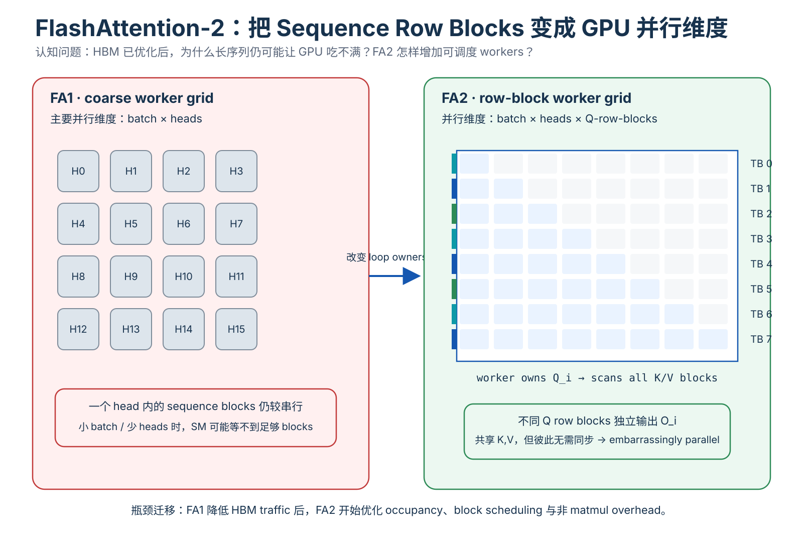

*教学解释图｜Sequence Row Block Parallelism。*

$$
O_i
=
\operatorname{softmax}
(
Q_iK^\top
)V.
$$

另一行 $r$：

$$
O_r
=
\operatorname{softmax}
(
Q_rK^\top
)V.
$$

两者共享：

$$
K,V,
$$

但：

$$
O_i
$$

不依赖：

$$
O_r.
$$

所以 row blocks 之间：

> 无需同步。

这就是 embarrassingly parallel。

---

## 19. Sequence Parallelism 为什么特别适合长 Context？

设 row block size：

$$
B_r=128.
$$

sequence：

$$
N=8192.
$$

则一个 head 可以产生：

$$
\frac{8192}{128}
=
64
$$

个 row-block workers。

原来一个 head 只有：

$$
1
$$

个 coarse worker。

现在变成：

$$
64.
$$

即使：

$$
B=1,\ H=16,
$$

thread blocks 近似：

$$
1\times16\times64
=
1024.
$$

108 SM 很容易被填满。

这就是 FA2 对长序列提升特别明显的原因之一。

---

# 九、原论文 Forward/Backward Parallelism 图

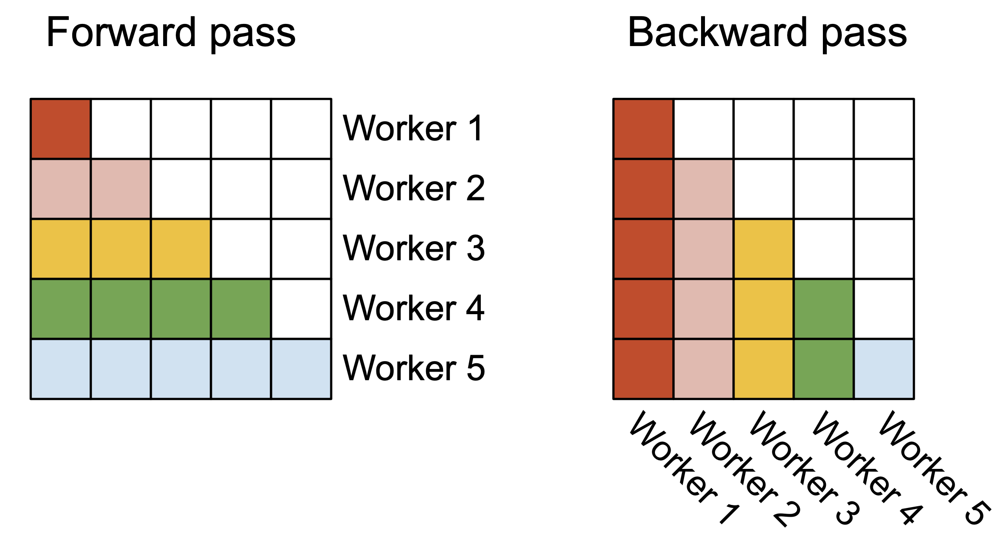

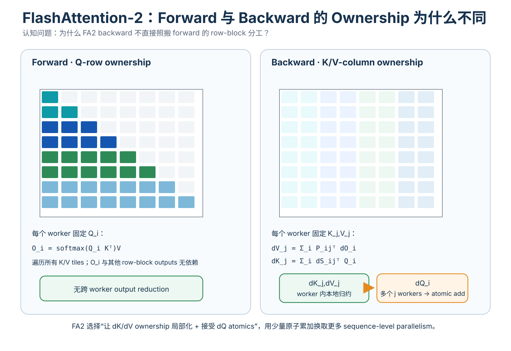

*教学解释图｜Forward Backward Ownership。*

*原论文 Figure。Forward 左图按 attention matrix 的 row blocks 分 worker；Backward 右图按 column blocks 分 worker。关键不是颜色，而是 FA2 把 sequence dimension 本身变成 GPU thread-block parallelism 的来源。*

这张图揭示：

## Forward

worker owns：

$$
Q_i
$$

对应的 row block。

## Backward

worker owns：

$$
K_j,V_j
$$

对应的 column block。

为什么 backward 不照搬 forward？

因为 gradient accumulation dependency 不同。

---

# 十、Backward 为什么按 Column Block 并行？

## 20. $dK_j,dV_j$ 可以局部累加

固定 K/V column block $j$。

它需要遍历所有 query row blocks：

$$
i=1,\dots,T_r.
$$

然后：

$$
dV_j
=
\sum_i
P_{ij}^\top dO_i.
$$

$$
dK_j
=
\sum_i
dS_{ij}^\top Q_i.
$$

所以一个 worker owning $j$：

> 可以在本地完成整个 $dK_j,dV_j$ reduction。

最后一次性写回。

非常适合 column-block worker。

---

## 21. 但 $dQ_i$ 会被多个 Column Workers 同时贡献

因为：

$$
dQ_i
=
\sum_j
dS_{ij}K_j.
$$

如果每个 worker 负责不同 $j$，那么多个 workers 都需要更新同一个：

$$
dQ_i.
$$

因此出现跨 thread-block accumulation。

FA2 使用：

> atomic add。

即：

$$
dQ_i
\mathrel{+}=
dS_{ij}K_j
$$

需要原子地累加。

---

## 22. 为什么愿意接受 Atomic Add？

这是典型 trade-off。

方案 A：

> 不并行 column blocks。

优点：

- 无 atomics。

缺点：

- GPU occupancy 差。

方案 B：

> 并行 column blocks。

优点：

- 更多 workers；
- GPU 吃满。

代价：

- $dQ$ atomic accumulation。

FA2 实验说明：

> 增加的 parallelism 收益大于 atomics 开销。

---

# 十一、FA1 Warp Partition：Split-K 到底是什么？

## 23. 一个 Thread Block 里通常有多个 Warps

例如：

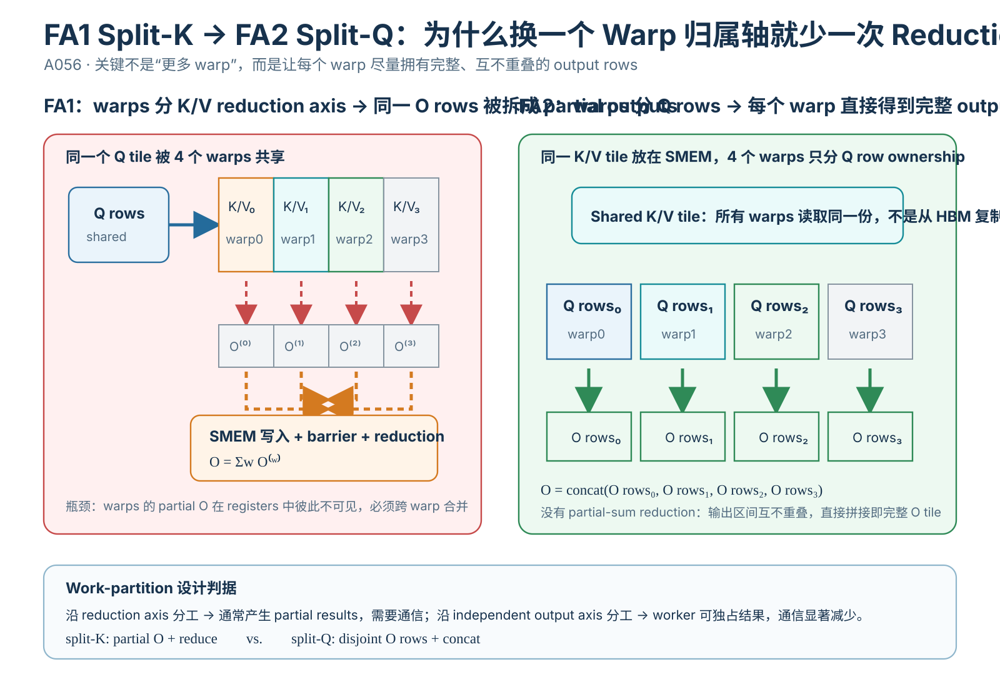

*教学解释图｜Warp Partition。*

$$
4
$$

或：

$$
8
$$

warps。

问题：

> 一个 $Q_i,K_j,V_j$ tile 的工作，怎样分给这些 warps？

FA1 的 forward 采用类似：

> split-K。

这里的“K”不是 Transformer 的 Key 名称那么简单，而是 GEMM reduction dimension 的 partition 思路。

在 Attention 图景中，可以直观理解为：

- Q 被多个 warps 共同使用；
- K/V key-range 被不同 warps 分片；
- 每个 warp 负责一部分 key columns。

---

## 24. 每个 Warp 得到什么？

Warp 0：

$$
P^{(0)}V^{(0)}.
$$

Warp 1：

$$
P^{(1)}V^{(1)}.
$$

...

但最终同一组 query rows 的输出：

$$
O
=
\sum_w
P^{(w)}V^{(w)}.
$$

所以每个 warp 只产生：

> partial output。

最终必须 reduce。

---

# 十二、为什么 Split-K 会产生 Shared-Memory Traffic？

## 25. Warps 之间不能直接共享彼此 Registers

每个 warp 的 partial output 在自己的 registers 中。

要合并：

1. warp 写 partial result 到 shared memory；
2. synchronization；
3. warps 读取其他 partials；
4. reduction；
5. 得到最终 O。

所以：

$$
\text{split-K}
\Rightarrow
\text{inter-warp communication}.
$$

这增加：

- SRAM read/write；
- synchronization；
- instruction overhead。

FA1 已经努力减少 HBM IO，但这里：

> shared-memory traffic

开始成为新瓶颈。

---

# 十三、FA2 Warp Partition：改成 Split-Q

## 26. 核心思想

不要把 key columns 分给不同 warps。

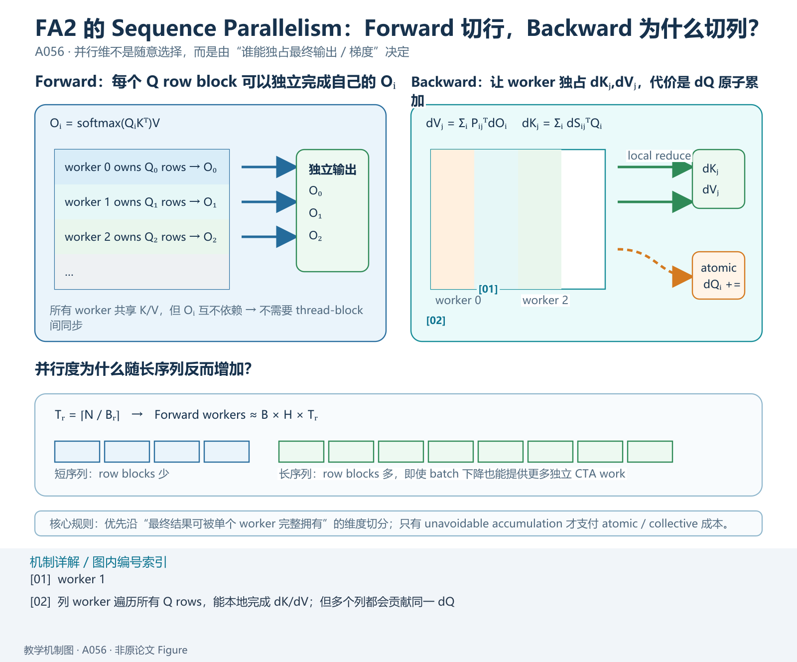

*教学解释图｜Split Q。*

改成：

> 把 query rows 分给不同 warps。

例如一个 Q block 有：

$$
128
$$

rows。

4 warps：

- warp 0：rows 0–31；
- warp 1：rows 32–63；
- warp 2：rows 64–95；
- warp 3：rows 96–127。

K/V tile 对所有 warps 可见。

---

## 27. 每个 Warp 现在得到完整 Output Slice

对自己负责的 query rows：

$$
Q^{(w)}K^\top
$$

覆盖完整 key dimension。

接着：

$$
P^{(w)}V.
$$

得到：

$$
O^{(w)}.
$$

这些输出属于不同 row slices。

它们之间：

> 不需要相加。

因此：

$$
\boxed{
\text{no cross-warp output reduction}.
}
$$

---

# 十四、原论文 FA1 vs FA2 Warp Partition

## FA1：Split-K

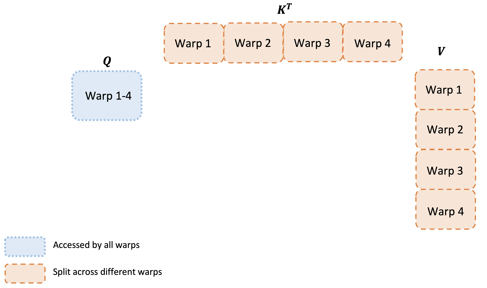

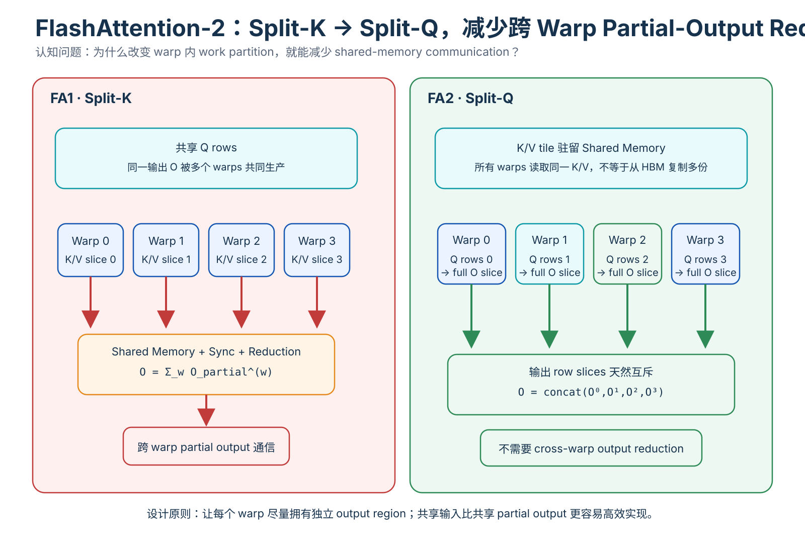

*教学解释图｜Split-K vs. Split-Q Warps。*

*原论文示意。多个 warps 分 K/V 方向，同一 query output 被拆成多个 partial results，所以必须跨 warp reduction。*

## FA2：Split-Q

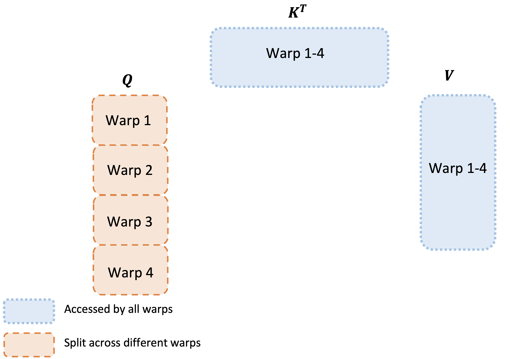

*原论文示意。多个 warps 分 Q rows，每个 warp 独立完成自己负责的 output rows，不需要把 partial output 重新汇总。*

这是 FA2 最值得建立空间直觉的地方。

---

# 十五、为什么 Split-Q 不意味着 K/V 被“复制很多份”到 HBM？

## 28. Logical Sharing 与 Physical Copy 要区分

多个 warps 都需要 K/V。

但它们处于同一 thread block。

所以 K/V 可以：

> 放进 shared memory / SRAM，被多个 warps 读取。

不是：

> 每个 warp 从 HBM 各复制一份完整 K/V。

因此 trade-off 是：

- K/V shared reads；
- 换掉 partial-output write/read/reduction。

实测后者更划算。

---

# 十六、为什么 Split-Q 不是永远更好？

## 29. Work Partition 依赖 Shape

如果：

- head dimension；
- block size；
- number of warps；
- register pressure；

变化，最优 partition 可能不同。

FA2 的结论是针对常见 Attention shape 和 GPU architecture 优化。

这不是一个抽象定理：

> 所有矩阵乘永远 split-Q 更优。

核心原则是：

> **让 warp 拥有尽可能独立的 output region，减少跨 warp reduction。**

---

# 十七、Block Size：为什么越大不一定越快？

## 30. 大 Block 的优势

例如：

$$
128\times128
$$

相比：

$$
64\times64.
$$

可能带来：

- 更高 data reuse；
- 更少 block overhead；
- 更少 shared-memory transaction；
- 更高 Tensor Core efficiency。

---

## 31. 但大 Block 消耗更多 Resources

需要：

- 更多 registers；
- 更多 shared memory；
- 更多 live intermediates。

如果 register 不够：

> register spilling。

register spill 到 local memory，实际通常落到更慢 memory hierarchy。

性能可能突然恶化。

如果 shared memory 超限：

> kernel 甚至无法 launch。

---

## 32. Occupancy 再次出现

单 block 占 SRAM：

$$
S_{\text{block}}.
$$

SM 总 SRAM：

$$
S_{\text{SM}}.
$$

理论驻留 block 数：

$$
\le
\left\lfloor
\frac{S_{\text{SM}}}{S_{\text{block}}}
\right\rfloor.
$$

block 越大：

$$
S_{\text{block}}\uparrow
\Rightarrow
\text{resident blocks}\downarrow.
$$

所以 tile size 存在 Pareto point。

FA2 常见选择：

$$
\{64,128\}
\times
\{64,128\}.
$$

并根据：

- head dimension；
- device SRAM；

手工 tuning。

---

# 十八、为什么这里已经接近 Compiler / Auto-Tuning 问题？

## 33. 最优 Tile 不是纯数学常数

它依赖：

$$
f(
d,
N,
\text{causal},
\text{GPU},
\text{register file},
\text{shared memory},
\text{warp count}
).
$$

因此论文明确提到：

> 这些 block sizes 可以由 auto-tuning 进一步自动寻找。

这就是算法逐渐进入 compiler/runtime territory 的标志。

---

# 十九、Causal Mask：为什么能直接少算接近一半 Blocks？

## 34. Causal Attention

合法条件：

$$
j\le i.
$$

Attention matrix 只有下三角有效。

如果 tile 完全落在上三角：

$$
j_{\min}>i_{\max},
$$

整个 tile 都是 masked。

可以：

> 直接 skip GEMM。

不是计算完再 mask。

---

## 35. 理想 FLOPs 约减半

dense square matrix：

$$
N^2.
$$

lower triangle 约：

$$
\frac{N^2}{2}.
$$

所以 ideal speedup 接近：

$$
2\times.
$$

论文实测：

$$
1.7\sim1.8\times.
$$

为什么不是 2×？

因为仍有：

- diagonal blocks；
- setup；
- softmax stats；
- load/store；
- launch/schedule；
- non-attention overhead。

这再次说明：

$$
\text{FLOP reduction}
\neq
\text{wall-clock reduction}.
$$

---

# 二十、FA2 为什么仍是 Exact Attention？

## 36. 三个改动都没有删除数学项

### Non-matmul reduction

只是代数重排。

### Sequence parallelism

只是把 rows/columns 分给不同 workers。

### Split-Q

只是 warp work assignment。

合法 attention pair：

$$
(i,j)
$$

仍然全部计算。

所以：

$$
\boxed{
O_{\text{FA2}}
=
\operatorname{softmax}(QK^\top)V.
}
$$

与 FA1 / standard dense Attention 数学等价。

---

# 二十一、FA1 与 FA2 的 Asymptotic Complexity 是否改变？

## 37. 没有

Forward FLOPs：

$$
O(N^2d).
$$

Backward 同数量级。

Attention auxiliary memory：

$$
O(N).
$$

FA2 的提升来自：

- constants；
- parallel schedule；
- operation mix；
- communication pattern。

因此这篇论文是一个很好的例子：

> **Big-O 完全一样，性能仍可以再提升 2×。**

---

# 二十二、A100 上为什么 Matmul 与 Non-Matmul Peak 差 16×

## 38. Tensor Core 是专用硬件

A100 Tensor Core 针对：

- FP16/BF16 matrix multiply accumulate；

进行了极强硬件优化。

所以：

$$
312\ \text{TFLOPs/s}.
$$

而普通 FP32 ALU 非 matmul：

$$
19.5\ \text{TFLOPs/s}.
$$

因此 kernel optimization 的目标不是：

> 只减少总指令数。

而是：

> **让时间尽可能花在硬件最擅长的操作上。**

这与 CPU SIMD / NPU matrix engine 完全相同。

---

# 二十三、Benchmark FLOPs 怎么算？

## 39. Forward Attention Matmul FLOPs

每 head：

$$
QK^\top
$$

约：

$$
2N^2d
$$

FLOPs。

$PV$：

$$
2N^2d.
$$

合计：

$$
4N^2d.
$$

乘 heads：

$$
\boxed{
4N^2dH.
}
$$

causal 时理论上约一半 entries：

$$
\approx2N^2dH.
$$

---

## 40. Backward 为什么论文乘 2.5？

Forward 有 2 个主要 matmuls：

- $QK^\top$；
- $PV$。

Backward 包含约 5 个 matmul-equivalent：

- recompute $QK^\top$；
- $dO V^\top$；
- $P^\top dO$；
- $dS K$；
- $dS^\top Q$。

所以 matmul FLOP 粗比：

$$
\frac52
=
2.5.
$$

因此论文以：

$$
\text{backward FLOPs}
\approx
2.5\times\text{forward FLOPs}.
$$

---

# 二十四、A100 实验：73% Peak 到底有多高？

## 41. FA2 Forward

达到最高约：

$$
230\ \text{TFLOPs/s}.
$$

A100 FP16/BF16 theoretical matmul peak：

$$
312\ \text{TFLOPs/s}.
$$

比例：

$$
\frac{230}{312}
\approx73.7\%.
$$

论文报告：

> up to 73% theoretical max。

这已经明显接近 optimized GEMM 的效率区间。

---

## 42. Backward

最高约：

$$
63\%
$$

theoretical peak。

为什么低于 forward？

backward 更复杂：

- 更多 matmuls；
- more operands；
- gradient accumulation；
- atomic $dQ$；
- dependency；
- synchronization；
- recomputation。

所以不能要求 backward 与 forward 相同利用率。

---

# 二十五、原论文 A100 Throughput Evidence

## Non-causal

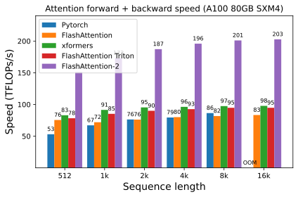

*原论文 benchmark，head dimension 128、non-causal。比较 standard attention、FA1、Triton FA1 与 FA2 的 forward+backward throughput。*

## Causal

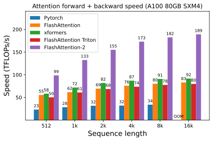

*原论文 causal benchmark。Causal block skipping 进一步减少有效计算，但最终 wall-clock 仍由算术、同步、调度和 memory 共同决定。*

论文总体报告：

- FA2 vs FA1：约 1.7–3.0×；
- FA2 vs Triton FA1：约 1.3–2.5×；
- FA2 vs standard PyTorch attention：最高约 3–10×。

注意这些范围对应不同：

- sequence length；
- head dim；
- causal/non-causal；
- forward/backward。

不能只拿最大值泛化。

---

# 二十六、为什么 FA2 对长序列特别有价值？

## 43. 长序列通常意味着更小 Batch

显存预算固定。

Sequence length：

$$
N\uparrow
$$

会增加：

- activations；
- KV；
- attention compute。

于是 batch size：

$$
B\downarrow.
$$

FA1 parallel blocks：

$$
B\times H
$$

因此下降。

---

## 44. FA2 增加 Sequence Blocks

现在：

$$
B\times H\times T_r.
$$

其中：

$$
T_r
=
\left\lceil
\frac{N}{B_r}
\right\rceil.
$$

当：

$$
N\uparrow,
$$

$T_r$ 反而增加。

这会抵消 batch 下降导致的 parallelism shortage。

这是一种非常漂亮的 workload-adaptive decomposition。

---

# 二十七、End-to-End Training：Kernel Speedup 为什么会被稀释？

## 45. GPT Training 不只有 Attention

总时间包括：

- QKV projection；
- attention；
- output projection；
- MLP；
- norm；
- optimizer；
- communication；
- embedding；
- dataloader。

所以即使 Attention kernel：

$$
2\times
$$

更快，

end-to-end 不可能自动：

$$
2\times.
$$

这就是 Amdahl's law。

---

## 46. 原论文 8×A100 Training

| Model | 无 FA1 | FA1 | FA2 |
|---|---:|---:|---:|
| GPT-3 1.3B, 2K | 142 | 189 | 196 TFLOPs/s |
| GPT-3 1.3B, 8K | 72 | 170 | 220 |
| GPT-3 2.7B, 2K | 149 | 189 | 205 |
| GPT-3 2.7B, 8K | 80 | 175 | 225 |

最高：

$$
225\ \text{TFLOPs/s/GPU}.
$$

约：

$$
72\%
$$

model FLOPs utilization。

---

## 47. 为什么 8K 的增益比 2K 更明显？

2K 时 Attention 占总训练时间比例较小。

FA1 已经很快。

所以：

$$
189\rightarrow196
$$

提升有限。

8K 时 quadratic Attention 成本占比上升。

而 FA2 sequence parallelism 又更容易发挥。

于是：

$$
170\rightarrow220.
$$

这再次体现：

> 优化价值取决于 workload。

---

# 二十八、FA2 支持 MQA/GQA 的方式

## 48. 不要真的复制 KV Heads

MQA/GQA：

多个 Q heads 共享一组 K/V head。

naive implementation 可能：

> 把 K/V 物理 repeat 成与 Q heads 数相同。

这样浪费：

- memory；
- bandwidth。

FA2 通过 index mapping：

> 不真正复制数据，只让多个 Q heads 指向同一个 K/V head。

---

## 49. Backward 需要额外 Reduction

因为多个 Q heads 都使用同一个：

$$
K_h,V_h.
$$

所以每个 Q group 会贡献：

$$
dK,dV.
$$

最终必须：

$$
dK_h
=
\sum_g dK_{h,g},
$$

$$
dV_h
=
\sum_g dV_{h,g}.
$$

这是共享参数梯度的自然结果。

---

# 二十九、H100：为什么“直接搬过去”就已经更快？

## 50. 论文在 H100 上没有用 Hopper Specialized Features

FA2 implementation 直接运行：

最高约：

$$
335\ \text{TFLOPs/s}.
$$

但没有特意使用：

- TMA；
- 4th-gen Tensor Cores；
- FP8。

这说明：

> 硬件本身更强，FA2 kernel 仍能获得收益。

但作者预计：

> 真正针对 Hopper 重写还能再提升 1.5–2×。

这正是后来 [FlashAttention-3](A057-flashattention3.md) 的方向：不再只优化 work partition，而是显式利用 Hopper 的 TMA / WGMMA 异步执行、warp specialization 与 FP8。

---

# 三十、为什么 FA2 还没有把 H100 吃透？

## 51. Hardware Generation 改变了最优 Dataflow

Hopper 新增：

- Tensor Memory Accelerator；
- asynchronous copy capability；
- WGMMA；
- FP8 Tensor Core；
- 更复杂 pipeline。

如果仍用 A100-era kernel schedule：

> 无法利用新机制。

因此：

$$
\text{algorithm unchanged}
$$

不代表：

$$
\text{kernel unchanged}.
$$

---

# 三十一、FA1 → FA2 真正体现的是“优化层级迁移”

## 52. FA1

目标：

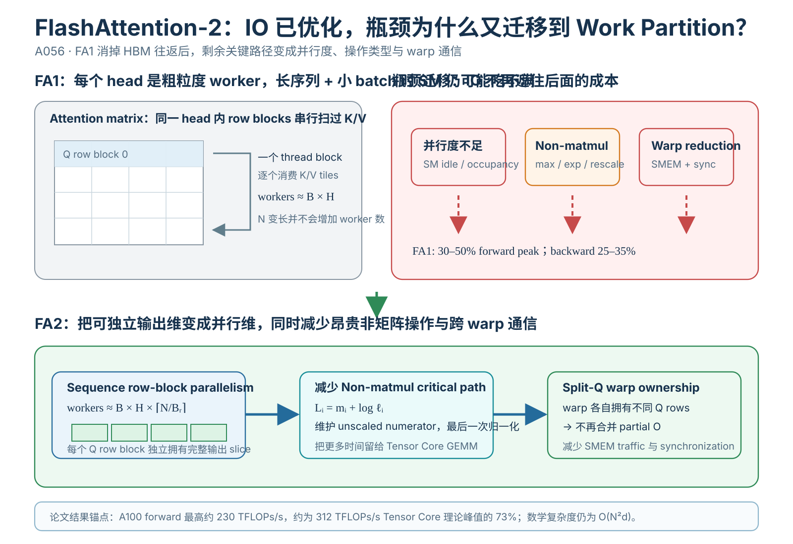

*教学解释图｜FA1 vs. FA2。*

$$
\text{HBM traffic}.
$$

手段：

- SRAM tiling；
- fusion；
- online softmax；
- recomputation。

---

## 53. FA2

目标转成：

$$
\text{GPU utilization}.
$$

手段：

- operation mix；
- block parallelism；
- warp partition；
- shared-memory communication；
- occupancy。

---

## 54. 后续 FA3

进一步：

$$
\text{asynchronous hardware pipeline}.
$$

手段：

- producer/consumer warp specialization；
- TMA；
- WGMMA；
- FP8。

所以 FlashAttention 系列本身就是一条硬件系统学习路线。

---

# 三十二、为什么“Big-O 一样”完全不妨碍再快 2×

## 55. FA1 与 FA2 都是

$$
O(N^2d).
$$

也都是 exact。

但 GPU runtime 近似受：

$$
T
=
f(
\text{FLOPs},
\text{HBM},
\text{SRAM},
\text{registers},
\text{occupancy},
\text{sync},
\text{warp partition}
)
$$

共同决定。

Big-O 只描述：

> N 增大时的数量级趋势。

它不描述：

- constant；
- parallel execution；
- hardware utilization。

所以 systems optimization 中：

> 同一个复杂度 class 内出现 2–10× 差异非常正常。

---

# 三十三、FA2 与 MInference：两个完全不同的 Parallelism

## 56. MInference

减少：

$$
|\mathcal S|
$$

即实际 attention pairs。

属于：

> algorithmic sparsity。

---

## 57. FA2

不减少 pair。

改变：

> pair 如何分给 thread blocks / warps。

属于：

> execution parallelism。

因此：

$$
\boxed{
\text{Sparsity}
\neq
\text{Parallelism}.
}
$$

两者可以继续叠加。

---

# 三十四、为什么 FA2 很适合作为 4D Parallelism 前置？

## 58. 这里第一次真正把“单 GPU 内部并行”拆到执行单元

后面学：

- Tensor Parallelism；
- Context Parallelism；
- Pipeline Parallelism；
- Data Parallelism；

是在：

> 多 GPU / 多节点

分配大任务。

FA2 则是在：

> 单 GPU 内部

分配：

- thread blocks；
- warps；
- SRAM；
- registers。

两个层次的基本问题其实一样：

$$
\boxed{
\text{把 workload 拆给并行执行单元，同时最小化通信。}
}
$$

---

# 三十五、对机器人 GPU/NPU 的迁移意义

## 59. Work Partition 比“线程越多越好”复杂得多

例如一个视觉算子：

- 按 channels 分线程；
- 按 spatial rows 分线程；
- 按 reduction dimension 分线程；

可能产生完全不同 communication。

如果按 reduction dimension 分：

> 最后通常需要 partial-sum reduction。

如果按独立 output dimension 分：

> worker 之间可能无需通信。

FA1 split-K → FA2 split-Q 就是最典型案例。

---

## 60. 在 NPU 上同样要问

- 哪个 dimension 是 reduction axis？
- 哪个 dimension 的 output 独立？
- local SRAM 多大？
- matrix engine 支持什么 tile？
- vector core 与 matrix core throughput 差多少？
- DMA 能否异步搬数据？
- 哪种 partition 会制造跨 core communication？

这远比：

> “这个网络多少 GFLOPs”

更接近真实部署。

---

# 三十六、论文证据边界

## 61. 可以支持

### A

FA1 的 GPU utilization 明显低于 optimized GEMM。

### B

减少 non-matmul FLOPs、增加 sequence parallelism、改 warp partition 能显著提升 throughput。

### C

A100 指定 benchmark 下 FA2 attention 可达约 73% forward theoretical peak，backward up to 63%。

### D

对 GPT-style training，FA2 能进一步提升 end-to-end throughput，长 context 下收益更显著。

---

## 62. 不能过度扩张

### 错误 1

“Split-Q 在所有 GPU kernel 都优于 Split-K。”

不成立。

### 错误 2

“FA2 比 FA1 永远 2×。”

不同 shapes 差异明显。

### 错误 3

“73% peak 就等于整模型 73% GPU utilization。”

Attention kernel metric 与 model FLOPs utilization 不是同一个 measurement。

### 错误 4

“H100 335 TFLOPs/s 就说明已经针对 Hopper 优化。”

恰恰相反，论文明确还没利用 TMA/WGMMA/FP8。

### 错误 5

“FA2 改善了 Attention 数学复杂度。”

没有。

---

# 三十七、把整篇论文压成一条因果链

~~~{mermaid}
flowchart TD
    A["FlashAttention-1 HBM IO greatly reduced"] --> B["New bottlenecks exposed"]
    B --> C["Non-matmul FLOPs expensive"]
    B --> D["Long sequence + small batch not enough thread blocks"]
    B --> E["split-K warps shared-memory reduction"]
    C --> F["Keep unscaled output store only logsumexp"]
    D --> G["Parallelize over sequence row/column blocks"]
    E --> H["split-Q warp partition"]
    F --> I["Less non-matmul work"]
    G --> J["Higher SM occupancy"]
    H --> K["Less inter-warp communication"]
    I --> L["FA2"]
    J --> L
    K --> L
    L --> M["up to 73% forward peak up to 63% backward peak"]
~~~

如果只记一句：

> **FlashAttention-2 的核心不是再发明一次 Attention，而是把已经 IO-aware 的 Attention 映射得更像 GPU 真正喜欢的 workload：大量独立 thread blocks、尽量多 Tensor Core matmul、尽量少跨 warp reduction。**

---

# 三十八、下一步：FA3 还是 4D Parallelism？

从知识依赖看，两条都合理：

## 继续 GPU kernel

$$
\text{FA1}
\rightarrow
\text{FA2}
\rightarrow
\text{FA3}.
$$

可以继续进入 Hopper：

- TMA；
- WGMMA；
- warp specialization；
- asynchronous pipeline；
- FP8。

## 转入 Distributed Training

$$
\text{single-GPU work partition}
\rightarrow
\text{multi-GPU work partition}.
$$

进入：

- TP；
- PP；
- CP；
- FSDP。

目前模型主线中 Llama 3 已经明确暴露 4D parallelism，所以 FA2 完成后，**4D Parallelism 的阻塞优先级已经高于继续深挖 FA3**。

FA3 可以作为 GPU kernel 主线的后续扩展。

---

# 三十九、最终自检

读完 FA2，至少应该回答：

1. FA1 已经显著减少 HBM IO，为什么还没接近 GEMM peak？
2. A100 的 SM、thread block、warp 分别是什么层次？
3. occupancy 低具体意味着什么？
4. 为什么长 context + 小 batch 容易让 FA1 occupancy 下降？
5. 为什么 non-matmul FLOPs 比 Tensor Core matmul FLOPs 贵？
6. 312 TFLOPs/s vs 19.5 TFLOPs/s 说明什么？
7. FA2 怎样减少 online softmax 的 non-matmul work？
8. 为什么可以只保存 $L=m+\log\ell$？
9. backward 怎样用 $P=e^{S-L}$ 重建 probability？
10. FA1 主要 parallelize 哪两个维度？
11. FA2 为什么可以 parallelize query row blocks？
12. row blocks 为什么无需彼此通信？
13. backward 为什么选择 column blocks？
14. 多 column workers 为什么会共同写 $dQ$？
15. atomic add 为什么在这里是合理 trade-off？
16. FA1 split-K 到底把哪部分工作分给 warps？
17. 为什么 split-K 产生 partial output？
18. partial output 为什么需要 shared-memory reduction？
19. FA2 split-Q 怎样消掉这次 reduction？
20. K/V 被多个 warps 使用为什么不等于 HBM 物理复制？
21. block size 增大为什么既可能加速又可能减速？
22. register spilling 是什么？
23. shared memory 如何限制 resident blocks？
24. causal mask 为什么能 skip 完整 upper-triangle blocks？
25. 为什么实际 causal speedup 不是严格 2×？
26. FA2 是否仍 exact？
27. FA1 与 FA2 的 Big-O 是否不同？
28. forward 4N²dH FLOPs 从哪里来？
29. backward 约 2.5× forward FLOPs 为什么？
30. 230 TFLOPs/s / 312 TFLOPs/s 为什么约等于 73%？
31. backward 为什么只能约 63% peak？
32. kernel speedup 与 end-to-end speedup 为什么不同？
33. 为什么 8K context 比 2K context 更受益？
34. MQA/GQA 为什么不应该真的复制 KV heads？
35. GQA backward 为什么要汇总共享 K/V gradients？
36. H100 直接运行达到 335 TFLOPs/s 能说明什么？
37. 为什么这仍然不是 Hopper-optimized kernel？
38. FA1 → FA2 的瓶颈迁移是什么？
39. 单 GPU warp partition 与未来多 GPU parallelism 有什么共同原则？
40. 为什么 4D Parallelism 比继续 FA3 更适合作为下一主节点？

如果这些问题都能回答，FA2 就不再只是“FlashAttention 又快了 2×”，而是一节完整的 GPU workload decomposition 课程：

$$
\boxed{
\text{并行度}
+
\text{工作划分}
+
\text{通信}
+
\text{硬件专用单元利用率}
}
$$

必须一起优化。
