# FlashAttention-3：FA2 已经把工作切好了，为什么到了 H100 还要重新设计 Attention？

> **论文**：Jay Shah, Ganesh Bikshandi, Ying Zhang, Vijay Thakkar, Pradeep Ramani, Tri Dao, [FlashAttention-3: Fast and Accurate Attention with Asynchrony and Low-precision](https://arxiv.org/abs/2407.08608)，NeurIPS 2024。  
> **类型**：A · GPU 系统 / 原始方法论文；Exact Attention + Hopper Asynchrony + FP8。  
> **一句话定位**：FlashAttention-1 解决 HBM IO，FlashAttention-2 解决 block/warp work partition；到了 Hopper，新的瓶颈变成“不同硬件引擎仍被同步依赖串起来”。FlashAttention-3 把 TMA 数据搬运、WGMMA Tensor Core GEMM 和 softmax 非矩阵运算组织成异步 software pipeline，并进一步解决 FP8 layout 与数值误差问题。

上一站：

- [FlashAttention：IO-aware exact attention](A055-flashattention.md)
- [FlashAttention-2：Parallelism 与 Work Partition](A056-flashattention2.md)

如果想把“GPU 内 work partition”与“多 GPU process-group partition”放在一起比较，可以再读：

- [4D Parallelism：TP / PP / CP / FSDP 到底在切什么？](../../C/01-distributed-training/C001-4d-parallelism.md)

三代 FlashAttention 的主线可以先压成一句：

$$
\boxed{
\text{FA1: 少搬数据}
\rightarrow
\text{FA2: 更合理地分工作}
\rightarrow
\text{FA3: 让不同硬件单元异步重叠工作}
}
$$

这篇文章最值得学的不是“H100 上又快了多少”，而是一个更一般的 accelerator 设计问题：

> **当 GPU 已经拥有专门的数据搬运引擎、Tensor Core 和普通 CUDA/SFU 执行路径时，算法应该怎样显式地把依赖图改写成 pipeline，而不是让所有硬件单元轮流等待？**

---

## 阅读导航

本文重点回答：

1. FA2 为什么在 A100 很成功，到了 H100 却只有约 35% peak utilization？
2. Hopper 相比 Ampere，哪些硬件能力真正改变了 kernel design？
3. thread、warp、warpgroup、CTA 分别是什么？
4. TMA 为什么不是普通 load instruction 的简单替代？
5. WGMMA 为什么是理解 FA3 的关键？
6. asynchronous instruction 到底“异步”在哪里？
7. producer-consumer warp specialization 怎样工作？
8. 为什么 producer 可以少占 registers，而 consumer 多拿 registers？
9. circular SMEM buffer 的 stage 与 barrier 在管理什么？
10. ping-pong scheduling 到底 overlap 了谁和谁？
11. 为什么 softmax FLOPs 很少，却仍能占掉可观 wall-clock？
12. 2-stage GEMM-softmax pipeline 如何打破“QK → softmax → PV”看似完全串行的结构？
13. 2-stage 为什么需要额外保存 $S_{\mathrm{next}}$？
14. 3-stage 为什么不一定更快？
15. FP8 Tensor Core 为什么让 softmax 相对更“贵”？
16. FP8 WGMMA 的 k-major layout 限制是什么？
17. 为什么 $V$ 需要在 kernel 内转置？
18. 为什么第一个 GEMM 的 FP32 accumulator 不能直接喂给第二个 FP8 WGMMA？
19. byte permutation 与 matching $V$ permutation 为什么保持结果正确？
20. block quantization 为什么比 per-tensor scaling 更适合 FlashAttention？
21. incoherent processing 为什么不改变 $QK^\top$？
22. 为什么 Hadamard transform 可以把 outlier 摊平？
23. FA3 FP8 的误差改善到底来自 block quantization 还是 incoherent processing？
24. 740 TFLOPs/s、1.2 PFLOPs/s 和 75% peak 应该怎样理解？
25. ablation 为什么能证明 warp specialization 与 GEMM-softmax pipeline 都有独立贡献？
26. FA3 的边界是什么？
27. 这套异步 pipeline 思想怎样迁移到 NPU、机器人边缘 accelerator 与其他 fused kernels？

---

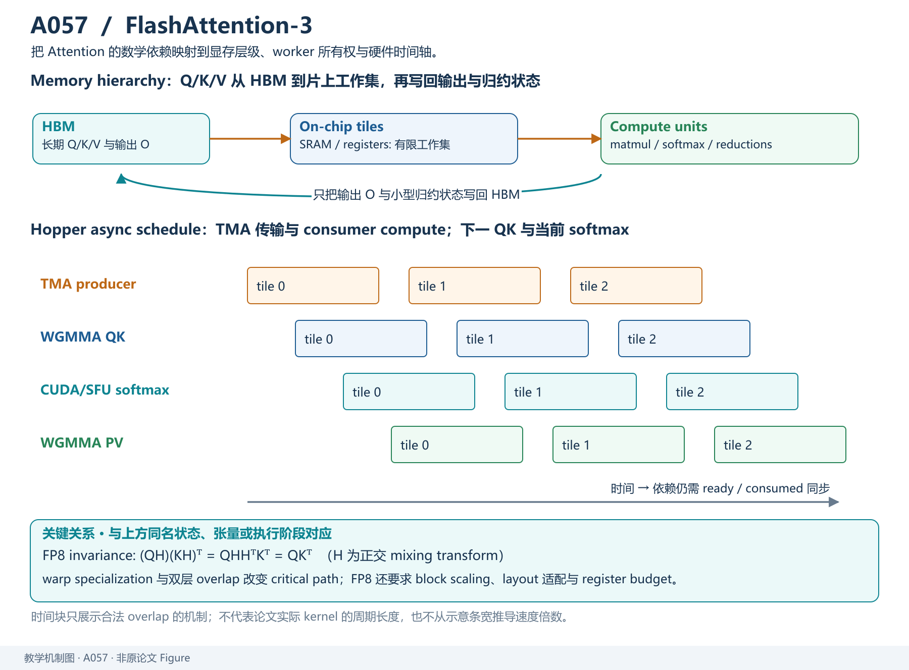

*教学解释图｜Hopper 的 TMA/WGMMA 与 producer-consumer 异步流水让数据搬运、GEMM 与 softmax 尽可能重叠。*

# 一、先把三代 FlashAttention 的瓶颈迁移串起来

理解 FA3 最容易犯的错误，是把它看成：

> “FlashAttention-2 的 H100 优化版。”

这当然不算错，但太表面。

真正重要的是：

$$
\boxed{
\text{每一代都在解决上一代优化后新暴露出来的瓶颈}
}
$$

## 1. Standard Attention：HBM traffic 太大

标准 Attention：

$$
S=QK^\top,
\qquad
P=\operatorname{softmax}(S),
\qquad
O=PV.
$$

如果把：

$$
S,P\in\mathbb R^{N\times N}
$$

完整写入 HBM，再读回来，wall-clock 会被 memory traffic 拖累。

于是 FA1 做：

$$
\boxed{
\text{tiling}
+
\text{online softmax}
+
\text{recomputation}
}
$$

让 $S,P$ 不再 materialize 到 HBM。

## 2. FA1 之后：GPU 还是没吃满

HBM traffic 降下来以后，FA2 发现：

- thread-block parallelism 不足；
- long sequence + small batch 时 SM 闲置；
- warp partition 存在 shared-memory reduction；
- non-matmul FLOPs 相对昂贵。

于是 FA2：

- sequence-length parallelism；
- split-K → split-Q；
- 减少 non-matmul work。

核心变成：

$$
\boxed{\text{更好的 work ownership}}
$$

## 3. FA2 到 H100：硬件变了，旧 execution schedule 没跟上

FA2 在 A100 上已经能达到很高的有效吞吐。

但论文指出，在 H100 上，FA2 相对 optimized GEMM 仍然利用率不高：

$$
\text{FA2 attention utilization}
\approx35\%
$$

而优化 GEMM 可以达到：

$$
80\%\sim90\%.
$$

为什么？

不是因为 FA2 的 tiling 突然失效。

而是 Hopper 给出了新的硬件能力：

- Tensor Memory Accelerator；
- asynchronous WGMMA；
- warpgroup execution；
- dynamic register redistribution；
- 更高 FP8 Tensor Core throughput。

如果 kernel 仍按较同步的执行模型组织：

$$
\boxed{
\text{新硬件存在}
\neq
\text{算法自动得到新硬件收益}
}
$$

这就是 FA3 的出发点。

---

# 二、Hopper 的变化：GPU 不再只是“一群线程 + Tensor Core”

FA3 论文真正关心的是：

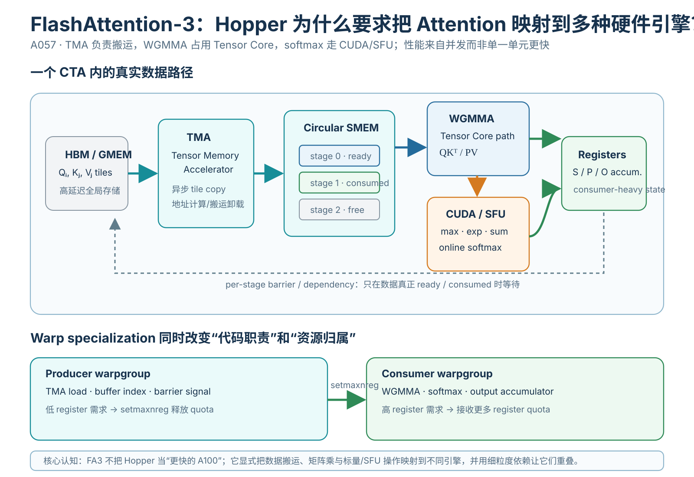

*教学解释图｜Hopper Hardware。*

> **一个 SM 内已经存在多种 specialized execution engines。**

为了理解后面的 pipeline，先把几个词讲清楚。

## 4. Warpgroup：WGMMA 的基本协作单位

NVIDIA 的基本 thread hierarchy：

~~~text
thread
↓
warp = 32 threads
↓
warpgroup = 4 contiguous warps = 128 threads
↓
CTA / thread block
↓
threadblock cluster
↓
grid
~~~

Ampere 时代常强调 warp-level MMA。

Hopper 中 FA3 重点使用：

$$
\boxed{\text{WGMMA}}
$$

即 warpgroup-level matrix multiply-accumulate。

一组 4 warps：

$$
128\text{ threads}
$$

共同发起大 tile 的 Tensor Core matrix multiply。

## 5. WGMMA 的关键不是“矩阵乘更快”，而是 asynchronous

如果一条普通同步 instruction：

~~~text
issue instruction
↓
等待结果 ready
↓
才能继续依赖它的后续工作
~~~

WGMMA 可以被异步发起。

更准确地说：

> warpgroup 发出 WGMMA work 后，Tensor Core 在异步执行路径继续完成它；发起方不必立刻阻塞到整个 MMA 完成，只有真正消费结果时才需要 wait / fence。

所以 execution graph 从：

$$
A\rightarrow B\rightarrow C
$$

有机会变成：

$$
A\rightarrow \boxed{\text{async B}}
$$

同时其他可独立推进的 work 继续执行。

注意：

> **异步不等于没有依赖。**

真正依赖 WGMMA result 的操作仍然必须等待。

优化的本质是：

$$
\boxed{
\text{只在数据依赖真正存在的位置等待}
}
$$

而不是每发一个大操作就全体停住。

---

# 三、TMA：把数据搬运也从普通线程里“拆出去”

## 6. 普通 tiled kernel 的 load 也有成本

过去做：

$$
\text{HBM}\rightarrow\text{SMEM}
$$

通常需要很多 threads：

- 计算地址；
- issue global loads；
- 写 shared memory；
- 处理 boundary；
- 消耗 registers 保存地址和中间状态。

所以“搬数据”本身会占用：

- instruction issue；
- registers；
- thread execution resources。

## 7. Hopper Tensor Memory Accelerator

TMA：

$$
\boxed{\text{Tensor Memory Accelerator}}
$$

是 Hopper 专门负责 tensor memory movement 的硬件路径。

可以把 tile movement 理解成：

$$
\text{GMEM}
\xrightarrow{\mathrm{TMA}}
\text{SMEM}.
$$

它可以：

- 异步搬运 tile；
- 处理多维 tensor addressing；
- 减少普通 CUDA threads 做地址计算/搬运的负担；
- 与后续计算形成 producer-consumer pipeline。

所以 FA3 不再让所有 warps 都做一样的事。

而是开始：

$$
\boxed{\text{warp specialization}}
$$

---

# 四、Warp Specialization：同一个 CTA 内也应该有“岗位分工”

FA3 把一个 CTA 内的 warps / warpgroups 分成角色。

## 8. Producer warpgroup

Producer 主要负责：

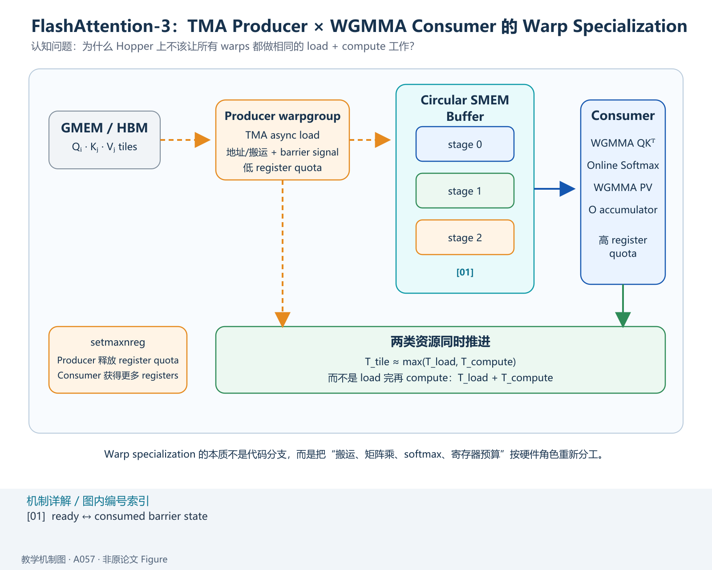

*教学解释图｜Hopper Producer Consumer。*

- TMA load $Q_i$；
- TMA load $K_j,V_j$；
- 管理 circular SMEM buffer；
- 发 barrier signal。

它不负责大规模 Tensor Core accumulator。

因此 producer 不需要那么多 registers。

## 9. Consumer warpgroup

Consumer 负责：

- WGMMA：
  :::{math}
  Q_iK_j^\top
  :::
- online softmax；
- WGMMA：
  :::{math}
  P_{ij}V_j
  :::
- output accumulator；
- softmax statistics。

这些工作 register hungry。

因此 consumer 应该获得更多 registers。

---

# 五、setmaxnreg：寄存器也开始按角色动态分配

一个 SM 的 register file 总容量固定。

传统 CTA 中，register allocation 很容易被所有 warps 的最大需求拖住。

Hopper 提供 **setmaxnreg**，让 warpgroups 动态调整可用 registers。

FA3 中：

- producer deallocate 一部分 register quota；
- consumer reallocate 更多 registers。

于是：

$$
\boxed{
\text{角色 specialization}
\rightarrow
\text{resource specialization}
}
$$

这非常重要。

warp specialization 不是只把代码分支写成不同角色。

真正的收益还来自：

> **不同角色可以拥有不同的硬件资源配置。**

---

# 六、Circular SMEM Buffer：为什么 producer 不会踩坏 consumer 正在用的数据？

假设 shared memory 中准备：

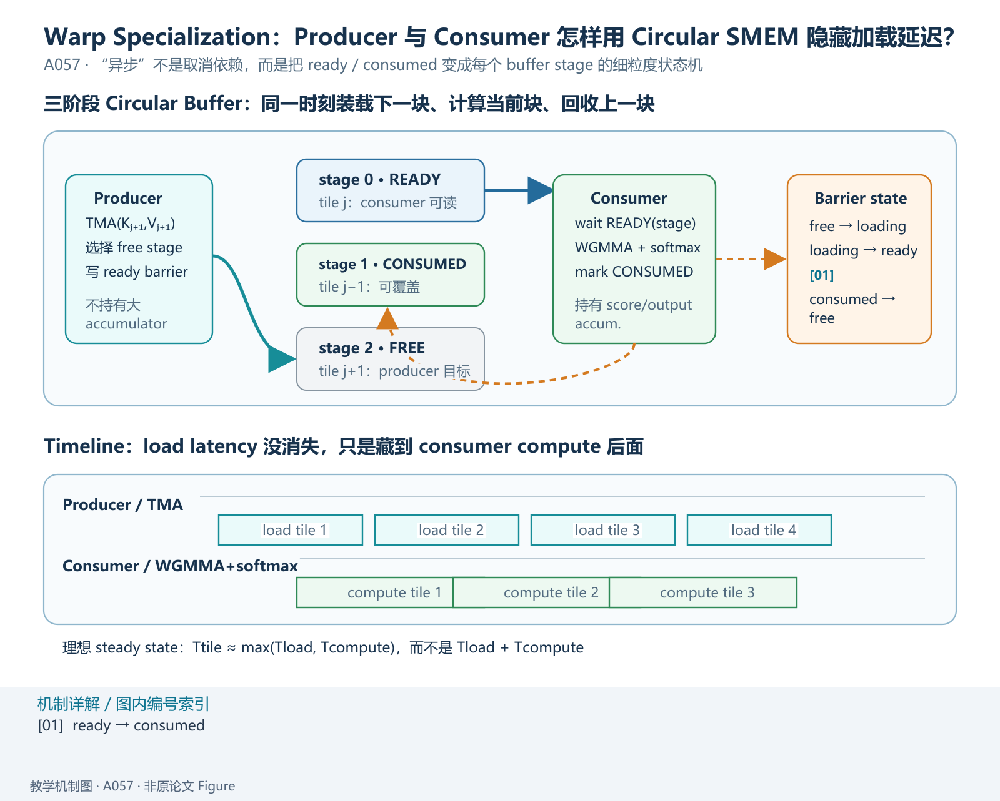

*教学解释图｜Producer Consumer Pipeline。*

$$
s
$$

个 stages。

例如：

$$
s=3.
$$

可以想象成：

~~~text
SMEM
┌─────────┐
│ stage 0 │
├─────────┤
│ stage 1 │
├─────────┤
│ stage 2 │
└─────────┘
~~~

producer 不断把：

$$
K_j,V_j
$$

装进：

$$
j\bmod s
$$

对应的 stage。

但如果 consumer 还没有用完这个 stage，producer 不能覆盖。

## 10. 两种状态

每个 buffer stage 至少有两个关键事件：

### ready

producer 已经完成 TMA load：

$$
\text{tile ready for consumer}.
$$

### consumed

consumer 已经完成所有依赖计算：

$$
\text{stage reusable by producer}.
$$

所以 producer / consumer 的协作不是靠“大家一起同步”。

而是：

$$
\boxed{
\text{per-stage barrier state machine}
}
$$

## 11. 为什么 circular buffer 能隐藏 memory latency？

如果只有一个 buffer：

~~~text
load K0,V0
wait
compute
load K1,V1
wait
compute
...
~~~

完全串行。

多 stage buffer：

~~~text
consumer: compute stage 0
producer:             load stage 1

consumer: compute stage 1
producer:             load stage 2
~~~

于是 memory transfer 可以躲到 compute 后面。

理想情况下：

$$
T_{\text{tile}}
\approx
\max(
T_{\text{load}},
T_{\text{compute}}
).
$$

而不是：

$$
T_{\text{load}}+T_{\text{compute}}.
$$

---

# 七、但这还只是第一层异步：FA3 还有第二层

到这里解决的是：

$$
\boxed{
\text{TMA data movement}
\parallel
\text{consumer compute}
}
$$

但 consumer 自己内部还是有一个非常棘手的依赖链：

$$
QK^\top
\rightarrow
\operatorname{softmax}
\rightarrow
PV.
$$

看起来三步必须完全串行。

FA3 的第二个关键贡献，就是继续把这个链条挖出 overlap。

---

# 八、为什么 softmax FLOPs 少，却依然很贵？

现代 GPU 上：

$$
\text{matmul FLOPs}
$$

和：

$$
\text{exp / max / sum / scalar FLOPs}
$$

不是同一种硬件吞吐。

论文给 H100 SXM5 的例子：

FP16 Tensor Core matmul：

$$
989\text{ TFLOPs/s}
$$

而 special function，例如 exponential：

$$
\approx3.9\text{ TFLOPs/s}.
$$

## 12. Head dim = 128 的直觉计算

论文指出在该设置下，matmul FLOPs 数大约是 exponential 数量的：

$$
512\times.
$$

看起来 exp 很少。

但 exp throughput 比 matmul 低约：

$$
256\times.
$$

因此 exponential 即使数量远少于 matmul，仍可能消耗到 matmul 一半量级的 cycle budget。

所以：

$$
\boxed{
\text{FLOP count}
\neq
\text{time share}
}
$$

---

# 九、为什么 FP8 反而让 softmax 问题更严重？

Hopper FP8 Tensor Core throughput 大约进一步翻倍。

但：

$$
\exp
$$

并不会跟着翻倍。

于是：

$$
T_{\text{matmul}}\downarrow
$$

而：

$$
T_{\text{softmax}}
$$

变化不大。

所以 softmax 在关键路径中的相对比例上升。

这就是一个非常有意思的系统规律：

$$
\boxed{
\text{某个单元越快}
\Rightarrow
\text{其他单元越容易成为新 bottleneck}
}
$$

---

# 十、Ping-Pong Scheduling：让不同 consumer warpgroups 交错工作

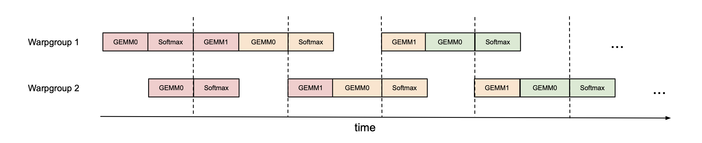

这是 FA3 第一种 GEMM-softmax overlap。

假设有两个 consumer warpgroups：

$$
C_0,\ C_1.
$$

概念性的时序：

~~~text
C0: WGMMA(tile 0) → softmax(tile 0)
C1:                 WGMMA(tile 1) → softmax(tile 1)
~~~

因为 WGMMA 本身异步：

- 当 $C_0$ 开始执行普通 CUDA/SFU softmax；
- $C_1$ 可以继续让 Tensor Core 执行 WGMMA。

随后交换角色。

所以叫：

$$
\boxed{\text{ping-pong}}
$$

## 13. Ping-pong overlap 的是谁？

不是：

$$
\text{load}\parallel\text{compute}.
$$

那是 producer / consumer TMA pipeline。

这里 overlap 的是：

$$
\boxed{
\text{consumer A 的 softmax}
\parallel
\text{consumer B 的 WGMMA}
}
$$

这是第二层 pipeline。

---

# 十一、为什么不同 warpgroup 能帮忙？

因为 WGMMA 与 softmax 主要使用不同执行资源。

## WGMMA

主要占：

$$
\text{Tensor Core}.
$$

## softmax

主要依赖：

- ordinary FP instructions；
- special function unit；
- registers；
- CUDA execution pipeline。

如果 schedule 合理，两者可以同时推进。

这也是 FA3 与 FA2 的一个本质差异：

> FA2 重点避免不必要通信；FA3 开始主动构造 hardware-unit concurrency。

---

# 十二、2-Stage Pipeline：更进一步，在 tile 之间打破串行依赖

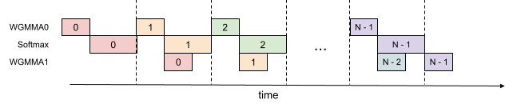

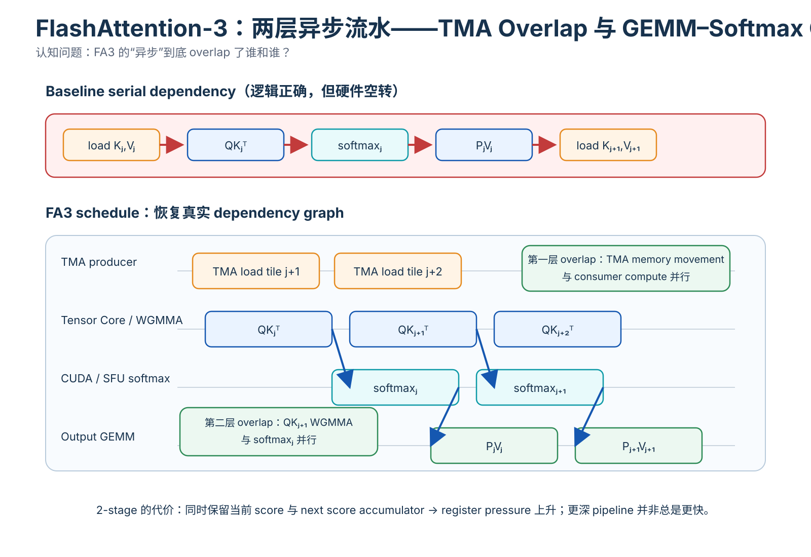

*教学解释图｜Two Level Async Pipeline。*

假设当前正在处理：

$$
j
$$

号 K/V block。

逻辑上需要：

$$
S_j=QK_j^\top
$$

然后：

$$
P_j=\operatorname{softmax}(S_j)
$$

最后：

$$
O\mathrel{+}=P_jV_j.
$$

如果完全同步：

~~~text
QK_j
↓
softmax_j
↓
P_j V_j
↓
QK_{j+1}
↓
softmax_{j+1}
...
~~~

## 14. FA3 的关键重排

WGMMA 可以异步 issue。

于是当：

$$
\operatorname{softmax}(S_j)
$$

在普通执行单元运行时，可以让 Tensor Core 同时开始：

$$
S_{j+1}
=
QK_{j+1}^\top.
$$

形成：

~~~text
Tensor Core:  QK_j       QK_{j+1}       QK_{j+2}
                    ↘          ↘
CUDA/SFU:           softmax_j  softmax_{j+1}
~~~

于是：

$$
\boxed{
QK_{j+1}
\parallel
\operatorname{softmax}(S_j)
}
$$

---

# 十三、这为什么不违反数据依赖？

因为：

$$
\operatorname{softmax}(S_j)
$$

依赖的是：

$$
S_j.
$$

而：

$$
QK_{j+1}^\top
$$

只依赖：

$$
Q,\ K_{j+1}.
$$

它不依赖：

$$
P_j.
$$

所以原始依赖图其实是：

$$
QK_j
\rightarrow
\operatorname{softmax}_j
\rightarrow
P_jV_j
$$

同时：

$$
QK_{j+1}
$$

可以独立开始。

同步实现只是人为地把：

$$
QK_{j+1}
$$

排到了整个 tile $j$ 完成之后。

FA3 做的是：

$$
\boxed{
\text{恢复真实 dependency graph，而不是服从人为 serial schedule}
}
$$

---

# 十四、2-stage 为什么要多占 registers？

为了 overlap：

$$
\operatorname{softmax}(S_j)
$$

和：

$$
QK_{j+1}^\top,
$$

必须同时保留：

- 当前处理的 score tile；
- 下一块异步生成中的：
  :::{math}
  S_{\mathrm{next}}.
  :::

额外 register footprint 约与：

$$
B_rB_c
$$

个 FP32 accumulator 成正比。

因此：

$$
\boxed{
\text{deeper pipeline}
\Rightarrow
\text{more in-flight state}
\Rightarrow
\text{more registers}
}
$$

---

# 十五、为什么 register pressure 会反过来伤害性能？

一个 SM 的 registers 有限。

如果单 CTA / warpgroup 使用过多 registers：

- resident CTAs 数可能下降；
- occupancy 下降；
- tile size 被迫缩小；
- register spilling 甚至可能发生。

所以：

$$
\boxed{
\text{pipeline overlap}
\leftrightarrow
\text{register footprint}
\leftrightarrow
\text{occupancy / tile size}
}
$$

FA3 不是“pipeline stage 越多越好”。

---

# 十六、3-Stage Pipeline：理论 overlap 更多，资源代价也更大

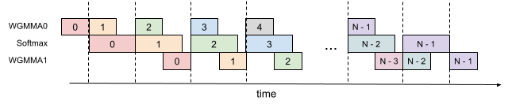

3-stage 进一步尝试让第二个 WGMMA：

$$
P_jV_j
$$

也与 softmax / 其他 GEMM 更深重叠。

理论上 Tensor Core idle gap 可以继续减少。

但：

- in-flight accumulator 更多；
- registers 更紧；
- scheduling 更复杂；
- tile size 选择受到限制。

因此：

$$
\boxed{
\text{more asynchronous stages}
\not\Rightarrow
\text{monotonic speedup}
}
$$

最终仍要 profiling。

---

# 十七、把 FA3 的前半篇压成一张执行图

现在可以把一个 tile pipeline 理解成：

~~~text
HBM
 ↓
TMA producer
 ↓
circular SMEM buffer
 ↓
WGMMA consumer: QKᵀ
 ↘
  softmax on CUDA/SFU
 ↘
WGMMA consumer: PV
 ↓
output
~~~

但真正高性能的时序不是纵向一条链。

而是多个 tile 同时在不同阶段：

~~~text
tile j+1 : TMA load
tile j   : WGMMA QK
tile j-1 : softmax
tile j-2 : WGMMA PV
~~~

这就是 software pipeline 的核心：

$$
\boxed{
\text{不同 tile 占用不同 hardware engines}
}
$$

---

# 十八、FA3 的异步思想和 CPU pipeline 有什么相似？

概念上都在做：

$$
\text{latency hiding}.
$$

不是让某个 operation latency 消失。

而是：

> operation A 在等待自己的硬件结果时，让 operation B 使用另一个独立硬件单元推进。

GPU 上又多了一层：

- 大量 warps；
- Tensor Core；
- TMA；
- SFU；
- SMEM；
- barriers。

所以 kernel optimization 很大一部分是在构造：

$$
\boxed{\text{explicit producer-consumer dependency graph}}
$$

而不是单纯写一串 arithmetic expressions。

---

# 十九、到这里还只是 FP16/BF16，FA3 的第三条线是 FP8

Hopper 提供 FP8 Tensor Core。

理论上：

$$
\text{FP8 matmul throughput}
\approx
2\times
\text{FP16/BF16}.
$$

于是非常诱人：

> 把 Q/K/V 直接量化成 FP8，不就接近再快一倍？

问题是两个：

1. **layout**；
2. **numerical accuracy**。

FA3 必须同时解决。

---

# 二十、FP8 的第一个工程问题：WGMMA layout 约束更严格

设 GEMM：

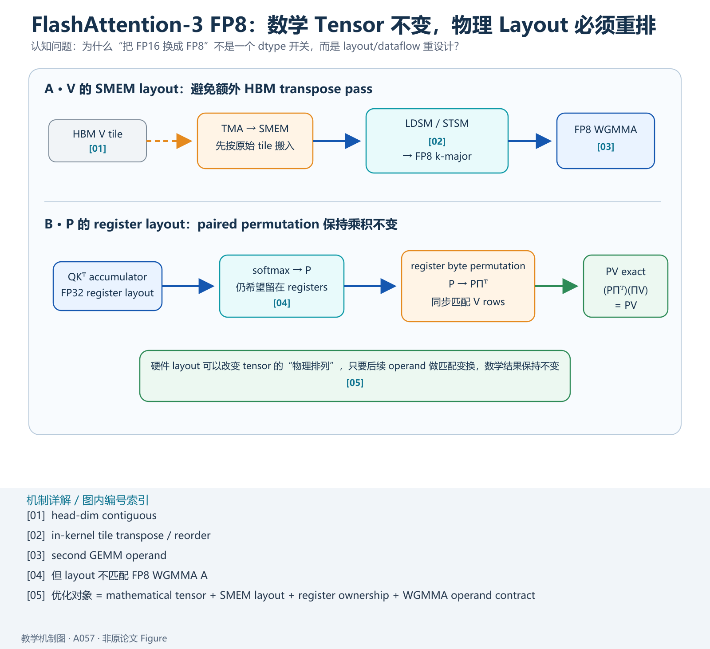

*教学解释图｜FP8 Layout Permutation。*

$$
A B^\top.
$$

矩阵可以有不同 memory layout。

论文用：

- mn-major；
- k-major。

来区分连续维度。

FP16 WGMMA 对 SMEM operand 的 layout 更灵活。

但 FP8 WGMMA：

$$
\boxed{\text{SMEM operand 需要 k-major}}
$$

这会直接影响 Attention 的第二个 GEMM。

---

# 二十一、为什么 $V$ layout 会出问题？

Attention：

$$
P V.
$$

Q/K/V 输入通常按 head dimension contiguous。

但为了让 FP8 WGMMA 的第二个 GEMM 满足 k-major 约束，$V$ tile 需要不同的局部 layout。

一种最简单方案：

$$
\text{先在 HBM 把 V transpose}
$$

但这会增加额外 memory pass。

对于 memory-bound inference 尤其浪费。

FA3 选择：

$$
\boxed{\text{in-kernel transpose}}
$$

---

# 二十二、LDSM / STSM：在 SMEM↔RMEM 路径里重排 $V$

FA3 利用 **ldmatrix** 与 **stmatrix**。

让一个 warp 协同完成 shared-memory tile 的 load/store 与 layout transform。

这样：

$$
V_j
$$

从 HBM 经 TMA 进入 SMEM 后，可以在 kernel 内完成适配 FP8 WGMMA 的 tile transpose。

更重要的是：

> 从第二轮开始，这个 transpose 还能躲到前一个 tile 的 WGMMA 后面。

于是 layout conversion 本身也进入 pipeline。

---

# 二十三、FP8 第二个 layout 难题：第一个 GEMM 的 accumulator 不能原样喂给第二个 GEMM

第一个 GEMM：

$$
S=QK^\top.
$$

softmax 后：

$$
P.
$$

第二个 GEMM：

$$
O=PV.
$$

理想上希望：

$$
P
$$

一直留在 registers，不写回 SMEM/HBM。

但 FP8 WGMMA 有一个麻烦：

> 第一个 WGMMA 的 FP32 accumulator register layout，与第二个 FP8 WGMMA 对 operand A 的 register layout 不一致。

于是不能简单把 accumulator 原样作为下一条 WGMMA operand。

---

# 二十四、FA3 的解法：register byte permutation + matching V permutation

FA3 对 $P$ 在 registers 中做 byte-level rearrangement。

这会让逻辑上的 $P$ columns 顺序发生 permutation。

如果只变 $P$：

$$
PV
$$

当然会错。

但如果同步对 $V$ rows 做对应 permutation：

设 permutation matrix：

$$
\Pi.
$$

那么：

$$
(P\Pi^\top)(\Pi V)
=
P\Pi^\top\Pi V
=
PV.
$$

因为：

$$
\Pi^\top\Pi=I.
$$

所以：

$$
\boxed{
\text{paired layout permutation}
\Rightarrow
\text{matrix product invariant}
}
$$

这是一个非常漂亮的例子：

> 为满足硬件 layout contract，可以改变中间 tensor 的物理排列，只要后续 operand 做匹配变换，数学结果完全不变。

---

# 二十五、这已经不是“数学公式 → kernel”这么简单

到了 FA3，真正的设计对象包含：

- mathematical tensor；
- logical tile；
- SMEM layout；
- register ownership；
- WGMMA operand contract；
- producer/consumer role；
- async barrier；
- instruction pipeline。

所以性能工程真正优化的是：

$$
\boxed{
\text{数学依赖图}
+
\text{memory layout}
+
\text{execution-unit schedule}
}
$$

而不仅仅是 FLOPs。

# 二十六、FP8 的第二个问题：动态范围和 outlier

FP8 并不只是：

$$
\text{FP16 bytes}/2.
$$

FA3 使用的 FP8 E4M3：

- exponent：4 bits；
- mantissa：3 bits。

相较 FP16 / BF16：

$$
\boxed{\text{表示精度显著下降}}
$$

尤其是 LLM activation 中常见的 outlier，会让简单量化变得很困难。

---

## 26.1 为什么 per-tensor scaling 容易被 outlier 拖累？

假设一个 tensor 绝大多数值都在：

$$
[-2,2]
$$

但偶尔有一个：

$$
40.
$$

如果整块 tensor 只共享一个 scale：

$$
s
$$

为了让 40 不 overflow，scale 必须覆盖更大的动态范围。

于是原本大量：

$$
0.1,\ 0.4,\ 1.2
$$

这样的正常值，被压缩到更少的 FP8 representable levels。

quantization step 变粗。

所以：

$$
\boxed{
\text{少数极端值}
\rightarrow
\text{决定全 tensor scale}
\rightarrow
\text{多数普通值精度变差}
}
$$

---

# 二十七、Block Quantization：先把 scale 的作用域缩小

FA3 的第一种办法非常自然：

> FlashAttention 本来就在按 tile 计算，那么量化 scale 也按 tile 管理。

对于：

$$
Q,\ K,\ V
$$

分别按：

$$
B_r\times d
$$

或：

$$
B_c\times d
$$

的 block 量化。

每个 block 都有自己的 scale。

---

## 27.1 为什么这和 FlashAttention 特别匹配？

FA3 本来就是：

~~~text
load Q_i
load K_j, V_j
compute tile
move to next tile
~~~

所以 block scaling 不需要重新发明数据分块。

scale 的粒度直接跟执行 tile 对齐。

在 score 计算：

$$
S_{ij}
=
Q_iK_j^\top
$$

时，可以把：

$$
s_{Q_i}s_{K_j}
$$

融合到对应 tile 的 scaling 里。

因此：

$$
\boxed{
\text{algorithmic tile}
=
\text{quantization tile}
}
$$

这是一个很好的硬件/数值协同设计。

---

## 27.2 Block quantization 解决什么？

它把：

$$
\text{global dynamic range}
$$

变成：

$$
\text{local dynamic range}.
$$

如果 outlier 只出现在某几个 blocks：

- 那几个 block scale 变大；
- 其他 blocks 不必受影响。

于是大部分数据的 quantization resolution 更高。

---

# 二十八、但 block quantization 仍然不能彻底解决“一个 block 内有巨大 outlier”

假设某个 block：

$$
Q_i
$$

内部仍有：

$$
[0.3,0.5,0.1,45.0,\dots].
$$

即使这个 block 独享 scale：

$$
45
$$

仍然会主导该 block。

所以需要第二种方法：

$$
\boxed{\text{incoherent processing}}
$$

---

# 二十九、Incoherent Processing：先把 outlier “摊开”

FA3 对：

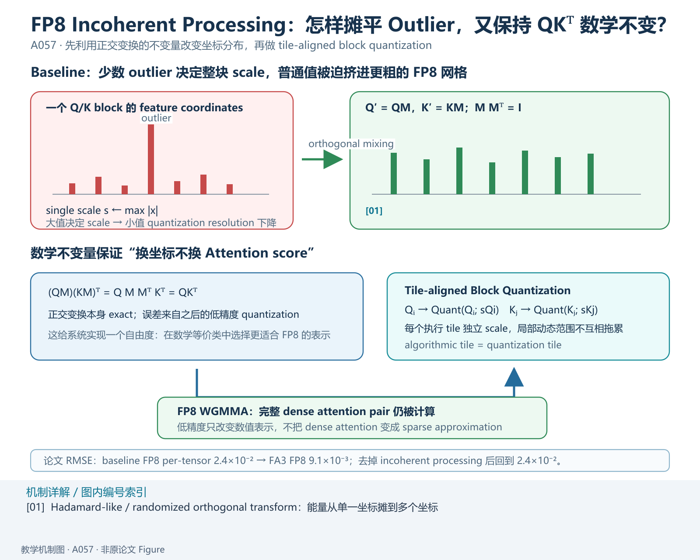

*教学解释图｜FP8 Incoherent Processing。*

$$
Q,\ K
$$

同时右乘同一个随机正交矩阵：

$$
M.
$$

得到：

$$
Q'=QM,
\qquad
K'=KM.
$$

要求：

$$
MM^\top=I.
$$

---

## 29.1 为什么 Attention score 完全不变？

原 score：

$$
QK^\top.
$$

变换后：

$$
Q'K'^\top
=
(QM)(KM)^\top.
$$

展开：

$$
=
QM M^\top K^\top.
$$

因为：

$$
MM^\top=I,
$$

所以：

$$
\boxed{
Q'K'^\top
=
QK^\top
}
$$

也就是说：

> **正交变换本身完全不改变 Attention score。**

它不是 approximation。

真正引入误差的是后面的：

$$
\text{FP8 quantization}.
$$

---

# 三十、为什么正交混合能减轻 outlier？

假设原向量：

$$
x=
[0.2,0.1,40,0.4,\dots].
$$

第三个坐标非常极端。

乘一个“充分混合”的正交矩阵：

$$
x'=xM
$$

后，每个新坐标近似是原来多个 coordinates 的线性组合。

于是原本集中在一个 feature 上的巨大能量被扩散：

~~~text
原始：
[ 0.2,  0.1, 40.0, 0.4, ...]

变换：
[ 5.3, -4.8, 6.1, 3.9, ...]
~~~

这里只是教学示意，不是论文具体数值。

关键是：

$$
\boxed{
\max_i |x'_i|
$$

通常比原始集中 outlier 的 peak 更平滑。

因此 quantization scale 不再被单个 coordinate 极端主导。

---

# 三十一、为什么叫 incoherent？

这里的 “coherent” 可以直观理解为：

> 能量高度集中在某个固定坐标方向。

例如：

$$
x\approx 40e_3.
$$

随机正交 mixing 后：

$$
xM
$$

不再和某个 canonical basis coordinate 强烈对齐。

能量变得更“incoherent”。

这与随机线性代数里用 randomized Hadamard transform 降低 coherence 的思想同源。

---

# 三十二、为什么不用真正 dense random orthogonal matrix？

如果直接乘：

$$
M\in\mathbb R^{d\times d},
$$

成本：

$$
O(d^2).
$$

这会把量化省下来的收益吃掉。

FA3 使用随机符号矩阵与 Hadamard transform 的组合。

Fast Hadamard Transform：

$$
\boxed{
O(d\log d)
}
$$

而不是：

$$
O(d^2).
$$

而且可以与前面的 RoPE 等 bandwidth-bound operation 融合。

---

# 三十三、教学图：为什么变换后 score 不变、量化却更容易？

这里要区分两个层次：

## 数学层

$$
(QM)(KM)^\top=QK^\top.
$$

exact。

## 数值表示层

变换后的：

$$
QM,\ KM
$$

coordinate distribution 更均匀。

所以 FP8：

$$
\operatorname{Quant}(QM),
\quad
\operatorname{Quant}(KM)
$$

产生的误差更小。

---

# 三十四、为什么不对 $V$ 做同样的正交变换？

Attention score 的不变性来自：

$$
QMM^\top K^\top.
$$

Q/K 成对出现，正交矩阵可以彼此抵消。

但输出：

$$
PV
$$

里 $V$ 没有一个自然配对的：

$$
M^\top
$$

让变换自动抵消。

因此 incoherent processing 主要用于：

$$
Q,\ K.
$$

V 仍可以做 block quantization，但不是通过同样的 Q/K orthogonal invariance。

---

# 三十五、Block Quantization 与 Incoherent Processing 不是同一件事

可以把它们区分成：

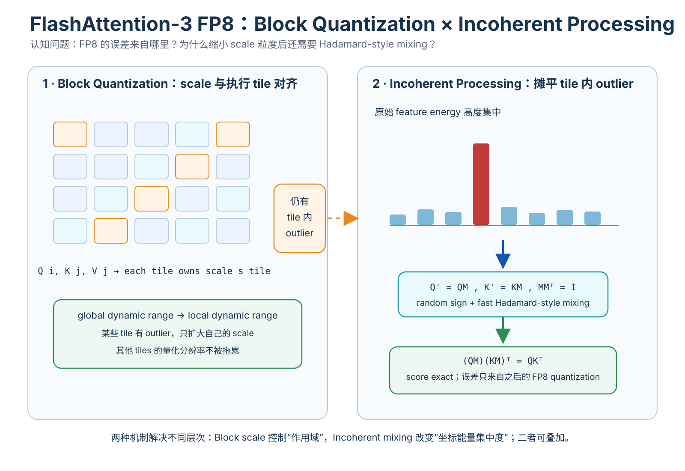

*教学解释图｜FP8 Quantization Incoherent。*

## Block quantization

解决：

$$
\boxed{\text{scale 粒度太粗}}
$$

让不同 tile 各自有 scale。

## Incoherent processing

解决：

$$
\boxed{\text{单个 tile 内 feature outlier 太集中}}
$$

先把能量摊平，再量化。

它们是互补关系。

---

# 三十六、论文 numerical error 实验到底怎么设计？

为了模拟 LLM activation outlier，论文构造输入：

$$
\mathcal N(0,1)
+
\mathcal N(0,100)\cdot
\operatorname{Bernoulli}(0.001).
$$

如果把：

$$
\mathcal N(0,100)
$$

中的第二参数理解为 variance，那么标准差是：

$$
10.
$$

论文正文也描述为：

> 0.1% entries 额外叠加一个标准差 10 的 outlier term。

然后把不同实现与 FP64 reference 比较 RMSE。

---

# 三十七、FP16：FA2 与 FA3 数值精度没有退化

论文结果：

| Method | RMSE |
| --- | ---: |
| Baseline FP16 | $3.2\times10^{-4}$ |
| FA2 FP16 | $1.9\times10^{-4}$ |
| FA3 FP16 | $1.9\times10^{-4}$ |

FA2/FA3 反而优于 standard FP16 baseline。

一个原因是它们在 online softmax 等中间步骤保留 FP32 accumulator / rescaling。

所以：

$$
\boxed{
\text{更快}
\not\Rightarrow
\text{必须更不准确}
}
$$

---

# 三十八、FP8：2.6× numerical error improvement 是怎么来的？

论文：

| Method | RMSE |
| --- | ---: |
| Baseline FP8 per-tensor scale | $2.4\times10^{-2}$ |
| FA3 FP8 | $9.1\times10^{-3}$ |
| No block quantization | $9.3\times10^{-3}$ |
| No incoherent processing | $2.4\times10^{-2}$ |

于是：

$$
\frac{2.4\times10^{-2}}
{9.1\times10^{-3}}
\approx2.64.
$$

所以论文说约：

$$
\boxed{2.6\times}
$$

更低 RMSE。

---

# 三十九、这个 ablation 有一个非常值得注意的结论

去掉 block quantization：

$$
9.1\times10^{-3}
\rightarrow
9.3\times10^{-3}.
$$

变化不大。

但去掉 incoherent processing：

$$
9.1\times10^{-3}
\rightarrow
2.4\times10^{-2}.
$$

几乎回到 baseline。

在这组 outlier-heavy 实验里：

$$
\boxed{
\text{incoherent processing 是主要 accuracy contributor}
}
$$

block quantization 仍有合理性，但论文这组 ablation 表明：

> 对强 outlier distribution，仅缩小 scale scope 并不足以解决 feature coherence。

这是比“两个技巧一起提升 2.6×”更细的读法。

---

# 四十、现在回到性能：FA3 到底快多少？

论文在：

$$
\text{H100 80GB SXM5}
$$

上 benchmark。

设置：

- sequence length：
  :::{math}
  512,1K,\dots,16K
  :::
- total tokens 固定约：
  :::{math}
  16K
  :::
- hidden size：
  :::{math}
  2048
  :::
- head dim：
  :::{math}
  64,\ 128,\ 256.
  :::

---

# 四十一、forward FLOPs 怎么算？

单 head：

$$
QK^\top
$$

约：

$$
2N^2d
$$

FLOPs。

第二个 GEMM：

$$
PV
$$

也约：

$$
2N^2d.
$$

所以多头 forward：

$$
\boxed{
4N^2dH
}
$$

其中 $H$ 是 heads。

causal attention 只计算下三角近似一半 entries：

$$
\boxed{
2N^2dH
}
$$

作为 effective FLOPs 计数。

---

# 四十二、backward 为什么仍用 2.5× forward FLOPs？

和 FA2 一样。

forward 两个主要 matmuls。

backward 需要：

- $dV$；
- $dP$；
- $dQ$；
- $dK$；
- recompute $QK^\top$。

粗略：

$$
5
$$

个大 matmul，相对 forward 的：

$$
2
$$

个。

所以：

$$
\boxed{
\text{backward FLOPs}
\approx
2.5\times
\text{forward FLOPs}
}
$$

---

# 四十三、FP16 Forward：最高约 740 TFLOPs/s

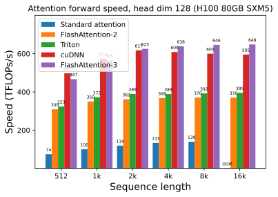

论文报告：

$$
\boxed{
1.5\sim2.0\times
}
$$

FA2 forward speedup。

峰值：

$$
\boxed{
\approx740\text{ TFLOPs/s}
}
$$

约为 H100 理论 FP16 Tensor Core peak 的：

$$
\boxed{75\%}
$$

左右。

这里仍然要注意：

> “75% peak”是以论文选定的 effective attention FLOPs 除以 runtime，再和理论 matmul throughput 比较。

它不是说所有 SM 每个 cycle 都有 75% transistor 在工作。

---

# 四十四、为什么 Attention 永远很难和纯 GEMM 一样接近 peak？

因为 Attention 除了 GEMM 还有：

- softmax；
- reductions；
- rescaling；
- causal masking；
- address / barrier；
- shared-memory management；
- layout conversion。

纯 GEMM 的 computation pattern 更规则。

所以能把 fused attention 推到：

$$
\sim75\%
$$

的 matmul theoretical peak，本身已经说明异步 overlap 非常有效。

---

# 四十五、Backward：1.5–1.75× FA2

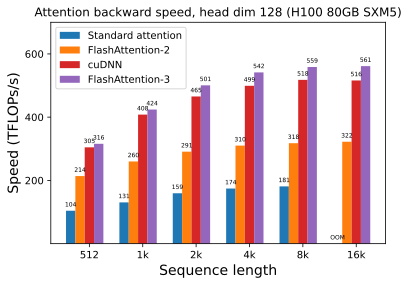

论文 backward：

$$
\boxed{
1.5\sim1.75\times
}
$$

FA2。

Backward 比 forward 更难：

- 更多 matmuls；
- 更多 gradients；
- 更多 reductions；
- more complicated ownership；
- recomputation。

因此 forward 的 pipeline 逻辑不能简单原样复制。

---

# 四十六、FP8：接近 1.2 PFLOPs/s

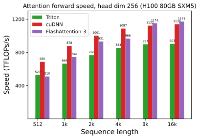

FA3 FP8 forward：

$$
\boxed{
\approx1.2\text{ PFLOPs/s}
}
$$

也就是：

$$
1200\text{ TFLOPs/s}
$$

量级。

FP8 并不是单纯把 FP16 kernel dtype 改一下。

它额外需要：

- block scaling；
- V layout transform；
- register permutation；
- incoherent Q/K transform；
- 更谨慎的 numerical design。

所以：

$$
\boxed{
\text{low precision throughput}
\neq
\text{free speedup}
}
$$

---

# 四十七、最有价值的性能证据：Ablation

论文固定：

$$
\{B,N,H,d\}
=
\{4,8448,16,128\}.
$$

比较：

| Configuration | Time | Throughput |
| --- | ---: | ---: |
| Full FA3 | 3.538 ms | 661 TFLOPs/s |
| Warp specialization，no GEMM-softmax pipeline | 4.021 ms | 582 TFLOPs/s |
| GEMM-softmax pipeline，no warp specialization | 4.105 ms | 570 TFLOPs/s |

---

# 四十八、怎么读这个 ablation？

Full：

$$
661.
$$

没有 GEMM-softmax overlap：

$$
582.
$$

没有 warp specialization：

$$
570.
$$

说明两条设计都不是装饰。

## Warp specialization 提供

- TMA producer / WGMMA consumer 分工；
- register redistribution；
- better load-compute overlap；
- cleaner instruction scheduling。

## GEMM-softmax pipeline 提供

- Tensor Core 与 CUDA/SFU concurrency；
- 减少 softmax 暴露在 critical path 的时间。

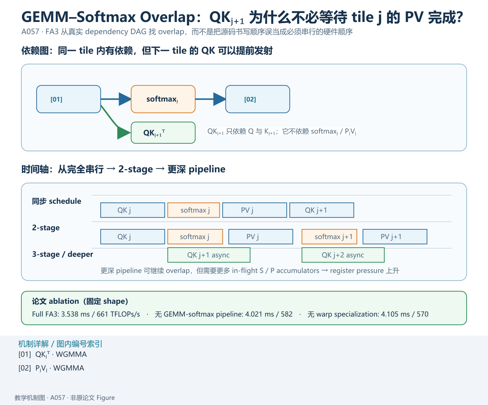

*教学解释图｜GEMM Softmax Overlap。*

因此：

$$
\boxed{
\text{FA3 speedup}
=
\text{data-movement pipeline}
+
\text{compute-unit pipeline}
}
$$

---

# 四十九、为什么两个单独技巧的收益不能直接相加？

因为 performance optimization 通常不是线性可加。

设：

$$
T
=
T_{\mathrm{load}}
+
T_{\mathrm{gemm}}
+
T_{\mathrm{softmax}}.
$$

warp specialization 已经隐藏一部分：

$$
T_{\mathrm{load}}.
$$

GEMM-softmax pipeline 又隐藏一部分：

$$
T_{\mathrm{softmax}}.
$$

两者同时启用时：

- overlap 区间可能交叠；
- critical path 会重新变化；
- occupancy / register pressure 也可能变化。

所以：

$$
\boxed{
\Delta T_1+\Delta T_2
\neq
\Delta T_{1+2}
}
$$

必须看最终 schedule。

---

# 五十、FA3 为什么能在长 sequence 上超过 cuDNN 某些实现？

长 sequence 时：

- tile 数足够多；
- pipeline 有足够 steady-state work；
- prologue/epilogue overhead 被摊薄；
- persistent load balancing 更容易发挥；
- asynchronous stages 更容易保持 full。

所以：

$$
N\uparrow
$$

往往让 pipeline 更容易进入 steady state。

这和小 kernel 中启动/填充成本占比高是同一类现象。

---

# 五十一、为什么 FP8 在短序列 / causal 某些 setting 下未必最好？

论文明确给出一个实现边界：

FP16 FA3 有：

- persistent kernel；
- load balancing。

而论文中的 FP8 implementation 当时没有完整的 persistent design。

因此在：

- small sequence；
- causal masking；
- workload imbalance 更明显；

时，FP8 不一定领先 vendor cuDNN。

这提醒我们：

$$
\boxed{
\text{更高 arithmetic peak}
\not\Rightarrow
\text{所有 shape 都更快}
}
$$

---

# 五十二、什么是 Persistent Kernel？

普通 kernel：

- 一个 CTA 完成一个固定 tile；
- 结束；
- scheduler 再发新的 CTA。

persistent kernel：

> CTA 长时间驻留在 SM 上，不断从 work queue 领取下一 tile。

好处可能包括：

- 减少 launch / scheduling overhead；
- dynamic load balancing；
- causal / ragged workload 更灵活。

但 persistent kernel 本身也会让调度逻辑更复杂。

FA3 discussion 明确把 FP8 persistent kernel 作为后续改进方向之一。

---

# 五十三、Causal Attention 为什么更容易产生 load imbalance？

causal mask：

$$
j>i
$$

的 upper-triangular blocks 不需要计算。

不同 Q block 的有效 K/V blocks 数量不同。

靠近 sequence 开头的 query：

$$
\text{work 少}
$$

靠近结尾：

$$
\text{work 多}.
$$

所以 CTA workload 不均匀。

persistent work scheduler 可以把 tile work 更动态地分配给 SM。

---

# 五十四、FA3 还是 Exact Attention 吗？

是。

FP16/BF16 FA3 仍计算：

$$
O
=
\operatorname{softmax}(QK^\top)V.
$$

它改变的是：

- tile schedule；
- physical layout；
- asynchronous execution；
- memory movement。

没有 sparse approximation。

因此：

$$
\boxed{\text{FP16/BF16 FA3 = exact dense attention}}
$$

---

# 五十五、FP8 该怎么理解“exact”？

这里必须更精确。

算法结构仍然执行完整 dense attention。

没有删 QK pair。

但输入 / GEMM operand 被量化为 FP8：

$$
Q\rightarrow \hat Q,
\qquad
K\rightarrow \hat K,
\qquad
V\rightarrow \hat V.
$$

所以数值结果相对 FP16/FP64 reference 存在 quantization error。

因此：

$$
\boxed{
\text{dense exact attention structure}
+
\text{low-precision numerical approximation}
}
$$

不要把“没有稀疏近似”和“数值逐 bit exact”混在一起。

---

# 五十六、Incoherent Processing 为什么特别漂亮？

因为它展示了系统算法里一个非常强的设计模式：

> **先找数学不变量，再利用这个自由度满足硬件需求。**

这里的不变量：

$$
QK^\top
$$

在同时右乘正交矩阵时不变。

于是可以自由改变：

$$
Q,K
$$

的 coordinate representation。

目的不是改变模型 semantics，而是让：

$$
\text{quantization geometry}
$$

更友好。

类似思想在系统中很多：

- paired permutation；
- orthogonal transform；
- layout transform；
- basis change；
- equivalent graph rewrite。

它们的共同模式：

$$
\boxed{
\text{数学等价类中寻找硬件更友好的表示}
}
$$

---

# 五十七、FA1 → FA2 → FA3：三代分别优化哪一层？

## FlashAttention-1

问题：

$$
\text{HBM IO}
$$

核心：

$$
\boxed{\text{IO-aware algorithm}}
$$

工具：

- tiling；
- online softmax；
- recomputation。

---

## FlashAttention-2

问题：

$$
\text{GPU occupancy + warp communication}
$$

核心：

$$
\boxed{\text{work partition}}
$$

工具：

- sequence-level thread-block parallelism；
- split-Q；
- less non-matmul overhead。

---

## FlashAttention-3

问题：

$$
\text{heterogeneous execution units not overlapped}
$$

核心：

$$
\boxed{\text{asynchronous pipeline}}
$$

工具：

- TMA；
- WGMMA；
- warp specialization；
- circular SMEM buffer；
- ping-pong；
- 2/3-stage pipeline；
- FP8 layout + numerical transform。

---

# 五十八、这三代其实是一套性能分析方法

面对任何 kernel，可以依次问：

## 第一层：Data Movement

$$
\boxed{\text{搬了多少 bytes？}}
$$

是否有不必要 HBM round-trip？

## 第二层：Work Decomposition

$$
\boxed{\text{工作怎么切给 SM / warp？}}
$$

是否有 idle hardware / unnecessary reduction？

## 第三层：Execution Overlap

$$
\boxed{\text{不同硬件单元能否同时工作？}}
$$

memory engine、matrix engine、scalar/SFU 是否被串行 schedule？

## 第四层：Numerical Representation

$$
\boxed{\text{能否用更低 precision？}}
$$

如果可以，layout 与 accuracy 怎么处理？

FA1/2/3 恰好逐层走完。

---

# 五十九、为什么“异步”比“更多线程”更高级一层？

增加线程主要是：

$$
\text{spatial parallelism}.
$$

让更多 worker 同时做相似工作。

FA3 强调：

$$
\text{temporal pipeline parallelism}.
$$

同一个 CTA 内：

- producer 在搬下一 tile；
- Tensor Core 在算当前 tile；
- CUDA/SFU 在处理上一 tile。

所以是：

$$
\boxed{
\text{空间并行}
+
\text{时间流水}
}
$$

共同提高 utilization。

---

# 六十、为什么这对 NPU / 专用 accelerator 同样重要？

很多 NPU 也有类似结构：

- DMA engine；
- matrix / cube engine；
- vector engine；
- local SRAM；
- synchronization primitives。

如果程序写成：

~~~text
DMA load
wait
matrix compute
wait
vector activation
wait
DMA store
~~~

即使每个单元都很快，总 pipeline 仍串行。

更好的调度：

~~~text
DMA(tile j+1)
∥
matrix(tile j)
∥
vector(tile j-1)
∥
store(tile j-2)
~~~

这和 FA3 本质相同。

---

# 六十一、对机器人边缘部署最值得迁移的不是 WGMMA 指令名

在 RK3588 NPU、Jetson、其他 accelerator 上未必有：

- TMA；
- WGMMA。

但可以继续问同样的问题：

1. 有没有独立 DMA？
2. matrix engine 与 vector engine 能否并行？
3. local SRAM 能否做 multi-buffer？
4. producer / consumer 是否能用 event/barrier 解耦？
5. quantization scale 应该按 tensor、channel 还是 tile？
6. layout conversion 能不能融合进搬运阶段？
7. 哪些数学等价变换能改善低精度数值分布？

这才是 FA3 可迁移的知识。

---

# 六十二、一个很有用的“流水线账本”

设计一个 accelerator kernel 时，可以画：

| Stage | Engine | Data | Wait on | Produces |
| --- | --- | --- | --- | --- |
| Load | DMA/TMA | next tile | free buffer | SMEM tile |
| GEMM1 | Tensor Core | Q/K | tile ready | score accumulator |
| Softmax | CUDA/SFU | score | GEMM1 ready | probability |
| GEMM2 | Tensor Core | P/V | softmax + V ready | output accumulator |
| Store | DMA/global store | output | final ready | HBM result |

然后逐项问：

> 相邻 stage 真的有 dependency 吗？

如果没有，就应该尝试 overlap。

---

# 六十三、为什么 barrier 应该细粒度，而不是全 CTA sync？

如果每次都：

$$
\operatorname{sync\ all\ threads}
$$

那么 producer / consumer specialization 的价值会被抵消。

异步 pipeline 需要的是：

- 某个 stage ready；
- 某个 stage consumed；
- 某个 WGMMA result ready。

而不是：

> 所有线程在同一个程序点集合。

所以现代 GPU kernel 越来越强调：

$$
\boxed{
\text{event/barrier-based dependency synchronization}
}
$$

而不是全局 lock-step。

---

# 六十四、FA3 和 4D Parallelism 有一个非常直接的共同抽象

C001 里我们写：

$$
\text{logical decomposition}
\rightarrow
\text{communication pattern}
\rightarrow
\text{physical topology}.
$$

FA3 可以写成：

$$
\text{logical tile decomposition}
\rightarrow
\text{data dependency}
\rightarrow
\text{hardware execution-unit mapping}.
$$

一个是集群级。

一个是 SM / CTA 级。

但都在做：

$$
\boxed{
\text{把算法 dependency graph 映射到硬件 topology}
}
$$

---

# 六十五、FA3 的边界

论文自己的边界非常值得保留。

## 1. 主要针对 Hopper

核心能力：

- TMA；
- WGMMA；
- warpgroup；
- Hopper register control。

不能简单把同一个 kernel 原样搬到 Ampere。

## 2. FP8 仍有数值风险

虽然论文 synthetic outlier benchmark 显示明显改善，但：

> 大规模完整训练中的 long-term optimization / convergence effect 仍需要单独验证。

## 3. FP8 implementation 当时并非所有 shape 都最优

特别是：

- small sequence；
- causal；
- load imbalance。

vendor implementation 某些 setting 仍可能更快。

## 4. Inference 优化不是论文全部覆盖范围

论文更聚焦 attention primitive 本身。

serving 中还要考虑：

- KV cache；
- decode；
- paged memory；
- batching；
- scheduler。

---

# 六十六、不要把 FA3 的 1.2 PFLOPs/s 直接等价成模型 end-to-end throughput

FA3 benchmark 测的是：

$$
\boxed{\text{Attention kernel}}
$$

完整模型还有：

- QKV projection；
- output projection；
- MLP；
- RMSNorm；
- communication；
- optimizer / training runtime；
- KV management；
- serving scheduler。

所以：

$$
2\times\text{ attention speed}
$$

绝不意味着：

$$
2\times\text{ model speed}.
$$

仍然受 Amdahl's Law 限制。

---

# 六十七、为什么 FA3 对“未来硬件”特别有启发？

硬件趋势一直是 specialization：

~~~text
CPU:
通用 cores

GPU:
CUDA cores + Tensor Cores

Hopper:
CUDA/SFU + Tensor Cores + TMA + async WGMMA

更多 accelerator:
DMA + Matrix Engine + Vector Engine + ...
~~~

硬件越 heterogeneous：

$$
\boxed{
\text{算法必须越显式地表达 pipeline 与 ownership}
}
$$

否则新增 specialized unit 只是“存在”，并不会自动进入 critical path。

---

# 六十八、最后把整篇文章压成一条主线

FA2 在 H100 上的问题不是：

> Tensor Core 不够快。

恰恰相反：

$$
\boxed{\text{Tensor Core 太快了}}
$$

于是：

- memory movement；
- softmax；
- instruction issue；
- layout transform；

开始暴露。

Hopper 又恰好提供：

- TMA；
- async WGMMA；
- warpgroup specialization；
- FP8。

FA3 所做的是把这些能力组织成：

$$
\boxed{
\text{producer-consumer pipeline}
+
\text{GEMM-softmax overlap}
+
\text{low-precision layout/numerical co-design}
}
$$

---

# 六十九、最值得记住的三个第一性原则

## 原则一：Dependency 才决定必须等待什么

不要把 source-code 顺序误认为真实 mathematical dependency。

如果：

$$
A_{j+1}
$$

不依赖：

$$
B_j,
$$

就应该问：

> 能不能把它们 overlap？

---

## 原则二：不同硬件单元应该同时忙

如果：

- DMA idle；
- Tensor Core idle；
- SFU idle；

轮流发生，

说明 kernel 还没有真正利用 heterogeneous accelerator。

目标更接近：

$$
\boxed{
\max
\left(
\text{simultaneous useful hardware activity}
\right)
}
$$

---

## 原则三：低精度优化必须同时设计 layout 与 numerics

FP8 不是：

$$
\text{dtype=fp8}
$$

这么简单。

需要同时处理：

$$
\boxed{
\text{hardware layout contract}
+
\text{scale granularity}
+
\text{outlier geometry}
}
$$

FA3 的 block quantization、paired permutation 与 incoherent processing 都是在做这件事。

---

# 七十、三代 FlashAttention 的最终知识图

~~~text
Standard Attention
│
│  S / P 写回 HBM
▼
FlashAttention-1
│  tiling + online softmax + recompute
│
│  IO bottleneck ↓
│  occupancy / warp communication 暴露
▼
FlashAttention-2
│  sequence-level block parallelism
│  split-K → split-Q
│
│  work partition 改善
│  Hopper heterogeneous engines 未充分 overlap
▼
FlashAttention-3
   TMA producer
   WGMMA consumer
   warp specialization
   ping-pong
   2/3-stage GEMM-softmax pipeline
   FP8 layout transform
   block quantization
   incoherent processing
~~~

这条主线真正建立的是：

$$
\boxed{
\text{IO}
\rightarrow
\text{Parallelism}
\rightarrow
\text{Asynchrony}
\rightarrow
\text{Low Precision}
}
$$

也就是现代 accelerator kernel 优化最核心的几个层次。

---

# 参考原始资料

- Shah et al., **FlashAttention-3: Fast and Accurate Attention with Asynchrony and Low-precision**, arXiv:2407.08608, NeurIPS 2024.
- Dao et al., **FlashAttention: Fast and Memory-Efficient Exact Attention with IO-Awareness**, arXiv:2205.14135.
- Dao, **FlashAttention-2: Faster Attention with Better Parallelism and Work Partitioning**, arXiv:2307.08691.
- Tri Dao, **FlashAttention-3: Fast and Accurate Attention with Asynchrony and Low-precision**, official technical blog, 2024.
- NVIDIA, **CUDA / PTX ISA documentation for Hopper TMA, WGMMA and register control**.

