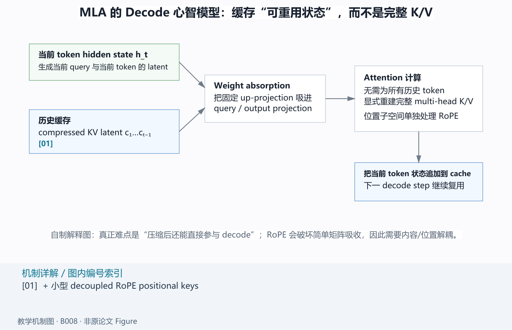
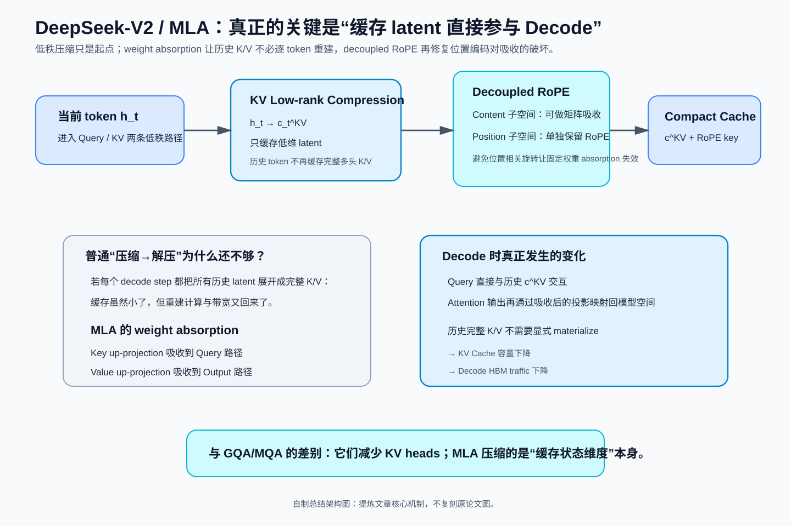
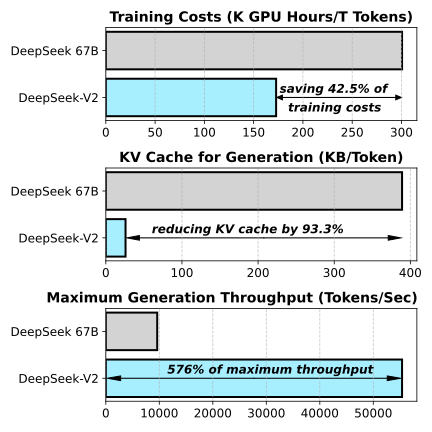
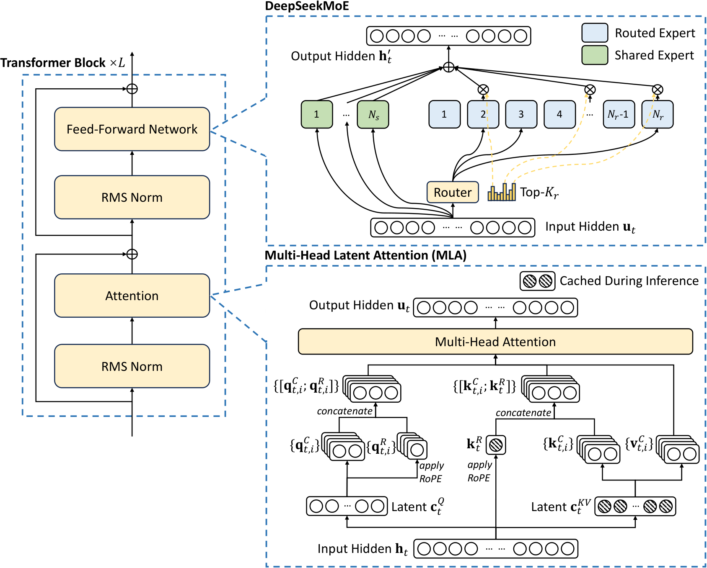
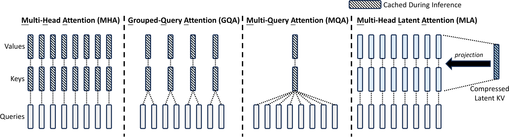

# DeepSeek-V2：MLA 真正的关键不是低秩，而是让低维缓存直接参与 Decode

> **论文**：DeepSeek-AI, [DeepSeek-V2: A Strong, Economical, and Efficient Mixture-of-Experts Language Model](https://arxiv.org/abs/2405.04434)，本文以 arXiv v5（2024-06-19）为基线。  
> **类型**：B · 完整模型技术报告；同时是 MLA 第一次被完整提出和验证的模型论文。  
> **一句话定位**：这篇文章最值得下钻的是 **MLA 怎样把“历史多头 K/V”改写成可直接参与 Decode 的低维缓存状态，并用 weight absorption + decoupled RoPE 避免每一步重新展开完整 K/V**。  
> **原图来源**：[figure_manifests/B008.json](../../../figure_manifests/B008.json)。  
> **为什么现在读它**：DeepSeek-V3 已经告诉我们结果——只缓存压缩 latent 与一小块位置状态，就能把 KV Cache 大幅降低。但如果不知道矩阵吸收为什么成立、RoPE 为什么破坏吸收、decoupled RoPE 又怎样修复它，MLA 仍然只是一个背诵名词。

## 阅读导航：这是 V3 的 Attention 技术下钻页

**从哪里来**

- [DeepSeek-V3：先看 MLA 在完整 671B 系统里为什么被需要](B009-deepseek-v3.md)
- [MQA](../../A/04-efficient-attention/A019-mqa.md) / [GQA](../../A/04-efficient-attention/A020-gqa.md) —— 如果“共享 KV heads 为什么能减 cache”还没有形成基线，先回查这两页。
- [RoPE](../../A/03-transformer/A014-roformer-rope.md) —— 如果 §7–§8 的位置相关旋转矩阵为什么破坏 absorption 看不懂，再回查。

**读完往哪里去**

- [DeepSeekMoE：V2/V3 的 FFN 分支为什么要做细粒度专家与 shared experts](../../A/05-moe/A034-deepseekmoe.md)
- [DeepSeek-R1：模型主线继续进入 reasoning post-training](B010-deepseek-r1.md)

**本文重点**

1. MHA / MQA / GQA 与 MLA 到底分别在压缩什么；
2. 为什么“低秩压缩 K/V”本身还不足以带来高效 Decode；
3. key / value up-projection 为什么可以吸收到 query / output 路径；
4. RoPE 为什么让固定矩阵 absorption 失效；
5. decoupled RoPE 为什么只需额外保留一小段 positional key；
6. 理论 cache reduction、论文报告的 93.3% reduction 与 5.76× throughput 为什么不能混成一个指标。

**如果只想解决一个问题**

> “为什么 MLA 不只是低秩压缩，而是真正减少 decode cache？”

直接阅读本文 §3–§10；其他 MoE、后训练内容可以先跳过。

*自制解释图，不是原论文 Figure。先抓住“缓存什么”这一件事：历史 token 缓存 compressed latent 和小型位置状态；weight absorption 让这些低维状态不必在每个 decode step 显式恢复成完整 multi-head K/V。*

DeepSeek-V2 最值得学习的一条线，不是“236B MoE 模型有多强”，而是作者怎样从一个非常具体的推理瓶颈出发，一步步把 Attention 的参数化重写掉。理解完这条线，再回到 [DeepSeek-V3](B009-deepseek-v3.md)，你会发现 V3 的 MLA 不再是一串陌生符号，而是一套为了 decode cache 设计出来的状态表示。

~~~text
MHA 的历史 K/V 太大
        ↓
MQA / GQA 通过共享 K/V 减缓存
        ↓
但共享越强，K/V 表示自由度越小
        ↓
把 K/V 联合压成低维 latent
        ↓
问题：Decode 时难道还要反复解压全部历史 K/V？
        ↓
固定线性投影可以吸收到 Q 与 O 中
        ↓
历史 K/V 不需要显式重建
        ↓
RoPE 插入位置相关矩阵后，吸收失效
        ↓
把内容与位置拆成两个子空间
        ↓
最终只缓存 latent + shared positional key
~~~

## 总结架构图

> **教学总结图**：以 MLA 为主线展示低秩 latent、weight absorption 与 decoupled RoPE 如何共同降低 Decode KV Cache 成本。

## 1. Figure 1 先告诉我们：V2 想把“训练贵”和“推理贵”拆开解决

*先看三行分别测什么：第一行是每训练 1T tokens 的 GPU hours；第二行是 generation KV Cache；第三行是最大 generation throughput。它们对应不同瓶颈，不能把三条收益都归因给同一个模块。*

DeepSeek-V2 的规模是：

$$
N_{\text{total}}=236\text{B},
\qquad
N_{\text{active}}=21\text{B/token}.
$$

相对 dense DeepSeek 67B，论文报告每 1T tokens 的训练 GPU hours 从：

$$
300.6K
\rightarrow
172.8K,
$$

约下降：

$$
42.5\%.
$$

部署侧又报告 KV Cache 减少约：

$$
93.3\%,
$$

单节点 8×H800 的最大 generation throughput 约为 DeepSeek 67B 的：

$$
5.76\times.
$$

这些数字不能合成一句“MLA 让 V2 便宜 42.5% 并快 5.76 倍”。

更准确的因果拆分是：

~~~text
FFN：
DeepSeekMoE
→ 少量 active experts
→ 降低每 token 计算
→ 训练更经济

Attention：
MLA
→ 缩小 KV Cache
→ 降低历史状态容量与读带宽

完整 Serving：
MLA + KV 量化 + FP8 权重 + kernel + 更大 batch
→ 最终吞吐
~~~

## 2. 先看完整模型：MLA 和 DeepSeekMoE 分别改了 Transformer 的哪一半

*左侧仍是 pre-norm Transformer block；右下展开 MLA；右上展开 DeepSeekMoE。斜线阴影对应 inference 时需要保留的状态。*

V2 主模型：

$$
L=60,
\qquad
d=5120.
$$

Attention：

$$
n_h=128,
\qquad
d_h=128.
$$

MLA：

$$
d_c=512,
\qquad
d_c'=1536,
\qquad
d_h^R=64.
$$

MoE 侧：

- 第 1 层 FFN 保持 dense；
- 其余 FFN 使用 DeepSeekMoE；
- 每层 2 个 shared experts；
- 160 个 routed experts；
- 每 token 激活 6 个 routed experts；
- 每 expert intermediate hidden size 为 1536。

所以一条 token 的主干仍然是：

~~~text
token
  ↓
Embedding
  ↓
60 × Transformer blocks
  ├── RMSNorm
  ├── MLA
  ├── Residual
  ├── RMSNorm
  └── Dense FFN / DeepSeekMoE
  ↓
LM Head
  ↓
Next-token logits
~~~

先记一句：

> **MLA 改 Attention 的状态表示；DeepSeekMoE 改 FFN 的参数激活方式。**

## 3. 从 MHA 开始：KV Cache 为什么会变成 Decode 瓶颈？

第 $t$ 个 token 的 hidden state：

$$
\mathbf h_t\in\mathbb R^d.
$$

普通 MHA：

$$
\mathbf q_t=W^Q\mathbf h_t,
\qquad
\mathbf k_t=W^K\mathbf h_t,
\qquad
\mathbf v_t=W^V\mathbf h_t.
$$

每个 head：

$$
\mathbf q_{t,i},
\mathbf k_{t,i},
\mathbf v_{t,i}
\in
\mathbb R^{d_h}.
$$

第 $i$ 个 head：

$$
\mathbf o_{t,i}
=
\sum_{j=1}^{t}
\operatorname{Softmax}_{j}
\left(
\frac{
\mathbf q_{t,i}^{\top}\mathbf k_{j,i}
}{
\sqrt{d_h}
}
\right)
\mathbf v_{j,i}.
$$

生成第 $t+1$ 个 token 时，过去的 query 已经没用了，但历史 K/V 还要被新 query 访问。

于是每层、每个历史 token 需要：

$$
2n_hd_h
$$

个 cache 元素，整个模型：

$$
\boxed{
N_{\text{MHA cache/token}}
=
2n_hd_hl
}.
$$

按 V2 的 head 配置：

$$
2\times128\times128
=
32768
$$

个元素/token/layer。

60 层则约：

$$
1{,}966{,}080
$$

个元素/token。

所以长上下文 Decode 的压力不只是显存容量，还包括每一步越来越大的：

> **HBM memory traffic。**

## 4. MQA/GQA 已经能减 KV，为什么还需要 MLA？

*看斜线阴影即可理解四者的压缩轴：MHA 缓存每个 head 的 K/V；GQA 缓存若干组；MQA 只缓存一组；MLA 缓存的是可以重建多头 K/V 的 compressed latent。*

MHA：

$$
N_{\text{MHA}}=2n_hd_hl.
$$

GQA：

$$
N_{\text{GQA}}=2n_gd_hl.
$$

MQA：

$$
N_{\text{MQA}}=2d_hl.
$$

MQA 的缓存很小，但代价也很直接：

> 所有 query heads 被迫访问同一套 K/V representation。

GQA 只是把这种共享减弱。

所以 MLA 真正提出的问题是：

> **能不能不直接减少最终 K/V 的多头表示自由度，而只压缩“缓存状态”？**

它的关键变化是：

> **缓存空间与最终 K/V 表示空间不再是同一个空间。**

## 5. MLA 第一步：K/V 可以很多，但缓存只存一个低维 latent

MLA 定义：

$$
\boxed{
\mathbf c_t^{KV}
=
W^{DKV}\mathbf h_t
}
$$

其中：

$$
\mathbf c_t^{KV}\in\mathbb R^{d_c}.
$$

V2：

$$
d_c=512.
$$

再由同一个 latent 重建 content key/value：

$$
\mathbf k_t^C
=
W^{UK}\mathbf c_t^{KV},
$$

$$
\mathbf v_t^C
=
W^{UV}\mathbf c_t^{KV}.
$$

完整多头 K/V 的单边维度是：

$$
n_hd_h
=
128\times128
=
16384.
$$

所以表面结构是：

~~~text
h_t [5120]
   ↓ W^DKV
c_t^KV [512]
   ├── W^UK → K content [16384]
   └── W^UV → V content [16384]
~~~

K 和 V 共享同一个 latent，因此不是分别压缩 K、V，而是：

> **joint KV compression。**

但现在必须立刻提出一个反问：

> Attention 最后仍然需要 K 与 V。Decode 时是不是还得把全部历史 latent 每一步都展开回完整 K/V？

如果需要，那么它只是：

~~~text
存储时压缩
→ 使用时全部解压
~~~

缓存虽然小了，历史重建计算却会很重。

所以 MLA 最重要的一步还没出现。

## 6. MLA 的灵魂：为什么历史 K/V 根本不需要显式重建？

### 6.1 Key up-projection 可以吸收到 Query 路径

历史 content key：

$$
k_j^C
=
W^{UK}c_j^{KV}.
$$

当前 content query 为 $q_t^C$。

score：

$$
(q_t^C)^\top k_j^C
=
(q_t^C)^\top W^{UK}c_j^{KV}.
$$

利用恒等式：

$$
x^\top Ay=(A^\top x)^\top y,
$$

得到：

$$
\boxed{
(q_t^C)^\top k_j^C
=
\left(
(W^{UK})^\top q_t^C
\right)^\top
c_j^{KV}
}.
$$

定义：

$$
\tilde q_t
=
(W^{UK})^\top q_t^C.
$$

那么：

$$
\operatorname{score}_{t,j}
=
\tilde q_t^\top c_j^{KV}.
$$

历史 key 不需要显式恢复。

如果 query 自身也来自：

$$
q_t^C
=
W^{UQ}c_t^Q,
$$

则：

$$
\tilde q_t
=
(W^{UK})^\top W^{UQ}c_t^Q.
$$

两个固定矩阵可以预先组合：

$$
\widetilde W^Q
=
(W^{UK})^\top W^{UQ}.
$$

Decode 时只需要：

$$
\tilde q_t
=
\widetilde W^Qc_t^Q.
$$

### 6.2 Value up-projection 可以吸收到 Output 路径

普通内容聚合：

$$
o_t
=
\sum_j a_{t,j}v_j^C.
$$

而：

$$
v_j^C
=
W^{UV}c_j^{KV}.
$$

代入：

$$
\begin{aligned}
o_t
&=
\sum_j
a_{t,j}
W^{UV}c_j^{KV}\\
&=
W^{UV}
\sum_j
a_{t,j}c_j^{KV}.
\end{aligned}
$$

后面还有 output projection：

$$
u_t=W^Oo_t.
$$

所以：

$$
u_t
=
W^OW^{UV}
\sum_j
a_{t,j}c_j^{KV}.
$$

定义：

$$
\widetilde W^O
=
W^OW^{UV},
$$

得到：

$$
\boxed{
u_t
=
\widetilde W^O
\sum_j
a_{t,j}c_j^{KV}
}.
$$

于是历史 value 也无需逐 token 上投影。

### 6.3 这才是 MLA 与普通“压缩-解压”的真正差别

实际 Decode 可以变成：

~~~text
缓存 c_j^KV
     ↓
当前 query 映射到 latent-compatible space
     ↓
直接与历史 c_j^KV 算 score
     ↓
直接对 latent 做 weighted sum
     ↓
一次 fused output projection
~~~

所以 MLA 不是一个简单 autoencoder。

它实际上重新参数化了 Attention，使：

> **低维 latent 本身就是可以直接参与 Decode 的状态。**

这一步才是 MLA 真正改变 serving cost 的原因。

## 7. 然而一加 RoPE，刚才的矩阵吸收就坏了

如果直接对 content key 做 RoPE：

$$
k_j^{\mathrm{rope}}
=
R_jW^{UK}c_j^{KV},
$$

query：

$$
q_t^{\mathrm{rope}}
=
R_tW^Qh_t.
$$

score：

$$
(q_t^{\mathrm{rope}})^\top
k_j^{\mathrm{rope}}
=
h_t^\top
(W^Q)^\top
R_t^\top
R_j
W^{UK}
c_j^{KV}.
$$

这里：

$$
R_t^\top R_j
$$

依赖当前 query 位置 $t$ 和历史 key 位置 $j$。

所以：

$$
(W^Q)^\top
R_t^\top
R_j
W^{UK}
$$

不能提前合成为一个和位置无关的固定权重。

### 7.1 为什么论文说 RoPE 和 low-rank KV compression “不兼容”？

不是因为数学上不能算。

当然可以算：

$$
R_jW^{UK}c_j^{KV}.
$$

真正的问题是：

> 这样会破坏前一节最重要的 inference-time weight absorption。

一旦 $W^{UK}$ 不能被吸收到 query 路径，低维 cache 就很难直接成为最终 Attention 的工作状态。

所以“不兼容”的准确含义是：

> **RoPE 的位置相关变换切断了本来可以折叠的固定线性链。**

## 8. Decoupled RoPE：把内容与位置拆成两条子空间

DeepSeek 没有放弃 RoPE，而是重新问：

> RoPE 是否必须作用于全部 content features？

于是 Query/Key 被拆成：

~~~text
content component
+
position component
~~~

### 8.1 Content Query

先压 Query：

$$
c_t^Q
=
W^{DQ}h_t.
$$

V2：

$$
d_c'=1536.
$$

然后：

$$
q_t^C
=
W^{UQ}c_t^Q.
$$

这一部分不做 RoPE，所以 weight absorption 仍成立。

### 8.2 Positional Query

额外生成：

$$
q_t^R
=
\operatorname{RoPE}
\left(
W^{QR}c_t^Q
\right).
$$

每个 head 都有自己的：

$$
q_{t,i}^R.
$$

### 8.3 Positional Key

Key 侧只生成一份共享的：

$$
\boxed{
k_t^R
=
\operatorname{RoPE}
\left(
W^{KR}h_t
\right)
}.
$$

V2：

$$
d_h^R=64.
$$

最终每个 head：

$$
q_{t,i}
=
[
q_{t,i}^C;
q_{t,i}^R
],
$$

$$
k_{t,i}
=
[
k_{t,i}^C;
k_t^R
].
$$

总内积自然分成：

$$
q_{t,i}^{\top}k_{j,i}
=
(q_{t,i}^{C})^\top k_{j,i}^{C}
+
(q_{t,i}^{R})^\top k_j^R.
$$

可以把它理解成：

~~~text
Content subspace
→ 语义匹配
→ 不做 RoPE
→ 保留矩阵吸收

Position subspace
→ 位置关系
→ 做 RoPE
→ 只保留很小的 shared positional key
~~~

因此真正缓存：

$$
c_t^{KV}
$$

和：

$$
k_t^R.
$$

每 token、每层：

$$
\boxed{
d_c+d_h^R
}
$$

个元素。

V2：

$$
512+64=576.
$$

而同样 head 配置的 MHA：

$$
32768.
$$

架构级原始元素比：

$$
\frac{32768}{576}
\approx56.9.
$$

## 9. MLA、GQA、MQA 到底在压缩什么不同的自由度？

论文 Table 1：

| Attention | KV Cache per token |
|---|---:|
| MHA | $2n_hd_hl$ |
| GQA | $2n_gd_hl$ |
| MQA | $2d_hl$ |
| MLA | $(d_c+d_h^R)l$ |

V2 使用：

$$
d_c=4d_h,
$$

$$
d_h^R=\frac12d_h.
$$

所以：

$$
d_c+d_h^R
=
4.5d_h.
$$

若把这个 cache 量写成等价 GQA group 数：

$$
2n_gd_hl
=
4.5d_hl,
$$

可得：

$$
n_g=2.25.
$$

也就是说，从 cache 元素数看，MLA 大致相当于只有 2.25 个 KV groups 的 GQA。

但它绝不是“2.25 个 K/V heads”。

### MQA/GQA

压缩的是：

> 最终 K/V head 数。

~~~text
很多 query heads
→ 共享更少 K/V heads
~~~

### MLA

压缩的是：

> 生成所有 K/V 的底层 latent 自由度。

~~~text
c^KV
├── W^UK → 多头 K
└── W^UV → 多头 V
~~~

所以即使 latent 较小，不同 head 仍能通过不同 projection 形成不同表示。

这就是 MLA 为什么可能在相近 cache 预算下比 MQA/GQA 保留更强 capability 的核心直觉。

但它不是数学定理。

最终仍需要原论文的 attention ablation 来验证。

## 10. Query 也做低秩压缩，但它解决的不是 KV Cache

论文还定义：

$$
c_t^Q
=
W^{DQ}h_t,
$$

再上投影：

$$
q_t^C
=
W^{UQ}c_t^Q.
$$

一个常见误解是：

> Query compression 也为了减少 KV Cache。

不是。

Query 不需要跨 Decode steps 长期保存。

它主要影响：

> **训练时 activation memory。**

所以同样一个 low-rank 结构：

- KV compression：
  主要是 inference-state optimization；
- Q compression：
  主要是 training-memory optimization。

完整模型拆解里，必须区分“数学形状相似”和“系统目标相同”这两件事。

## 11. DeepSeekMoE：V2 把 FFN 的计算问题改成了“容量、路由和通信”的问题

MLA 改 Attention。

另一半 FFN 使用 [DeepSeekMoE](../../A/05-moe/A034-deepseekmoe.md)。

V2 每个 MoE 层：

$$
2\text{ shared experts}
+
160\text{ routed experts},
$$

每 token 激活：

$$
6\text{ routed experts}.
$$

DeepSeekMoE 的两个核心思想来自独立原始方法论文：

1. fine-grained expert segmentation；
2. shared expert isolation。

在这篇模型报告里，我们先只理解它们的模型级作用：

> **shared experts 承担更通用的知识；routed experts 更有空间做 specialization。**

为什么这会减少知识冗余、为什么更细专家能增加组合自由度，要留到下一篇 A 类原始方法论文。

### 11.1 Device-limited routing：Router 已经被硬件拓扑约束

如果 Top-K experts 分散在很多 GPU 上：

> 一个 token activation 就要跨设备发送很多次。

所以 V2 不直接在全部专家里做 unrestricted Top-K。

它先选最多：

$$
M
$$

个候选设备，再只从这些设备上的 experts 选 Top-K。

V2：

$$
M=3.
$$

论文报告当：

$$
M\ge3
$$

时，模型性能大致能与 unrestricted Top-K 对齐。

这是一件很有代表性的事：

> **路由不再只是“哪个专家最适合这个 token”，还必须考虑专家在哪台机器上。**

### 11.2 为什么 V2 设计了三种 balance loss？

V2 分别有：

- expert-level balance；
- device-level balance；
- communication balance。

原因是三个尺度并不等价。

专家 token 数平均：

> 不代表每张 GPU 的总计算相同。

每张 GPU 的计算平均：

> 也不代表它收到的远程 token 流量相同。

所以 V2 把系统目标直接写进训练：

$$
L
=
L_{\text{LM}}
+
L_{\text{ExpBal}}
+
L_{\text{DevBal}}
+
L_{\text{CommBal}}.
$$

这套设计非常重要，因为它直接暴露出 V3 后来要解决的矛盾：

> **系统平衡项越多，主任务梯度越容易被“为了系统均衡”而扭曲。**

V3 的 routing bias 并不是孤立 trick，而是在回应 V2 的这个结构问题。

### 11.3 为什么还有 token dropping？

balance loss 只是软约束。

即使长期平均比较均衡，某一个 batch 里仍可能出现局部过载。

所以 V2 训练时还会在设备容量超过预算时：

> drop affinity 最低的 tokens。

同时约 10% training sequences 的 tokens 永不 drop，以缓解训练/推理语义差异。

这说明：

> **负载均衡从来不是一个纯模型质量问题，它还是一个严格的运行时容量问题。**

---

## 12. 训练系统：V2 已经有 V3 DualPipe 的前奏

V2 使用：

- 16-way zero-bubble Pipeline Parallelism；
- 8-way Expert Parallelism；
- ZeRO-1 Data Parallelism；
- 不使用 Tensor Parallelism。

论文给出的理由是：

- active parameters 相对少；
- 一部分 activation 可以 recompute；
- 因而不必为了模型放置强行引入 TP；
- 避免额外 TP communication。

它还显式 overlap：

> shared-expert computation

与：

> expert-parallel all-to-all communication。

于是从 V2 到 V3 的工程演化其实很连续：

~~~text
V2
EP8
+ shared expert / all-to-all overlap
+ zero-bubble PP
        ↓
规模继续放大
        ↓
V3
EP64
+ 更严重跨节点通信
+ DualPipe
+ 更细粒度的 forward/backward/dispatch/combine overlap
~~~

所以 DualPipe 不是突然冒出的“新训练技巧”。

它是同一套 MoE 架构把通信压力继续放大后的自然结果。

---

## 13. 预训练：8.1T tokens 不是重点，重点是 MLA 还改变了长上下文扩展应该作用在哪条路径

V2 的预训练 corpus：

$$
8.1\text{T tokens}.
$$

Tokenizer：

- byte-level BPE；
- vocab：
  $$
  100K.
  $$

主模型：

$$
L=60,
\qquad
d=5120.
$$

AdamW：

$$
\beta_1=0.9,
\qquad
\beta_2=0.95,
\qquad
\text{weight decay}=0.1.
$$

最大 learning rate：

$$
2.4\times10^{-4}.
$$

前 2K steps 线性 warmup。

约训练到：

$$
60\%
$$

token budget 后，LR 乘：

$$
0.316.
$$

约到：

$$
90\%
$$

后再乘一次：

$$
0.316.
$$

batch size：

$$
2304
\rightarrow
9216.
$$

主预训练最大 sequence length：

$$
4K.
$$

### 13.1 4K 怎么扩到 128K？

预训练之后使用 YaRN。

但这里真正值得注意的是：

> **YaRN 只施加到 MLA 的 decoupled shared key $k_t^R$。**

为什么？

因为：

- content latent：
  $$
  c_t^{KV}
  $$
  不承担 RoPE；
- positional subspace：
  $$
  q^R,k^R
  $$
  才编码位置。

所以 context extension 实际只需要改位置路径。

V2 长上下文阶段：

- 训练：
  $$
  1000\text{ steps};
  $$
- sequence length：
  $$
  32K;
  $$
- batch：
  $$
  576.
  $$

虽然只在 32K sequence 上训练，论文 NIAH 测到 128K。

这说明 decoupled RoPE 还有一个很自然的副作用：

> **位置扩展和 content representation 被更清楚地分开了。**

---

## 14. Post-training：GRPO 已经在 V2 出现，但 V2 还不是 R1

V2 的 SFT：

$$
1.5\text{M instances}
=
1.2\text{M helpfulness}
+
0.3\text{M safety}.
$$

SFT 训练：

- 2 epochs；
- learning rate：
  $$
  5\times10^{-6}.
  $$

之后采用 DeepSeekMath 提出的 GRPO。

在这篇模型报告中，我们先只保留模型级意义：

> **GRPO 不需要训练一个通常和 policy 同规模的 critic，而通过同一 prompt 下的一组 rollout rewards 构造相对 baseline。**

这会显著降低超大模型 RL 的额外模型状态。

但 V2 的 RL 主要仍然是：

> general alignment / preference optimization。

它还不是 DeepSeek-R1 那种：

> 以可验证 reasoning reward 为核心的大规模 reasoning RL。

因此技术谱系更准确地写：

~~~text
DeepSeekMath
→ PROPOSES GRPO

DeepSeek-V2
→ ADOPTS GRPO for alignment

DeepSeek-V3
→ continues GRPO-based post-training

DeepSeek-R1
→ pushes RL much further into reasoning
~~~

完整的 GRPO 推导留到 DeepSeekMath。

---

## 15. 推理效率：理论 cache、论文的 93.3% 和 5.76× 吞吐是三个不同层次

### 15.1 架构级理论 cache

MLA：

$$
(d_c+d_h^R)l.
$$

MHA：

$$
2n_hd_hl.
$$

这是**元素数量级**。

### 15.2 实际 deployment cache

论文实际 serving 还用了：

- KV Cache quantization；
- 平均每个 KV 元素约：
  $$
  6\text{ bits}.
  $$

所以 Figure 1 的：

$$
93.3\%
$$

reduction 是完整部署条件下的工程比较。

它不等于：

$$
1-
\frac{d_c+d_h^R}
{2n_hd_h}.
$$

### 15.3 实际 throughput

部署时还把参数转为 FP8。

所以：

$$
5.76\times
$$

maximum generation throughput 是下面这些因素共同作用：

~~~text
MLA
+ KV cache quantization
+ FP8 parameter storage
+ 更大的可服务 batch
+ CUDA / fused kernels
+ 请求长度分布
+ serving scheduler
~~~

因此最重要的系统结论是：

> **FLOPs、KV capacity、HBM traffic、batch capacity、latency 和 throughput 必须分开讨论。**

不能因为缓存理论减少 56.9 倍，就宣称 throughput 理应增加 56.9 倍。

## 16. 论文细读：作者是怎样一步步“逼出” MLA 的？

### 16.1 Introduction 先建立 scaling 的双重税

论文开头先承认一个大家已经接受的事实：

> 参数更多，通常能带来更强模型能力。

但作者马上转折：

> 更大模型同时意味着更高 training cost 和更差 inference efficiency。

于是研究问题不是：

> 再做一个更大的 LLM。

而是：

> **怎样让 scaling 的能力收益，不必完整支付 dense training 与 heavy inference 两份代价？**

这也是为什么 V2 同时改 Attention 与 FFN。

作者不是在同一层面堆两个“创新点”，而是把成本拆成两条：

~~~text
Attention state cost
→ MLA

FFN compute cost
→ DeepSeekMoE
~~~

### 16.2 为什么 Introduction 先提 MQA/GQA，再提 MLA？

这是很关键的论证顺序。

作者先说：

> MHA 的 heavy KV Cache 已经是 generation 的重要障碍。

然后没有立刻宣布自己的方法，而是承认已有解法：

- MQA；
- GQA。

这一步是在回答读者最自然的反驳：

> “减少 KV Cache 不是早就有人做了吗？”

接着作者指出：

> 这些方法通过更强的 K/V 共享换取 cache reduction，在作者的实验语境下会带来 capability trade-off。

于是 MLA 的目标才真正被约束出来：

> **不仅要小 cache，还要避免把多头 K/V 的表达自由度直接砍掉。**

因此论文用 “best of both worlds” 一类表达时，不是宣传口号，而是前面两段逻辑推出来的技术指标：

1. cache 接近极低；
2. capability 仍强。

### 16.3 §2.1.1 重新讲标准 MHA，不是因为作者怕读者不会 Attention

这一节真正的任务是建立一个**成本公式**：

$$
2n_hd_hl.
$$

后面所有：

$$
d_cl
$$

与：

$$
(d_c+d_h^R)l
$$

都需要拿它做参照。

所以这一节属于论文论证，不只是背景教程。

### 16.4 §2.1.2 最重要的句子不是 “low-rank joint compression”

如果只看到：

> K/V joint compression

很容易把 MLA 理解成：

~~~text
存的时候压缩
→ 用的时候解压
~~~

但作者紧接着强调：

> inference 时甚至不需要把 keys 和 values 显式算出来，因为 up-projection 可以吸收到 query/output projection。

这句话才把 MLA 从：

> 存储压缩

变成：

> **Attention 执行图的重新参数化。**

这也是我们为什么必须自己补完整矩阵推导。

### 16.5 §2.1.3 是一段很典型的“方法刚成立，作者马上主动找反例”

上一节刚说：

> 固定线性矩阵可以 absorption。

下一节立即承认：

> 我们还希望保留 RoPE，但 RoPE 会破坏这个性质。

这段写法非常值得学习。

作者没有把 RoPE 当成一个无关模块，而是指出：

> 位置相关旋转矩阵插入以后，前一节最关键的推理优化不再成立。

于是 decoupled RoPE 是被一个**真实冲突**逼出来的。

它不是：

> “为了模型更强，再加一点位置编码 trick。”

而是：

> **为了保住 latent cache 的推理价值，必须重组 position path。**

### 16.6 Figure 3 为什么比 Figure 2 更适合第一次理解 MLA？

Figure 2 给完整架构。

优点是完整，缺点是：

- projection 很多；
- content / position 两路混在一起；
- 初读很容易陷入符号。

Figure 3 把：

- MHA；
- GQA；
- MQA；
- MLA

并排。

它先让读者回答一个更简单的问题：

> **到底缓存了什么？**

所以更好的学习顺序反而是：

1. Figure 3：看不同 attention 的 cache state；
2. Figure 2：看 MLA 如何生成这些 state；
3. 公式：证明为什么 latent 可以直接参与 Decode。

这也是技术博客不必机械跟论文版面顺序的原因。

### 16.7 V2 的三个 balance loss 为什么今天读起来显得很重？

因为我们已经读过 V3。

回看 V2：

- expert-level loss；
- device-level loss；
- communication loss；
- device-limited routing；
- token dropping。

可以看到一个明显趋势：

> 为了让 MoE 在真实集群上跑得稳，越来越多系统约束被写进训练目标和 router。

V3 的 routing bias 就是在回答：

> **这些系统要求是否一定要通过主 loss 的梯度来实现？**

所以 V2 的复杂机制不是“失败”。

它提供了下一代改进最清楚的问题定义。

### 16.8 Discussion 已经把路线从“高效 base model”指向“reasoning post-training”

V2 的后段开始讨论：

- SFT 数据量；
- RL alignment tax；
- online RL；
- reasoning 的不足。

这说明 DeepSeek 的研究主线正在从：

> 怎样把大模型训练和推理做得更经济

转向：

> 怎样让 post-training 真正带来 reasoning 能力，而不只是 preference alignment。

这条线会在 DeepSeekMath、V3 和 R1 中继续展开。

---

## 17. 从 V2 回看 V3：哪些是继承，哪些是改造？

### MLA

~~~text
DeepSeek-V2
→ PROPOSES MLA

DeepSeek-V3
→ ADOPTS / EXTENDS MLA
~~~

核心仍是：

- KV joint compression；
- Query compression；
- decoupled RoPE；
- latent + positional key cache。

### DeepSeekMoE

~~~text
DeepSeekMoE 原始论文
→ PROPOSES

DeepSeek-V2
→ ADOPTS

DeepSeek-V3
→ ADOPTS / EXTENDS
~~~

### Load balance

V2：

~~~text
expert-level auxiliary loss
+ device-level auxiliary loss
+ communication auxiliary loss
+ device-limited routing
+ token dropping
~~~

V3：

~~~text
routing bias 主导 batch-wise balance
+ 很小 sequence-wise auxiliary loss
~~~

所以 V3 的 auxiliary-loss-free 设计有非常明确的前代问题。

### Training system

V2：

~~~text
PP16
EP8
ZeRO-1
no TP
communication overlap
~~~

V3：

~~~text
PP16
EP64
ZeRO-1
no TP
DualPipe
更激进的 communication overlap
~~~

V3 不是从零换技术栈，而是在 V2 的架构和系统路径上继续扩大规模。

---

## 18. MLA 分支闭环以后，当前该往哪里走？

到这里，MLA 已经形成闭环：

~~~text
MHA
→ KV Cache bottleneck
→ MQA / GQA 减少 KV heads
→ capability trade-off
→ MLA joint latent compression
→ weight absorption
→ RoPE 破坏 absorption
→ decoupled RoPE
→ cache latent + positional key
~~~

MLA 这条分支已经形成闭环；如果现在真正还没有拆透的是：

> **DeepSeekMoE 为什么要把 experts 切得更细？为什么还要单独设置 shared experts？它们到底怎样减少知识冗余并增强 specialization？**

直接跳到已经存在的 A 类方法页：

> [DeepSeekMoE：MoE 真正浪费的，可能不是“算了太多专家”，而是“每个专家都不够专”](../../A/05-moe/A034-deepseekmoe.md)

在那里不会再重复写：

> “模型有多少层、怎么 pretrain、怎么 deploy”。

而会切换到 A 类方法博客：

~~~text
传统 sparse MoE
→ 为什么专家容易学到重复知识
→ 为什么简单增加专家个数不等价于更强专业化
→ fine-grained expert segmentation
→ expert combination 数量怎样增加
→ shared expert isolation
→ common knowledge 为什么应该从 routed experts 中剥离
→ 消融怎样分别验证两个设计
→ DeepSeek-V2 / V3 怎样采用
~~~

这正是现在“模型树干 → 方法分支”的工作流。

而从**当前项目真实进度**看，V3 与 R1 也已经完成第一轮主干拆解，因此 MLA / DeepSeekMoE 之后真正新的阻塞节点是：

> **DeepSeekMath / GRPO：把 PPO critic → group-relative baseline → clipping → KL → token-level update 推到底。**

### 18.1 读完 V2 后至少应能回答

1. 为什么 MHA 的 KV Cache 是 $2n_hd_hl$？
2. MQA/GQA 通过减少什么自由度降低 cache？
3. MLA 为什么缓存 latent，却仍能拥有多头 K/V？
4. 为什么低秩压缩本身还不足以解释 MLA 的 Decode 效率？
5. 怎样把 $q^\top W^{UK}c$ 改写成直接对 latent 做 score？
6. 为什么 $W^{UV}$ 能与 $W^O$ 合并？
7. 为什么 RoPE 会破坏固定矩阵 absorption？
8. decoupled RoPE 为什么只需额外缓存共享 $k_t^R$？
9. 为什么 MLA cache 可近似成 2.25-group GQA，却不等于只有 2.25 个 KV heads？
10. Query compression 为什么主要针对 training activation？
11. V2 的三种 balance loss 为什么能解释 V3 routing bias 的动机？
12. 为什么 YaRN 只作用于 positional path？
13. 为什么理论 cache 比、93.3% reduction 和 5.76× throughput 是三个不同指标？
14. 为什么 V2 已经用了 GRPO，却还不能被称为 reasoning-RL 模型？
15. 为什么下一篇自然应该读 DeepSeekMoE，而不是 Paperlist 的下一编号？

如果这 15 个问题能顺着因果链自己推出来，MLA 才真正从“结构记忆”变成了“执行逻辑”。

### 继续阅读：按你的困惑分流

- **“MLA 为什么能直接在 latent 上算，而不是每步解压历史 K/V？”** → 重读本文 §6–§8
- **“MQA / GQA 与 MLA 到底差在哪？”** → [MQA](../../A/04-efficient-attention/A019-mqa.md)、[GQA](../../A/04-efficient-attention/A020-gqa.md)，再回本文 §9
- **“RoPE 为什么是 weight absorption 的特殊麻烦？”** → [RoPE](../../A/03-transformer/A014-roformer-rope.md)，再回本文 §7–§8
- **“V2/V3 的 FFN 为什么采用细粒度 experts + shared experts？”** → [DeepSeekMoE](../../A/05-moe/A034-deepseekmoe.md)
- **“这些机制在更大模型里怎样组合成完整系统？”** → [DeepSeek-V3](B009-deepseek-v3.md)
- **“模型主线怎样从 V3-Base 进入 reasoning post-training？”** → [DeepSeek-R1](B010-deepseek-r1.md)

