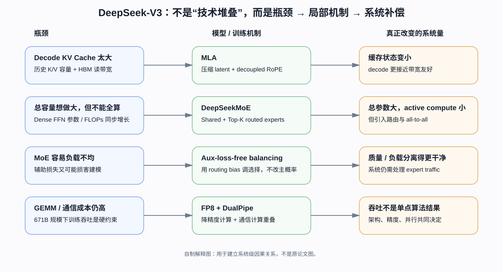
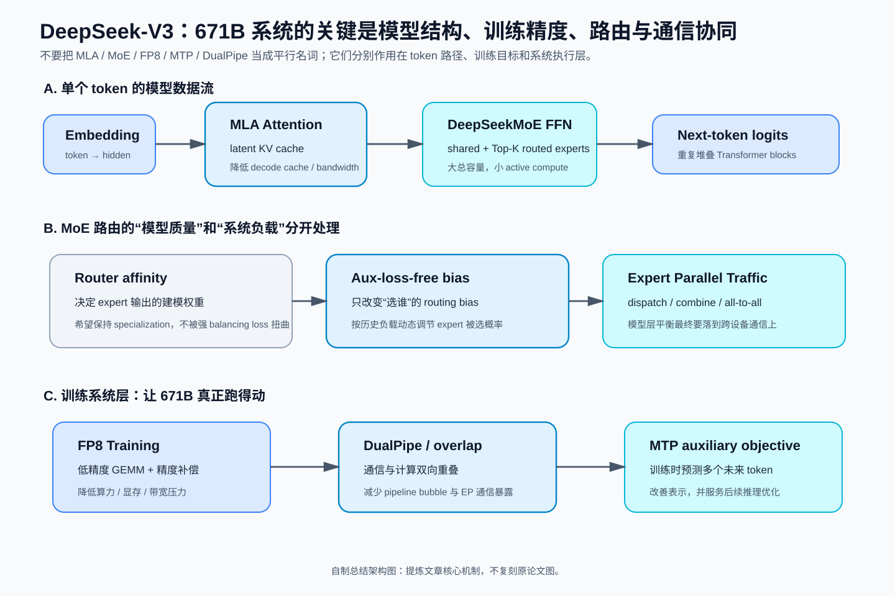
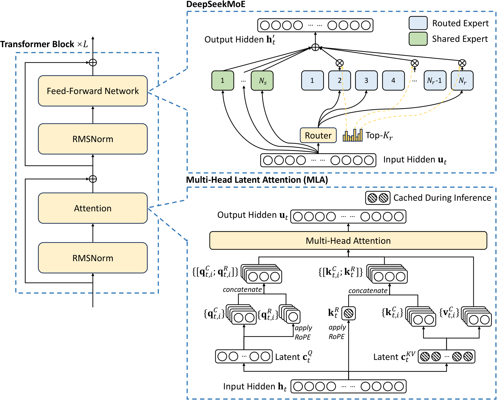
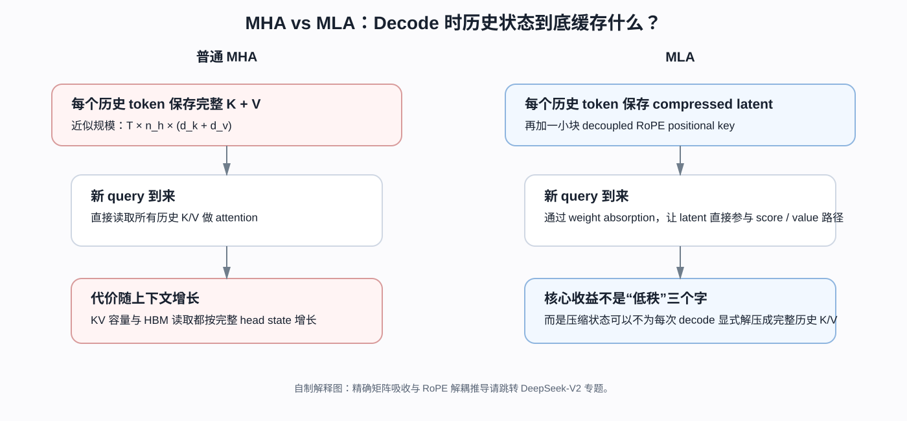
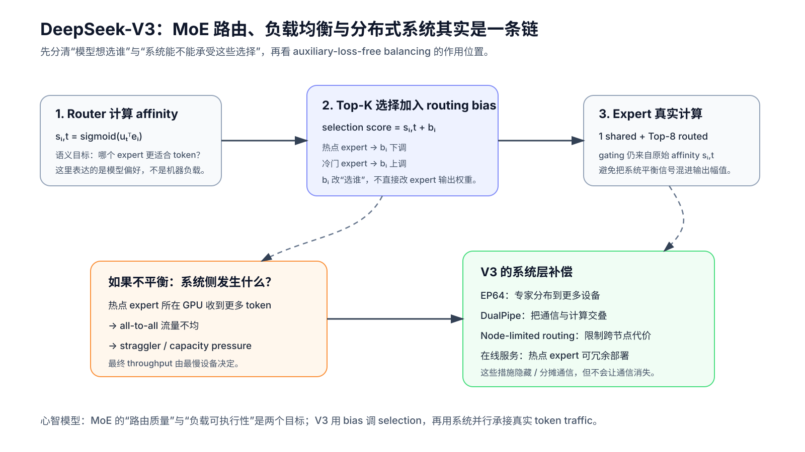
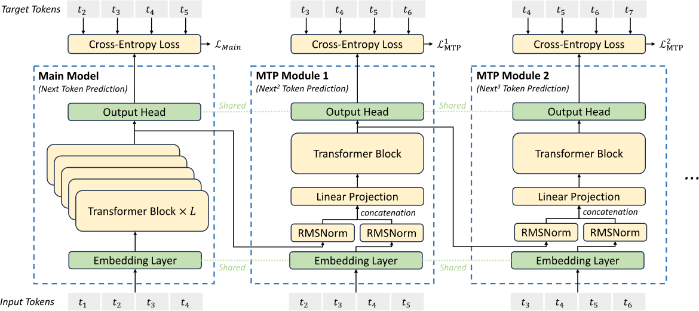
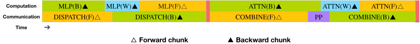
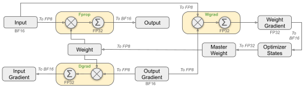

# DeepSeek-V3：真正值得拆的不是“671B”，而是这 671B 怎样被做成可训练、可推理的系统

> **论文**：DeepSeek-AI, [*DeepSeek-V3 Technical Report*](https://arxiv.org/abs/2412.19437)，本文以 arXiv v2（2025-02-18）为主版本。  
> **类型**：B · 完整模型技术报告。  
> **一句话定位**：这篇报告真正要回答的不是“671B 有多大”，而是 **MLA、稀疏 MoE、负载均衡、MTP、FP8 与分布式系统怎样共同把一个 671B 模型变成可训练、可部署的系统**。  
> **本地原图来源**：[figure_manifests/B009.json](../../../figure_manifests/B009.json)。  
> **阅读策略**：这篇报告不是把 MLA、MoE、MTP、FP8、GRPO 各自“从零证明一遍”，而是先回答：**DeepSeek-V3 作为一个完整 671B MoE 模型，为什么要把这些技术组合到同一个系统里？** 对阻塞理解的原始技术，再单独下钻原论文。

## 阅读导航：把 V3 当成主干，不要把所有技术摊平成清单

**前置 / 回看**

- [DeepSeek-V2：MLA 真正的关键不是低秩，而是让低维缓存直接参与 Decode](B008-deepseek-v2.md) —— 当你卡在 KV Cache、矩阵吸收、RoPE 解耦时回这里。
- [RoPE：位置旋转为什么会进入 MLA 的“不可吸收部分”](../../A/03-transformer/A014-roformer-rope.md) —— 只有当 decoupled RoPE 的矩阵位置关系卡住时再回查。
- [MQA](../../A/04-efficient-attention/A019-mqa.md) / [GQA](../../A/04-efficient-attention/A020-gqa.md) —— 用来建立“减少 KV heads”与“压缩缓存状态”两条路线的差别。

**当前文章内部会碰到的技术分支**

- [DeepSeekMoE：为什么把专家切得更细，还要单独设置 shared experts？](../../A/05-moe/A034-deepseekmoe.md)
- [DeepSeekMath / GRPO：真正被删掉的是 Critic，不是 PPO 的 Policy Optimization](../../A/08-post-training/A051-deepseekmath-grpo.md) —— PPO → group-relative baseline → clipping → KL → token-level update 已经完整下钻。
- [RMSNorm](../../A/03-transformer/A016-rmsnorm.md) —— V3 主干采用的归一化方式；本文只在完整 block 中定位，不重复基础推导。

**后续主干**

- [DeepSeek-R1：推理能力如何被 RL 激发出来](B010-deepseek-r1.md)

**本文重点**

1. MLA 到底改变了什么缓存状态，而不只是“做低秩压缩”；
2. 671B total / 37B active 为什么把“模型容量”和“每 token 计算”拆开；
3. auxiliary-loss-free balancing 怎样把模型路由目标与系统负载目标分开；
4. MTP 为什么训练时存在、推理时可以删除；
5. DualPipe / EP / FP8 为什么不是架构之外的附录，而是 V3 能跑起来的必要组成；
6. 哪些结论来自 controlled ablation，哪些只是完整系统结果。

> **怎么用这些链接？** 第一次读 V3 时不要一看到 MLA / MoE / GRPO 就立刻跳走。先在 V3 里理解“它为什么被需要、它接在系统哪里、它改变什么系统量”；只有公式或机制阻塞理解时，再进入对应原始方法文章。

*自制解释图，不是原论文 Figure。先从左到右看：V3 的关键技术不是彼此并列的“创新点”，而是分别对应 KV Cache、稀疏容量、负载均衡和大规模训练吞吐这些不同瓶颈。*

如果只记住“DeepSeek-V3 是 671B MoE、每 token 激活 37B”，其实几乎没读懂这篇论文。

更值得追问的是：

> 一个总参数达到 671B 的模型，为什么训练时没有被专家通信拖死？  
> 为什么推理时不需要像普通 MHA 那样保存巨大的 KV Cache？  
> 为什么 MoE 的专家不会全挤到少数几个节点？  
> 为什么额外预测未来 token 能在推理时直接删掉、却仍改善主模型？  
> 为什么 FP8 不能只是把 BF16 tensor 直接 cast 一下？  
> 为什么这篇论文把“模型架构”“训练框架”“硬件建议”写在同一份技术报告里？

DeepSeek-V3 真正有代表性的地方，恰恰是它把**模型参数化、训练目标、数值精度、分布式调度和在线部署**连成了一套共同设计。

下面从整台机器，而不是从单个术语开始拆。

---

## 总结架构图

> **教学总结图**：将 MLA、DeepSeekMoE、FP8、MTP 与 DualPipe 放到模型—训练—系统三层视角中，形成 V3 的整体工程图。

## 1. 先把 DeepSeek-V3 放回 DeepSeek 谱系：哪些是 V3 新东西，哪些不是？

论文 Introduction 非常刻意地先划清边界。

DeepSeek-V3 不是把 [DeepSeek-V2](B008-deepseek-v2.md) 推倒重来。它明确保留了两块已经在 V2 中验证过的骨架：

- **MLA（Multi-head Latent Attention）**：主要解决推理时 KV Cache 成本；
- **[DeepSeekMoE](../../A/05-moe/A034-deepseekmoe.md)**：主要用稀疏专家扩大总参数，同时控制每 token 的实际计算。

V3 在这个基础上，再重点加入：

- **auxiliary-loss-free load balancing**；
- **Multi-Token Prediction（MTP）训练目标**；
- 大规模 **FP8 mixed-precision training**；
- **DualPipe** 与 MoE all-to-all 的计算通信重叠；
- 面向在线服务的 prefill / decode 分离部署；
- 更大的模型规模、更多数据和新的后训练流程。

所以第一张谱系图应该写成：

~~~text
DeepSeek-V2
├── MLA
└── DeepSeekMoE
        │
        ▼
DeepSeek-V3
├── 继续使用 MLA
├── 继续使用 DeepSeekMoE
├── 改：auxiliary-loss-free load balancing
├── 加：MTP training objective
├── 加：大规模 FP8 training
├── 加：DualPipe / communication overlap
└── 加：新的 SFT + GRPO + R1 reasoning distillation
~~~

这里有一个很重要的阅读规则：

> **“V3 使用了某项技术”不等于“V3 首次提出了它”。**

因此本文会先把 MLA、DeepSeekMoE 讲到足够理解 V3，但真正的 MLA 第一性原理与 DeepSeekMoE 原始方法，后面应回到 DeepSeek-V2 / DeepSeekMoE 单独下钻。

### 1.1 671B 和 37B 是两个完全不同的量

论文给出的模型规模：

$$
N_{\text{total}}=671\text{B},
$$

而每个 token 激活的参数约为：

$$
N_{\text{active}}=37\text{B}.
$$

比例约为：

$$
\frac{37}{671}\approx5.5\%.
$$

这就是 MoE 的核心经济学：

> **模型可以拥有非常大的“参数容量”，但单个 token 不需要经过全部参数。**

但不能误解成“V3 每次前向只加载 5.5% 的整个模型，所以显存只需要 5.5%”。

因为：

- 所有专家权重仍然必须部署在整个集群；
- 不同 token 会路由到不同专家；
- 专家通常跨 GPU / 节点分布；
- dispatch / combine 会引入 all-to-all 通信；
- 在线服务还要为热点专家做冗余副本。

MoE 把问题从：

> “每个 token 要算所有参数”

变成：

> “怎样让每个 token 只算少数专家，同时还能把 token 高效送到这些专家所在的设备？”

后半句才是 DeepSeek-V3 工程难点的来源。

---

## 2. 一条 token 在 DeepSeek-V3 里到底怎么走？

先不要进入 MLA 的公式。先看整个模型。

*原论文 Figure 2。读图先抓两条主路径：左侧 Attention 使用 MLA；右侧 FFN 位置大部分层换成 DeepSeekMoE。V3 相对 V2 的核心新变化并不是把 Transformer 换掉，而是在已有 MLA + DeepSeekMoE 骨架上改路由平衡与训练目标。*

论文给出：

- Transformer 层数：
  $$
  L=61;
  $$
- hidden dimension：
  $$
  d=7168;
  $$
- attention heads：
  $$
  n_h=128;
  $$
- 每个普通 attention head 内容维：
  $$
  d_h=128.
  $$

一个 token 的主干可以抽象成：

~~~text
token id
   ↓
Embedding: [B,T] → [B,T,7168]
   ↓
Transformer Layer 1
   ├── RMSNorm
   ├── MLA
   ├── Residual
   ├── RMSNorm
   └── Dense FFN
   ↓
Transformer Layer 2
   └── Dense FFN
   ↓
Transformer Layer 3
   └── Dense FFN
   ↓
Transformer Layer 4 ... 61
   ├── MLA
   └── DeepSeekMoE
        ├── 1 shared expert：总是执行
        └── 256 routed experts 中 Top-8
   ↓
Final hidden state [B,T,7168]
   ↓
Output head
   ↓
Vocabulary logits
~~~

论文明确说明：

> **前三层 FFN 仍是 dense，剩余 FFN 才替换为 MoE。**

每个 MoE 层：

- 1 个 shared expert；
- 256 个 routed experts；
- 每 token 激活 8 个 routed experts；
- 每个 expert 的 intermediate hidden dimension 为 2048。

这就解释了“总参数巨大”和“单 token 计算相对可控”如何同时成立。

### 2.1 模型级读法：不要把所有技术都摊平

从整条数据流看，V3 的关键技术其实各自解决不同位置的问题：

| 模块 | 它解决的主要问题 |
|---|---|
| MLA | decode 时 KV Cache / memory bandwidth |
| DeepSeekMoE | 用较低 active compute 获得巨大参数容量 |
| aux-loss-free balance | MoE 专家负载均衡与模型质量冲突 |
| MTP | next-token 监督过稀，希望增加未来预测训练信号 |
| DualPipe | MoE 跨节点 all-to-all 太重 |
| FP8 | GEMM、activation memory、通信成本 |
| GRPO | post-training 时避免一个同尺寸 critic |

这张表非常关键。

如果把它们都写成“DeepSeek-V3 的创新点”，读者看完还是不知道为什么需要它们。

真正的模型设计是一串：

> **瓶颈 → 局部改造 → 新瓶颈 → 系统补偿。**

*自制解释图。它只帮助建立“MLA 为什么值得做”的心智模型：普通 MHA 把完整历史 K/V 当缓存对象；MLA 的关键不是单纯做一次低秩投影，而是让压缩后的 latent 能直接服务后续 decode。矩阵吸收和 RoPE 为什么让这件事变难，见 [DeepSeek-V2 专题](B008-deepseek-v2.md)。*

### 这一节先记住三件事

1. **V3 不是从零发明 MLA / DeepSeekMoE**，它把这些 V2 已验证模块继续推到更大规模；
2. **671B total 和 37B active 描述的是不同资源维度**，不能把 active ratio 直接当成部署显存比例；
3. 后面每一项技术都要问一句：**它到底改变的是参数容量、激活计算、缓存状态、通信，还是数值精度？**

---

## 3. MLA：先别背公式，先问普通 MHA 在 decode 时到底贵在哪里

### 3.1 为什么生成第 100000 个 token 时，还需要前 99999 个 token 的 K/V？

标准自回归 MHA 中，第 $t$ 个 token 在某层产生：

$$
q_t,\quad k_t,\quad v_t.
$$

生成下一个 token 时，新 query 需要和所有历史 key 做 attention：

$$
\operatorname{softmax}
\left(
\frac{q_tK_{\le t}^{\top}}{\sqrt{d_h}}
\right)
V_{\le t}.
$$

历史 token 的 query 已经不需要了，但历史：

$$
K_{\le t},V_{\le t}
$$

必须保留。

这就是 KV Cache。

标准 MHA 每个 token、每层缓存的元素量约为：

$$
N_{\text{MHA-cache/token/layer}}
=
2n_hd_h.
$$

代入 V3 的 head 配置作为一个“如果用普通 MHA”的对照：

$$
2\times128\times128
=
32768
$$

个元素。

上下文越长，这个缓存按 $T$ 线性增长；decode 每一步还要从显存读取越来越长的历史 KV。

所以在长上下文生成里，问题不仅是 FLOPs。

真正越来越明显的是：

> **KV Cache capacity + HBM bandwidth。**

### 3.2 最朴素的想法：既然 K/V 都从 hidden state 线性投影出来，能不能别缓存完整 K/V？

MLA 的核心思路就是：

> 不缓存所有 head 展开的完整 K/V，而是先把当前 hidden state 压成一个低维 latent，再让 K/V 从 latent 重建。

论文定义：

$$
\mathbf h_t\in\mathbb R^d.
$$

先做 KV joint compression：

$$
\boxed{
\mathbf c_t^{KV}
=
W^{DKV}\mathbf h_t
},
$$

其中：

$$
\mathbf c_t^{KV}
\in\mathbb R^{d_c},
\qquad
d_c=512.
$$

然后 content key/value 都由这个 latent 上投影：

$$
\mathbf k_t^C
=
W^{UK}\mathbf c_t^{KV},
$$

$$
\mathbf v_t^C
=
W^{UV}\mathbf c_t^{KV}.
$$

如果事情到这里结束，那么理论上只缓存：

$$
\mathbf c_t^{KV}
$$

就行。

但马上出现一个问题：

> **RoPE 怎么办？**

### 3.3 为什么 RoPE 不能简单和所有低秩投影一起“吸收”？

MLA 的效率不只是“低秩压缩”，还依赖一个非常关键的推理代数。

对于 content 部分，

$$
q_t^C
=
W^{UQ}c_t^Q,
$$

$$
k_j^C
=
W^{UK}c_j^{KV}.
$$

attention score 中：

$$
(q_t^C)^\top k_j^C
=
(c_t^Q)^\top
(W^{UQ})^\top
W^{UK}
c_j^{KV}.
$$

这里多个固定线性矩阵可以在推理实现里预先组合。

因此不一定要真的先把：

$$
c_j^{KV}
$$

展开成每个 head 的完整 $k_j^C$ 后再算 dot product。

同理，value up-projection 与最终 output projection 也存在可组合空间。

这正是：

> **“缓存低维 latent”能够变成真实 decode 节省，而不只是把缓存压小以后又立刻完整解压存回来**

的关键。

但是 RoPE 是位置相关变换。

位置 $j$ 的旋转矩阵依赖 $j$：

$$
R_j.
$$

一旦某个投影被夹在位置相关旋转里，就不能像普通固定线性矩阵那样简单全部吸收到一个常量权重中。

因此 MLA 把携带 RoPE 的 key 单独拆出来：

$$
\boxed{
\mathbf k_t^R
=
\operatorname{RoPE}
\left(
W^{KR}\mathbf h_t
\right)
}.
$$

最终每个 head 的 key 是：

$$
\mathbf k_{t,i}
=
[
\mathbf k_{t,i}^C;
\mathbf k_t^R
].
$$

这里特别值得注意：

> $\mathbf k_t^R$ 是**共享的 decoupled key positional component**，不是 128 个 head 各自缓存一份完整 RoPE key。

V3 设置：

$$
d_h^R=64.
$$

因此论文说生成时真正需要 cache 的只有蓝框中的：

$$
\boxed{
\mathbf c_t^{KV}
}
\quad\text{和}\quad
\boxed{
\mathbf k_t^R
}.
$$

### 3.4 理论缓存量能压多少？

MLA 每 token 每层缓存：

$$
d_c+d_h^R
=
512+64
=
576
$$

个元素。

和上面的普通 MHA 对照：

$$
32768
$$

个元素。

理论元素数量比：

$$
\frac{32768}{576}
\approx
56.9.
$$

也就是说，仅按论文这些维度做**原始缓存元素量**比较，MLA 大约减少到 MHA 的：

$$
1/56.9.
$$

为了建立量级感，假设：

- context length $T=128000$；
- 61 层；
- 每个 cache 元素按 BF16 2 bytes 粗算。

普通 MHA 对照的原始 KV 元素量：

$$
128000
\times61
\times32768
=
255{,}852{,}544{,}000.
$$

对应约：

$$
511.7\text{ GB}.
$$

MLA：

$$
128000
\times61
\times576
=
4{,}497{,}408{,}000,
$$

约：

$$
9.0\text{ GB}.
$$

这不是 DeepSeek 实际服务显存报告。

它只是用论文公开维度做的**单序列、全层、原始元素数量对照**，没有计入：

- sharding；
- allocator；
- batch；
- metadata；
- quantized cache；
- kernel temporary buffer；
- expert weights；
- pipeline placement。

但它已经足够说明 MLA 为什么是一个**推理系统级别**的架构选择，而不是小修小补。

### 3.5 Query 为什么也压缩？

V3 还定义：

$$
\mathbf c_t^Q
=
W^{DQ}\mathbf h_t,
$$

其中：

$$
d_c'=1536.
$$

再上投影为 query content 和 query RoPE 部分。

这里 query compression 的主要收益不是 KV Cache，因为 query 不需要跨 decode step 长期保存。

论文明确把它和：

> **训练 activation memory**

联系起来。

因此同一个 “low-rank compression”：

- KV compression 主要影响 inference cache；
- Q compression 更偏 training activation memory。

这就是模型报告里必须分清的“相同数学形状、不同系统目的”。

### 3.6 这一节先到哪里为止？

对 V3 主线来说，我们现在已经知道：

1. 为什么普通 MHA 会产生巨大 KV Cache；
2. MLA 为什么只缓存 latent + RoPE key；
3. 为什么 RoPE positional component 要 decouple；
4. 为什么这会直接改变 decode memory footprint。

如果到这里仍然卡在：

- 矩阵 absorption 为什么成立；
- RoPE 为什么破坏固定线性吸收；
- MLA 与 MQA/GQA 到底是在压同一个维度，还是不同的状态空间；

不要继续在 V3 里硬塞更多公式，直接跳到 [DeepSeek-V2 / MLA 专题](B008-deepseek-v2.md)。如果只是 MQA/GQA 的共享 KV 逻辑不熟，则先回 [MQA](../../A/04-efficient-attention/A019-mqa.md) / [GQA](../../A/04-efficient-attention/A020-gqa.md)。

---

## 4. DeepSeekMoE：671B 为什么不是每个 token 都算 671B？

如果 MLA 主要在解决推理缓存，那么 DeepSeekMoE 解决的是另一个维度：

> **怎样让模型拥有更大的参数容量，而不让每个 token 都支付同等规模的 FFN 计算。**

### 4.1 先看 dense FFN

标准 Transformer 中，每个 token 都会经过同一个 FFN：

$$
\operatorname{FFN}(u_t).
$$

无论这个 token 是：

- Python 代码；
- 中文历史；
- 数学证明；
- 英文对话；

都走同一组 FFN 参数。

如果继续把 FFN hidden width 做大，所有 token 的计算都会同步增加。

### 4.2 MoE 的朴素想法：把一个巨大 FFN 换成很多专家，只选少数几个

DeepSeekMoE 将 FFN 写成：

$$
h_t'
=
u_t
+
\sum_{i=1}^{N_s}
\operatorname{FFN}_i^{(s)}(u_t)
+
\sum_{i=1}^{N_r}
g_{i,t}
\operatorname{FFN}_i^{(r)}(u_t).
$$

V3 中：

- shared experts：
  $$
  N_s=1;
  $$
- routed experts：
  $$
  N_r=256;
  $$
- 每 token 选：
  $$
  K_r=8.
  $$

shared expert 总是执行。

routed expert 只执行 Top-8。

因此一层 MoE 对一个 token 实际访问的是：

~~~text
1 shared expert
+
8 routed experts
~~~

而不是 256 个 routed experts 全部计算。

### 4.3 为什么还要 shared expert？

如果所有能力都依赖竞争路由，那么一些不同领域普遍需要的基础能力会在很多专家里重复学习。

DeepSeekMoE 的一个核心思想是：

> 把可能普适的能力放进 shared expert，让 routed experts 更自由地做 specialization。

这也是为什么 DeepSeekMoE 不能简单等同于“Switch Transformer 但 expert 更多”。

更细的：

- fine-grained experts；
- shared expert isolation；
- routed specialization；

应该回到 DeepSeekMoE 原始论文单独拆。

### 4.4 Router 在做什么？

V3 用：

$$
s_{i,t}
=
\operatorname{Sigmoid}
(u_t^\top e_i)
$$

计算 token $t$ 与 expert $i$ 的 affinity。

之后只保留 Top-$K_r$：

$$
g'_{i,t}
=
\begin{cases}
s_{i,t}, & i\in\operatorname{TopK},\\
0, & \text{otherwise}.
\end{cases}
$$

然后在被选中的专家中归一化：

$$
g_{i,t}
=
\frac{g'_{i,t}}
{\sum_jg'_{j,t}}.
$$

注意 V3 报告特别写到，它与 V2 的一个小差异是：

> affinity 使用 sigmoid，再对 selected affinity 做归一化。

但路由本身马上带来一个非常现实的新问题。

---

## 5. 负载均衡：MoE 最大的问题之一，不是“不会选专家”，而是“太会选某几个专家”

假设 256 个专家中，router 发现 expert 17 和 expert 42 特别好用。

如果大量 token 都选它们：

- 这些 expert 所在 GPU 过载；
- 其他 expert GPU 空闲；
- all-to-all 后大家必须等最慢设备；
- 训练 throughput 被 straggler 拖住；
- 极端时还会发生 routing collapse。

所以系统希望：

> 专家负载不要太失衡。

传统做法往往加入一个 auxiliary load-balancing loss：

$$
L
=
L_{\text{LM}}
+
\alpha L_{\text{balance}}.
$$

这看起来非常合理。

但它有一个根本矛盾：

> $L_{\text{LM}}$ 希望 token 去“最有用的专家”；  
> $L_{\text{balance}}$ 希望 token 去“负载更均匀的专家”。

只要 $\alpha>0$，主任务梯度就被混入了一个系统约束。

$\alpha$ 太小：

> 平衡不住。

$\alpha$ 太大：

> 为了平衡牺牲语言模型最优路由。

### 5.1 V3 的关键想法：把“选谁”与“专家输出权重”拆开

DeepSeek-V3 为每个 expert 维护一个 routing bias：

$$
b_i.
$$

选择 Top-K 时使用：

$$
s_{i,t}+b_i.
$$

但真正乘 expert output 的 gating weight 仍来自**原始 affinity**：

$$
s_{i,t},
$$

而不是：

$$
s_{i,t}+b_i.
$$

也就是说：

~~~text
b_i
只影响：
“这个 expert 有没有被选中”

不影响：
“被选中后，这个 expert 输出乘多大权重”
~~~

如果 expert $i$ 当前 overloaded：

$$
b_i\leftarrow b_i-\gamma.
$$

如果 underloaded：

$$
b_i\leftarrow b_i+\gamma.
$$

这其实很像一个独立在主梯度之外运行的负反馈控制器：

~~~text
expert load 太高
   ↓
降低 routing bias
   ↓
未来更难进入 Top-K
   ↓
load 降低
~~~

### 5.2 为什么这叫 auxiliary-loss-free，却又不是“完全没有辅助 loss”？

这是一个很容易被标题误导的地方。

V3 的**主要 batch-wise load balance** 不依赖传统 auxiliary balancing loss。

但是论文同时保留一个很小的：

> complementary sequence-wise auxiliary loss

用于防止**单个 sequence 内部**出现极端不均衡。

预训练超参数中：

$$
\alpha=0.0001.
$$

因此准确说法是：

> **主要负载均衡机制不再通过主任务中的传统 auxiliary balancing loss 驱动，但仍保留很小的 sequence-wise 辅助约束。**

不能写成：

> “DeepSeek-V3 训练完全没有任何 load-balance auxiliary loss。”

### 5.3 为什么 batch-wise 比 sequence-wise 更允许专家 specialization？

假设当前一个 sequence 全是代码。

真正专业化的 router 可能自然希望更多 code tokens 去少数代码 expert。

如果要求**每个 sequence 内**都近似均匀：

> 你实际上在阻止领域 specialization。

batch-wise balance 则允许：

~~~text
代码 sequence
→ 专家 A/B/C 偏重

历史 sequence
→ 专家 D/E/F 偏重

整个大 batch 加总
→ 全局负载仍近似平衡
~~~

这就是论文 §4.5.3 的重要解释。

更关键的是，作者没有只停留在 Figure 9 的“专家看起来更专业”。

他们额外做了 **batch-wise auxiliary loss** 对照。

结果显示：

> 当 balance scope 同样放宽到 batch-wise 时，传统辅助 loss 也能达到与 auxiliary-loss-free 类似的 validation loss。

这意味着真正值得注意的机制不只是：

> “bias 更新神奇地更强”

还包括：

> **不要把负载均衡约束得过细，尤其不要强迫每条 sequence 自己均匀。**

这个结论比营销式的“无辅助损失更好”更细。

*自制解释图，不是原论文 Figure。最重要的是把三件事分开：原始 affinity 表示“模型想选谁”；routing bias 只调 Top-K selection；真实 token traffic 进入 expert parallel 后，才变成 all-to-all、热点 expert 与 straggler 的系统问题。*

### 这一组你应该记住什么

- DeepSeekMoE 解决的是 **“总参数容量可以很大，但每 token 只激活少数 FFN 参数”**；
- router 的语义偏好与集群的负载约束不是同一个目标；
- V3 的 bias 主要改“进入 Top-K 的机会”，而不是把负载信息直接乘进 expert 输出；
- 即使路由更平衡，跨设备 token dispatch 仍然存在，所以后面的 EP、DualPipe 与通信重叠不是可选装饰。

### 如果你卡在这里

- 不懂 fine-grained experts / shared expert isolation → 去 [DeepSeekMoE 原始方法](../../A/05-moe/A034-deepseekmoe.md)；
- 不懂为什么负载均衡会变成 all-to-all / straggler 问题 → 继续读本文 §7；
- 想判断“auxiliary-loss-free 是否真的更强” → 不要停在机制描述，继续看本文 §12 的消融证据。

---

## 6. MTP：为什么 next-token prediction 还嫌监督不够密？

标准 causal LM 在每个位置：

$$
h_i
\rightarrow
t_{i+1}.
$$

虽然一个长度 $T$ 的序列有 $T$ 个 token loss，但对**每个 hidden state**来说，主要直接监督只指向下一个 token。

MTP 的直觉是：

> 如果当前位置表示不仅要对 $t_{i+1}$ 有用，还要对更远的 $t_{i+2},t_{i+3}$ 有用，会不会逼它学习更“面向未来”的表征？

原论文 Figure 3 非常适合看这个问题。

*先看横向：Main Model 预测 next token；MTP Module 1 继续预测 next² token；Module 2 继续预测 next³ token。再看绿色连线：embedding 与 output head 和主模型共享。V3 实际使用 $D=1$，也就是只增加一个额外未来 token 的预测深度。*

### 6.1 V3 实际不是并行放很多独立 head

V3 的设计和“每个 hidden state 上挂 D 个平行分类头”不同。

第 $k$ 个 MTP module 会把：

1. 上一深度的 hidden representation：
   $$
   h_i^{k-1};
   $$
2. 真值未来 token embedding：
   $$
   \operatorname{Emb}(t_{i+k})
   $$

拼接：

$$
[
\operatorname{RMSNorm}(h_i^{k-1});
\operatorname{RMSNorm}(\operatorname{Emb}(t_{i+k}))
].
$$

再通过：

$$
M_k\in\mathbb R^{d\times2d}
$$

投影回 hidden size：

$$
h_i^{\prime k}
=
M_k
[
\operatorname{RMSNorm}(h_i^{k-1});
\operatorname{RMSNorm}(\operatorname{Emb}(t_{i+k}))
].
$$

然后再过一个 Transformer block：

$$
h_{1:T-k}^k
=
\operatorname{TRM}_k(h_{1:T-k}^{\prime k}).
$$

最后共享主模型 output head：

$$
P_{i+k+1}^k
=
\operatorname{OutHead}(h_i^k).
$$

它保持了一条 sequential causal prediction chain。

### 6.2 V3 实际 $D=1$

论文 Figure 3 画了 Module 1、Module 2、……

这是通用设计示意。

真正的 DeepSeek-V3 超参数：

$$
D=1.
$$

也就是说：

> 主模型正常预测 next token；另外再训练一个 MTP module 预测再往后一个 token。

不要看到 Figure 3 就写成“V3 实际用了多级 MTP 堆叠”。

### 6.3 训练损失

每个 depth：

$$
L_{\text{MTP}}^k
=
-\frac1T
\sum_{i=2+k}^{T+1}
\log P_i^k[t_i].
$$

总 MTP：

$$
L_{\text{MTP}}
=
\frac{\lambda}{D}
\sum_{k=1}^{D}
L_{\text{MTP}}^k.
$$

V3 的 $\lambda$ 不是固定常数：

- 前 10T tokens：
  $$
  \lambda=0.3;
  $$
- 后 4.8T tokens：
  $$
  \lambda=0.1.
  $$

这说明作者把 MTP 当作：

> **训练期的额外监督约束**

而不是永久改变主模型输出定义。

### 6.4 为什么推理时可以直接删？

论文明确说：

> MTP 的主要目标是改善 main model，因此推理可以直接丢弃 MTP modules。

这意味着 ablation 时：

- baseline；
- baseline + MTP training；

在推理阶段可以拥有**完全相同的主模型推理成本**。

这让 MTP 的实验很有价值。

论文 Table 4 在 15.7B total / 2.4B active 与 228.7B total / 20.9B active 两个尺度上做对照，保持数据和其他结构不变。

例如 large MoE：

- HumanEval：
  $$
  44.5\rightarrow53.7;
  $$
- GSM8K：
  $$
  72.3\rightarrow74.0;
  $$
- MATH：
  $$
  38.6\rightarrow39.8.
  $$

但 MMLU：

$$
67.5\rightarrow66.6
$$

反而下降。

所以最准确的结论是：

> MTP 在论文给出的两个模型尺度上**大多数 benchmark 有收益**，尤其部分代码/推理任务明显，但并非每项指标单调提升。

### 6.5 speculative decoding 是副产品，不是 V3 主部署方案的必需条件

MTP modules 还可以被重新利用做 speculative decoding。

但论文明确区分：

- **主要目标**：训练更好的 main model；
- **可选用途**：推理时 speculative decoding。

因此技术依赖图上应标：

~~~text
MTP → DeepSeek-V3 pretraining objective：IMPLEMENTS
MTP → speculative decoding：OPTIONAL
~~~

---

## 7. 一个 MoE 模型真正难训练的地方：不是 GEMM，而是 token 在机器之间乱跑

当 expert 分散在不同 GPU / node 上时，router 选完 expert 后，token activation 必须被发送到 expert 所在设备。

一层 MoE 的真实执行更像：

~~~text
Attention
   ↓
Router
   ↓
dispatch all-to-all
   ↓
各 GPU 上对应 Expert MLP
   ↓
combine all-to-all
   ↓
Residual / next layer
~~~

如果计算和通信串行：

$$
T_{\text{layer}}
=
T_{\text{attn}}
+
T_{\text{dispatch}}
+
T_{\text{MLP}}
+
T_{\text{combine}}.
$$

专家越细、跨节点越多，all-to-all 越严重。

DeepSeek 报告说，V3 cross-node expert parallelism 的 computation-to-communication ratio 大约接近：

$$
1:1.
$$

也就是说这已经不是“顺便优化一下网络通信”。

通信本身足以和计算同量级。

### 7.1 训练并行配置先看清

2048 张 H800。

整体训练使用：

- 16-way Pipeline Parallelism；
- 64-way Expert Parallelism，跨 8 个节点；
- ZeRO-1 Data Parallelism；
- **不使用 Tensor Parallelism**。

不使用 TP 在 671B 模型上非常值得注意。

它不是说 TP 一般不好，而是：

> 他们通过 MoE 参数切分、pipeline、memory optimization，把 TP 通信从主训练路径中拿掉。

### 7.2 DualPipe 的目标不是减少通信字节，而是把通信藏到计算下面

原论文 Figure 4：

*这张图真正应该看“上下两行时间是否并行推进”。上方是 MLP/Attention compute，下方是 dispatch/combine/PP communication。DualPipe 的思想不是让 all-to-all 消失，而是重新切 chunk、拆 backward-for-input / backward-for-weight，并让通信尽量和另一部分计算同时发生。*

如果串行：

$$
T_{\text{serial}}
=
T_{\text{compute}}
+
T_{\text{comm}}.
$$

如果能完全 overlap：

$$
T_{\text{overlap}}
\approx
\max(
T_{\text{compute}},
T_{\text{comm}}
).
$$

这就是为什么论文会使用“hide communication”这种语言。

**hide 并不等于通信量变成 0。**

网络仍然真的传了数据；只是 wall-clock critical path 上，通信不再完全额外累加。

### 7.3 为什么 backward 要拆 input grad 和 weight grad？

标准 Linear / MLP backward 至少包含两个主要方向：

- Dgrad：对输入求梯度；
- Wgrad：对权重求梯度。

它们依赖关系并不完全相同。

DualPipe 借鉴 ZeroBubble 思路进一步拆：

~~~text
Backward
├── backward for input
└── backward for weights
~~~

这样 scheduler 得到更多可重排的小块，就有机会把：

- all-to-all；
- PP communication；
- attention；
- MLP；

交错起来。

这是典型的系统设计：

> **不是减少算法总工作量，而是改变 work 的时间组织。**

### 7.4 训练系统为什么属于模型论文，而不只是“运维附录”？

因为 DeepSeekMoE 本身选择了：

- 256 routed experts；
- fine-grained expert；
- EP64；
- cross-node routing。

这会直接产生 all-to-all。

也就是说：

> **架构先制造了系统瓶颈，系统设计再把这个瓶颈压回可接受范围。**

所以 V3 是非常适合学习“算法—系统 co-design”的模型技术报告。

---

## 8. FP8：低精度训练绝不是“把 BF16 改成 8 bit”

如果只是：

~~~text
BF16 tensor
↓ cast
FP8 tensor
↓ GEMM
~~~

大规模训练很容易被：

- outlier；
- dynamic range；
- accumulation error；
- gradient precision

击穿。

DeepSeek-V3 的 FP8 章节真正有价值的地方，在于它把“哪里能低精度、哪里不能”拆得非常细。

*读图要分三条 GEMM：Fprop、Dgrad、Wgrad。它们使用 FP8 GEMM；但输出、master weight、weight gradient、optimizer state 并不是全部变成 FP8。V3 的方法本质是 mixed precision，而不是“全模型 FP8”。*

### 8.1 哪些核心 GEMM 用 FP8？

对于 Linear：

- forward GEMM：Fprop；
- activation-gradient GEMM：Dgrad；
- weight-gradient GEMM：Wgrad；

三者都执行 FP8 GEMM。

这才带来主要 tensor-core compute benefit。

### 8.2 哪些地方仍保留高精度？

论文明确保留：

- embedding；
- output head；
- MoE gating；
- normalization；
- attention；

在更高精度。

另外：

- master weights：FP32；
- accumulated weight gradients：FP32；
- AdamW 一阶/二阶 moment：BF16。

因此“DeepSeek-V3 是 FP8 模型”这种表述太模糊。

更准确是：

> **计算密集型 GEMM 大量使用 FP8，但数值敏感状态和算子选择性保留 BF16/FP32。**

### 8.3 为什么 fine-grained quantization 很关键？

如果一个巨大 tensor 只用一个 scale：

$$
x_q
=
\operatorname{round}(x/s),
$$

那么少数 outlier 会把：

$$
s
$$

拉得很大。

结果是大多数正常值只能用很粗的量化间隔。

V3 改成：

- activation：$1\times128$ tile；
- weight：$128\times128$ block；

分别估计 scale。

可以把直觉理解成：

> 不让一个局部 outlier 决定整张大矩阵的量化刻度。

这也是他们能够统一使用 E4M3、而不是对 backward 全部切到更大 exponent 的 E5M2 的重要基础之一。

### 8.4 为什么 accumulation 还要“升回” FP32？

低精度乘法并不等于低精度长累加也安全。

矩阵乘法一个输出元素：

$$
y
=
\sum_{k=1}^{K}
a_kb_k.
$$

当 $K$ 很大时，误差会累积。

V3 在 Tensor Core 做一段 FP8 MMA 后，每隔：

$$
N_C=128
$$

个元素，把 partial sum promotion 到 CUDA Core 的 FP32 register 做高精度 accumulation。

这是一种很典型的折中：

~~~text
乘法：
尽量使用高吞吐 FP8 Tensor Core

长累加：
周期性转到 FP32
~~~

这也解释了论文为什么最后直接给硬件厂商提建议：

> 如果 Tensor Core 原生支持更高精度 accumulation、group scaling、online quantization，软件就不必这样来回搬数据。

所以 §3.5 “hardware suggestions” 不是跑题，而是前面系统设计遇到硬件限制后的自然结论。

### 这一组你应该记住什么

- MoE 的主要系统瓶颈不是“专家矩阵乘不动”，而是 token dispatch / combine 带来的通信与负载不均；
- DualPipe 的目标是 **overlap communication**，不是让通信成本凭空消失；
- FP8 的收益来自低精度计算与通信，但稳定训练依赖 fine-grained scaling、受控累加精度和高精度 master state；
- 当论文开始讨论硬件原语时，说明这里已经从“模型算法”进入真正的软硬件协同设计。

### 如果你卡在这里

- 卡在 expert routing 与通信的对应关系 → 回看上一张 MoE 系统解释图；
- 卡在“为什么 FP8 不能直接 cast” → 重点重读 §8.2–§8.4；
- 想继续追 kernel / 通信 / pipeline 的底层实现 → 这属于后续 C 类系统论文，而不是继续往 V3 模型页里堆实现细节。

---

## 9. 预训练：14.8T tokens 只是一个数字，真正该看的是完整训练 recipe

### 9.1 数据不是“多一点”，而是有方向地改

相对 DeepSeek-V2，V3 报告强调：

- 增加数学与编程数据比例；
- 扩大英文/中文之外的多语言覆盖；
- 减少冗余同时保持 diversity；
- document packing；
- 继续使用 FIM。

FIM 使用 PSM 格式，比例：

$$
0.1.
$$

tokenizer：

- byte-level BPE；
- vocabulary：
  $$
  128K.
  $$

新 pretokenizer 还合并部分 punctuation + line break token，但作者发现这可能导致 multiline prompt 的 token-boundary bias，因此训练时会随机拆分一部分组合 token。

这个细节很有代表性：

> tokenizer 不是训练前一次固定的“基础设施”；它会直接影响 few-shot prompt 的边界行为。

### 9.2 模型超参数

V3：

$$
L=61,\qquad d=7168.
$$

MLA：

$$
n_h=128,
\quad
d_h=128,
\quad
d_c=512,
\quad
d_c'=1536,
\quad
d_h^R=64.
$$

MoE：

$$
1\text{ shared}
+
256\text{ routed},
$$

每 token：

$$
8\text{ routed experts}.
$$

每个 expert intermediate size：

$$
2048.
$$

每 token 最多发送到：

$$
4\text{ nodes}.
$$

MTP：

$$
D=1.
$$

### 9.3 optimizer 和 schedule

使用 AdamW：

$$
\beta_1=0.9,
\qquad
\beta_2=0.95,
\qquad
\mathrm{weight\ decay}=0.1.
$$

最大 sequence length 在主预训练阶段：

$$
4K.
$$

学习率先 warmup 2000 steps 到：

$$
2.2\times10^{-4}.
$$

保持到约 10T tokens 后，再 cosine decay。

最后 500B tokens 使用更低的分段 constant LR。

这说明一个经常被忽略的事实：

> 超大模型训练并不是一条“标准 cosine curve 从头跑到尾”。

论文实际用了非常明确的 token-budget-aware schedule。

batch size 也不是固定：

$$
3072
\rightarrow
15360
$$

并在前 469B tokens 渐增。

### 9.4 128K 不是从头用 128K 预训练

主预训练：

$$
4K.
$$

之后两阶段 context extension：

$$
4K
\rightarrow
32K
\rightarrow
128K.
$$

每阶段：

$$
1000\text{ steps}.
$$

使用 YaRN。

而且 YaRN 只施加到 MLA 的 decoupled RoPE key：

$$
k_t^R.
$$

这又一次体现 MLA 和 position encoding 不是完全独立的两块积木。

如果以后单独拆 YaRN，必须回到这里解释：

> 为什么 V3 不需要对所有 latent content projection 做同样的 RoPE extension。

---

## 10. 后训练：V3 的 chat 能力不是 Base checkpoint 自然长出来的

V3 的 post-training 大致是：

~~~text
DeepSeek-V3-Base
   ↓
SFT data construction
   ├── reasoning data：内部 DeepSeek-R1 / expert model
   └── non-reasoning：DeepSeek-V2.5 + human verification
   ↓
SFT：1.5M instances, 2 epochs
   ↓
Reward
   ├── rule-based
   └── model-based RM
   ↓
GRPO
   ↓
DeepSeek-V3 chat/instruct behavior
~~~

### 10.1 SFT reasoning data：这已经开始和 R1 主线相连

论文说 reasoning data 来自内部 DeepSeek-R1 系列模型。

但 R1 raw reasoning 存在：

- overthinking；
- formatting poor；
- output too long。

所以目标不是简单：

> “把 R1 输出全部蒸馏给 V3”。

而是：

> **保留 verification / reflection patterns，同时控制答案风格与长度。**

这也是为什么 V3 后训练部分已经自然把下一篇论文指向：

> **DeepSeek-R1。**

### 10.2 1.5M SFT instances

instruction tuning 数据共约：

$$
1.5\text{M instances}.
$$

SFT：

- 2 epochs；
- cosine LR：
  $$
  5\times10^{-6}
  \rightarrow
  1\times10^{-6}.
  $$

sequence 会 pack 多个 sample，但采用 sample masking，让不同 sample 互相不可见。

这里和预训练 document packing 要区别：

> packing 是为了设备利用率；mask 决定不同样本能不能在 attention 中互相看到。

### 10.3 为什么 RL 不只用一个 learned reward model？

对数学、代码这类可以确定验证的任务，V3 用 rule-based reward：

- 数学最终答案规则；
- LeetCode compiler / test cases。

原因很直接：

> 能用确定程序验证，就不要让另一个神经网络猜“对不对”。

这会降低 reward hacking 的一部分空间。

对自由问答、创作等才使用 model-based RM。

### 10.4 GRPO 在这里先只讲模型级意义

GRPO 对一个 prompt $q$ 采样一组：

$$
\{o_1,\ldots,o_G\}.
$$

用组内 reward 做标准化：

$$
A_i
=
\frac{
r_i-\operatorname{mean}(r_1,\ldots,r_G)
}{
\operatorname{std}(r_1,\ldots,r_G)
}.
$$

最重要的模型级意义：

> **不再训练一个通常与 policy 同规模的 critic / value model，而从组内样本 reward 估 baseline。**

这对 671B 级模型的 post-training 成本非常敏感。

但 GRPO 的：

- importance ratio；
- clipping；
- KL；
- group baseline 偏差/方差；
- 与 PPO 的关系；

不应该塞在 V3 文章里一次讲完。

这个节点后面应该下钻：

> **DeepSeekMath / GRPO 原始方法。**

### 这一组你应该记住什么

- V3-Base 的能力主要来自预训练，Chat / reasoning 行为来自后训练；
- rule-verifiable task 与 model-based reward 服务不同类型的数据；
- GRPO 在 V3 页面只需要理解“为什么它能省掉 learned critic”以及它在 pipeline 中的位置；
- ratio、clip、KL、group baseline 的统计性质不属于模型报告主线。

### 如果你卡在这里

- 卡在 GRPO 的数学 → 跳 [DeepSeekMath / GRPO 专题](../../A/08-post-training/A051-deepseekmath-grpo.md)；
- 卡在 reasoning RL 为什么会进一步发展成完整多阶段流程 → 直接进入 [DeepSeek-R1](B010-deepseek-r1.md)；
- 卡在 Base Model 的 MLA / MoE 底座 → 分别回 [DeepSeek-V2](B008-deepseek-v2.md) 与 [DeepSeekMoE](../../A/05-moe/A034-deepseekmoe.md)。

---

## 11. 推理部署：Prefill 和 Decode 不是同一种工作负载，所以 V3 干脆分开部署

这是 V3 报告里很值得系统学习的一段。

### 11.1 Prefill

长 prompt 一次性进入模型。

特点：

- token 多；
- GEMM 大；
- expert batch 相对大；
- compute utilization 容易做高。

V3 的最小 prefill deployment unit：

- 4 nodes；
- 32 GPUs。

Attention：

- TP4；
- Sequence Parallel；
- DP8。

MoE：

- EP32。

并且部署：

$$
32
$$

个 redundant experts。

热点 expert 会根据在线统计周期性复制 / 重排。

### 11.2 Decode

decode 每一步每个 sequence 通常只新增一个 token。

特点：

- 单 expert batch 变小；
- attention 历史越来越长；
- memory access / KV 成本更突出；
- latency 比大 GEMM utilization 更敏感。

V3 的最小 decoding deployment unit：

- 40 nodes；
- 320 GPUs。

Attention：

- TP4 + SP；
- DP80。

MoE：

- EP320。

这里每个 GPU 基本只放一个 expert，并有：

$$
64
$$

张 GPU 用于 redundant/shared experts。

论文还直接说 decode 阶段每个 expert 的 batch 通常：

$$
\le256\text{ tokens},
$$

瓶颈更偏：

> **memory access，而不是 computation。**

这就是为什么同一个模型：

> prefill 和 decode 可以使用完全不同的并行配置。

### 11.3 为什么冗余 expert 不是“浪费参数”？

训练时你希望每个 expert 只保存一份，避免额外显存。

在线服务时目标变了：

> SLO 和 load balance 更重要。

如果 expert 17 特别热门，只部署一份：

~~~text
大量请求
→ expert 17 所在 GPU 排队
→ 其他 GPU 可能空闲
→ tail latency 恶化
~~~

复制 hotspot expert：

~~~text
expert 17
├── replica A
├── replica B
└── replica C
~~~

就能用额外显存换吞吐和延迟稳定性。

这是很典型的：

> **training-optimal placement ≠ serving-optimal placement。**

---

## 12. 实验：哪些证据真的能支持“这个设计有效”？

一篇技术报告最容易被 benchmark 大表淹没。

对于模型理解，最重要的其实不是“V3 在 MMLU 是多少”，而是**控制变量更干净的消融**。

### 12.1 MTP：这是相对干净的消融

论文在两个 MoE scale 上：

- 数据相同；
- 其他 architecture 相同；
- 只增加 1-depth MTP；
- inference 时删除 MTP module。

所以 Table 4 能较有力地支持：

> MTP training objective 本身对多个任务有增益。

但不是所有 benchmark 都升。

因此结论是“多数任务改善”，不是“无条件改善”。

### 12.2 auxiliary-loss-free：也有较强控制

作者保持：

- training data；
- architecture；
- sigmoid gating；
- top-K normalization；

基本一致。

然后：

- baseline：纯 auxiliary-loss balance；
- variant：去掉这些 balance loss，加入 bias-based balance。

多数指标改善。

但 §4.5.3 又进一步发现：

> batch-wise auxiliary loss 可以达到类似 validation loss。

所以更深的结论应是：

> **balance scope 的自由度本身很重要；sequence-wise 过强约束可能压制 expert specialization。**

### 12.3 671B 最终 benchmark 不能用于单独证明某个组件

V3 vs：

- DeepSeek-V2；
- Qwen2.5 72B；
- Llama 3.1 405B；

存在同时变化：

- 总参数；
- active parameters；
- token budget；
- data mixture；
- tokenizer；
- architecture；
- training system；
- post-training；
- evaluation protocol。

所以最终 leaderboard 只能回答：

> “完整 V3 系统在这些 benchmark 上表现如何？”

不能回答：

> “MLA 单独带来了多少分。”

### 12.4 训练成本数字必须带上作者自己的限定条件

论文报告官方训练总计：

$$
2.788\text{M H800 GPU hours}.
$$

其中：

- pre-training：
  $$
  2.664\text{M};
  $$
- context extension：
  $$
  0.119\text{M};
  $$
- post-training：
  $$
  0.005\text{M}.
  $$

按作者假设：

$$
\$2/\text{H800 GPU hour},
$$

得到：

$$
\$5.576\text{M}.
$$

但是论文自己明确说明：

> **这个数字只计 official DeepSeek-V3 training，不包括之前的 research、architecture/data/algorithm ablations。**

所以严谨写法是：

> “论文报告的正式训练运行成本”

而不是：

> “DeepSeek-V3 从研发到最终模型只花了 557.6 万美元。”

---

## 13. 论文细读：这篇报告的写法本身就在告诉我们“什么是主贡献，什么只是继承”

### 13.1 Abstract 第一段其实已经把整篇论文拆成三层

Abstract 的组织是：

~~~text
模型层：
671B total / 37B active
+ MLA
+ DeepSeekMoE

算法新增：
aux-loss-free balance
+ MTP

训练系统：
14.8T tokens
+ FP8
+ efficient infrastructure
~~~

这不是普通摘要里的“堆关键词”。

作者有意识地把：

> architecture / objective / infrastructure

放在同一个贡献叙事里。

原因是对这个规模的 MoE 来说，三者不能独立存在。

### 13.2 Introduction 为什么先说 “still adopts MLA and DeepSeekMoE”？

“still adopts” 这类措辞非常重要。

它是在主动降低 novelty claim：

> MLA 与 DeepSeekMoE 不是 V3 新发明，它们已经在 V2 验证。

接着才用：

> “Beyond the basic architecture…”

引出真正新增的 load balancing 与 MTP。

这就是阅读模型报告时必须做的“贡献去重”。

不能把 V3 用到的所有技术都挂成：

> DeepSeek-V3 PROPOSES。

### 13.3 “pioneers auxiliary-loss-free” 和 “we have observed MTP improves…” 的证据强度不同

论文介绍 load balance 时使用较强 novelty 语言。

而讲 MTP 的最初动机时，使用的是：

> “we have observed…”

这说明在进入消融以前，它首先是一个**经验观察驱动的训练 objective**。

后面 contributions 又写 “prove it beneficial”。

这里的 “prove” 不是数学 theorem。

证据是：

> controlled ablation 在两个模型尺度上，多数 benchmark 改善。

所以中文技术博客最好写成：

> “通过消融验证其收益”

而不是：

> “数学证明 MTP 必然提高性能”。

### 13.4 为什么 Architecture 后面立刻是 Infrastructure，而不是 Pre-training？

论文结构：

~~~text
2 Architecture
3 Infrastructures
4 Pre-Training
5 Post-Training
~~~

V3 在正式讲 data/training 前，先花很长篇幅讲：

- cluster；
- PP / EP / DP；
- DualPipe；
- all-to-all；
- memory saving；
- FP8；
- inference deployment；
- hardware suggestions。

作者实际上在表达：

> **如果不先解释这套 infrastructure，671B / 256 experts / FP8 这些架构配置根本不知道怎样真实跑起来。**

这也是 V3 最适合作为“大模型算法工程”阅读入口的原因。

### 13.5 FP8 章节为什么写到了未来芯片建议？

如果这只是一个数值精度技巧，hardware suggestion 会很突兀。

但前文已经遇到：

- Tensor Core accumulation precision；
- CUDA Core promotion；
- tile scale；
- online quantization；
- transposed GEMM；
- SM 被通信占用。

于是 §3.5 实际是在说：

> “我们的软件 workaround 暴露了现有硬件接口不适合这种训练模式的地方。”

这是一种非常成熟的 system co-design 报告写法：

~~~text
算法需要什么
↓
现有硬件哪里不匹配
↓
软件如何绕
↓
绕法有什么 overhead
↓
下一代硬件应该原生支持什么
~~~

### 13.6 “training cost only …” 要把限定语一起读

作者多次强调 economical cost。

但真正认真读到 Table 1 后面的注释，会发现：

> 不包含之前 research / ablation cost。

因此这类技术报告的数字阅读原则是：

> **标题数字永远和计量边界一起摘录。**

GPU hours、tokens、activated params、latency 都一样。

---

## 14. 从 DeepSeek-V3 反向生成下一步技术依赖树

读完 V3 后，不应该马上按 Paperlist 顺序读下一篇。

应该看：

> 哪些节点已经阻塞进一步理解？

当前依赖树：

~~~text
DeepSeek-V3
│
├── MLA
│   ├── DERIVED_FROM / EXTENDS: DeepSeek-V2
│   ├── ADOPTS: RoPE
│   └── 对照: MHA / MQA / GQA
│
├── DeepSeekMoE
│   ├── DERIVED_FROM: Sparsely-Gated MoE / GShard / Switch
│   ├── ADOPTS: fine-grained routed experts
│   └── ADOPTS: shared expert isolation
│
├── Auxiliary-Loss-Free Load Balance
│   ├── V3: IMPLEMENTS / EXTENDS
│   └── 关键问题: batch-wise vs sequence-wise balance
│
├── MTP
│   ├── ADOPTS / EXTENDS: multi-token prediction ideas
│   └── OPTIONAL: speculative decoding
│
├── Training System
│   ├── PP16
│   ├── EP64
│   ├── ZeRO-1
│   ├── DualPipe
│   └── all-to-all overlap
│
├── FP8
│   ├── tile/block-wise quantization
│   ├── high-precision accumulation
│   └── low-precision activation / communication
│
└── Post-Training
    ├── SFT
    ├── R1 reasoning distillation
    └── GRPO
        └── DERIVED_FROM: DeepSeekMath
~~~

### 14.1 下一篇不应该是谁？

不是 Backprop。

不是 Word2Vec。

也不是“Paperlist 的下一编号”。

### 14.2 现在应该往哪里走？

当前项目中，V3 的两个架构级依赖已经可以直接站内回查：

1. [DeepSeek-V2 / MLA](B008-deepseek-v2.md)：MHA → latent compression → weight absorption → decoupled RoPE；
2. [DeepSeekMoE](../../A/05-moe/A034-deepseekmoe.md)：fine-grained experts + shared expert isolation。

模型主线也已经继续到了：

3. [DeepSeek-R1](B010-deepseek-r1.md)：把 V3-Base 接到 reasoning post-training。

所以从**当前真实进度**继续，最自然的阻塞节点已经变成：

4. [DeepSeekMath / GRPO 专题](../../A/08-post-training/A051-deepseekmath-grpo.md)：PPO critic → group-relative baseline → clipping → KL → token-level policy update 已经闭环，可随时回查；
5. FP8 / DualPipe 再作为 C 类系统支线单独拆。

这就是“模型是树干，方法是按阻塞程度展开的分支”，而不是把 Paperlist 当成线性进度条。

---

## 15. 读完这一篇，至少应该能不看论文回答这些问题

如果下面的问题只能背关键词，说明还没真正读懂：

1. **为什么 MLA 的核心不是“低秩”三个字，而是“只缓存 $c^{KV}$ 和 decoupled RoPE key”？**
2. **为什么 RoPE 部分不能和 content projection 一样被完全吸收到固定线性矩阵？**
3. **为什么 671B total parameters 和 37B active parameters 不能用同一个数字讨论推理成本？**
4. **为什么 MoE 的 load balance 是模型质量问题，同时也是分布式系统问题？**
5. **为什么 auxiliary-loss-free strategy 的 bias 只影响 Top-K selection，不直接改 expert output gate？**
6. **为什么 V3 仍然保留一个很小的 sequence-wise auxiliary loss？**
7. **为什么 MTP 能训练时增加参数和计算，推理时却可以完全丢掉？**
8. **为什么 DualPipe 是“隐藏通信”，而不是“消灭通信”？**
9. **为什么 FP8 训练仍要保留 FP32 master weights、FP32 gradients 和更高精度敏感算子？**
10. **为什么 V3 的 prefill 与 decode 要采用不同集群拓扑和 expert redundancy 策略？**
11. **为什么 Table 4/5 比最终 benchmark leaderboard 更能说明两个新设计的因果作用？**
12. **为什么 V3 读完后，下一篇自然应该是 DeepSeek-V2 / MLA，而不是 Paperlist 的下一编号？**

能把这 12 个问题连成一条因果链，DeepSeek-V3 才算真正成为我们后续 LLM 技术树的第一根“主干”。

### 继续阅读：按你的困惑分流

- **“MLA 为什么能只缓存 latent？”** → [DeepSeek-V2 / MLA](B008-deepseek-v2.md)
- **“shared expert / fine-grained routed expert 为什么这样设计？”** → [DeepSeekMoE](../../A/05-moe/A034-deepseekmoe.md)
- **“V3-Base 后面怎样变成 reasoning model？”** → [DeepSeek-R1](B010-deepseek-r1.md)
- **“GRPO 为什么可以不要 Critic，clip/KL 又怎么来的？”** → [DeepSeekMath / GRPO](../../A/08-post-training/A051-deepseekmath-grpo.md)
- **“RoPE / MQA / GQA 的基础机制还不牢”** → [RoPE](../../A/03-transformer/A014-roformer-rope.md)、[MQA](../../A/04-efficient-attention/A019-mqa.md)、[GQA](../../A/04-efficient-attention/A020-gqa.md)
