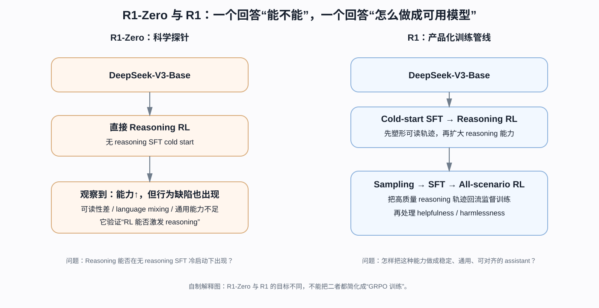
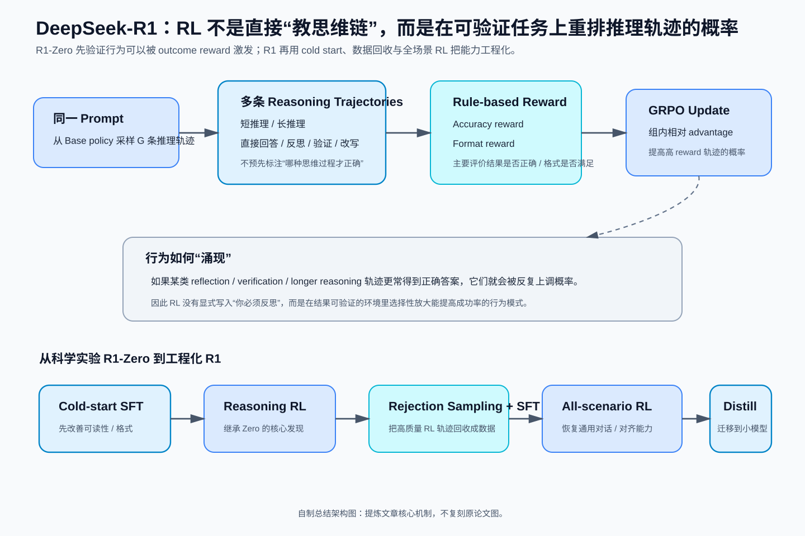
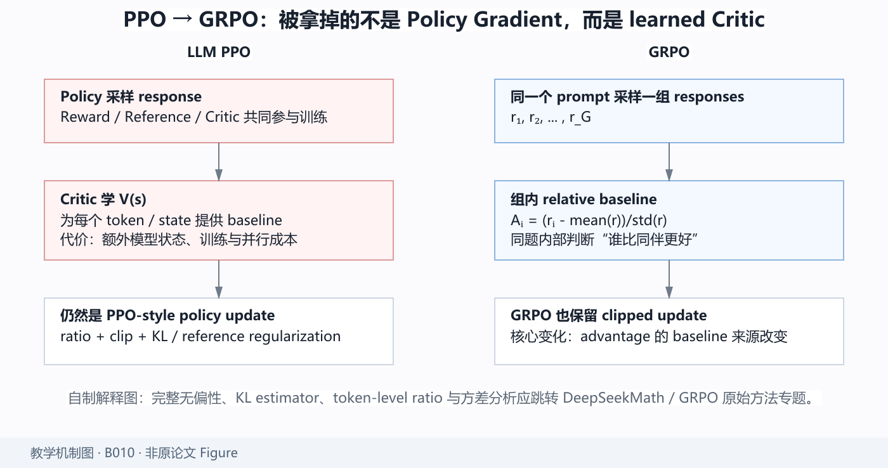
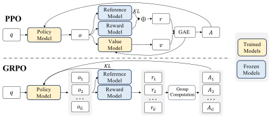
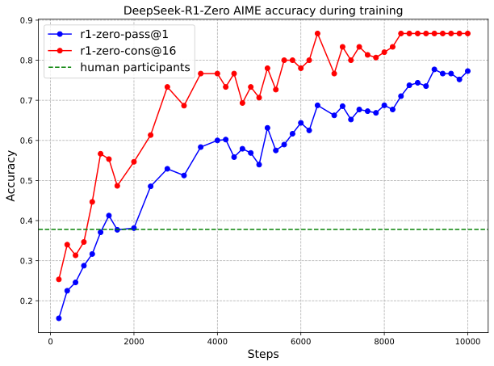
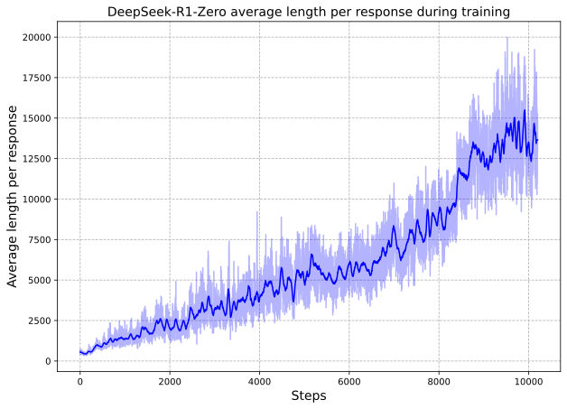
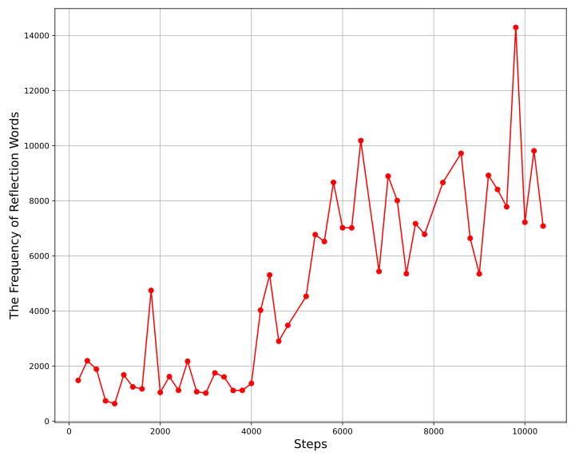
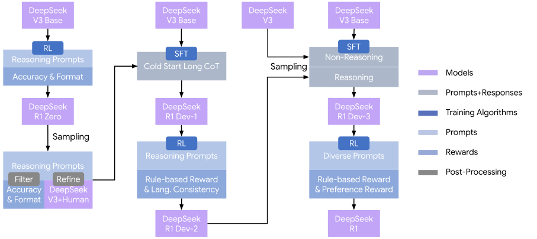
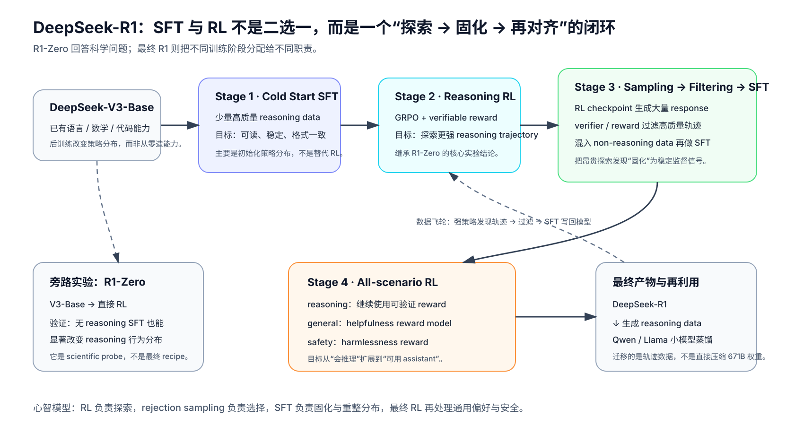

# DeepSeek-R1：真正值得读的不是“会思考”，而是推理能力如何被 RL 激发出来

> **论文**：DeepSeek-AI, [*DeepSeek-R1: Incentivizing Reasoning Capability in LLMs via Reinforcement Learning*](https://arxiv.org/abs/2501.12948)。本文以 arXiv v2（2026-01-04）为当前版本基线；论文已发表于 *Nature* 645, 633–638 (2025)。  
> **类型**：B · 完整模型 / 后训练技术报告。  
> **一句话定位**：R1 的核心不是“用了一个叫 GRPO 的算法”，而是用 R1-Zero 先验证 **reasoning behavior 可以在没有 reasoning SFT cold start 的情况下被 RL 强化出来**，再用 cold start、rejection sampling、SFT、全场景 RL 与 distillation 把这种能力工程化。  
> **原图来源**：[figure_manifests/B010.json](../../../figure_manifests/B010.json)。  
> **阅读位置**：接在 [DeepSeek-V3](B009-deepseek-v3.md) 之后。V3 解决“一个强 Base / Chat 模型怎样训练出来”，R1 则把问题进一步缩到：**如果 Base 模型已经足够强，我们能不能不用大量人类 CoT 示范，直接用 RL 把更强的推理行为“激发”出来？**

## 阅读导航：R1 不是一个孤立的 RL 技巧，而是 V3 之后的一整条后训练主线

**前置阅读**

- [DeepSeek-V3：先理解 R1 站在什么 Base Model 上](B009-deepseek-v3.md)
- [DeepSeek-V2：如果你还想追 MLA / DeepSeekMoE 的模型底座来源](B008-deepseek-v2.md)

**本篇最关键依赖**

- [DeepSeekMath / GRPO：真正被删掉的是 Critic，不是 PPO 的 Policy Optimization](../../A/08-post-training/A051-deepseekmath-grpo.md) —— 本篇只讲“为什么 GRPO 适合 R1”；完整 PPO → GRPO 数学、group baseline 的统计边界与 KL estimator 在该专题中展开。
- [DeepSeek-V3](B009-deepseek-v3.md) —— 如果不清楚 R1-Zero/R1 的起点已经具备哪些 Base capability，先回去看预训练与模型底座。

**后续可继续追**

- 小模型 reasoning distillation：后续读 Qwen2.5 / Llama 3 时再回看本篇的蒸馏段落；
- verifiable reward / test-time scaling：后续可作为独立专题继续扩展。

**本文重点**

1. R1-Zero 为什么更像一个科学实验，而不是最终训练 recipe；
2. outcome reward 为什么可能提高 reflection / verification 类 trajectory 的概率；
3. GRPO 在模型级到底解决了什么成本问题，哪些数学应跳转到已经完成的 DeepSeekMath / GRPO 方法专题；
4. 为什么最终 R1 重新引入 SFT，而不是坚持“pure RL”口号；
5. rejection sampling 如何把 RL 的探索结果变成下一轮监督数据；
6. distillation 为什么更像“迁移 reasoning trajectory”，而不是压缩 671B 权重。

*自制解释图，不是原论文 Figure。左边回答“reasoning 能不能在无 reasoning SFT 冷启动下被 RL 激发”；右边回答“怎样把这种能力做成稳定、通用、可对齐的 assistant”。*

DeepSeek-R1 很容易被一句话讲坏：

> “它就是用 GRPO 做 RL，所以模型会自己学会思考。”

这句话把论文最有价值的部分全压扁了。

R1 真正值得研究的是一条非常完整的研究链：

~~~text
先有一个已经很强的 DeepSeek-V3-Base
        ↓
先做一个极端实验：
完全不做 reasoning SFT，直接 RL
        ↓
得到 DeepSeek-R1-Zero
        ↓
发现：
推理能力真的涨了
但可读性、语言混杂、通用能力有问题
        ↓
于是加入少量 cold-start data
        ↓
reasoning RL
        ↓
rejection sampling 生成新 SFT 数据
        ↓
把 reasoning + non-reasoning 数据重新 SFT
        ↓
再做一次面向全场景的 RL
        ↓
得到 DeepSeek-R1
        ↓
最后把大模型发现的推理模式蒸馏到更小模型
~~~

这篇论文不是“一个 RL 算法论文”。

更准确地说，它在回答三个层层递进的问题：

1. **Reasoning 能不能不靠人类 CoT 示范，而靠可验证 reward 自己长出来？**
2. **Pure RL 虽然能把 reasoning 拉起来，但它带来的行为缺陷怎么修？**
3. **大模型通过 RL 发现的 reasoning pattern，能不能迁移到小模型？**

下面按这三条主线拆。

---

## 总结架构图

> **教学总结图**：从 R1-Zero 的 outcome reward 到 cold start、GRPO、数据回收与全场景 RL，概括 R1 推理后训练主线。

## 1. 先把 R1 和 V3 的关系摆正：R1 不是重新训练一个新 Base Model

理解 R1 的第一步，是不要把它当成一个从零预训练的新模型。

R1 的起点是 [DeepSeek-V3-Base](B009-deepseek-v3.md)：

$$
\text{DeepSeek-V3-Base}.
$$

也就是说，R1 已经继承了 V3 Base 的：

- tokenizer；
- 61-layer Transformer；
- MLA；
- DeepSeekMoE；
- 14.8T token 预训练；
- 数学、代码、语言、知识能力；
- 大规模预训练中已经形成的表示空间。

R1 论文真正改变的是**后训练轨迹**。

所以这篇论文的研究对象不是：

> “怎样造一个新的 Transformer？”

而是：

> **“在一个已经很强的 Base Model 上，怎样用 reward 改变生成策略，使其在推理任务上主动分配更多 test-time compute？”**

这也是为什么 R1 和 V3 应该连着读。

V3 解决的是：

~~~text
模型容量
+ 训练效率
+ 基础能力
~~~

R1 解决的是：

~~~text
同一个基础模型
如何通过后训练
改变“思考方式”和生成轨迹
~~~

---

## 2. R1-Zero 才是整篇论文最重要的科学实验

如果只想做一个性能强的 reasoning model，最稳妥的方法其实不是 R1-Zero。

你完全可以：

1. 收集大量高质量 chain-of-thought；
2. SFT；
3. 再做 RL。

但 DeepSeek 先故意做了一件更极端的事：

> **不先做 reasoning SFT，直接从 DeepSeek-V3-Base 开始 RL。**

得到的模型叫：

$$
\text{DeepSeek-R1-Zero}.
$$

为什么这个实验很重要？

因为它试图把两个因素分开：

~~~text
Reasoning 能力提升
到底来自：
A. 人类示范教会了模型“应该怎么想”
还是
B. reward 本身就足以让模型搜索到有效 reasoning strategy
~~~

R1-Zero 的设计就是尽可能压低 A。

这使它不像一个单纯的工程 recipe，更像一个**能力起源实验**。

---

## 3. 为什么“只给最终答案 reward”居然可能学出中间推理？

这是理解 R1-Zero 最关键的第一性原理问题。

假设一道数学题的输入是：

$$
q.
$$

模型生成一整段 response：

$$
o=(y_1,y_2,\ldots,y_T).
$$

最终 reward 只看答案是否正确：

$$
r(o)\in\{0,1\}
$$

或者某个连续评分。

问题是：

> reward 根本没告诉模型“第 17 步应该反思”“第 32 步应该重算”，为什么这些行为会出现？

答案在于：RL 优化的不是“单独某一步 reasoning token”，而是**整条生成轨迹的概率**。

若某种轨迹模式：

~~~text
先分析
→ 尝试
→ 发现矛盾
→ 回退
→ 换方法
→ 得到正确答案
~~~

比：

~~~text
直接猜答案
~~~

更频繁得到高 reward，那么策略梯度会逐步提高前一种轨迹的概率。

也就是说，reward 不需要告诉模型：

> “请在这里 self-reflect。”

它只需要让：

$$
P_\theta(
\text{含有有效 self-reflection 的高成功率轨迹}
\mid q
)
$$

在训练中相对增加。

从这个角度看，“反思行为涌现”并不神秘。

更准确地说是：

> **Base model 本来就拥有大量可能的语言 / reasoning trajectory；RL 通过 outcome reward 改变这些轨迹的概率质量分布。**

这也是为什么 R1 必须建立在一个足够强的 Base Model 上。

如果 Base 本身根本没有形成有意义的数学表示、代码能力和多步推理先验，reward 并不能凭空创造任意新算法。

---

## 4. GRPO 先解决的其实是一个很现实的问题：PPO 的 Critic 太贵

R1 使用的 GRPO 并不是在 R1 论文第一次提出。

它来自前面的 [DeepSeekMath / GRPO](../../A/08-post-training/A051-deepseekmath-grpo.md)。

R1 的主线只需要先理解：

> 为什么这里不用经典 PPO Actor–Critic？

传统 LLM PPO 中，经常同时维护：

~~~text
Policy / Actor
Reference Model
Reward Model
Critic / Value Model
~~~

对于一个 671B 级 MoE policy，虽然 critic 的具体实现和并行方式可以优化，但“再维护一套大规模 value function”仍然是一个极重的训练状态。

GRPO 的核心直觉是：

> **如果同一个问题可以采样多条回答，那么这些回答彼此就能形成相对基线。**

*自制解释图。GRPO 没有抛弃 policy gradient / clipping；最关键的变化是把 learned critic 的 baseline 换成同一 prompt 下多条 response 的 group-relative baseline。若你想继续追问有限 group 的统计边界、KL estimator 和 token-level ratio，直接跳到 [DeepSeekMath / GRPO](../../A/08-post-training/A051-deepseekmath-grpo.md)。*

### 这一节先记住三件事

1. **GRPO 不是“另一种完全不同的 RL”**，它仍保留 PPO 风格的 clipped policy update；
2. **最关键变化是 advantage baseline 的来源**：learned critic → 同题 group-relative reward；
3. R1 之所以适合这种做法，和“同一题可以反复采样、并且 reward 可验证”高度相关。

于是不用单独训练一个 critic 来估计：

$$
V(s).
$$

---

## 5. GRPO：同一道题采一组答案，用“组内相对表现”代替 Critic

原论文的示意图：

先不要看公式，先看数据流：

~~~text
同一个问题 q
    ↓
旧策略 π_old
    ↓
一次采样 G 条回答
{o_1, o_2, ..., o_G}
    ↓
每条回答得到 reward
{r_1, r_2, ..., r_G}
    ↓
在这一组内部：
谁比平均表现好？
谁比平均表现差？
    ↓
得到 relative advantage
    ↓
更新 policy
~~~

最关键的一步是：

$$
A_i
=
\frac{
r_i-\operatorname{mean}(r_1,\ldots,r_G)
}{
\operatorname{std}(r_1,\ldots,r_G)
}.
$$

它在做什么？

假设同一道题采样 4 个 response：

$$
r=(1,1,0,0).
$$

则：

$$
\mu_r=0.5.
$$

若采用 population standard deviation：

$$
\sigma_r=0.5.
$$

于是：

$$
A=(1,1,-1,-1).
$$

也就是说：

- 两个答对的 response 被提高概率；
- 两个答错的 response 被压低概率。

这里根本没有显式 critic。

### 5.1 为什么一定要“同一个 prompt 内比较”？

假设两道题：

- 一道非常简单；
- 一道极难。

简单题所有 response reward 都高，难题所有 response reward 都低。

如果直接用全 batch 的绝对 reward 做统一基线，会把：

> “题目本身难”

和：

> “这条回答相对同题其他回答差”

混在一起。

GRPO 的组内标准化，相当于问：

> **对于同一道题，这条 trajectory 相对其他候选怎么样？**

它不是在估计完整的 token-state value function，而是提供一个**response-group level 的相对基线**。

### 5.2 它和 PPO 完全无关了吗？

不是。

R1 中的 GRPO 仍然保留 PPO 风格的 ratio / clipping 结构：

$$
\rho_i(\theta)
=
\frac{
\pi_\theta(o_i\mid q)
}{
\pi_{\theta_{\mathrm{old}}}(o_i\mid q)
}.
$$

目标中仍然包含：

$$
\min
\left(
\rho_iA_i,
\operatorname{clip}
(
\rho_i,
1-\epsilon,
1+\epsilon
)
A_i
\right).
$$

所以更准确的技术谱系是：

~~~text
Policy Gradient
   ↓
PPO
   ↓
GRPO
   ├── 保留 clipped policy update
   └── 去掉 learned critic
       改用同 prompt 多样本 group reward baseline
~~~

真正完整的 GRPO 推导，应该再下钻 DeepSeekMath，而不是在 R1 这篇模型报告里硬塞一遍 PPO 全历史。

---

## 6. R1-Zero 为什么尽量使用 rule-based reward，而不是神经 Reward Model？

论文给 R1-Zero 的 reward 主要包括两类：

### Accuracy Reward

对于数学：

- 最终答案可以格式化；
- 可以直接比对 ground truth。

对于代码：

- 可以编译；
- 可以跑 test case。

### Format Reward

要求 reasoning 与 final answer 使用指定标签结构，例如：

~~~text
<think>
...
</think>
<answer>
...
</answer>
~~~

这里最值得问的是：

> 为什么不训练一个“聪明的神经 reward model”去评价 reasoning 好不好？

论文直接给出一个很现实的理由：

> **大规模 RL 中 neural reward model 容易被 reward hacking，而且持续重训 reward model 会显著增加系统复杂度。**

这其实揭示了 R1 能做 large-scale reasoning RL 的一个很重要前提：

> **任务必须尽量可验证。**

数学、编程、部分 STEM 问题特别适合这一点。

因为它们的 outcome 可以获得比较可靠、低歧义的 reward。

这也是为什么不能简单推出：

> “任何开放式任务只要上 R1-style RL 都会自然出现更强 reasoning。”

开放写作、观点判断、复杂帮助性问题没有那么便宜的 ground-truth verifier。

---

## 7. 一个非常重要的控制：只约束输出格式，不教“应该怎么推理”

R1-Zero 的 prompt template 很克制。

作者要求模型把：

- reasoning；
- final answer

放进规定标签。

但他们刻意**不要求**：

- 必须反思；
- 必须回溯；
- 必须写“wait”；
- 必须列多种方案；
- 必须模仿某种人类 CoT 风格。

为什么？

因为如果 prompt 本身写：

> “请先反思，再自我验证，再尝试第二种方案……”

那后面看到这些行为，就无法判断：

> 到底是 RL 学出来的，还是 prompt 直接教出来的？

所以这个设计是在做因果隔离。

作者真正想观察的是：

> **当 reward 只告诉模型“结果好不好”，模型自己会选择什么生成策略？**

---

## 8. R1-Zero 的训练曲线：真正有意思的不是最终 AIME 分数，而是行为怎样变

论文记录了 R1-Zero 在 RL 中的 reasoning performance 增长。

作者报告 R1-Zero 的 AIME 2024 pass@1 从约：

$$
15.6\%
$$

提升到：

$$
71.0\%.
$$

使用 majority voting 后可达到：

$$
86.7\%.
$$

但更值得研究的是：**性能提升和 response length 的增长同时发生。**

随着 RL 继续，模型倾向生成更长 reasoning trajectory。

这里不能简单说：

> “越长就越聪明。”

更准确的解释是：

> RL 发现，对于当前这些可验证 reasoning task，增加生成时计算——更多尝试、验证、回退——在一定训练阶段可以提高期望 reward。

也就是：

$$
\text{training-time RL}
\rightarrow
\text{policy learns to allocate more test-time tokens}.
$$

这是 R1 和普通 instruction tuning 非常不同的地方。

---

## 9. “Aha Moment”到底是什么？不要神秘化

论文很喜欢展示一个中间 checkpoint 的 response。

模型算到一半后出现类似：

> “Wait...”

然后重新检查自己的推理。

论文把这种变化描述为 an “aha moment”。

同时还追踪了这类 reflection token 的行为变化：

这个现象很有研究价值，但最好不要把它解释成：

> “模型突然获得了人类式自我意识。”

更稳妥的机制解释是：

1. Base model 本来就能生成 `wait`、`let me reconsider` 一类语言模式；
2. 某些包含回退、检查、替代策略的 trajectory 更容易得到正确 outcome；
3. RL 提高这些 trajectory pattern 的概率；
4. 最终在行为统计中看到 reflection-like pattern 增多。

真正重要的是：

> **作者没有直接监督“反思行为”，但 reward-driven trajectory search 使这种行为模式被保留下来。**

这是 policy optimization 的行为涌现，不需要额外诉诸心理学解释。

---

## 10. 到这里已经证明 Pure RL 足够了吗？R1-Zero 马上给了一个反例

如果只看 reasoning benchmark，R1-Zero 很成功。

但模型产品不是只做 AIME。

作者很快发现 R1-Zero 有两个显著问题：

- readability 差；
- language mixing，尤其可能在英文 / 中文之间混杂。

此外，rule-based reasoning RL 的训练分布本身偏向：

- 数学；
- 代码；
- 可验证 reasoning。

这意味着它不天然保证：

- 写作；
- 开放问答；
- 帮助性；
- 安全性；
- 一般对话质量。

所以论文逻辑发生第一次真正的大转折：

> **Pure RL 能回答“reasoning 能不能长出来”；但它不是最终产品 recipe。**

于是才进入 DeepSeek-R1。

### 这一组你应该记住什么

- R1-Zero 的价值是尽量把“人类 reasoning 示范”从实验变量中拿掉，观察 reward-driven exploration 能做到什么；
- 它支持的是“无需 reasoning SFT cold start 也能显著强化 reasoning behavior”，不是“所有监督学习都没用”；
- response length、wait 等行为变化是策略分布变化的证据之一，但不能单独当作 reasoning quality 的定义；
- Zero 暴露的 readability、language mixing 与通用能力问题，正是最终 R1 多阶段 pipeline 出现的原因。

### 如果你卡在这里

- 不理解为什么 Base Model 本身很重要 → 回 [DeepSeek-V3](B009-deepseek-v3.md)；
- 不理解 outcome reward 怎样影响整条 token trajectory → 继续看本文 §3 与 §5；
- 想把 group baseline / ratio / clip 的数学推到底 → 跳 [DeepSeekMath / GRPO 专题](../../A/08-post-training/A051-deepseekmath-grpo.md)。

---

## 11. DeepSeek-R1：不是推翻 Zero，而是在 Zero 的发现上加入“行为塑形”

原论文完整 multi-stage pipeline：

这张图应该从左往右看。

不是所有阶段都在解决同一个问题。

可以拆成四个阶段：

~~~text
Stage 1
Cold-start SFT
↓
先让 reasoning 输出更可读、更稳定

Stage 2
Reasoning-oriented RL
↓
继续提高 math / code / logic reasoning

Stage 3
Rejection Sampling + 新一轮 SFT
↓
把强 reasoning trajectory 变成监督数据
并混入 non-reasoning 数据恢复通用能力

Stage 4
All-scenario RL
↓
同时处理 reasoning、helpfulness、harmlessness
~~~

R1 真正成熟的地方就在于：

> **它不再坚持“纯 RL 是唯一正确路线”，而是把 SFT 与 RL 按不同职责重新组合。**

*自制解释图，不是原论文 Figure。原论文 pipeline 告诉你“有哪些阶段”；这张图进一步强调每个阶段的职责：RL 负责探索，rejection sampling / verifier 负责选择，SFT 负责把高质量轨迹固化并重整通用分布，最后的 all-scenario RL 再处理帮助性与安全性。*

---

## 12. 第一阶段为什么需要 Cold Start？

R1-Zero 已经告诉我们：

$$
\text{RL}
\rightarrow
\text{reasoning capability}.
$$

那为什么 R1 还要再加 SFT？

因为能力和输出分布不是一回事。

模型可能有能力解题，但生成形式：

- 不好读；
- 语言混杂；
- 格式不稳定；
- 不符合对话习惯。

Cold-start data 不是主要为了“重新教会模型数学”。

它更像是在给 RL 一个更好的初始策略：

$$
\pi_{\text{cold-start}}
$$

而不是直接从：

$$
\pi_{\text{base}}
$$

出发。

如果把策略优化想成在巨大生成空间中搜索，高质量 cold start 做的是：

> 把初始概率质量先搬到“可读、连续、符合对话格式的 reasoning trajectory”附近。

然后再让 RL 在这里探索。

论文在当前版本中描述的是**数千条** cold-start reasoning data。

所以这里不是百万级 SFT。

重点在：

> 少量、高质量、用于行为初始化。

---

## 13. 第二阶段：Reasoning RL，真正继承 R1-Zero 的实验结论

Cold-start SFT 完成后，R1 进入 reasoning-oriented RL。

核心逻辑仍和 R1-Zero 类似：

- 可验证任务；
- GRPO；
- correctness reward；
- 提高复杂 reasoning performance。

但由于起点已经经过 cold-start，模型更不容易重现 Zero 的：

- language mixing；
- 极差可读性。

可以把两条路线对比成：

~~~text
R1-Zero:
Base
→ RL
→ 研究“能力能否自己长出来”

R1:
Base
→ Cold-start SFT
→ RL
→ 研究“怎样把能力做成更稳定、更可用的模型”
~~~

所以 R1-Zero 更像 scientific probe，R1 更像 production-oriented training pipeline。

---

## 14. 第三阶段为什么要 Rejection Sampling？RL 生成的数据又被拿回去做 SFT

这是整篇论文里非常值得理解的一次“闭环”。

Reasoning RL 之后，模型已经能生成大量高质量 trajectory。

于是可以：

~~~text
给模型题目
↓
采样很多 response
↓
根据正确性 / reward 过滤
↓
留下高质量 reasoning data
↓
变成新的 supervised dataset
~~~

这就是 rejection sampling 的基本逻辑。

为什么还要回到 SFT？

因为 RL 的在线采样过程很贵，而且它得到的优质行为可以被“固化”为监督数据。

SFT 可以把这些 trajectory 变成：

$$
-\log \pi_\theta(o^\star\mid q)
$$

形式的稳定 token-level learning signal。

因此这里发生了一个很有意思的数据飞轮：

~~~text
RL
→ 发现好 reasoning pattern
→ 采样
→ verifier / reward 过滤
→ 形成新 SFT data
→ SFT 把这些 pattern 写回模型
→ 再进入后续 RL
~~~

这比把 SFT 和 RL 看成“二选一”更准确。

---

## 15. 为什么第三阶段要混入 non-reasoning data？

如果只把数学 / 代码 reasoning data 做大，模型可能继续朝一个危险方向偏：

> 什么问题都写很长 reasoning。

但一个通用 Chat Model 还需要：

- 写作；
- factual QA；
- self-cognition；
- summarization；
- 日常帮助；
- 非推理对话。

所以论文将 reasoning 数据与 DeepSeek-V3 系列的 non-reasoning data 混合，再做 SFT。

这一步的目标是：

> **把 reasoning capability 重新放回一个通用 assistant distribution 中。**

因此不能把 R1 训练概括成：

> “先 RL，再继续 RL。”

中间这次大规模重新 SFT 是整个 pipeline 的重要重整阶段。

---

## 16. 第四阶段：为什么还需要第二次 RL？

第三阶段已经有：

- reasoning SFT；
- non-reasoning SFT。

为什么还要 RL？

因为“模仿高质量 response”与“对人类偏好做直接优化”不是同一个目标。

第二次 RL 面向更广场景：

- reasoning task 继续使用可验证 reward；
- general helpfulness 使用 reward model；
- harmlessness 使用安全 reward model。

这时候 R1 的目标已经从：

> “会不会推理”

扩展成：

> **“会推理，同时像一个可以使用的 assistant。”**

这就是两个 RL stage 的职责差异。

---

## 17. Helpful Reward 和 Safety Reward 为什么评价范围还不一样？

论文当前版本描述：

### Helpfulness

主要评估最终 summary / answer。

理由很有意思：

> 不希望 helpfulness reward 过度干预底层 reasoning process。

也就是：

~~~text
<think>
长 reasoning
</think>

<answer>
最终用户看到的回答
</answer>
~~~

帮助性评价更偏最终 answer。

### Harmlessness

安全评价则观察整条 response，包括 reasoning 与 final answer。

因为危险内容可能已经出现在整个生成过程中。

这说明 R1 的 reward 设计不是：

$$
r=\text{一个总分}.
$$

而是不同目标对应不同 observation scope。

这也是完整 RL 系统和教科书单 reward 环境的差别。

### 这一组你应该记住什么

- Cold Start SFT 主要改变 **初始策略分布与可读性**，不是重新从头教数学；
- 第一轮 reasoning RL 负责继续探索高 reward reasoning trajectory；
- rejection sampling + SFT 把昂贵在线探索得到的好行为变成稳定的 token-level 监督；
- 第二轮 all-scenario RL 的职责已经从“会不会推理”扩展到“是否像一个可用 assistant”；
- helpfulness 与 harmlessness 甚至可以观察 response 的不同范围，说明真实 reward system 并不是一个统一标量就能概括。

### 如果你卡在这里

- 不理解为什么 RL 之后还要回 SFT → 重读 §14 的“RL → 采样 → 过滤 → SFT”数据飞轮；
- 不理解两次 RL 的职责差异 → 对照上面的训练闭环图；
- 不理解 GRPO 本身的更新公式 → 不要在 pipeline 里打转，去 [DeepSeekMath / GRPO 专题](../../A/08-post-training/A051-deepseekmath-grpo.md)。

---

## 18. R1 最值得注意的第二条结论：大模型发现的 reasoning pattern 可以蒸馏

R1 论文最后做了一件非常重要的事：

> 用 DeepSeek-R1 生成 reasoning data，再直接微调更小的 dense model。

底座包括：

- Qwen2.5；
- Llama 系列。

作者发布 1.5B、7B、8B、14B、32B、70B 等 distilled model。

这部分最值得研究的不是“小模型成绩也很好”。

而是一个更深的问题：

> **Reasoning 到底有多少是“模型必须自己通过 RL 探索出来的”，多少可以被更强模型生成的数据直接监督迁移？**

论文对小模型的实验给出一个很重要的经验：

> 对某些小模型，直接蒸馏大模型 reasoning data，比在小模型上直接进行同类 RL 更有效。

这意味着：

~~~text
大模型
有更强 exploration capacity
        ↓
RL 搜索到更好的 reasoning trajectory
        ↓
这些 trajectory 变成 dataset
        ↓
小模型不必重新支付完整探索成本
        ↓
直接 imitation / SFT 学习
~~~

这是“RL 负责发现，distillation 负责传播”的非常清晰分工。

---

## 19. 为什么“小模型直接 RL 不如蒸馏”是一个很有价值的信号？

假设小模型策略空间更受限。

它可能根本无法在当前初始分布中高概率采样出足够优质的长 reasoning trajectory。

那么：

$$
\text{RL exploration}
$$

就会遇到一个冷启动问题：

> 连高 reward 样本都很少，梯度从哪里来？

大模型则因为：

- Base capability 更强；
- 更容易偶然采到正确复杂解；
- 更容易产生多样策略；

可以形成更有效的 exploration。

于是大模型的高 reward trajectory 成为小模型的“示范数据”。

这说明 distillation 的价值不只是压参数。

它还在压缩：

> **探索成本。**

---

## 20. 但是“蒸馏”不是把 R1 的 671B 权重低秩压成 32B

这里特别容易混。

R1 Distill 的主要过程是：

~~~text
DeepSeek-R1
↓
生成 reasoning response / data
↓
对小模型做 supervised fine-tuning
~~~

不是：

- 权重矩阵 SVD；
- pruning；
- hidden state matching；
- logits KL 必然作为唯一目标。

所以这里的“distillation”更接近：

> **reasoning trajectory / synthetic data distillation。**

模型架构仍然是 Qwen / Llama dense architecture。

### 这一组你应该记住什么

- R1 的 distillation 主要转移的是 **由强模型发现并生成的 reasoning trajectory**；
- 小模型直接 RL 可能受限于 exploration capacity：如果采不到高 reward trajectory，就没有高质量策略梯度信号；
- 大模型先支付探索成本，再把高质量轨迹变成监督数据，是一种“压缩探索成本”的知识迁移；
- 因此这里的 distillation 不能和剪枝、SVD、低秩权重压缩混为一谈。

### 如果你卡在这里

- 想理解“小模型底座为什么是 Qwen/Llama，而不是 R1 权重压缩” → 继续看后续 Qwen2.5 / Llama 模型主线；
- 想理解“轨迹蒸馏”和经典 logits / feature distillation 的关系 → 后续单开 distillation 方法专题更合适；
- 如果只是想判断 R1 的主结论是否成立 → 继续进入 §21 的实验与证据边界，不要停在蒸馏成绩表。

---

## 21. R1 的实验应该怎样读？先把“科学问题”与“榜单”分开

论文大量 benchmark 很吸睛，例如 AIME、MATH、Codeforces、MMLU、GPQA 等。

但真正对方法理解最有价值的是以下几类证据。

### 21.1 R1-Zero：Base → Pure RL

这是最关键控制之一。

同一个 Base 起点，通过 RL，AIME 等 reasoning benchmark 大幅提高。

它支持：

> **在足够强 Base + 可验证 reward 条件下，reasoning behavior 可以在没有 reasoning SFT cold start 的情况下被强化出来。**

它不证明：

> 所有能力都不需要 SFT。

因为 Zero 在 readability / language consistency / general capability 上恰好暴露问题。

### 21.2 R1-Zero response length

它支持：

> RL 过程中，策略开始为 reasoning task 分配更多 output token。

但不能推出：

$$
\text{longer CoT}
\Rightarrow
\text{always better reasoning}.
$$

长度与能力在这里共同随 policy training 改变，仍有混杂。

### 21.3 Distillation vs small-model RL

这组对照更接近回答：

> 小模型是自己探索 reasoning 更好，还是学习大模型探索结果更好？

论文结果倾向后者。

这是一条很重要的 training-strategy 结论，但仍取决于：

- base model；
- training budget；
- reward；
- sampling；
- data quality。

---

## 22. 为什么 R1 的“纯 RL”不等于完全没有人类先验？

这是读 R1 时必须非常清醒的一点。

R1-Zero 确实没有 reasoning SFT cold start。

但它不是从随机参数开始。

它从 DeepSeek-V3-Base 开始。

而 V3-Base 本身已经吸收：

- 海量人类文本；
- 代码；
- 数学材料；
- 自然语言中已有的解释 / 推导结构。

此外：

- prompt 仍规定了输出格式；
- reward 定义由人设计；
- 题目与 ground truth 来自人类构造的数据环境；
- tokenizer、架构、预训练都含大量设计先验。

所以“pure RL”在论文语境里更准确的含义是：

> **没有以 reasoning demonstration 作为 RL 前的 SFT cold start。**

不是：

> “完全没有人类数据、先验和任务设计。”

这个边界必须写清楚。

---

## 23. 为什么这篇论文并没有证明“人类 CoT 会限制模型上限”？

Introduction 中作者提出一个假设：

> 人类定义的 reasoning pattern 可能限制 exploration。

这是 R1-Zero 的研究动机之一。

但 R1-Zero 的成功并不能严格证明：

> human CoT 一定会降低最终上限。

因为论文没有做一个完全等算力、完全等数据、只改变：

~~~text
有 reasoning SFT
vs
无 reasoning SFT
~~~

的严格控制实验来证明上限关系。

因此更合适的表述是：

> R1-Zero 提供证据说明**无需 reasoning SFT 也能通过 RL 获得很强 reasoning behavior**。

而不是：

> “论文证明 SFT 会妨碍 reasoning。”

---

## 24. 论文细读：Introduction 的论证非常有意思，它先攻击“示范依赖”，再把 RL 变成探索机制

### 24.1 开头为什么先谈 CoT 与 human demonstration？

作者先承认：

- scaling；
- CoT prompting；
- post-training reasoning trajectory

都已经很有效。

然后马上指出：

> 这些路线依赖高质量人类推理示范。

这一步不是一般背景。

它是在为下一句制造一个问题：

> **如果 reasoning 只能靠人写示范，我们能扩展到哪里？**

所以论文真正的关键词其实不是“RL”本身，而是：

> **self-evolution。**

### 24.2 “minimal reliance on human labeling” 比 “no human supervision” 更准确

原文措辞非常值得注意。

作者强调减少对 human-labeled reasoning trajectory 的依赖。

这比营销式说法：

> “完全不需要人类监督”

精确得多。

因为 reward、task、Base pretraining 显然仍有人类设计与数据。

### 24.3 为什么先讲 R1-Zero，再讲 R1？

论文没有先展示最终最好模型。

反而先展示一个不够好用的 R1-Zero。

这在写作上非常聪明。

因为 R1-Zero 承担的是：

> **证明科学命题：reasoning 可以被 pure RL 激发。**

R1 承担的是：

> **工程命题：怎样把这种能力做成可用模型。**

两者顺序不能反。

如果先只讲 R1 的复杂多阶段 pipeline，读者很难知道哪部分是能力来源，哪部分是产品修复。

---

## 25. “Aha Moment”为什么在论文里这么吸睛，但又最容易被过度解读？

作者展示一个模型中途停下来重新审视推导的例子，并说这也是研究团队自己的 “aha moment”。

这一段的作用不是严格证明算法。

它更像一个**行为 case study**：

> 告诉读者 RL 后的策略分布出现了以前不常见的反思型轨迹。

紧接着作者又给 response-length 和 wait-frequency 等统计。

这才让 anecdote 不至于完全孤立。

但仍然需要注意：

> 一个关键词 `wait` 的频率不是 reasoning quality 的充分统计量。

它只能说明策略的表层语言行为发生了变化。

---

## 26. R1 Pipeline 图为什么是整篇文章最值得保存的一张图？

因为它把一个很容易被口号化的结论改成了真正的工程过程：

~~~text
不是：
RL → R1

而是：
Cold Start
→ Reasoning RL
→ Sampling / Filtering
→ SFT
→ General RL
→ R1
~~~

只看摘要很容易以为 R1 就是 R1-Zero 的“更大版”。

Pipeline 图直接否定这种理解。

R1 的真正 recipe 是：

> **SFT 与 RL 交替使用，各自解决不同分布和目标。**

---

## 27. GRPO 在 R1 中到底应该学到什么程度？

对这篇模型报告，应该先掌握三件事：

### 第一：为什么不用 Critic

为了降低 LLM RL 的训练状态和资源消耗。

### 第二：group relative advantage 怎么来

$$
A_i
=
\frac{r_i-\mu_r}{\sigma_r}.
$$

### 第三：仍保留 PPO-style clipped update 与 reference regularization

也就是说 GRPO 不是“完全另一套 RL”。

到这里就足以继续读 R1。

如果继续追问：

- token-level ratio；
- sequence-level / token-level objective；
- KL estimator 为什么写成那种形式；
- group baseline 是否无偏；
- 与 PPO critic baseline 的方差关系；

这时再下钻 DeepSeekMath / GRPO 原始方法论文。

这正符合当前阅读规范：

> **模型主线只讲到不阻塞理解；数学细节到依赖节点再精读。**

---

## 28. R1 给“Reasoning Post-training”提供了一个非常清楚的模块化视角

读完可以把 reasoning post-training 分成四个不同问题：

### 28.1 Exploration

怎样让模型采样到新的 reasoning trajectory？

R1-Zero 的答案：

> large-scale RL + verifier reward。

### 28.2 Credit / Selection

怎样判断哪些 trajectory 更值得保留？

答案：

- correctness reward；
- GRPO relative advantage；
- verifier / test cases。

### 28.3 Behavior Shaping

怎样让模型的 reasoning 更可读、更一致、更符合 assistant 习惯？

答案：

- cold-start SFT；
- general SFT；
- preference / safety RL。

### 28.4 Compression / Transfer

怎样让小模型获得这些能力？

答案：

> distill reasoning trajectory。

这四件事不是同一个技术。

把它们全部叫“RL”会丢失 R1 最有价值的工程结构。

---

## 29. 从 R1 反向生成下一步技术依赖树

读完 R1 后，不应该直接跳去下一篇随机模型。

现在真正产生了这些依赖节点：

~~~text
DeepSeek-R1
├── DeepSeek-V3-Base
│   └── 已由 B009 建立主模型背景
│
├── GRPO
│   └── DeepSeekMath
│       ├── PPO
│       ├── group-relative baseline
│       ├── clipping
│       └── KL regularization
│
├── Verifiable Rewards
│   ├── math exact-match / rule verifier
│   └── code compiler / test cases
│
├── Rejection Sampling
│   └── RL-generated synthetic reasoning data
│
├── Reward Model
│   ├── helpfulness
│   └── safety
│
├── Distillation
│   ├── Qwen2.5
│   └── Llama 3
│
└── Test-time Scaling
    └── long reasoning trajectory
~~~

### 当前最优先下钻节点

接下来最合理的是：

> **DeepSeekMath / GRPO。**

因为 R1 的训练核心已经不断依赖：

$$
\text{GRPO}.
$$

而我们现在只理解了它的模型级作用，还没有完成：

- 从 PPO 到 GRPO 的完整数学动机；
- group baseline 的统计意义；
- clipping；
- KL；
- advantage；
- token-level implementation。

这就是主干模型读完以后，技术树自然告诉我们的下一篇。

---

## 30. 最后把 R1 压成一句真正准确的话

DeepSeek-R1 最重要的结论不是：

> “长 CoT 越长越好。”

也不是：

> “GRPO 比 PPO 强。”

更不是：

> “以后不需要 SFT。”

更准确的结论是：

> **在一个足够强的预训练 Base Model 上，对可验证 reasoning task 使用大规模 RL，即使没有 reasoning SFT cold start，也能显著改变模型的生成策略，使更长的验证、反思和多策略探索行为获得更高概率；但要把这种能力变成稳定、通用、可读、可对齐的 assistant，仍需要 cold-start、监督数据重构、第二阶段 RL 与蒸馏等完整后训练工程。**

这句话才把 R1-Zero 与 R1 两部分同时保留下来。

---

## 读完本篇，至少应该能自己回答

1. 为什么 R1-Zero 比最终 R1 更像“科学实验”？
2. outcome reward 为什么可能间接提高 self-reflection trajectory 的概率？
3. GRPO 为什么可以不要一个 learned critic？
4. group-relative advantage 和“所有样本统一 reward baseline”有什么本质差别？
5. 为什么 rule-based verifier 是 R1 能扩大 RL 的关键条件之一？
6. 为什么 response length 增长不能直接等价于 reasoning quality 增长？
7. cold-start SFT 主要解决的是“能力不足”，还是“策略分布 / 可读性问题”？
8. 为什么 reasoning RL 之后又要 rejection sampling + SFT？
9. 为什么第二次 RL 和第一次 reasoning RL 的职责不同？
10. 为什么大模型 reasoning distillation 可以被理解成“压缩探索成本”？
11. “Pure RL”在这篇论文里具体排除了什么，又没有排除什么？
12. 为什么读到 GRPO 的 critic / ratio / clip / KL 时应该跳转 DeepSeekMath / GRPO 方法专题，而不是在 R1 模型报告里重复塞一遍 PPO 推导？

如果这 12 个问题能顺着论文重新讲出来，R1 才算真正读完。

### 继续阅读：按你的困惑分流

- **“GRPO 为什么不要 learned critic？ratio / clip / KL 到底怎么写？”** → [DeepSeekMath / GRPO](../../A/08-post-training/A051-deepseekmath-grpo.md)
- **“R1 为什么必须建立在强 Base 上？”** → [DeepSeek-V3](B009-deepseek-v3.md)
- **“V3 的 MLA / MoE 底座还没理解”** → [DeepSeek-V2](B008-deepseek-v2.md) 与 [DeepSeekMoE](../../A/05-moe/A034-deepseekmoe.md)
- **“小模型为什么能继承 reasoning trajectory？”** → 后续进入 Qwen2.5 / Llama 3 时回看本文 §18–§20
- **“verifiable reward / test-time scaling 想继续深入”** → 保留为 Reasoning Post-training 的下一层专题，而不是把它们继续塞进 R1 模型报告
