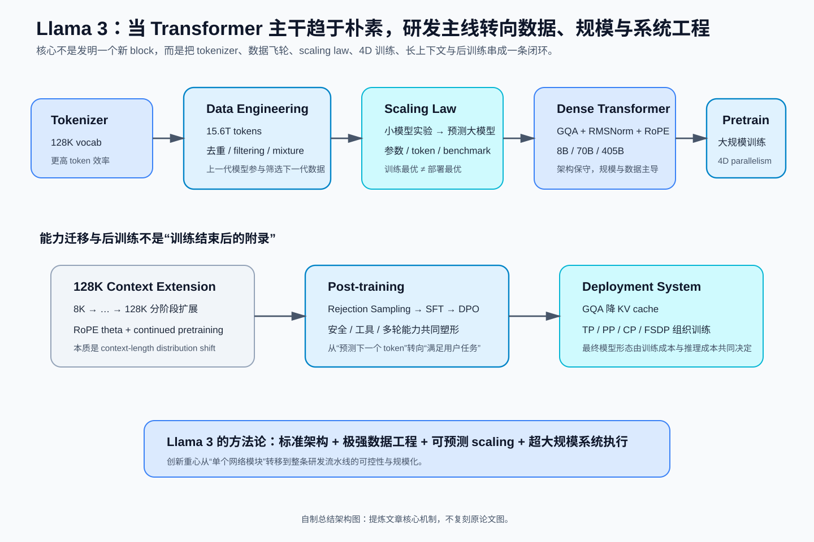
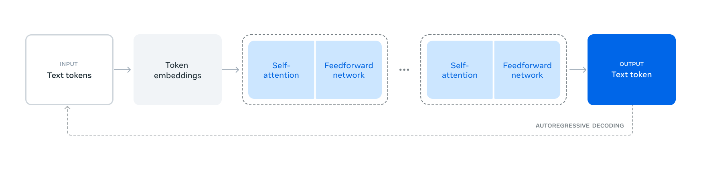
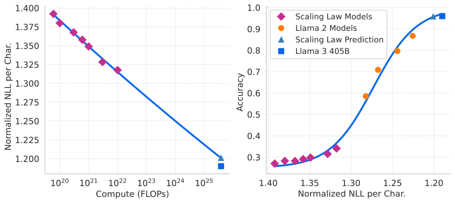
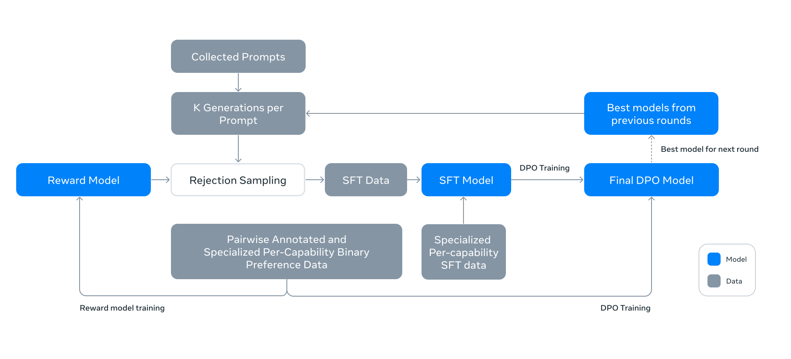

# Llama 3：当架构趋于朴素，数据、规模与系统工程成为主角

> **论文**：Llama Team, AI @ Meta, [The Llama 3 Herd of Models](https://arxiv.org/abs/2407.21783)，本文以 arXiv v3（2024-11-23）为基线。  
> **类型**：B · 完整模型技术报告。  
> **一句话定位**：Llama 3 最值得学习的不是某个全新的 Transformer block，而是 Meta 如何在相对标准的 dense Transformer 上，把 tokenizer、数据工程、scaling law、超大规模训练、128K 长上下文、RS/SFT/DPO 后训练与 405B 推理系统串成一套完整的大模型研发方法论。

这篇报告很适合接在 DeepSeek 主线之后读。

DeepSeek-V2 和 DeepSeek-V3 展示的是一条强烈的 architecture–system co-design 路线：

~~~text
Transformer
  ↓
MLA
  ↓
DeepSeekMoE
  ↓
routing / expert parallel / communication
  ↓
FP8 training / MTP
~~~

Llama 3 则选择另一种路线：

~~~text
相对标准的 dense Transformer
  ↓
减少架构变量与工程复杂度
  ↓
把主要研发预算放到
data + scale + stability + post-training + inference
~~~

论文在引言中把关键杠杆概括为三项：**Data、Scale、Managing complexity**。

所以本文真正要回答的问题不是“Llama 3 又发明了什么层”，而是：

> **当 Transformer 骨干已经足够成熟以后，怎样把模型研发从设计一个网络升级为设计整套数据—训练—系统—后训练—推理生产线？**

---

## 阅读导航

建议先读过：

- [Transformer](../../A/03-transformer/A013-transformer-attention-is-all-you-need.md)：Llama 3 的语言骨干仍是 decoder-only Transformer；
- [RoPE](../../A/03-transformer/A014-roformer-rope.md)：Llama 3 继续使用 RoPE，并把 base frequency 提高到 500,000；
- [GQA](../../A/04-efficient-attention/A020-gqa.md)：8B、70B、405B 都使用 8 个 KV heads；
- [AdamW](../../A/01-foundations/A003-adamw.md)：405B 预训练使用 AdamW；
- [DeepSeek-V3](B009-deepseek-v3.md)：用于对照 dense + data/scale 与 MoE + architecture/system co-design 两条现代 LLM 路线；
- [DeepSeek-R1](B010-deepseek-r1.md)：用于对照 Llama 3 的 RS/SFT/DPO 与 reasoning RL；
- [DeepSeekMath / GRPO](../../A/08-post-training/A051-deepseekmath-grpo.md)：比较构造高质量训练数据与直接 policy optimization 时回查。

本文重点回答：

1. 为什么 Llama 3 主动强调自己是相对标准的 dense Transformer？
2. 128K vocabulary 为什么不只是 tokenizer 工程，而是训练计算效率的一部分？
3. 15.6T tokens 的价值为什么绝不等于数据越多越好？
4. scaling law 怎样从小模型实验推到 405B？
5. 为什么论文预测 compute-optimal 是约 402B / 16.55T，却最终训练 405B / 约 15.6T？
6. 为什么 8B / 70B 可以训练得超过 compute-optimal token 数？
7. 128K context 为什么不是把 RoPE 参数一改就结束？
8. TP / CP / PP / FSDP 为什么要同时存在？
9. Reward Model、Rejection Sampling、SFT、DPO 分别负责什么？
10. 为什么 Llama 3 的 reasoning 提升不能简单写成用了 DPO？
11. 405B 为什么 BF16 推理必须跨机器，而 FP8 为什么不能只看 benchmark 分数？
12. Llama 3 与 DeepSeek-V3 的差别反映了怎样的系统设计取舍？

---

## 总结架构图

> **教学总结图**：把 tokenizer、数据飞轮、scaling law、4D 并行、长上下文与后训练串成 Llama 3 的完整研发系统。

## 1. 先定性：Llama 3 不是一篇“新架构论文”

论文在架构章节直接说明：Llama 3 使用标准的 dense Transformer architecture，并没有在模型结构上显著偏离 Llama / Llama 2；性能提升主要来自数据质量、多样性与更大的训练规模。

这个定位非常重要。

读现代模型报告时，很容易形成一种错误习惯：

~~~text
模型更强
  ↓
一定是 block 里多了某个新模块
  ↓
继续找新 Attention / 新 FFN / 新 Norm
~~~

Llama 3 给出的答案不同：

~~~text
模型能力提升
不一定主要来自 architecture novelty

也可能主要来自：
data pipeline
+ tokenizer
+ data mix
+ scaling law
+ compute scale
+ training stability
+ post-training data
+ inference engineering
~~~

所以如果把 Llama 3 读成“405B 参数的 Llama 2”，会漏掉它最重要的工程价值。

### 1.1 Herd of Models 是什么？

论文讨论的是一个模型族：

- 8B；
- 70B；
- 405B；

并区分 pretrained/base 与 post-trained/instruct。

论文还说明，报告中的实验结果针对 Llama 3.1 系列，但全文为了行文简洁统一简称为 Llama 3。因此本文后续也沿用论文自己的命名语境。

---

## 2. 先看完整系统：真正的数据流不是 token → Transformer → token

原论文 Figure 1 从网络结构上看非常朴素：

*原论文 Figure 1。它证明的是：语言模型本体仍然是 autoregressive Transformer，预训练核心目标仍是 next-token prediction。它并不展示后面真正复杂的数据工程、长上下文继续预训练与 post-training 系统。*

真正完整的 Llama 3 pipeline 更应该展开成：

~~~{mermaid}
flowchart TD
    RAW["Raw multilingual / code / math / web data"]
    CLEAN["Extraction + dedup + filtering"]
    MIX["Data mix selection"]
    TOK["128K tokenizer"]
    PRE["Initial pre-training"]
    LC["Long-context continued pre-training 8K → 128K"]
    AN["Annealing + checkpoint averaging"]
    BASE["Llama 3 Base"]
    RM["Reward Model"]
    RS["Rejection Sampling"]
    SFT["SFT"]
    DPO["DPO"]
    CHAT["Llama 3 Instruct"]
    INF["BF16 / FP8 inference"]

    RAW --> CLEAN --> MIX --> TOK --> PRE --> LC --> AN --> BASE
    BASE --> RM
    BASE --> RS
    RM --> RS
    RS --> SFT --> DPO --> CHAT --> INF
~~~

到了 405B 这个尺度，模型已经不能只被理解成一组 weight matrices。

更合理的定义是：

$$
\text{Model System}
=
\text{Architecture}
+
\text{Data Pipeline}
+
\text{Training Recipe}
+
\text{Distributed Runtime}
+
\text{Post-training}
+
\text{Inference Runtime}.
$$

这就是这篇论文最重要的阅读视角。

---

## 3. 骨干架构：变化很少，但每个变化都对应明确成本

Llama 3 三个规模的关键参数如下。

| 项目 | 8B | 70B | 405B |
|---|---:|---:|---:|
| Transformer layers | 32 | 80 | 126 |
| Model dimension | 4096 | 8192 | 16384 |
| FFN dimension | 14336 | 28672 | 53248 |
| Attention heads | 32 | 64 | 128 |
| KV heads | 8 | 8 | 8 |
| Peak LR | 3e-4 | 1.5e-4 | 8e-5 |
| Activation | SwiGLU | SwiGLU | SwiGLU |
| Vocabulary | 128K | 128K | 128K |
| Position | RoPE, theta=500000 | 同左 | 同左 |

论文相对 Llama 2 明确列出的主要修改只有四类：

1. 全规模使用 GQA；
2. packed sequence 中加入 document boundary attention mask；
3. vocabulary 扩大到 128K；
4. RoPE base frequency 提高到 500,000。

这四项看起来分散，其实分别对应四种非常具体的成本：

~~~text
GQA
→ Decode KV Cache / memory bandwidth

Document mask
→ Packed documents 之间错误的信息泄漏

128K tokenizer
→ 同一段语义文本被切成多少个 token

RoPE theta
→ 位置旋转频率与更长 context 的适配
~~~

所以 Llama 3 的架构思想不是为了创新再塞一个 module，而是只改那些能直接对应到训练/推理成本、数据语义或上下文扩展问题的接口。

---

## 4. GQA：为什么 405B 仍然只保留 8 个 KV heads？

如果 [GQA](../../A/04-efficient-attention/A020-gqa.md) 已经读过，这里不重新推导 Attention。

405B 的配置是：

$$
H_q=128,
\qquad
H_{kv}=8.
$$

也就是大约每 16 个 query heads 共享一组 K/V heads。

增量解码时，历史 token 的 K/V 需要缓存。粗略写成单层、单 token KV cache：

$$
M_{\text{KV/token/layer}}
\approx
2H_{kv}d_hb.
$$

405B 的 head dimension：

$$
d_h
=
\frac{16384}{128}
=
128.
$$

若按 BF16 粗估：

$$
b=2\ \text{Bytes}.
$$

于是单层单 token：

$$
M_{\text{layer}}
=
2\times8\times128\times2
=
4096\ \text{Bytes}.
$$

126 层：

$$
M_{\text{token}}
=
4096\times126
=
516096\ \text{Bytes}
\approx504\ \text{KiB}.
$$

如果 batch=1、context=128K，只做最朴素的 raw KV 量级估算：

$$
504\ \text{KiB}\times131072
\approx63\ \text{GiB}.
$$

这不是部署时的精确显存公式，因为没有加入 allocator、metadata、batch、padding、quantized KV、runtime workspace、paging 与并行 placement。

但它足够说明：

> **即使已经使用 GQA，405B × 128K 的 KV state 仍然是巨大的系统对象。**

如果像普通 MHA 一样有 128 个 KV heads，仅 KV head 数这一项就是当前配置的 16 倍。

所以 GQA 在这里不是 Attention 小技巧，而是在控制 128K decode 的历史状态规模。

如果继续追问“既然 GQA 还是需要保存完整历史 K/V，为什么 DeepSeek 要进一步做 MLA”，直接回 [DeepSeek-V2](B008-deepseek-v2.md)。

---

## 5. 128K tokenizer：分词器其实也是计算预算分配器

Llama 3 的 vocabulary 为 128K：

- 约 100K token 来自 tiktoken vocabulary；
- 再增加约 28K token，提高非英语语言支持。

论文报告，在一组英语样本上，压缩率由：

$$
3.17\ \text{chars/token}
$$

提升到：

$$
3.94\ \text{chars/token}.
$$

假设一段文本有 $C$ 个字符，粗略 token 数：

$$
N_{\text{token}}
\approx
\frac{C}{r},
$$

其中 $r$ 是 chars/token。

于是：

$$
N_{\text{old}}
\approx
\frac{C}{3.17},
\qquad
N_{\text{new}}
\approx
\frac{C}{3.94}.
$$

比例：

$$
\frac{N_{\text{new}}}{N_{\text{old}}}
=
\frac{3.17}{3.94}
\approx0.805.
$$

对论文这组英语样本来说，同样字符量需要的 token 数大约减少 19.5%。

这不能直接翻译成 Transformer FLOPs 下降 19.5%，因为还有 embedding/output projection、sequence packing 与数据域差异等变量。

但它揭示了一个非常重要的第一性原理：

> **Tokenizer 决定现实文本中的信息，被离散成多少次模型计算步。**

因此 tokenizer 直接参与：

$$
\text{semantic information}
\rightarrow
\text{number of tokens}
\rightarrow
\text{training / inference compute}.
$$

---

## 6. Document mask：为什么 packed sequence 不能让不同文档互相看见？

大规模训练时，经常会把多个较短文档 pack 到一个固定长度 sequence：

~~~text
[Document A][Document B][Document C]
~~~

如果只使用普通 causal mask：

~~~text
B 后面的 token 可以 attention 到 A
C 后面的 token 可以 attention 到 A、B
~~~

但从数据语义看，A、B、C 本来是互相独立的 document。

因此 Llama 3 增加 document boundary mask：

~~~text
Doc A ── self-attention ──> Doc A
Doc B ── self-attention ──> Doc B
Doc C ── self-attention ──> Doc C

不同 document 之间：
attention blocked
~~~

论文观察到：普通短上下文预训练时影响有限，但长上下文 continued pre-training 时更重要。

context 越长，一条训练 sequence 越可能 pack 更多互不相关的 document。如果不隔离：

$$
\text{long sequence}
\neq
\text{long coherent context}.
$$

模型可能学到“前面碰巧被 pack 进来的随机网页，也是当前 token 的语义前文”。

所以长上下文训练不仅是把 sequence length 调大，还必须重新定义一条 sequence 内哪些 token 真正属于同一上下文。

---

## 7. 15.6T tokens：绝不是抓够数量就开训

Llama 3 405B 最终预训练约 15.6T tokens。

真正值得学习的是前面的数据处理链：

~~~text
Raw web / code / math / multilingual data
   ↓
PII / safety domain filtering
   ↓
custom HTML extraction
   ↓
URL-level dedup
   ↓
global MinHash document dedup
   ↓
aggressive line-level dedup
   ↓
heuristic filtering
   ↓
model-based quality filtering
   ↓
code / reasoning specialist classifiers
   ↓
multilingual quality ranking
   ↓
knowledge classification
   ↓
data-mix scaling experiments
   ↓
training corpus
~~~

### 7.1 三层去重解决的是不同问题

URL-level dedup 解决同一网页重复抓取。

Document-level dedup 使用 global MinHash 去除 URL 不同但正文高度相似的 near-duplicate documents。

Line-level dedup 则针对 navigation、cookie warning、模板、boilerplate、大规模重复日志等局部重复。论文在每 30M documents 的 bucket 内，会 aggressive 地删除出现超过 6 次的行。

论文甚至承认：这种 aggressive line dedup 会误删一部分频繁出现的高质量文本，但实验结果仍然支持这种取舍。

这非常典型：

> **数据清洗不是永远不误伤的完美分类器，而是 signal-to-noise trade-off。**

---

## 8. Model-based filtering：上一代模型开始参与制造下一代模型的数据

Llama 3 的数据流水线中有一个很重要的闭环：

~~~text
Llama 2
   ↓
给 cleaned web document 做 quality annotation
   ↓
训练 DistilRoBERTa quality classifier
   ↓
便宜地扫描海量网页
   ↓
训练 Llama 3
~~~

类似流程还用于 code、math、STEM reasoning。

于是已经出现：

$$
\text{previous-generation model}
\rightarrow
\text{data labels / filters}
\rightarrow
\text{next-generation model}.
$$

为什么不直接用 Llama 2 扫全部网页？因为成本。

更合理的结构是：

$$
\text{expensive teacher}
\rightarrow
\text{cheap classifier}
\rightarrow
\text{massive-scale filtering}.
$$

这可以理解为把强模型的判断能力蒸馏进数据基础设施。后训练阶段，这种“模型制造下一轮数据”的趋势会更强。

---

## 9. Data mix：互联网分布不等于训练分布

论文报告最终数据 mix 大约为：

| 类型 | 比例 |
|---|---:|
| General knowledge | 50% |
| Math / reasoning | 25% |
| Code | 17% |
| Multilingual | 8% |

这不是互联网原始数据的自然比例。

Meta 会主动 downsample 过度出现的类别，提高数学、reasoning 与代码，控制 multilingual token 比例，并在后期增加较新的 web data、减少后来识别出的低质量来源。

虽然预训练 objective 仍然只是 next-token prediction：

$$
\mathcal L_{\text{NTP}}
=
-\sum_t \log p_\theta(x_t|x_{<t}),
$$

但最终学习对象取决于训练分布：

$$
p_{\text{train}}(x).
$$

所以：

> **训练目标函数一样，绝不意味着训练出来的能力一样。**

data mix 本身就是模型设计。

---

## 10. Scaling Law：405B 不是先拍脑袋决定，再去找数据

Llama 3 很值得学习的一部分，是 Meta 真正把 scaling law 当作工程决策工具。这里直接承接 [Kaplan Scaling Laws](../../A/02-text-representation/A009-kaplan-scaling-laws.md) → [Chinchilla](../../A/02-text-representation/A010-chinchilla-compute-optimal.md) 的方法谱系：不机械沿用旧系数，而是重新训练小模型、重新做 IsoFLOP 拟合，再外推到自己的旗舰配置。

团队训练了大量小规模实验：

- 模型从 40M 到 16B；
- compute budget 从 $6\times10^{18}$ 到 $10^{22}$ FLOPs。

对每个 compute budget：

~~~text
固定总 compute C
   ↓
改变 model size
   ↓
对应改变 token budget
   ↓
测 held-out NLL
   ↓
得到 IsoFLOPs curve
   ↓
找 curve minimum
~~~

这个 minimum 就是该 compute budget 下的 compute-optimal point。

然后拟合：

$$
N^\star(C)
=
AC^\alpha,
$$

其中 $N^\star(C)$ 是 compute-optimal training token 数。

论文拟合得到：

$$
\alpha=0.53,\qquad A=0.29.
$$

真正重要的不是死记 $A$，而是方法：

> **先用可承受的小模型实验估计 compute 增长时最优 token 数如何增长，再向旗舰预算外推。**

---

## 11. 为什么预测 402B / 16.55T，最后却训练 405B / 约 15.6T？

当：

$$
C=3.8\times10^{25}\ \text{FLOPs},
$$

scaling-law 外推给出大约：

- 402B parameters；
- 16.55T training tokens。

实际旗舰：

- 405B；
- 约 15.6T tokens。

这不是 scaling law 算错了。

论文指出：compute budget 越大，IsoFLOPs curve 在 minimum 附近越平。

~~~text
loss
 ^
 |            _______
 |         __/       \__
 |_______/_______________> parameter/token allocation
            optimum
~~~

当最优点附近非常平时，scaling law 提供的不是“必须严格训练 402.000B 参数”，而是：

> **这里是一片合理的设计区域，附近多种 parameter/token 配置的 loss 很接近。**

因此 scaling law 更像设计工具，而不是精确到最后一个参数的自然定律。

---

## 12. Scaling law 还能预测 benchmark，而不只是预测 pretraining loss

传统 scaling law 最自然的映射是：

$$
\text{training compute}
\rightarrow
\text{validation loss}.
$$

但团队真正想知道的是：

$$
\text{training compute}
\rightarrow
\text{ARC / MMLU / code / reasoning accuracy}.
$$

accuracy 离散而且不够平滑。

Llama 3 使用两级预测：

$$
\log C
\rightarrow
\text{normalized NLL of correct answer}
$$

再做：

$$
\text{normalized NLL}
\rightarrow
\text{benchmark accuracy}.
$$

第二步使用 scaling-law models 与已有 Llama 2 models 共同拟合 sigmoid。

原论文 Figure 4 展示 ARC Challenge：

*原论文 Figure 4。左图建立 compute → correct-answer NLL，右图再建立 NLL → accuracy。它支持的是：在这套 benchmark 与建模方法下，可以较早预测旗舰模型的大致下游表现；它不能证明所有 benchmark 都能由同一条曲线精确外推。*

为什么先经过 NLL？

因为 accuracy 可能出现：

~~~text
正确答案概率从 0.30 提到 0.45
但还没成为 argmax
→ accuracy 不变

继续提升并跨过决策边界
→ accuracy 突然跳变
~~~

NLL 通常提供更连续的中间信号。

所以先预测 smooth likelihood，再把 likelihood 映射到 discrete accuracy，比直接对 accuracy 做简单幂律拟合更自然。

---

## 13. Training-optimal 不等于 deployment-optimal

论文对 8B / 70B 的策略非常值得记住：这些较小模型会训练得比各自 compute-optimal token 数更久。

现实部署中用户经常已经固定只能跑 8B 或 70B。

这时目标不是：

$$
\min L
\quad
\text{s.t. fixed training compute},
$$

而更可能是：

$$
\min L
\quad
\text{s.t. fixed inference model size}.
$$

Compute-optimal 问的是：

> 给我固定训练算力，parameters 和 tokens 怎么配？

Deployment-optimal 问的是：

> 给我固定部署尺寸，我愿意多花多少训练算力，把这个尺寸榨得更强？

所以 smaller model overtrain 并不矛盾。

> **训练阶段的最优资源分配，不等于部署阶段的最优产品点。**

## 14. 预训练不是一段 15.6T token 从头跑到尾都不变的 loop

Llama 3 405B 的 recipe 分成三个主阶段：

~~~{mermaid}
flowchart LR
    A["Initial / main pre-training 4K → 8K"] --> B["Long-context continued pre-training 8K → 128K"]
    B --> C["Final annealing LR → 0"]
    C --> D["Checkpoint averaging"]
~~~

405B 使用 AdamW：

$$
\eta_{\max}=8\times10^{-5}.
$$

并采用：

- linear warmup 8,000 steps；
- cosine learning-rate decay；
- 总计约 1.2M steps。

batch 也会随训练阶段变化。

早期：

- batch = 4M tokens；
- sequence length = 4096。

训练 252M tokens 后：

- batch → 8M；
- sequence length → 8192。

训练到 2.87T tokens 后：

- batch → 16M tokens。

论文给出的目的很直观：

- 早期较小 batch：提高稳定性；
- 后期较大 batch：提高训练效率。

所以 batch size 不是训练开始前定死的常数，而是 phase-dependent variable。

---

## 15. 128K context：不是改一个 RoPE 参数，而是一次能力迁移

Llama 3 主训练阶段主要使用：

$$
L=8K.
$$

最终支持：

$$
L=128K.
$$

如果只把 RoPE base frequency 改大，然后直接宣布“支持 128K”，会漏掉真正的问题：

> **模型参数本身从来没有在 128K 条件分布下学会如何使用远距离信息。**

因此 Llama 3 在后期进行 targeted long-context continued pre-training。

为什么不从第一天就训练 128K？

Self-Attention 的核心 score matrix：

$$
QK^T\in\mathbb R^{L\times L}.
$$

基本规模随：

$$
O(L^2)
$$

增长。

从 8K 到 128K：

$$
\frac{128K}{8K}=16.
$$

仅 $L^2$ 项就是：

$$
16^2=256
$$

倍的尺度变化。

因此更合理的策略是：

> **先用较短 context 学绝大部分语言、知识和结构，再在后期把已经很强的模型迁移到长 context。**

---

## 16. 六阶段扩展：8K → 128K

405B 的 long-context extension 不是一步跳到 128K，而是分六阶段逐渐增加 context。

真正值得记忆的是验收条件。

每次扩大 context 后，要等到：

1. short-context evaluations 完全恢复；
2. 目标长度下 needle-in-a-haystack 能完整解决；

才继续扩大。

最终：

$$
8K
\rightarrow
128K.
$$

长上下文阶段使用约：

$$
800B\ \text{training tokens}.
$$

### 16.1 本质是 distribution shift

原先主要优化：

$$
p(x_{1:8192}).
$$

现在进入：

$$
p(x_{1:131072}).
$$

改变的不只是 tensor shape，还包括：

- position distribution；
- attention distance；
- document packing；
- long-range dependency；
- activation memory；
- parallelism strategy；
- optimization dynamics。

所以更准确的理解是：

> **长上下文扩展是一轮针对新输入分布的 continued pre-training。**

而不是把 max position 改成 131072。

---

## 17. RoPE theta=500000 到底扮演什么角色？

Llama 3 将 RoPE base frequency 提高到：

$$
\theta=500000.
$$

如果 RoPE 细节不熟，回 [RoPE 专题](../../A/03-transformer/A014-roformer-rope.md)。

这里只保留模型级理解。

提高 base parameter 会让一部分低频维度随 position 变化得更慢，从而更适合覆盖更长的位置尺度。

但必须明确：

$$
\text{RoPE hyperparameter change}
\neq
\text{long-context capability}.
$$

Llama 3 自己的流程已经说明：

$$
\text{Long Context}
=
\text{Position Parameterization}
+
\text{Continued Pre-training}
+
\text{Long Data}
+
\text{Document Mask}
+
\text{Context Parallelism}
+
\text{Long-context SFT}.
$$

---

## 18. 训练系统：405B 的问题已经变成怎样让 16K GPU 像一台机器

Llama 3 405B 最高使用约：

$$
16K\ \text{H100 GPUs}.
$$

每张 H100：

- 80GB HBM3；
- 700W TDP。

到了这个尺度，问题早已不是一个 GEMM 怎么写，而是：

- parameters 放不下；
- optimizer states 放不下；
- gradients 放不下；
- activations 放不下；
- long context 放不下；
- collective communication 成本巨大；
- checkpoint burst 会冲击 storage；
- network congestion；
- stragglers；
- GPU / HBM / NIC / switch 会持续故障。

因此 Llama 3 使用所谓 4D parallelism：

$$
\boxed{
TP\times CP\times PP\times DP
}
$$

其中 DP 采用 FSDP。

这一节先保留模型级视角；如果要把 TP / PP / CP / FSDP 的 tensor 切分、pipeline bubble、global batch、FSDP all-gather / reduce-scatter 与网络拓扑完整推导一遍，可直接跳到 [4D Parallelism：TP、PP、CP、FSDP 到底在切什么？](../../C/01-distributed-training/C001-4d-parallelism.md)。

原论文 Figure 5：

*原论文 Figure 5。读图关键不是记住 GPU0、GPU1 的编号，而是理解：同一批 GPU 同时被划进 TP、CP、PP、DP 四种不同通信群组，每种群组解决的瓶颈并不相同。*

---

## 19. 为什么需要四个并行维度？因为它们解决四种不同的“放不下”

### 19.1 TP：一个 layer 内的矩阵太大

Tensor Parallelism：

$$
W
\rightarrow
[W_1,W_2,\dots,W_p].
$$

多个 GPU 共同计算同一个 layer。

主要解决单层参数和矩阵乘法规模过大。

代价是 layer 内需要频繁 collective communication，因此 TP 尤其依赖高带宽低延迟互联。

### 19.2 PP：完整 layer stack 太深

Pipeline Parallelism 把不同层放到不同 device group：

~~~text
GPU group 0: layers 0 ... k
GPU group 1: layers k+1 ... 2k
GPU group 2: ...
~~~

主要解决整个 layer stack 放不下。

代价包括 pipeline bubble、stage imbalance 与 activation transfer。

### 19.3 CP：sequence 太长

Context Parallelism 切的是一个训练样本内部的 sequence：

~~~text
128K sequence
     ↓ split
device group 0: context shard 0
device group 1: context shard 1
...
~~~

主要解决长 sequence activation / attention state 太大。

因此 CP 在 128K 阶段从可有可无变成核心并行维度。

### 19.4 FSDP / DP：训练状态太大

FSDP 对 optimizer states、gradients、model states 做分片。

Llama 3 有一个很具体的 trade-off：forward 后不立即 reshard model parameters，从而避免 backward 时额外一次 all-gather。

也就是：

~~~text
更激进 reshard
→ 更省显存
→ backward 多一次通信

少 reshard
→ 多占显存
→ 少一次通信
~~~

这是典型的 memory–communication trade-off。

---

## 20. 三个真实配置，把 4D parallelism 看懂

论文给出的 405B 训练配置很有教学价值。

8K context / 8192 GPUs：

$$
TP=8,\quad CP=1,\quad PP=16,\quad DP=64.
$$

所以：

$$
8\times1\times16\times64=8192.
$$

8K context / 16384 GPUs：

$$
TP=8,\quad CP=1,\quad PP=16,\quad DP=128.
$$

所以：

$$
8\times1\times16\times128=16384.
$$

128K context / 16384 GPUs：

$$
TP=8,\quad CP=16,\quad PP=16,\quad DP=8.
$$

所以：

$$
8\times16\times16\times8=16384.
$$

注意发生了什么：

~~~text
8K context:
CP = 1
DP 很大

128K context:
CP = 16
DP 显著减少
~~~

因为 sequence 变长以后，单个训练样本本身的 context dimension 成为显存和计算瓶颈。

于是更多 GPU 必须用于切一个样本，而不能全部拿去复制更多 data replicas。

> **Parallel strategy 不能写死，它必须跟 workload shape 一起变化。**

---

## 21. MFU：GPU 数量不是吞吐，真正关心有多少峰值算力变成模型 FLOPs

论文报告这些配置的 BF16 Model FLOPs Utilization 大约为：

$$
38\%\sim43\%.
$$

其中：

- 8192 GPUs、8K context：约 43%；
- 16384 GPUs、8K context：约 41%；
- 16384 GPUs、128K context：约 38%。

MFU 粗略衡量：

$$
\text{MFU}
=
\frac{\text{useful model FLOPs}}
{\text{hardware theoretical peak FLOPs}}.
$$

不能把剩下的比例简单解释成全是网络浪费，因为它综合包含 communication、memory stalls、pipeline bubbles、synchronization、kernel inefficiency 与 runtime overhead。

真正要读懂的是：

> **GPU 数量翻倍，不代表 effective training throughput 也线性翻倍。**

---

## 22. 网络拓扑不是基础设施附录，而是 parallelism 的一部分

405B 训练主要使用 RoCE、400 Gbps interconnect 与三层 Clos network。

集群总规模约 24K GPUs，但 Llama 3 训练最高使用约 16K。

论文特别指出：

- pod 内具备 full bisection bandwidth；
- aggregation layer 有约 1:7 oversubscription。

这意味着跨 pod communication 与 pod 内 communication 不是同一种成本。

于是 TP / PP / DP / CP group 不能随便映射到物理 GPU。

更准确的系统逻辑是：

$$
\text{communication pattern}
+
\text{physical topology}
\rightarrow
\text{parallel group placement}.
$$

也就是说：

> **parallelism design 不只看 tensor shape，也要看网络层级。**

---

## 23. 超大规模训练最现实的一课：不是会不会坏，而是坏了怎么继续

论文给了非常少见的工程统计。

在 54 天 snapshot 中：

- 总 interruption：466；
- planned：47；
- unexpected：419。

unexpected 中约 78% 被归因于 confirmed / suspected hardware issues。

但显著 manual intervention 只需要 3 次，其余主要依靠自动化处理。

这意味着：

> **16K GPU synchronous training 不可能把所有机器永不故障当可靠性目标。**

真正可扩展的目标是：

~~~text
Failure is expected
       ↓
detect
       ↓
diagnose
       ↓
recover
       ↓
resume
~~~

论文涉及：

- 高频 checkpoint；
- PyTorch NCCL flight recorder；
- watchdog；
- collective tracing；
- communication state snapshot；
- straggler diagnosis；
- online configuration。

这已经是大型分布式系统，而不是单机训练脚本。

---

## 24. Post-training：Llama 3 为什么没有把 PPO 当主线？

Llama 3 的后训练和 [DeepSeek-R1](B010-deepseek-r1.md) 是非常好的对照。

它的主要 pipeline 是：

$$
\text{Reward Model}
\rightarrow
\text{Rejection Sampling}
\rightarrow
\text{SFT}
\rightarrow
\text{DPO}.
$$

而不是：

$$
\text{RM}
\rightarrow
\text{PPO}
\rightarrow
\text{Critic / GAE}
\rightarrow
\text{Policy Gradient}.
$$

原论文 Figure 7：

*原论文 Figure 7。Reward Model 在这里的重要角色之一，是对同 prompt 的多个 generations 进行排序并服务 rejection sampling；最终 preference alignment 主步骤是 DPO，而不是 PPO。*

---

## 25. 先把 Reward Model、RS、SFT、DPO 四个角色拆开

### 25.1 Reward Model

输入：

$$
(x,y),
$$

输出 preference score：

$$
r_\phi(x,y).
$$

它来自 human preference ranking。

Llama 3 的一部分 preference samples 甚至有三级顺序：

$$
\text{edited}
>
\text{chosen}
>
\text{rejected}.
$$

### 25.2 Rejection Sampling

对同一个 prompt $x$，从当前或最近的强 policy 中采样：

$$
y_1,\dots,y_K.
$$

论文中典型：

$$
K=10\sim30.
$$

然后 RM 打分：

$$
r_\phi(x,y_i).
$$

选择高质量 candidate：

$$
y^\star
=
\arg\max_i r_\phi(x,y_i).
$$

这一步本身不直接更新 policy 参数。

它是在生成新的高质量监督 target。

### 25.3 SFT

把 rejection-sampled responses、synthetic examples 与少量 human-curated data 组成监督数据。

然后：

$$
\mathcal L_{\text{SFT}}
=
-\sum_t
\log\pi_\theta(y_t|x,y_{<t}),
$$

并 mask prompt token loss。

### 25.4 DPO

DPO 使用：

$$
(x,y_w,y_l)
$$

这样的 preference pair，直接推动 policy 对 chosen 与 rejected 的相对偏好。

整条链可以记成：

~~~text
RM
→ 哪个 generation 更好？

RS
→ 从 K 个 generation 中挑出高质量行为

SFT
→ 模仿这些高质量行为

DPO
→ 在 preference pair 上进一步拉开 chosen / rejected
~~~

---

## 26. Llama 3 的 Reward Model 不是 PPO Critic

如果刚学完 RLHF/PPO，很容易看到 Reward Model 就自动脑补 Actor-Critic。

这里必须拆开。

PPO 中通常有两个不同对象。

Reward Model 给完整或部分 response 提供外部偏好奖励：

$$
r_\phi(x,y).
$$

Value / Critic 则估计当前 policy 下某个 state 的 expected future return：

$$
V_\psi(s_t).
$$

Llama 3 主后训练路线中虽然有 Reward Model，但并没有把 learned Critic + PPO policy-gradient 当主要优化路径。

RM 更多用于 ranking、rejection sampling 与 data quality signal。

最终主更新是 SFT + DPO。

所以：

> **有 Reward Model，不等于在做 PPO，也不等于存在 Critic。**

如果要重新看 Critic / advantage / group-relative baseline 的区别，回 [DeepSeekMath / GRPO](../../A/08-post-training/A051-deepseekmath-grpo.md)。

---

## 27. 为什么 Rejection Sampling 很适合已经很强的大模型？

假设模型面对一个 prompt 时：

~~~text
sample 1 → 错
sample 2 → 一般
sample 3 → 正确但表达不好
sample 4 → 很好
sample 5 → 错
...
~~~

这时模型的问题未必是完全不会生成高质量答案，也可能只是高质量答案的概率还不够高。

RS 的思路就是：

$$
\text{sample many}
\rightarrow
\text{select good}
\rightarrow
\text{train on good}.
$$

它把模型已有的低概率优质行为重新转化为更高频监督数据。

因此 RS 与 reasoning RL 的 rollout filtering 在结构上有共同点：

~~~text
current policy
→ multiple trajectories
→ external quality signal
→ favor better trajectories
~~~

但更新机制不同。

Llama 3：

~~~text
sample
→ select
→ rebuild SFT / preference data
→ supervised / preference optimization
~~~

DeepSeek-R1：

~~~text
rollout
→ reward
→ GRPO policy optimization
→ reconstruct SFT data
→ more RL
~~~

---

## 28. RS 为什么会把 PagedAttention 从 serving 技术变成 training infrastructure？

每个 prompt 要生成：

$$
K=10\sim30
$$

个 responses。

这些 responses 共享同一个 prompt prefix。

如果每条 generation 都独立复制一份 prompt KV，就会造成大量重复 cache。

PagedAttention 可以让多个 generation 共享 prompt 对应的 KV pages：

~~~text
shared prompt KV pages
        │
        ├── continuation 1
        ├── continuation 2
        ├── continuation 3
        └── ...
~~~

论文还会根据可用 cache capacity 动态调度请求，并通过 maximum output length 避免 swap-out。

最终报告 rejection-sampling throughput 提升超过 2×。

这揭示了一个非常现代的大模型系统事实：

> **一旦后训练需要海量 sampling，serving runtime 就直接成为 training infrastructure。**

因此 PagedAttention 这类技术绝不只属于产品上线。

## 29. DPO：本文只讲它在 Llama 3 中承担什么

Llama 3 最终 preference alignment 采用 DPO。

论文给出的工程理由包括：

- 相比他们测试的 on-policy PPO，需要更少 compute；
- 在他们的实验里更适合当前 alignment pipeline；
- instruction-following benchmark 上表现较好。

这里先把 DPO 理解成：

> **直接从 preference pair 更新语言模型相对偏好的方法。**

完整数学推导应该单独成为 A 类方法专题，而不是硬塞进 B 类模型报告。

但 Llama 3 做的两个工程修改非常值得保留。

### 29.1 Mask formatting tokens

新 chat protocol 包含 header token、source/destination token、termination token。

这些 special tokens 往往同时存在于 chosen 与 rejected response 中。

DPO 是 contrastive objective，所以公共 formatting token 可能面对与内容 preference 无关的冲突梯度。

论文观察到让它们直接进入 loss 会增加 tail repetition 与过早 termination，因此把这些格式 token mask 掉。

背后的原则是：

> **不要让 preference loss 去学习一个与 preference 无关、但在两边大量共享的 protocol token。**

### 29.2 给 chosen sequence 增加 NLL regularization

Llama 3 在 chosen sequence 上额外加入：

$$
0.2\mathcal L_{\text{NLL}}.
$$

因为 preference objective 重点关心 chosen 与 rejected 的相对关系。

相对差值改善并不严格保证 chosen response 自己的 absolute log probability 一定朝期待方向变化。

所以加入 chosen NLL：

- 维持 desirable format；
- 稳定训练；
- 避免 chosen likelihood 出现不希望的下降。

这再次说明：

> **relative objective 和 absolute behavior 不是一回事。**

---

## 30. 六轮迭代：Post-training 不是一次 SFT + 一次 DPO

论文共进行六轮迭代式后训练。

~~~{mermaid}
flowchart LR
    M["Current best models"] --> A["New preference annotations"]
    M --> S["Synthetic generations"]
    A --> RM["Reward Model"]
    S --> RS["Rejection Sampling"]
    RM --> RS
    RS --> FT["SFT"]
    A --> D["DPO"]
    FT --> D
    D --> N["Next-round better models"]
    N --> M
~~~

这已经是清晰的数据飞轮：

$$
\text{better model}
\rightarrow
\text{better synthetic data}
\rightarrow
\text{harder prompts}
\rightarrow
\text{better labels}
\rightarrow
\text{better model}.
$$

论文还指出 DPO 更偏向使用最近批次 preference data，动机是让训练数据更接近当前 policy distribution。

这和 RL 中的 distribution shift 是同一个底层问题，只是这里的解决方式不是 importance sampling，而是持续刷新、淘汰过旧数据。

---

## 31. Llama 3 的 reasoning 提升究竟来自哪里？

如果把 Llama 3 简化成“用了 DPO，所以 reasoning 更强”，会漏掉论文真正的大部分工作。

Reasoning data pipeline 包括：

- 从数学相关预训练语料构造 QA；
- 针对模型薄弱 skill 主动收集 human prompts；
- 生成 step-by-step reasoning traces；
- 用 final answer correctness 过滤；
- self-verification；
- outcome reward models；
- step-wise reward models；
- 对困难问题使用 MCTS + learned step-wise RM；
- text reasoning 与 Python execution interleave；
- 利用错误 generations 构造 error-correction data。

所以更准确地写：

$$
\text{Reasoning Capability}
=
\text{Base Capability}
+
\text{Targeted Data}
+
\text{Trajectory Generation}
+
\text{Verification}
+
\text{Execution Feedback}
+
\text{SFT}
+
\text{Preference Optimization}.
$$

而不是：

$$
\text{Reasoning}
=
\text{DPO}.
$$

---

## 32. 这和 DeepSeek-R1 的 reasoning 路线差在哪里？

两边都大量使用 sampling、filtering、synthetic trajectories、stronger-model data generation 与 verifier/reward signal。

但优化中心不同。

### Llama 3

~~~text
generate trajectories
→ clean / verify / rank
→ construct SFT + preference data
→ SFT / DPO
~~~

### DeepSeek-R1

~~~text
generate reasoning rollouts
→ reward
→ GRPO policy optimization
→ reconstruct SFT data
→ more RL
~~~

| 维度 | Llama 3 | DeepSeek-R1 |
|---|---|---|
| 后训练中心 | 数据飞轮 + SFT/DPO | reasoning RL + 多阶段数据重构 |
| RM / verifier | ranking、RS、quality filtering | 更强调 verifiable reward 与 RL |
| PPO Critic | 非主线 | GRPO 同样不需要 learned critic |
| policy gradient | 非核心 | 核心 |
| reasoning traces | 合成、验证、PRM/MCTS、execution feedback | RL rollouts + cold-start/SFT reconstruction |
| 报告中心 | 通用 assistant 多能力 | reasoning policy 的强化 |

这不是优劣排名，而是说明：

> **相同的让模型更会推理，可以把优化预算放在完全不同的环节。**

---

## 33. 长上下文后训练：预训练学会 128K，不代表 SFT 后还保得住

论文有一个很重要的观察。

模型已经在 pre-training 阶段扩展到 128K。

但是如果后续 SFT 只使用 short-context data，long-context capability 会显著回退。

因为 SFT 又在改变参数：

$$
\theta_{\text{long-pretrain}}
\rightarrow
\theta_{\text{short-SFT}}.
$$

当优化器长期只收到 short-context gradient，参数会继续朝 short-context objective 更合适的方向移动。

因此 Llama 3 加入 synthetic long-context SFT data，包括：

- long-document QA；
- hierarchical summarization；
- repository-level code reasoning。

最终 ablation 中，一个很有意思的比例是：

$$
0.1\%
$$

synthetic long-context data 混入原 short-context data，可以较好平衡两类能力。

这说明：

> **维持一种能力未必需要大量样本，但需要持续给优化器“别把这个能力忘掉”的梯度信号。**

---

## 34. Tool use：工具能力首先是协议 + 数据，不是新增一个 tool layer

Llama 3 为 tool use 设计新的 chat protocol：

- header tokens；
- source / destination；
- termination tokens；
- multi-message turn。

普通文本 completion 是：

~~~text
user
↓
assistant text
~~~

工具交互则可能是：

~~~text
user
↓
assistant reasoning
↓
tool call
↓
tool output
↓
assistant reasoning
↓
another tool call
↓
final answer
~~~

因此输出空间从自然语言 token sequence 扩展成 protocol-constrained message sequence。

但模型骨干仍然是 Transformer。

Tool ability 主要通过 protocol、synthetic trajectories、human annotation、preference data 与 system prompt 训练出来。

论文训练的 core tools 包括 search、Python interpreter 与 Wolfram Alpha，并支持 single call、nested call、parallel call、multi-turn function calling、multi-step planning 与 file analysis。

这为后面学习 Agent 建立了非常好的基线：

> **先让语言模型学会如何表达 action，再由 runtime 真正执行 action。**

---

## 35. 405B 推理：为什么 BF16 连一台 8×H100 都放不下？

先做最粗参数内存估算。

405B parameters，BF16：

$$
2\ \text{Bytes/parameter}.
$$

仅 raw weights：

$$
405\times10^9\times2
\approx810\ \text{GB}.
$$

一台 8×H100，每张 80GB：

$$
8\times80
=
640\ \text{GB}.
$$

还没有加入 KV cache、runtime buffers、activation、communication workspace 与 allocator fragmentation。

因此：

$$
810\text{ GB}>640\text{ GB}.
$$

一台 8×H100 机器从 raw weight 量级上就已经放不下。

论文 BF16 inference 因此使用：

$$
16\ \text{GPUs}
$$

跨两台机器。

---

## 36. 为什么节点内 TP，节点间 PP？

单机内部 8 张 H100 通过 NVLink 连接，带宽高、延迟低。

适合 Tensor Parallelism，因为 TP 会在 layer 内高频做 collective。

跨机器网络带宽更低、延迟更高，于是更适合 Pipeline Parallelism：

~~~text
Node 0:
layers 0 ... k

      activation transfer

Node 1:
layers k+1 ... end
~~~

跨节点主要传 stage boundary activation，而不是每层都做高频 tensor collective。

这里可以抽象出一条非常通用的系统原则：

> **通信频率越高的 parallel dimension，越应该映射到越快的互联层级。**

这与前面的 topology-aware 4D parallelism 是同一原则在 inference 上的再次出现。

---

## 37. 为什么 inference pipeline bubble 和 training 不一样？

训练 pipeline 有 forward、backward 与 pipeline flush，所以 bubble 是核心效率问题。

Inference 没有 backward，因此可以利用 micro-batching：

~~~text
microbatch 1 → stage 0 → stage 1
microbatch 2 → stage 0 → stage 1
microbatch 3 → ...
~~~

让 pipeline stages 更持续工作。

代价是更多 synchronization，individual request latency 可能上升；收益是 throughput 上升。

因此仍然是：

$$
\text{Latency}
\leftrightarrow
\text{Throughput}.
$$

系统优化不是一个数字越小越好，而是在目标 workload 下找 Pareto trade-off。

---

## 38. FP8 inference：为什么不是所有矩阵直接 cast 成 FP8？

Llama 3 405B 在 H100 上探索 FP8 inference。

它并没有粗暴地把全模型都量化。

主要策略：

- FFN 中大部分 weights / activations → FP8；
- self-attention parameters 不做同样量化；
- 第一层和最后一层 Transformer 保留高精度；
- dynamic scale 设置 upper bound 1200；
- 使用 row-wise scale，而不是整个 tensor 只用一个 scale。

为什么第一层/最后一层保留高精度？

这是论文的经验性工程选择，不能扩写成“所有 Transformer 的首尾层都有数学定理保证更敏感”。

准确表述应该是：

> **在 Llama 3 405B 的实验中，团队观察到这些边界层的量化更容易影响输出质量，因此选择跳过。**

---

## 39. Benchmark 不掉点，仍然可能有严重量化问题

论文观察到：一些 FP8 配置在标准 benchmark 上看起来与 BF16 几乎等价，但仍可能偶发 corrupted responses。

这就是 average benchmark 的盲区。

假设 99.9% response 正常，但 0.1% 出现严重异常。

如果 benchmark 样本不大、只看平均 accuracy、又不覆盖异常 token distribution，就可能完全看不见。

因此 Meta 比较了：

$$
100{,}000
$$

条 BF16 / FP8 responses 的 reward-model score distributions。

这比只看一个 benchmark average 更适合检测输出分布尾部有没有被量化破坏。

这是一条非常适合迁移到机器人、部署和控制系统的经验：

> **鲁棒性评估要看 distribution、tail 和 failure mode，而不只看 mean metric。**

---

## 40. Llama 3 与 DeepSeek-V3：两条现代 LLM 设计路线

现在可以把两个模型放进同一个 design space，而不是做排行榜。

### Llama 3

~~~text
standard dense Transformer
        ↓
reduce architecture complexity
        ↓
scale data + compute
        ↓
strong filtering / data mix
        ↓
large-scale stable training
        ↓
RS + SFT + DPO
~~~

### DeepSeek-V3

~~~text
Transformer
   ↓
MLA + DeepSeekMoE
   ↓
reduce active compute / KV state
   ↓
routing + expert parallel
   ↓
FP8 training + MTP
   ↓
SFT + GRPO
~~~

| 维度 | Llama 3 405B | DeepSeek-V3 |
|---|---|---|
| Backbone | Dense Transformer | Sparse MoE Transformer |
| Attention efficiency | GQA | MLA |
| FFN | Dense SwiGLU | DeepSeekMoE |
| 规模策略 | 大量 dense compute | total params 大，active params 受控 |
| 设计中心 | data + scale + stability | architecture + system co-design |
| 长上下文 | staged continued pre-training 到 128K | MLA / RoPE extension 与对应训练 |
| Post-training | RM + RS + SFT + DPO | SFT + GRPO 等 |
| 典型系统问题 | 4D parallelism / huge dense model | expert routing / all-to-all / load balance |

这张表的目的不是决定谁更好。

真正应该学到的是：

> **相同的训练强大 Transformer 目标，可以通过非常不同的复杂度预算实现。**

---

## 41. 为什么 Llama 3 没有用 MoE？

论文给出的设计倾向是：为了最大化训练稳定性并控制开发复杂度，旗舰模型选择相对标准的 dense Transformer，而不是 MoE。

这不等于“MoE 不稳定，所以不应该使用”。

因为 [DeepSeekMoE](../../A/05-moe/A034-deepseekmoe.md) 与 DeepSeek-V3 已经展示了另一条可行工程路线。

更准确的理解是：

$$
\text{architecture choice}
=
f(
\text{infrastructure},
\text{reliability target},
\text{training budget},
\text{serving target},
\text{engineering complexity}
).
$$

Llama 3 把更多复杂度预算投入 data、scaling、dense distributed training、post-training data 与 reliability。

DeepSeek 则愿意承担 expert routing、all-to-all、load balancing、MLA implementation，来换取另一种 compute / memory 结构。

---

## 42. 多模态部分应该怎样放进技术谱系？

论文后半还讨论 image、video 与 speech。

但有一个重要证据边界：

> 这些 multimodal extensions 在报告中仍属于开发与研究展示，不能把整篇 Llama 3 语言主线简单改写成一个已经完整发布的 VLM。

其探索路线更接近 compositional approach：

~~~text
pretrained Llama language model
        +
vision encoder
        +
cross-attention adapter
        +
vision post-training
~~~

语音侧则可以抽象成：

~~~text
speech encoder
   ↓
adapter
   ↓
language-model representation space
~~~

这里最值得带走的启示是：

> **一个强语言 backbone 可以作为 multimodal system 的语义核心，再通过 encoder / adapter / cross-attention 接入其他 modality。**

这条线等进入 VLM 主线时再展开，不在 LLM 模型报告里把视觉与语音章节全部塞进来。

---

## 43. 实验应该怎么读：不要把 benchmark table 读成排行榜

论文覆盖 general knowledge、code、math、reasoning、multilingual、long context、tool use、safety 与 human evaluation。

这些结果能够支持：

> Llama 3 在指定 evaluation protocols 下拥有较强的跨任务能力。

但不能直接推出它在所有现实任务中整体等价于或超过某个外部模型。

原因包括：

- benchmark protocol 差异；
- few-shot / CoT 设置差异；
- external model version 差异；
- contamination；
- automatic benchmark 与 human preference 衡量的属性不同。

更合理的读法是：

> **先看训练设计改变了哪些能力，再把 benchmark 当证据。不要把 leaderboard 反过来当成整篇论文的因果主线。**

---

## 44. 论文的核心论证链到底是什么？

### Claim 1：标准 dense Transformer 仍然可以显著扩展

证据包括 8B/70B/405B scaling、15.6T-token training，以及多类 benchmark 与 human evaluation。

它说明 architecture novelty 不是能力增长的唯一来源，但不能进一步夸大成 architecture 已经不重要。

### Claim 2：Data engineering 是模型能力的重要决定变量

证据包括多级 dedup、heuristic filters、model-based filters、data mix experiments、tokenizer compression 与 capability-specific curation。

其中很多属于工程组合，而不是严格单变量 causal ablation，因此更合理的结论是：

> 论文提供了大量一致的工程证据，说明 data quality / mix / scale 是 Llama 3 的核心研发杠杆。

### Claim 3：Scaling law 可以进入真实研发决策

证据链：

~~~text
small controlled runs
→ empirical fit
→ extrapolation
→ flagship design
→ final observation
~~~

包括 IsoFLOPs、402B/16.55T 外推、ARC forecast 与最终 405B training。

### Claim 4：16K GPU 训练可行，但可靠性必须靠系统工程

证据包括 4D parallelism、38–43% MFU、topology-aware network、interruption statistics 与 automated recovery。

最重要的不是某个 MFU 数字，而是超大规模 synchronous training 必须把 failure handling 设计成正常路径。

### Claim 5：Assistant 能力来自迭代 post-training 数据飞轮

证据包括 six rounds、RM、RS、SFT、DPO、synthetic data、capability-specific data generation 与 human preference refresh。

这说明 post-training 已经不是最后再微调一下的单阶段步骤。

---

## 45. 最容易学错的五个地方

### 错法 1：Llama 3 强主要是因为 405B 参数多

不完整。论文把 data quality、15.6T token scale、tokenizer、scaling 与 post-training 都当作核心变量。

### 错法 2：128K context 主要来自 RoPE theta=500000

不完整。真正的 128K 路线是：

$$
\text{RoPE}
+
\text{six-stage continued pre-training}
+
800B\text{ tokens}
+
\text{document mask}
+
\text{CP}
+
\text{long-context SFT}.
$$

### 错法 3：Reasoning 主要来自 DPO

过度简化。还包括 targeted reasoning data、generated trajectories、answer verification、PRM/ORM、MCTS、execution feedback 与 error correction。

### 错法 4：用了 Reward Model，所以就是 PPO / Actor-Critic

错误。RM 在 Llama 3 主线主要服务 ranking、rejection sampling 与 quality filtering，它不是 PPO Critic。

### 错法 5：Scaling law 给出唯一正确模型尺寸

错误。它给的是经验拟合下的 optimal region。论文甚至利用 high-compute IsoFLOPs minimum 周围较平这一点，实际选择 405B 而不是机械锁死 402B。

---

## 46. 把整篇论文压成一条因果链

~~~{mermaid}
flowchart TD
    A["成熟 dense Transformer 降低架构风险"] --> B["128K tokenizer"]
    B --> C["大规模数据清洗与质量过滤"]
    C --> D["Data mix + scaling-law experiments"]
    D --> E["405B / 15.6T / 3.8e25 FLOPs"]
    E --> F["4D parallelism + reliability engineering"]
    F --> G["Main pre-training"]
    G --> H["8K → 128K continued pre-training"]
    H --> I["Annealing + checkpoint averaging"]
    I --> J["Strong Base Model"]
    J --> K["RM + Rejection Sampling"]
    K --> L["SFT"]
    L --> M["DPO"]
    M --> N["General assistant + tool use"]
    N --> O["BF16 multi-node / FP8 inference"]
~~~

如果最后只记一句话：

> **Llama 3 的核心创新对象已经从 Transformer block 扩展到了整个 foundation-model production system。**

---

## 47. 读完以后应该建立的三个新概念

### 47.1 Data engineering 就是 model engineering

数据过滤、mix、tokenizer 并不是训练开始前的杂活。

它们直接定义：

$$
p_{\text{train}}(x).
$$

而模型学习的正是这个分布。

### 47.2 Scaling law 是设计工具，不是自然定律

它可以帮助决定 model size、token budget、benchmark forecast 与 data mix。

但它始终依赖当前 architecture、tokenizer、data distribution 与 compute regime。条件改变，拟合关系也可能改变。

### 47.3 Training / inference / post-training 正在合流

PagedAttention 看起来属于 serving，但在 Llama 3 中它又服务 RS。

FP8 看起来属于部署，但它需要新的 robustness evaluation。

4D parallelism 看起来属于训练系统，但它直接决定能不能训练 128K 405B。

所以现代 LLM 的真实边界越来越像：

$$
\text{algorithm}
\leftrightarrow
\text{data}
\leftrightarrow
\text{systems}.
$$

---

## 48. 从这里继续怎么读？

如果卡在 GQA / KV cache，回 [GQA](../../A/04-efficient-attention/A020-gqa.md)。

如果卡在 RoPE 与长上下文的关系，回 [RoPE](../../A/03-transformer/A014-roformer-rope.md)，再重新读本文长上下文部分。

如果想知道为什么 DeepSeek 不走 dense 405B 这条路，对照 [DeepSeek-V3](B009-deepseek-v3.md) 与 [DeepSeekMoE](../../A/05-moe/A034-deepseekmoe.md)。

如果想理解 post-training 为什么和 R1 完全不同，对照 [DeepSeek-R1](B010-deepseek-r1.md) 与 [DeepSeekMath / GRPO](../../A/08-post-training/A051-deepseekmath-grpo.md)。

如果卡在 DPO 数学，直接跳到 [Direct Preference Optimization](../../A/08-post-training/A052-dpo.md)：那里从 Bradley–Terry、KL-regularized RL 的 closed-form optimal policy 一直推到完整 DPO loss、reference policy、$\beta$ 与 gradient weighting。

如果继续现代完整模型主线，下一站是 **Qwen2.5 Technical Report**。

届时可以对照三种现代 LLM 研发范式：

~~~text
Llama 3
→ dense + data/scale + RS/SFT/DPO

Qwen2.5
→ dense/MoE family + multilingual/code/math + staged post-training

DeepSeek
→ MLA + MoE + system co-design + GRPO/reasoning RL
~~~

---

## 49. 最终自检

读完 Llama 3，至少应该能回答：

1. 为什么 Llama 3 的强大不能主要归因于一个新 architecture block？
2. 128K vocabulary 为什么会影响单位语义信息对应的 token compute？
3. URL / document / line dedup 分别解决什么问题？
4. 为什么互联网原始类别比例不应该直接作为训练 data mix？
5. model-based quality filter 为什么构成 model → data → model 飞轮？
6. IsoFLOPs curve 的 minimum 表示什么？
7. 为什么 scaling law 预测约 402B，而实际可以选择 405B？
8. training-compute optimal 与 inference-budget optimal 有什么区别？
9. 为什么小模型可以故意 overtrain？
10. 为什么 128K context 不能只改 RoPE？
11. 为什么 long-context extension 要检查 short-context recovery？
12. TP / CP / PP / FSDP 分别解决什么“放不下”？
13. 为什么 128K 配置把更多 GPU 分配给 CP？
14. 为什么 network topology 会影响 parallel group placement？
15. 为什么 16K GPU 系统必须把 failure 当成正常事件？
16. Reward Model 在 Llama 3 中为什么不是 PPO Critic？
17. RS 为什么能把低概率优质行为变成监督数据？
18. 为什么 RS 会需要 PagedAttention？
19. DPO 为什么还要补 chosen-sequence NLL regularization？
20. Llama 3 reasoning 的训练信号除了 preference 还有哪些？
21. 为什么 short-context SFT 会破坏 pretrained long-context capability？
22. tool use 为什么首先是 protocol 与 data 问题？
23. 为什么 405B BF16 raw weights 一台 8×H100 放不下？
24. 为什么跨节点更适合 PP，而节点内更适合 TP？
25. 为什么 FP8 量化不能只看 benchmark average？
26. Llama 3 与 DeepSeek-V3 分别把系统复杂度花在了哪里？

如果这些问题都能回答，Llama 3 就不再只是一个 405B 模型名，而是一套完整的现代 foundation-model engineering 方法论。

