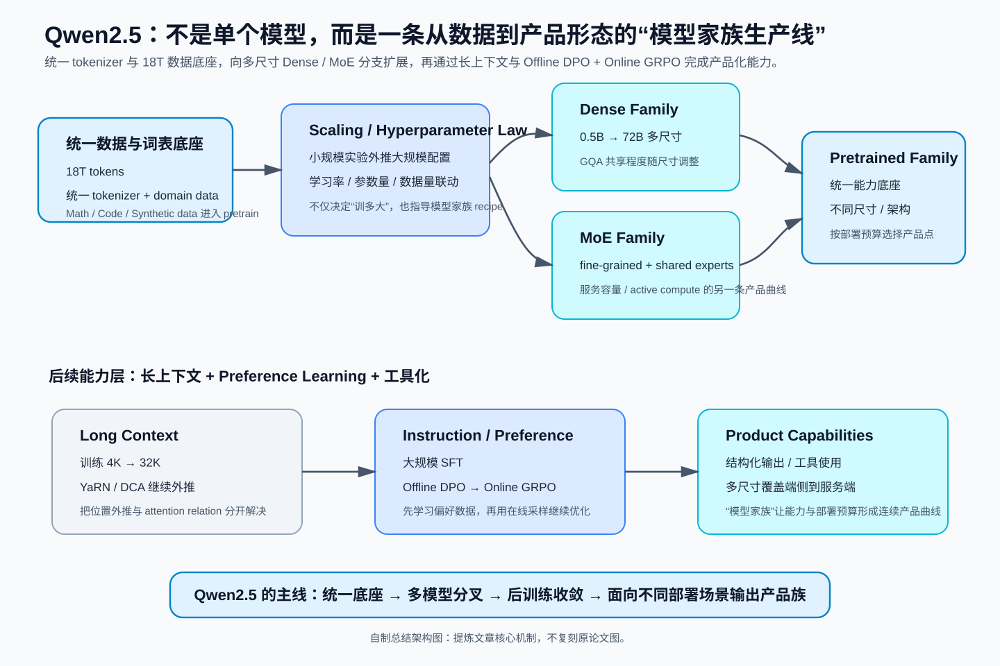
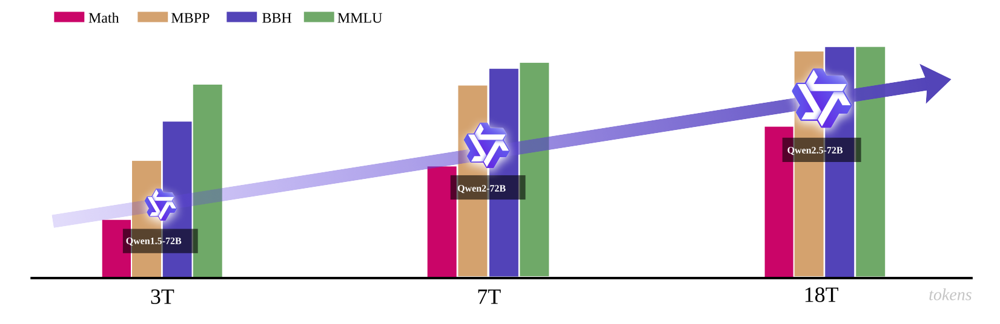
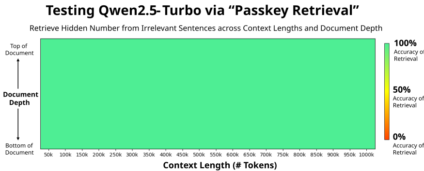
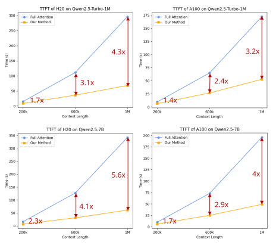

# Qwen2.5：从 18T 数据到 Offline DPO + Online GRPO，一套“模型家族化”的训练系统

> **论文**：[Qwen2.5 Technical Report](https://arxiv.org/abs/2412.15115)。  
> **类型**：B · 完整模型技术报告。  
> **一句话定位**：Qwen2.5 的重点不是发明一个新的 Transformer block，而是把**多尺寸 dense 模型、MoE 服务模型、18T token 数据工程、面向超参数的 scaling law、长上下文训练与外推、百万级 SFT 数据、Offline DPO、Online GRPO、结构化输出与工具使用**组织成一套覆盖训练到产品形态的模型家族。

如果刚读完 [Llama 3](B011-llama3.md)，Qwen2.5 是一个非常自然的下一站。

两篇报告都没有把“全新网络结构”当主角，但它们把研发复杂度放在了不同位置：

~~~text
Llama 3
→ dense Transformer
→ data + compute scaling
→ 4D parallelism
→ RS + SFT + DPO
→ 128K

Qwen2.5
→ dense family + proprietary MoE family
→ 18T data + domain-specialized data
→ hyperparameter scaling law
→ SFT + Offline DPO + Online GRPO
→ 128K / Turbo 1M
~~~

Qwen2.5 最值得研究的问题因此不是：

> “它比 Qwen2 多了哪个 layer？”

而是：

> **一个基础模型系列怎样同时覆盖不同参数规模、不同部署预算、不同领域能力、不同上下文长度，并让 pre-training、SFT、preference optimization、online RL 与 inference runtime 互相衔接？**

---

## 阅读导航

建议先知道：

- [Transformer](../../A/03-transformer/A013-transformer-attention-is-all-you-need.md)：Qwen2.5 dense 模型仍然是 decoder-only Transformer；
- [RoPE](../../A/03-transformer/A014-roformer-rope.md)：长上下文预训练会修改 RoPE base；
- [GQA](../../A/04-efficient-attention/A020-gqa.md)：Qwen2.5 全系列大量使用 GQA；
- [RMSNorm](../../A/03-transformer/A016-rmsnorm.md)：Qwen2.5 使用 pre-normalization；
- [DeepSeekMoE](../../A/05-moe/A034-deepseekmoe.md)：Qwen2.5 的 API MoE 模型采用 fine-grained expert segmentation 与 shared-expert 思路；
- [DeepSeekMath / GRPO](../../A/08-post-training/A051-deepseekmath-grpo.md)：Qwen2.5 Online RL 明确使用 GRPO；
- [Llama 3](B011-llama3.md)：用来对照 data scaling、long-context extension 与 post-training；
- [DeepSeek-R1](B010-deepseek-r1.md)：用来对照 reasoning-oriented RL 与 Qwen2.5 的通用 alignment RL。

---

## 总结架构图

> **教学总结图**：从 18T 数据与统一 tokenizer 到 Dense/MoE 家族、长上下文与 Offline DPO + Online GRPO，展示 Qwen2.5 的模型家族生产线。

## 1. 先看定位：Qwen2.5 不是一个模型，而是一个“产品曲线”

Qwen2.5 open-weight dense 系列包含：

- 0.5B；
- 1.5B；
- 3B；
- 7B；
- 14B；
- 32B；
- 72B。

每个主尺寸又包含：

- base；
- instruct；
- 多种量化版本。

同时 API 侧还有 proprietary MoE：

- Qwen2.5-Turbo；
- Qwen2.5-Plus。

这和只讨论一个旗舰 checkpoint 的论文不同。

Qwen2.5 的设计问题是：

$$
\text{one training family}
\rightarrow
\text{many deployment points}.
$$

用户的约束可能完全不同：

~~~text
本地 / 边缘
→ 0.5B / 1.5B / 3B / 7B

单机多卡 / 企业内部
→ 14B / 32B / 72B

云 API
→ Turbo / Plus MoE
~~~

所以 3B、14B、32B 被重新加入并不是“型号凑数”。

它们填的是 deployment cost curve 中原本缺失的中间点。

---

## 2. 整体主线：真正需要读的是六层系统

把整篇技术报告压成一条研发链：

~~~{mermaid}
flowchart TD
    RAW["Web / knowledge / math / code / multilingual data"]
    FILTER["Qwen2-Instruct filtering quality scoring + domain balance"]
    SYN["Synthetic data general model + math model + reward filtering"]
    MIX["18T-token staged data mixture"]
    PT["Pre-training"]
    LC["Long-context pre-training"]
    BASE["Qwen2.5 Base family"]

    SFTDATA["1M+ SFT examples math / code / long output / structured data / multilingual"]
    SFT["SFT"]
    OFF["Offline RL DPO on verified positive/negative pairs"]
    ON["Online RL GRPO + reward model"]
    INST["Qwen2.5 Instruct"]

    EX["YaRN + DCA length extrapolation"]
    INF["Sparse long-context inference MInference-derived"]

    RAW --> FILTER --> MIX --> PT
    SYN --> MIX
    PT --> LC --> BASE
    BASE --> SFT
    SFTDATA --> SFT
    SFT --> OFF --> ON --> INST
    INST --> EX --> INF
~~~

这条图里最重要的是区分：

1. **模型骨干结构**；
2. **pre-training data**；
3. **long-context training**；
4. **SFT capability engineering**；
5. **offline / online preference optimization**；
6. **inference-time context extension / acceleration**。

如果把它们混成“Qwen2.5 支持 1M context，而且用了 GRPO”，会失去所有工程逻辑。

---

## 3. Dense 骨干：没有换掉 Transformer，而是在成熟 recipe 上继续扩展

Qwen2.5 open-weight dense 系列继承 Qwen2 的 decoder-only Transformer。

关键组件：

- GQA；
- SwiGLU；
- RoPE；
- QKV bias；
- RMSNorm；
- pre-normalization。

也就是说：

~~~text
Token
 ↓
RMSNorm
 ↓
GQA + RoPE + QKV bias
 ↓
Residual
 ↓
RMSNorm
 ↓
SwiGLU FFN
 ↓
Residual
~~~

从“模型新模块”角度，它甚至比 DeepSeek-V2/V3 更朴素。

因此与 Llama 3 类似：

> **Qwen2.5 的大部分能力变化不能只从 Transformer block 中寻找原因。**

---

## 4. 模型尺寸为什么要铺得这么密？

公开 dense 系列关键配置：

| 模型 | Layers | Q heads / KV heads | Context / Generation |
|---|---:|---:|---:|
| 0.5B | 24 | 14 / 2 | 32K / 8K |
| 1.5B | 28 | 12 / 2 | 32K / 8K |
| 3B | 36 | 16 / 2 | 32K / 8K |
| 7B | 28 | 28 / 4 | 128K / 8K |
| 14B | 48 | 40 / 8 | 128K / 8K |
| 32B | 64 | 40 / 8 | 128K / 8K |
| 72B | 80 | 64 / 8 | 128K / 8K |

从 0.5B 到 72B，不是在回答同一个问题。

它们分别优化的是不同约束：

$$
\text{quality}
\leftrightarrow
\text{VRAM}
\leftrightarrow
\text{latency}
\leftrightarrow
\text{throughput}
\leftrightarrow
\text{cost}.
$$

这也是为什么论文把 “Better in Size” 单独列为 Qwen2.5 的核心变化之一。

---

## 5. GQA：不同尺寸实际上选择了不同程度的 KV 共享

Qwen2.5 不同模型的 query heads / KV heads 比例不同。

例如 72B：

$$
H_q=64,\qquad H_{kv}=8.
$$

共享比例大约：

$$
\frac{H_q}{H_{kv}}=8.
$$

7B：

$$
H_q=28,\qquad H_{kv}=4,
$$

比例：

$$
7.
$$

0.5B：

$$
H_q=14,\qquad H_{kv}=2,
$$

同样是 7。

这说明 GQA 在 Qwen2.5 中并不是只给旗舰模型使用的特殊优化。

它已经成为整个模型族的默认 decode-memory 设计。

如果 GQA 为什么能减少 KV cache 还不熟，回 [GQA 专题](../../A/04-efficient-attention/A020-gqa.md)。

---

## 6. Tokenizer：151,643 个普通 token + 22 个 control token

Qwen2.5 使用 byte-level BPE。

普通 vocabulary：

$$
151{,}643.
$$

同时 control tokens 从以前的 3 个扩展到：

$$
22.
$$

其中包括 tool functionality 所需 token。

这里有两个值得注意的点。

### 6.1 Vocabulary 不只服务自然语言压缩

在现代 assistant 中，token vocabulary 还承担 protocol role：

~~~text
普通文本 token
+
对话边界 token
+
工具调用 token
+
结构化输出相关控制
+
后续扩展 capability token
~~~

所以 tokenizer 已经部分变成：

> **模型和 runtime 之间的接口协议。**

### 6.2 全尺寸统一 tokenizer

Qwen2.5 各尺寸使用统一 vocabulary。

这对生态很重要：

- dataset tokenization 可复用；
- prompt protocol 一致；
- distillation / transfer 更自然；
- tokenizer mismatch 风险更低；
- 多尺寸 deployment 切换更简单。

这也是“模型家族化”设计，而不是单 checkpoint 设计。

---

## 7. MoE 分支：Qwen2.5 不只是一组 dense model

API 服务侧的：

- Qwen2.5-Turbo；
- Qwen2.5-Plus；

是 MoE 模型。

其基本变化仍然是：

$$
\text{Dense FFN}
\rightarrow
\text{MoE Layer}.
$$

token 经 router 后只激活 Top-K experts。

更值得注意的是，论文明确采用：

- fine-grained expert segmentation；
- shared experts routing。

这与 [DeepSeekMoE](../../A/05-moe/A034-deepseekmoe.md) 中我们已经拆过的两个问题高度相关：

### Fine-grained experts

目标：

> 降低单个 expert 内部 knowledge hybridity，让路由组合更细。

### Shared experts

目标：

> 把普遍知识从 routed experts 中抽出来，减少 routed experts 之间的 redundancy。

所以在技术谱系上，Qwen2.5 的 MoE 分支不是凭空出现的新范式。

它属于：

~~~text
Sparse MoE
  ↓
Switch / Top-K routing
  ↓
fine-grained experts
  +
shared experts
  ↓
Qwen2.5 service-side MoE
~~~

---

## 8. Qwen2.5 的真正主变量之一：7T → 18T tokens

Qwen2 的 pre-training data 约：

$$
7T.
$$

Qwen2.5 扩大到：

$$
18T.
$$

增长倍数约：

$$
\frac{18}{7}\approx2.57.
$$

但与 Llama 3 一样，不能把结论写成：

> “token 数多 2.57 倍，所以模型更强。”

真正的变化同时包括：

- quality filtering；
- math/code domain data；
- synthetic data；
- data mixture rebalancing；
- staged mixture；
- training scale。

因此更准确的变量是：

$$
\text{effective training distribution}
=
f(
\text{quantity},
\text{quality},
\text{domain mix},
\text{synthetic ratio},
\text{stage}
).
$$

---

## 9. 数据飞轮：Qwen2-Instruct 反过来筛选 Qwen2.5 的预训练数据

Qwen2.5 使用 Qwen2-Instruct 作为 data quality filter，对样本做多维度分析与打分。

于是出现：

~~~text
Qwen2
  ↓
data quality judgment
  ↓
filter Qwen2.5 pre-training corpus
  ↓
Qwen2.5
~~~

这与 Llama 3 用 Llama 2 标注 web quality 的思想高度一致。

现代基础模型的数据工程逐渐变成：

$$
\text{Model}_{t}
\rightarrow
\text{Data Pipeline}_{t+1}
\rightarrow
\text{Model}_{t+1}.
$$

所以模型能力提升不再是：

> “拿一个静态 corpus，换更大的模型。”

而是：

> **模型本身进入下一代数据生产链。**

---

## 10. Math / Code 数据不是后训练补丁，而是进入 pre-training

Qwen2.5 将与：

- Qwen2.5-Math；
- Qwen2.5-Coder；

相关的高质量领域数据纳入通用模型 pre-training。

这一点很重要。

如果数学与代码只在 SFT 阶段补进去，那么它们主要改变：

> 如何回答。

而在 pre-training 阶段进入，则更直接参与：

> 模型内部表示、知识分布和 token-level prediction structure 的形成。

因此 Qwen2.5 的设计不是：

~~~text
general base
→ 最后教一点 math/code
~~~

而更接近：

~~~text
general corpus
+
math-rich corpus
+
code-rich corpus
→ general base model
~~~

然后 post-training 再继续做 domain-specific reasoning alignment。

---

## 11. Synthetic data：不是“模型生成的数据全部加入”

论文用：

- Qwen2-72B-Instruct；
- Qwen2-Math-72B-Instruct；

生成 math、code、knowledge synthetic data。

但生成只是第一步。

还要用：

- proprietary general reward model；
- Qwen2-Math-RM-72B；

做过滤。

即：

~~~text
generator
   ↓
many synthetic candidates
   ↓
reward / quality filter
   ↓
selected synthetic corpus
~~~

这和后面 rejection sampling 的逻辑其实是同源的：

> **生成模型负责扩大 candidate space，verifier / reward model 负责收缩到高质量区域。**

---

## 12. Data mixture：真实互联网分布再次被主动改写

Qwen2-Instruct 还被用于 domain classification。

论文观察到 web 数据中：

- e-commerce；
- social media；
- entertainment；

往往过度代表，并且容易存在模板化、重复、machine-generated 内容。

相反：

- technology；
- science；
- academic research；

虽然信息密度更高，但自然占比往往不足。

因此训练分布会被主动重平衡：

~~~text
raw web frequency
      ↓
domain classification
      ↓
downsample low-value overrepresented domains
      +
upsample high-value underrepresented domains
      ↓
training mixture
~~~

这再次说明：

$$
p_{\text{web}}(x)
\neq
p_{\text{train}}(x).
$$

模型研发团队真正设计的是后者。

---

## 13. 原论文 Figure 1：数据规模只是横轴，不是全部因果

*原论文主图强调 Qwen 系列随着 pre-training token scale 增大而提升，Qwen2.5 使用 18T tokens。它支持“scale 与 mixture 共同重要”的系列级观察，但不是严格控制其他变量的单因素实验；不能把图中的所有能力提升都归因于 token count。*

这是读图时必须保留的证据边界。

因为 Qwen 系列每一代同时还改变：

- 数据清洗；
- domain mix；
- synthetic data；
- architecture details；
- post-training；
- evaluation recipe。

所以 Figure 1 应该理解为：

> **系列研发趋势证据。**

而不是：

> “18T 相比 7T 的纯粹 causal gain”。

---

## 14. Scaling Law：Qwen2.5 和 Llama 3 问的不是同一个问题

[Llama 3](B011-llama3.md) 的 scaling law 重点问的是 [Kaplan Scaling Laws](../../A/02-text-representation/A009-kaplan-scaling-laws.md) → [Chinchilla](../../A/02-text-representation/A010-chinchilla-compute-optimal.md) 这条经典问题的现代版本：

> 给定 flagship compute budget，最优 model size 与 token budget 是什么？

Qwen2.5 则特别强调另一类问题：

> **已知我要训练很多不同架构和尺寸，learning rate 与 batch size 应该怎么缩放？**

它研究：

$$
\mu_{\text{opt}}
=
f(N,D,\text{architecture}),
$$

以及：

$$
B_{\text{opt}}
=
g(N,D,\text{architecture}),
$$

其中：

- \(N\)：model size；
- \(D\)：pre-training data size；
- architecture：dense 或 MoE。

实验覆盖：

- dense：44M → 14B parameters；
- MoE：44M → 1B activated parameters；
- data：0.8B → 600B tokens。

这反映的是另一种 scaling law 用法：

> **不是只用 scaling law 选“模型多大”，也用它减少超大模型超参数搜索成本。**

---

## 15. 为什么大模型不能直接沿用小模型 learning rate？

假设我们每个尺寸都暴力 grid search：

~~~text
model size × learning rate × batch size × schedule
~~~

成本会随模型规模迅速不可接受。

因此先在小规模实验中拟合：

$$
N,D
\rightarrow
\mu_{\text{opt}},B_{\text{opt}},
$$

再外推到目标尺寸。

本质上是在用便宜实验逼近：

$$
\arg\min_{\mu,B}
\mathcal L(N,D,\mu,B).
$$

这和 Llama 3 的 IsoFLOPs 思想一致：

> **把昂贵 flagship decision 转换成大量便宜、小规模、可拟合的实验。**

区别只是目标变量不同。

---

## 16. Scaling law 还用于设计 MoE

Qwen2.5 不只拟合 dense model。

它还用 scaling experiment 比较：

- total parameters；
- activated parameters；
- dense counterpart performance。

这对 MoE 尤其重要。

MoE 有至少两个“模型大小”：

$$
N_{\text{total}}
$$

和：

$$
N_{\text{active}}.
$$

训练/推理计算更接近 activated parameters，但容量又与 total parameters 有关。

因此设计 MoE 时真正的问题变成：

> 在给定 active compute 下，需要多少 total capacity 才能达到某个 dense model 的质量？

这与我们在 [DeepSeekMoE](../../A/05-moe/A034-deepseekmoe.md) 里强调的：

$$
\text{capacity}
\neq
\text{active compute}
$$

完全一致。

---

## 17. 长上下文第一阶段：训练时先从 4K 扩到 32K

除了 Qwen2.5-Turbo 之外，普通 Qwen2.5 模型采用两阶段 pre-training：

### Phase 1

$$
L=4096.
$$

### Final long-context phase

$$
L=32768.
$$

同时 RoPE base frequency：

$$
10{,}000
\rightarrow
1{,}000{,}000.
$$

论文把这个调整称为 ABF strategy。

这里先记住一个关键边界：

> **普通模型真正进行 long-context pre-training 的长度是 32K，不是直接训练到 128K。**

128K 是后续 length extrapolation 的结果。

---

## 18. Turbo 的长上下文训练更激进：32K → 65K → 131K → 262K

Qwen2.5-Turbo 使用 progressive context expansion：

$$
32768
\rightarrow
65536
\rightarrow
131072
\rightarrow
262144.
$$

RoPE base frequency 则设为：

$$
10{,}000{,}000.
$$

每一个阶段的数据组成：

- 40%：当前 maximum length；
- 60%：更短 sequence。

为什么不是 100% 全用最长 sequence？

因为目标不是只优化：

$$
p(x_{1:L_{\max}}),
$$

而是保持整个长度分布：

$$
L\in[short,L_{\max}]
$$

上的能力。

所以这里与 Llama 3 long-context adaptation 的思想一致：

> **扩展长度时，必须防止短上下文能力被新的长度分布覆盖。**

---

## 19. Training context、extrapolated context、serving context 必须分开

这是 Qwen2.5 最容易被一句“支持 1M context”掩盖的地方。

### 普通 Qwen2.5

long-context pre-training：

$$
32K.
$$

配合 YaRN + Dual Chunk Attention 后，推理可扩到：

$$
131072.
$$

### Qwen2.5-Turbo

progressive training 最终：

$$
262144.
$$

配合 extrapolation：

$$
1M.
$$

因此：

~~~text
training length
≠
declared inference context
≠
efficient serving implementation
~~~

这三个层次必须单独讨论。

---

## 20. YaRN：解决 RoPE 长度外推

Qwen2.5 推理使用 YaRN。完整推导已经单独放到 [YaRN：RoPE 长上下文外推](../../A/03-transformer/A018-yarn.md)，这里不重复 Position Interpolation、NTK-aware / NTK-by-parts 与 attention scaling 的整套数学。

这里只保留职责：

> **YaRN 处理的是 RoPE position-frequency scaling，使训练长度之外的位置编码更加可用。**

它回答的是：

$$
\text{position representation at longer }L.
$$

但这仍然没有解决 full attention 的：

$$
O(L^2)
$$

计算问题。

所以还需要 DCA。

---

## 21. Dual Chunk Attention：解决长序列如何组织 Attention

论文使用 DCA 作为另一项 length extrapolation 技术。

从模型级职责看，可以先理解为：

> **把超长 sequence 按 chunk 结构组织 attention，使模型能够在超出训练长度时维持更合理的位置与跨块依赖关系。**

所以：

~~~text
YaRN
→ position extrapolation

DCA
→ attention organization for longer contexts
~~~

二者共同服务：

$$
L_{\text{inference}}
>
L_{\text{training}}.
$$

这与只改 max context 配置完全不同。

---

## 22. 为什么论文还需要专门做 DCA + YaRN ablation？

长上下文实验中，论文不仅给最终 128K 结果，还列了不启用 DCA + YaRN 的对照。

一个非常明显的趋势是：

> 短长度附近两者差异可以不大，但 context 越接近或超过训练区间，没有 extrapolation technique 的性能下降越严重。

这正是我们想要的证据：

~~~text
训练长度内
→ 原模型还能工作

继续往外推
→ position / attention extrapolation 问题暴露

DCA + YaRN
→ 延缓长距离性能坍塌
~~~

因此它们不是“为了写 128K 参数”。

它们确实在模型离开训练长度分布后发挥作用。

## 23. Post-training：Qwen2.5 不再是一段“统一 RL”

Qwen2.5 的后训练主线可以写成：

$$
\text{SFT}
\rightarrow
\text{Offline RL}
\rightarrow
\text{Online RL}.
$$

其中：

- Offline RL 实际上主要使用 DPO；
- Online RL 使用 GRPO。

这个命名很容易让人误会。

“Offline RL” 在这里并不是传统 offline RL 文献中那套固定算法族的严格复刻。

论文想表达的是：

> **先离线构造可靠 preference signal，再做 preference optimization；然后再进入需要在线 sampling 与 reward model 的 GRPO。**

所以更准确的算法链是：

~~~text
high-quality SFT
   ↓
offline verified preference pairs
   ↓
DPO
   ↓
online sampling
   ↓
reward model
   ↓
GRPO
~~~

---

## 24. 为什么先 SFT，再 Offline DPO，再 Online GRPO？

三个阶段处理的是三类不同难度的问题。

### SFT

最适合：

> 有明确高质量 target，可以直接模仿。

### Offline DPO

最适合：

> 可以事先构造 chosen / rejected pair，并可靠判断哪个更好。

### Online GRPO

最适合：

> 需要让当前 policy 持续生成新 response，再利用 reward signal 调整行为分布。

所以 Qwen2.5 的 post-training 不是简单地“算法越来越高级”。

它更像：

$$
\text{supervision availability}
\rightarrow
\text{choose optimization method}.
$$

这是一条很值得迁移的方法论。

---

## 25. SFT：超过 100 万样本，但真正重要的是 capability coverage

论文 abstract 明确说明：

> SFT 使用超过 1 million samples。

最终训练：

- 2 epochs；
- sequence length = 32,768；
- learning rate 从 \(7\times10^{-6}\) 降到 \(7\times10^{-7}\)；
- weight decay = 0.1；
- gradient norm clip = 1.0。

但真正重要的不是“一百万”这个数字。

SFT 数据明确覆盖：

- long-sequence generation；
- mathematics；
- coding；
- instruction following；
- structured data；
- logical reasoning；
- cross-lingual transfer；
- robust system instruction；
- response quality。

这说明 SFT 已经不是：

> “收集一批聊天问答”。

而是一个 capability engineering layer。

---

## 26. Long-response SFT：为什么 generation length 也必须显式训练？

Qwen2 的一个限制是：

> 常见 post-training response 长度通常不到 2K。

Qwen2.5 目标 generation length 提高到：

$$
8192.
$$

为此专门构造 long-response dataset。

方法之一是 back-translation：

~~~text
已有长文本 response
      ↓
反向生成一个合理 query
      ↓
形成 query-response pair
      ↓
长度约束 + quality filtering
~~~

这个环节说明：

> **模型能接受长 context，不等于模型会稳定地产生长 response。**

Input context length 和 output generation length 是两种不同能力。

---

## 27. Math SFT：Rejection Sampling 再次出现

Qwen2.5 引入 Qwen2.5-Math 相关 CoT 数据。

数据来源包括：

- public datasets；
- K-12 collections；
- synthetic problems。

为了得到高质量 step-by-step reasoning：

- 采样多个 response；
- 使用 reward model；
- 使用 annotated answer；
- rejection sampling 选择正确 reasoning。

于是又出现：

$$
\text{generation}
\rightarrow
\text{verification}
\rightarrow
\text{selected reasoning data}.
$$

和 Llama 3 一样：

> RS 的本质不是 RL，而是“用模型扩大候选空间，再把优质轨迹转回监督数据”。

---

## 28. Coding SFT：代码数据最大的优势是可执行验证

Qwen2.5-Coder 相关数据覆盖接近 40 种 programming languages。

数据来源包括：

- code-related Q&A websites；
- GitHub algorithmic snippets；
- multi-agent synthetic instruction pairs。

但真正关键的是：

> 代码可以执行。

因此模型不需要只靠另一个 LLM “觉得答案不错”。

可以加入：

- static checking；
- compilation / syntax checks；
- automated unit tests；
- execution feedback。

也就是说，代码任务能够产生：

$$
r_{\text{exec}}
\in
\{\text{pass},\text{fail}\}
$$

甚至更丰富的 structured feedback。

这使得 coding 成为非常适合 scalable post-training 的领域。

---

## 29. Instruction Following：让 LLM 同时生成 instruction 和 verifier

Qwen2.5 在 instruction-following 数据中采用一个很值得注意的做法：

> LLM 不仅生成 instruction，还生成对应的 verification code 与 unit tests。

于是数据生成从：

~~~text
LLM
→ instruction
→ response
~~~

变成：

~~~text
LLM
→ instruction
→ response
→ executable verifier
→ test result
~~~

然后做 execution-feedback rejection sampling。

这比“LLM-as-a-judge 说它有没有遵循指令”更强，因为一部分 instruction constraints 可以变成程序化断言。

例如：

~~~text
要求：
- 输出 JSON
- 必须包含 5 个字段
- 每项字符串长度 < 20
- 数组必须有 10 项
~~~

这些都可以由 verifier 自动检查。

所以 structured output 与 instruction following 的进步，很大程度上来自：

> **把自然语言约束转成可执行约束。**

---

## 30. Structured Data：为什么表格、JSON 需要单独训练？

Qwen2.5 把 structured-data understanding 单独作为 SFT capability。

包括：

- tabular QA；
- fact verification；
- error correction；
- structure understanding；
- semi-structured reasoning。

这看似只是“多放点表格数据”，但本质上要求模型同时学会：

1. 内容语义；
2. 层级结构；
3. 行列关系；
4. schema；
5. 输出格式约束。

也就是：

$$
\text{meaning}
+
\text{structure}
\rightarrow
\text{reasoning}.
$$

这也是为什么 structured output 和 tool calling 往往与 tokenizer control token、chat protocol、post-training 数据一起设计。

---

## 31. Logical Reasoning：70K query 的关键不是数量，而是推理类型覆盖

论文增加约：

$$
70{,}000
$$

logical reasoning queries。

包含：

- multiple choice；
- true / false；
- open-ended。

并覆盖：

- deductive reasoning；
- inductive generalization；
- analogical reasoning；
- causal reasoning；
- statistical reasoning。

同时通过 iterative refinement 清理：

- wrong final answer；
- flawed reasoning process。

这说明 reasoning data 不应该只按“数学题 / 非数学题”分类。

更合理的 taxonomy 是：

> **模型在使用什么推理算子？**

---

## 32. Cross-lingual transfer：不是所有语言都重新造一套能力数据

Qwen2.5 会将高资源语言 instruction 翻译到低资源语言，再生成对应 response candidate。

随后检查：

> multilingual response 与原 response 是否 semantic aligned。

这相当于把已经建立的 capability：

$$
f_{\text{high-resource}}(x)
$$

迁移到：

$$
f_{\text{low-resource}}(T(x)).
$$

关键风险是翻译会改变：

- logical relation；
- style；
- cultural context；
- instruction constraint。

因此需要 semantic consistency filtering。

这比简单机器翻译数据更接近：

> **capability transfer dataset。**

---

## 33. Robust System Instruction：为什么 system prompt 也需要分布覆盖？

模型最终运行时并不总是在同一个 system prompt 下。

因此 Qwen2.5 构造 hundreds of general system prompts。

目标不是让模型背住某个 prompt，而是降低：

$$
\text{Var}(
\text{performance}
\mid
\text{system prompt}
).
$$

也就是：

> 同一任务换不同 system instruction 后，模型行为不要剧烈漂移。

这个视角非常重要。

系统提示鲁棒性本质上也是 distribution robustness。

---

## 34. Response Filtering：多 judge 一致才保留

SFT response 会经过：

- dedicated critic model；
- multi-agent collaborative scoring system。

论文的策略非常严格：

> 只有被所有 scoring systems 判定为 flawless 的 response 才保留。

这是一种 precision-first filtering。

它宁可牺牲 recall，也要提升：

$$
P(\text{high quality}\mid\text{selected}).
$$

对 SFT 来说，这很合理。

因为错误 target 会直接通过 cross entropy 被模型模仿。

---

## 35. Offline RL：名字叫 RL，主算法实际上是 DPO

Offline stage 聚焦：

- mathematics；
- coding；
- instruction following；
- logical reasoning。

为什么选这些？

因为它们虽然“让 reward model 直接评分不容易”，但可以用更可靠方式验证：

- exact answer；
- execution feedback；
- code tests；
- rule-based verifier；
- human review。

流程：

~~~text
SFT model
   ↓
resample new responses
   ↓
quality checks
   ├── pass → positive
   └── fail → negative
   ↓
preference pair
   ↓
DPO
~~~

最终构造大约：

$$
150{,}000
$$

training pairs。

所以这里“Offline”的核心是：

> preference signal 在训练 policy 前已经准备好。

---

## 36. 为什么 objective query 更适合 Offline DPO？

想象两个任务。

### 数学题

可以检查：

$$
\text{final answer}
=
\text{ground truth}.
$$

### 主观写作

“这个答案是否更自然、更有帮助、更简洁？”

很难写一个确定 verifier。

因此：

~~~text
objective / verifiable tasks
→ offline pair construction 很强

subjective human-preference tasks
→ reward model + online sampling 更有价值
~~~

这就是为什么 Qwen2.5 把 post-training 分成两个 RL stage。

它不是为了流程更复杂，而是在匹配不同 reward source 的性质。

---

## 37. DPO 在这里和 Llama 3 的 DPO 角色有什么不同？

Llama 3：

~~~text
SFT
→ DPO
~~~

DPO 是通用 preference alignment 主线。

Qwen2.5：

~~~text
SFT
→ Offline DPO
→ Online GRPO
~~~

DPO 更像：

> **先把可离线可靠验证的行为分布拉到正确区域。**

然后 GRPO 再处理：

> 当前模型在线采样后，由 learned reward model 提供细粒度人类偏好信号的部分。

因此 Qwen2.5 的 staged alignment 可以理解为：

$$
\text{low-noise offline signal first}
\rightarrow
\text{higher-flexibility online signal later}.
$$

---

## 38. Online RL：为什么现在才引入 Reward Model？

Online RL 的 reward criteria 包括：

- truthfulness；
- helpfulness；
- conciseness；
- relevance；
- harmlessness；
- debiasing。

这些大多没有简单程序化 ground truth。

例如：

> “这个回答是否足够简洁，但又没有漏掉关键信息？”

很难写成单个 deterministic checker。

所以需要 learned reward model：

$$
r_\phi(x,y).
$$

其 preference data 来自：

- human labeling；
- automatic labeling；
- 不同 Qwen checkpoints；
- 不同 sampling temperature。

这让 RM 看到更广的 response quality distribution。

---

## 39. Online RL 为什么使用 GRPO？

Qwen2.5 Online RL 明确使用 [GRPO](../../A/08-post-training/A051-deepseekmath-grpo.md)。

对每个 query：

$$
G=8
$$

个 responses。

reward model 为 group 中每个 response 打分。

然后通过 group-relative signal 更新 policy。

这里不重新推导 GRPO。

只要抓住它在 Qwen2.5 的角色：

> **DPO 之后，允许当前 policy 在线生成新行为，再根据当前 reward landscape 调整 response probability。**

这比固定 preference pair 多了一层：

$$
\theta
\rightarrow
\text{new samples}
\rightarrow
r_\phi
\rightarrow
\text{new gradient}.
$$

因此是 on-policy-ish data refresh 的方向。

---

## 40. 一个非常有意思的 curriculum：按 reward variance 排 query

论文写道：

> query 的训练顺序由不同 response reward score 的 variance 决定，高 variance query 优先。

设一个 query \(x\) 采样 8 个 response：

$$
y_1,\dots,y_8.
$$

reward：

$$
r_1,\dots,r_8.
$$

计算：

$$
\operatorname{Var}(r_1,\dots,r_8).
$$

如果 variance 很低：

~~~text
8 个回答都差不多
→ 当前 reward landscape 对这个 prompt 没有明显区分
~~~

如果 variance 高：

~~~text
有些回答很好
有些很差
→ 当前 policy 在这里存在明显可学习差异
~~~

于是优先训练高 variance query。

这可以理解为一种：

> **learning-opportunity curriculum。**

---

## 41. 为什么 high reward variance 可能更“值得学”？

假设 query A：

$$
r=[0.52,0.51,0.50,0.52,0.51,0.50,0.51,0.52].
$$

模型的 8 个采样几乎一样。

query B：

$$
r=[0.1,0.2,0.1,0.9,0.8,0.2,0.95,0.15].
$$

B 中同时存在：

- 很好的行为；
- 很差的行为。

那么 policy optimization 很容易得到一个明确方向：

> 增加高 reward trajectory probability，压低低 reward trajectory probability。

所以 reward variance 可以作为：

$$
\text{current policy improvability}
$$

的一种 heuristic proxy。

注意它不是严格等价。

高 variance 也可能来自 noisy reward model。

所以需要 reward reliability 作为前提。

---

## 42. Online GRPO 的具体采样规模

论文给出的设置包括：

- 每个 query 采样 8 responses；
- global batch size = 2048；
- 每个 episode = 2048 samples；
- query-response pair 视作一个 sample。

最重要的不是死记数字。

而是看出 online RL 的计算结构：

$$
\text{one query}
\rightarrow
8\times\text{generation}
\rightarrow
8\times\text{reward inference}
\rightarrow
\text{policy update}.
$$

所以和 Llama 3 RS 一样：

> **后训练算法会迅速变成 inference-throughput problem。**

---

## 43. Qwen2.5 与 DeepSeek-R1 都用了 GRPO，但目标分布并不相同

[DeepSeek-R1](B010-deepseek-r1.md) 的主叙事是 reasoning RL。

Qwen2.5 Online RL 的 reward criteria 更广：

- helpfulness；
- truthfulness；
- conciseness；
- relevance；
- harmlessness；
- debiasing。

所以“都用了 GRPO”并不代表两个训练系统等价。

可以写成：

### DeepSeek-R1

$$
\text{GRPO}
\rightarrow
\text{reasoning capability as central target}.
$$

### Qwen2.5

$$
\text{GRPO}
\rightarrow
\text{general response-quality / preference alignment}.
$$

算法只是 optimization tool。

真正定义模型行为的是：

$$
\text{query distribution}
+
\text{reward definition}
+
\text{sampling policy}.
$$

---

## 44. Long-context SFT：Turbo 为什么还要再做两阶段？

Qwen2.5-Turbo 的 pre-training 已经做到：

$$
262K.
$$

但 post-training 仍然需要 long-context SFT。

第一阶段：

$$
L_{\text{instruction}}\le32K.
$$

第二阶段混合：

- short instructions；
- long instructions up to 262K。

为什么？

和 [Llama 3](B011-llama3.md) 一样：

> **Base model 具备 long-context modeling，不代表 instruction-tuned model 会自动保留 long-context instruction-following。**

SFT 本身会改变参数分布。

所以 long-context capability 需要在 post-training 阶段继续保活。

---

## 45. 一个反直觉设计：Long-context RL 反而只用 short instructions

Turbo 的 RL 阶段只使用 short instructions。

论文给了两个主要原因：

1. long-context RL 计算太贵；
2. 缺少适合 long-context task 的 reward model。

但作者报告：

> short-instruction RL 仍然能够改善 long-context human alignment。

这很有意思。

它暗示部分 alignment property 可能跨长度迁移，例如：

- helpfulness；
- style；
- harmlessness；
- instruction compliance habit。

但是这不能被夸大成：

> “长上下文 RL 完全没必要。”

论文只说明在他们当前 pipeline 中，short-context RL 有明显迁移效果。

---

## 46. 1M context 到底从哪里来？

现在可以把 Turbo 的整条长上下文链写完整：

~~~text
4K / short-context foundation
        ↓
32K
        ↓
65K
        ↓
131K
        ↓
262K pre-training
        ↓
short + long SFT
        ↓
YaRN + DCA extrapolation
        ↓
1M model context
        ↓
sparse long-context inference runtime
~~~

所以：

$$
1M
\neq
\text{单一技巧}.
$$

它是：

$$
\text{progressive training}
+
\text{post-training}
+
\text{position extrapolation}
+
\text{attention organization}
+
\text{runtime acceleration}.
$$

---

## 47. 原论文 Passkey 图：证明“能找回来”，但不等于“理解了整篇 1M 文档”

*原论文的 1M-token Passkey Retrieval 图。论文报告 Qwen2.5-Turbo 在该任务上达到 100% accuracy。它证明模型在这种合成检索压力测试中能够从超长上下文恢复目标信息，但不能单独证明对任意 1M-token 文档都有完整语义理解与多跳推理能力。*

Passkey / needle 类任务测试的是：

> 在海量 distractor 中找回一个指定信息。

它更接近：

$$
\text{retrieval robustness}.
$$

而现实 long-context reasoning 还包括：

- global summarization；
- cross-document reasoning；
- temporal relation；
- contradiction detection；
- code dependency；
- multi-hop synthesis。

所以：

> **1M retrieval success 是必要证据之一，不是“1M comprehension”的全部定义。**

---

## 48. 1M context 的另一个问题：Full Attention 即使能算，也可能太慢

Full Attention：

$$
O(L^2).
$$

当：

$$
L=10^6,
$$

attention score interaction 数量量级：

$$
10^{12}.
$$

这就是为什么“模型在算法上支持 1M context”仍然不等于：

> “用户真的愿意等待 1M context 的首 token”。

因此 Qwen2.5-Turbo 又加入 sparse attention inference mechanism。

论文说该机制基于 MInference 思路。

---

## 49. Sparse inference：这是 runtime acceleration，不是重新训练一个 sparse Transformer

论文报告：

> 对 1M-token sequence，该方法使 attention computation load 降低约 12.5×。

并在不同 hardware configuration 下：

> TTFT speedup 约 3.2× 到 4.3×。

这里必须区分：

### 模型 architecture

仍然来自前面的 Qwen2.5 / MoE / attention 设计。

### 长度外推

YaRN + DCA。

### Serving acceleration

MInference-derived sparse attention。

三者职责不同。

不要把它们合成一句：

> “Qwen2.5 用 sparse attention 支持 1M”。

更准确的是：

> **1M 可用性来自训练、外推与 runtime 稀疏化共同作用。**

---

## 50. 原论文 TTFT 图：为什么要看 Time To First Token？

*原论文 TTFT 对比图。其用途是验证超长 prompt prefill 的用户等待时间是否被稀疏 attention 降低。它主要反映 prefill / first-token latency，并不等价于完整 decode throughput。*

为什么 long context 特别关心 TTFT？

因为用户输入：

$$
L_{\text{prompt}}
$$

越长，生成第一个 token 前必须先做整段 prompt prefill。

所以：

$$
\text{TTFT}
\approx
\text{prompt prefill cost}
+
\text{scheduler / communication overhead}.
$$

1M context 下，prefill 可能远比后续单 token decode 更可怕。

因此：

> **长上下文产品体验首先可能被 TTFT 卡住，而不只是 tokens/s。**

---

## 51. Qwen2.5 与 Llama 3：相似，但 scaling 与 post-training 更“分层”

现在可以正式做对照。

| 维度 | Llama 3 | Qwen2.5 |
|---|---|---|
| Dense backbone | 标准 dense Transformer | 标准 dense Transformer |
| Open sizes | 8B / 70B / 405B | 0.5B → 72B 多尺寸 |
| MoE | flagship 不采用 | Turbo / Plus 采用 |
| Pre-training tokens | 约 15.6T | 18T |
| Data flywheel | Llama 2 → quality filter | Qwen2-Instruct → quality filter |
| Scaling law | compute → model/token optimum + benchmark forecast | model/data → optimal LR / batch；兼顾 MoE |
| Long-context train | 8K → 128K | dense 4K → 32K；Turbo → 262K |
| Length extrapolation | 主要靠 continued training / RoPE design | YaRN + DCA |
| Max reported context | 128K | Turbo 1M |
| SFT | RS + synthetic/human | 1M+ capability-targeted data |
| Preference stage | DPO | Offline DPO |
| Online policy RL | 非主线 | GRPO |
| Tool / structured output | 强调 tool protocol | 强调 control token、structured output、tool use |

两者最相似的地方是：

> 都把“更强”大量归因于数据与训练 recipe，而不是新 block。

最不同的地方是：

> Qwen2.5 把整个模型家族和 post-training method 进一步做成分层系统。

---

## 52. Qwen2.5 与 DeepSeek：MoE 与 GRPO 两条技术线在这里汇合

Qwen2.5 同时采用了两类我们已经在 DeepSeek 系列学过的技术。

### 架构侧

~~~text
fine-grained experts
+
shared experts
~~~

对应 [DeepSeekMoE](../../A/05-moe/A034-deepseekmoe.md) 的专家专门化路线。

### 后训练侧

~~~text
GRPO
~~~

对应 [DeepSeekMath](../../A/08-post-training/A051-deepseekmath-grpo.md) 的 critic-free group-relative RL。

但 Qwen2.5 并不是 DeepSeek 的复制。

它把这些方法放到不同系统里：

~~~text
DeepSeek:
MoE / MLA / GRPO
→ architecture efficiency + reasoning RL

Qwen2.5:
Dense product family + MoE services
+ Offline DPO + Online GRPO
→ broad capability family + alignment
~~~

因此学习“技术被哪个模型采用”时，一定要区分：

> **同一个 method 在不同 model system 中承担什么职责。**

---

## 53. 一个很值得保留的系统观点：Specialist 与 Generalist 是双向流动的

Qwen2.5 有一个很有意思的生态结构。

### General → Specialist

Qwen foundation model 可以继续发展：

- Qwen2.5-Math；
- Qwen2.5-Coder；
- QwQ；
- multimodal models。

### Specialist data → General

同时 Qwen2.5 general pre-training 又吸收：

- Math pipeline 数据；
- Coder pipeline 数据。

所以关系不是：

~~~text
General
→ Specialist
→ 结束
~~~

而更像：

~~~text
General Model
    ↓
specialized pipelines
    ↓
higher-quality domain data / verifier
    ↓
next General Model
    ↓
stronger specialists
~~~

这是一种 capability flywheel。

---

## 54. 为什么这种循环对具身智能也很重要？

具身模型未来同样可能出现：

~~~text
General VLA
   ↓
Manipulation specialist
Navigation specialist
Dexterous-hand specialist
   ↓
高质量轨迹 / verifier / reward
   ↓
General VLA next generation
~~~

也就是说：

> specialist 不只是 general model 的终点，也可以成为下一代 general model 的数据生产器。

Qwen2.5 的 Math / Coder → general model 数据回流，是一个非常清晰的语言模型先例。

---

## 55. 实验结果应该怎样看？

论文给出了大量：

- base model；
- instruct model；
- small / medium / large；
- proprietary MoE；
- math；
- code；
- multilingual；
- long context；
- human preference；

benchmark。

这些结果适合验证：

> 某个 capability pipeline 有没有在相应 benchmark 上形成一致收益。

不应该把整篇文章降维成：

> Qwen2.5-72B 和 Llama-405B 谁分数高。

因为跨模型 benchmark comparison 会受到：

- evaluation harness；
- prompt template；
- few-shot setting；
- CoT setting；
- tokenizer；
- data contamination；
- version；

影响。

因此本文只把 benchmark 当 evidence，不做综合排名。

---

## 56. Long-context ablation 比 leaderboard 更有因果价值

相比“Qwen2.5 和其他模型谁高几分”，DCA + YaRN on/off 的 ablation 更值得研究。

为什么？

因为它更接近：

$$
\text{same model}
+
\text{change one mechanism}
\rightarrow
\text{observe long-context difference}.
$$

这种实验对“这个技术为什么存在”更有解释力。

同理：

- 1M Passkey；
- TTFT sparse-attention speedup；

分别回答：

> 能不能检索？

以及：

> 能不能以更合理的延迟运行？

它们比单一总榜更接近系统设计问题。

---

## 57. 论文中哪些结论不能过度扩张？

### 57.1 18T 不等于 token 越多越好

同时改变了 quality、mixture、synthetic data 与 domain data。

### 57.2 1M Passkey 100% 不等于所有 1M reasoning 都完美

Passkey 主要测 retrieval。

### 57.3 72B 某些 benchmark 接近更大模型，不等于参数规模不重要

训练数据、recipe、任务分布都不同。

### 57.4 GRPO 有效不等于 GRPO 在所有 alignment task 都优于 DPO

Qwen2.5 自己就把 DPO 和 GRPO 分阶段同时使用。

### 57.5 Short-context RL 能迁移到 long-context，不等于 long-context RL 永远没价值

论文的设计受：

- compute cost；
- long-context reward model availability；

约束。

---

## 58. 把整篇 Qwen2.5 压成一条因果链

~~~{mermaid}
flowchart TD
    A["Qwen2 / specialist models"] --> B["Quality filtering + synthetic data + domain data"]
    B --> C["18T staged pre-training mixture"]
    C --> D["Dense family + MoE service family"]
    D --> E["Long-context pre-training"]
    E --> F["Strong Base Models"]
    F --> G["1M+ capability-targeted SFT"]
    G --> H["Offline verified pairs"]
    H --> I["DPO"]
    I --> J["Online RM sampling"]
    J --> K["GRPO"]
    K --> L["Instruct Models"]
    L --> M["YaRN + DCA extrapolation"]
    M --> N["Sparse long-context runtime"]
~~~

如果只记一句话：

> **Qwen2.5 的核心不是一个新结构，而是把“模型家族、数据飞轮、领域能力、长度扩展与分阶段 alignment”做成了统一生产系统。**

---

## 59. 三篇现代模型报告放在一起，现在能看到什么？

### Llama 3

核心问题：

> 一个相对标准 dense Transformer 能不能靠 data + scale + systems 做到 frontier 级别？

### Qwen2.5

核心问题：

> 如何把同一技术底座变成覆盖 0.5B→72B、dense→MoE、short→1M、general→specialist 的模型家族？

### DeepSeek-V3 / R1

核心问题：

> 如何通过 MLA + MoE + system co-design 降低训练/推理成本，并把 reasoning RL 推到主线？

于是技术版图逐渐变成：

~~~text
                  ┌─ Llama 3
Transformer ──────┤   dense scale / data / systems
                  │
                  ├─ Qwen2.5
                  │   family / domain data / staged alignment
                  │
                  └─ DeepSeek
                      MLA / MoE / reasoning RL
~~~

这比按论文发布日期背模型更有价值。

---

## 60. 从 Qwen2.5 暴露出的真正下钻节点

现在有几个技术值得单独建立 A/C 类专题。

### DPO

Llama 3 和 Qwen2.5 都大量使用。

已经从“可选知识”升级成明确依赖。对应的方法专题已经建立：

- [Direct Preference Optimization](../../A/08-post-training/A052-dpo.md)：Bradley–Terry preference model → KL-regularized RL objective → optimal policy closed form → reward / partition-function 消元 → DPO loss → reference policy / $\beta$ / gradient behavior。

### Scaling Laws / Chinchilla

Llama 3 和 Qwen2.5 都在实际研发中使用 scaling law，但用途不同。对应的基础方法专题已经重构：

- [Kaplan Scaling Laws](../../A/02-text-representation/A009-kaplan-scaling-laws.md)：为什么 (N/D/C) 的经验幂律可以用于大模型训练规划，以及 Kaplan 当时为什么得到偏向“大模型 + 较少 token”的 compute allocation；
- [Chinchilla](../../A/02-text-representation/A010-chinchilla-compute-optimal.md)：为什么固定 FLOPs 下需要重新平衡参数量与训练 token，IsoFLOP valley、三种估计方法和现代 overtraining 应怎样理解。

### YaRN

Qwen2.5 的 128K / 1M 路线已经明确依赖 YaRN。对应的方法专题已经重构：

- [YaRN：RoPE 长上下文外推](../../A/03-transformer/A018-yarn.md)：direct extrapolation failure → Position Interpolation → NTK-aware → wavelength / NTK-by-parts → attention magnitude scaling → Dynamic YaRN，并明确区分 position extension、long-context training、DCA 与 sparse runtime。

### Distributed / long-context runtime

包括：

- TP；
- PP；
- CP；
- FSDP；
- PagedAttention；
- MInference / sparse prefill。

这些更适合作为 C 类 system paper 进入，而不是继续塞在模型报告里。

---

## 61. 下一步：不应该立刻继续堆模型

读完 Llama 3 与 Qwen2.5 后，新的技术债已经很明确。

之前我们可以暂时不单独拆 DPO，因为 DeepSeek 主线以 GRPO 为核心。

现在：

~~~text
Llama 3
→ DPO

Qwen2.5
→ Offline DPO
→ Online GRPO
~~~

DPO 已经连续成为两条主线的关键节点。

因此最合理的下一步是：

> **回到方法层，正式拆 Direct Preference Optimization。**

然后再返回后续现代模型。

这符合我们一直采用的模型驱动阅读原则：

~~~text
先读完整模型
→ 技术真正阻塞理解
→ 下钻原始方法
→ 回到模型主线
~~~

---

## 62. 最终自检

读完 Qwen2.5，至少应该回答：

1. 为什么 Qwen2.5 需要 0.5B 到 72B 的密集尺寸覆盖？
2. open dense 与 proprietary MoE 在产品曲线上承担什么不同职责？
3. Qwen2.5 的 MoE 与 DeepSeekMoE 有什么技术谱系关系？
4. 7T → 18T 为什么不能被简单理解为“数据量增加”？
5. Qwen2-Instruct 怎样进入 Qwen2.5 的 pre-training data pipeline？
6. specialized Math/Coder data 为什么在 pre-training 阶段就有价值？
7. synthetic generator 与 reward filter 为什么必须分工？
8. 为什么 web 原始 domain frequency 不应该直接成为训练 distribution？
9. Qwen2.5 的 scaling law 与 Llama 3 的 scaling law 主要目标有什么不同？
10. 为什么 learning rate / batch size 也需要 scaling law？
11. MoE 为什么同时要考虑 total parameters 与 activated parameters？
12. 普通 Qwen2.5 真正 long-context pre-training 到多少？
13. Turbo 真正 progressive training 到多少？
14. 128K / 1M 又分别是如何得到的？
15. YaRN、DCA、sparse inference 分别解决什么层的问题？
16. input context length 和 output generation length 为什么不是一个能力？
17. SFT 为什么要拆成 math/code/structured/logical/multilingual 等 capability pipeline？
18. execution feedback 为什么特别适合 code 与 instruction following？
19. Offline RL 在本文为什么主要是 DPO？
20. 为什么 objective task 适合提前构造 offline preference pairs？
21. Online RL 的 reward model 评估哪些属性？
22. Qwen2.5 为什么在 Online RL 使用 GRPO？
23. reward variance curriculum 的直觉是什么？
24. 为什么同样使用 GRPO，Qwen2.5 与 DeepSeek-R1 的训练目标仍然明显不同？
25. 为什么 Turbo 的 long-context SFT 要 short→mixed 两阶段？
26. 为什么其 RL 阶段反而只训练 short instructions？
27. 1M Passkey 100% 能证明什么，又不能证明什么？
28. 为什么超长 context 必须单独优化 TTFT？
29. Qwen2.5 的 generalist ↔ specialist 数据飞轮如何形成？
30. 为什么读完 Qwen2.5 后，DPO 已经变成必须下钻的依赖？

如果这些问题都能回答，那么 Qwen2.5 就不再是一串模型型号，而是一套完整的**模型家族工程与 staged post-training 方法论**。

