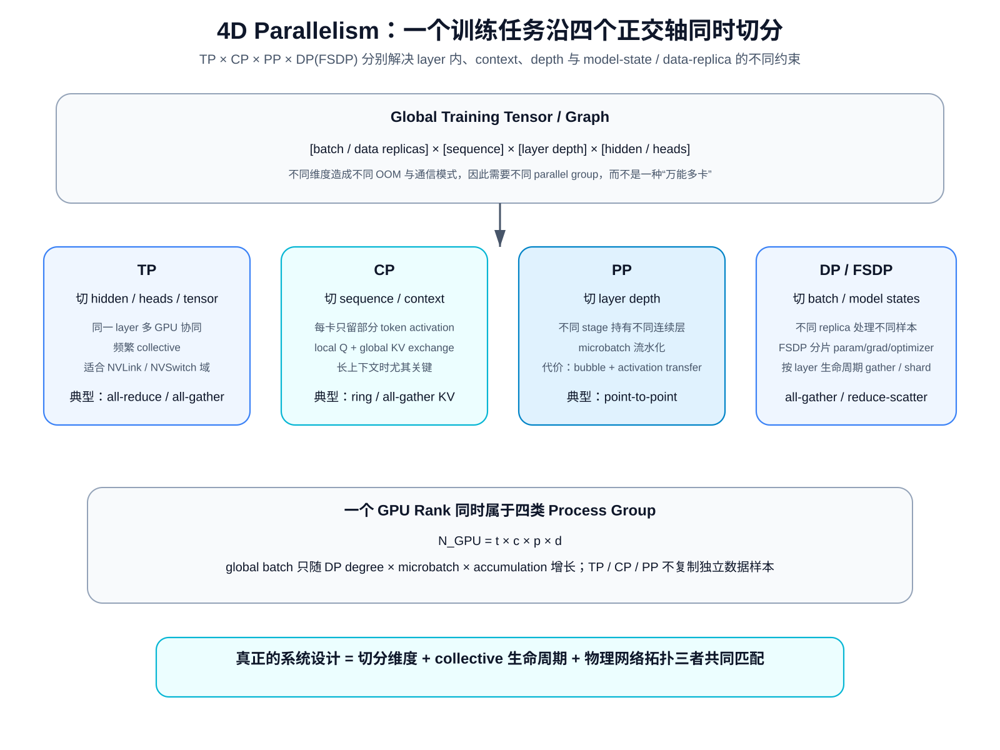
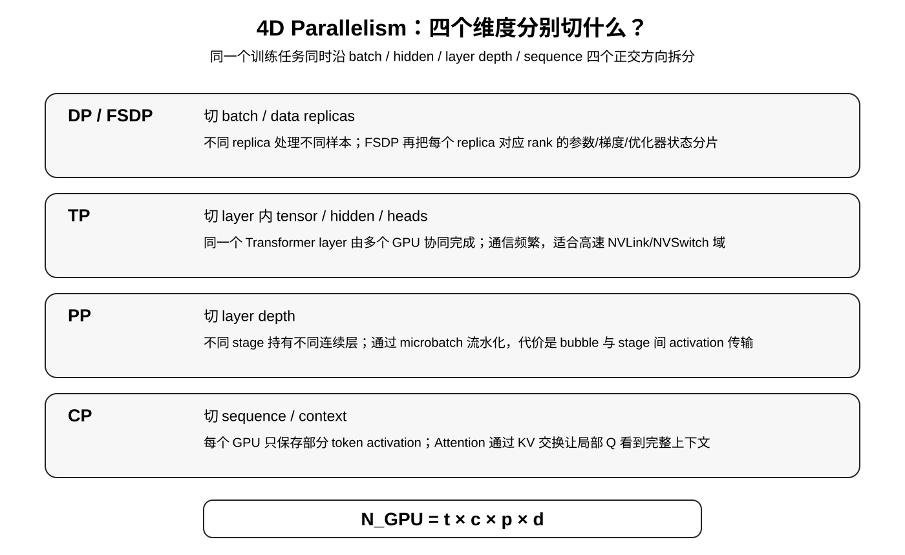
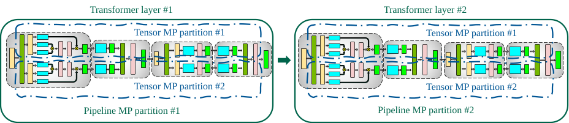
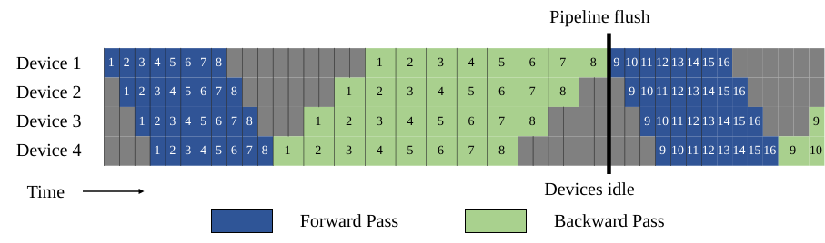
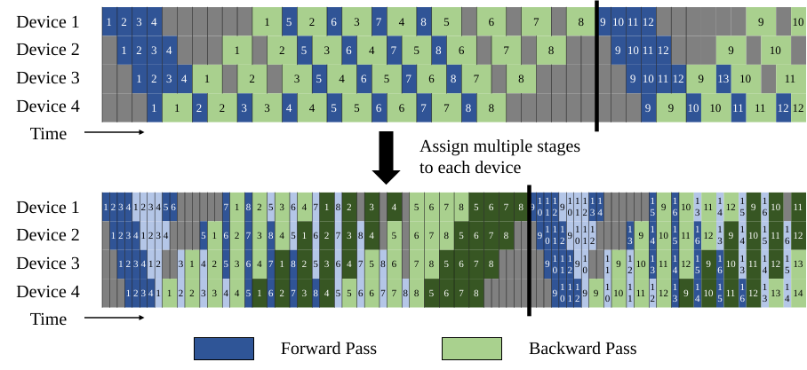
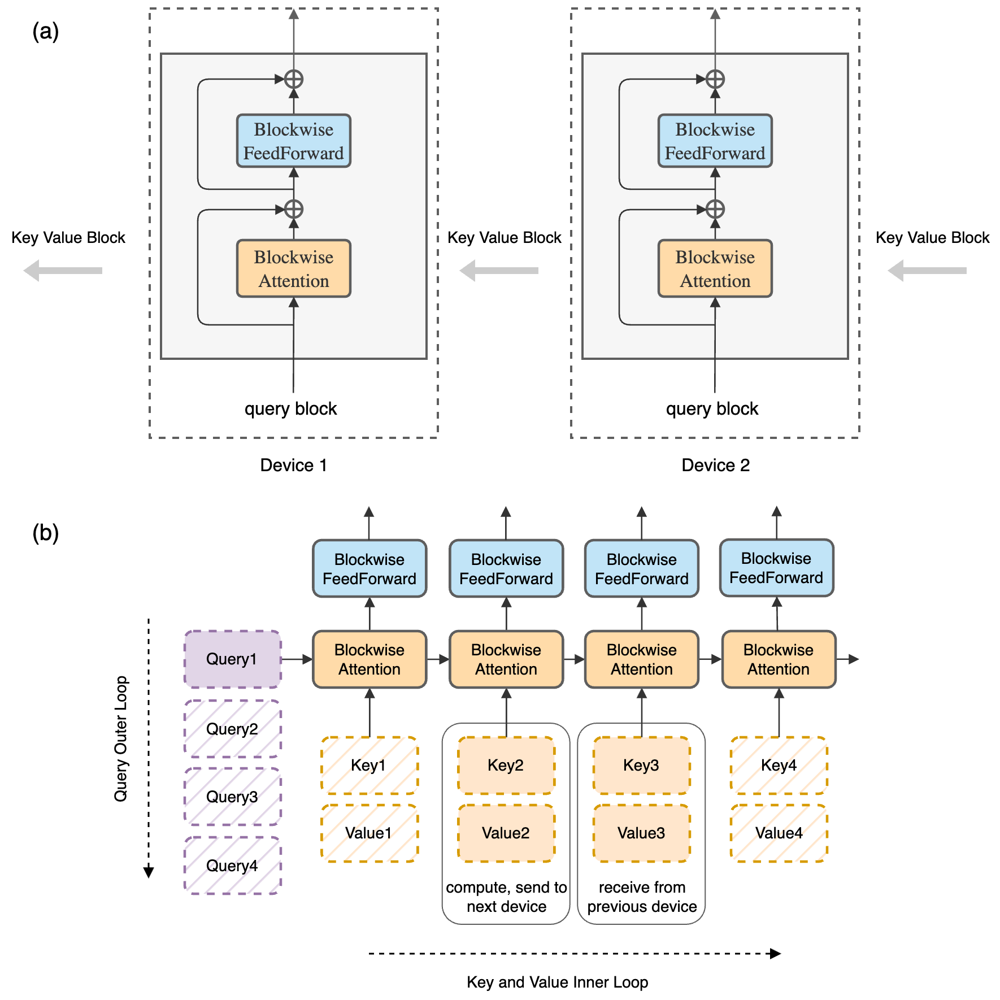
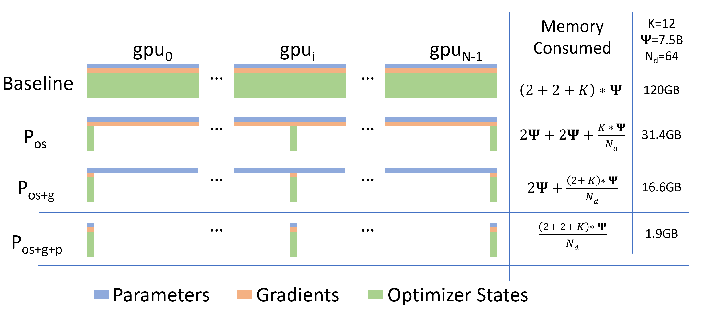
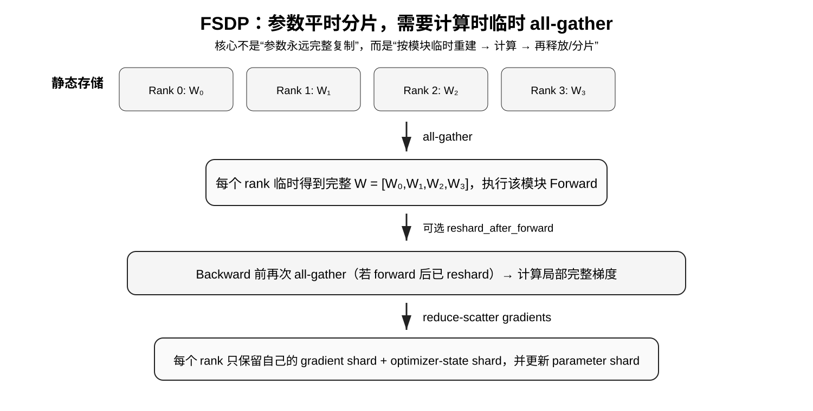
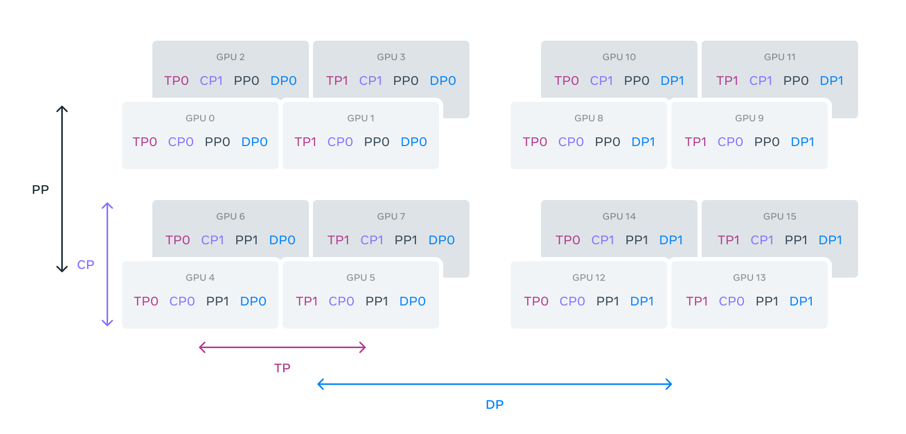

# 4D Parallelism：TP、PP、CP、FSDP 到底在切什么？

> **系统专题**：C001 · Distributed Training Systems  
> **主证据**：Llama 3、Megatron-LM、GPipe、ZeRO、Ring Attention、PyTorch FSDP 与 NVIDIA Megatron Core 官方文档。  
> **一句话定位**：超大模型训练不是“把模型扔到很多 GPU 上”，而是分别沿 layer 内 tensor、layer depth、sequence、data replica 四个正交方向分解工作，并让不同通信模式映射到合适的物理网络层级。

前置阅读：

- [Llama 3：完整模型级拆解](../../B/05-moe-complete-llm/B011-llama3.md)
- [FlashAttention：IO-aware exact attention](../../A/10-gpu-operators/A055-flashattention.md)
- [FlashAttention-2：GPU 内 work partition](../../A/10-gpu-operators/A056-flashattention2.md)

本文讨论的是 **多 GPU distributed parallelism**。FlashAttention-2 中的 sequence-level parallelism 属于单 GPU kernel 内的 thread-block decomposition；本文的 CP / TP / PP / FSDP 属于集群级执行，两者层级不同。

---

## 阅读导航

本文会从以下问题一路推导：

1. 单卡训练到底是什么东西放不下？
2. 为什么普通 Data Parallelism 不能解决超大模型显存问题？
3. TP / PP / CP / DP 分别切 tensor graph 的哪个方向？
4. 为什么 Llama 3 的 4D 应理解成：
   :::{math}
   TP\times CP\times PP\times DP(\mathrm{FSDP})
   :::
5. TP 为什么要组合 column-parallel 与 row-parallel linear？
6. PP 的 pipeline bubble 为什么是：
   :::{math}
   \frac{p-1}{m}
   :::
7. GPipe、1F1B、interleaved 1F1B 的差别是什么？
8. CP 为什么是 local Q + global KV interaction？
9. FSDP 的 all-gather / reduce-scatter 生命周期是什么？
10. global batch 为什么只乘 DP degree？
11. 一个 GPU 同时属于哪些 process groups？
12. Llama 3 为什么 128K context 会把大量 GPU 从 DP 转给 CP？
13. 为什么网络拓扑本身就是 parallelism design 的一部分？

---

## 总结架构图

> **教学总结图**：统一展示 TP、CP、PP、DP/FSDP 分别切分训练任务的哪个维度、引入什么通信，以及如何组合成 4D process groups。

# 一、先从单卡训练开始：显存到底花在哪里？

设模型有：

$$
\Psi
$$

个参数。

训练显存可以粗略拆成：

$$
M_{\mathrm{GPU}}
=
M_{\mathrm{param}}
+
M_{\mathrm{grad}}
+
M_{\mathrm{optimizer}}
+
M_{\mathrm{activation}}
+
M_{\mathrm{temporary}}.
$$

这几项的 scaling law 并不一样。

## 1. 模型状态：主要随参数量增长

以混合精度 Adam 为例，一个常见的粗略账本是：

- low-precision parameter：2 bytes；
- low-precision gradient：2 bytes；
- FP32 master weight：4 bytes；
- Adam first moment：4 bytes；
- Adam second moment：4 bytes。

那么可能接近：

$$
16\text{ bytes/parameter}.
$$

这不是所有训练栈都严格成立的常数，但足以做数量级判断。

例如：

$$
405B\times16\text{ bytes}
\approx6.48\text{ TB}.
$$

还没算 activation，就已经远超单卡 HBM。

## 2. Activation：主要随 batch、sequence、hidden、layers 增长

可以粗略写成：

$$
M_{\mathrm{act}}
\propto
B_{\mathrm{local}}
\times
S
\times
H
\times
L.
$$

因此 context 从 8K 增长到 128K 时：

$$
S\times16,
$$

即使模型参数完全不变，activation 也会突然成为核心瓶颈。

所以：

$$
\boxed{
\text{模型太大}
\neq
\text{上下文太长}
}
$$

它们是两种不同的 OOM 来源。

## 3. Runtime workspace 也必须算

还包括：

- GEMM workspace；
- attention temporary buffers；
- NCCL buffers；
- allocator fragmentation；
- fused kernel workspace；
- CUDA graph 相关内存。

所以真实约束是：

$$
M_{\text{states}}
+
M_{\text{activations}}
+
M_{\text{runtime}}
<
M_{\text{usable HBM}}.
$$

---

# 二、最简单的扩展：Data Parallelism

4 张 GPU 最自然的做法：

~~~text
GPU0: full model + data shard 0
GPU1: full model + data shard 1
GPU2: full model + data shard 2
GPU3: full model + data shard 3
~~~

每张卡独立 forward / backward，最后同步 gradients。

Data Parallelism 切的是：

$$
\boxed{\text{batch dimension}}
$$

若 global batch 为 $B$，DP degree 为 $d$，每个 replica 处理约：

$$
\frac{B}{d}.
$$

## 4. 为什么 DDP 不能让超大模型放得下？

因为每张 GPU 仍长期保存：

$$
\text{full parameters}
+
\text{full gradients}
+
\text{full optimizer states}.
$$

因此 DDP 可以扩 throughput，却不会把 model-state memory 自动除以 $d$。

如果：

$$
M_{\text{model states}}>M_{\text{GPU}},
$$

单纯增加 DP ranks 没有用。

---

# 三、4D Parallelism 是四个正交坐标

设：

$$
t=TP\ degree,\quad
c=CP\ degree,\quad
p=PP\ degree,\quad
d=DP\ degree.
$$

总 GPU 数：

$$
\boxed{
N_{\text{GPU}}
=
t\times c\times p\times d
}
$$

四个维度分别解决：

| 并行维度 | 切分对象 | 主要解决 | 典型通信 |
| --- | --- | --- | --- |
| TP | layer 内 tensor / hidden / heads | 单层矩阵太大 | all-reduce / reduce-scatter / all-gather |
| PP | layer depth | layer stack 太深 | stage 间 point-to-point activation |
| CP | sequence | 长 context activation | KV exchange / ring |
| DP / FSDP | batch / data replicas | throughput 与 state redundancy | gradient reduction；FSDP 还有 param all-gather |

---

# 四、一个最容易写错的概念：FSDP 不是第五维

Llama 3 的四个维度是：

$$
TP,\ CP,\ PP,\ DP.
$$

其中 Data Parallelism 使用 FSDP。

因此更严谨地写：

$$
\boxed{
TP\times CP\times PP\times DP(\mathrm{FSDP})
}
$$

而不是：

$$
TP\times CP\times PP\times DP\times FSDP.
$$

原因是 FSDP 描述的是：

> Data Parallel group 内，模型状态到底是 replicated 还是 sharded。

FSDP 仍保持 data-parallel 计算语义，只是改变了 model-state ownership。

---

# 五、Tensor Parallelism：切开一个 layer

先看：

$$
Y=XW,
$$

其中：

$$
X\in\mathbb R^{B\times H},
\qquad
W\in\mathbb R^{H\times K}.
$$

如果 $W$ 太大，可以沿输出维切：

$$
W=[W_1,W_2].
$$

于是：

$$
Y=[XW_1,XW_2].
$$

GPU0 保存 $W_1$，GPU1 保存 $W_2$。

这就是 column-parallel linear 的基本结构。

## 5.1 为什么切完不立即 gather？

如果下一步是逐元素激活：

$$
Z=\phi(Y),
$$

那么：

$$
\phi([Y_1,Y_2])
=
[\phi(Y_1),\phi(Y_2)].
$$

两个 GPU 可以继续本地执行。

因此好的 TP 设计不是“每切一次就同步一次”，而是尽量让下游算子继续消费 local shard。

## 5.2 Row Parallel：把 partial output 在最后相加

第二个 Linear：

$$
O=ZW_2.
$$

若：

$$
Z=[Z_1,Z_2],
$$

可把权重按输入维切：

$$
W_2=
\begin{bmatrix}
W_2^{(1)}\\
W_2^{(2)}
\end{bmatrix}.
$$

于是：

$$
O
=
Z_1W_2^{(1)}
+
Z_2W_2^{(2)}.
$$

每卡得到 partial output：

$$
O_1,\ O_2,
$$

最后 reduction：

$$
O=O_1+O_2.
$$

因此 Transformer MLP 中常见的结构是：

$$
\boxed{
\text{column parallel}
\rightarrow
\text{local activation}
\rightarrow
\text{row parallel}
\rightarrow
\text{collective}
}
$$

## 5.3 Attention 的 TP：切 heads

Multi-Head Attention：

$$
\operatorname{MHA}(X)
=
\operatorname{Concat}(head_1,\dots,head_h)W_O.
$$

在输出投影混合之前，不同 heads 天然可并行。

因此常见做法是：

$$
h
\rightarrow
\frac{h}{t}
\text{ heads per TP rank}.
$$

---

# 六、为什么 TP 极度依赖高速互联？

TP communication 发生在：

- 每个 microbatch；
- 每个 Transformer layer；
- 多个 tensor-parallel collective 点。

它进入 layer critical path 的频率很高。

Megatron-LM 的分析因此给出一个非常重要的系统经验：

> 如果单节点有 $g$ 张高速互联 GPU，通常优先把 TP 控制在单节点范围，再用 PP 等方式跨节点扩展。

也就是说：

$$
\boxed{
\text{通信频率越高}
\Rightarrow
\text{越应该放在低延迟高带宽链路}
}
$$

*原论文证据图。一个 pipeline stage 内还可以继续 tensor-parallel，所以 layer depth 和 layer 内 tensor 是两层不同切分。*

---

# 七、Pipeline Parallelism：切 layer depth

假设有 80 层 Transformer，PP degree：

$$
p=4.
$$

可以分成：

~~~text
Stage 0: layers 0-19
Stage 1: layers 20-39
Stage 2: layers 40-59
Stage 3: layers 60-79
~~~

PP 解决的是：

$$
\boxed{\text{完整 layer stack 放不下}}
$$

但如果整个 batch 一次通过每个 stage，会导致其他 stage 长时间空闲。

所以 PP 必须引入 microbatch。

---

# 八、Microbatch：把时间维也流水化

把一个 batch 切成 $m$ 个 microbatches：

~~~text
S0: F0 F1 F2 F3 ...
S1:    F0 F1 F2 ...
S2:       F0 F1 ...
S3:          F0 ...
~~~

Stage 0 处理完 microbatch 0 后就把 activation 发给 Stage 1，自己继续 microbatch 1。

这样不同 stage 才能同时工作。

---

# 九、GPipe：pipeline bubble 怎么来的？

设：

- pipeline stages 为 $p$；
- microbatches 为 $m$；
- 单 microbatch forward / backward 时间为 $t_f,t_b$。

pipeline 填充与排空需要：

$$
p-1
$$

个额外 stage slots。

bubble time：

$$
t_{\text{bubble}}
=
(p-1)(t_f+t_b).
$$

理想 compute time：

$$
t_{\text{ideal}}
=
m(t_f+t_b).
$$

所以：

$$
\boxed{
\text{bubble overhead}
=
\frac{p-1}{m}
}
$$

若要 bubble 小：

$$
m\gg p.
$$

## 9.1 为什么 microbatch 不能无限增多？

如果为了增大 $m$ 而把 microbatch size $b$ 压得很小：

- GEMM 变瘦；
- arithmetic intensity 降低；
- kernel launch overhead 占比上升。

因此：

$$
\boxed{
\text{microbatch size}
\leftrightarrow
\text{GEMM efficiency}
\leftrightarrow
\text{pipeline bubble}
}
$$

必须联合调。

---

# 十、GPipe 与 1F1B：主要差别是 activation lifetime

GPipe 常表现为：

~~~text
F F F F F F
B B B B B B
~~~

大量 forward activation 必须一直保留到 backward。

1F1B 在 steady state 中：

~~~text
F B F B F B
~~~

让 forward 与 backward 交错。

它不一定改变基本 flush bubble，但可以显著减少同时在途的 activation 数量。

因此 activation stash 从接近 $O(m)$ 降到更接近 pipeline depth $O(p)$。

---

# 十一、Interleaved 1F1B：用 virtual stages 缩小 bubble

如果每个 physical device 持有 $v$ 个 model chunks，单 chunk 时间约变成：

$$
\frac{t_f}{v},
\qquad
\frac{t_b}{v}.
$$

Megatron-LM 给出的 bubble fraction 变成：

$$
\boxed{
\frac{1}{v}\frac{p-1}{m}
}
$$

bubble 理论上缩小 $v$ 倍。

但代价是 stage boundary 变多，通信也更频繁。

所以：

$$
\boxed{
\text{smaller bubble}
\leftrightarrow
\text{more communication}
}
$$

---

# 十二、Sequence Parallelism 与 Context Parallelism 不一样

Megatron 体系里这两个词容易混。

Sequence Parallelism 通常是 TP 的配套优化，主要把：

- LayerNorm；
- Dropout；
- 某些 elementwise activation；

沿 sequence 维分片，减少 replicated activation。

Context Parallelism 更彻底：

$$
X\in\mathbb R^{B\times S\times H}
$$

直接沿：

$$
S
$$

切成多个 context shards。

每个 CP rank 只保存：

$$
\frac{S}{c}
$$

长度的 tokens 与 activation。

---

# 十三、为什么 Linear 可以 local，Attention 不可以？

Linear：

$$
Y_i=X_iW
$$

只依赖当前 token。

LayerNorm 主要在 hidden dimension 上操作。

所以每个 token shard 可以独立处理。

但 self-attention：

$$
O_i
=
\operatorname{softmax}(Q_iK^\top)V.
$$

即使一个 rank 只拥有 local queries：

$$
Q_i,
$$

它仍必须访问整个 sequence 的 K/V。

因此 CP 的本质是：

$$
\boxed{
\text{local Q}
+
\text{global KV interaction}
}
$$

---

# 十四、Ring Attention：不一次性 gather 全部 KV，而让 KV block 流动

假设 $c=4$：

~~~text
GPU0: Q0 K0 V0
GPU1: Q1 K1 V1
GPU2: Q2 K2 V2
GPU3: Q3 K3 V3
~~~

GPU0 固定拥有 $Q_0$。

第一轮消费 $K_0,V_0$，同时 KV block 发给下一 rank。

随后继续消费从邻居收到的 KV block。

经过 $c$ 轮后，$Q_0$ 已与完整 context 的所有 KV blocks 交互。

这和 FlashAttention 的 blockwise online softmax 非常契合：

$$
\boxed{
\text{distributed KV movement}
+
\text{local blockwise exact attention}
}
$$

CP 并不会把 exact attention 变成 sparse attention，它只是改变了计算和数据放在哪张 GPU 上。

---

# 十五、CP 也不是免费的

$c\uparrow$ 时：

- local sequence length 下降；
- activation memory 下降；
- local attention compute 下降。

但每个 local Q 最终仍要获得 global KV information。

因此：

$$
\boxed{
\text{CP trades local memory for distributed communication}
}
$$

它和 activation recomputation 之间也存在直接 trade-off：

- recomputation：多算；
- CP：多通信。

哪一个更划算取决于 GPU FLOPs 与网络 bandwidth 的相对价格。

# 十六、FSDP：为什么它仍然属于 Data Parallelism？

普通 DDP：

~~~text
Rank0: full param + full grad + full optimizer
Rank1: full param + full grad + full optimizer
Rank2: full param + full grad + full optimizer
Rank3: full param + full grad + full optimizer
~~~

这里存在巨大的 model-state redundancy。

ZeRO 的核心观察是：

> data-parallel workers 没必要在整个训练生命周期里永久保存完整的全部 model states。

---

# 十七、ZeRO 的三个经典阶段

设 DP degree 为 $d$。

ZeRO-1：

$$
\boxed{\text{shard optimizer states}}
$$

ZeRO-2：

$$
\boxed{\text{shard optimizer states + gradients}}
$$

ZeRO-3：

$$
\boxed{\text{shard optimizer states + gradients + parameters}}
$$

现代 FSDP full-shard 与 ZeRO-3 在概念上非常接近。

---

# 十八、FSDP 的第一性原理：平时存 shard，算到该模块时临时重建

设参数：

$$
W=[W_0,W_1,W_2,W_3].
$$

4 个 FSDP ranks 平时只保存：

~~~text
Rank0: W0
Rank1: W1
Rank2: W2
Rank3: W3
~~~

执行某个 module forward 前：

$$
\operatorname{all\_gather}
$$

临时重建完整：

$$
W.
$$

计算完成后可以重新 reshard 并释放 full parameter。

## 18.1 为什么 backward 可能还要再 all-gather？

如果 forward 后立即 reshard：

~~~text
all-gather W
forward
free full W
~~~

到 backward 时又需要该 layer 的权重计算 $dX,dW$。

因此需要再次 all-gather。

所以：

$$
\boxed{
\text{more aggressive reshard}
\Rightarrow
\text{less HBM}
+
\text{more communication}
}
$$

Llama 3 的实现选择之一就是 forward 后不立即 reshard 某些参数，从而牺牲一部分显存换掉 backward 前的一次通信。

---

# 十九、为什么 gradient 特别适合 reduce-scatter？

普通 DDP：

$$
G
=
\sum_r G^{(r)}
$$

之后所有 rank 都拿到完整 gradient。

但 FSDP optimizer 最终只需要每个 rank 自己负责的 gradient shard。

所以可以直接使用：

$$
\boxed{\operatorname{reduce\_scatter}}
$$

把 reduction 与 ownership 分发一步完成。

---

# 二十、FSDP 的内存不能简单写成除以 d

长期 model-state memory 确实近似：

$$
M_{\text{persistent}}
\propto
\frac{1}{d}.
$$

但 peak memory 还包括：

- 当前 module 的 transient full parameters；
- prefetch；
- communication buffers；
- activations；
- runtime workspace。

所以更合理地写：

$$
M_{\text{peak}}
\approx
\frac{M_{\text{persistent states}}}{d}
+
M_{\text{transient all-gather}}
+
M_{\text{activation}}
+
M_{\text{workspace}}.
$$

---

# 二十一、FSDP2 为什么强调 module grouping？

PyTorch 当前 FSDP2 的核心语义是：

某个 fully-sharded module 在 forward 前 all-gather 它的一组参数，在 backward 后 reduce-scatter 对应 gradients。

如果整个模型只有一个巨大的 communication group：

- all-gather 很大；
- transient memory 高；
- 难以 overlap。

如果按 Transformer block 合理分组：

可以做：

$$
\boxed{
\text{prefetch next block}
\parallel
\text{compute current block}
}
$$

从而把通信隐藏在计算后面。

---

# 二十二、最关键的公式：global batch 只乘 DP

设：

- microbatch size：
  :::{math}
  b
  :::
- 每个 pipeline iteration 的 microbatch 数：
  :::{math}
  m
  :::
- DP degree：
  :::{math}
  d
  :::

那么：

$$
\boxed{
B_{\text{global}}
=
b\times m\times d
}
$$

为什么没有 $t,c,p$？

因为：

- TP ranks 一起算同一个样本的同一个 layer；
- PP stages 一起算同一个样本的不同 layers；
- CP ranks 一起算同一个样本的不同 token shards；
- 只有 DP ranks 在处理不同数据 replicas。

---

# 二十三、一个 16 GPU 例子

设：

$$
TP=2,\quad
CP=2,\quad
PP=2,\quad
DP=2.
$$

总 GPU：

$$
2\times2\times2\times2
=
16.
$$

若：

$$
b=1,\quad m=8,
$$

global batch：

$$
B_{\text{global}}
=
1\times8\times2
=
16.
$$

不是 128。

因为一个 data replica 本身已经消耗：

$$
TP\times CP\times PP
=
8
$$

张 GPU。

---

# 二十四、一个样本到底占多少 GPU？

定义：

$$
M_{\text{model-parallel}}
=
t\times c\times p.
$$

一个 logical data replica 需要：

$$
M_{\text{model-parallel}}
$$

张 GPU。

整个集群则有 $d$ 个 data replicas：

$$
N_{\text{GPU}}
=
M_{\text{model-parallel}}\times d.
$$

这比死记 $tcpd$ 更容易建立直觉。

---

# 二十五、FSDP 下为什么还叫 data replica？

必须区分：

$$
\boxed{\text{logical compute replica}}
$$

和：

$$
\boxed{\text{physical storage replica}}
$$

FSDP ranks：

- 处理不同数据；
- 保持 data-parallel 优化语义；

但参数状态不再永久完整复制。

因此：

> **DP 描述计算语义；FSDP 描述 model-state storage 与 communication strategy。**

---

# 二十六、一个 GPU 同时属于四种 process group

每个 rank 可以用坐标：

$$
(r_d,r_p,r_c,r_t)
$$

表示。

某个 rank 同时属于：

## TP group

固定 $d,p,c$，只让 $t$ 变化。

## CP group

固定 $d,p,t$，只让 $c$ 变化。

## PP chain

固定 $d,c,t$，只让 $p$ 变化。

## DP / FSDP group

固定 $p,c,t$，只让 $d$ 变化。

所以 distributed runtime 的一个核心工作就是创建这些互相正交的 communicators。

---

# 二十七、Llama 3 原论文的 4D group

读这张图最重要的不是 GPU 编号，而是：

> 同一个 rank 同时属于多个逻辑 group；每个 group 对应一种不同通信图。

---

# 二十八、为什么 process-group layout 会直接影响性能？

通信时间可以粗略写成：

$$
T_{\text{comm}}
=
\alpha N_{\text{messages}}
+
\beta V_{\text{bytes}}.
$$

其中：

- $\alpha$：latency；
- $\beta$：inverse bandwidth；
- $N_{\text{messages}}$：消息次数；
- $V_{\text{bytes}}$：数据量。

TP 的 $N_{\text{messages}}$ 很高，因此非常依赖低 latency。

PP 通常只在 stage boundary point-to-point。

CP 主要围绕 attention KV exchange。

FSDP 是 module 粒度的 parameter all-gather / gradient reduce-scatter。

所以不同维度应该映射到不同物理网络层级。

---

# 二十九、典型 topology-aware 原则

一台多 GPU server 内：

~~~text
NVLink / NVSwitch
→ 高带宽、低延迟
~~~

跨服务器：

~~~text
InfiniBand / RoCE
→ 相对更高延迟、更低有效带宽
~~~

因此常见策略是：

- 高频 TP 尽量留在单节点；
- PP 更适合跨节点；
- CP 与 FSDP 的 placement 根据实际网络与 workload 调整。

这不是固定规则，但背后的原则固定：

$$
\boxed{
\text{高频通信维度优先使用最快互联}
}
$$

---

# 三十、communication overlap 为什么和通信量同样重要？

完全串行：

$$
T=T_{\text{compute}}+T_{\text{comm}}.
$$

如果能完全 overlap：

$$
T\approx
\max(T_{\text{compute}},T_{\text{comm}}).
$$

所以优化目标从来不只是：

$$
\min V_{\text{bytes}}.
$$

还必须问：

$$
\boxed{
\text{这些 bytes 能不能藏在有用计算后面？}
}
$$

Ring Attention 的 KV 传输、FSDP prefetch、gradient reduce-scatter overlap 都属于这类设计。

---

# 三十一、Llama 3：三个真实配置

405B / 8K / 8192 GPUs：

$$
TP=8,\quad
CP=1,\quad
PP=16,\quad
DP=64.
$$

验证：

$$
8\times1\times16\times64
=
8192.
$$

405B / 8K / 16384 GPUs：

$$
TP=8,\quad
CP=1,\quad
PP=16,\quad
DP=128.
$$

验证：

$$
8\times1\times16\times128
=
16384.
$$

405B / 128K / 16384 GPUs：

$$
TP=8,\quad
CP=16,\quad
PP=16,\quad
DP=8.
$$

验证：

$$
8\times16\times16\times8
=
16384.
$$

---

# 三十二、为什么 128K 会把 GPU 从 DP 转给 CP？

8K 时：

$$
CP=1.
$$

128K 时：

$$
CP=16.
$$

而 DP：

$$
128\rightarrow8.
$$

GPU 总数仍是：

$$
16384.
$$

这说明系统把大量 GPU 从：

$$
\text{more independent samples}
$$

重新分配给：

$$
\text{one sample's context dimension}.
$$

因此：

$$
\boxed{
\text{long-context training}
\Rightarrow
\text{more intra-sample parallelism}
}
$$

这是理解现代长上下文训练非常重要的一条系统规律。

---

# 三十三、为什么不能 128K 仍然保持 DP=128？

如果仍保持：

$$
TP=8,\ CP=1,\ PP=16,
$$

一个 model-parallel replica 只有：

$$
8\times1\times16
=
128
$$

张 GPU。

128K sample 的 activation / attention workload 会成为主要限制。

提高 CP 到 16 后：

$$
8\times16\times16
=
2048
$$

张 GPU 共同参与一个 logical model replica。

于是 DP 只能：

$$
\frac{16384}{2048}
=
8.
$$

本质是固定总 GPU budget 下的资源重分配。

---

# 三十四、Llama 3 的 MFU 变化也说明并行不是免费的

论文报告 BF16 MFU 大约：

- 8192 GPUs / 8K：43%；
- 16384 GPUs / 8K：41%；
- 16384 GPUs / 128K：38%。

MFU：

$$
\text{MFU}
=
\frac{\text{useful model FLOPs}}
{\text{hardware peak FLOPs}}.
$$

随着集群与 parallel topology 变复杂：

- collective；
- bubble；
- synchronization；
- memory stalls；
- network congestion；

都会侵蚀有效利用率。

---

# 三十五、为什么 GPU 更多甚至可能更慢？

如果增加 GPU 只能通过继续提高 TP / PP / CP 来使用：

- TP shard 变小；
- GEMM efficiency 下降；
- PP bubble 增大；
- CP communication group 增大；
- synchronization critical path 变长。

所以：

$$
\boxed{
N_{\text{GPU}}\uparrow
\not\Rightarrow
T_{\text{step}}\downarrow
}
$$

这就是 strong-scaling limit。

---

# 三十六、Megatron 的关键 trade-off：TP 与 PP

固定：

$$
n=t\times p.
$$

提高 TP：

$$
t\uparrow
\Rightarrow
p\downarrow.
$$

PP bubble：

$$
\frac{p-1}{m}
$$

会下降。

但 TP high-frequency collective 会增加。

所以存在：

$$
\boxed{
\text{TP communication}
\leftrightarrow
\text{PP bubble}
}
$$

的平衡点。

---

# 三十七、DP 与 PP 也会互相影响

若：

$$
n=p\times d,
$$

每个 pipeline 的 microbatch 数：

$$
m=\frac{B}{bd}.
$$

因为：

$$
p=\frac{n}{d},
$$

bubble：

$$
\frac{p-1}{m}
=
\frac{n/d-1}{B/(bd)}
=
\frac{b(n-d)}{B}.
$$

提高 DP degree 会减少 pipeline depth，从而有机会降低 bubble。

但前提是更小的 model-parallel group 仍然能放下模型。

---

# 三十八、parallel degrees 是联合优化，不是四个旋钮独立调

错误思路：

~~~text
TP 尽可能大
PP 尽可能大
CP 越大越省内存
FSDP degree 越大越好
~~~

正确问题是联合选择：

$$
(t,c,p,d,b,m).
$$

约束：

$$
tcpd=N_{\text{GPU}},
$$

$$
bmd=B_{\text{global}},
$$

$$
M_{\text{peak}}<M_{\text{HBM}}.
$$

还必须满足：

- hidden/head divisibility；
- layer divisibility；
- sequence divisibility；
- network topology；
- target global batch；
- collective efficiency。

---

# 三十九、把问题写成一个系统优化目标

目标：

$$
\min
T_{\text{step}}.
$$

概念性拆分：

$$
T_{\text{step}}
=
T_{\text{compute}}
+
T_{\text{unhidden communication}}
+
T_{\text{pipeline bubble}}
+
T_{\text{sync}}
+
T_{\text{runtime}}.
$$

所以不是简单最小化 FLOPs，也不是简单最小化通信 bytes。

---

# 四十、一个实用的选择顺序

这不是绝对规则，但适合作为起点。

## 1. 模型能放下时，优先 DP / FSDP 扩吞吐

保持较大的 GEMM granularity。

## 2. 单层矩阵太大，增加 TP

优先控制在高速 intra-node domain。

## 3. layer stack 太深，增加 PP

按 depth 切 model。

## 4. long-context activation 成为瓶颈，增加 CP

直接切 sequence，而不是无限提高 TP。

## 5. 剩余 GPU 用 DP / FSDP

$$
d=
\frac{N}{tcp}.
$$

---

# 四十一、为什么 long context 时 CP 常比继续加 TP 更合理？

继续加 TP 会把：

- MLP GEMM；
- attention projections；

都切得更碎。

但 long-context 的核心增长来自 sequence activation 与 attention workload。

CP 直接针对：

$$
S
$$

这一维。

因此更符合：

$$
\boxed{
\text{瓶颈在哪个维度增长}
\Rightarrow
\text{优先切哪个维度}
}
$$

---

# 四十二、FSDP 和 activation checkpointing 为什么常一起用？

FSDP 主要压：

$$
M_{\text{model states}}.
$$

Activation checkpointing 主要压：

$$
M_{\text{activation}}.
$$

作用对象不同。

超大模型训练常见：

$$
\boxed{
\text{FSDP}
+
\text{activation recomputation}
}
$$

前者用通信换显存，后者用计算换显存。

---

# 四十三、四种并行各自过度使用会发生什么？

## TP 太大

- sub-GEMM 太小；
- collective 占比高；
- 容易跨节点。

## PP 太大

- bubble 增长；
- stage imbalance；
- activation boundary 增多。

## CP 太大

- KV communication group 增大；
- local workload 过小；
- communication overlap 变难。

## FSDP / DP 太大

- all-gather / reduce-scatter group 增大；
- global batch 约束更强；
- 更容易跨 rack / pod。

---

# 四十四、一个诊断表

| 症状 | 优先检查 |
| --- | --- |
| 单层 weight / GEMM 太大 | TP |
| 总 layer stack 放不下 | PP |
| long-context activation OOM | CP / recomputation |
| optimizer / grad / param redundancy 太大 | FSDP |
| pipeline bubble 高 | microbatch / PP / interleaving |
| TP collective 慢 | TP degree / node mapping |
| CP communication 慢 | CP degree / ring overlap |
| FSDP stall | module grouping / prefetch / reshard |
| GPU 很多但 MFU 低 | topology + parallel-degree balance |

---

# 四十五、和 FlashAttention-2 的联系

FlashAttention-2 问：

> 一个 GPU 内 thread blocks / warps 怎么划分 work ownership？

4D parallelism 问：

> 一个集群内 GPUs 怎么划分 tensor / depth / sequence / data ownership？

两者背后都是同一组系统问题：

$$
\boxed{\text{谁拥有数据？}}
$$

$$
\boxed{\text{谁负责计算？}}
$$

$$
\boxed{\text{哪些 partial results 必须通信？}}
$$

$$
\boxed{\text{通信能否与计算 overlap？}}
$$

---

# 四十六、4D 不是并行维度的上限

Dense Llama 3：

$$
TP\times CP\times PP\times DP.
$$

MoE 模型还会引入：

$$
EP=\text{Expert Parallelism}.
$$

于是可以出现：

$$
TP\times CP\times PP\times DP\times EP.
$$

后续还可能有：

- expert tensor parallel；
- hierarchical data parallel；
- sequence parallel。

所以“4D”只是当前 dense Transformer 的核心四轴，不是一个永远固定的标准。

---

# 四十七、最终应该记住什么？

不要先问：

> TP 应该设几？

先问四件事：

## 第一：哪类资源放不下？

$$
\text{model states / activations / runtime}
$$

## 第二：瓶颈沿哪个逻辑维度增长？

$$
\text{hidden / depth / sequence / batch}
$$

## 第三：切完会产生什么 communication？

$$
\text{collective / p2p / KV movement / all-gather}
$$

## 第四：这种通信应该映射到哪一级网络？

$$
\text{NVLink / node / rack / pod}
$$

从第一性原理看，4D parallelism 最终就是：

$$
\boxed{
\text{logical decomposition}
+
\text{communication ownership}
+
\text{hardware topology}
}
$$

---

# 四十八、整条逻辑压缩

~~~text
单卡训练
│
├── 单层矩阵太大
│     └── TP：切 layer 内 tensor
│
├── layer stack 太深
│     └── PP：切 depth
│
├── sequence 太长
│     └── CP：切 context
│
└── data-parallel model states 重复
      └── FSDP：在 DP 维分片 model states

总 GPU：
N = TP × CP × PP × DP
~~~

而真实性能由：

~~~text
logical partition
→ communication pattern
→ process-group mapping
→ physical network topology
→ overlap / bubble / kernel efficiency
→ step time / MFU
~~~

共同决定。

---

# 参考原始资料

- Meta AI, **The Llama 3 Herd of Models**, arXiv:2407.21783.
- Narayanan et al., **Efficient Large-Scale Language Model Training on GPU Clusters Using Megatron-LM**, arXiv:2104.04473.
- Huang et al., **GPipe: Efficient Training of Giant Neural Networks using Pipeline Parallelism**, arXiv:1811.06965.
- Rajbhandari et al., **ZeRO: Memory Optimizations Toward Training Trillion Parameter Models**, arXiv:1910.02054.
- Liu et al., **Ring Attention with Blockwise Transformers for Near-Infinite Context**, arXiv:2310.01889.
- PyTorch, **Fully Sharded Data Parallel / FSDP2 documentation**.
- NVIDIA, **Megatron Core Parallelism Strategies Guide** 与 **Context Parallelism Guide**.

